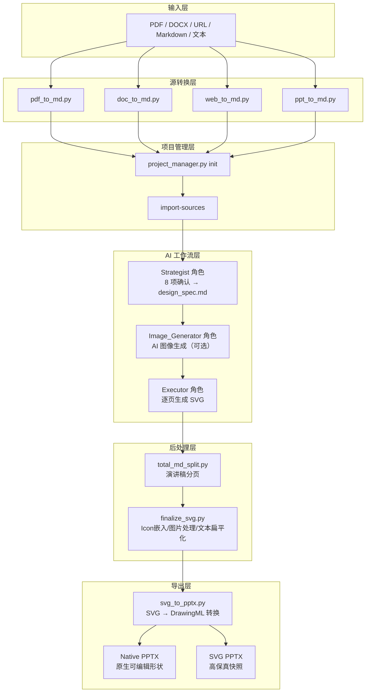
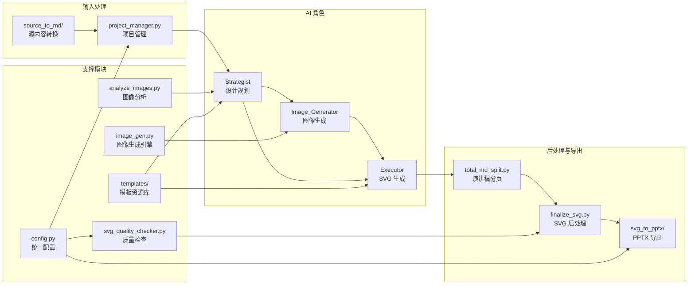
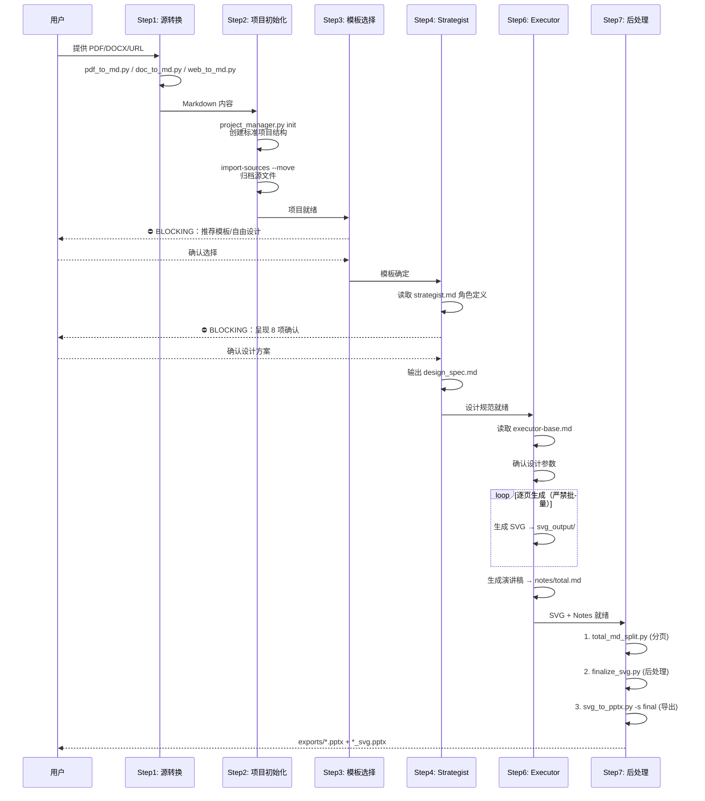
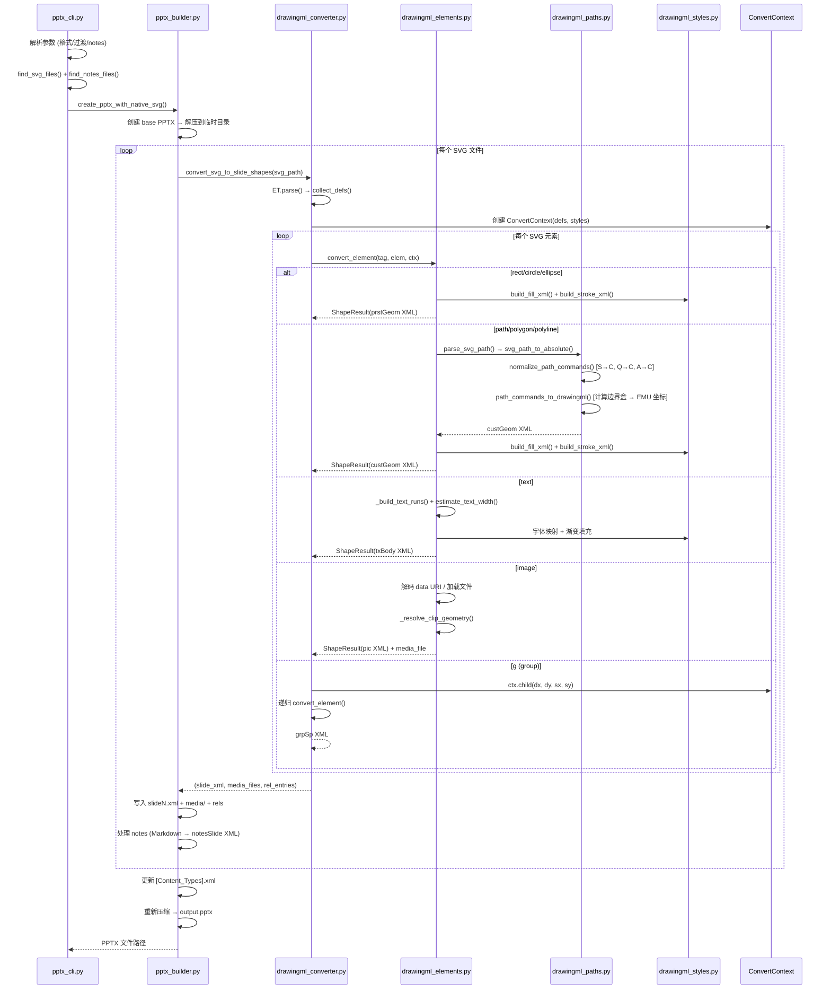

# ppt-master 源码学习笔记

> 仓库地址：[ppt-master](https://github.com/hugohe3/ppt-master)
> 学习日期：2026/04/15

---

> **以下为 AI 源码分析**
>
> ### 一句话概括
>
> ppt-master 是一个 AI 驱动的演示文稿生成系统，通过多角色协作（Strategist → Image_Generator → Executor）将源文档转换为**原生可编辑的 PPTX**，核心技术是将 AI 生成的 SVG 精确转换为 PowerPoint DrawingML 原生形状。
>
> ### 要点速览
>
> | 核心模块 | 职责 | 关键文件 |
> |---------|------|---------|
> | 源内容转换 | 多格式文档→Markdown | `scripts/source_to_md/pdf_to_md.py` 等 |
> | 项目管理 | 项目生命周期管理 | `scripts/project_manager.py` |
> | AI 工作流 | Strategist→Executor 角色协作 | `references/strategist.md`, `references/executor-base.md` |
> | SVG 后处理 | Icon 嵌入/图片处理/文本扁平化 | `scripts/finalize_svg.py`, `scripts/svg_finalize/` |
> | SVG→PPTX 转换 | SVG 元素→DrawingML 原生形状 | `scripts/svg_to_pptx/drawingml_converter.py` |
> | 图像生成 | 多后端 AI 图片生成 | `scripts/image_gen.py` (17 个 backend) |
> | 模板系统 | 布局模板与图表库 | `templates/layouts/`, `templates/charts/` |
> | 质量检查 | SVG 规范验证 | `scripts/svg_quality_checker.py` |

---

## 项目简介

ppt-master 解决了 AI 演示文稿生成领域的核心痛点：现有工具生成的 PPT 要么是不可编辑的截图/图片，要么是简陋的文本框+列表。ppt-master 输出的每一个元素（形状、文本框、图表）都是 PowerPoint 原生的 DrawingML 对象，可以直接点击编辑——就像手动制作的一样。

项目采用 **SVG 作为中间格式**，原因是 SVG 和 DrawingML 共享相同的"绝对坐标 2D 矢量图形"世界观，AI 生成 SVG 的可靠性远高于直接生成 DrawingML XML，同时 SVG 可在浏览器中预览调试。整条管道在本地运行，数据不上传第三方服务器，支持 Claude Code / Cursor / VS Code Copilot 等多种 AI 编辑器。

## 技术栈

| 类别 | 技术 |
|------|------|
| 语言 | Python 3.10+, JavaScript (Node.js 18+, 可选) |
| 核心依赖 | python-pptx (PPTX 生成), PyMuPDF (PDF 解析), mammoth (DOCX), markdownify (HTML→MD) |
| 图像处理 | Pillow, numpy, cairosvg/svglib (SVG→PNG) |
| 网络爬取 | requests, curl_cffi (TLS 指纹规避), beautifulsoup4 |
| AI 图像生成 | google-genai, openai SDK (多后端) |
| 构建/部署 | pip (依赖管理), GitHub Actions (Pages 部署) |
| 测试框架 | 无独立测试框架（工具脚本项目，以 SVG quality checker 为质量保障） |

## 目录结构

```
ppt-master/
├── skills/ppt-master/          # 核心 skill 包
│   ├── SKILL.md                # 工作流主入口定义（7 步流水线）
│   ├── references/             # AI 角色定义与技术规范
│   │   ├── strategist.md       #   Strategist 角色（8 项确认 + 设计规范）
│   │   ├── executor-base.md    #   Executor 基础规则
│   │   ├── shared-standards.md #   SVG 技术约束（黑名单/白名单）
│   │   ├── canvas-formats.md   #   9 种 Canvas 格式规范
│   │   └── image-layout-spec.md#   图像布局自动计算规范
│   ├── scripts/                # 可执行工具脚本
│   │   ├── source_to_md/       #   源内容转换模块（PDF/DOCX/Web/PPT→MD）
│   │   ├── svg_to_pptx/       #   SVG→PPTX 转换引擎（DrawingML 生成）
│   │   ├── svg_finalize/      #   SVG 后处理模块（icon/图片/文本/圆角）
│   │   ├── image_backends/    #   17 个 AI 图像生成后端
│   │   ├── template_import/   #   模板导入与规范化
│   │   ├── project_manager.py #   项目生命周期管理
│   │   ├── finalize_svg.py    #   SVG 后处理统一入口
│   │   ├── svg_to_pptx.py     #   PPTX 导出入口
│   │   ├── image_gen.py       #   AI 图像生成统一入口
│   │   └── svg_quality_checker.py # SVG 质量检查
│   ├── templates/              # 模板资源库
│   │   ├── layouts/            #   20 个页面布局模板（5 大分类）
│   │   ├── charts/             #   52 个图表/可视化模板（8 大类别）
│   │   └── icons/              #   640+ 矢量图标（chunk/tabler 库）
│   └── workflows/              # 独立工作流
│       └── create-template.md  #   模板创建工作流
├── examples/                   # 15 个示例项目（229 页）
├── projects/                   # 用户项目工作空间
├── docs/                       # 文档（FAQ/技术设计/安装指南）
├── index.html                  # Gallery 首页
├── viewer.html                 # 幻灯片在线查看器
├── CLAUDE.md                   # Claude Code 项目配置
├── AGENTS.md                   # 通用 AI Agent 配置
└── requirements.txt            # Python 依赖
```

## 架构设计

### 整体架构

ppt-master 采用 **"AI 工作流 + 工程转换管道"** 的分层架构。上层是 AI 多角色协作流程（Strategist 规划设计、Executor 生成 SVG），下层是确定性的工程脚本管道（源转换→后处理→PPTX 导出）。两层通过 `design_spec.md` 规范文件解耦——Strategist 输出规范，Executor 消费规范。



### 核心模块

#### 1. 源内容转换模块 (`scripts/source_to_md/`)

**职责**：将多种格式的源文档统一转换为 Markdown，作为 AI 分析的输入。

**核心文件**：
- `pdf_to_md.py`：通过 PyMuPDF 提取文本/表格/图片。关键函数 `analyze_font_sizes()` 使用加权频率统计推断标题级别，`should_keep_image()` 通过多条件过滤（面积、像素、字节、宽高比、MD5 去重）剔除装饰性图片
- `doc_to_md.py`：统一处理 DOCX/HTML/EPUB/IPYNB（纯 Python），其余格式降级到 pandoc。图片处理三层策略：data URI 解码 → 本地路径复制 → 远程 URL 下载
- `web_to_md.py`：核心是 `find_main_content()` 函数，先尝试预定义选择器（含中文 CMS 常用 class/id），再用密度评分算法（文本长度 + 中文字符权重 × 2）选取主内容容器。支持 `curl_cffi` 的 TLS 指纹模拟绕过 WeChat 等站点封锁
- `ppt_to_md.py`：基于 python-pptx 递归展开 grouped shapes，按 `(top, left)` 排序模拟阅读顺序

#### 2. SVG→PPTX 转换引擎 (`scripts/svg_to_pptx/`)

**职责**：将 SVG 精确转换为 PowerPoint DrawingML 原生形状，这是项目的核心工程价值。

**核心文件与关键函数**：
- `drawingml_converter.py`：元素调度中枢。`convert_svg_to_slide_shapes()` 解析 SVG 树，`collect_defs()` 收集渐变/标记定义，`convert_element()` 分发至具体转换器
- `drawingml_elements.py`（1159 行，最核心）：
  - `convert_rect/circle/ellipse/line/path/polygon/polyline/text/image` — 9 类 SVG 元素的完整转换器
  - `convert_text()` 支持多 `<tspan>` run、渐变文本填充、CJK 字体映射，通过 `estimate_text_width()` 按字符类别（CJK/宽字符/窄字符）估算文本宽度
  - `convert_circle()` 内含**甜甜圈图表检测算法**：当 `stroke-width/radius ≥ 0.15` 且有 `stroke-dasharray` 时，生成填充环形段而非简单圆形
  - `_resolve_clip_geometry()` 处理 `clipPath` → DrawingML 几何体映射（circle → `prst="ellipse"`，圆角矩形 → `prst="roundRect"`）
- `drawingml_paths.py`（430 行）：SVG 路径标准化管道 `parse → absolute → normalize → drawingml`。核心算法 `_arc_to_cubic_beziers()` 实现 SVG 规范 F.6.5 弧线分解（端点参数化→中心参数化→分段 Bezier 逼近）
- `drawingml_styles.py`：填充/描边/效果处理。线性渐变通过 `atan2(y2-y1, x2-x1)` 计算角度，径向渐变映射为 `<a:path path="circle">`，箭头标记通过 `_classify_marker()` 分类为 triangle/stealth/diamond/oval
- `drawingml_context.py`：`ConvertContext` 类管理转换状态，`child()` 方法实现变换累积（先缩放后平移）和不透明度乘法继承
- `pptx_builder.py`：PPTX 打包，支持 media 缓存去重（SHA-256 哈希），同时生成 native 和 legacy 两种输出
- `drawingml_utils.py`：EMU 单位转换（`EMU_PER_PX = 9525`，96 DPI），30+ CJK 字体映射表

#### 3. SVG 后处理模块 (`scripts/svg_finalize/`)

**职责**：将 AI 生成的原始 SVG 处理为可导出状态，解决 PowerPoint 兼容性问题。

**核心文件**（必须按顺序执行）：
- `embed_icons.py`：将 `<use data-icon="..."/>` 占位符替换为实际 icon SVG 路径（PowerPoint 不理解 `<use>` 引用）
- `crop_images.py`：根据 `preserveAspectRatio="slice"` 智能裁剪图像，支持 9 种对齐模式，防止 PowerPoint 转换后图像变形
- `fix_image_aspect.py`：调整 `<image>` 元素尺寸匹配原始图像宽高比，因为 PowerPoint "转换为形状"时会忽略 `preserveAspectRatio`
- `embed_images.py`：将外部图像引用转为 Base64 内联，确保资源随 SVG 一起嵌入 PPTX
- `flatten_tspan.py`：将多行 `<tspan>` 扁平化为独立 `<text>` 元素，提升 PowerPoint 兼容性
- `svg_rect_to_path.py`：将 `<rect rx="..." ry="..."/>` 转为等价 `<path>`，防止 PowerPoint 转换时丢失圆角

#### 4. AI 图像生成模块 (`scripts/image_gen.py` + `image_backends/`)

**职责**：统一的多后端 AI 图像生成框架。

- 17 个后端按 Tier 分类：Core（gemini/openai/qwen/zhipu/volcengine）、Extended（stability/bfl/ideogram）、Experimental（minimax/siliconflow/fal/replicate）
- 后端别名系统：`google` → `gemini`，`dashscope` → `qwen`
- 分层配置加载：进程环境变量 > `.env` 文件
- 每个后端实现统一 `generate(prompt, negative_prompt, aspect_ratio, image_size, output_dir)` 接口

#### 5. 模板系统 (`templates/`)

**职责**：提供预制的页面布局和图表可视化模板。

- `layouts/`：20 个布局模板，5 大分类（brand/general/scenario/government/special），通过 `layouts_index.json` 索引发现
- `charts/`：52 个可视化模板（柱状图/折线图/饼图/SWOT/甘特图/思维导图等），通过 `charts_index.json` 索引
- `icons/`：3 个图标库（chunk/tabler-filled/tabler-outline），640+ 矢量图标

### 模块依赖关系



## 核心流程

### 流程一：完整 PPT 生成流水线

这是项目最核心的端到端流程：从源文档到可编辑 PPTX 的 7 步流水线。



**关键设计决策**：
- **两个 BLOCKING 检查点**（模板选择 + 8 项确认）确保用户对设计方案有控制权
- 确认后所有步骤**自动连续执行**，无需用户干预
- SVG 必须由**主 Agent 逐页生成**（禁止子 Agent / 批量），保证跨页设计一致性
- 后处理三步骤**严格串行**，每步确认成功后才执行下一步

### 流程二：SVG → DrawingML 转换（核心工程流程）

这是项目最核心的技术流程——将 SVG 精确转换为 PowerPoint 原生形状。



**关键算法细节**：
- **SVG 路径标准化管道**：`parse → absolute → normalize(仅保留 M/L/C/Z) → drawingml`，其中 Arc 分解为三次 Bezier 的算法遵循 SVG 规范 F.6.5，每段最大 90°
- **EMU 单位系统**：1 SVG px = 9525 EMU（基于 96 DPI），所有坐标四舍五入为整数
- **变换累积**：`ConvertContext.child()` 递归累积平移和缩放，不透明度以乘法关系继承
- **Media 去重**：使用 SHA-256 哈希缓存，避免同一图像重复嵌入

## 关键设计亮点

### 1. SVG 作为中间格式的选择

**解决的问题**：AI 直接生成 DrawingML 不可靠（XML 极其冗长，训练数据少），HTML/CSS 与 PPT 世界观不兼容（文档流 vs 绝对定位画布）。

**实现方式**：选择 SVG 作为唯一中间格式（`docs/technical-design.md`）。SVG 和 DrawingML 共享"绝对坐标 2D 矢量"的同构关系：`<rect rx>` ↔ `<a:prstGeom prst="roundRect">`，`<path d>` ↔ `<a:custGeom>`，`linearGradient` ↔ `<a:gradFill>`。

**为什么这样设计**：SVG 是唯一同时满足三个条件的格式——AI 能可靠生成、人类能在浏览器预览调试、脚本能精确转换为 DrawingML。项目还对比排除了 WMF/EMF（无训练数据）、HTML（世界观不兼容）和嵌入式 SVG 图片（丧失可编辑性）。

### 2. 双输出 PPTX 模式

**解决的问题**：原生 DrawingML 转换可能存在细微视觉差异，用户需要高保真参考。

**实现方式**：`pptx_builder.py` 同时生成两个 PPTX 文件：
- **Native 版本**：每个 SVG 元素转为 DrawingML 原生形状（`<p:sp>`/`<p:pic>`），完全可编辑
- **Legacy 版本**：SVG 嵌入为图片（`<a:blip>` + SVG 扩展 GUID `{96DAC541...}`），PNG 作为 fallback

**为什么这样设计**：Native 版本用于编辑和交付，Legacy 版本作为"像素级正确"的视觉参考，用户可以并排比对确认转换质量。

### 3. 甜甜圈图表智能检测

**解决的问题**：SVG 中的甜甜圈图表（常见于数据可视化）通常用带 `stroke-dasharray` 的圆形描边实现，直接转换为 DrawingML 会丢失语义。

**实现方式**：`drawingml_elements.py` 的 `convert_circle()` 函数检测甜甜圈特征（`stroke-width/radius ≥ 0.15` 且有非标准 `dasharray`），然后 `_build_arc_ring_path()` 将其转换为填充的环形段（`<a:custGeom>`），通过 `dash_offset/circumference` 计算起止角度，分段逼近外弧和内弧。

**为什么这样设计**：PowerPoint 的描边渲染与 SVG 不同，直接映射 `stroke-dasharray` 会导致视觉不一致。转换为实心填充环形段后，在 PowerPoint 中渲染效果完美匹配，且用户可以编辑各段的颜色。

### 4. SVG 后处理 7 步管道

**解决的问题**：AI 生成的 SVG 使用了 PowerPoint 不支持的特性（`<use>` 引用、外部图片路径、圆角矩形属性等）。

**实现方式**：`finalize_svg.py` 按严格顺序执行 7 个处理步骤：
1. 复制 `svg_output/` → `svg_final/`
2. Icon 嵌入（展开 `<use data-icon>`）
3. 图像裁剪（处理 `preserveAspectRatio="slice"`）
4. 宽高比修复（防止 PPT 拉伸图片）
5. 图像嵌入（外部引用 → Base64 内联）
6. 文本扁平化（多行 `<tspan>` → 独立 `<text>`）
7. 圆角矩形转 path（`<rect rx>` → `<path>` 弧线命令）

**为什么这样设计**：顺序至关重要——裁剪必须在嵌入前（之后无法读取外部文件），宽高比修复必须在嵌入前（需要原始图片尺寸），圆角转换必须在最后（避免影响其他步骤的元素选择器）。

### 5. 多后端图像生成架构

**解决的问题**：不同用户有不同的 AI 图像服务偏好（Gemini/OpenAI/国内服务），需要统一接口。

**实现方式**：`image_gen.py` 定义统一 `generate()` 接口，17 个后端各自实现于 `image_backends/backend_*.py`。后端通过 `IMAGE_BACKEND` 环境变量选择，支持别名系统（`google` → `gemini`）。配置分层加载：进程环境变量优先于 `.env` 文件，强制使用后端特定 key（如 `GEMINI_API_KEY`），拒绝已废弃的全局 `IMAGE_API_KEY`。

**为什么这样设计**：策略模式保证新后端只需添加一个文件，不影响现有代码。强制显式配置（拒绝默认后端）防止意外消耗 API 额度。
