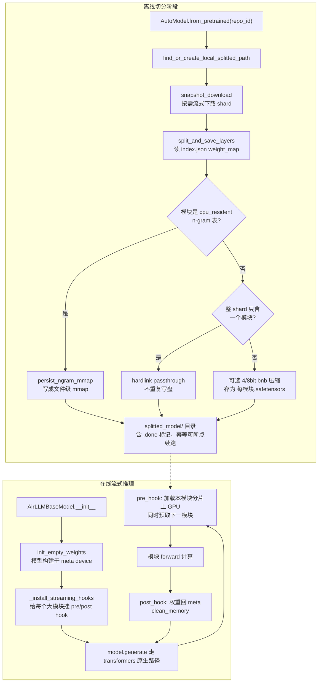
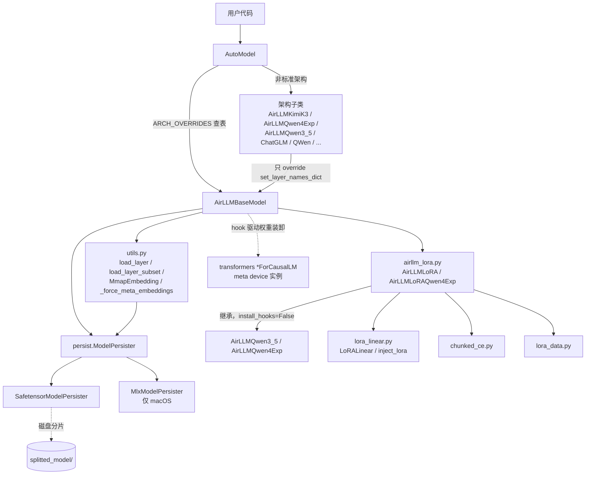
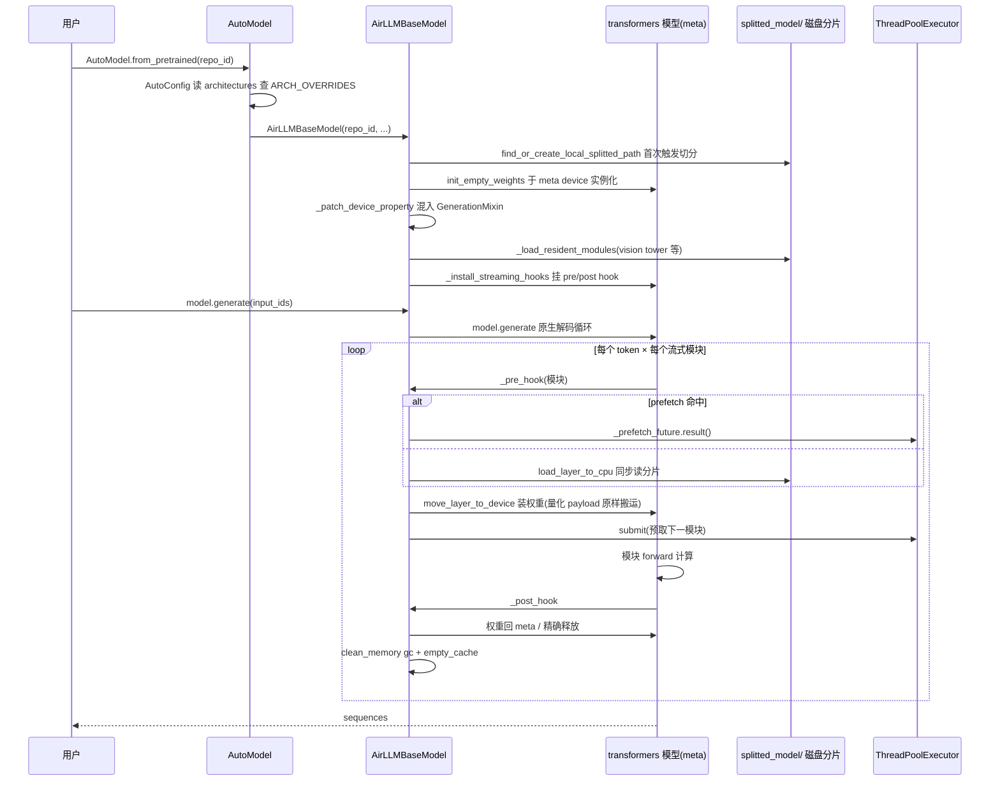
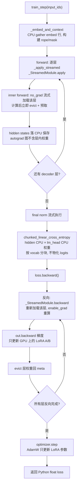

# airllm 源码学习笔记

> 仓库地址：[airllm](https://github.com/lyogavin/airllm)
> 学习日期：2026-09-30

---

> **以下为 AI 源码分析**
>
> ### 一句话概括
>
> AirLLM 通过"离线按层切分 checkpoint + 在线 forward-hook 流式加载"把超大 LLM 的推理显存需求压缩到单层权重大小——transformers 模型整体构建在 meta device（零显存），每个模块运行前才从磁盘把权重搬上 GPU、运行后立刻释放，从而让 70B 模型跑在 4GB 显卡上、2.8T 的 Kimi K3 跑在 3.72GB 显存里，并且同一套分片还能支撑小显存 LoRA 训练。
>
> ### 要点速览
>
> | 模块 | 职责 | 关键文件 |
> |------|------|----------|
> | `airllm/airllm_base.py` | 核心流式基类：meta 实例化、hook 装卸权重、prefetch、per-expert 流式、量化 checkpoint 处理 | `AirLLMBaseModel` |
> | `airllm/auto_model.py` | `AutoModel.from_pretrained` 工厂：按 `config.architectures` 分派到子类或通用基类 | `AutoModel`, `ARCH_OVERRIDES` |
> | `airllm/utils.py` | 离线切分与按层加载：weight_map 解析、4/8bit 压缩、passthrough 硬链接、n-gram mmap | `split_and_save_layers`, `load_layer` |
> | `airllm/persist/` | 持久化抽象：Linux 用 safetensors，macOS 用 mlx | `SafetensorModelPersister` |
> | `airllm/airllm_lora.py` | 小显存 LoRA 训练器：逐层重算 backward、hidden states 驻留 CPU | `AirLLMLoRA`, `AirLLMLoRAQwen4Exp` |
> | `airllm/lora_linear.py` | 免 PEFT 的自研 LoRA：保留原 Parameter 对象以兼容分片加载 | `LoRALinear`, `inject_lora` |
> | `airllm/chunked_ce.py` | 分块线性交叉熵：永不物化 `[N, vocab]` logits | `chunked_linear_cross_entropy` |
> | `airllm/airllm_*.py`（各架构子类） | 只 override `set_layer_names_dict` 声明模块路径映射 | `AirLLMKimiK3`, `AirLLMQwen4Exp` 等 |

---

## 项目简介

AirLLM 解决的问题很直接：消费级 GPU 显存放不下大模型权重。它不做量化（保持原始精度）、不做蒸馏、不做剪枝，而是**用磁盘带宽换显存**——把模型权重按模块（embedding、每个 decoder layer、final norm、lm_head）切分成独立分片存盘；运行时真实模型构建在 meta device 上不占显存，靠 forward hook 在每个模块即将执行时把它的权重从磁盘读上 GPU，执行完立刻释放。于是显存峰值 ≈ 最大单层权重大小 + 激活值，与模型总参数量无关。代价是速度：自回归生成每个 token 都要重读全部权重，本质是"用慢换能跑"。当前版本（4.0）已把架构适配收敛为一个通用基类 + 少量只声明模块路径的子类，覆盖 Llama/Qwen/DeepSeek/Mistral/Kimi K3 等主流家族；并延伸出小显存 LoRA 训练能力（125B MoE 训练 < 6GB 显存）。

## 技术栈

| 类别 | 技术 |
|------|------|
| 语言 | Python 3 |
| 框架 | PyTorch (>=2.4)、transformers (4.49–6)、accelerate、safetensors、huggingface-hub |
| 可选依赖 | bitsandbytes（4/8bit 压缩）、compressed-tensors（MXFP4/fp8 checkpoint）、mlx（macOS）、peft 不使用 |
| 构建工具 | setuptools（包名 `airllm`，版本 4.0.0） |
| 依赖管理 | PyPI `install_requires`（保持小依赖面，可选件缺失时优雅降级）+ 根目录 `requirements.txt` |
| 测试框架 | unittest（`air_llm/tests/`，pytest 兼容布局） |
| CI | GitHub Actions：release.yml（PyPI Trusted Publishing 发布）、star-history.yml（每日刷新星标图） |

## 目录结构

```raw
airllm/
├── air_llm/                    # PyPI 包主体（真正被 pip install 的东西）
│   ├── airllm/
│   │   ├── __init__.py         # 包入口：按平台/可选依赖防御性导入所有模型类
│   │   ├── airllm_base.py      # 核心流式基类 AirLLMBaseModel（921 行，最核心）
│   │   ├── auto_model.py       # AutoModel 工厂 + ARCH_OVERRIDES 架构分派表
│   │   ├── airllm.py           # AirLLMLlama2：纯历史别名，直接继承基类
│   │   ├── airllm_qwen3_5.py   # Qwen3.8-27B dense VL：resident 含 vision tower
│   │   ├── airllm_qwen4_exp.py # Flash-Next：norm=hyper_connection_mixer + PLE mmap
│   │   ├── airllm_kimi_k3.py   # Kimi K3：expert_prefix + 多个 resident 模块
│   │   ├── airllm_chatglm.py / airllm_qwen.py / airllm_baichuan.py
│   │   │                       # 早期国产模型：主要处理自定义 tokenizer/remote code
│   │   ├── airllm_lora.py      # 流式 LoRA 训练器（训练主逻辑）
│   │   ├── lora_linear.py      # 自研 LoRALinear / packed-expert LoRA
│   │   ├── chunked_ce.py       # 分块线性交叉熵
│   │   ├── lora_data.py        # jsonl/txt 数据集加载
│   │   ├── utils.py            # 切分/加载/压缩/内存清理/mmap 全套工具（871 行）
│   │   ├── profiler.py         # LayeredProfiler 分层计时
│   │   ├── airllm_llama_mlx.py # macOS 路径：用 mlx 重写 Llama 推理
│   │   ├── persist/
│   │   │   ├── model_persister.py          # 单例工厂，按平台选择实现
│   │   │   ├── safetensor_model_persister.py # Linux：每层一个 safetensors + .done 标记
│   │   │   └── mlx_model_persister.py      # macOS：.mlx.npz
│   │   ├── examples/           # 训练脚本（train_qwen38_lora.py 等）+ 推理 notebook
│   │   └── tests/              # unittest：AutoModel 分派、切分、LoRA 数据、流式训练
│   └── setup.py                # 打包配置（版本单一真源）
├── anima_100k/                 # Anima 模型 QLoRA 训练子项目（与 airllm 包独立）
├── rlhf/                       # DPO 训练子项目（独立）
├── training/                   # Anima 微调脚本（独立）
├── eval/ data/ scripts/        # 评测 notebook、翻译数据集、辅助脚本
└── README.md
```

注意：`air_llm/` 之外的历史目录（anima_100k、rlhf、training 等）是作者另一个 Anima 模型项目的遗留物，与 airllm 包没有代码复用关系，学习时应聚焦 `air_llm/airllm/`。

## 架构设计

### 整体架构

整体分**离线切分**与**在线流式执行**两个阶段，中间以"每模块一个 safetensors 分片 + `.done` 标记"的磁盘布局解耦：



在线阶段的巧思在于**职责倒置**：AirLLM 不重写任何 attention/rotary/generation 逻辑，完整复用 transformers 的 `*ForCausalLM` 前向与 `generate()`；它只做"权重搬运工"——把 meta device 上的占位参数在恰当时机换成真实权重、用完再撤走。这就是新架构"零适配"的来源。

### 核心模块

#### 1. `AirLLMBaseModel`（airllm_base.py）——流式执行引擎

- **职责**：包装任意 HF `*ForCausalLM`，实现显存最小化的推理。
- **关键方法**：
  - `init_model()` / `_instantiate_on_meta(attn)`：在 meta device 上用 `init_empty_weights(include_buffers=False)` 建模；依序尝试 `AutoModelForImageTextToText`/`AutoModelForCausalLM`/`AutoModel` 等工厂（VL 架构会落到 text-only 类），sdpa 失败再回退 eager。
  - `_patch_device_property()`：动态创建 `_AirLLMRuntimeModel(base_cls, GenerationMixin)` 替换 `model.__class__`，让参数在 meta 上的模型对外报告真实 cuda device，并补齐 transformers 4.50+ 拆掉的 `generate()` 能力。
  - `_pre_hook` / `_post_hook`：权重装卸的核心。pre：命中 prefetch 则取 future，否则同步 `load_layer_to_cpu`，`move_layer_to_device` 后顺手预取下一层；post：`module.to('meta')` 或精确释放已搬参数 + `clean_memory()`。
  - `load_layer_to_cpu()`：经 persister 读分片，小于 2GB 的层 `pin_memory()` 加速 H2D 拷贝。
  - `move_layer_to_device()`：统一处理量化 checkpoint——`_should_load_verbatim()` 判定 fp8/MXFP4 packed payload 必须原样上卡（不能 dtype cast）；`_decompress_state_dict()` 在 GPU 上解压 packed bytes（比传解压后权重省 4x PCIe 带宽）；`_adopt_checkpoint_shape()` 用 checkpoint 形状纠正模型类建出的 meta 占位形状。
  - `_setup_expert_streaming()`：per-expert 流式（Kimi K3 用）。MoE 层按 expert 拆 hook，依赖 safetensors 的单 tensor 随机读。
- **关系**：被所有架构子类继承；被 `AirLLMLoRA` 继承但关闭 hook（训练自己驱动装卸）。

#### 2. `AutoModel`（auto_model.py）——架构分派

- 读 `config.architectures[0]`，查 `ARCH_OVERRIDES` 表（9 个非标准架构 → 专用子类），否则落到通用 `AirLLMBaseModel`。macOS 上整体改走 `AirLLMLlamaMlx`。
- 子类的"适配成本"被压缩到极致：只需 override `set_layer_names_dict()` 声明 5 个模块路径（embed/layer_prefix/norm/lm_head），可选 resident（vision tower）、cpu_resident/marker（超大查找表）、expert_prefix（MoE 按专家流式）。

#### 3. `utils.py`——切分与加载工具

- `split_and_save_layers()`：核心切分循环。从 `weight_map` 推导层列表，按"每个模块最后触及的 shard 序号"排序保证只前进不回退地流式读 shard；`layer_owner()` 最长前缀匹配防止嵌套 cpu-resident 表被父层吞掉；tied-embedding 时剔除无权重的 lm_head；`delete_original` 逐 shard 删除原文件。
- `load_layer()` / `load_layer_subset()`：整层加载 / 只读指定 keys（per-expert 的基础）。
- `MmapEmbedding` + `open_ngram_mmap_table()`：把 ~102GB 的 n-gram 表做成 `torch.UntypedStorage.from_file` 的文件映射，`nn.Embedding` 替身把表藏在普通属性里避免被 `to('meta')` 驱逐。
- `_force_meta_embeddings()`：monkey-patch `nn.Embedding.__init__` 强制建在 meta，否则 191GB 的空 fp32 表会在 CPU 上先 OOM。
- `check_space()` / `NotEnoughSpaceException`：写盘前磁盘余量预检。

#### 4. `airllm_lora.py`——小显存训练

- `_StreamedModule`（`torch.autograd.Function`）：forward 在 no_grad 下逐层流式执行并缓存 CPU hidden states；backward 重新流式加载该层、`enable_grad` 重算（类 gradient checkpointing 的思路），LoRA 梯度在内层 `out.backward(g)` 产生。
- `train_step()`：embed 从 CPU gather → 逐层 `_apply_streamed` → final norm → `chunked_linear_cross_entropy`（lm_head 权重留在 CPU）→ `loss.backward()` → AdamW step。
- embed/lm_head 通过 `cpu_resident` 声明为 CPU 常驻，避免上卡。

#### 5. `persist/`——持久化抽象

- `ModelPersister.get_model_persister()` 模块级单例按平台选择 `SafetensorModelPersister`（`.safetensors` + `.done` 双文件标记）或 `MlxModelPersister`。per-expert 流式显式依赖 safetensors 实现（`type(...)__name__` 检查），这是抽象漏的小口子。

### 模块依赖关系



## 核心流程

### 流程一：推理 generate() 的逐层流式调用链

以 `AutoModel.from_pretrained("Qwen/Qwen3-32B")` + `model.generate(...)` 为例：



关键逻辑：tied-embedding 模型会把 embedding 常驻 GPU 并重新 tie lm_head；量化 checkpoint（fp8/MXFP4）走 `_should_load_verbatim` 原样上卡再在卡上解压；Kimi K3 额外走 per-expert 路径——expert 的 pre-hook 只读路由到的 expert 的几个 tensor，未路由 expert 根本不碰磁盘。

### 流程二：小显存 LoRA 训练 train_step()

`AirLLMLoRAQwen4Exp("Qwen/Qwen3.8-Flash-Next")` 的一次 `train_step(input_ids)`：



关键逻辑：这是"权重版 gradient checkpointing"——普通 checkpointing 重算的是激活，这里连冻结权重都要从磁盘重读一遍，换来的是整个 forward 期间 GPU 上最多只有一个 decoder 层。n-gram PLE 表全程留在 host 的 mmap 上，`set_experts_implementation("eager")` 避开 grouped_mm 为冻结 packed expert 分配的 3.4GB dW。

## 关键设计亮点

**1. "meta 模型 + forward hook"的职责倒置——新架构零适配**

- 问题：早期版本（2023）为每个架构手写 attention/rotary 流式实现，新模型发布就要跟进，维护成本高。
- 实现：`airllm_base.py:296` `_instantiate_on_meta()` 把真实 transformers 模型建在 meta device，`airllm_base.py:748` `_install_streaming_hooks()` 只对大模块挂装卸 hook；forward/generate 全部由 transformers 原生驱动。子类适配量收敛为一个字典（如 `airllm_kimi_k3.py:18`）。
- 为什么好：把"如何计算"委托给上游库，自己只负责"权重何时在场"。transformers 每支持一个新架构，AirLLM 自动跟进——这是 v4 能宣称"覆盖几乎所有主流模型"的架构根源。

**2. 用磁盘带宽换显存，且把换法做到极致**

- 问题：671B 模型 bf16 约 1.3TB，任何单卡都放不下。
- 实现：三级递进——整层流式（`_pre_hook`/`_post_hook`，显存 ≈ 单层）、per-expert 流式（`_setup_expert_streaming`，利用 safetensors 单 tensor 随机读，Kimi K3 一个 token 只触碰 ~1GB 而非整层 55GB expanded）、mmap 查找表（`utils.py:296`，51B 参数的 n-gram 表以文件映射方式驻留 host，gather 发生在磁盘上）。
- 为什么好：MoE 的稀疏路由天然适合按需加载——选中的 expert 才读盘，这层"结构感知"的流式让 2.8T 模型压到 3.72GB 显存。

**3. 量化 checkpoint 的"原样搬运 + 卡上解压"**

- 问题：fp8/MXFP4 的 packed payload 若按普通权重 cast 到运行 dtype 会直接毁掉量化信息；而先解压再搬运会把 PCIe 流量放大 ~4x。
- 实现：`airllm_base.py:633` `_should_load_verbatim()` 用"非浮点 / 1 字节元素 / 量化伴生后缀"三条规则判定原样上卡；`airllm_base.py:489` `_decompress_state_dict()` 把 packed bytes 传上 GPU 后再解压；并主动摘除 compressed-tensors 注册的"首 forward 前全模型解压" hook（那会让 K3 单层膨胀回 56GB）。
- 为什么好：与 HF 量化生态（`AutoHfQuantizer`、bitsandbytes quant_state 伴生张量、MXFP4）互操作而不破坏其内存语义，这是对量化库内部行为的深度理解而非绕过。

**4. 训练不用 PEFT/Trainer，自建 autograd Function**

- 问题：PEFT 期望权重已物化且会整体搬模型；HF Trainer 的 autograd 图会让 64 层 hidden states + 4bit 全量权重挤爆显存。
- 实现：`airllm_lora.py:35` `_StreamedModule` 用 no_grad forward + 重算 backward，hidden states 存 CPU；`lora_linear.py:41` `LoRALinear` 保留原 `weight` Parameter 对象（分片加载的 key 对齐不破坏）；`chunked_ce.py` 把 lm_head 交叉熵按 vocab 分块、`W` 留在 CPU，永不物化 `[N, 248320]` logits。
- 为什么好：每一环都针对"权重不在卡上"这个前提重新设计，而不是把现成训练栈硬塞进流式世界。

**5. 大量为兼容性/鲁棒性服务的工程细节**

- 幂等切分：`safetensors.done` 标记 + `found_layers` 全量校验，中断重跑只补缺失分片（`utils.py:618`）。
- 磁盘友好：单模块整 shard 直接 hardlink（Kimi K3 省 1.5TB 重复写盘，`utils.py:639`）；`delete_original` 逐 shard 边读边删；`check_space` 预检。
- transformers 版本漂移垫片：`restore_relocated_transformers_symbols()` 把 5.0 挪走的符号重新导出（否则旧 remote code 直接 import 失败）；`_patch_device_property` 动态混入 `GenerationMixin`；`param_needs_quantization` 新旧方法名双兼容。
- 这些细节共同支撑了"一个包横跨 transformers 4.49–6、macOS/Linux、多种量化格式"的可用性，是数据面之外最值得学习的部分。
