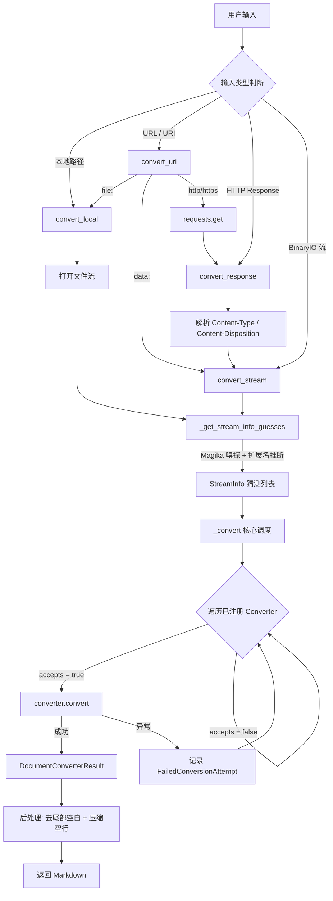
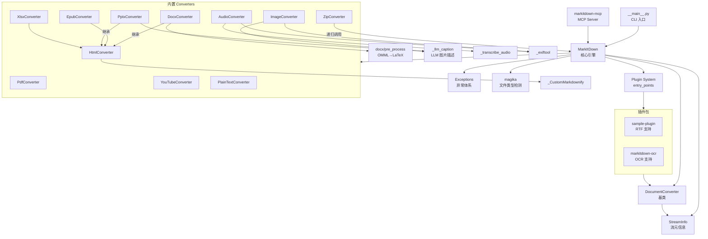
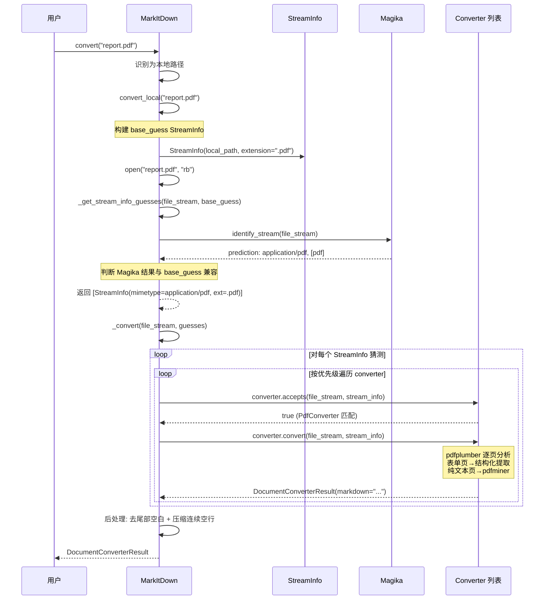
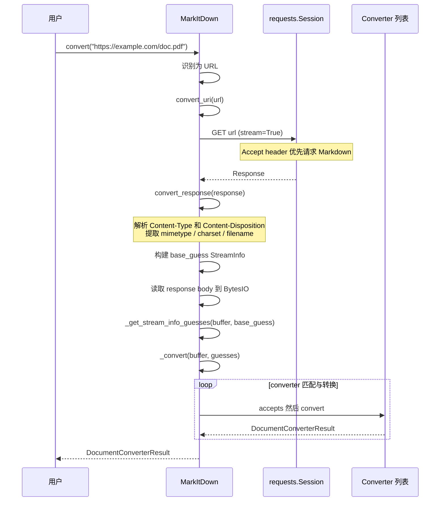

# markitdown 源码学习笔记

> 仓库地址：[markitdown](https://github.com/microsoft/markitdown)
> 学习日期：2026/04/14

---

> **以下为 AI 源码分析**
>
> ### 一句话概括
>
> 一个轻量级 Python 工具，将 PDF、Word、Excel、PowerPoint、HTML、图片、音频等多种格式文件转换为 Markdown，专为 LLM 和文本分析管线设计。
>
> ### 要点速览
>
> | 核心模块 | 职责 | 关键文件 |
> |----------|------|----------|
> | MarkItDown 引擎 | 统一入口，注册/调度 converter，管理流信息猜测 | `_markitdown.py` |
> | DocumentConverter 基类 | 定义 converter 的 `accepts()`/`convert()` 接口 | `_base_converter.py` |
> | StreamInfo | 不可变 dataclass，封装文件流的元信息 | `_stream_info.py` |
> | 18+ 内置 Converter | 每种格式一个 converter 类 | `converters/*.py` |
> | 插件系统 | 基于 entry_points 的第三方扩展机制 | `_markitdown.py` + sample-plugin |
> | MCP Server | 将 MarkItDown 暴露为 MCP 协议工具 | `markitdown-mcp` 包 |
> | OCR 插件 | 基于 LLM Vision 的嵌入式图片文字提取 | `markitdown-ocr` 包 |
> | CLI | 命令行入口，支持管道和文件输入输出 | `__main__.py` |

---

## 项目简介

MarkItDown 是由 Microsoft AutoGen 团队开发的文件转 Markdown 工具。它的核心目标是将各类文档（PDF、Word、Excel、PowerPoint、图片、音频、HTML、ZIP、EPub、YouTube 等）转换为结构化的 Markdown 文本，保留标题、列表、表格、链接等文档结构。输出主要面向 LLM 消费和文本分析管线，而非人类阅读的高保真文档渲染。相比同类工具 textract，MarkItDown 更注重保留文档的结构语义。

## 技术栈

| 类别 | 技术 |
|------|------|
| 语言 | Python 3.10+ |
| 框架 | 无（纯 Python 库），MCP 包使用 FastMCP + Starlette |
| 构建工具 | Hatch / Hatchling |
| 依赖管理 | pip + optional dependencies 分组 |
| 测试框架 | hatch test (pytest) |

核心依赖：
- `beautifulsoup4` — HTML 解析
- `markdownify` — HTML → Markdown 转换
- `magika` — Google 的文件类型检测
- `charset-normalizer` — 字符编码检测
- `requests` — HTTP 请求
- `defusedxml` — 安全的 XML 解析

可选依赖按格式分组：`[pdf]` (pdfminer.six, pdfplumber)、`[docx]` (mammoth)、`[pptx]` (python-pptx)、`[xlsx]` (pandas, openpyxl)、`[audio-transcription]` (pydub, SpeechRecognition) 等。

## 目录结构

```
markitdown/
├── packages/
│   ├── markitdown/                    # 核心包
│   │   ├── src/markitdown/
│   │   │   ├── __init__.py            # 公开 API 导出
│   │   │   ├── __main__.py            # CLI 入口
│   │   │   ├── _markitdown.py         # 核心引擎 MarkItDown 类
│   │   │   ├── _base_converter.py     # DocumentConverter / DocumentConverterResult 基类
│   │   │   ├── _stream_info.py        # StreamInfo 不可变数据类
│   │   │   ├── _exceptions.py         # 异常层次结构
│   │   │   ├── _uri_utils.py          # URI 解析工具（file:, data:）
│   │   │   ├── converters/            # 18 个内置格式转换器
│   │   │   │   ├── _pdf_converter.py
│   │   │   │   ├── _html_converter.py
│   │   │   │   ├── _docx_converter.py
│   │   │   │   ├── _pptx_converter.py
│   │   │   │   ├── _xlsx_converter.py
│   │   │   │   ├── _image_converter.py
│   │   │   │   ├── _audio_converter.py
│   │   │   │   ├── _zip_converter.py
│   │   │   │   ├── _epub_converter.py
│   │   │   │   ├── _youtube_converter.py
│   │   │   │   ├── _plain_text_converter.py
│   │   │   │   ├── _markdownify.py    # 自定义 markdownify 扩展
│   │   │   │   ├── _llm_caption.py    # LLM 图片描述工具
│   │   │   │   └── ...                # 更多 converter
│   │   │   └── converter_utils/
│   │   │       └── docx/
│   │   │           ├── pre_process.py  # DOCX 预处理（OMML→LaTeX）
│   │   │           └── math/           # Office 数学公式转 LaTeX
│   │   ├── tests/
│   │   └── pyproject.toml
│   ├── markitdown-mcp/                # MCP 协议服务端
│   │   └── src/markitdown_mcp/
│   │       └── __main__.py            # FastMCP 服务端实现
│   ├── markitdown-ocr/                # OCR 插件（LLM Vision）
│   └── markitdown-sample-plugin/      # 插件示例（RTF 转换器）
├── Dockerfile                          # Docker 打包
├── .github/workflows/                  # CI（pre-commit + tests）
└── README.md
```

## 架构设计

### 整体架构

MarkItDown 采用 **策略模式（Strategy Pattern）+ 职责链（Chain of Responsibility）** 的架构。核心引擎 `MarkItDown` 维护一个有序的 converter 注册表，每次转换时按优先级遍历 converter 列表，由每个 converter 自行判断是否能处理该文件（`accepts()`），能处理则执行转换（`convert()`），否则跳过。

输入侧支持多种来源（本地文件、URL、HTTP 响应、二进制流、data: URI），通过 `convert()` 方法统一分发。文件类型识别依赖三层信息：用户显式提供的 `StreamInfo`、文件扩展名 / MIME 推断、以及 Google Magika 的内容嗅探。



### 核心模块

#### 1. MarkItDown 引擎（`_markitdown.py`）

**职责**：统一入口，管理 converter 注册、文件类型猜测和转换调度。

**关键类与方法**：
- `MarkItDown.__init__()` — 初始化 Magika、requests Session，注册内置 converter
- `MarkItDown.convert()` — 统一入口，根据 source 类型分发
- `MarkItDown._convert()` — 核心调度循环：遍历 StreamInfo 猜测 × converter 列表
- `MarkItDown._get_stream_info_guesses()` — 利用 Magika + 扩展名推断生成候选 StreamInfo
- `MarkItDown.register_converter()` — 注册 converter 并设置优先级
- `MarkItDown.enable_plugins()` — 通过 `entry_points(group="markitdown.plugin")` 加载第三方插件

**设计要点**：
- converter 按优先级排序，`PRIORITY_SPECIFIC_FILE_FORMAT = 0` 优先于 `PRIORITY_GENERIC_FILE_FORMAT = 10`
- 同优先级下后注册的 converter 排在前面（`insert(0, ...)`），插件可覆盖内置行为
- 使用 `file_stream.seek(cur_pos)` 确保 `accepts()` 和 `convert()` 不互相干扰流位置

#### 2. DocumentConverter 基类（`_base_converter.py`）

**职责**：定义所有 converter 的接口契约。

**关键接口**：
- `accepts(file_stream, stream_info, **kwargs) -> bool` — 快速判断是否能处理此文件
- `convert(file_stream, stream_info, **kwargs) -> DocumentConverterResult` — 执行实际转换

**DocumentConverterResult** 是一个简单的数据容器，包含 `markdown`（转换后的文本）和可选的 `title`。`text_content` 作为兼容别名软弃用。

#### 3. StreamInfo（`_stream_info.py`）

**职责**：封装文件流的元信息，作为 converter 判断依据。

使用 `@dataclass(kw_only=True, frozen=True)` 实现不可变性。字段包括 `mimetype`、`extension`、`charset`、`filename`、`local_path`、`url`，均可为 None。提供 `copy_and_update()` 方法实现函数式更新。

#### 4. 内置 Converter 家族（`converters/`）

每个 converter 遵循相同模式：
1. 模块级定义 `ACCEPTED_MIME_TYPE_PREFIXES` 和 `ACCEPTED_FILE_EXTENSIONS`
2. 可选依赖用 try/except 延迟加载，缺失时保存 `_dependency_exc_info`
3. `accepts()` 检查 MIME 类型或扩展名
4. `convert()` 先检查依赖，再执行格式特定的转换逻辑

| Converter | 支持格式 | 核心依赖 | 特殊说明 |
|-----------|----------|----------|----------|
| PdfConverter | .pdf | pdfminer.six, pdfplumber | 表单页用 pdfplumber 提取表格，纯文本页用 pdfminer |
| HtmlConverter | .html/.htm | beautifulsoup4, markdownify | 使用自定义 `_CustomMarkdownify` |
| DocxConverter | .docx | mammoth | 继承 HtmlConverter，先预处理 OMML 数学公式为 LaTeX |
| PptxConverter | .pptx | python-pptx | 支持幻灯片、图片、表格、图表、笔记 |
| XlsxConverter | .xlsx | pandas, openpyxl | 每个 sheet 输出为独立 Markdown 表格 |
| ImageConverter | .jpg/.png | exiftool (可选) | 支持 EXIF 元数据 + LLM 图片描述 |
| AudioConverter | .wav/.mp3/.m4a | pydub, SpeechRecognition | EXIF 元数据 + 语音转文字 |
| ZipConverter | .zip | zipfile (标准库) | 递归调用 MarkItDown 处理每个内部文件 |
| EpubConverter | .epub | defusedxml | 解析 OPF spine 顺序，按章节转换 HTML |
| YouTubeConverter | YouTube URL | youtube-transcript-api | 从 HTML 提取视频元数据 + 字幕转录 |
| PlainTextConverter | .txt/.md/.json 等 | charset-normalizer | 通用文本兜底，优先级最低 |
| CsvConverter | .csv | 无 | CSV 转 Markdown 表格 |

#### 5. 插件系统

基于 Python `entry_points(group="markitdown.plugin")` 机制实现：
- 插件包在 `pyproject.toml` 中声明 entry_point
- `MarkItDown.enable_plugins()` 延迟加载所有已安装插件
- 插件需导出 `register_converters(markitdown, **kwargs)` 函数
- 通过 `markitdown.register_converter()` 注册自定义 converter

示例插件 `markitdown-sample-plugin` 实现了 RTF 格式支持。`markitdown-ocr` 插件为 PDF/DOCX/PPTX/XLSX 添加 LLM Vision OCR 能力。

#### 6. MCP Server（`markitdown-mcp`）

使用 FastMCP 框架将 MarkItDown 暴露为 MCP 工具服务：
- 提供 `convert_to_markdown(uri)` 工具
- 支持 STDIO 和 HTTP (Streamable HTTP + SSE) 两种传输
- 通过环境变量 `MARKITDOWN_ENABLE_PLUGINS` 控制插件启用

### 模块依赖关系



## 核心流程

### 流程一：本地文件转换（convert_local）

这是最常见的使用场景——将本地文件转换为 Markdown。



**关键逻辑说明**：

1. **StreamInfo 构建**：从文件路径提取 `extension`、`filename`、`local_path`，若用户额外提供了 `stream_info` 则通过 `copy_and_update()` 合并
2. **Magika 嗅探**：读取文件内容进行内容类型检测，若结果与 base_guess 兼容则合并，不兼容则两者都作为候选
3. **双层循环调度**：外层遍历 StreamInfo 猜测，内层遍历排序后的 converter 列表。一旦某个 converter 成功返回结果即停止
4. **PDF 特殊处理**：PdfConverter 先用 pdfplumber 逐页检测是否为表单/表格页面，是则结构化提取，否则回退到 pdfminer 的纯文本提取

### 流程二：URL 资源转换（convert_uri）

处理 HTTP URL、file: URI 和 data: URI 的转换。



**关键逻辑说明**：

1. **内容协商**：requests Session 默认发送 `Accept: text/markdown, text/html;q=0.9` 头，优先获取 Markdown 格式（如 Cloudflare 等支持的站点）
2. **URI 分派**：`file:` URI 转为本地路径处理，`data:` URI 解码为 BytesIO，`http(s):` 执行 HTTP GET
3. **元信息提取**：从 HTTP 响应头中提取 MIME 类型、字符集、文件名等信息，构建 StreamInfo
4. **流式读取**：响应体按 512 字节 chunk 读入 BytesIO，支持后续多次 seek

## 关键设计亮点

### 1. 延迟依赖检查——优雅的可选依赖处理

**问题**：MarkItDown 支持 18+ 种格式，每种格式可能依赖不同的第三方库。如果全部设为必选依赖，安装体积巨大；如果简单忽略 ImportError，用户不知道为何某些格式无法转换。

**实现**：每个 converter 模块顶部用 try/except 尝试导入依赖，失败时保存 `_dependency_exc_info = sys.exc_info()`。`convert()` 方法在实际调用时检查此变量，若非 None 则抛出 `MissingDependencyException`，提供清晰的安装指引。

```python
# _pdf_converter.py 顶部
_dependency_exc_info = None
try:
    import pdfminer
    import pdfplumber
except ImportError:
    _dependency_exc_info = sys.exc_info()
```

**优势**：模块可正常导入和注册，只有实际使用时才报错，且错误信息精确指出需要安装哪个 feature group。

### 2. 多层 StreamInfo 猜测——健壮的文件类型识别

**问题**：文件类型识别不可靠——扩展名可能错误、MIME 类型可能缺失、HTTP 头可能不准确。

**实现**：`_get_stream_info_guesses()` 构建一个 StreamInfo 候选列表，结合：
- 用户显式提供的信息（最高优先）
- 扩展名 → MIME 映射（`mimetypes` 标准库）
- Google Magika 内容嗅探（基于深度学习的文件类型检测）
- 字符编码检测（`charset-normalizer`）

当 Magika 结果与用户信息不兼容时，两者都保留为候选。`_convert()` 的双层循环确保所有猜测都有机会匹配到合适的 converter。

### 3. converter 优先级 + 稳定排序——灵活的扩展机制

**问题**：多个 converter 可能声称能处理同一种文件。例如 `.html` 文件可能匹配 WikipediaConverter、YouTubeConverter 或通用 HtmlConverter。

**实现**：converter 注册时指定优先级（`PRIORITY_SPECIFIC_FILE_FORMAT = 0` 或 `PRIORITY_GENERIC_FILE_FORMAT = 10`），转换前按优先级稳定排序。PlainTextConverter、HtmlConverter、ZipConverter 作为通用兜底设为低优先级（10），特定格式 converter 设为高优先级（0）。

插件通过设置不同优先级来精确控制其位置：优先级 < 0 可覆盖内置 converter，优先级 9 可在通用 converter 之前但在特定 converter 之后运行。

### 4. ZipConverter 的递归处理——优雅的容器文件支持

**问题**：ZIP 文件可能包含任意类型的子文件，需要递归处理。

**实现**：`ZipConverter.__init__()` 接收 `markitdown: MarkItDown` 引用，`convert()` 方法遍历 ZIP 内容，对每个文件调用 `self._markitdown.convert_stream()`。这种设计让 ZIP 内的任何格式都能自动被对应 converter 处理，无需 ZipConverter 知道其他格式的细节。

### 5. DOCX 数学公式预处理管线

**问题**：DOCX 文件中的数学公式使用 OMML（Office Math Markup Language），mammoth 库无法正确处理。

**实现**：`converter_utils/docx/pre_process.py` 在调用 mammoth 之前，将 DOCX 解压到内存中，定位 `word/document.xml` 等文件中的 `<oMath>` 和 `<oMathPara>` 标签，使用自定义的 OMML → LaTeX 转换器（`math/omml.py`）将其转为 `$...$` 或 `$$...$$` LaTeX 格式，再重新打包为 DOCX 流交给 mammoth。整个过程不落盘，全部在内存中完成。
