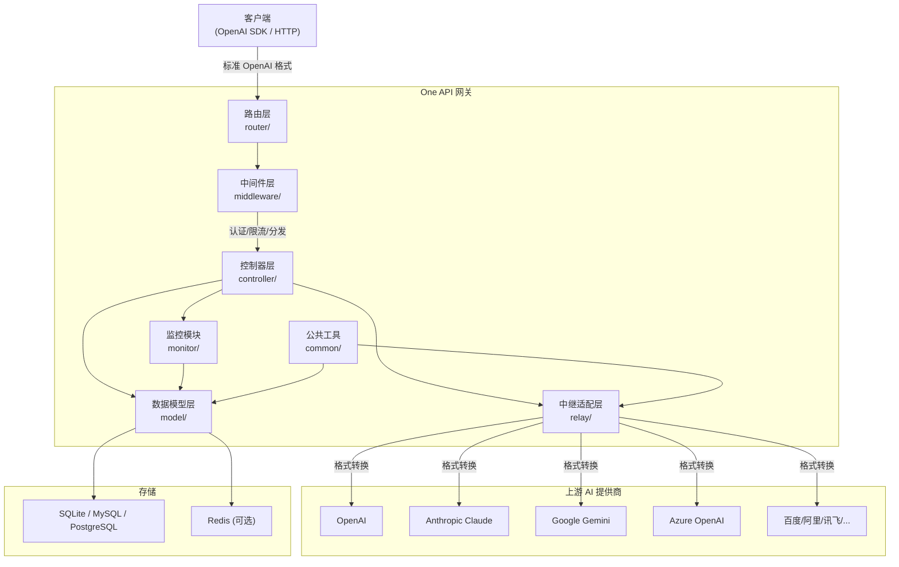
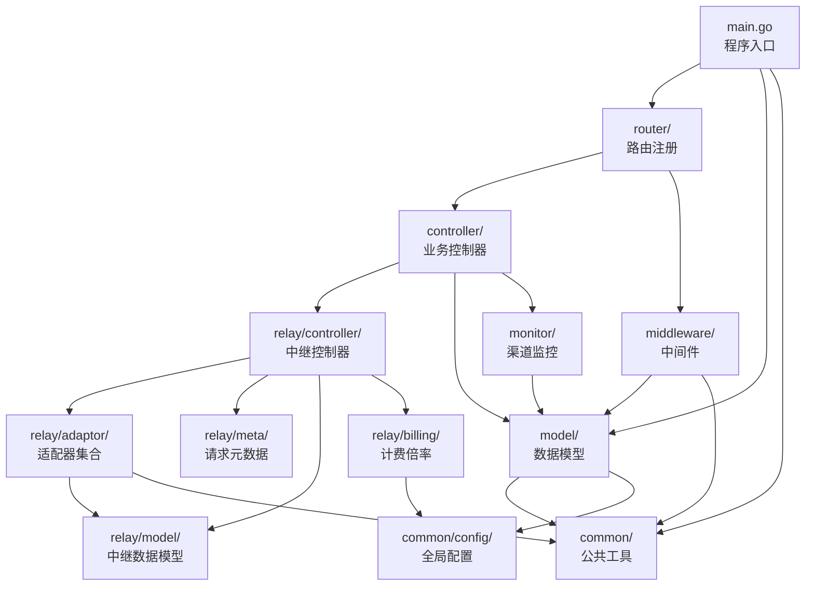
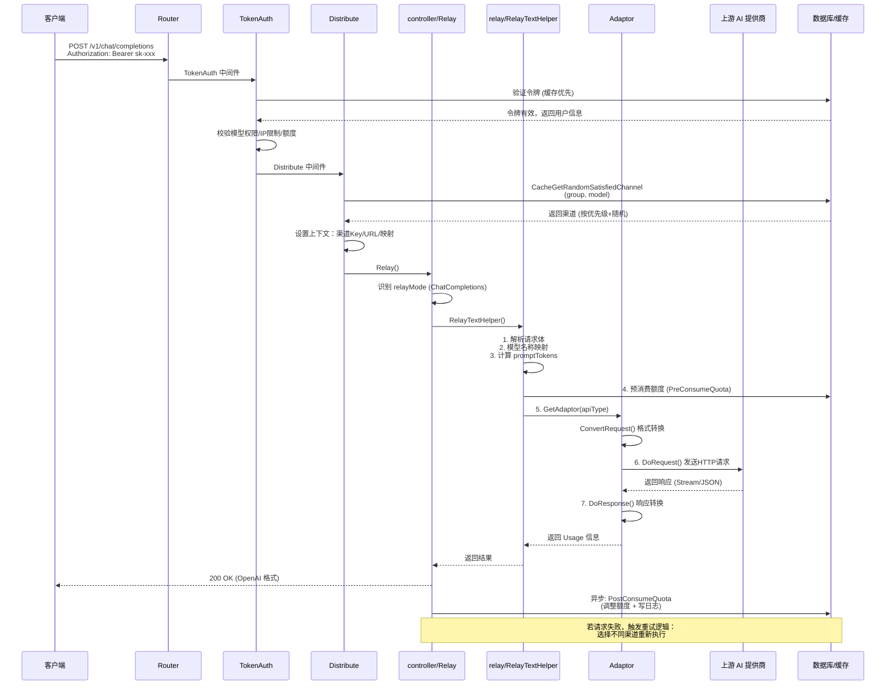
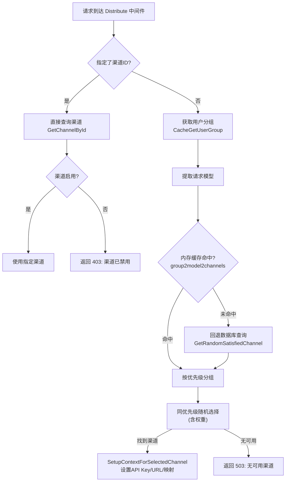

# one-api 源码学习笔记

> 仓库地址：[one-api](https://github.com/songquanpeng/one-api)
> 学习日期：2026-04-05

---

> **以下为 AI 源码分析**
>
> ### 一句话概括
>
> One API 是一个通过标准 OpenAI API 格式统一代理访问所有主流大模型的开源网关，内置用户管理、令牌计费、渠道负载均衡和自动故障转移。
>
> ### 要点速览
>
> | 核心模块 | 职责 | 关键文件 |
> |---------|------|---------|
> | Relay 适配层 | 将 OpenAI 格式请求转换为各提供商 API 格式 | `relay/adaptor/*/` |
> | Controller 控制器 | 处理 API/管理端请求、中继转发与重试 | `controller/relay.go` |
> | Model 数据层 | 用户、令牌、渠道、额度等数据模型与缓存 | `model/*.go` |
> | Middleware 中间件 | 认证、限流、渠道分发、CORS | `middleware/*.go` |
> | Monitor 监控 | 渠道可用性检测与自动禁用 | `monitor/*.go` |
> | Router 路由 | API/Relay/Dashboard/Web 路由注册 | `router/*.go` |
> | Web 前端 | React 多主题管理界面 | `web/default/`, `web/berry/`, `web/air/` |

---

## 项目简介

One API 是一个开源的 AI 模型 API 网关和管理平台。它的核心价值在于：用户只需对接标准的 OpenAI API 格式，即可透明地访问 OpenAI、Anthropic Claude、Google Gemini、百度文心、阿里通义、讯飞星火等 20+ 大模型提供商。系统内置了完整的用户管理、API 令牌管理、渠道（API Key）管理、额度计费、负载均衡、失败自动重试、渠道健康监控等企业级能力，支持 Docker 一键部署和多机分布式架构。

## 技术栈

| 类别 | 技术 |
|------|------|
| 语言 | Go 1.20 + JavaScript (React) |
| 框架 | Gin (HTTP)、GORM (ORM)、React + Material UI (前端) |
| 构建工具 | go build、npm、Docker 多阶段构建 |
| 依赖管理 | Go Modules、npm |
| 测试框架 | Go testing、goconvey、testify |

## 目录结构

```
one-api/
├── main.go                  # 程序入口，初始化并启动 HTTP 服务
├── go.mod                   # Go 模块依赖定义
├── Dockerfile               # 多阶段 Docker 构建文件
├── docker-compose.yml       # Docker Compose 编排
├── router/                  # 路由注册层
│   ├── main.go              #   总路由入口，组合 API/Relay/Dashboard/Web
│   ├── api.go               #   管理端 API 路由 (/api/*)
│   ├── relay.go             #   中继代理路由 (/v1/*)
│   ├── dashboard.go         #   仪表盘路由
│   └── web.go               #   静态前端路由
├── controller/              # 业务控制器层
│   ├── relay.go             #   核心中继控制器，请求转发与重试
│   ├── channel.go           #   渠道 CRUD 管理
│   ├── channel-test.go      #   渠道可用性测试
│   ├── channel-billing.go   #   渠道余额查询
│   ├── token.go             #   令牌管理
│   ├── user.go              #   用户管理
│   ├── billing.go           #   计费查询
│   ├── model.go             #   模型列表
│   ├── log.go               #   日志查询
│   ├── redemption.go        #   兑换码管理
│   └── auth/                #   OAuth 认证 (GitHub, Lark, WeChat, OIDC)
├── middleware/               # 中间件层
│   ├── auth.go              #   三级认证 (Session/AccessToken/APIToken)
│   ├── distributor.go       #   渠道分发与负载均衡
│   ├── rate-limit.go        #   请求限流 (Redis/内存双方案)
│   ├── cors.go              #   CORS 跨域
│   └── request-id.go        #   请求链路追踪
├── model/                    # 数据模型层 (GORM)
│   ├── main.go              #   数据库初始化与迁移
│   ├── user.go              #   用户模型 (角色/额度/OAuth)
│   ├── token.go             #   API 令牌模型 (额度/过期/模型白名单)
│   ├── channel.go           #   渠道模型 (类型/权重/优先级)
│   ├── ability.go           #   能力映射 (分组-模型-渠道三维关系)
│   ├── cache.go             #   三层缓存 (内存/Redis/DB)
│   ├── option.go            #   系统配置键值对
│   ├── log.go               #   消费日志与统计
│   ├── redemption.go        #   兑换码模型
│   └── utils.go             #   批量更新聚合器
├── relay/                    # 中继适配核心
│   ├── controller/          #   中继控制器 (text/image/audio)
│   ├── adaptor/             #   适配器集合 (20+ 提供商)
│   │   ├── interface.go     #     Adaptor 接口定义
│   │   ├── common.go        #     公共请求执行逻辑
│   │   ├── openai/          #     OpenAI 适配器 (含 Azure 等兼容渠道)
│   │   ├── anthropic/       #     Anthropic Claude 适配器
│   │   ├── gemini/          #     Google Gemini 适配器
│   │   ├── baidu/           #     百度文心适配器
│   │   └── ...              #     更多提供商适配器
│   ├── model/               #   中继数据模型 (请求/响应/Usage)
│   ├── billing/             #   计费倍率管理
│   ├── meta/                #   请求上下文元数据
│   ├── apitype/             #   API 类型枚举
│   ├── channeltype/         #   渠道类型枚举与映射
│   └── relaymode/           #   中继模式 (Chat/Completions/Embeddings...)
├── monitor/                  # 渠道监控模块
│   ├── channel.go           #   自动禁用/通知逻辑
│   ├── metric.go            #   请求成功率指标采集
│   └── manage.go            #   监控管理
├── common/                   # 公共工具包
│   ├── config/              #   全局配置变量
│   ├── logger/              #   日志系统
│   ├── client/              #   HTTP 客户端 (支持代理)
│   ├── i18n/                #   国际化 (中/英)
│   ├── message/             #   邮件和消息推送
│   ├── image/               #   图片处理 (base64/URL)
│   └── redis.go             #   Redis 连接管理
└── web/                      # 前端 (React)
    ├── default/             #   默认主题
    ├── berry/               #   Berry 主题
    └── air/                 #   Air 主题
```

## 架构设计

### 整体架构

One API 采用**单体分层架构**，以 Gin 为 HTTP 框架，按职责分为路由层、中间件层、控制器层、中继适配层和数据层。核心设计思想是通过**适配器模式**将不同 AI 提供商的 API 统一为 OpenAI 格式，对外暴露标准接口，对内通过渠道分发和负载均衡实现多源转发。



### 核心模块

#### 1. Relay 适配层 (`relay/`)

**职责**：将标准 OpenAI 请求格式转换为目标提供商格式，执行远程调用并将响应转换回 OpenAI 格式。

**核心文件**：
- `relay/adaptor/interface.go` — Adaptor 接口定义，所有提供商必须实现
- `relay/controller/text.go` — 文本请求处理主逻辑 (`RelayTextHelper`)
- `relay/controller/image.go` — 图像生成处理
- `relay/controller/audio.go` — 音频处理 (TTS/STT)
- `relay/adaptor/openai/` — OpenAI 适配器（也用于 Azure、Moonshot、DeepSeek 等兼容渠道）
- `relay/adaptor/anthropic/` — Claude 适配器（含 OpenAI ↔ Claude 格式双向转换）

**关键接口 — `Adaptor`**：
```go
type Adaptor interface {
    Init(meta *meta.Meta)
    GetRequestURL(meta *meta.Meta) (string, error)
    SetupRequestHeader(c *gin.Context, req *http.Request, meta *meta.Meta) error
    ConvertRequest(c *gin.Context, relayMode int, request *model.GeneralOpenAIRequest) (any, error)
    ConvertImageRequest(request *model.ImageRequest) (any, error)
    DoRequest(c *gin.Context, meta *meta.Meta, requestBody io.Reader) (*http.Response, error)
    DoResponse(c *gin.Context, resp *http.Response, meta *meta.Meta) (usage *model.Usage, err *model.ErrorWithStatusCode)
    GetModelList() []string
    GetChannelName() string
}
```

工厂方法 `GetAdaptor(apiType)` 根据 API 类型创建对应 Adaptor 实例。支持 19 种 API 类型，映射 30+ 渠道类型。

#### 2. 数据模型层 (`model/`)

**职责**：定义所有数据表结构、实现 CRUD 操作、管理三层缓存（内存 → Redis → 数据库）。

**核心模型关系**：
- **User** — 用户主体，含角色(Guest/Common/Admin/Root)、额度、OAuth 绑定
- **Token** — API 令牌，关联用户，含独立额度、模型白名单、IP 限制、过期时间
- **Channel** — 渠道（上游 API Key），含类型、权重、优先级、模型列表
- **Ability** — 三维映射表 `(Group, Model, ChannelId)`，决定哪个分组可通过哪个渠道访问哪个模型
- **Log** — 消费日志，记录每次 API 调用的 token 用量和额度消耗
- **Redemption** — 兑换码，用于充值额度

#### 3. 中间件层 (`middleware/`)

**职责**：横切关注点处理，包括三级认证、渠道分发、请求限流。

**核心组件**：
- **TokenAuth** — API 令牌认证，解析 `Bearer sk-xxx` 格式，验证令牌状态/过期/额度/模型权限/IP 限制
- **Distribute** — 渠道分发，根据用户分组和请求模型从 Ability 表选择渠道，支持优先级+随机的负载均衡
- **RateLimit** — 滑动窗口限流，Redis/内存双方案，支持全局 Web/API/关键操作等多级限流

#### 4. 监控模块 (`monitor/`)

**职责**：实时监测渠道可用性，根据错误码和成功率自动禁用故障渠道。

**核心逻辑**：
- **Metric 指标** — 维护每个渠道最近 N 次请求的成功/失败队列
- **自动禁用** — 当成功率低于阈值（默认 0.8），自动禁用渠道并邮件通知
- **错误码识别** — 区分上游 HTTP 错误（401/403/429 等）决定是否禁用

### 模块依赖关系



## 核心流程

### 流程一：API 请求中继（Chat Completions）

这是 One API 最核心的流程——客户端发起 OpenAI 格式的聊天请求，系统透明代理到实际 AI 提供商。



**关键步骤说明**：

1. **令牌认证**：从 `Authorization` 头解析 `sk-` 前缀的令牌，支持 `sk-{key}-{channelId}` 格式指定渠道。通过 Redis 缓存加速令牌验证。
2. **渠道分发**：`Distribute` 根据用户分组和请求模型，从 `ability` 表查找可用渠道。使用**优先级优先、同优先级随机**的负载均衡策略。
3. **预消费额度**：在发送请求前预扣额度（`promptTokens + maxTokens` 估算值），防止并发场景下超额消费。若用户余额充足（>100x 预消费），跳过预扣以降低延迟。
4. **格式转换**：通过 Adaptor 将 OpenAI 格式转为目标格式（如 Claude 的 `system` 字段提取、消息角色映射、工具调用格式转换等）。
5. **失败重试**：若请求失败（5xx/429），自动选择**不同渠道**重试，最多 `RetryTimes` 次。400 错误不重试。
6. **后消费结算**：异步计算实际消耗 `(promptTokens + completionTokens * completionRatio) * modelRatio * groupRatio`，与预消费取差值更新额度。

### 流程二：渠道分发与负载均衡

渠道选择是系统高可用的核心，涉及多层缓存和优先级策略。



**负载均衡策略细节**：
- **数据来源**：`ability` 表建立 `(group, model, channel_id)` 三维映射，渠道创建时自动注册
- **优先级排序**：`channel.priority` 越大越优先，先选最高优先级分组
- **同级随机**：同优先级渠道间随机选择，配合 `channel.weight` 实现加权分配
- **重试降级**：首次失败后，设置 `ignoreFirstPriority=true` 从低优先级渠道中选择
- **缓存加速**：内存缓存 `map[group]map[model][]*Channel` 按优先级排序，RWMutex 保护，定时重建

## 关键设计亮点

### 1. 适配器模式统一 20+ AI 提供商

**解决的问题**：各 AI 提供商 API 格式差异巨大（OpenAI 的 `messages`、Claude 的 `system` 字段、Gemini 的 `contents`、百度的 Access Token 机制等），客户端不应关心这些差异。

**实现方式**：定义统一的 `Adaptor` 接口（`relay/adaptor/interface.go`），每个提供商实现 `ConvertRequest()` 和 `DoResponse()` 两个核心方法。工厂方法 `GetAdaptor()` 根据 `apiType` 实例化对应适配器。OpenAI 兼容渠道（Azure、Moonshot、DeepSeek 等 15+）复用同一个 `openai.Adaptor`，通过 `meta.ChannelType` 区分配置差异。

**设计优势**：新增提供商只需实现 Adaptor 接口和注册工厂映射，无需改动核心流程代码。

### 2. 二阶段额度消费防止并发透支

**解决的问题**：高并发场景下，多个请求同时检查余额充足并发送到上游，可能导致实际消费远超用户余额。

**实现方式**（`relay/controller/text.go`）：
- **预消费阶段**：请求前估算额度 `(promptTokens + maxTokens) * ratio`，原子扣减令牌和用户额度
- **后消费阶段**：请求完成后根据实际 `Usage` 计算真实消耗，与预消费取差值补偿
- **优化路径**：若用户余额 > 100 倍预消费额，跳过预扣步骤以降低延迟

**设计优势**：在保证不透支的同时，对余额充足的用户零额外延迟。

### 3. 三层缓存 + 批量更新聚合

**解决的问题**：每次 API 请求涉及令牌验证、用户额度查询、渠道选择等多次数据库读取，以及额度扣减、日志写入等多次写入，数据库成为性能瓶颈。

**实现方式**：
- **内存缓存**（`model/cache.go`）：`group2model2channels` 全量缓存渠道映射，RWMutex 保护，定时重建
- **Redis 缓存**：令牌对象、用户额度、用户分组、用户状态等热数据，TTL 控制过期
- **批量更新**（`model/utils.go`）：启用 `BatchUpdateEnabled` 后，额度变更写入内存 Map 而非直接 SQL，定时（默认 5 秒）批量提交，显著减少数据库写入压力

**设计优势**：读路径几乎不触数据库，写路径通过聚合减少 SQL 提交次数，支持高并发场景。

### 4. 自动故障转移 + 渠道健康监控

**解决的问题**：上游渠道可能因 API Key 过期、余额不足、服务降级等原因不可用，不应影响终端用户。

**实现方式**：
- **请求级重试**（`controller/relay.go`）：首次失败后自动选择不同渠道重试，429/5xx 触发重试，400 不重试
- **指标采集**（`monitor/metric.go`）：每个渠道维护最近 N 次（默认 10）请求的成功/失败队列
- **自动禁用**（`monitor/channel.go`）：成功率低于阈值（默认 0.8）时自动禁用渠道，同时根据错误码（401 余额不足、403 权限不足）做即时判断
- **邮件通知**（`common/message/`）：渠道被禁用时异步发送邮件通知管理员

**设计优势**：用户无感知的故障转移，管理员通过邮件及时处理问题渠道。

### 5. 嵌入式前端多主题架构

**解决的问题**：API 网关需要管理界面，但独立部署前端会增加运维复杂度；同时不同用户可能偏好不同 UI 风格。

**实现方式**：
- Go 的 `//go:embed web/build/*` 指令将编译后的前端资源嵌入二进制文件
- 支持三套 React 主题（default、berry、air），通过 `THEME` 环境变量切换
- Dockerfile 多阶段构建：先在 Node 容器并行编译三套前端，再在 Go 容器编译后端并嵌入
- 从服务器可设置 `FRONTEND_BASE_URL` 重定向到主服务器前端，实现多机部署

**设计优势**：单一二进制文件包含完整前后端，部署极简（一个 Docker 命令即可运行）。
