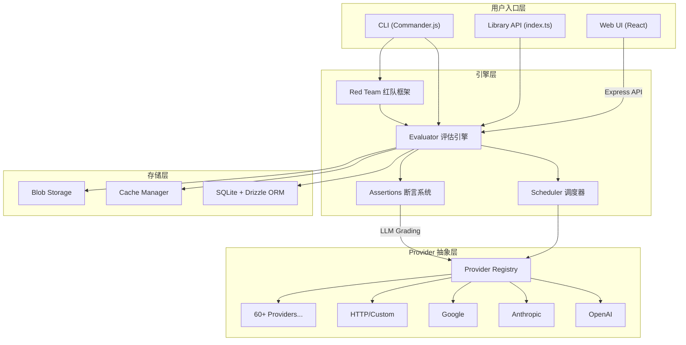
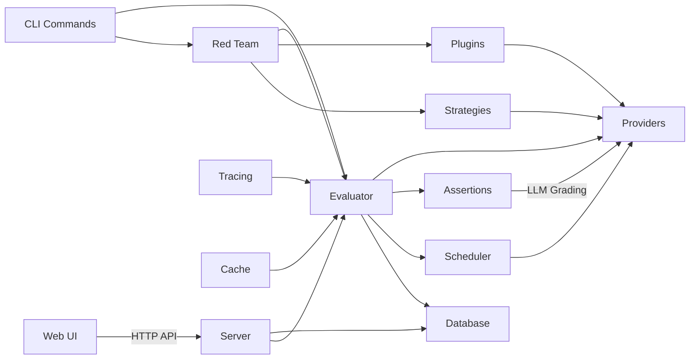
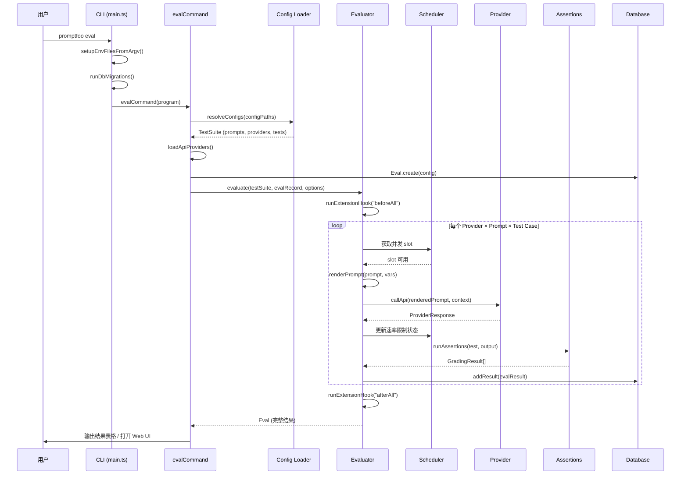
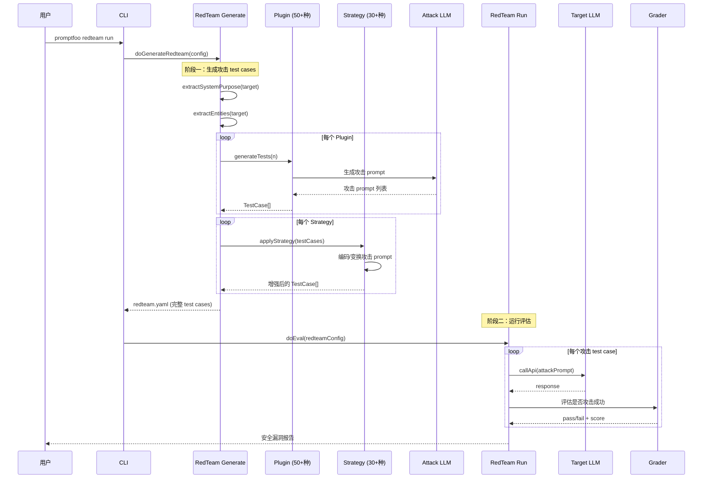

# promptfoo 源码学习笔记

> 仓库地址：[promptfoo](https://github.com/promptfoo/promptfoo)
> 学习日期：2026-04-05

---

> **以下为 AI 源码分析**
>
> ### 一句话概括
>
> promptfoo 是一个面向开发者的 LLM 评估与红队测试工具，支持 CLI 和 Web UI，可对任意 LLM 应用进行自动化 prompt 评估、模型对比和安全漏洞扫描。
>
> ### 要点速览
>
> | 核心模块 | 职责 | 关键文件 |
> |---------|------|---------|
> | Evaluator | 评估引擎核心，编排 prompt × provider × test case 的笛卡尔积评估 | `src/evaluator.ts` |
> | Providers | 60+ LLM 提供商的统一抽象层（OpenAI、Anthropic、Google 等） | `src/providers/` |
> | Assertions | 40+ 种评估断言（contains、LLM 评分、相似度、延迟等） | `src/assertions/` |
> | Red Team | AI 安全红队测试框架，含 50+ 攻击插件和 30+ 攻击策略 | `src/redteam/` |
> | CLI Commands | 命令行工具（eval、init、view、redteam 等） | `src/commands/` |
> | Web UI | React 前端结果可视化与配置管理界面 | `src/app/` |
> | Server | Express API 服务，桥接前端与后端数据 | `src/server/` |
> | Scheduler | 自适应并发调度器，自动学习 API 速率限制 | `src/scheduler/` |
> | Database | SQLite + Drizzle ORM 持久化评估结果 | `src/database/` |

---

## 项目简介

promptfoo 是一个开源的 LLM 评估和红队测试工具包，由 Ian Webster 创建，现已被 OpenAI 收购。它解决了 LLM 应用开发中的两大核心问题：**质量评估**和**安全测试**。

在质量评估方面，promptfoo 允许开发者以声明式 YAML 配置定义 prompt、provider 和 test case 的组合矩阵，自动运行评估并生成可视化报告，支持 40+ 种断言类型（从简单的字符串匹配到 LLM-as-a-Judge 评分）。在安全测试方面，它提供了完整的红队测试框架，内置 50+ 种攻击插件（如 prompt injection、越狱、PII 泄露）和 30+ 种攻击策略（如 Crescendo 多轮攻击、GOAT 自动化对抗、编码绕过），可对目标系统进行自动化安全漏洞扫描。

项目采用 MIT 协议开源，已被服务 1000 万+ 用户的 LLM 应用广泛使用。

## 技术栈

| 类别 | 技术 |
|------|------|
| 语言 | TypeScript (Node.js) |
| 框架 | 后端 Express，前端 React 19 + Vite |
| 构建工具 | tsdown (tsup 继任者) + tsc + Vite |
| 依赖管理 | npm workspaces |
| 测试框架 | Vitest |
| 数据库 | SQLite (better-sqlite3 + Drizzle ORM) |
| CLI 框架 | Commander.js |
| 可观测性 | OpenTelemetry |

## 目录结构

```
promptfoo/
├── src/                          # 后端核心源码
│   ├── main.ts                   # CLI 主入口，注册所有命令
│   ├── entrypoint.ts             # 程序真正入口，做 Node.js 版本检查
│   ├── index.ts                  # 库 API 入口，导出 evaluate() 等公共接口
│   ├── evaluator.ts              # 评估引擎核心（~2600 行）
│   ├── evaluatorHelpers.ts       # 评估辅助函数（prompt 渲染、扩展钩子）
│   ├── matchers.ts               # LLM 评分匹配器（similarity、rubric 等）
│   ├── commands/                  # CLI 子命令实现
│   │   ├── eval.ts               # `promptfoo eval` 命令
│   │   ├── init.ts               # `promptfoo init` 命令
│   │   ├── view.ts               # `promptfoo view` 命令
│   │   ├── mcp/                  # MCP (Model Context Protocol) 服务器命令
│   │   └── ...
│   ├── providers/                 # 60+ LLM 提供商适配器
│   │   ├── index.ts              # Provider 加载与解析
│   │   ├── registry.ts           # Provider 注册表（工厂模式）
│   │   ├── openai/               # OpenAI 系列 (chat, completion, embedding, image 等)
│   │   ├── anthropic/            # Anthropic Claude 系列
│   │   ├── google/               # Google Gemini / Vertex AI
│   │   ├── azure/                # Azure OpenAI
│   │   ├── bedrock/              # AWS Bedrock
│   │   ├── ollama.ts             # Ollama 本地模型
│   │   ├── http.ts               # 通用 HTTP API provider
│   │   ├── mcp/                  # MCP provider
│   │   └── ...
│   ├── assertions/                # 40+ 种评估断言
│   │   ├── index.ts              # 断言调度器
│   │   ├── contains.ts           # 字符串包含断言
│   │   ├── llmRubric.ts          # LLM-as-a-Judge 评分
│   │   ├── javascript.ts         # 自定义 JS 断言
│   │   ├── python.ts             # 自定义 Python 断言
│   │   └── ...
│   ├── redteam/                   # 红队测试框架
│   │   ├── index.ts              # 红队测试入口，test case 合成
│   │   ├── plugins/              # 50+ 攻击插件
│   │   │   ├── base.ts           # 插件基类 RedteamPluginBase
│   │   │   ├── harmful/          # 有害内容类插件
│   │   │   ├── hijacking.ts      # 对话劫持
│   │   │   └── ...
│   │   ├── strategies/           # 30+ 攻击策略
│   │   │   ├── crescendo.ts      # Crescendo 多轮对抗
│   │   │   ├── goat.ts           # GOAT 自动化攻击
│   │   │   ├── iterative.ts      # 迭代优化攻击
│   │   │   └── ...
│   │   ├── providers/            # 红队专用 provider（对抗生成）
│   │   ├── grading/              # 红队评分系统
│   │   ├── extraction/           # 系统目的和实体提取
│   │   └── commands/             # 红队 CLI 子命令
│   ├── server/                    # Express API 服务器
│   │   ├── server.ts             # 服务器启动与配置
│   │   ├── routes/               # API 路由（eval, redteam, traces 等）
│   │   └── middleware/           # 中间件
│   ├── scheduler/                 # 自适应并发调度器
│   │   ├── adaptiveConcurrency.ts # 自适应并发控制
│   │   ├── headerParser.ts       # 速率限制头解析
│   │   ├── retryPolicy.ts        # 重试策略
│   │   └── slotQueue.ts          # 槽位队列
│   ├── database/                  # SQLite 数据库
│   │   └── index.ts              # 数据库连接管理 (WAL 模式)
│   ├── models/                    # 数据模型
│   ├── types/                     # TypeScript 类型定义
│   ├── tracing/                   # OpenTelemetry 追踪集成
│   ├── codeScan/                  # 代码安全扫描
│   ├── app/                       # React 前端（独立 workspace）
│   │   └── src/
│   │       ├── pages/            # 页面组件
│   │       ├── components/       # 通用组件
│   │       └── stores/           # 状态管理
│   └── util/                      # 通用工具函数
├── test/                          # 测试文件
├── site/                          # 文档网站（独立 workspace）
├── drizzle/                       # 数据库迁移文件
└── package.json                   # 项目配置（workspaces: src/app, site）
```

## 架构设计

### 整体架构

promptfoo 采用**分层架构**设计，自顶向下分为 CLI 层、引擎层、Provider 抽象层和存储层。整体设计思路是**配置驱动的评估流水线**：用户通过 YAML 配置定义评估矩阵（prompts × providers × test cases），引擎自动编排执行并汇总结果。



### 核心模块

#### 1. Evaluator 评估引擎

**职责**：核心编排器，将 prompt × provider × test case 展开为评估任务矩阵，并发执行并收集结果。

**核心文件**：
- `src/evaluator.ts` — `Evaluator` 类和 `runEval()` 函数
- `src/evaluatorHelpers.ts` — prompt 渲染、扩展钩子、文件元数据收集

**关键类与函数**：
- `class Evaluator` — 评估编排器，管理进度条、统计数据、rate limit registry
- `evaluate()` — 导出函数，创建 Evaluator 实例并执行
- `runEval()` — 单个 (provider, prompt, test) 组合的执行逻辑
- `ProgressBarManager` — CLI 进度条管理
- `generateVarCombinations()` — 变量笛卡尔积生成

**关键设计**：
- 外层按 provider 循环，内层按 prompt 循环，减少本地推理时的模型切换开销
- 使用 `async.forEachOfLimit()` 控制并发
- 支持 resume 机制，可恢复中断的评估
- 支持 conversation 模式，维护多轮对话上下文

#### 2. Provider 抽象层

**职责**：统一的 LLM 调用接口，屏蔽 60+ 不同提供商的 API 差异。

**核心文件**：
- `src/providers/registry.ts` — 基于工厂模式的 provider 注册表
- `src/providers/index.ts` — `loadApiProvider()` 和 `loadApiProviders()` 加载逻辑
- `src/types/providers.ts` — `ApiProvider` 接口定义

**关键接口**：
```typescript
interface ApiProvider {
  id: () => string;
  callApi: CallApiFunction;
  callEmbeddingApi?: (input: string) => Promise<ProviderEmbeddingResponse>;
  callClassificationApi?: (prompt: string) => Promise<ProviderClassificationResponse>;
  label?: string;
  config?: any;
  delay?: number;
  cleanup?: () => void | Promise<void>;
}
```

**Provider 注册机制**：`providerMap` 是一个 `ProviderFactory[]` 数组，每个工厂有 `test(path)` 和 `create(path, options, context)` 两个方法。`loadApiProvider()` 遍历注册表找到匹配的工厂创建 provider 实例。支持字符串路径（如 `openai:gpt-4`）和 Cloud provider 引用。

#### 3. Assertions 断言系统

**职责**：评估 LLM 输出是否符合预期，支持 40+ 种断言类型。

**核心文件**：
- `src/assertions/index.ts` — 断言调度器 `runAssertions()`
- `src/matchers.ts` — LLM 评分匹配器实现

**断言类型分类**：
- **确定性断言**：`equals`、`contains`、`is-json`、`is-html`、`regex`
- **相似度断言**：`similar`（cosine similarity）、`levenshtein`、`rouge`
- **LLM 评分断言**：`llm-rubric`、`factuality`、`answer-relevance`、`model-graded-closedqa`
- **函数断言**：`javascript`、`python`（自定义断言逻辑）
- **性能断言**：`latency`、`cost`、`perplexity`
- **红队专用断言**：`promptfoo:redteam:*`

#### 4. Red Team 红队框架

**职责**：自动化 LLM 安全漏洞检测，包含攻击 test case 生成、多轮攻击策略和安全评分。

**核心文件**：
- `src/redteam/index.ts` — test case 合成入口
- `src/redteam/plugins/base.ts` — `RedteamPluginBase` 插件基类
- `src/redteam/strategies/index.ts` — 攻击策略注册
- `src/redteam/graders.ts` — 红队评分器
- `src/redteam/shared.ts` — `doRedteamRun()` 运行入口

**插件体系**（50+ 种攻击插件）：
- **有害内容**：`harmful:hate`、`harmful:sexual-content`、`harmful:violence` 等
- **安全漏洞**：`prompt-injection`、`hijacking`、`data-exfil`、`bola`、`bfla`
- **合规性**：`pii`、`contracts`、`hallucination`、`competitors`
- **行业专属**：`medical`、`financial`、`insurance`、`ecommerce`

**策略体系**（30+ 种攻击策略）：
- **多轮对抗**：`crescendo`（渐进式）、`goat`（自动化目标导向）、`hydra`（多头攻击）
- **编码绕过**：`base64`、`rot13`、`leetspeak`、`hex`、`homoglyph`
- **高级技术**：`iterative`（迭代优化）、`best-of-n`（最优采样）、`math-prompt`（数学化）

#### 5. Scheduler 自适应调度器

**职责**：智能并发控制，从 HTTP 响应头自动学习 API 速率限制并动态调整并发度。

**核心文件**：
- `src/scheduler/adaptiveConcurrency.ts` — 自适应并发算法
- `src/scheduler/headerParser.ts` — 速率限制头解析
- `src/scheduler/rateLimitRegistry.ts` — 全局速率限制注册表
- `src/scheduler/slotQueue.ts` — 基于 slot 的请求队列

**关键设计**：零配置——无需用户手动设置速率限制参数，调度器通过解析 `X-RateLimit-*`、`Retry-After` 等响应头自动学习并发上限。

### 模块依赖关系



## 核心流程

### 流程一：Eval 评估执行流程

这是 promptfoo 最核心的流程——从用户运行 `promptfoo eval` 到生成结果的完整调用链。



**关键步骤说明**：

1. **配置解析**：`resolveConfigs()` 加载 YAML 配置文件，解析 prompts（支持文件引用、函数）、providers（支持 60+ 类型）和 test cases（支持 CSV、JSONL 外部数据源）
2. **Provider 加载**：通过 `providerMap` 注册表匹配 provider 路径（如 `openai:gpt-4o`），创建对应的 provider 实例
3. **评估矩阵展开**：外层按 provider 循环（减少模型切换），内层按 prompt 循环，每个组合乘以所有 test cases
4. **并发执行**：通过 `async.forEachOfLimit()` + Scheduler 自适应并发控制
5. **断言评估**：每个 provider response 经过 `runAssertions()` 检验，支持确定性断言和 LLM 评分
6. **结果持久化**：逐条写入 SQLite 数据库，支持 JSONL 流式输出

### 流程二：Red Team 红队测试流程

红队测试是一个两阶段流程：先生成攻击 test cases，然后运行评估。



**关键步骤说明**：

1. **系统目的提取**：`extractSystemPurpose()` 向目标 LLM 发送探测请求，推断其 system prompt 意图
2. **插件 test case 生成**：每个 `RedteamPluginBase` 子类通过 `getTemplate()` 定义攻击 prompt 模板，调用 LLM 生成 N 个针对性攻击 test case
3. **策略增强**：策略对已生成的 test cases 进行变换（如 base64 编码、多语言翻译、渐进式多轮对话），产生更多绕过手段
4. **评估执行**：复用 Evaluator 引擎执行攻击 test cases，但使用红队专用 grader 评估攻击是否成功
5. **报告生成**：汇总各插件/策略的攻击成功率，按风险等级分类输出安全漏洞报告

## 关键设计亮点

### 1. 工厂模式的 Provider 注册表

**解决的问题**：需要统一管理 60+ 种 LLM 提供商，同时支持通过字符串路径灵活匹配。

**实现方式**：`src/providers/registry.ts` 中的 `providerMap` 是一个 `ProviderFactory[]` 数组，每个工厂包含 `test(path)` 匹配函数和 `create()` 构造函数。`loadApiProvider()` 顺序遍历注册表，找到第一个匹配的工厂创建实例。

**为什么这样设计**：
- 字符串路径匹配（如 `openai:gpt-4o`）比类注册更灵活，支持通配符和前缀匹配
- 新增 provider 只需在 `providerMap` 数组中添加一个工厂条目，无需修改加载逻辑
- 支持 Cloud provider 引用和自定义 JS/Python provider，统一进入相同的加载管道

### 2. 自适应并发调度器（零配置速率限制）

**解决的问题**：不同 LLM API 的速率限制各不相同，手动配置繁琐且容易遗漏。

**实现方式**：`src/scheduler/` 模块通过解析 HTTP 响应头（`X-RateLimit-Remaining`、`Retry-After`）自动学习当前 API 的速率限制，动态调整并发度。`AdaptiveConcurrency` 类实现了类似 TCP 拥塞控制的算法：遇到 429 时减少并发，持续成功时缓慢增加。

**为什么这样设计**：
- 零配置体验——用户无需了解每个 API 的速率限制细节
- 自适应机制比固定并发更高效，能在不触发限流的前提下最大化吞吐
- `RateLimitRegistry` 基于 EventEmitter，支持事件监听便于调试

### 3. 插件 + 策略的红队测试双层架构

**解决的问题**：攻击类型（"测什么"）和攻击手段（"怎么攻"）是正交维度，需要灵活组合。

**实现方式**：
- **Plugin 层**（`src/redteam/plugins/base.ts`）：定义攻击类型，如 `hijacking`、`prompt-injection`，负责生成基础攻击 prompt
- **Strategy 层**（`src/redteam/strategies/`）：定义攻击手段，如 `base64` 编码、`crescendo` 多轮渐进，对 plugin 生成的 test cases 进行增强变换

**为什么这样设计**：
- 笛卡尔积组合——50 个 plugin × 30 个 strategy = 1500+ 种攻击场景，无需逐个实现
- 每层独立扩展——新增攻击类型只需实现 plugin，新增绕过手段只需实现 strategy
- `excludeStrategies` 机制允许 plugin 声明不兼容的策略，避免无意义组合

### 4. 配置驱动的声明式评估

**解决的问题**：LLM 评估涉及大量排列组合（prompts × providers × tests × assertions），命令式代码难以维护。

**实现方式**：用户通过 `promptfooconfig.yaml` 声明式定义评估矩阵，`src/util/config/load.ts` 中的 `resolveConfigs()` 负责解析和展开。支持文件引用（`file://`）、glob 模式、JavaScript/Python 函数、外部数据源（CSV/JSONL/Google Sheets）。

**为什么这样设计**：
- 声明式配置让非工程师也能定义评估方案
- 文件引用和函数支持让复杂场景不失灵活性
- YAML 格式便于版本管理和 CI/CD 集成

### 5. 多模态 Provider 响应处理与 Blob 外部化

**解决的问题**：LLM 输出可能包含图片、音频等二进制数据，直接存储在评估结果中会导致数据库膨胀和 token 浪费。

**实现方式**：`src/blobs/extractor.ts` 中的 `extractAndStoreBinaryData()` 检测 base64 编码输出，将二进制数据提取到外部 blob 存储，在评估结果中仅保留引用。`ProviderResponse` 接口中的 `isBase64` 字段标记二进制输出。

**为什么这样设计**：
- 避免大体积二进制数据污染 SQLite 数据库
- Blob 引用方案让下游 grader 和 UI 可以按需加载
- 支持图片、音频、视频等多模态评估场景
