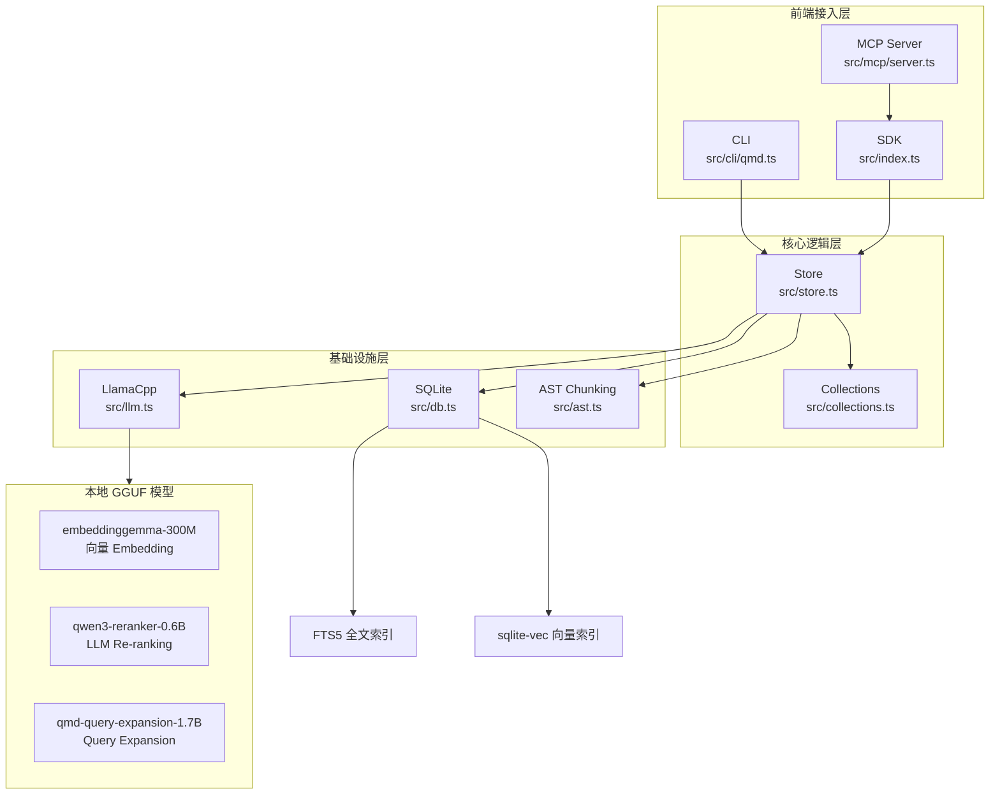
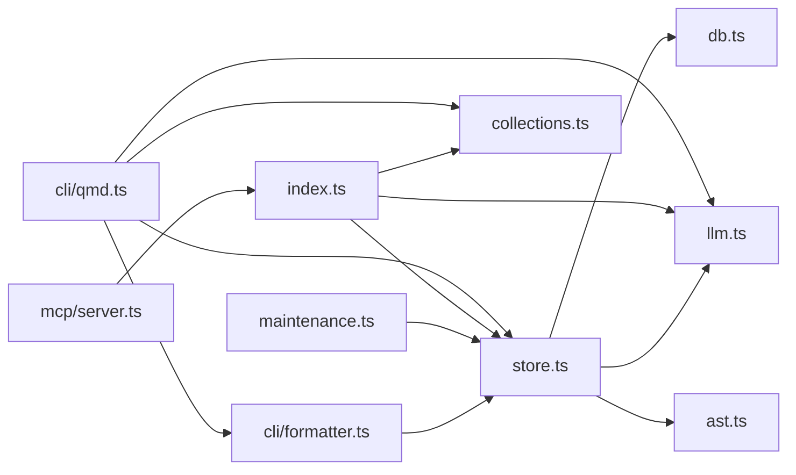
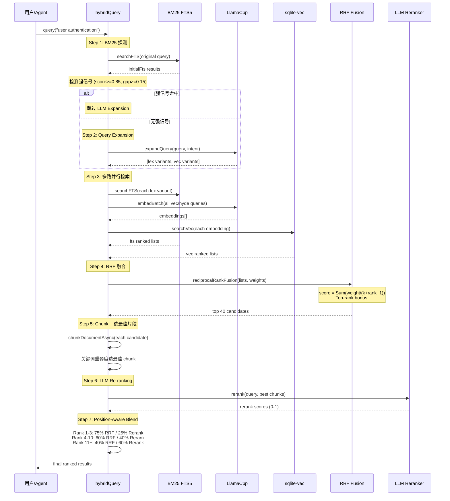
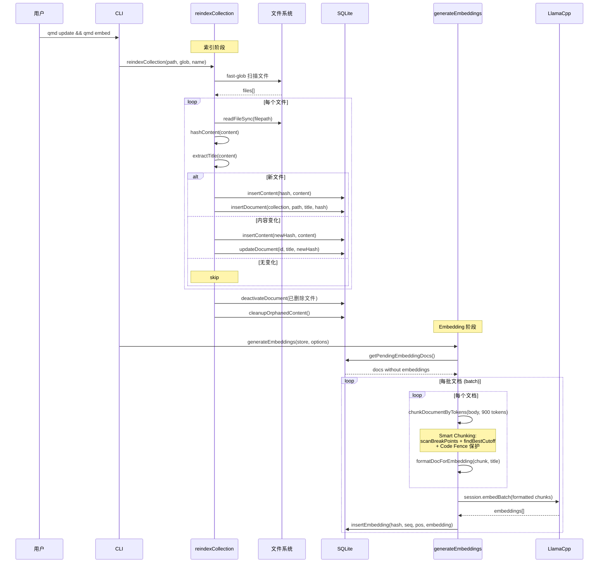

# QMD 源码学习笔记

> 仓库地址：[qmd](https://github.com/tobi/qmd)
> 学习日期：2026/04/15

---

> **以下为 AI 源码分析**
>
> ### 一句话概括
>
> QMD 是一个完全本地运行的 Markdown 混合搜索引擎，融合 BM25 全文检索、向量语义搜索与 LLM Re-ranking，专为 AI Agent 工作流设计。
>
> ### 要点速览
>
> | 核心模块 | 职责 | 关键文件 |
> |---------|------|---------|
> | Store | 数据存储、索引、检索核心 | `src/store.ts` |
> | LLM | 本地 GGUF 模型管理（embedding/rerank/generation） | `src/llm.ts` |
> | CLI | 命令行界面，用户交互入口 | `src/cli/qmd.ts` |
> | MCP Server | Model Context Protocol 服务，供 AI Agent 调用 | `src/mcp/server.ts` |
> | SDK | 库模式 API，供 Node.js/Bun 应用集成 | `src/index.ts` |
> | Collections | YAML 配置管理，集合与上下文定义 | `src/collections.ts` |
> | AST Chunking | 基于 tree-sitter 的代码感知分块 | `src/ast.ts` |

---

## 项目简介

QMD（Query Markup Documents）是 Shopify 创始人 Tobi Lutke 开发的本地搜索引擎，解决的核心问题是：**如何在设备上高效检索 Markdown 笔记、会议记录、文档和知识库**。它将 BM25 全文搜索、向量语义搜索和 LLM Re-ranking 三种检索策略融合在一起，全部通过 node-llama-cpp 在本地运行 GGUF 模型，无需任何云端 API。项目的核心价值在于为 AI Agent 提供高质量的本地知识检索能力，通过 MCP 协议实现与 Claude Desktop、Claude Code 等 AI 工具的无缝集成。

## 技术栈

| 类别 | 技术 |
|------|------|
| 语言 | TypeScript（ESM） |
| 运行时 | Node.js >= 22 / Bun >= 1.0 |
| 数据库 | SQLite（better-sqlite3 / bun:sqlite） + FTS5 全文索引 + sqlite-vec 向量扩展 |
| LLM 推理 | node-llama-cpp（GGUF 模型本地推理） |
| AST 解析 | web-tree-sitter（代码感知分块） |
| 协议 | MCP（Model Context Protocol）via @modelcontextprotocol/sdk |
| 构建工具 | tsc（TypeScript Compiler） |
| 依赖管理 | npm / pnpm / bun |
| 测试框架 | vitest |

## 目录结构

```
qmd/
├── src/                        # 核心源码
│   ├── cli/
│   │   ├── qmd.ts              # CLI 入口，命令解析与调度（~1800 行）
│   │   └── formatter.ts        # 多格式输出（JSON/CSV/XML/Markdown/CLI）
│   ├── mcp/
│   │   └── server.ts           # MCP 服务实现（stdio + HTTP 双传输）
│   ├── store.ts                # 核心存储层（~4500 行）：DB 操作、搜索、索引、RRF 融合
│   ├── llm.ts                  # LLM 抽象层：embedding、rerank、query expansion
│   ├── db.ts                   # SQLite 兼容层（Bun/Node 双运行时适配）
│   ├── collections.ts          # YAML 集合配置管理
│   ├── ast.ts                  # tree-sitter AST 感知分块
│   ├── index.ts                # SDK 公开 API（QMDStore 接口）
│   ├── maintenance.ts          # 数据库维护操作（VACUUM、清理孤立数据）
│   └── embedded-skills.ts      # 内嵌 Claude Code skill 支持
├── bin/qmd                     # CLI 可执行入口
├── test/                       # 测试套件
├── finetune/                   # Query Expansion 模型微调工具链
├── docs/                       # 文档（搜索语法说明）
├── skills/                     # Claude Code 插件 skill 定义
└── package.json
```

## 架构设计

### 整体架构

QMD 采用**分层架构**，从底到上依次为：SQLite 存储层 → LLM 推理层 → Store 核心逻辑层 → 多前端接入层（CLI / MCP / SDK）。

核心设计思路：Store 层是所有业务逻辑的中枢，封装了索引、检索、融合、Re-ranking 的完整流程。LLM 层通过 `LlamaCpp` 类提供懒加载、自动卸载的模型生命周期管理。前端层（CLI、MCP、SDK）都只是 Store 的不同消费者，不包含业务逻辑。



### 核心模块

#### 1. Store 层（`src/store.ts`）

**职责**：QMD 的核心引擎，承载所有数据操作和搜索逻辑。

**关键函数**：

- `createStore(dbPath)` — 创建 Store 实例，初始化数据库表结构
- `searchFTS(db, query, limit, collection)` — BM25 全文搜索，基于 SQLite FTS5
- `searchVec(db, query, model, limit, collection)` — 向量语义搜索，基于 sqlite-vec
- `hybridQuery(store, query, options)` — 混合搜索主流程：Query Expansion → 并行检索 → RRF 融合 → LLM Re-ranking → Position-Aware Blend
- `structuredSearch(store, searches, options)` — 结构化搜索，接受预定义的 typed queries（lex/vec/hyde）
- `reciprocalRankFusion(resultLists, weights, k)` — RRF 排序融合算法
- `reindexCollection(store, path, glob, name)` — 集合重新索引
- `generateEmbeddings(store, options)` — 批量生成向量 Embedding

**Smart Chunking 系统**：Store 内置了一套智能分块算法，通过 `scanBreakPoints()` 扫描 Markdown 断点（标题、代码块、段落边界），使用距离衰减评分 `findBestCutoff()` 在 900 token 目标处找到最佳切割位置，保持语义单元完整。

#### 2. LLM 层（`src/llm.ts`）

**职责**：本地 GGUF 模型的完整生命周期管理。

**核心类**：`LlamaCpp` 实现 `LLM` 接口

- **模型懒加载**：首次使用时才从 HuggingFace 下载并加载模型
- **并发安全**：通过 `embedModelLoadPromise` 等防止重复加载
- **资源自动回收**：`inactivityTimer` 在 5 分钟无操作后卸载 context（保留 model），释放 VRAM
- **Session 管理**：`ILLMSession` 接口提供作用域化的 LLM 访问，支持 abort 和超时
- **GGUF 验证**：`validateGgufFile()` 检测损坏或被代理截获的模型文件

三个 GGUF 模型各司其职：
| 模型 | 用途 | 大小 |
|------|------|------|
| embeddinggemma-300M | 向量 Embedding | ~300MB |
| qwen3-reranker-0.6B | Cross-Encoder Re-ranking | ~640MB |
| qmd-query-expansion-1.7B | 查询扩展（微调模型） | ~1.1GB |

#### 3. CLI 层（`src/cli/qmd.ts`）

**职责**：命令行交互入口，解析用户命令并调用 Store。

**核心命令**：
- `search` — BM25 关键词搜索
- `vsearch` — 向量语义搜索
- `query` — 混合搜索（最高质量）
- `collection add/remove/rename/list` — 集合管理
- `context add/rm/list` — 上下文管理
- `embed` — 生成向量 Embedding
- `update` — 重新索引
- `mcp` — 启动 MCP 服务

**设计特点**：使用 Node.js 内置 `parseArgs` 而非第三方 CLI 框架，保持零额外依赖。支持 `NO_COLOR` 环境变量和 TTY 检测，输出格式包括 CLI 彩色、JSON、CSV、XML、Markdown、files 列表。

#### 4. MCP Server（`src/mcp/server.ts`）

**职责**：通过 MCP 协议暴露 QMD 能力，供 AI Agent 调用。

**暴露的 Tool**：
- `query` — 结构化搜索（lex/vec/hyde 子查询）
- `get` — 按路径或 docid 检索文档
- `multi_get` — 批量检索（glob/列表）
- `status` — 索引健康状态

**传输层**：支持 stdio（子进程模式）和 HTTP（长驻服务），HTTP 模式下模型常驻 VRAM，避免重复加载。

**动态 Instructions**：`buildInstructions()` 读取真实索引状态（集合数量、文档数、embedding 状态），注入到 MCP 初始化响应中，让 LLM 无需调用工具即可了解可搜索内容。

#### 5. SDK 层（`src/index.ts`）

**职责**：面向开发者的库模式 API，封装 `QMDStore` 接口。

每个 `QMDStore` 实例持有自己的 `LlamaCpp`（非全局单例），支持三种创建模式：
1. **Inline config** — 直接传入集合配置对象
2. **YAML config** — 读取 YAML 配置文件
3. **DB-only** — 从已有数据库恢复

#### 6. 数据库兼容层（`src/db.ts`）

**职责**：抹平 Bun 和 Node.js 两个运行时的 SQLite 差异。

- Bun 使用 `bun:sqlite`，Node.js 使用 `better-sqlite3`
- macOS 上 Bun 需要 `setCustomSQLite()` 加载 Homebrew 的 SQLite（系统自带版本禁用了扩展加载）
- `loadSqliteVec()` 加载 sqlite-vec 向量搜索扩展

### 模块依赖关系



## 核心流程

### 流程一：Hybrid Query 混合搜索

这是 QMD 最核心的检索流程，位于 `src/store.ts:hybridQuery()`。它将多信号检索、融合排序、LLM Re-ranking 串联为一个完整 pipeline。



**关键细节**：

1. **强信号快速路径**：当 BM25 Top-1 分数 >= 0.85 且与 Top-2 差距 >= 0.15 时，跳过昂贵的 LLM Query Expansion，直接进入融合。但如果提供了 `intent` 参数，则禁用此优化（避免语义歧义下的误判）。

2. **BM25 分数归一化**：FTS5 返回负数分数（越负越好），通过 `|x| / (1 + |x|)` 映射到 [0, 1) 区间，该变换是单调且查询无关的。

3. **向量搜索两步查询**：sqlite-vec 虚拟表在与 JOIN 组合时会无限挂起（见 PR #23），因此先从 `vectors_vec` 获取 hash_seq + distance，再用普通 SQL 查询文档元数据。

4. **Position-Aware Blend**：RRF 高排名结果信任检索信号（保护精确匹配），低排名结果更信任 Reranker（利用语义理解）。这解决了"纯 RRF 在扩展查询稀释精确匹配"的问题。

### 流程二：文档索引与 Embedding 生成

这是数据入库的核心流程，涵盖 `reindexCollection()` 和 `generateEmbeddings()`。



**关键细节**：

1. **Content-Addressable 存储**：文档内容按 SHA-256 hash 存储在 `content` 表，多个文档可引用同一份内容，避免重复存储和重复 embedding。

2. **Smart Chunking 算法**：核心在 `findBestCutoff()` —— 在目标位置前 200 token 窗口内搜索最佳切割点，使用 `finalScore = baseScore * (1 - (distance/window)^2 * 0.7)` 的平方距离衰减公式，使远处的标题（score 80-100）仍能胜过近处的换行符（score 1）。

3. **AST 感知分块**：当 `--chunk-strategy auto` 时，对代码文件（.ts/.js/.py/.go/.rs）使用 web-tree-sitter 解析 AST，在函数/类/接口边界处生成高分断点，与 regex 断点合并后统一用 `chunkDocumentWithBreakPoints()` 切割。

## 关键设计亮点

### 1. 双运行时 SQLite 兼容层

**问题**：QMD 需要同时支持 Node.js（better-sqlite3）和 Bun（bun:sqlite），两者 API 几乎相同但 import 路径不同。macOS 系统 SQLite 禁用了扩展加载，导致 sqlite-vec 无法工作。

**实现**（`src/db.ts`）：通过 `typeof globalThis.Bun` 检测运行时，动态 import 对应的 SQLite 驱动。Bun 下自动尝试 `setCustomSQLite()` 加载 Homebrew SQLite（Apple Silicon 和 Intel 两个路径）。导出统一的 `Database` / `Statement` 接口，上层代码完全无感。

**设计原因**：Bun 有更快的启动速度，Node.js 有更广的兼容性，支持两者让用户自由选择。

### 2. LLM 资源生命周期管理

**问题**：本地 GGUF 模型加载占用大量 VRAM，频繁加卸载造成延迟抖动，长期不释放又浪费内存。

**实现**（`src/llm.ts:LlamaCpp`）：采用 Model → Context → Sequence 三层生命周期。`touchActivity()` 在每次操作后重置 5 分钟不活跃计时器。计时器到期时只释放 Context（重创建约 1 秒），保留 Model 在 VRAM（避免重新加载数百 MB 模型）。SDK 模式下可设置 `disposeModelsOnInactivity: true` 进行更激进的回收。并发加载通过 `embedModelLoadPromise` 保护，防止 VRAM 重复分配。

**设计原因**：符合 node-llama-cpp 官方推荐的对象生命周期模式，在内存占用与响应延迟之间取得平衡。

### 3. Position-Aware Blend 排序融合

**问题**：纯 RRF 融合中，Query Expansion 生成的变体查询可能稀释精确匹配的排名。纯 Reranker 可能因为语义理解偏差破坏已知的高质量检索结果。

**实现**（`src/store.ts:hybridQuery()`）：对 RRF 排名和 Reranker 分数按位置动态混合——Top 1-3 位 75% 信任 RRF（保护精确匹配），Top 4-10 位 60/40 混合，Top 11+ 位 40% RRF + 60% Reranker（利用语义理解挽救被 RRF 低估的结果）。

**设计原因**：检索信号在高排名位置更可靠（用户搜的就是这个词），低排名位置需要更多语义理解来区分。

### 4. 微调 Query Expansion 模型

**问题**：通用 LLM 做 Query Expansion 需要大模型（7B+），在设备端推理太慢。

**实现**（`finetune/` 目录）：基于 Qwen3-1.7B 微调了专用的 `qmd-query-expansion-1.7B` 模型，只做一件事——将用户查询扩展为 typed sub-queries（lex/vec/hyde）。使用 Unsloth/SFT 训练，手工制作 + 合成数据集覆盖多种查询模式。量化为 Q4_K_M 格式，仅 1.1GB。

**设计原因**：小模型 + 单一任务 = 快速推理 + 高质量输出，比提示通用大模型更快且更可控。

### 5. Strong Signal 快速路径

**问题**：当 BM25 已经返回高度匹配的结果时，LLM Query Expansion 和向量搜索只是浪费时间。

**实现**（`src/store.ts:hybridQuery()`）：先执行一次 BM25 探测，若 Top-1 分数 >= 0.85 且与 Top-2 差距 >= 0.15，判定为"强信号"，跳过 Query Expansion 直接进入融合流程。但当 `intent` 参数存在时禁用此优化，因为语义意图可能与关键词匹配不同。

**设计原因**：大量搜索场景是简单的精确匹配（用户知道自己要找什么），无需多信号检索。这个优化将此类查询的延迟从秒级降到毫秒级。
