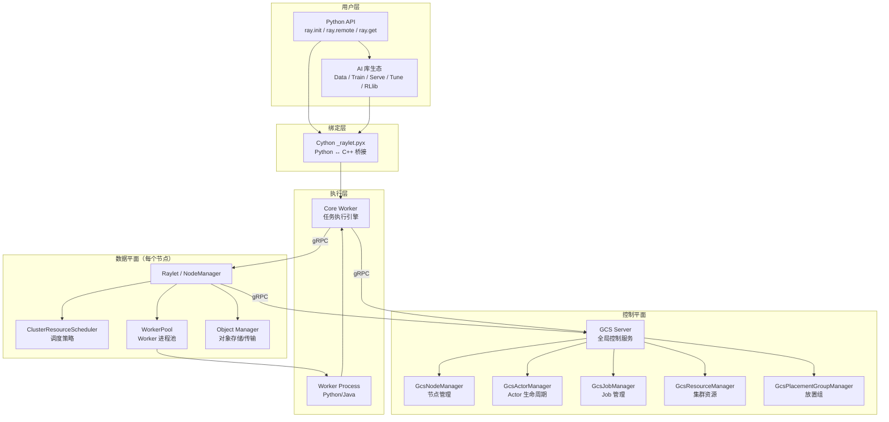
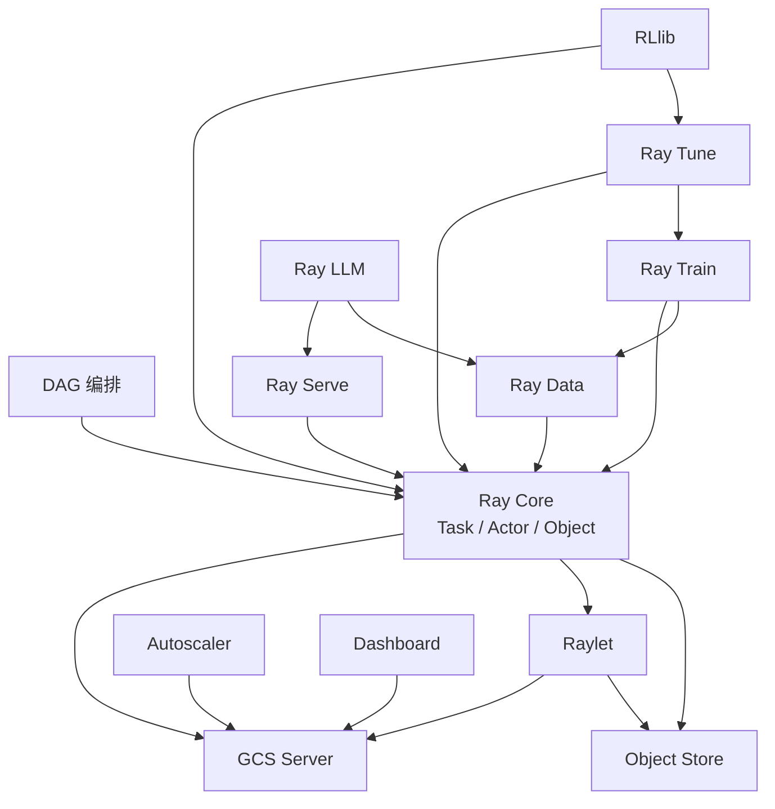
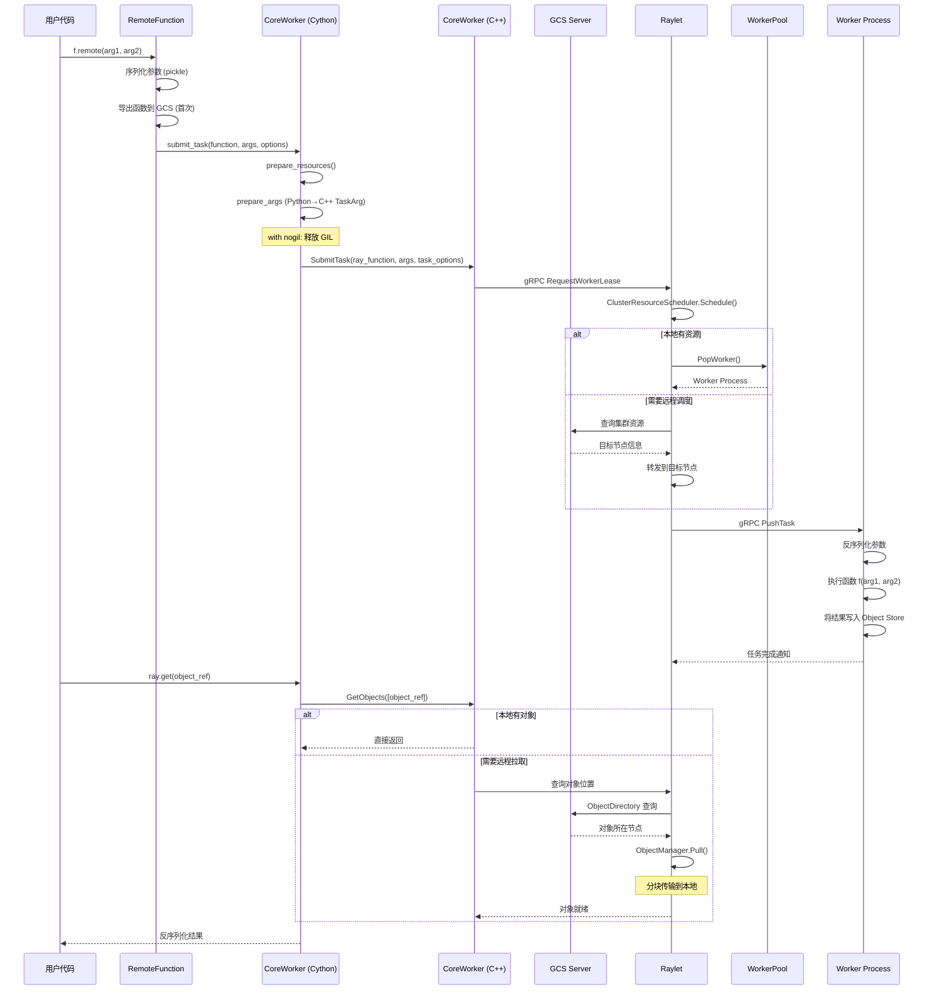
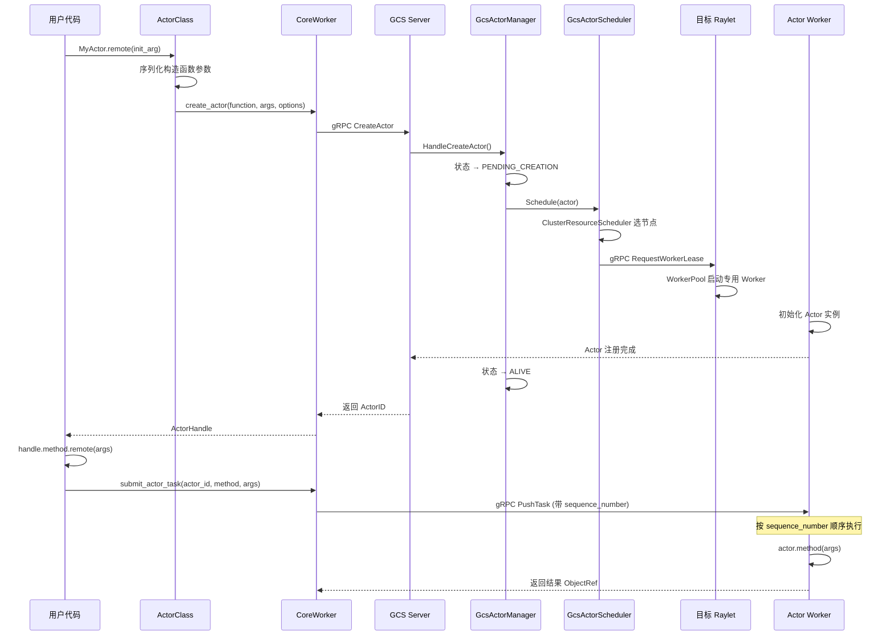

# Ray 源码学习笔记

> 仓库地址：[ray-project/ray](https://github.com/ray-project/ray)
> 学习日期：2026-03-22

---

> **以下为 AI 源码分析**
>
> ### 一句话概括
>
> Ray 是一个统一的分布式计算框架，通过 Task、Actor、Object 三大核心抽象将 Python 应用从单机无缝扩展到集群，并在此基础上构建了 Data、Train、Serve、Tune、RLlib 等 AI 库生态。
>
> ### 要点速览
>
> | 核心模块 | 职责 | 关键文件/目录 |
> |---------|------|-------------|
> | Ray Core | 分布式运行时（Task/Actor/Object） | `python/ray/`, `src/ray/core_worker/` |
> | GCS | 全局控制服务，管理集群元数据 | `src/ray/gcs/` |
> | Raylet | 节点级调度器和资源管理 | `src/ray/raylet/` |
> | Object Store | 分布式对象存储和跨节点传输 | `src/ray/object_manager/` |
> | Ray Data | 可扩展的分布式数据管道 | `python/ray/data/` |
> | Ray Train | 分布式训练框架 | `python/ray/train/` |
> | Ray Serve | 可编程的模型服务框架 | `python/ray/serve/` |
> | Ray Tune | 超参搜索与实验管理 | `python/ray/tune/` |
> | RLlib | 分布式强化学习库 | `rllib/` |
> | Ray LLM | LLM 推理与服务 | `python/ray/llm/` |
> | DAG | 计算图编排与编译执行 | `python/ray/dag/` |
> | Autoscaler | 集群自动扩缩容 | `python/ray/autoscaler/` |
> | Dashboard | 集群监控与可视化 | `python/ray/dashboard/` |

---

## 项目简介

Ray 是由 UC Berkeley RISELab 孵化、Anyscale 公司主导开发的**统一分布式计算框架**。它解决的核心问题是：当今的 AI/ML 工作负载越来越大，单机环境无法满足计算需求，而传统分布式系统的开发门槛过高。Ray 通过极简的 Python API（`@ray.remote` 装饰器 + `ray.get/put`），让开发者无需修改业务逻辑即可将代码从笔记本电脑扩展到千节点集群。其底层 C++ 运行时提供高性能的任务调度、对象存储和故障恢复，上层 AI 库生态覆盖了数据加载、分布式训练、超参搜索、模型服务、强化学习等 ML 全流程。

## 技术栈

| 类别 | 技术 |
|------|------|
| 语言 | Python（用户 API）、C++（核心运行时）、Cython（绑定层）、Java（多语言支持）、TypeScript（Dashboard 前端） |
| 框架 | gRPC（RPC 通信）、Protobuf（序列化）、Arrow（内存数据格式）、aiohttp（Dashboard 后端）、React（Dashboard 前端） |
| 构建工具 | Bazel（C++ 构建）、pip/setuptools（Python 包）|
| 依赖管理 | pip + requirements.txt、Bazel WORKSPACE |
| 测试框架 | pytest（Python）、Google Test（C++） |

## 目录结构

```
ray/
├── src/ray/                    # C++ 核心运行时
│   ├── core_worker/            #   Core Worker：任务提交/执行桥接层
│   ├── gcs/                    #   GCS：全局控制服务
│   ├── raylet/                 #   Raylet：节点级调度和资源管理
│   │   └── scheduling/         #     调度策略（Hybrid/Spread/Pack 等）
│   ├── object_manager/         #   对象存储和跨节点传输
│   ├── rpc/                    #   gRPC 通信基础设施
│   ├── protobuf/               #   Protobuf 消息定义
│   ├── common/                 #   通用数据结构（ID、Status 等）
│   ├── pubsub/                 #   发布/订阅系统
│   └── util/                   #   工具函数
├── python/ray/                 # Python API 和 AI 库
│   ├── __init__.py             #   对外 API 入口（init/remote/get/put）
│   ├── _raylet.pyx             #   Cython 绑定层（Python ↔ C++）
│   ├── remote_function.py      #   @ray.remote 函数装饰器实现
│   ├── actor.py                #   @ray.remote Actor 装饰器实现
│   ├── _private/               #   内部实现（worker、node、services）
│   ├── dag/                    #   DAG 计算图编排
│   ├── data/                   #   Ray Data：分布式数据管道
│   ├── train/                  #   Ray Train：分布式训练
│   ├── serve/                  #   Ray Serve：模型服务
│   ├── tune/                   #   Ray Tune：超参搜索
│   ├── llm/                    #   Ray LLM：大模型推理/服务
│   ├── autoscaler/             #   集群自动扩缩容
│   ├── dashboard/              #   Dashboard 后端和前端
│   └── workflow/               #   Workflow 工作流引擎
├── rllib/                      # RLlib：分布式强化学习
│   ├── algorithms/             #   PPO/DQN/SAC/IMPALA 等算法
│   ├── core/                   #   核心抽象（RLModule、Learner）
│   └── env/                    #   环境接口适配
├── java/                       # Java API 实现
├── cpp/                        # C++ API 头文件
├── docker/                     # Docker 镜像构建
├── ci/                         # CI/CD 配置
├── release/                    # 发布和性能测试
└── doc/                        # 文档源码
```

## 架构设计

### 整体架构

Ray 采用**集中管理 + 分散执行**的分布式架构。GCS（Global Control Service）作为全局控制平面，负责集群元数据管理和全局调度决策；每个节点运行一个 Raylet 作为本地数据平面，负责任务调度、Worker 进程管理和对象存储。Python 用户代码通过 Cython 绑定层与 C++ 运行时交互，实现高性能的跨语言调用。



### 核心模块

#### 1. Ray Core（分布式运行时）

**职责**：提供 Task、Actor、Object 三大分布式原语，是整个 Ray 生态的基础。

**核心文件**：
- `python/ray/__init__.py` — 对外 API 入口，暴露 `init()`、`remote()`、`get()`、`put()` 等
- `python/ray/remote_function.py` — `RemoteFunction` 类，实现 `@ray.remote` 函数装饰器
- `python/ray/actor.py` — Actor 装饰器，通过 `_make_actor()` 创建远程 Actor 类
- `python/ray/_private/worker.py` — `Worker` 全局单例，管理连接和 CoreWorker
- `python/ray/_private/node.py` — `Node` 类，负责启动/管理本节点所有进程

**关键接口**：
- `ray.remote(func_or_class)` → 返回 `RemoteFunction` 或 `ActorClass`
- `RemoteFunction._remote()` → 序列化参数 → `core_worker.submit_task()` → 返回 `ObjectRef`
- `ActorClass._remote()` → `core_worker.create_actor()` → 返回 `ActorHandle`
- `ray.get(obj_ref)` → `core_worker.get_objects()` → 阻塞等待结果
- `ray.init(address)` → `connect()` → 创建 `CoreWorker` → 连接 GCS 和 Raylet

**设计亮点**：
- `AUTO_INIT_APIS` 机制：首次调用 `ray.get()`/`ray.put()` 等 API 时自动触发 `ray.init()`
- GIL 释放：Cython 层使用 `with nogil:` 释放 Python GIL，允许 C++ 并行执行

#### 2. GCS（全局控制服务）

**职责**：集群的"大脑"，集中管理所有元数据——节点、Actor、Job、资源、放置组。

**核心文件**：
- `src/ray/gcs/gcs_server.h/cc` — GCS Server 主入口
- `src/ray/gcs/gcs_node_manager.h` — 节点注册、心跳、故障检测
- `src/ray/gcs/gcs_actor_manager.h` — Actor 状态机（PENDING → ALIVE → RESTARTING → DEAD）
- `src/ray/gcs/gcs_client/gcs_client.h` — GCS 客户端，使用 Accessor 模式

**关键类**：
- `GcsServer` — 包含所有 Manager 组件的聚合根
- `GcsNodeManager` — `HandleRegisterNode()` / `OnNodeFailure()`
- `GcsActorManager` — Actor 5 种状态的完整生命周期管理
- `GcsClient` — `Actors()` / `Nodes()` / `Jobs()` 等 Accessor 接口

**存储后端**：
- `InMemoryStoreClient` — 开发/测试用
- `RedisStoreClient` — 生产环境，持久化存储

**PubSub 通道**：GCS 通过发布/订阅机制将状态变更推送到各组件（`GCS_ACTOR_CHANNEL`、`GCS_NODE_INFO_CHANNEL` 等）。

#### 3. Raylet（节点调度器）

**职责**：每个节点的"管家"，管理本地资源、调度任务到 Worker、与 GCS 协调。

**核心文件**：
- `src/ray/raylet/node_manager.h/cc` — NodeManager，Raylet 核心
- `src/ray/raylet/worker_pool.h` — Worker 进程池（创建、复用、销毁）
- `src/ray/raylet/scheduling/cluster_resource_scheduler.h` — 调度器主入口
- `src/ray/raylet/scheduling/policy/` — 调度策略目录

**调度策略**：
| 策略 | 说明 |
|------|------|
| `HybridSchedulingPolicy` | 默认策略，平衡冷启动开销与资源利用率 |
| `NodeAffinitySchedulingPolicy` | 偏好特定节点 |
| `RandomSchedulingPolicy` | 随机分散负载 |
| `NodeLabelSchedulingPolicy` | 标签选择器匹配 |
| `BundlePackSchedulingPolicy` | 放置组紧凑打包 |
| `BundleSpreadSchedulingPolicy` | 放置组分散部署 |

**Worker 生命周期**：
- `WorkerPool` 维护空闲 Worker 池，支持按语言（Python/Java）和类型（普通/Actor/Spill/Restore）分类复用
- 预启动 Worker：`num_prestart_python_workers` 配置提前创建 Worker 减少冷启动延迟

#### 4. Object Store（对象存储）

**职责**：管理分布式对象的本地存储和跨节点传输。

**核心文件**：
- `src/ray/object_manager/object_manager.h/cc` — 对象管理器
- `src/ray/object_manager/pull_manager.h` — 对象拉取管理（优先级调度）
- `src/ray/object_manager/push_manager.h` — 对象推送管理

**拉取优先级**（从高到低）：
1. `GET_REQUEST` — `ray.get()` 调用
2. `WAIT_REQUEST` — `ray.wait()` 调用
3. `TASK_ARGS` — 任务参数获取

**传输机制**：大对象按 `object_chunk_size` 分块传输，最多 `max_bytes_in_flight` 字节并行传输。

#### 5. AI 库生态

**Ray Data**（`python/ray/data/`）：
- 核心抽象：`Dataset` — 由 Arrow Table/Pandas DataFrame 块组成的分布式数据管道
- 惰性执行：逻辑计划 → 物理计划 → 块级并行执行
- 数据源：Parquet、CSV、JSON、Images、Kafka、Delta、Iceberg、Lance 等 20+ 种格式

**Ray Train**（`python/ray/train/`）：
- 核心抽象：`BaseTrainer` → `DataParallelTrainer` → `TorchTrainer` / `TensorflowTrainer`
- 配置驱动：`ScalingConfig`（Worker 数/GPU）+ `RunConfig`（检查点/容错）+ `DataConfig`
- 训练循环 API：`ray.train.report(metrics)` / `ray.train.get_checkpoint()`

**Ray Serve**（`python/ray/serve/`）：
- 核心抽象：`Deployment`（`@serve.deployment` 装饰的类/函数）→ 多副本 Actor
- 请求链：HTTP → Router → DeploymentHandle → Replica Actor → Response
- 自动扩展：`AutoscalingConfig` 基于延迟/吞吐动态调整副本数

**Ray Tune**（`python/ray/tune/`）：
- 核心抽象：`Tuner` + `Trainable` + `SearchAlgorithm` + `TrialScheduler`
- 搜索算法：Grid、Random、Optuna、HyperOpt、BayesOpt、BOHB 等
- 调度策略：HyperBand（提前终止差 Trial）、PBT（群体进化学习）

**RLlib**（`rllib/`）：
- 核心抽象：`Algorithm` + `Policy` + `EnvRunner` + `Learner` + `RLModule`
- 并行采样：多个 `EnvRunner` Actor 同时与环境交互
- 算法实现：PPO、DQN、SAC、APPO、IMPALA 等

**Ray LLM**（`python/ray/llm/`）：
- 基于 Ray Serve 的 LLM 推理和服务能力
- 支持批处理推理和动态批大小调整

### 模块依赖关系



## 核心流程

### 流程一：Task 提交与执行

从用户调用 `f.remote(args)` 到获取结果 `ray.get(ref)` 的完整调用链。



**关键步骤说明**：

1. **函数导出**：首次调用时，`RemoteFunction` 通过 `function_actor_manager.export()` 将函数元数据注册到 GCS
2. **GIL 释放**：Cython 层在调用 C++ 前释放 GIL，避免阻塞其他 Python 线程
3. **调度决策**：Raylet 使用 `HybridSchedulingPolicy` 综合评估冷启动开销、资源利用率、数据本地性
4. **Worker 复用**：`WorkerPool` 优先复用空闲 Worker，避免进程创建开销
5. **对象拉取**：`PullManager` 按优先级调度拉取请求，`GET_REQUEST` 优先级最高

### 流程二：Actor 创建与方法调用

Actor 是 Ray 的有状态抽象，其创建需要 GCS 全局协调。



**Actor 状态机**：
```
DEPENDENCIES_UNREADY → PENDING_CREATION → ALIVE → RESTARTING → ALIVE
                                            ↓                    ↓
                                          DEAD  ←──────────── DEAD
```

**关键设计**：
- Actor 方法调用通过 `sequence_number` 保证同一 Actor 的方法按提交顺序执行
- `max_restarts` 配置 Actor 故障时的自动重启次数
- Actor Worker 是专用进程，不会被回收到 WorkerPool 中复用

## 关键设计亮点

### 1. Ownership-Based 分布式引用计数

**问题**：分布式系统中如何高效管理对象生命周期，避免内存泄漏又不引入过多通信开销？

**实现**：Ray 采用 Ownership 模型（参见论文 *Ownership: A Distributed Futures System for Fine-Grained Tasks*）。每个 `ObjectRef` 的创建者即为 Owner，负责跟踪该对象的引用计数。只有当 Owner 确认所有引用已释放时，才通知 Object Store 回收对象。

**关键文件**：`src/ray/core_worker/reference_counter.h`

**优势**：相比全局引用计数（需要 GCS 参与每次引用变更），Ownership 模型将引用管理分散到各个 Worker，大幅减少 GCS 的通信压力。

### 2. 混合调度策略（HybridSchedulingPolicy）

**问题**：分布式调度面临冷启动开销、资源碎片化、数据本地性三者的平衡难题。

**实现**：`HybridSchedulingPolicy`（`src/ray/raylet/scheduling/policy/hybrid_scheduling_policy.h`）采用分层评分机制：
1. 过滤不可行节点（资源不足）
2. 优先选择已有可用 Worker 的节点（避免冷启动）
3. 按临界资源利用率排序（平衡负载）
4. 设置利用率阈值（避免 noisy neighbor 问题）
5. Top-K 随机选择（增加负载均衡）

**优势**：单一策略（如纯贪心或纯随机）无法同时优化多个目标，混合策略通过分层决策在各维度间取得平衡。

### 3. 编译 DAG（CompiledDAG）加速执行

**问题**：标准 Ray Task 每次调用都经过完整的序列化 → RPC → 调度 → 执行链路，对于高频 DAG 执行场景（如 LLM 推理 Pipeline）开销过大。

**实现**：`CompiledDAG`（`python/ray/dag/compiled_dag_node.py`，3000+ 行）在首次编译时：
- 分析 DAG 拓扑结构，生成 `_DAGOperationGraph`
- 为每对节点建立专用 Channel（共享内存/NCCL）
- 生成静态执行调度表（READ → COMPUTE → WRITE 循环）
- Actor 端进入循环执行模式，跳过常规调度

**关键文件**：`python/ray/dag/dag_node_operation.py`（操作图和执行调度）

**优势**：编译后的 DAG 避免了重复的序列化、gRPC 调用和调度决策，吞吐量可提升数倍。支持 NCCL 张量传输优化多 GPU 场景。

### 4. 自动 GIL 释放的 Cython 绑定层

**问题**：Python GIL 限制了多线程并发，如果 C++ 操作期间持有 GIL，所有 Python 线程都会被阻塞。

**实现**：`python/ray/_raylet.pyx` 中所有耗时的 C++ 调用都包裹在 `with nogil:` 块中：
```cython
with nogil:
    return_refs = CCoreWorkerProcess.GetCoreWorker().SubmitTask(
        ray_function, args_vector, task_options, ...
    )
```

**优势**：任务提交、对象获取等操作在 C++ 层执行期间不会阻塞 Python 线程，使得单个 Worker 进程可以同时处理多个并发请求。

### 5. 多层存储与自适应对象溢写

**问题**：分布式计算中产生的大量中间对象可能超出内存容量。

**实现**：Ray Object Store 实现了多层存储策略：
- **层1 — 进程内存储**：`memory_store`（`src/ray/core_worker/store_provider/memory_store/`）存储小对象，无需序列化
- **层2 — Plasma 共享内存**：`plasma_store_provider`（`src/ray/core_worker/store_provider/`）存储大对象，支持零拷贝跨进程访问
- **层3 — 磁盘溢写**：当 Plasma 内存不足时，通过 `SPILL_WORKER` 将对象溢写到磁盘或云存储，`RESTORE_WORKER` 负责按需恢复

**关键文件**：`src/ray/core_worker/core_worker.h` 中的 `store_provider` 子模块

**优势**：分层设计让热数据留在内存实现零拷贝访问，冷数据自动溢出到持久存储，用户无需手动管理内存。
