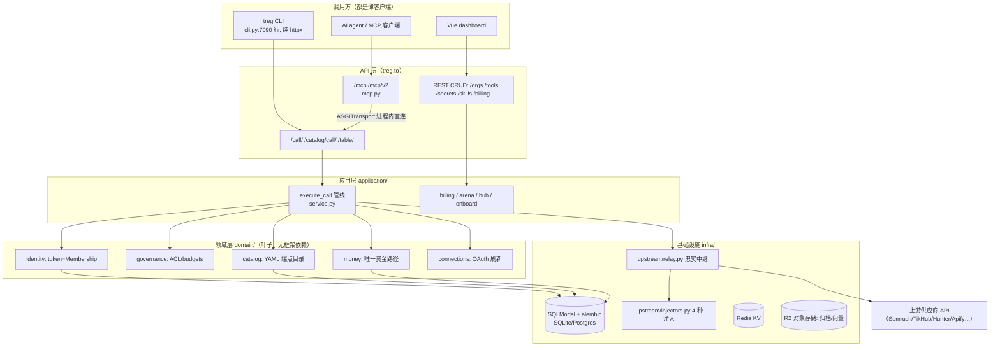
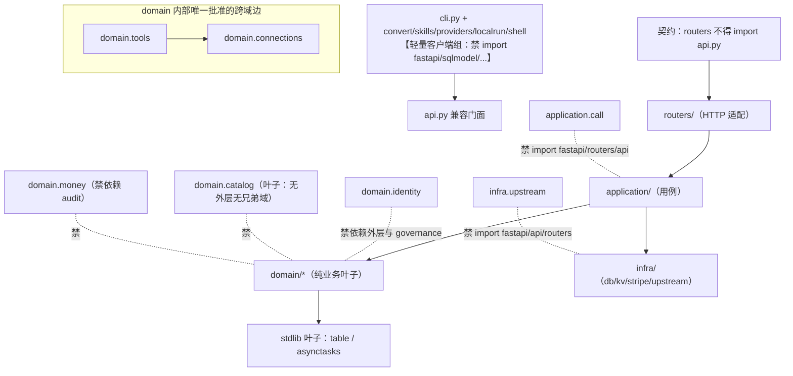
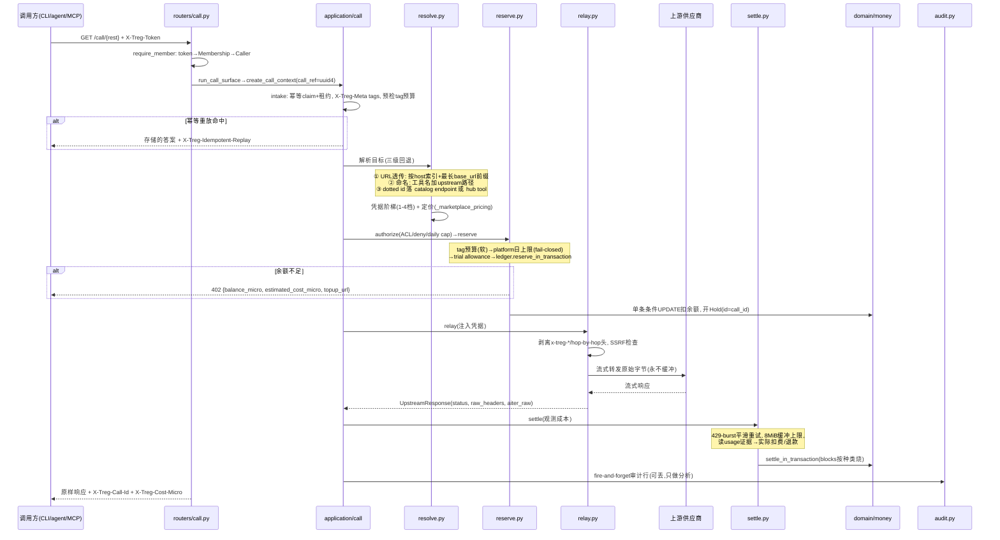
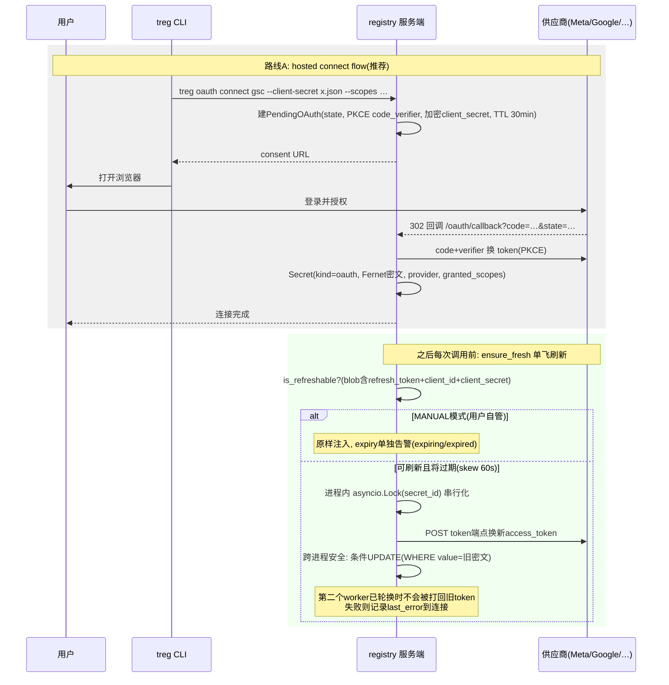

# treg 源码学习笔记

> 仓库地址：[treg](https://github.com/superdesigndev/treg)
> 学习日期：2026-10-01

---

> **以下为 AI 源码分析**
>
> ### 一句话概括
>
> treg 自称 "OpenRouter for Tools"：一个把上千个第三方 API 端点策展成目录、并把团队自有凭据/技能/CLI 统一托管的服务端凭据注入代理（registry），AI agent 只需一个 base URL + 一个 token 就能按次计费调用任何工具，而密钥永远不离开服务器。
>
> ### 要点速览
>
> | 模块 | 职责 | 关键文件 |
> |------|------|----------|
> | `bootstrap.py` | FastAPI 组合根，all/dataplane/control 三种部署角色 | `src/treg/bootstrap.py:702` `create_app()` |
> | `routers/` | HTTP 适配层，20 个 router（auth/billing/call/catalog/orgs…） | `src/treg/routers/` |
> | `application/call/` | 被代理调用的分阶段用例（resolve→reserve→relay→settle） | `src/treg/application/call/service.py:149` `execute_call()` |
> | `infra/upstream/relay.py` | 忠实流式中继 + 凭据注入，"整个产品就一个函数" | `src/treg/infra/upstream/relay.py:122` `relay()` |
> | `infra/upstream/injectors.py` | 4 种凭据形态的注入缝（env/cli_auth/secret_file/oauth） | `src/treg/infra/upstream/injectors.py` |
> | `domain/money/` | 唯一资金路径，micro-USD 整数账本 | `src/treg/domain/money/__init__.py` |
> | `domain/catalog/` | 端点目录（YAML 策展）加载与检索 | `src/treg/domain/catalog/store.py` + `src/treg/catalog/*.yaml` |
> | `models.py` | 55 张 SQLModel 表 | `src/treg/models.py` |
> | `cli.py` | 60+ 命令的轻量纯客户端（禁止 import 服务端依赖） | `src/treg/cli.py` |
> | `mcp.py` | MCP 前门（/mcp 与 /mcp/v2），复用 execute_call | `src/treg/mcp.py` |

---

## 项目简介

treg 解决的问题是：AI agent 做真实工作需要的工具（SEO、外链、社媒、拓客、爬取、图片/视频生成）都锁在没人会为单次运行购买的订阅（Semrush $139/mo、Crunchbase $99/mo）或邀请墙后面。treg 用一个 registry 同时提供两半能力：**The catalog**——策展的上千个跨供应商端点，用 treg 自己的 key 服务，按次计费（从一美分起）；**Your own tools**——团队成员注册的任意 API key、OAuth 连接、厂商 CLI、SKILL.md 技能，凭据注入全部在服务端完成，其他成员的 agent 调用时永远拿不到密钥本身。核心产品哲学写在 `docs/context/foundation/charter.md`：**代理只中继、不建模上游（relay, never model），认证服务端注入（inject auth server-side）**，因此上游 API 变更不会破坏 treg，调用方也永远不持有密钥。

## 技术栈

| 类别 | 技术 |
|------|------|
| 语言 | Python 3.12+（`requires-python >=3.12,<3.14`） |
| 框架 | FastAPI + Starlette（服务端）；argparse 自研 CLI |
| ORM/DB | SQLModel + SQLAlchemy(async) + Alembic（55 张表、55 个 migration），SQLite（dev）/ Postgres（prod） |
| 构建工具 | hatchling（sdist/wheel），uv（`uv.lock`，`required-version >=0.12`） |
| 依赖管理 | pyproject 三档 extras：base（仅 CLI：httpx/posthog/questionary）、`[server]`（FastAPI/SQLModel/stripe/redis/obstore/quickjs/mcp/numpy）、`[proxy]`（cryptography） |
| 测试框架 | pytest + pytest-asyncio + pytest-xdist；Playwright（E2E）；import-linter（13 条架构契约） |
| 前端 | Vue 3 + TypeScript + Vite（dashboard），构建产物打包进 `src/treg/web/dashboard/` |
| 部署 | Render（`deploy/render.example.yaml`，生产 runbook 在私有仓库 treg-internal） |

## 目录结构

```
treg/
├── src/treg/                  # 唯一的 Python 包（wheel 只打包这里）
│   ├── __main__.py            # python -m treg：keygen / upgrade / serve（uvicorn :18790）
│   ├── bootstrap.py           # FastAPI 组合根：create_app(role)，路由所有权 manifest
│   ├── api.py                 # 兼容层：拼接 routers/ 的路由，尾部 app = create_app()
│   ├── cli.py                 # treg CLI（7090 行，60+ 命令，纯客户端）
│   ├── mcp.py                 # MCP 前门：/mcp、/mcp/v2 directory MCP、MCP OAuth
│   ├── models.py              # 55 张 SQLModel 表
│   ├── catalog/               # 端点目录数据：114 个 provider YAML（+extended/aliases）
│   ├── routers/               # HTTP 适配层（auth/billing/call/catalog/orgs/…）
│   ├── application/           # 用例层（call 管线/billing/arena/hub/onboard）
│   ├── domain/                # 纯业务域（identity/governance/tools/connections/catalog/money…）
│   ├── infra/                 # 基础设施（db/kv/object_store/stripe/upstream/oauth_refresh）
│   ├── web/                   # 随包分发的静态资产（dashboard/landing/llms.txt/install.sh）
│   ├── localproxy.py          # treg shell 的本地 MITM 代理（CA + allow-list）
│   ├── localrun.py/runner.py  # treg run 两档：本地注入执行 / 服务端执行
│   └── worker.py              # treg-worker：Render cron 的维护命令（capacity sweep 等）
├── frontend/                  # Vue 3 dashboard 源码（Vitest + Playwright）
├── skills/                    # 官方 workflow skills（treg/lead-signals/make-ugc）
├── plugin/ + plugins/ + .claude-plugin/ + .cursor-plugin/  # 五个分发渠道共享 skills/ 源
├── packages/npm/              # @superdesign/treg npm 启动器
├── docs/context/              # 设计文档片段体系（foundation/architecture/interface/ops）
├── tests/                     # ~185 个测试文件 + callmatrix/ 端到端调用矩阵
├── scripts/                   # dev-local.sh（tmux 一键起栈）/ build_plugin.py / catalog 数据管道
└── deploy/render.example.yaml # Render 部署蓝图
```

## 架构设计

### 整体架构

treg 的服务端是一个**分层 + 部署角色可拆分**的单体。分层从外到内：`routers/`（HTTP 适配，把请求翻译成用例调用）→ `application/`（用例编排，framework-neutral）→ `domain/`（纯业务规则，import-linter 强制为叶子：不得 import fastapi/starlette/api/routers/application）→ `infra/`（DB/Redis/对象存储/上游中继）。这套边界不是口头约定——`pyproject.toml` 里 13 条 import-linter 契约在 CI 里跑，例如"Lightweight CLI modules do not import server dependencies"直接锁死了 CLI 的轻量纯度（pip 安装 base 包只有 3 个依赖）。

组合根 `bootstrap.py` 的 `create_app(role)` 支持三种部署角色：`all`（默认）、`dataplane`（只有 `/call`、`/catalog/call`、`/table` 和 MCP mount——纯代理流量）、`control`（管理面 + OAuth 签发，无 MCP）。路由归属用两个 frozenset manifest（`_CONTROL_ROUTE_KEYS` / `_DATAPLANE_ROUTE_KEYS`，`bootstrap.py:48-359`）显式声明，每条 `(path, methods, name)` 三元组都必须登记——新增一个路由忘了登记，`_owned_routes()` 直接 raise，app 创建失败。这是"清单即架构"的强约束。



### 核心模块

**1. 调用管线 `application/call/`（产品心脏）**
`execute_call()`（`service.py:149`）是一个分阶段、framework-neutral 的用例：`intake.py`（幂等 claim + `X-Treg-Meta` tags 解析 + 预检 tag 预算）→ `resolve.py`（目标解析与市场定价，2336 行）→ `authorize.py`（ACL/deny/daily cap）→ `reserve.py`（资金预留）→ `route.py`（`treg.<capability>` 一方路由端点）→ `relay` → `settle.py`（观测成本结算 + 证据归档，1419 行）→ `types.py`（`CallInput`/`CallContext`/`CallFailure` 等纯数据类型）。所有失败用类型化异常 `CallFailure(kind, status_code, detail)` 表达，HTTP 层统一翻译。

**2. 忠实中继 `infra/upstream/relay.py`**
`relay()` 是"整个产品就一个函数"（作者原话）。忠实契约：只改 4 件事——(1) hop-by-hop 传输头重推导；(2) treg 控制头与边缘转发头剥离（用 `x-treg-` **前缀规则**而非枚举，注释里明说枚举曾漏掉 `x-treg-client` 导致事故）；(3) binding 声明的凭据注入（只覆写目标 header/query/JSON 字段）；(4) 共享 key 档位下把调用方的 `Idempotency-Key` 按 org+pin 重哈希，防止多租户共享供应商账号时互相串任务。请求体**永不缓冲**（JSON binding 是唯一例外），响应用 `aiter_raw()` 透传原始字节，并为浏览器误入场景附加 `nosniff + CSP sandbox` 防 XSS。

**3. 注入缝 `infra/upstream/injectors.py`**
binding 是纯 dict：`{secret_id, injector, location: header|query|json, name, format, secret_field, token_encode}`。代理核心从不按认证形态分支——只查 `INJECTORS[binding["injector"]]` 注册表。4 种形态：`env`（纯字符串）、`cli_auth`（从 CLI keychain 提取的材料）、`secret_file`（JSON token 文件拉字段）、`oauth`（access_token，自动刷新刻意不在这里——刷新是网络+持久化，属于 connect 流程，不属于热注入路径）。加新形态零代理改动。

**4. 资金域 `domain/money/__init__.py`**
"唯一动钱的代码路径"：`grant/topup/reserve/settle/release` 五个操作，全 micro-USD 整数（一次调用约 600 micro，cents 表示不了，浮点会漂移）。不变量 `org.balance_micro == sum(block.remaining_micro) - sum(open hold.amount_micro)`，`balance_micro` 是物化列使 `reserve` 能写成单条条件 UPDATE（`UPDATE org SET balance_micro = balance_micro - :est WHERE balance_micro >= :est`），由数据库而非应用进程裁决谁能拿到最后一分钱。CreditBlock 按种类顺序烧：promotional/referral/bonus → earned（hub 卖家收入）→ purchased（真金白银最后烧）。Hold 以 call_id 为主键，reaper 懒惰地在下一次 `reserve` 顶部顺手回收本 org 的过期 hold——不需要调度器和 leader election。margin 只在模块内部（`with_margin`）加，reserve 和 settle 同时记录生效费率，费率变更无法追溯改写历史。

**5. 目录域 `domain/catalog/` + `src/treg/catalog/*.yaml`**
114 个 provider YAML 手工策展，每个 endpoint 有 `id`（如 `hunter.people.email.find`）、`capability` 分类、输入 schema、`cost`（价格 + source 来源 + checked 日期 + confidence 置信度 + verified 实测日期）、`test_request`、`example_response`。YAML 里的注释本身就是证据链——例如 `hunter.yaml` 顶部记录了实测发现："`requests.credits.used` 才是计量表，`requests.searches` 会 5 倍多算"、"Hunter 对重复查询免费，观测到 delta=0 是缓存证据不是价格证据"。`_enforce_catalog_query/_enforce_catalog_body`（`resolve.py:1278/1307`）执行 `strict_query` 端点参数校验。

**6. 多租户与身份 `domain/identity/` + `models.py`**
token = 一个 `(user, org)` Membership（`Membership.token_hash`），一切资源按 org 作用域。角色 owner/admin/member/viewer。`ApiKey`（managed keys）支持 default/agent 两种 kind，带 `safe_prefix`、事件审计、吊销/轮换。`Secret.value` 是 Fernet 密文（`crypto.py`，`TREG_SECRET_KEY`，未配置则每进程临时 key——重启即失效，明示 dev 行为）；token 一律存 SHA-256 明文哈希（token 本身高熵无需 pepper）。

**7. MCP 前门 `mcp.py`（2134 行）**
`/mcp`（streamable-http，stateless）暴露 catalog_search/catalog_get/call/call_media/resources_list/balance/my_tools/hub_* 等 **~12 个**工具而非 2600 个端点——"目录是数据，不是 schema 洪水"。`/mcp/v2` 是 Claude connector 专用只读面：catalog_call_read（仅 GET/HEAD/OPTIONS）与 catalog_call_write 分离，让 Claude 拿到准确的安全信号。关键设计：MCP tool 内部用 `httpx.ASGITransport` **进程内直连自身 app** 转发到 `/catalog/call/`，ACL/预算/结算只实现一次。MCP OAuth 完整实现 RFC 9728（protected resource metadata、authorization server metadata、S256 PKCE、HMAC access token 强制校验 `aud`、AT 1h / RT 30d 带轮换与复用检测）。

**8. CLI `cli.py`（7090 行）**
argparse 自研 + `_GroupedHelpParser` 分组帮助。60+ 命令：catalog/call/tool/secret/skill/hub/org/balance/topup/run/shell/with/serve/scan/upload/connections/mcp 等。配置在 `~/.treg/config.json`（原子写 + chmod 600），`treg login` 三路登录（浏览器 device pairing / email OTP / `--token` CI）。亮点：`treg call https://api.stripe.com/v1/balance` 整 URL 透传——agent 不用学 treg 词汇，服务端按 host 解析；未知首参数自动改写为 `treg with`。

### 模块依赖关系

import-linter 契约（pyproject.toml:96-344）强制出的依赖方向——箭头指"依赖"：



三个"叶子"值得注意：`domain/table`（"输入一个答案，输出行和列"，连 httpx 都不许 import）、`domain/asynctasks`（与轻量 CLI 共享的 stdlib 叶子）、`domain/catalog`（不得依赖任何外层与兄弟域）。

## 核心流程

### 流程一：`/call/{rest}` 被代理调用的完整链路（产品主流程）

CLI 的 `treg call tikhub.tiktok.user.profile --query uniqueId=tiktok`、agent 的 URL 透传 `GET https://treg.to/call/https://api.intercom.io/...`、MCP 的 `call` 工具，最终都汇入同一条 `execute_call` 管线：



关键细节：

- **解析的三级回退**（`resolve.py:61` `_resolve_call`）：URL 透传时先按 host（有索引）查 org 内 tools，再取最长 `base_url` 前缀（按路径段边界匹配，`.../v2` 不会误配 `.../v20`）；同长度歧义时若恰有一个 provider 支持的 OAuth 工具则优先它，否则 409 让调用方点名。named miss 且带路径时，错误信息直接列出 catalog endpoint 的参数槽位（`resolve.py:147`）。
- **凭据阶梯**（`resolve.py:218` 注释）：(1) org 自己绑定该 provider 的 tool → 用那个 key；(2) org 存了该 provider 的 secret → 构造**永不持久化的虚拟 tool** 注入（不污染注册表）；(3) 有 verified 公开路由 → 免费匿名；(4) treg 自己的 key → 计费，且 platform key 只以 `platform_setting` 名字存在于虚拟 binding 里，`relay()` 调用时才从 settings 读值——平台凭据不可被列举、不可被 local run 提取。**调用方自己的 key 永远赢过 treg 的**，own-key 调用不计费。
- **审计与账本的分工**：审计行 fire-and-forget（`audit.py` 队列有界、超载丢行——"对分析是对的，对钱是致命的"，所以钱走同步 ledger 同事务写入）。响应头 `X-Treg-Call-Id` 是外部 join key，`/calls/{ref}` 同时返回 ledger 视图，因为审计行可能已被丢弃而账本不会。

### 流程二：OAuth 连接——首 token 三路获取与单飞自动刷新



设计要点（`domain/connections/refresh.py:133` `ensure_fresh`）：刷新前先 `db.refresh(secret)` 重读（别的 worker 可能刚刷完）；换 token 的网络调用前**先结束读事务**（不让慢供应商占住共享连接池）；写回用乐观并发（`UPDATE ... WHERE Secret.value == old_value`），输了就采纳赢家的 blob 注入。健康检查（`health.py`）复用同一条 `ensure_fresh` 路径——一个真源。非刷新 token 的 expiry 独立于 health 呈现：LinkedIn 非 partner token在 60 天整点静默死亡，`needs_reconnect` 是 UI 唯一需要展示的字段。

### 流程三：`treg run` CLI 双档执行与本地 MITM 代理

- **server 档**：`POST /run`（`api.py:882`）在服务端起子进程注入 `cli.inject` secrets，bin 白名单（`_allowed_server_bins`），`runner.run_slot` 全局+每用户并发闸，argv 过 `_redact_argv`（识别 sk_/ghp_/JWT/24+ 高熵串 + 凭据 flag 的后随值）后才入审计。
- **local 档**：`POST /tools/{name}/grant`（`api.py:524`）下发进程材料（env/argv/broker 三种交付标签）。**runner-proof 门**：注入别人 key 时必须持 `X-Treg-Run-Proof`（成员读不到的值）证明运行在隔离的 treg-run runner 里，且响应带 `redact_output: true` 让客户端从输出里洗掉密钥（防 `gh auth token` 回显）。run-report 只回传枚举 verdict（`credential_invalid` 等），stderr 在本地匹配、原始输出不出机器。
- **`treg serve` 本地代理**（`localproxy.py`）：HTTPS_PROXY + 本机生成的 CA（0600、绝不进系统信任库、只经 `NODE_EXTRA_CA_CERTS` 等环境变量作用于 agent 进程树）拦截 agent 自己发出的 `api.stripe.com` 请求，重定向到 `/call/` 透传路径——因此解析、ACL、deny、日限、审计、OAuth 刷新全部复用，无需第二份实现。allow-list 之外的 host 一律盲隧道不可读（这也防止读取 agent 自己的 `api.anthropic.com` 流量）。

## 关键设计亮点

**1. 忠实代理契约——"中继，不建模"**

- 解决的问题：任何"聚合网关"最大的维护成本是上游 API 变更时要改适配层；同时调用方要求 agent 可以直接把真实 API 请求加个前缀就用。
- 实现：`relay.py` 头部文档列死只改 4 件事（hop-by-hop 头、treg 控制头、注入的凭据、共享档位的幂等 key 重划域），其余字节——方法、路径、重复的 query 参数、调用方 cookie、流式 body——全部逐字透传。头剥离用 `x-treg-` 前缀规则而非枚举（注释承认枚举曾漏掉 `x-treg-client` 泄漏了调用方运行时名）。
- 为什么：上游怎么变都不关 treg 事；agent 也不用学新词汇（`treg call https://真实URL`）。

**2. import-linter 契约即活文档**

- 解决的问题：分层架构靠口头约定必然腐化；CLI 包想保持"pip 装完即用"的轻量，最怕悄悄长出 FastAPI 依赖。
- 实现：`pyproject.toml` 13 条契约（"Lightweight CLI modules do not import server dependencies"、"Catalog domain is a leaf"、"Money domain does not depend on best-effort audit"…），CI 强制执行；连"契约里列了却不存在的 ignore_imports"都设为 error。
- 为什么：架构约束可执行、可在 PR review 前拦截；新贡献者读 pyproject 就知道边界在哪。

**3. 路由所有权 manifest（dataplane/control 拆分）**

- 解决的问题：想在 Render 上把高流量代理路径与管理面分开扩缩容，但单体代码天然全量挂载路由。
- 实现：`bootstrap.py` 两个 frozenset 登记全部约 280 条 `(path, methods, name)`；`_owned_routes()` 校验 overlap/missing/stale/duplicates 四类错误，任何一项非空即 RuntimeError。角色还决定后台任务（dataplane 不跑 arena 统计）与启动检查。
- 为什么：清单与路由的双向校验让"新路由忘登记"不可能静默溜进 dataplane——错误在 app 创建时就炸。

**4. micro-USD 整数账本 + 单条条件 UPDATE 资金预留**

- 解决的问题：按次计费（$0.0006/次）下浮点漂移、cents 精度不足、并发争抢余额。
- 实现：`domain/money` 是唯一动钱的模块；`reserve` 写成一条 `UPDATE ... WHERE balance_micro >= :est`，由数据库裁决，N 并发对只够 K 次的余额恰好成功 K 次；Hold 表主键就是 call_id，reaper 懒惰地在同 org 下次 reserve 顶部顺带回收；不变量写成物化列。tag 预算明确文档化为"软上限"（并发可超、有硬闸兜底），与 org 余额/platform 日上限的"硬"诚实区分。
- 为什么：资金正确性不依赖应用锁与调度器；审计（可丢行）与账本（同步、同事务）的分工被写成模块级契约。

**5. 幂等与缓存尊重到调用方语义**

- 解决的问题：agent 重试同一请求时不应双重计费；供应商幂等标头在多租户共享 key 下会互相串任务。
- 实现：`intake.py` 先 claim 幂等标签（带租约续期任务），失败路径**必须**释放标签（否则后续重试全部 409——测试专门覆盖）；重放返回 `X-Treg-Cost-Micro: 0` + 原始成本单独 echo，客户端求和不会双计。共享档位下 `scope_shared_idempotency_key` 把调用方的 `Idempotency-Key` 哈希进 (org, pin) 命名空间（2026-09-09 在 LeadsForge 实测出的跨租户串任务问题）。归档命中（`X-Treg-Cache: hit`）与重复问题定价（团队已为同一问题付过费）走 `archive.py` 的内容寻址（key_hash+content_hash）。
- 为什么：计费系统的可信度建立在"每次请求恰好收一次正确的钱"上。

**6. 本地执行的安全门——凭据"能运行但不能看见"**

- 解决的问题：`treg run` 本地档要把凭据交给成员机器上的 CLI 进程，与"密钥不出服务器"的承诺冲突。
- 实现：三层——(a) owner/admin 或自己的 key 直发；(b) 共享 key 必须持 `X-Treg-Run-Proof`（HMAC 比对，成员读不到的 settings 值）证明隔离 runner，且 `redact_output` 防回显；(c) run-report 只传枚举 verdict，stderr 本地匹配。argv 在入审计前经 `_redact_argv`（正则带 ReDoS 防御注释：锚点 + possessive `++`）。
- 为什么：把"使用凭据"与"持有凭据"分开成两个不同的权限面，泄漏面收敛到隔离 runner 一个点。
