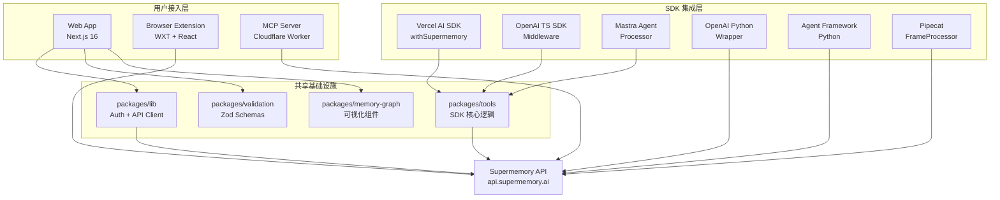
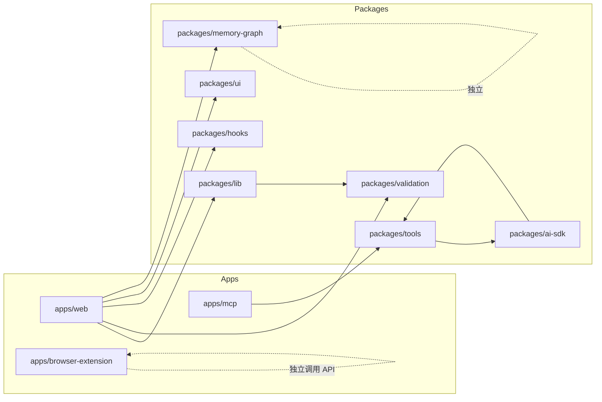
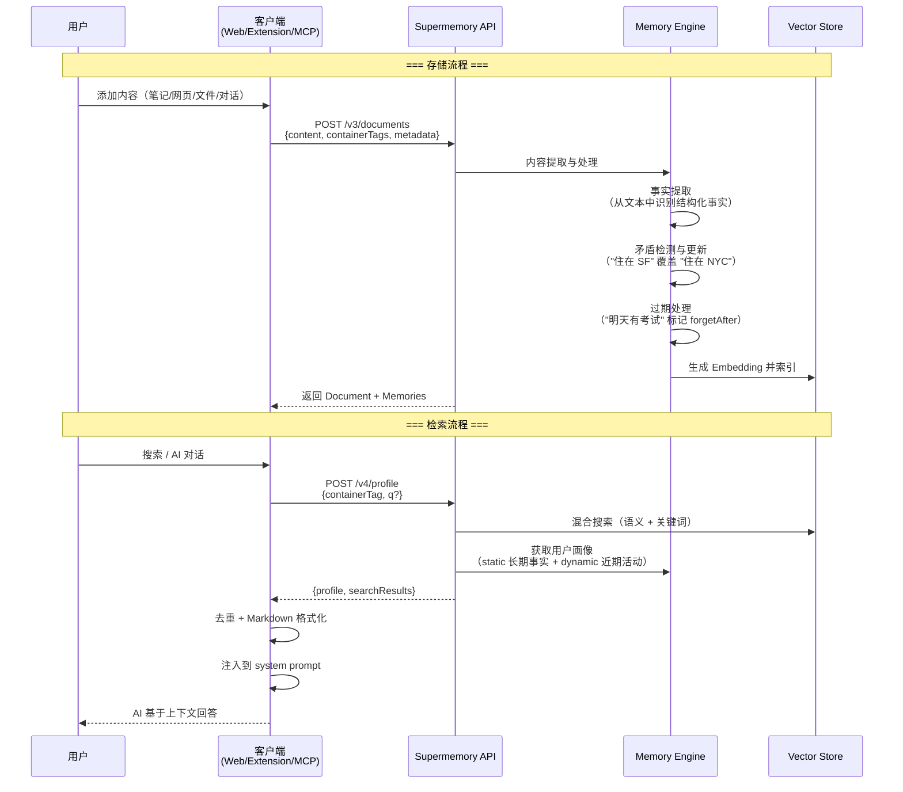
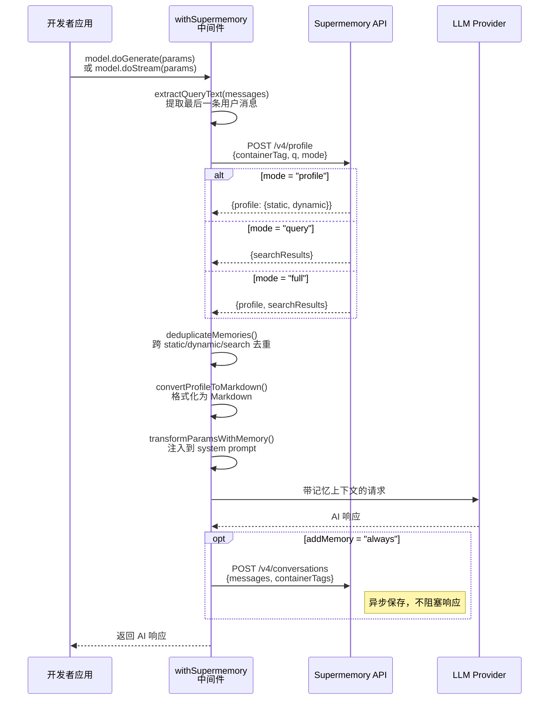

# supermemory 源码学习笔记

> 仓库地址：[supermemory](https://github.com/supermemoryai/supermemory)
> 学习日期：2026-03-29

---

> **以下为 AI 源码分析**
>
> ### 一句话概括
>
> Supermemory 是一个为 AI 应用提供记忆与上下文管理的开源平台，通过自动提取事实、构建用户画像、混合搜索等能力，让 AI 在跨会话场景下拥有持久记忆。
>
> ### 要点速览
>
> | 核心模块 | 职责 | 关键文件/目录 |
> |---------|------|-------------|
> | Web App | 消费端前端应用，提供记忆管理、AI 聊天、集成管理等功能 | `apps/web/` |
> | MCP Server | Model Context Protocol 服务器，让 AI 客户端通过标准协议访问记忆 | `apps/mcp/` |
> | Browser Extension | 浏览器插件，支持保存网页、导入 Twitter 书签、ChatGPT/Claude 自动搜索 | `apps/browser-extension/` |
> | Tools SDK (TS) | 为 Vercel AI SDK、OpenAI、Mastra 等框架提供记忆中间件 | `packages/tools/` |
> | Python SDKs | 为 OpenAI Python、Microsoft Agent Framework、Pipecat 提供 Python 集成 | `packages/*-python/` |
> | Memory Graph | 基于 Canvas + D3 力导向图的记忆可视化组件 | `packages/memory-graph/` |
> | Shared Lib | 认证、API 客户端、类型定义、校验 schema 等共享基础设施 | `packages/lib/`, `packages/validation/` |

---

## 项目简介

Supermemory 是一个面向 AI 应用的记忆与上下文引擎。它解决的核心问题是：**AI 在不同会话之间会遗忘所有上下文**。Supermemory 通过自动从对话中提取事实、构建和维护用户画像、处理知识更新与矛盾、自动遗忘过期信息，在正确的时间提供正确的上下文。

它在三大 AI 记忆评测基准（LongMemEval、LoCoMo、ConvoMem）上均排名第一。

该项目既提供面向终端用户的消费级产品（Web App、浏览器插件、MCP Server），也提供面向开发者的 API 和 SDK，让开发者能一行代码为自己的 AI 应用添加记忆能力。核心价值在于将 Memory + RAG + 用户画像 + 连接器 + 文件处理统一为一个系统。

## 技术栈

| 类别 | 技术 |
|------|------|
| 语言 | TypeScript, Python |
| 框架 | Next.js 16 (Web), Hono (API), WXT (浏览器插件), MCP SDK (MCP Server) |
| 构建工具 | Turborepo, Vite, tsdown, OpenNextJS (Cloudflare 适配) |
| 依赖管理 | Bun (workspaces monorepo), uv/pip (Python) |
| 测试框架 | Vitest (TS), pytest (Python) |
| 运行时/部署 | Cloudflare Workers + Durable Objects + R2 |
| 数据库 | PostgreSQL (Drizzle ORM) |
| 认证 | better-auth (Magic Link, OAuth, API Key, 组织管理) |
| 状态管理 | Zustand + IndexedDB (客户端), TanStack React Query (服务端状态) |
| UI | React 19, Radix UI, Tailwind CSS 4, TipTap (富文本), Motion (动画) |
| 可视化 | D3 Force (力导向图), Canvas 2D 渲染 |
| 监控 | Sentry (错误追踪), PostHog (产品分析) |

## 目录结构

```
supermemory/
├── apps/                              # 应用层
│   ├── web/                           # Next.js 消费端前端
│   │   ├── app/                       #   App Router 路由
│   │   │   ├── (app)/                 #     受保护的应用路由（主页、设置、onboarding）
│   │   │   ├── (auth)/                #     认证路由（登录页）
│   │   │   └── api/                   #     Server API 路由
│   │   ├── components/                #   React 组件（chat、document-modal、settings 等）
│   │   ├── stores/                    #   Zustand 状态存储（chat、highlights、project）
│   │   ├── hooks/                     #   自定义 React Hooks
│   │   ├── lib/                       #   工具函数（API client、auth、search-params）
│   │   └── middleware.ts              #   Next.js 中间件（session 验证）
│   ├── mcp/                           # MCP Server（Cloudflare Worker + Durable Object）
│   │   └── src/                       #   server.ts(SupermemoryMCP 类)、client.ts、auth.ts
│   ├── browser-extension/             # 浏览器扩展（WXT + React）
│   │   ├── entrypoints/               #   background、popup、content scripts
│   │   └── utils/                     #   API 封装、存储、UI 组件
│   ├── docs/                          # 文档站
│   ├── memory-graph-playground/       # Memory Graph 可视化 playground
│   └── raycast-extension/             # Raycast 扩展
├── packages/                          # 共享包
│   ├── tools/                         # TS SDK 集成（AI SDK, OpenAI, Mastra, Claude Memory）
│   │   └── src/
│   │       ├── vercel/                #   Vercel AI SDK middleware (withSupermemory)
│   │       ├── openai/                #   OpenAI SDK middleware
│   │       ├── mastra/                #   Mastra Agent wrapper
│   │       ├── shared/                #   共享基础设施（缓存、上下文、去重、prompt 构建）
│   │       └── claude-memory.ts       #   Claude Memory Tool 适配
│   ├── ai-sdk/                        # 独立 AI SDK 包（简化版 tools）
│   ├── memory-graph/                  # Memory Graph 可视化 React 组件
│   │   └── src/
│   │       ├── canvas/                #   Canvas 渲染、D3 力模拟、视口管理、命中检测
│   │       └── hooks/                 #   数据获取、主题管理
│   ├── lib/                           # 共享库（auth、API client、types、utils）
│   ├── validation/                    # Zod schema（API 请求/响应、数据模型、连接器）
│   ├── hooks/                         # 共享 React Hooks
│   ├── ui/                            # 共享 UI 组件
│   ├── agent-framework-python/        # Microsoft Agent Framework Python SDK
│   ├── openai-sdk-python/             # OpenAI Python SDK 集成
│   └── pipecat-sdk-python/            # Pipecat 实时语音 SDK 集成
└── turbo.json                         # Turborepo 配置
```

## 架构设计

### 整体架构

Supermemory 采用 **Monorepo + 前后端分离** 架构。前端（Web App、浏览器插件、MCP Server）均作为客户端与后端 API（`api.supermemory.ai`，非开源部分）通信。开源仓库聚焦于客户端生态和 SDK 集成层。

核心架构思路是：**一个统一的记忆 API，多个接入渠道**。无论用户通过 Web App 手动添加、浏览器插件自动捕获、MCP Server 让 AI 调用，还是开发者通过 SDK 集成，最终都汇聚到同一套记忆引擎。



### 核心模块

#### 1. Web App（`apps/web/`）

**职责**：消费端前端应用，提供记忆浏览、AI 对话、文档管理、第三方集成等功能。

**核心文件**：
- `app/(app)/page.tsx` — 主页面，包含记忆网格、聊天侧边栏、搜索面板
- `app/(auth)/login/new/page.tsx` — 登录页，支持 Magic Link、Google/GitHub OAuth
- `app/(app)/settings/page.tsx` — 设置页，含账户、集成、连接、支持四个 Tab
- `middleware.ts` — Session 校验中间件，保护所有 `(app)` 路由
- `stores/chat.ts` — 基于 IndexedDB 的持久化聊天历史
- `stores/index.ts` — Project/Space 选择状态（通过 `nuqs` 同步到 URL）

**关键设计**：
- **URL-Driven State**：使用 `nuqs` 库将 Modal 状态（doc、search、add、chat 等）全部同步到 URL query string，支持深链接和浏览器前进/后退
- **乐观更新**：所有文档 CRUD 操作先立即更新 UI，失败时从快照回滚
- **部署到 Cloudflare Workers**：通过 OpenNextJS 适配器将 Next.js 编译为 Cloudflare Worker，使用 R2 做增量静态缓存

#### 2. MCP Server（`apps/mcp/`）

**职责**：实现 Model Context Protocol，让 Claude、Cursor、Windsurf 等 AI 客户端通过标准化协议读写记忆。

**核心文件**：
- `src/server.ts` — `SupermemoryMCP` 类（继承 `McpAgent`），注册 5 个工具 + 1 个应用工具
- `src/client.ts` — `SupermemoryClient` 类，封装 Supermemory SDK 调用
- `src/auth.ts` — 认证模块，支持 API Key（`sm_` 前缀）和 OAuth Token 两种方式
- `src/posthog.ts` — PostHog 事件追踪

**注册的 MCP Tools**：

| Tool | 功能 |
|------|------|
| `memory` | 保存或遗忘记忆（save/forget），支持 containerTag 作用域 |
| `recall` | 搜索记忆 + 可选注入用户画像（static + dynamic） |
| `listProjects` | 列出所有项目名称，带缓存 |
| `whoAmI` | 返回认证用户信息 |
| `memory-graph` | 可视化记忆关系图（App Tool，内嵌 HTML UI） |

**关键设计**：
- 使用 **Cloudflare Durable Objects** 持久化客户端信息和会话
- `forgetMemory` 支持模糊匹配——先尝试精确 ID，失败则用语义搜索（similarity > 0.85）找到最相似记忆再删除
- OAuth 流程：客户端 Bearer Token → `isApiKey()` 判断 → API Key 直接验证 / OAuth Token 换取 API Key

#### 3. Browser Extension（`apps/browser-extension/`）

**职责**：浏览器插件，桥接用户日常浏览与 Supermemory，支持保存网页、导入 Twitter 书签、在 ChatGPT/Claude 中自动搜索记忆。

**核心文件**：
- `entrypoints/background.ts` — Service Worker，处理消息路由、Twitter 导入、记忆保存
- `entrypoints/popup/App.tsx` — Popup UI（保存、导入、设置三个 Tab）
- `entrypoints/content/chatgpt.ts` — ChatGPT 内容脚本（注入搜索图标、自动搜索、捕获 prompt）
- `entrypoints/content/claude.ts` — Claude.ai 内容脚本（同上）
- `entrypoints/content/twitter.ts` — Twitter 内容脚本（书签导入 UI）

**支持的平台**：Twitter/X、ChatGPT、Claude.ai、T3.chat

**关键设计**：
- **Auto-Search**：用户在 ChatGPT/Claude 输入时，debounce 1500ms 后自动搜索相关记忆并注入
- **Twitter 导入**：`TwitterImporter` 类支持分页抓取、指数退避限速、批量上传
- 全局快捷键 `Ctrl/Cmd+Shift+M` 保存当前页面

#### 4. Tools SDK（`packages/tools/`）

**职责**：为主流 AI 框架提供即插即用的记忆中间件，是 SDK 集成的核心。

**核心文件**：
- `src/vercel/index.ts` — `withSupermemory(model, containerTag, options)` 包装 LanguageModel，拦截 `doGenerate`/`doStream`
- `src/openai/middleware.ts` — `createOpenAIMiddleware()` 包装 OpenAI 客户端的 `chat.completions.create`
- `src/mastra/wrapper.ts` — `withSupermemory(config, containerTag)` 注入 Input/Output Processor
- `src/claude-memory.ts` — `ClaudeMemoryTool` 类，将 Claude 的 memory tool 命令映射到 Supermemory
- `src/shared/memory-client.ts` — `buildMemoriesText()` 核心函数，获取画像 + 搜索结果 + 去重 + 格式化

**记忆注入模式**（`MemoryMode`）：
- `profile`：注入完整用户画像（静态事实 + 动态上下文）
- `query`：基于最后一条用户消息搜索相关记忆
- `full`：两者兼有

#### 5. Python SDKs

三个 Python 包遵循一致的架构模式：

| 包 | 目标框架 | 核心类 |
|---|---------|-------|
| `agent-framework-python` | Microsoft Agent Framework | `SupermemoryContextProvider`, `SupermemoryChatMiddleware` |
| `openai-sdk-python` | OpenAI Python SDK | `SupermemoryOpenAIWrapper`, `with_supermemory()` |
| `pipecat-sdk-python` | Pipecat (实时语音) | `SupermemoryPipecatService` (FrameProcessor) |

共同特征：
- 后台异步保存对话（不阻塞主请求）
- XML 标签包裹注入内容（`<supermemory>...</supermemory>`），防止 prompt injection
- 跨 static/dynamic/searchResults 去重

#### 6. Memory Graph（`packages/memory-graph/`）

**职责**：将记忆关系网络可视化为力导向图。

**核心文件**：
- `src/memory-graph.tsx` — React 组件入口（支持 slideshow、legend、loading）
- `src/canvas/renderer.ts` — Canvas 2D 渲染管线（文档节点=圆角矩形，记忆节点=六边形）
- `src/canvas/simulation.ts` — D3 Force 力模拟（chargeStrength: -2000, linkDistance: 300）
- `src/types.ts` — `GraphNode`（document/memory）、`GraphEdge`（updates/extends/derives）

**记忆状态用颜色编码**：红色=已遗忘，橙色=即将过期（<7天），绿色=近期（<1天），蓝色=正常

### 模块依赖关系



## 核心流程

### 流程一：记忆存储与检索

这是 Supermemory 最核心的业务流程——从多个渠道收集内容，存储为结构化记忆，并在需要时高效检索。



**关键逻辑说明**：
1. **内容进入**：通过 `client.add()` 统一接口，支持纯文本、URL、HTML、文件等多种格式
2. **记忆提取**：Memory Engine 从内容中提取独立事实，每条记忆有版本链（`parentMemoryId` → `rootMemoryId`），通过 `memoryRelations`（updates/extends/derives）追踪演变
3. **用户画像**：自动维护两层画像——`static`（长期稳定事实如 "资深工程师"）和 `dynamic`（近期活动如 "正在做 auth 迁移"），单次调用约 50ms
4. **混合搜索**：`searchMode: "hybrid"` 同时返回文档检索结果（RAG）和个性化记忆，在 `packages/tools/src/shared/memory-client.ts` 中通过 `buildMemoriesText()` 合并去重

### 流程二：AI SDK 记忆中间件注入

这是开发者使用 Supermemory 最常见的方式——在 AI 调用前自动注入用户记忆上下文。



**关键逻辑说明**：
1. **中间件拦截**：`withSupermemory()` 在 `packages/tools/src/vercel/index.ts` 中包装 `LanguageModel`，拦截 `doGenerate` 和 `doStream` 方法
2. **记忆获取与去重**：`buildMemoriesText()` 调用 `/v4/profile` 端点，然后通过 `deduplicateMemories()` 按优先级（Static > Dynamic > SearchResults）去除重复
3. **Prompt 注入**：使用 `defaultPromptTemplate` 格式化后追加到 system message，支持自定义 `promptTemplate`
4. **对话保存**：如果配置 `addMemory: "always"`，响应完成后异步调用 `/v4/conversations` 保存对话到记忆库
5. **LRU 缓存**：`packages/tools/src/shared/cache.ts` 中的 `MemoryCache` 对相同 containerTag + threadId + mode + message 的请求进行缓存（最多 100 条），避免重复查询

## 关键设计亮点

### 1. 统一记忆本体：Memory vs RAG 的融合

**解决的问题**：传统 RAG 是无状态的文档检索，对所有用户返回相同结果；而 Memory 需要追踪用户特定的事实变化。两者通常由不同系统处理。

**实现方式**：Supermemory 在 `packages/validation/schemas.ts` 中定义了统一的数据模型——`Document` 是原始内容容器，`MemoryEntry` 是从文档中提取的结构化事实。搜索时通过 `searchMode: "hybrid"` 同时查询两者，`packages/tools/src/shared/tools-shared.ts` 中的 `deduplicateMemories()` 确保结果不重复。

**为什么这样设计**：开发者只需一次 API 调用即可获得知识库检索 + 个性化记忆上下文，避免了维护两套系统的复杂性。

### 2. 记忆版本链与自动遗忘

**解决的问题**：用户的事实会随时间变化（"我住在纽约" → "我刚搬到旧金山"），临时信息会过期（"明天有考试"）。

**实现方式**：每条 `MemoryEntry` 都有 `version`、`parentMemoryId`、`rootMemoryId` 字段构成版本链，通过 `memoryRelations`（类型为 `updates`/`extends`/`derives`）记录记忆间的演变关系。`isForgotten` 和 `forgetAfter` 字段支持软删除和定时遗忘。在 `apps/mcp/src/client.ts` 的 `forgetMemory()` 中，如果精确匹配失败，会用语义搜索（threshold > 0.85）找到最相似的记忆进行模糊遗忘。

**为什么这样设计**：真实世界的记忆不是只增不减的日志，而是需要更新和遗忘的。版本链保留了变化历史，自动遗忘防止噪声堆积。

### 3. 多框架 SDK 的统一抽象层

**解决的问题**：AI 框架生态碎片化严重——Vercel AI SDK、OpenAI SDK、Mastra、LangChain 等各有不同的中间件/插件机制。

**实现方式**：`packages/tools/src/shared/` 目录提供了框架无关的核心逻辑：
- `memory-client.ts` — 统一的记忆获取与格式化
- `prompt-builder.ts` — 统一的 Prompt 模板
- `cache.ts` — 统一的 LRU 缓存
- `tools-shared.ts` — 统一的去重与工具定义

每个框架适配器（`vercel/`、`openai/`、`mastra/`）只需实现特定框架的"胶水代码"：如何拦截请求、如何注入到 prompt、如何保存响应。Python SDK 也复制了相同的三层架构（Connection → Tools → Middleware）。

**为什么这样设计**：共享核心逻辑确保所有集成行为一致（同样的去重策略、缓存策略、Prompt 格式），同时降低维护成本——修复核心 bug 只需改一处。

### 4. URL-Driven State 与乐观更新的前端架构

**解决的问题**：Web App 有大量 Modal 状态（文档详情、搜索、添加、聊天），需要支持深链接、浏览器前进/后退，同时保证操作的即时反馈。

**实现方式**：`apps/web/lib/search-params.ts` 通过 `nuqs` 库将所有 Modal 状态声明为 URL search params（`doc`、`search`、`q`、`chat`、`view`、`add` 等）。`apps/web/hooks/use-document-mutations.ts` 中的所有 Mutation 都采用乐观更新模式——`onMutate` 时快照缓存并立即应用变更，`onError` 时从快照回滚，`onSuccess` 时 invalidate 缓存重新获取。

**为什么这样设计**：URL-Driven State 让每个页面状态都可分享、可书签、可前进后退。乐观更新在网络延迟时仍能提供即时 UI 反馈，失败时能可靠回滚——这对记忆管理这种高频操作场景尤为重要。

### 5. MCP + OAuth 的标准化 AI 接入

**解决的问题**：让记忆能力以标准协议暴露给所有兼容的 AI 客户端（Claude Desktop、Cursor、VS Code 等），而不需要每个客户端写专门的集成。

**实现方式**：`apps/mcp/src/server.ts` 中的 `SupermemoryMCP` 继承 `McpAgent`，通过 `server.registerTool()` 注册标准 MCP 工具。认证层（`src/auth.ts`）同时支持 API Key（`sm_` 前缀直接验证）和 OAuth（通过 `/.well-known/oauth-authorization-server` 发现端点）。使用 Cloudflare Durable Objects 持久化客户端信息和会话状态，确保跨请求的状态一致性。

**为什么这样设计**：MCP 是新兴的 AI 工具标准协议，一次实现即可接入所有兼容客户端。Durable Objects 提供了 Worker 无状态模型中缺失的持久化能力，适合需要记住客户端上下文的 MCP 场景。
