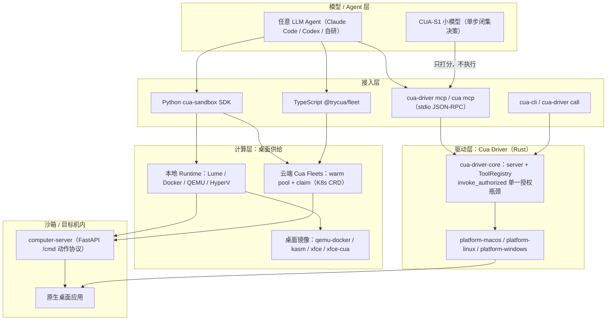
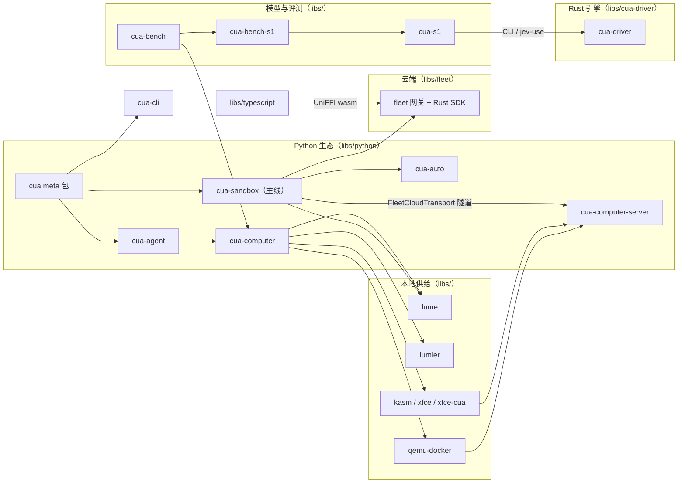
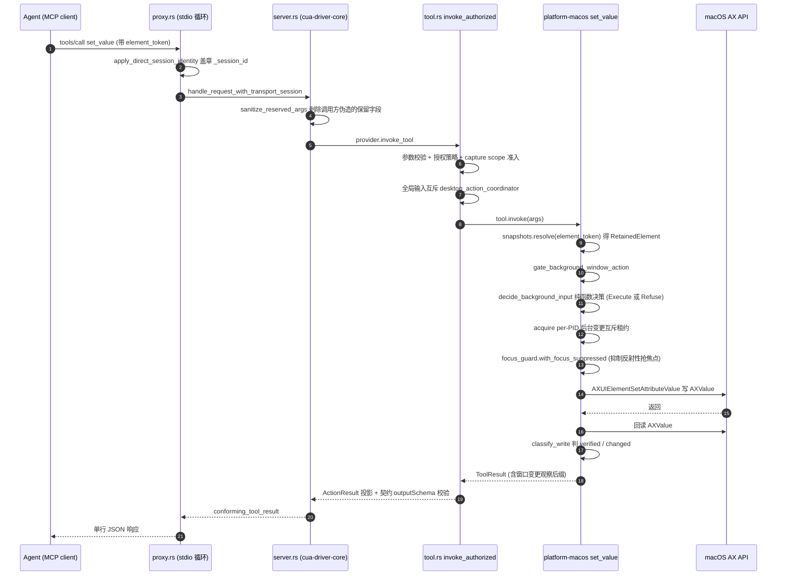
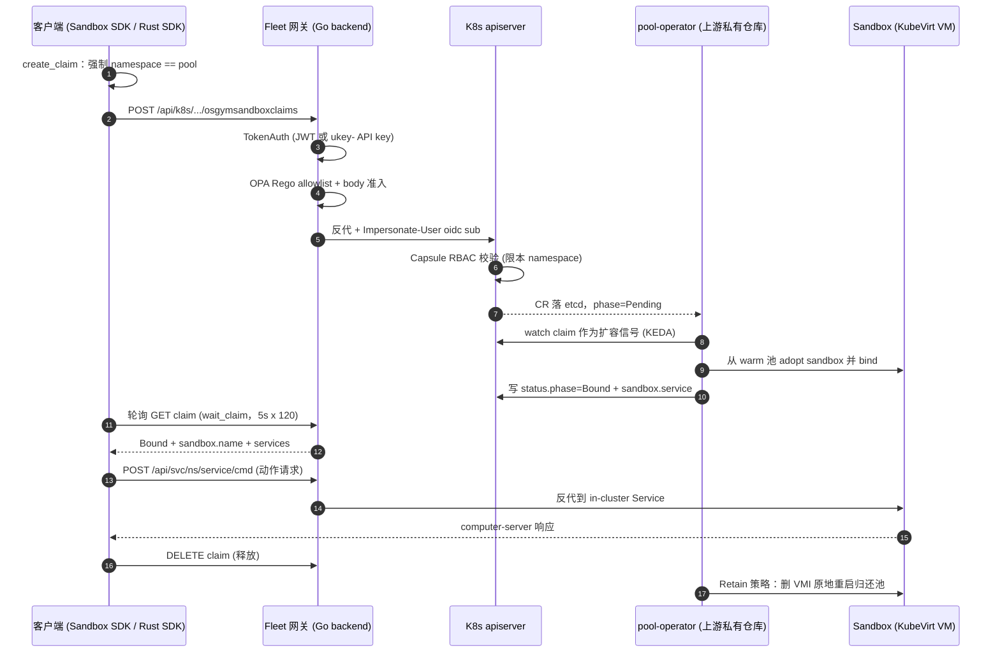
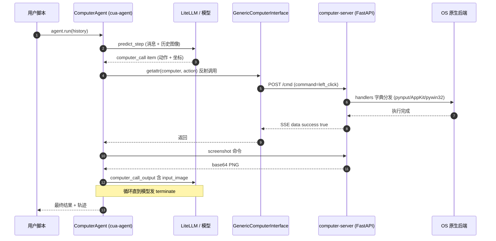

# trycua/cua 源码学习笔记

> 仓库地址：[trycua/cua](https://github.com/trycua/cua)
> 学习日期：2026-09-30

---

> **以下为 AI 源码分析**
>
> ### 一句话概括
>
> Cua 是一个"给 AI agent 用的计算机基础设施"多语言 monorepo：**Cua Driver**（Rust）在 macOS/Windows/Linux 真实桌面上"后台不抢焦点"地驱动原生应用，**Lume / 容器镜像 / Cua Fleets** 分别提供本地与云端隔离桌面并通过 **Sandbox SDK** 统一抽象，**CUA-S1** 提供小而专的 computer-use 决策模型，**Cua Bench** 负责评测与训练数据生产——四件套合起来支撑 "Computer-Use 2.0"（agent 在同一任务中游走于代码、API 与图形界面）。
>
> ### 要点速览
>
> | 模块 | 语言 | 职责 | 关键文件 |
> |------|------|------|----------|
> | `libs/cua-driver` | Rust（15 个 crate） | 跨平台桌面自动化引擎：MCP/CLI/SDK 三种接入，background delivery 不抢焦点 | `rust/crates/cua-driver-core/src/tool.rs`（dispatch 单一瓶颈）、`background_input.rs`（纯函数决策矩阵） |
> | `libs/fleet` | Go + Rust + React | 云端 Fleet：warm pool + claim 的 K8s CRD 供给，网关做受控 K8s API 透传 | `sdk-schema/src/{warmpool,claim,sandbox}.rs`、`backend/main.go:133 setupRouter` |
> | `libs/lume` | Swift 6 | Apple Silicon 上基于 Virtualization.Framework 的 macOS/Linux VM 管理（CLI + HTTP/MCP server） | `src/LumeController.swift`、`src/Virtualization/VMVirtualizationService.swift` |
> | `libs/cua-s1` | Python | "System 1" 小模型家族（706K~LoRA-4B），闭集打分而非 token 生成 | `python/src/cua_s1/{model,four_b,planner}.py` |
> | `libs/cua-bench`(+`-s1`) | Python | computer-use agent 评测框架与轨迹导出；S1 单步闭集决策基准 | `cua_bench/{environment,runners}.py`、`cua_bench_s1/task.py` |
> | `libs/python` | Python (uv workspace) | SDK 生态：`cua-sandbox`（新主线，本地/云统一）+ `cua-agent`/`cua-computer`（维护中） | `cua-sandbox/cua_sandbox/sandbox.py:324`、`agent/cua_agent/agent.py:902` |
> | `libs/typescript` | TypeScript (pnpm) | 云时代精简 client：`@trycua/fleet`（UniFFI/wasm 绑定）、legacy computer SDK | `fleet/scripts/build.mjs`、`computer/interface/base.ts` |
> | `libs/qemu-docker` 等 | Docker | QEMU 容器化桌面镜像（Linux/Windows/Android）+ kasm/xfce/lumier 桌面容器 | `qemu-docker/linux/src/entry.sh`、`kasm/Dockerfile` |

---

## 项目简介

Cua（Computer Use Agents）解决的问题是：**让 AI agent 拥有一台"它自己的计算机"，并且能像人一样操作真实桌面应用**。它不是一个单一应用，而是一整条基础设施栈：

- **驱动**：agent 通过 MCP、CLI 或 typed SDK 调用 Cua Driver，读取 accessibility 树与截图，对原生应用执行 click/type/set_value 等动作——且默认在**后台执行**，不移动用户指针、不抢占焦点（这是与 pyautogui 类工具的本质区别）。
- **计算机供给**：本地用 Lume（Apple Silicon macOS/Linux VM）、Docker/QEMU 容器；云端用 Cua Fleets（warm pool 预热 + claim 认领）。两侧统一收敛到同一个 `Sandbox` 抽象，命令协议同构（都打到沙箱内的 computer-server `/cmd` 端点）。
- **模型**：通用 LLM 做规划，CUA-S1 系列小模型做"快而有界"的单步决策（如该把哪个文档值填进哪个表单字段）。
- **评测**：Cua Bench 提供可验证的跨平台任务环境与轨迹导出，闭环反哺训练。

产品形态上，`run.cua.ai` 是其云服务入口；本仓库为 MIT 开源（perception 扩展等个别组件 AGPL，`LICENSING.md` 有清单）。

## 技术栈

| 类别 | 技术 |
|------|------|
| 语言 | Rust（cua-driver、fleet SDK、state-projector）、Swift（lume）、Go 1.24（fleet backend）、Python 3.12+（cua-s1、cua-bench、SDK）、TypeScript（fleet SPA/SDK）、C++（Hyprland/KWin 插件）、bash/Dockerfile（镜像层） |
| 核心框架 | tokio + uniffi 0.31 + serde（Rust）；Apple Virtualization.Framework / SwiftNIO / swift-argument-parser（Swift）；net/http + OPA Rego + pgx（Go）；FastAPI / FastMCP / LiteLLM / PyTorch（Python）；React 18 + Vite + Cloudscape + noVNC（前端）；Playwright（bench 模拟环境） |
| 构建/基础设施 | Cargo workspace、Swift Package、Docker + QEMU/KVM + KubeVirt + KEDA + Capsule（K8s）、Terraform、Nix flake |
| 依赖管理 | uv workspace（Python，根 `pyproject.toml`）、pnpm workspace（TS）、Cargo/Go modules |
| 测试 | swift-testing、cargo test + 自研 testkit/e2e 分层、pytest + envtest（RBAC）、Playwright（e2e）、CI 权重 lock 校验 |
| 版本发布 | bump2version + GitHub Actions、release-please、HuggingFace 权重 pin（`ci/weights.lock.json`） |

## 目录结构

```text
cua/
├── libs/                       # 全部核心代码
│   ├── cua-driver/             # Rust 桌面自动化引擎（详见"核心模块"）
│   │   ├── rust/crates/        #   15 个 crate：core/sdk/contract/uia/三平台/perception...
│   │   ├── python/ typescript/ #   UniFFI 生成的双语言绑定
│   │   ├── hyprland-plugin/ kwin-target-helper/  # Wayland compositor 侧插件
│   │   └── contract/ compat-fixtures/ examples/ tests/
│   ├── fleet/                  # 云端 Fleet（内部名 cyclops-cs）
│   │   ├── backend/            #   Go 网关：路由/OPA 策略/计费
│   │   ├── sdk/ sdk-schema/ bindgen-cli/  # Rust SDK + CRD 真源 + 绑定生成
│   │   └── src/ terraform-provider-fleets/ # React 控制台 + TF provider
│   ├── lume/                   # Swift：Apple Silicon 本地 VM（CLI + :7777 HTTP + MCP）
│   │   └── src/                #   Commands/ VM/ Virtualization/ SSH/ VNC/ Server/ Unattended/
│   ├── cua-s1/                 # System 1 模型：python/ + training/ + evals/ + ci/
│   ├── cua-bench/              # 评测框架：cua_bench/ + datasets/ + example_tasks/
│   ├── cua-bench-s1/           # S1 单步闭集决策基准：datagen/ + eval/ + agentic/
│   ├── python/                 # Python SDK 生态（16 个包，uv workspace 7 成员 + 独立包）
│   │   ├── cua-sandbox/ cua-cli/ cua/   # 新主线：Sandbox SDK + CLI + meta 包
│   │   └── agent/ computer/ computer-server/ core/ mcp-server/ som/ bench-ui/
│   ├── typescript/             # TS SDK：fleet/ agent/ computer/ core/ playground/
│   ├── qemu-docker/            # QEMU 容器镜像：linux/ windows/ android/
│   ├── kasm/ xfce/ xfce-cua/ lumier/    # 桌面容器镜像家族
│   └── cuabot/                 # Discord bot（未深入）
├── clusters/ infra/            # K8s / Terraform 基础设施（fleets-wif-smoke 冒烟 pool）
├── docs/                       # 文档站（mkdocs-material，docs/content 为真源）
├── samples/ tests/ scripts/ skills/ rfcs/ changelog/ evidence/ blog/ nix/
├── pyproject.toml              # uv workspace 根（成员在 libs/python/*）
├── package.json  pnpm-lock.yaml  flake.nix  Makefile  release-please-config.json
```

## 架构设计

### 整体架构

整体是一个**五层纵栈 + 双通道（本地/云）**的结构。交互层收敛为三种接入（MCP stdio / CLI / typed SDK），驱动层以 `ToolRegistry::invoke_authorized` 为唯一授权瓶颈；计算层里本地与云端是平行的两条供给路径，最终都通向沙箱内的 computer-server；模型层（CUA-S1）不直接持刀，只输出打分结果交由调用方经授权通道 dispatch。



三个关键的架构裁决贯穿全栈：

1. **授权必须是单一瓶颈**（`rust/crates/cua-driver-core/src/tool.rs:1114 invoke_authorized`）：传输层可以提前拒绝（纵深防御）但必须无副作用，否则 `CuaDriver::create()` 就能绕过策略直接调平台工具。所有 `_` 前缀的保留字段（`_session_id` 等）在每个入口被 `sanitize_reserved_args` 剥除，只允许 trusted adapter 重新注入（`tool.rs:600 TrustedInvocationEvidence`）。
2. **MCP 是 agent 边界，UniFFI 是 SDK 组合件**（`libs/cua-driver/docs/why-cua-driver-uses-mcp-instead-of-uniffi.md`）：语言包里刻意不包含语言原生 MCP facade，两者不竞争。
3. **平台抽象 = "core 拥有协议与治理，平台只注册工具实现"**：不是传统统一 Platform trait，而是 `Tool` trait + `ToolProvider` trait + `SnapshotPayload` 泛型快照缓存；`cfg(target_os)` 只出现在 `cua-driver-sdk/src/runtime.rs:551 build_registry` 一处。

### 核心模块

#### 1. Cua Driver（libs/cua-driver，Rust）

**职责**：给 agent 提供检查/操作原生桌面应用与浏览器的工具集，核心卖点是 background delivery（对后台窗口执行动作不抢指针/焦点）。

**结构**：`rust/` 是 15 个 crate 的 Cargo workspace：

| crate | 职责 |
|-------|------|
| `cua-driver` | CLI/MCP/daemon 主二进制（`main.rs` 双平台分叉入口、`cli.rs` 5338 行、`serve.rs` daemon、`proxy.rs` MCP stdio、`extension_manager.rs`、`telemetry.rs`） |
| `cua-driver-core` | 平台无关核心 80+ 模块：`tool.rs`（6184 行，canonical dispatch）、`server.rs`（MCP JSON-RPC 语义层）、`mcp_wire.rs`（Modern/Legacy 双协议）、`background_input.rs`、`session*.rs`、`authorization/consent/policy.rs`、`snapshot_store.rs` + `element_token.rs`、`capture_registry.rs`、`browser/`（CDP 24 文件）、录制/剪贴板/perception client |
| `cua-driver-sdk` | typed SDK：`lib.rs:301 CuaDriver` + `DriverBackend`（Embedded/Daemon/PrivateWorker/Remote 四后端同一接口）；`runtime.rs:155 DriverRuntime`（RwLock 关停协议） |
| `cua-driver-contract` | 契约 crate（纯声明，生成 checked-in manifest） |
| `platform-macos / -linux / -windows` | 三平台后端（见下） |
| `cua-driver-uia` | Windows UIAccess 提权 worker |
| `cua-perception` / `cursor-overlay` / `pip-preview` | 视觉感知 worker / 语义光标 / 画中画 |

**平台 API 映射**（源码证实）：

- macOS：Accessibility (AX) API——`platform-macos/src/ax/bindings.rs:51-96` 直接 `extern "C"` 声明 `AXUIElementCreateApplication/PerformAction/SetAttributeValue` 等；截图走 ScreenCaptureKit；指针路由用 Skylight 私有 SPI（`input/skylight.rs` dlsym `PostToPid`）。
- Linux：AT-SPI2 over D-Bus（`platform-linux/src/atspi/native.rs`，zbus 原生实现）+ X11 `XSendEvent` + MPX/XI2 虚拟主指针 + evdev uinput；Wayland 下 libei/xdg-portal、wlr 协议族、GNOME Shell 扩展（WinRects D-Bus）、Hyprland C++ 插件（独立 seat 后台输入）。
- Windows：UI Automation COM（`platform-windows/src/uia/mod.rs`，`IUIAutomationCacheRequest` 批量取属性）+ MSAA 回退 + `InjectSyntheticPointerInput` 合成指针（`input/inject.rs`）+ WGC 截图。

**关键机制**：

- **快照/token 闭环**：`get_window_state` 采集 AX 树后发布快照（`ax/snapshot.rs:73 Snapshots`，每 pid LRU 上限 8），actionable 元素获得 `element_token`（`element_token.rs:18`，格式 `s%08x:%index`）；快照被新发布覆盖后旧 token 返回 `STALE_TOKEN_ERROR`。截图像素动作则要求一次性 `capture_id`（`capture_registry.rs:881 consume_for_action`，消费即失效）。
- **三种运行时归属**：`main.rs:395 mcp_uses_direct_runtime` 决定 `cua-driver mcp` 自己持有 runtime 还是代理到 daemon；macOS 默认 daemon proxy（保持 TCC 归属链，`open -n -g -a CuaDriver --args serve` 拉起）。
- **权限模型**：`standard` / `bounded`（manifest 白名单）/ `unrestricted`（需显式 `--dangerously-bypass-approvals`）。

**与其他模块关系**：Python/TS SDK 通过 UniFFI 同进程加载；agent 通过 MCP stdio；`cua-s1` 通过 CLI（`cua-s1/driver.py`）或 jev-use chooser 集成——模型只打分，经调用方授权后 dispatch。

#### 2. Lume 与虚拟化/镜像家族（libs/lume、qemu-docker、kasm、xfce、xfce-cua、lumier）

**职责**：本地与容器两条桌面供给路径。

- **lume**（Swift 6，v0.5.3）：`Package.swift` 单 executable target，目录即逻辑分层：`Commands/`（28 个子命令）→ `LumeController.swift`（1837 行门面）→ `VM/`（`@MainActor` 基类 + DarwinVM/LinuxVM）→ `Virtualization/VMVirtualizationService.swift`（VZ 封装核心：`VirtualMachineHandle` 把 `VZVirtualMachine` + 专属 `DispatchQueue` 组合，continuation 桥接 VZ completion callback 为 async/await）→ `DiskResize/`（GPT 解析 + APFS 容器离线扩容事务）→ `ContainerRegistry/`（6000 行，纯 Foundation 手写 OCI registry push/pull，分块上传 + 下载时跳零块写稀疏文件）→ `SSH/`（SwiftNIO-SSH actor 客户端）→ `VNC/`（用 `Dynamic` 动态调私有 `_VZVNCServer`）→ `Unattended/`（macOS 无人值守安装）→ `Server/`（SwiftNIO 手写 HTTP 路由，:7777 + MCP）。
- **qemu-docker**："容器里跑完整 VM"。基础镜像（`trycua/qemu-local` 等，预构建外部依赖）负责 QEMU + dnsmasq 分 IP + noVNC(8006)；`linux/src/entry.sh` 从 dnsmasq 进程参数抓 VM IP，轮询 guest 内 `:5000/status` 直到就绪；**golden image 机制**——挂 setup ISO 的"制备运行"装完系统自动关机退出，之后 `docker run -v golden:/storage` 秒起。guest 内 `/oem/setup-cua-server.sh` 用 uv 装 computer-server 并注册 systemd（while-true 自愈重启 + 每次 `uv add` 自升级）。
- **kasm / xfce / xfce-cua**：进程级桌面容器（非 VM）。kasm 基于 `kasmweb/core-ubuntu-jammy`（kasmvnc Web VNC）；xfce 基于 `kicad/kicad:9.0`（EDA 沙箱，TigerVNC + supervisor 四进程编排：dhclient→vnc→novnc→computer-server）；xfce-cua 是 `python:3.13-slim` 的多架构中立底座，**构建期 assert cua-driver 二进制存在**（`Dockerfile` 内 `get_binary_path().is_file()`）。
- **lumier**：把宿主上的 lume VM 包装成容器——bash 层用 curl 打宿主 lume API（`host.docker.internal:7777`），对内代理 noVNC；生命周期钩子经 SSH 注入 guest。

**与其他模块关系**：`libs/python/cua-sandbox` 的 `LumeRuntime`（REST 调 `/lume/vms`）与 `cua-computer` 的 LumeProvider 直接消费；Docker 镜像被 `DockerRuntime`/`DockerProvider` 按镜像名后缀嗅探消费（`providers/docker/provider.py:94-120`）。

#### 3. Cua Fleets（libs/fleet，内部名 cyclops-cs）

**职责**：云端隔离桌面供给。**平台模型：没有服务端 "Fleet" 对象——每个 namespace 恰好一个 warm pool 且 namespace == pool 名；"Fleet" 只是客户端用 label `cua.ai/fleet=<id>` 打标的分组概念**（`sdk/src/fleets.rs:1-8` 原文注释）。

**四个 K8s CRD**（API group `osgym.cua.ai/v1alpha1`，由 `sdk-schema` Rust 单一定义并生成 CRD bundle）：

- `OSGymSandboxWarmPool`（`warmpool.rs:84`）：`replicas` 预热数、`autoscaling`（KEDA 以 **claim demand**（Pending+Bound 计数，metric `osgym_pool_claim_demand`）驱动 `/scale`，min=0 支持缩到零）、`ttl_policy`（Retain/Cascade）。
- `OSGymSandboxTemplate`（`sandbox.rs:83`）：包 `VmTemplate`——镜像、`runtime`（**Kubevirt（默认）| Macos | Gvisor**）、cpu/memory、`services`（每 sandbox 额外 K8s Service）、`claim_secrets`（bind 时把 claimant 密钥投进 `/run/cua`，warm sandbox 无需重启即可收到）。
- `OSGymSandbox`（`sandbox.rs:9`）：状态含 `phase`/`vm_name`/`service` + `reset_issued_at`/`reset_vmi_uid`（return-to-pool 原位重启的守门字段）。
- `OSGymSandboxClaim`（`claim.rs`）：`phase`（Pending→Bound/Failed）、`lifecycle.shutdown_time`（**claim reaper 唯一采信的存活信号，绝对 UTC 到期**）、`shutdown_policy`（Retain=归还池并原地重启；Delete=销毁）、`bind_deadline`（默认 900s；Pending claim 即扩容信号，宁等不 fail-fast）。

**组成**：`backend/`（Go 1.24 标准库 `http.ServeMux` Go 1.22 模式路由 + OPA Rego ~40 个策略文件 + Keycloak JWT + pgx Postgres + Stripe 计费 + Prometheus 计量）；`sdk/`（Rust `cyclops-sdk`，UniFFI 导出 7 语言绑定 + wasm 浏览器版）；`src/`（React SPA 控制台，内嵌 just-bash 浏览器 agent + noVNC 桌面流）；`terraform-provider-fleets/`；`bindgen-cli/`（UniFFI 绑定生成 CLI，`resolve-cdylib` 确定性定位宿主库）。

**重要边界**：真正执行 reconcile 的 **pool-operator 不在本仓库**（上游私有 trycua/cloud）；本仓库定义全部契约并实现网关。多租户靠 K3s + Capsule（namespace 归属）+ 网关 impersonation（`handlers/k8s.go:79-83` 注入 `Impersonate-User: oidc:<sub>`）。

#### 4. CUA-S1（libs/cua-s1，Python）

**职责**：小而专的 "System 1" computer-use 决策模型——快、有界的决策（选哪个值填哪个字段），不替代通用 agent 的规划。**核心设计：输入是结构化 UI 元素 + 文档实体，输出是候选 (element, action) 选项上的打分/softmax 选择，一次 forward 完成，无自回归生成**。

四个 checkpoint：`cua-s1-form-v0`（tinyx 字节级 transformer + option-attention，约 706K 参数）、`cua-s1-nano-0.1`（855K，双模态文本/视觉）、`cua-s1-4b-0.1/0.2`（frozen Qwen3.5-4B + LoRA，权重在 HuggingFace 且 CI 按 `ci/weights.lock.json` 逐文件 sha256 pin）。

关键文件：

- `python/src/cua_s1/schema.py`：`Action = Literal["fill","check","click","skip"]`、`Element`（`element_token` 是稳定动作目标）、`render_context()/render_options()`——闭集分类标签空间。
- `model.py:102-136 AttentionHead`：option-attention 核心模块（query=选项、key/value=上下文，einsum 打分）；`model.py:166 TinyTransformerScorer`（form-v0 配置）。
- `four_b.py`：**单字母 readout 契约**——选项按序分配 A-Z（`assign_letters`），硬校验每个字母恰好是 tokenizer 单 token（`_letter_token_ids:358`），单次 forward 后**只在选项字母 token 位置切片 logits 再 softmax**（`forward:374-451`）。闭集选择而非开放生成。
- `planner.py:210 run_form`：模型无关执行层——默认 dry-run，`execute` 与 `submit` 双 opt-in；每次动作从最新快照取 token；每个 mutation 后重观测窗口；checkbox 三重防线 + postcondition 验证。
- `synth.py`：合成表单 episode 生成器——55 概念词表（`concepts.py`）、刻意共置易混概念对（hard negatives）、`form_signature()` 切分防泄漏（同一字段集不可能跨切分）、值全部合成安全值（`.invalid` 域名、`TEST-` 前缀）。
- `training/train_4b_rl.py`（945 行）：outcome-reward RL——RLOO 估计器 + Brier 校准项 + 对第二冻结 adapter 的 KL 锚；live step → 有界决策的桥（`live_values` 用环境 `execute_javascript` 读控件现值，"已持有目标值的 fill 选项不再提供"）；**永远保留一个 `done` 终止选项**（RL 解决"何时停"）。

#### 5. Cua Bench（libs/cua-bench + cua-bench-s1，Python）

**职责**：可验证的 computer-use agent 评测与轨迹导出。CLI `cb`。

- **任务模型极简**：一个任务 = 一个目录 + `main.py` + 4 个装饰器（`decorators.py`）：`@cb.tasks_config`（返回 Task 列表）、`@cb.setup_task`（布置环境）、`@cb.solve_task`（**参考解 oracle**，脚本化走完任务）、`@cb.evaluate_task`（判分）。`Environment.make_from_module`（`environment.py:98`）扫属性装配。
- **gym 风格**：`reset/step/evaluate`；**reward 判定来自环境自身状态读取**（如 `execute_javascript(pid, "window.__submitted")`），不依赖 agent 自述；成功阈值 `reward >= 0.5`。
- **无 VM 模拟模式**：`simulated` provider = Playwright 无头 Chromium 渲染 HTML/CSS 假桌面（`computers/webtop.py:19 WebDesktopSession`），12 种 Action dataclass 映射到 Playwright 原语；`native` provider 则经 cua-computer 连真实 Docker/QEMU 桌面。
- **轨迹导出**：`tracing.py` 自动记录 `reset/step:before/step:after/evaluate` 事件 + before/after 截图对，惰性构建 HuggingFace Dataset 并 `push_to_hub`——训练数据转换（aguvis/gui_r1 processors）的原料。
- **cua-bench-s1**：寄生其上的"单步闭集决策"基准。`task.py` 的 `dataset_hash()` 预注册机制 + `ContentDeduper`（实测去重前 test split 有 8.1% 任务同时出现在 train split）+ 禁用 PYTHONHASHSEED 敏感的内建 `hash()`；`eval/scoring.py` fail-closed 分布校验（键集必须精确等于选项集，违规按全错计分）；`agentic/cua_bench_basic_env.py` 是 RL 表面（MAX_STEPS=20 截断、mid-episode reward=None 而非伪造 0.0 shaping），并**诚实文档化** simulated provider 下 6/13 环境 reward 不可达（给 `oracle_reward_check()` 自测）。

#### 6. SDK 双工作区（libs/python + libs/typescript）

**职责**：把上述能力暴露给用户代码。

- **Python 新主线 `cua-sandbox`**（0.8.0，独立 uv 项目）：**三层设计**——接口层（`cua_sandbox/interfaces/`：Mouse/Keyboard/Screen/Shell/Files/…，每个方法一行 `transport.send("<command>")`，**命令名与 computer-server handlers 完全同名**）；传输层（`transport/`：HTTP/WebSocket/FleetCloud/VNC/QMP/GRPC-emulator/SSH/Local 等十余种）；运行时层（`runtime/`：Docker/Lume/QEMU/HyperV/AndroidEmulator/Tart）。门面 `Sandbox`（`sandbox.py:324`）：`Sandbox.create/connect/ephemeral` 三工厂；本地未指定 runtime 时 `_auto_runtime`（`sandbox.py:224`）按 OS/镜像类型自动选；云路径 `FleetCloudTransport` 走 claim。本地持久状态落盘 `~/.cua/sandboxes/` 支持按名重连。
- **`cua-agent`**（0.8.4，维护中）：agent loop 框架。Loop 注册表（`@register_agent(models_regex, priority)`，`decorators.py:13`）覆盖 anthropic/openai computer-use-preview/gemini/qwen/uitars/`omni+`（Set-of-Mark 组合）等，`generic_vlm` 兜底；统一经 LiteLLM 多 provider。主循环 `agent.py:902 ComputerAgent.run`：`computer_call` item → `getattr(computer, action_type)` 反射执行（`agent.py:771`）→ 动作后截图 → 组装 `computer_call_output`（`input_image` base64，`agent.py:829-837`）回传给 vision 模型——图像闭环。callbacks 机制（预算中断/图像保留/遥测）等价于"API 警告接收"。
- **`cua-computer`**（0.5.19，维护中）：经典 Computer SDK。契约定义在 `computer/interface/base.py:10 BaseComputerInterface`（684 行抽象方法全集：鼠标/键盘/滚动/屏幕/剪贴板/文件/窗口/坐标换算）；`generic.py:23 GenericComputerInterface` REST 优先（POST `/cmd`，SSE 响应）+ WebSocket 回退；`providers/` 按 `VMProviderType`（LUME/LUMIER/CLOUD/CLOUDV2/WINSANDBOX/DOCKER）分发。
- **`cua-computer-server`**（0.3.46）：装在 VM/容器里的命令服务器（FastAPI）：`/cmd`（SSE 流式）、`/ws`、`/pty*`、`/mcp`（FastMCP）、`/playwright_exec`；handlers 按 `CUA_BACKEND` 选 native（pynput/AppKit/pywin32）/ vnc / cua-driver 三种 backend（`handlers/factory.py:34`）。**它是命令协议的服务端真源**。
- **MCP 三面**：`cua-mcp-server`（agent 级，5 tools，自带 agent loop）；`cua mcp`（CLI 起 47 tools：sandbox_* 10 + computer_* 34 + skills_* 4）；computer-server 内嵌 `/mcp`。
- **TypeScript**：`@trycua/fleet`（新主线，无手写 src——`scripts/build.mjs` 从 Rust UniFFI/wasm 绑定构建）；`@trycua/computer`（自述 legacy，WebSocket 单通道实现同一命令名集）；`@trycua/agent`（无推理循环的纯 client，HTTP/peerjs 连 Python playground 的 `/responses`）；TS `cua-cli` 已标 deprecated。
- **双 SDK 对齐方式**：契约真正定义者是 computer-server 的线上协议（`{"command": name, "params": {...}}` + 命令名集合）；两侧命令名逐一对应（python `generic.py` / ts `macos.ts:19-312`），**没有共享 schema 文件，靠命令名字符串约定**，漂移风险靠测试与 `/commands` 端点缓解。Fleet 控制面两侧同源（Python `fleet_sdk` wheel 与 TS wasm 绑定出自同一 Rust 仓库）。

### 模块依赖关系



## 核心流程

### 流程一：Cua Driver——一次 `set_value` 后台动作的完整调用链

以 macOS 上 agent 通过 MCP stdio 调用 `set_value`（对表单字段写值）为例，展示"授权单一瓶颈 + 后台不抢焦点"如何落地：



关键逻辑说明：

1. **决策在纯函数里**（`core/src/background_input.rs:183 decide_background_input`）：平台壳先采集"新鲜事实"（WindowServer 归属、AX window 存在性、minimized/hidden、同 pid 竞争键盘目标数、element 祖先），纯模块输出唯一 Execute/Refuse 决策，refusal 携带稳定错误码（`window_not_found`/`same_pid_keyboard_ambiguity` 等）。该模块无平台对象、无 I/O，**全矩阵可 CI 测试**。
2. **互斥两层**：per-PID `BackgroundMutationLease`（`platform-macos/src/background_mutation.rs:39`，同一进程的后台变更串行、不同进程不互阻）+ 进程级 `desktop_action_coordinator`（tool.rs:74，tokio Mutex 兜底）。
3. **反应式焦点抑制**（`focus_guard.rs:76 with_focus_suppressed`）：AX 属性写可能触发目标 app 反射性自激活（Safari/WebKit 典型），所以 arm 一个定向 suppression 租约，动作后 sleep 50ms 等反射到达再释放，租约 Drop 时把 prior frontmost 重新激活。
4. **诚实的验证语义**：`classify_write`（`set_value.rs:354`）区分 verified/changed/None 三态；web 内容的 AX 回读被 `apply_surface_trust` 强制降级为 unverified（Chromium echo 但 renderer 没收到）。
5. Windows 等价链路在 `platform-windows/src/tools/impl_.rs:3257 ClickTool::invoke`（UIA `InvokePattern`/MSAA 特判/合成指针三路派发）；Linux 在 `platform-linux/src/tools/impl_.rs`（AT-SPI action/XSendEvent/MPX）。

### 流程二：Cua Fleets——claim 一个云端 sandbox 的完整链路

用户代码 `Sandbox.ephemeral(registry_image)` 到拿到可用桌面的全链路（本仓库侧 + operator 契约）：



关键逻辑说明：

1. **Pending claim 即需求信号**：宁可让 claim 保持 Pending 等冷启动 + KEDA 扩容，也不 fail-fast（`claim.rs:209-214` 注释）。template ref 从 pool 自己的 spec 拷贝、绝不按命名约定猜——手工 ref 指向不存在的 template 会让 bind 队列永远 miss（历史事故驱动）。
2. **鉴权纵深四层**：nginx → TokenAuth（Keycloak JWKS；`ukey-` API key 靠 protocol mapper 注入的 claims 覆盖身份）→ OPA Rego（allowlist + body 准入 conjunct）→ apiserver RBAC/Capsule（impersonation）。OPA 曾从 denylist 迁到 allowlist（`authz_k8s.rego:1-39` 记录方法论："an allowlist with an escape hatch is a denylist wearing a hat"）。
3. **释放的优雅设计**：`shutdown_policy=Retain`（默认）时 bound sandbox **归还 warm pool 并原地重启**——删 VirtualMachineInstance → KubeVirt 按 `spec.running:true` 重建（全新 containerDisk overlay = 干净桌面）；守门字段 `reset_vmi_uid` 防旧 VMI 假死，超时 backstop 则删 CR 重建。claim reaper 只认 `lifecycle.shutdown_time` 绝对时间。
4. **claim secret 最小暴露**：密钥值拷进 operator-owned per-sandbox Secret（pod 挂 `/run/cua`，KubeVirt 走 virtiofs tag），**绝不进 claim body/status**；`CreateClaimRequest` 自定义 Debug redact（`sdk/src/types.rs:317-341`）。

### 流程三：Agent Loop——模型决策到桌面动作的执行闭环（Python SDK）

经典 `ComputerAgent` 链路，展示图像如何回传给 vision 模型：



关键逻辑说明：

1. **loop 注册表路由**：`find_agent_config`（`decorators.py:78`）按 priority 降序正则匹配模型串（`composed_grounded(1) > omniparser(2) > 默认(0) > generic_vlm(-100 兜底)`）；Anthropic loop 把 computer handler 映射成 hosted tool `computer_20250124` 并做坐标缩放（超 1024x768 按比例 cap，响应时再放大回屏幕坐标系，`anthropic.py:45`）。
2. **错误重试闭环**：`ToolError` 转成 error item，下轮由 `replace_failed_computer_calls_with_function_calls`（`agent.py:965`）清洗成 function_call 重试；`_predict_step_with_retry`（`agent.py:220`）对 429/5xx/timeout 指数退避，且特意 `max_retries=0` 关掉 LiteLLM 内层重试避免叠加。
3. **传输策略**：REST 优先（POST `/cmd`，响应是 SSE 文本）→ 失败回退 WebSocket（120s 超时，3 次重试）；云模式请求头带 `X-API-Key`/`X-Container-Name`。
4. **新主线汇合点**：`Sandbox.ephemeral()` 路径中 `SandboxComputerHandler` 的 click 最终也是 `transport.send("left_click")` → HTTPTransport POST `/cmd`——**云（Fleet 隧道）与本地最终打到同一个 computer-server 端点，统一性由动作协议同构实现**。

## 关键设计亮点

### 1. 后台不抢焦点：纯函数决策核心 + 三层防御

- **解决什么问题**：agent 操作桌面时用户正在用电脑，任何抢焦点/移动指针的工具都会破坏体验且引入竞态；而各平台的后台输入能力参差（Chromium 静默丢 PostMessage、X11 XTest 投递到 focused window）。
- **实现**：决策层是**无 I/O 的纯函数矩阵**（`cua-driver-core/src/background_input.rs`：`BackgroundTargetFacts` 输入 → `decide_background_input:183` 唯一决策入口 → Execute/Refuse + 稳定 refusal codes），全矩阵可 CI 测试；互斥层 per-PID 租约；反应层 `focus_guard` 抑制反射性抢焦点并恢复 prior frontmost；寻址层语义动作直接对 retained `AXUIElementRef` 调 API、像素动作走 stamped-CGWindowID 路由（真实指针不动）。Linux 侧 `XSendEvent`（"Linux 版 PostMessage"）+ MPX 虚拟主指针，XTest 被刻意排除。
- **为什么这样设计**："shell never improvises a second actuator after a refusal"（模块头注释）——平台壳采集事实、纯模块做决策，测试性、可审计性和行为一致性都最大化。

### 2. 授权单一瓶颈 + 不可伪造的信任分层

- **解决什么问题**：五種传输形态（stdio direct/proxy、daemon socket、loopback HTTP、envelope、UniFFI 同进程）+ 多种工具，若无统一瓶颈，任何一条路径都可能绕过策略。
- **实现**：`tool.rs:1114 invoke_authorized` 是 canonical dispatch boundary——所有保留字段在每个入口被剥除，仅 trusted adapter 可重建（`TrustedInvocationEvidence:592`）；task-local 授权上下文嵌套派发继承；每个 ToolDef 声明 `read_only/destructive/idempotent/open_world` + R0-R3 风险等级，按 enforcement adapter 分流到不同 consent 流程；`tools/call` 响应必须过 `conforming_tool_result` 的 schema 校验（"what a client is promised and what it is held to cannot drift"）。配套 `contract/`（checked-in manifest）与 `compat-fixtures/`（冻结历史 release 的公共契约面，甚至冻结 UniFFI wire 序数——"must remain append-only"）。
- **为什么这样设计**：安全属性要靠结构保证而不是靠各传输层自觉；契约优先让 Python/TS 绑定、CLI、MCP 四个面共享同一 typed 输入真源。

### 3. Lume 无人值守安装：离线打补丁替代 GUI 自动化

- **解决什么问题**：自动装 macOS VM 传统上要模拟人手点 Setup Assistant，不可靠且不可断言。
- **实现**：`src/Unattended/UnattendedInstaller.swift:31` 三阶段——裸启动一次让 first-boot 状态落盘后停机；`MacOSOfflineSetupPatcher` **离线** `hdiutil attach` 磁盘 → 解析 APFS 容器 → 直接在 guest 文件系统里创建用户（dslocal plist）、写 `/var/db/.AppleSetupDone`、配 autologin/SSH；再启动做 SSH health check 验证。同思路还有崩溃安全的磁盘扩容事务（`resize.lock.json` + fsync + rename 提交 + 中断自动回滚）与 `clonefile(2)` CoW 秒级克隆 100GB 磁盘。
- **为什么这样设计**：把不可靠的 GUI 自动化替换成可断言的文件级操作，失败可检测、可重试。

### 4. Fleet：CRD 即 API，客户端只是 naive CRUD mapper

- **解决什么问题**：自建控制面状态机容易与真实集群状态漂移，且多语言 SDK 各自实现领域 API 会漂移。
- **实现**：四个 CRD 由 Rust schema 单一定义（`sdk-schema`），CRD YAML、7 语言绑定、Terraform schema 全部派生 + checked-in + drift check；网关**受控透传 K8s API**（`/api/k8s` + impersonation + OPA body 准入），领域逻辑推到 operator（声明式、自带 watch/重试）——控制面无自建状态机，全部状态可 `kubectl get osgymsandboxclaims` 观察。密钥最小暴露（claim secret 永不进 body/status、Debug redact、`ServiceStreamTarget` 禁序列化）。
- **为什么这样设计**：把 K8s 的 reconcile 语义当成免费的分布式状态机；单一定义消除多语言漂移。

### 5. CUA-S1：闭集分类 + fail-closed 评测的"小模型纪律"

- **解决什么问题**：通用 LLM 做单步决策又慢又贵且不可控；小模型做开放生成容易幻觉。
- **实现**：输入输出都是闭集——4B 模型的"单字母 readout"（选项 A-Z，只在字母 token 位置切 logits，硬校验字母是单 token）；评测 fail-closed（分布校验违规按全错计分、malformed task 抛 KeyError 而非计错分、评测前物理剥掉另一模态素材）；数据防泄漏三件套（`form_signature` 切分、`ContentDeduper` 跨 split 去重、`dataset_hash` 预注册 + 禁用加盐 hash）；集成面 `planner.py` 默认 dry-run + execute/submit 双 opt-in + 每动作后重观测 + postcondition 验证，**模型只打分、永不持刀**。
- **为什么这样设计**：小模型的价值在"快而有界"，一切设计都围绕可验证性和最小权限；MODEL_CARD 甚至主动记录失败模式（词表外高置信 skip 陷阱）。

### 6. Sandbox 本地/云统一：同一动作协议 + 传输可插拔

- **解决什么问题**：本地开发与云端生产的代码路径分裂。
- **实现**：接口层每个方法就是 `transport.send("<command>")`，命令名与 computer-server handlers 完全同名；传输矩阵十余种（HTTP/WS/FleetCloud 隧道/VNC/SSH/QMP/GRPC emulator/Local）；运行时按 OS/镜像自动选择（`_auto_runtime`）；云路径最终经 Fleet 的 `/api/svc` 隧道打到沙箱内**同一个 `/cmd` 端点**。契约靠命令名字符串约定（文档化契约而非代码化契约，`/commands` 端点缓解漂移）。
- **为什么这样设计**：统一性由协议同构实现而非同一传输实现——每层（runtime/transport/interface）可独立扩展，新 runtime 只需暴露端口约定。

### 7. 镜像即发布渠道：golden image + 自愈容器

- **解决什么问题**：VM 桌面环境的可重复制备与滚动更新。
- **实现**：qemu-docker 挂 setup ISO 的"制备运行"装完自动关机，`/storage` golden 磁盘之后秒起；guest 内 computer-server while-true 自动重启 + **每次启动 `uv add` 升级到最新版**；kasm 镜像把自升级写进 `custom_startup.sh` 钩子；xfce-cua 构建期 assert cua-driver 二进制存在（把"镜像缺件"提前到 CI）。
- **为什么这样设计**：把 VM 安装变成可重复的容器构建语义，镜像既是发布物又是运行时升级通道。

---

## 未深入分析的部分

以下目录因篇幅聚焦核心产品线而未深入：`libs/cuabot`（Discord bot）、`docs/`（mkdocs 文档站与 superpowers 内容管线）、`samples/`、`rfcs/`、`skills/`、`.agents/`/`.claude/`（仓库内置的 agent skill）、`blog/`、`clusters/base`（K8s 清单细节）、`scripts/`（CI 与 docs 生成器）、`nix/`/`flake.nix`、`evidence/`。另外 `libs/fleet` 的 pool-operator 与部分 ADR（`docs/decisions/`）在上游私有仓库 trycua/cloud，本仓库只能看到契约与引用。

## 推荐学习路径

1. **入门**：根 `README.md` 五大产品卡片 → `docs/content/docs/` 概念文档（what-is-computer-use 等）。
2. **驱动层**：`libs/cua-driver/rust/README.md` → `docs/macos-background-input-v1-plan.md` → `cua-driver-core/src/background_input.rs`（纯函数决策，最容易读透设计思想）→ `tool.rs` 的 `invoke_authorized`（理解授权瓶颈）。
3. **虚拟化**：`libs/lume/src/Unattended/`（离线打补丁范例）→ `VMVirtualizationService.swift`（VZ 封装模式）→ `ContainerRegistry/ImageContainerRegistry.swift`（手写 OCI）。
4. **云端**：`libs/fleet/sdk-schema/src/`（CRD 契约，先读字段注释再读代码）→ `backend/main.go` 的 `setupRouter` → `auth/authz_k8s.rego` 头部注释（allowlist 迁移方法论）。
5. **模型与评测**：`libs/cua-s1/python/src/cua_s1/schema.py`（闭集设计起点）→ `planner.py`（安全执行边界）→ `libs/cua-bench-s1/cua_bench_s1/task.py`（防泄漏与预注册）。
6. **SDK**：`libs/python/cua-sandbox/cua_sandbox/sandbox.py` 的 `_create`（本地/云分发核心）→ `cua-agent/agent.py:902`（agent 主循环）。
