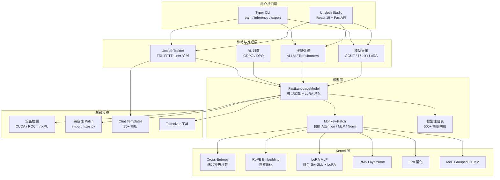
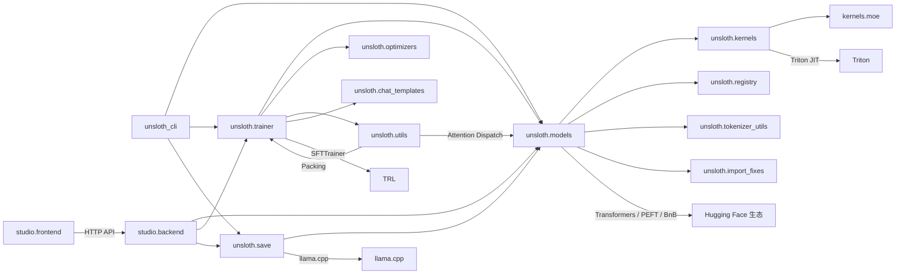
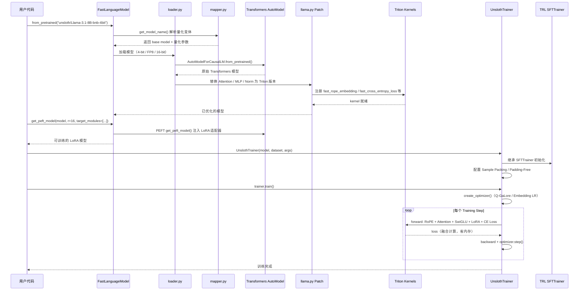
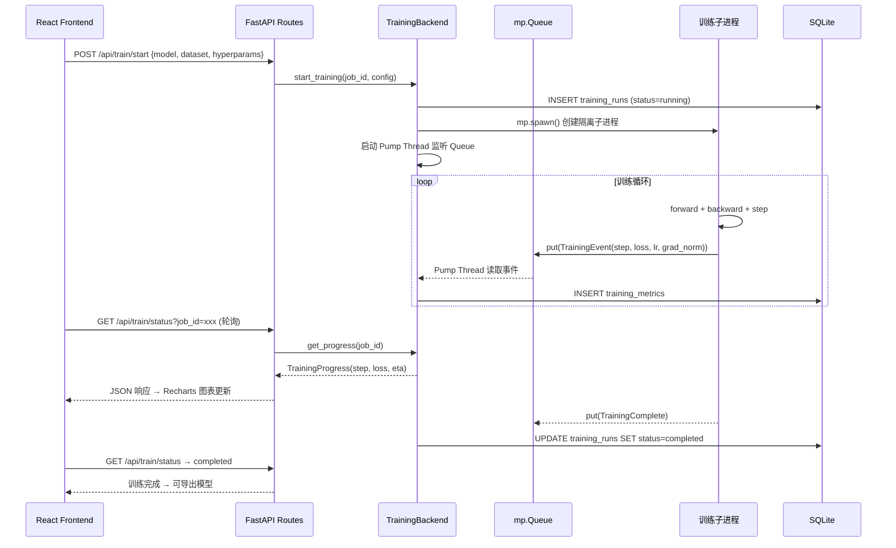

# unsloth 源码学习笔记

> 仓库地址：[unsloth](https://github.com/unslothai/unsloth)
> 学习日期：2026-04-05

---

> **以下为 AI 源码分析**
>
> ### 一句话概括
>
> Unsloth 是一个高性能 LLM 微调框架，通过自研 Triton kernel、内存优化和量化技术，实现 2 倍训练加速和 70% 显存节省，同时提供 Web UI (Studio) 和 CLI 两种使用方式。
>
> ### 要点速览
>
> | 核心模块 | 职责 | 关键文件 |
> |---------|------|---------|
> | `unsloth/models/` | 模型加载、LoRA 注入、Monkey-patch 优化 | `loader.py`, `llama.py`, `_utils.py` |
> | `unsloth/kernels/` | Triton 自定义 kernel（RoPE、交叉熵、SwiGLU 等） | `cross_entropy_loss.py`, `rope_embedding.py`, `fast_lora.py` |
> | `unsloth/trainer.py` | 训练器扩展（Q-GaLore、Embedding LR、Sample Packing） | `trainer.py` |
> | `unsloth/save.py` | 模型导出（GGUF、16-bit、LoRA merge） | `save.py` |
> | `studio/backend/` | FastAPI Web 后端（训练编排、推理、数据管理） | `core/training/`, `routes/`, `auth/` |
> | `studio/frontend/` | React 19 Web UI（训练配置、实时监控、数据 Recipe） | `src/features/studio/`, `src/app/routes/` |
> | `unsloth_cli/` | Typer CLI（train / inference / export / studio 子命令） | `commands/train.py`, `config.py` |

---

## 项目简介

Unsloth 是由 Daniel Han 和 Michael Han 兄弟创建的开源 LLM 微调加速框架。它解决了大模型微调过程中**显存占用过高**和**训练速度慢**两大核心痛点。通过自研 Triton kernel 对 RoPE、交叉熵损失、SwiGLU 等关键算子进行融合优化，结合 4-bit QLoRA、FP8 量化、Q-GaLore 优化器、Sample Packing 等技术，在不损失精度的前提下实现了最高 2 倍训练加速和 70% 显存节省。项目支持 500+ 种模型（Llama、Qwen、Gemma、DeepSeek 等），涵盖 SFT、GRPO/DPO 强化学习、视觉微调、Embedding 微调、TTS 微调等多种场景，并提供 Web UI (Unsloth Studio) 和 CLI 两种使用方式。

## 技术栈

| 类别 | 技术 |
|------|------|
| 语言 | Python 3.9-3.14, TypeScript |
| 框架 | PyTorch, Transformers, TRL, PEFT, FastAPI, React 19 |
| 构建工具 | setuptools + setuptools-scm, Vite 8 |
| 依赖管理 | pip / uv, npm / pnpm |
| 测试框架 | pytest, shell scripts |
| GPU 加速 | Triton, bitsandbytes, xformers, Flash Attention, vLLM |

## 目录结构

```
unsloth/
├── unsloth/                    # 核心 Python 包 — 模型加载、kernel、训练优化
│   ├── __init__.py             # 包入口：兼容性 patch + 公共 API 导出
│   ├── models/                 # 模型加载与 Monkey-patch 层
│   │   ├── loader.py           # FastLanguageModel.from_pretrained() 核心加载逻辑
│   │   ├── loader_utils.py     # 设备映射、FP8 量化、模型名解析
│   │   ├── llama.py            # Llama 系列模型的 LoRA 注入与 kernel 替换
│   │   ├── mapper.py           # 4-bit 量化模型名称映射字典
│   │   ├── rl.py               # 强化学习 (GRPO/DPO) 集成与 vLLM Patch
│   │   ├── vision.py           # 多模态视觉模型支持
│   │   ├── sentence_transformer.py  # Embedding 模型微调
│   │   └── _utils.py           # 梯度检查点、版本号、通用 Patch 工具
│   ├── kernels/                # Triton 自定义 kernel 库
│   │   ├── cross_entropy_loss.py   # 融合交叉熵损失（支持 > 64K 词汇表）
│   │   ├── rope_embedding.py       # 高效 RoPE 位置编码 kernel
│   │   ├── fast_lora.py            # 融合 LoRA MLP（SwiGLU/GEGLU + LoRA A/B）
│   │   ├── swiglu.py / geglu.py    # 激活函数前向/反向 kernel
│   │   ├── rms_layernorm.py        # RMS LayerNorm kernel
│   │   ├── flex_attention.py       # Flex Attention + logit softcapping
│   │   ├── fp8.py                  # FP8 量化/反量化 kernel
│   │   └── moe/                    # MoE Grouped GEMM kernel
│   ├── trainer.py              # UnslothTrainer — 扩展 TRL SFTTrainer
│   ├── save.py                 # 模型导出（GGUF / 16-bit / LoRA merge / HF Hub Push）
│   ├── chat_templates.py       # 70+ 模型聊天模板与 response-only 训练
│   ├── tokenizer_utils.py      # Tokenizer 加载修复与验证
│   ├── registry/               # 模型注册表（支持 search 查询）
│   ├── optimizers/             # Q-GaLore 8-bit 优化器
│   ├── utils/                  # Sample Packing + Attention Backend 选择
│   ├── dataprep/               # 数据准备（Raw Text / Synthetic）
│   └── import_fixes.py         # 20+ 兼容性 Patch（xformers, vLLM, datasets 等）
├── unsloth_cli/                # Typer CLI 入口
│   ├── __init__.py             # 注册子命令（train / inference / export / studio）
│   ├── config.py               # Pydantic 配置模型（嵌套 Data/Training/LoRA/Logging）
│   └── commands/               # 各子命令实现
├── studio/                     # Unsloth Studio Web UI
│   ├── backend/                # FastAPI 后端
│   │   ├── main.py             # 应用工厂 + 中间件 + Lifespan
│   │   ├── core/               # 训练/推理/导出/数据 Recipe 后端逻辑
│   │   ├── routes/             # RESTful API 路由
│   │   ├── auth/               # JWT 认证 + SQLite 用户存储
│   │   └── storage/            # SQLite 训练历史持久化
│   └── frontend/               # React 19 + Vite + TanStack Router + Zustand
│       └── src/
│           ├── features/studio/    # 训练仪表盘（模型选择、超参数、实时图表）
│           └── features/recipe-studio/  # 可视化数据 Recipe 编辑器
├── tests/                      # 测试套件
├── pyproject.toml              # 项目元数据与依赖声明
└── install.sh                  # 一键安装脚本
```

## 架构设计

### 整体架构

Unsloth 采用**分层 + 插件化**架构。最底层是 Triton Kernel 层，提供高性能融合算子；中间是模型层，通过 Monkey-patch 将自定义 kernel 注入 Hugging Face Transformers 模型；上层是训练/推理层，扩展 TRL 提供优化的训练循环；最顶层是用户接口层，提供 CLI 和 Web UI 两种交互方式。所有训练任务通过**子进程隔离**执行，避免 ML 库反复加载导致的内存膨胀。



### 核心模块

#### 1. 模型加载与 Patch 模块 (`unsloth/models/`)

**职责**：加载预训练模型、注入 LoRA 适配器、将关键算子替换为自定义 Triton kernel。

**核心文件**：
- `loader.py` — `FastLanguageModel.from_pretrained()` 主入口，支持 4-bit / 8-bit / FP8 / 16-bit / Full 五种加载模式
- `loader_utils.py` — 设备映射（`prepare_device_map()`）、模型名解析（`get_model_name()`）、FP8 量化工具
- `llama.py` — Llama 系列模型的 `FastLlamaModel` 实现，执行 Attention 和 MLP 的 kernel 替换
- `mapper.py` — `INT_TO_FLOAT_MAPPER` / `FLOAT_TO_INT_MAPPER` 等量化变体名称映射
- `rl.py` — `PatchFastRL()` 将 RL 训练器（GRPO/DPO）与 vLLM 推理对接
- `vision.py` — `FastBaseModel` 多模态视觉语言模型支持
- `_utils.py` — 梯度检查点优化、`_patch_trl_trainer()` 向后兼容

**关键接口**：
- `FastLanguageModel.from_pretrained(model_name, load_in_4bit, max_seq_length, ...)` — 加载模型
- `FastLanguageModel.get_peft_model(model, r, lora_alpha, target_modules, ...)` — 注入 LoRA
- `FastLanguageModel.for_inference(model)` — 切换到推理模式

**设计模式**：工厂模式（静态方法创建模型） + 适配器模式（包装 Transformers AutoModel） + Monkey-patch 模式（运行时替换模型方法）

#### 2. Triton Kernel 模块 (`unsloth/kernels/`)

**职责**：实现高性能融合算子，替代 PyTorch 原生实现，减少显存占用和计算开销。

**核心文件**：
- `cross_entropy_loss.py` — `fast_cross_entropy_loss()`：融合 logit → softmax → loss，支持 > 64K 词表分块计算，支持 Cohere logit scaling 和 Gemma 2 softcapping
- `rope_embedding.py` — `fast_rope_embedding()` / `inplace_rope_embedding()`：Q/K 旋转位置编码的 Triton kernel
- `fast_lora.py` — `apply_lora_mlp_swiglu()`：将 SwiGLU 激活与 LoRA A/B 矩阵乘融合为单个 kernel，避免中间张量分配
- `swiglu.py` / `geglu.py` — 激活函数的前向/反向 Triton kernel
- `rms_layernorm.py` — RMS LayerNorm 前向/反向，float32 中间计算保证数值稳定
- `flex_attention.py` — PyTorch Flex Attention 集成 + logit softcapping mask 生成
- `fp8.py` — FP8 per-tensor / per-block 反量化 kernel
- `moe/grouped_gemm/` — MoE 模型的 Grouped GEMM kernel

**设计模式**：Triton JIT 编译（`@triton.jit`） + PyTorch Autograd 集成（`torch.autograd.Function`） + 启发式特化（根据张量形状动态选择 kernel 参数）

#### 3. 训练器模块 (`unsloth/trainer.py`)

**职责**：扩展 TRL 的 `SFTTrainer`，增加 Unsloth 独有的训练优化。

**核心接口**：
- `UnslothTrainer` — 继承 `SFTTrainer`，覆写 `create_optimizer()` 支持 Q-GaLore 和 Embedding LR
- `UnslothTrainingArguments` — 增加 `embedding_learning_rate` 和 `q_galore_config` 配置
- `QGaloreConfig` — Q-GaLore 优化器配置（rank=256, update_proj_gap=200）

**关键特性**：
- **Sample Packing**：将多条短序列打包到同一 batch，提升 GPU 利用率
- **Padding-Free 训练**：序列 < 512 时自动启用，消除 padding 浪费
- **Embedding-specific LR**：embedding 层使用独立学习率
- **Q-GaLore**：8-bit 优化器状态 + 低秩梯度投影，3 倍内存节省

#### 4. 模型导出模块 (`unsloth/save.py`)

**职责**：将训练后的模型导出为多种格式。

**核心功能**：
- `unsloth_save_model()` — 主导出入口
- `save_to_gguf()` — 导出为 GGUF 格式（支持 17+ 量化方法：f16, bf16, q8_0, q4_k_m 等）
- LoRA merge + safetensors 导出
- Hugging Face Hub 一键推送

#### 5. Studio 后端 (`studio/backend/`)

**职责**：提供 RESTful API，编排训练/推理/导出任务。

**核心组件**：
- `core/training/training.py` — `TrainingBackend`：通过 `mp.spawn` 创建子进程执行训练，`mp.Queue` 传递进度事件
- `core/inference/orchestrator.py` — `InferenceOrchestrator`：模型加载 + 流式生成，兼容 OpenAI `/v1/chat/completions` 接口
- `routes/` — 模块化 FastAPI Router（auth / training / inference / export / datasets / data_recipe）
- `auth/` — JWT 认证（60min access token + 7d refresh token）+ SQLite 用户存储
- `storage/studio_db.py` — SQLite WAL 模式存储训练历史和指标

#### 6. Studio 前端 (`studio/frontend/`)

**职责**：交互式 Web UI，提供训练配置、实时监控、数据 Recipe 编辑等功能。

**技术栈**：React 19 + TypeScript + Vite 8 + TanStack Router + Zustand + shadcn/ui + Recharts + ReactFlow

**核心页面**：
- 训练仪表盘（模型选择 → 数据集配置 → 超参数调整 → 实时 Loss/LR 图表）
- 推理聊天（兼容 OpenAI 接口，支持 tool calling 和代码执行）
- 数据 Recipe 编辑器（可视化 DAG 流程，ReactFlow 图编辑）
- 模型导出（GGUF / Merged / LoRA adapter）

### 模块依赖关系



## 核心流程

### 流程一：模型加载与 LoRA 微调

从 `FastLanguageModel.from_pretrained()` 到训练完成的完整流程。这是 Unsloth 最核心的使用路径。



**关键逻辑说明**：
1. **模型名解析**：`mapper.py` 维护了大量量化变体映射（如 `"unsloth/Llama-3.1-8B-bnb-4bit"` → base model + 4-bit 配置），用户无需手动指定量化参数
2. **Monkey-patch 注入**：加载 Transformers 模型后，`llama.py` 逐层替换 `LlamaAttention.forward`、`LlamaMLP.forward`、`LlamaRMSNorm.forward` 为融合 Triton kernel 版本
3. **融合计算**：`fast_lora.py` 将 SwiGLU 激活 + LoRA A/B 矩阵乘合并为单个 Autograd Function，避免存储中间激活张量，显著节省显存
4. **交叉熵融合**：`cross_entropy_loss.py` 将 logit → softmax → log → nll_loss 融合为一个 Triton kernel，对 > 64K 词表自动分块

### 流程二：Studio 训练任务生命周期

从前端发起训练到结果展示的完整流程，体现子进程隔离架构。



**关键逻辑说明**：
1. **子进程隔离**：每个训练任务使用 `mp.get_context("spawn")` 创建独立进程，避免 ML 库（PyTorch、Transformers）反复加载导致内存泄漏，也支持不同任务使用不同版本的依赖
2. **Queue 通信**：训练进度通过 `mp.Queue` 单向传递到主进程，主进程的 Pump Thread 消费事件并写入 SQLite，前端通过轮询 API 获取状态
3. **SQLite WAL**：使用 WAL 模式的 SQLite 数据库持久化训练历史和逐步指标，支持训练中断后恢复查看历史数据

## 关键设计亮点

### 1. 融合 LoRA MLP Kernel — 零中间张量的反向传播

**解决的问题**：标准 LoRA 训练中，MLP 层的 SwiGLU 激活 + LoRA A/B 矩阵乘会产生大量中间张量，显存占用随序列长度线性增长。

**实现方式**（`unsloth/kernels/fast_lora.py`）：
- 自定义 `torch.autograd.Function`（`LoRA_MLP`）将 gate_proj、up_proj、down_proj 的 LoRA A/B 矩阵乘与 SwiGLU 前向/反向融合
- 前向时仅保存 LoRA 输入和权重指针，不保存中间激活
- 反向时在 Triton kernel 内重新计算激活值（recomputation 策略），用计算换显存
- `apply_lora_mlp_swiglu()` / `apply_lora_qkv()` 提供统一接口

**为什么这样设计**：LLM 的 MLP 层参数量占模型总参数的 ~2/3，是显存消耗的主要来源。通过融合 + recomputation，该 kernel 将 MLP 层的激活显存降低约 3 倍，是 Unsloth 实现 "70% less VRAM" 的核心技术之一。

### 2. 分块交叉熵损失 — 支持超大词汇表

**解决的问题**：大词汇表（如 Qwen 的 152K tokens）在计算交叉熵时需要对整个 vocab 维度做 softmax，朴素实现会 OOM。

**实现方式**（`unsloth/kernels/cross_entropy_loss.py`）：
- `_chunked_cross_entropy_forward()`：当 vocab_size > 65536 时自动分块，每次只计算一个 chunk 的 logit → softmax → loss
- 使用 logsumexp 技巧保证数值稳定性：先在每个 chunk 内计算 local max，再全局归一化
- 支持 Cohere 的 logit scaling（`logit_scaling != 1.0`）和 Gemma 2 的 logit softcapping（`logit_softcapping > 0`）

**为什么这样设计**：将 logit 到 loss 的完整流水线融合为一个 Triton kernel 避免了创建 `(batch * seq_len, vocab_size)` 的完整概率矩阵。对于 8192 token 序列 + 128K 词表，仅此一项可节省 ~8GB 显存。

### 3. Monkey-patch 架构 — 无侵入式优化

**解决的问题**：需要替换 Transformers 模型中的关键算子，但不能 fork 整个 Transformers 库（维护成本太高）。

**实现方式**（`unsloth/models/llama.py` + `_utils.py`）：
- 加载原始 Transformers 模型后，遍历模型层逐个替换 `forward` 方法
- 通过 `types.MethodType` 绑定替换后的方法到模型实例
- 梯度检查点使用自定义的 `Unsloth_Offloaded_Gradient_Checkpointer`，将激活卸载到 CPU
- 版本感知：根据 `transformers.__version__` 选择不同的 patch 策略

**为什么这样设计**：Monkey-patch 使 Unsloth 可以在不修改 Transformers 源码的前提下注入优化。用户只需 `import unsloth` 在前，其他代码完全不变。这极大降低了用户的迁移成本，也使 Unsloth 能够快速跟进 Transformers 的新版本。

### 4. 子进程训练隔离 — 零泄漏的任务管理

**解决的问题**：ML 库（PyTorch、CUDA）加载后无法完全释放 GPU 显存，长期运行的 Studio 服务器反复训练会导致显存泄漏。

**实现方式**（`studio/backend/core/training/training.py`）：
- 每个训练任务使用 `mp.get_context("spawn")` 创建全新进程
- 训练进程通过 `mp.Queue` 单向推送进度事件，不共享任何可变状态
- 主进程 Pump Thread 消费事件写入 SQLite
- 训练完成或异常终止时进程退出，OS 级别回收所有显存

**为什么这样设计**：Python 的 `spawn` 方式创建进程完全避免了 `fork` 的 copy-on-write 陷阱。训练进程生命周期严格等于任务生命周期，OS 保证进程退出后所有资源（包括 GPU 显存）被完全回收。这是 Studio 可以长时间稳定运行的关键。

### 5. Q-GaLore 优化器 — 3 倍优化器状态内存压缩

**解决的问题**：Adam 优化器需要为每个参数维护两份状态（一阶/二阶矩估计），对于 7B 参数模型需要 ~56GB 优化器状态。

**实现方式**（`unsloth/optimizers/q_galore_adamw.py` + `q_galore_projector.py`）：
- 将梯度投影到低秩子空间（rank=256），只在低秩空间维护 Adam 状态
- 8-bit 量化优化器状态（`QGaLoreAdamW8bit`）
- 权重本身使用 symmetric INT4 量化存储
- 投影矩阵定期更新（每 200 步），使用 queue 缓存避免频繁 SVD 计算

**为什么这样设计**：结合了 GaLore（低秩梯度投影）和量化两种技术，将优化器状态从 full-rank float32 压缩到 low-rank 8-bit，实现约 3 倍内存压缩。这使得在消费级 GPU（24GB）上全参数微调 7B 模型成为可能。
