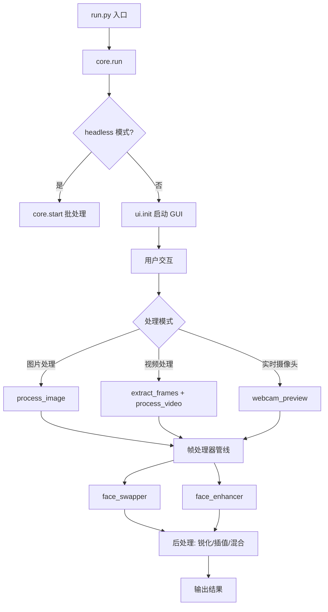
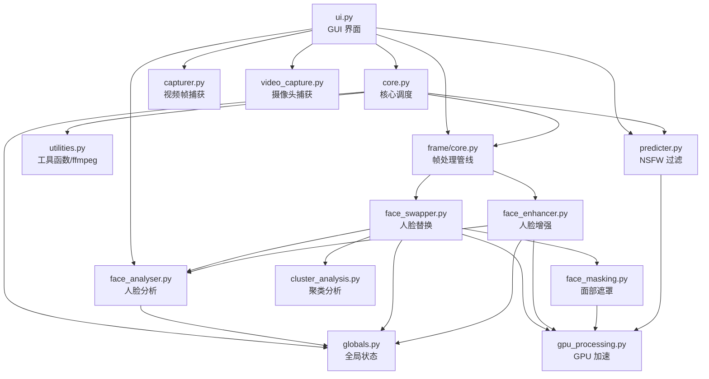
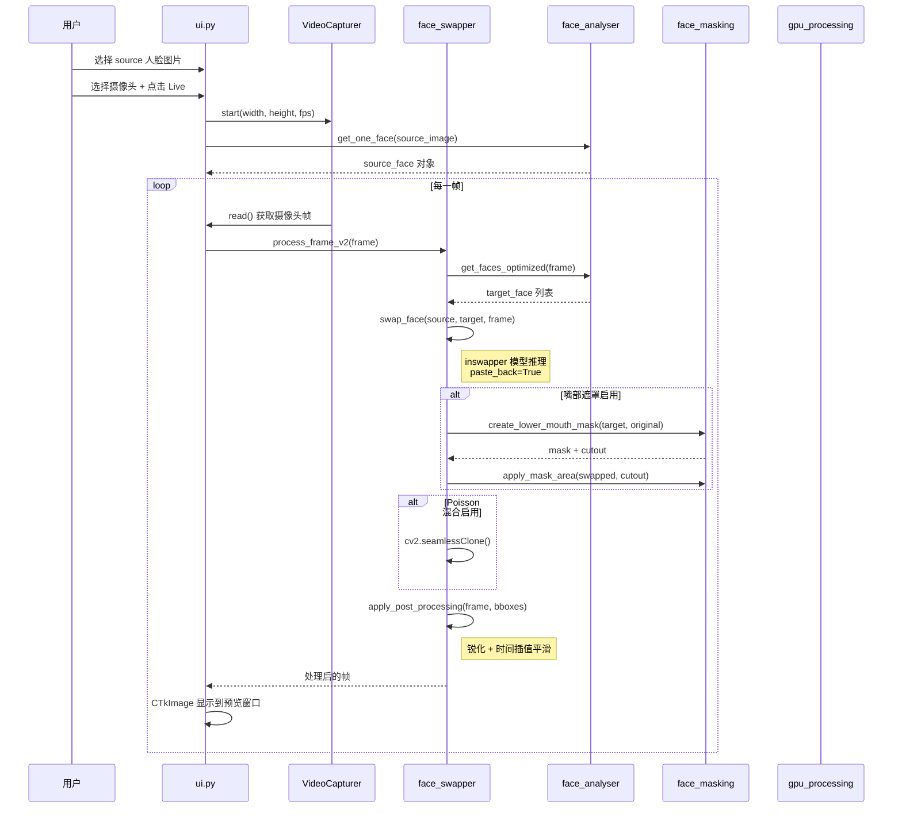
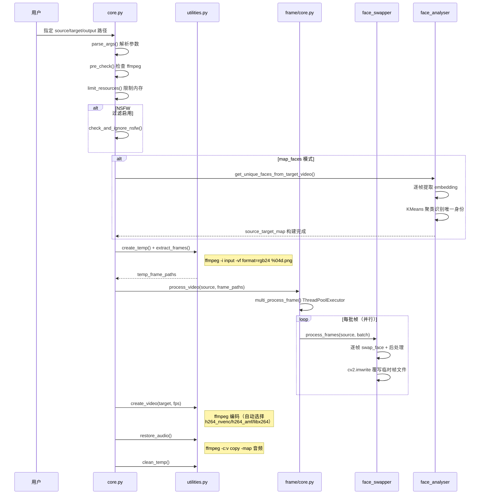

# Deep-Live-Cam 源码学习笔记

> 仓库地址：[Deep-Live-Cam](https://github.com/hacksider/Deep-Live-Cam)
> 学习日期：2026-03-22

---

> **以下为 AI 源码分析**
>
> ### 一句话概括
>
> 基于 InsightFace 和 ONNX Runtime 的实时人脸替换工具，支持图片/视频/摄像头直播三种模式，通过 GUI 操作仅需单张图片即可完成 deepfake 换脸。
>
> ### 要点速览
>
> | 核心模块 | 职责 | 关键文件 |
> |----------|------|----------|
> | 入口与核心调度 | 参数解析、资源管理、处理流程编排 | `run.py`, `modules/core.py` |
> | 人脸分析 | 人脸检测、识别、特征提取、聚类映射 | `modules/face_analyser.py`, `modules/cluster_analysis.py` |
> | 帧处理器管线 | 可插拔的帧处理器框架（换脸、增强） | `modules/processors/frame/core.py` |
> | 人脸替换 | inswapper 模型推理、mask 混合、后处理 | `modules/processors/frame/face_swapper.py` |
> | 人脸增强 | GFPGAN/GPEN 模型超分辨率增强 | `modules/processors/frame/face_enhancer.py` |
> | 面部遮罩 | 嘴部/眼部/眉毛区域精细遮罩 | `modules/processors/frame/face_masking.py` |
> | GPU 加速层 | OpenCV CUDA 透明加速封装 | `modules/gpu_processing.py` |
> | 视频处理 | ffmpeg 编解码、帧抽取/合成 | `modules/utilities.py` |
> | 图形界面 | CustomTkinter 实现的交互式 GUI | `modules/ui.py` |
> | NSFW 过滤 | opennsfw2 内容安全检测 | `modules/predicter.py` |

---

## 项目简介

Deep-Live-Cam 是一款开源实时人脸替换（face swap）工具，只需提供一张人脸图片，即可将目标图片、视频或实时摄像头画面中的人脸替换为指定人脸。项目基于 InsightFace 的 inswapper 模型进行人脸替换，支持 GFPGAN/GPEN 模型做后处理增强，内置 NSFW 内容过滤。支持 CUDA / CoreML / DirectML / ROCm 多种 GPU 加速后端，并对 Apple Silicon 做了专项优化。通过 CustomTkinter 构建的 GUI 提供了源脸选择、目标选择、实时摄像头预览、面部映射、嘴部遮罩等丰富功能。

## 技术栈

| 类别 | 技术 |
|------|------|
| 语言 | Python 3.9+ |
| 框架 | InsightFace (人脸检测/识别/替换), ONNX Runtime (模型推理), OpenCV (图像处理) |
| 构建工具 | 无（脚本直接运行），提供 `.bat` 启动脚本 |
| 依赖管理 | pip / requirements.txt |
| 测试框架 | 无正式测试框架 |

## 目录结构

```
Deep-Live-Cam/
├── run.py                          # 程序入口，导入 tkinter_fix 后调用 core.run()
├── tkinter_fix.py                  # Tkinter 9.0 兼容性补丁
├── requirements.txt                # Python 依赖声明
├── models/                         # 模型文件存放目录
│   └── instructions.txt            # 模型下载说明
├── locales/                        # 多语言翻译文件 (JSON)
│   ├── zh.json
│   ├── en.json (内置)
│   └── ...
├── modules/                        # 核心业务逻辑
│   ├── core.py                     # 核心调度：参数解析、处理流程编排
│   ├── globals.py                  # 全局状态变量（路径、开关、参数）
│   ├── metadata.py                 # 项目元信息（名称、版本）
│   ├── ui.py                       # CustomTkinter GUI 界面
│   ├── face_analyser.py            # 人脸检测/识别/特征提取/映射
│   ├── cluster_analysis.py         # KMeans 聚类分析（多人脸场景）
│   ├── capturer.py                 # 视频帧捕获
│   ├── video_capture.py            # 摄像头捕获封装（VideoCapturer 类）
│   ├── predicter.py                # NSFW 内容检测（opennsfw2）
│   ├── utilities.py                # 工具函数：ffmpeg、文件操作、下载
│   ├── gpu_processing.py           # OpenCV CUDA 加速透明封装层
│   ├── typing.py                   # 类型别名定义
│   ├── custom_types.py             # 自定义类型
│   ├── gettext.py                  # 国际化语言管理
│   ├── ui_tooltip.py               # UI 工具提示组件
│   ├── paths.py                    # 路径配置
│   └── processors/
│       └── frame/                  # 帧处理器（可插拔管线）
│           ├── core.py             # 帧处理器注册/加载/多线程调度
│           ├── face_swapper.py     # 人脸替换处理器
│           ├── face_enhancer.py    # GFPGAN 人脸增强处理器
│           ├── face_enhancer_gpen256.py  # GPEN-256 增强器
│           ├── face_enhancer_gpen512.py  # GPEN-512 增强器
│           ├── face_masking.py     # 面部遮罩（嘴部/眼部/眉毛）
│           └── _onnx_enhancer.py   # ONNX 增强器基类
└── media/                          # 演示素材（GIF/PNG）
```

## 架构设计

### 整体架构

Deep-Live-Cam 采用**管线式处理架构（Pipeline Architecture）**，核心思想是将图像处理流程拆分为多个可插拔的帧处理器（Frame Processor），按顺序对每一帧执行处理。全局状态通过 `modules/globals.py` 模块级变量共享，GUI 层通过修改全局状态来驱动处理行为。



### 核心模块

#### 1. 入口与核心调度 (`core.py`)

**职责**：程序生命周期管理，包括参数解析、前置检查、资源限制、处理流程编排。

- `parse_args()`: 使用 argparse 解析命令行参数，写入 `modules.globals` 全局状态
- `pre_check()`: 检查 Python 版本和 ffmpeg 是否可用
- `start()`: 批处理入口，区分图片和视频两种处理路径
- `run()`: 主入口，headless 模式直接调用 `start()`，否则启动 GUI
- `limit_resources()`: 限制 TensorFlow GPU 内存增长，设置进程内存上限
- `destroy()`: 清理临时文件并退出

**关键设计**：通过 `modules.globals.headless` 标志区分命令行模式和 GUI 模式，两种模式共享同一套处理逻辑。

#### 2. 人脸分析 (`face_analyser.py`)

**职责**：封装 InsightFace 的人脸检测、识别、特征提取能力，并提供多人脸场景下的映射管理。

- `get_face_analyser()`: 线程安全的单例初始化，使用 `buffalo_l` 模型，启用 detection + recognition + landmark_2d_106 三个模块
- `get_one_face(frame)`: 获取画面中最左侧的人脸
- `get_many_faces(frame)`: 获取画面中所有人脸
- `get_unique_faces_from_target_video()`: 从视频中提取所有帧的人脸 embedding，通过 KMeans 聚类识别唯一人脸身份
- `simplify_maps()`: 将 `source_target_map` 简化为 embedding 向量集合，用于实时模式快速匹配

**关键数据结构**：
- `source_target_map`: 完整映射表，存储 source face 和 target face 的详细信息（cv2 图像 + InsightFace Face 对象）
- `simple_map`: 简化映射表，仅存储 embedding 向量，用于实时模式

#### 3. 帧处理器管线 (`processors/frame/core.py`)

**职责**：可插拔的帧处理器框架，负责处理器的注册、加载、多线程并行调度。

- `FRAME_PROCESSORS_INTERFACE`: 定义处理器必须实现的 5 个接口 — `pre_check`, `pre_start`, `process_frame`, `process_image`, `process_video`
- `load_frame_processor_module()`: 通过 `importlib.import_module` 动态加载处理器模块，白名单校验（`ALLOWED_PROCESSORS`）
- `multi_process_frame()`: 使用 `ThreadPoolExecutor` 分批并行处理帧，batch_size 根据线程数动态计算
- `set_frame_processors_modules_from_ui()`: 响应 UI 开关变化，动态添加/移除处理器

#### 4. 人脸替换处理器 (`face_swapper.py`)

**职责**：核心换脸逻辑，基于 inswapper_128 ONNX 模型执行人脸替换，并进行后处理。

- `get_face_swapper()`: 线程安全加载 inswapper 模型，Apple Silicon 使用 CoreML 优化配置
- `swap_face()`: 单次换脸核心流程 — 模型推理 → 嘴部遮罩 → Poisson 混合 → 透明度混合
- `process_frame()`: 简单模式，对画面中一个或多个人脸执行换脸
- `process_frame_v2()`: 复杂模式，支持 map_faces 人脸映射和实时摄像头
- `apply_post_processing()`: 后处理管线 — 锐化（GPU Unsharp Mask）+ 时间插值平滑
- `get_faces_optimized()`: Apple Silicon 优化的自适应人脸检测缓存

**Apple Silicon 优化**：
- CoreML ExecutionProvider 配置使用 Neural Engine + GPU + CPU 混合计算
- 自适应帧检测频率（`DETECTION_INTERVAL = 0.033s` ≈ 30fps）
- 人脸检测结果缓存，避免每帧重复检测

#### 5. 人脸增强处理器 (`face_enhancer.py`)

**职责**：使用 GFPGAN ONNX 模型对换脸后的人脸区域进行超分辨率增强。

- `_align_face()`: 基于 FFHQ 512x512 5-point 模板，通过仿射变换对齐人脸
- `_preprocess_face()`: BGR → RGB → [-1,1] 归一化 → NCHW 张量
- `_postprocess_face()`: 逆归一化 → RGB → BGR
- `_paste_back()`: 逆仿射变换 + 羽化边缘 Alpha 混合，将增强后的人脸贴回原帧
- `enhance_face()`: 完整增强流程 — 检测 → 对齐 → 推理 → 贴回

#### 6. GPU 加速层 (`gpu_processing.py`)

**职责**：透明的 GPU 加速封装，当 OpenCV 编译了 CUDA 支持时自动启用 GPU 路径，否则回退到 CPU。

封装函数：`gpu_gaussian_blur`, `gpu_add_weighted`, `gpu_sharpen`, `gpu_resize`, `gpu_cvt_color`, `gpu_flip`

**设计模式**：策略模式 — 每个函数内部先尝试 CUDA 路径（upload → GPU 计算 → download），失败则自动回退到 CPU 的 `cv2` 等价调用。模块导入时一次性检测 CUDA 可用性。

#### 7. 面部遮罩系统 (`face_masking.py`)

**职责**：精细化的面部区域遮罩，支持嘴部、眼部、眉毛三种遮罩类型，用于保留原始面部特定区域。

- `create_face_mask()`: 基于 106 点 landmark 创建面部凸包遮罩，带外扩 padding 和高斯模糊边缘
- `create_lower_mouth_mask()`: 基于嘴部 landmark 52-71 创建可调大小的嘴部遮罩
- `create_eyes_mask()`: 椭圆拟合的眼部遮罩
- `create_eyebrows_mask()`: 二次曲线拟合的眉毛遮罩
- `apply_mask_area()`: LAB 色彩空间颜色迁移 + 多级高斯羽化 + Alpha 混合
- `apply_color_transfer()`: LAB 色彩空间的均值-标准差颜色迁移

### 模块依赖关系



## 核心流程

### 流程一：实时摄像头换脸

这是 Deep-Live-Cam 最核心的实时换脸流程，通过摄像头捕获每一帧，实时检测人脸并完成替换。



**关键逻辑说明**：

1. **自适应检测频率**：Apple Silicon 上使用 `get_faces_optimized()` 做 30fps 自适应检测缓存，避免每帧都跑完整的人脸检测
2. **换脸核心**：`insightface.model_zoo.get_model().get()` 执行 inswapper_128 模型推理，`paste_back=True` 自动将结果贴回原帧
3. **嘴部保留**：通过 `create_lower_mouth_mask()` 提取原始帧的嘴部区域，在换脸结果上用 Alpha 混合贴回，实现"说话时嘴部自然"的效果
4. **时间插值**：`apply_post_processing()` 将当前帧与上一帧做加权混合，消除帧间抖动

### 流程二：视频文件批处理



**关键逻辑说明**：

1. **帧抽取**：使用 ffmpeg 将视频解码为 PNG 序列帧，硬件加速解码 (`-hwaccel auto`)
2. **多人脸映射**：`map_faces` 模式下先遍历所有帧提取人脸 embedding，用 KMeans 聚类自动识别不同身份，建立 source → target 映射表
3. **并行处理**：`ThreadPoolExecutor` 按 batch 并行处理帧，batch_size = `len(frames) / num_threads`
4. **智能编码**：根据 execution_provider 自动选择 GPU 编码器（NVENC/AMF），失败时自动回退到 CPU 软编码
5. **音频保留**：通过 ffmpeg 的 `-c:v copy -map 0:v:0 -map 1:a:0` 将原视频音轨合并到输出

## 关键设计亮点

### 1. 可插拔帧处理器管线

**解决问题**：需要灵活组合不同的图像处理步骤（换脸、增强、去噪等），且 UI 需要动态开启/关闭。

**实现方式**：`processors/frame/core.py` 定义了 `FRAME_PROCESSORS_INTERFACE` 标准接口（5 个方法），通过 `importlib.import_module` 动态加载。白名单 `ALLOWED_PROCESSORS` 确保安全。`set_frame_processors_modules_from_ui()` 响应 UI 开关实时添加/移除处理器。

**设计优势**：新增处理器只需在 `processors/frame/` 目录下新建模块并实现 5 个标准接口，无需修改框架代码。

### 2. 透明 GPU 加速封装

**解决问题**：OpenCV CUDA 并非在所有环境可用，需要在有 GPU 时加速、无 GPU 时正常运行。

**实现方式**：`gpu_processing.py` 在模块导入时一次性检测 `cv2.cuda.GpuMat` 是否可用，每个公开函数内部 try CUDA 路径 → except 回退 CPU 路径。调用方完全不感知 GPU 是否存在。

**设计优势**：零侵入——整个项目通过 `from modules.gpu_processing import gpu_gaussian_blur` 替代 `cv2.GaussianBlur`，无需任何条件分支。

### 3. 多人脸聚类映射

**解决问题**：视频中有多个人脸时，需要识别"哪些帧里的人脸属于同一个人"，并将不同 source 脸映射到正确的 target。

**实现方式**：`face_analyser.py` 的 `get_unique_faces_from_target_video()` 遍历所有帧提取 512 维 face embedding，使用 `sklearn.KMeans` 聚类（通过 inertia 差值法确定最优 k 值），每个 cluster 代表一个独立身份。`cluster_analysis.py` 的 `find_closest_centroid()` 通过 embedding 余弦相似度匹配最近质心。

**设计优势**：无需用户手动标注每个人脸的身份，全自动识别和映射。

### 4. 嘴部遮罩保留系统

**解决问题**：换脸后嘴部动作不自然，尤其是说话时嘴型与表情不匹配。

**实现方式**：`face_masking.py` 的 `create_lower_mouth_mask()` 基于 InsightFace 的 106 点 landmark（第 52-71 点）定位嘴部区域，支持通过 `mouth_mask_size` slider 动态调整遮罩范围。遮罩从原始帧（未换脸）中 cutout 嘴部区域，通过 LAB 色彩空间颜色迁移 + 多级高斯羽化 + Alpha 混合贴回换脸后的帧，实现自然过渡。

**设计优势**：保留了原始人脸的嘴部动态，大幅提升换脸的真实感，参数可通过 GUI slider 实时调节。

### 5. Apple Silicon 专项优化

**解决问题**：Mac M1-M5 芯片需要充分利用 Neural Engine 和 Metal GPU，同时避免实时模式下的帧率瓶颈。

**实现方式**：
- `face_swapper.py` 检测 `IS_APPLE_SILICON` 标志，为 CoreML ExecutionProvider 配置 `MLComputeUnits: ALL`（使用 Neural Engine + GPU + CPU 混合），启用 `AllowLowPrecisionAccumulationOnGPU` 和 512MB 模型缓存
- `get_faces_optimized()` 实现自适应检测缓存，33ms 内不重复检测（≈30fps），直接复用上一帧结果
- `onnxruntime-silicon` 专用包提供 CoreML 后端

**设计优势**：在不影响跨平台兼容性的前提下（所有优化路径都有通用回退），显著提升 Apple Silicon 上的实时性能。
