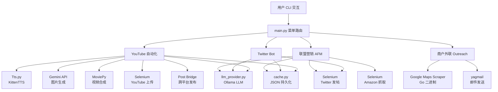
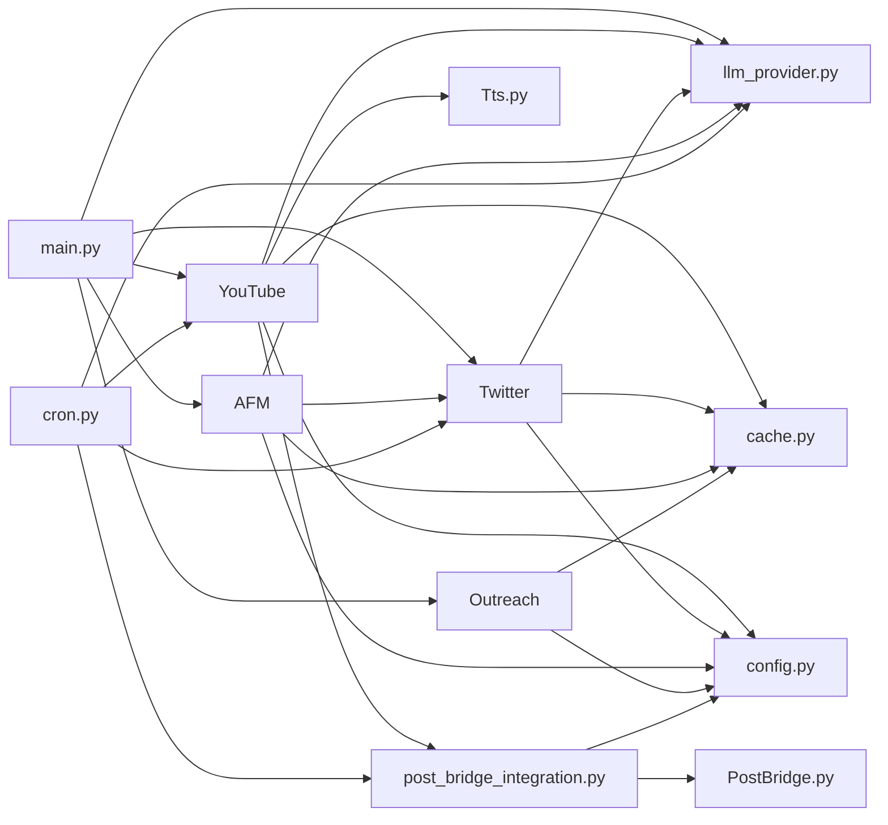
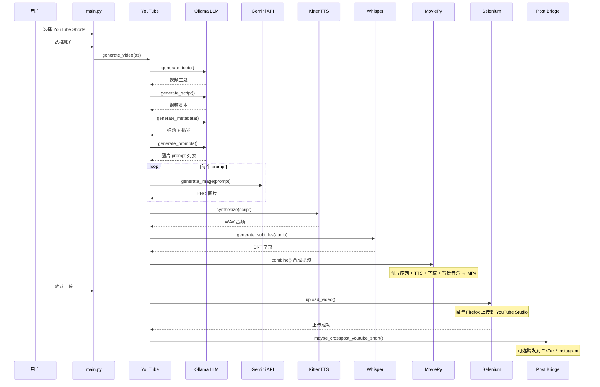
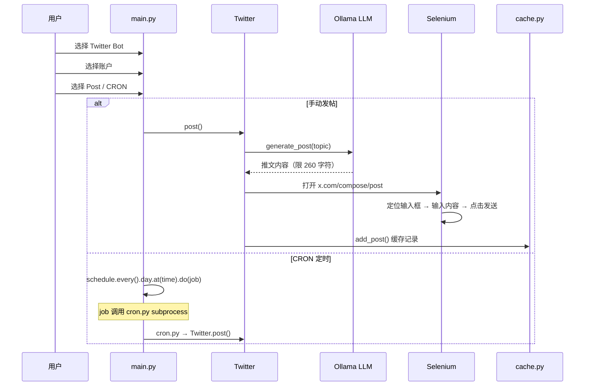

# MoneyPrinterV2 源码学习笔记

> 仓库地址：[MoneyPrinterV2](https://github.com/FujiwaraChoki/MoneyPrinterV2)
> 学习日期：2026-03-29

---

> **以下为 AI 源码分析**
>
> ### 一句话概括
>
> MoneyPrinterV2 是一个基于 Ollama LLM + Selenium 浏览器自动化的"在线赚钱"自动化工具，能自动生成并上传 YouTube Shorts、自动发 Twitter 推文、做 Amazon 联盟营销推广，以及通过 Google Maps 抓取本地商户并进行邮件外联。
>
> ### 要点速览
>
> | 核心模块 | 职责 | 关键文件 |
> |---------|------|---------|
> | YouTube 自动化 | 生成脚本→AI 配图→TTS 语音→合成视频→Selenium 上传 YouTube | `src/classes/YouTube.py` |
> | Twitter Bot | LLM 生成推文→Selenium 自动发帖 | `src/classes/Twitter.py` |
> | 联盟营销 (AFM) | 抓取 Amazon 商品信息→LLM 生成推广文案→Twitter 发帖 | `src/classes/AFM.py` |
> | 商户外联 (Outreach) | Google Maps 抓取→提取邮箱→批量发送推广邮件 | `src/classes/Outreach.py` |
> | Post Bridge 跨平台发布 | YouTube 上传成功后，将视频跨发到 TikTok/Instagram | `src/classes/PostBridge.py`, `src/post_bridge_integration.py` |
> | LLM 提供者 | 封装 Ollama API 进行文本生成 | `src/llm_provider.py` |
> | TTS 语音合成 | 使用 KittenTTS 将脚本转为语音 | `src/classes/Tts.py` |
> | 缓存管理 | JSON 文件持久化账户、视频、商品数据 | `src/cache.py` |
> | 定时任务 (CRON) | schedule 库定时触发 Twitter 发帖 / YouTube 上传 | `src/cron.py` |

---

## 项目简介

MoneyPrinterV2（简称 MPV2）是 MoneyPrinter 项目的第二版，旨在自动化多种"在线变现"流程。它集成了 YouTube Shorts 视频自动生成与上传、Twitter 自动发帖机器人、Amazon 联盟营销推广、以及通过 Google Maps 抓取本地商户进行邮件冷启动营销等功能。整个项目围绕本地部署的 Ollama LLM 驱动内容生成，使用 Selenium + Firefox 进行浏览器自动化操作，采用 CLI 菜单式交互，支持 CRON 定时调度。

## 技术栈

| 类别 | 技术 |
|------|------|
| 语言 | Python 3.12 |
| 框架 | 无 Web 框架，CLI 交互式应用 |
| 构建工具 | pip + venv |
| 依赖管理 | requirements.txt |
| 测试框架 | pytest（`tests/` 目录下有测试文件） |
| LLM 引擎 | Ollama（本地 LLM 服务） |
| 浏览器自动化 | Selenium + Firefox + GeckoDriver |
| 视频处理 | MoviePy + ImageMagick |
| TTS | KittenTTS |
| STT | faster-whisper / AssemblyAI |
| 图片生成 | Gemini API（代号 Nano Banana 2） |
| 邮件发送 | yagmail |

## 目录结构

```
MoneyPrinterV2/
├── src/                          # 源码主目录
│   ├── main.py                   # 应用入口，CLI 菜单驱动
│   ├── cron.py                   # CRON 定时任务入口
│   ├── config.py                 # 配置文件读取（config.json）
│   ├── constants.py              # 全局常量（菜单选项、XPath 等）
│   ├── cache.py                  # JSON 缓存管理（账户/视频/商品）
│   ├── utils.py                  # 工具函数（清理临时文件、下载歌曲等）
│   ├── llm_provider.py           # Ollama LLM 封装
│   ├── status.py                 # 控制台彩色日志输出
│   ├── art.py                    # ASCII Banner 展示
│   ├── post_bridge_integration.py # Post Bridge 跨平台发布集成
│   └── classes/                  # 业务模块类
│       ├── YouTube.py            # YouTube Shorts 自动生成与上传
│       ├── Twitter.py            # Twitter 自动发帖机器人
│       ├── Tts.py                # KittenTTS 语音合成
│       ├── AFM.py                # 联盟营销（Amazon）
│       ├── Outreach.py           # 商户外联（Google Maps 抓取 + 邮件）
│       └── PostBridge.py         # Post Bridge API 客户端
├── tests/                        # 测试目录
├── docs/                         # 文档
├── scripts/                      # 辅助脚本（上传、本地安装等）
├── fonts/                        # 字幕字体文件
├── assets/                       # 静态资源（ASCII Banner）
├── config.example.json           # 配置示例文件
└── requirements.txt              # Python 依赖
```

## 架构设计

### 整体架构

MoneyPrinterV2 采用**模块化的 CLI 菜单驱动架构**。`main.py` 作为入口提供交互式菜单，用户选择功能后将任务路由到对应的业务模块类。所有内容生成都通过 `llm_provider.py` 统一调用本地 Ollama LLM，浏览器自动化操作（YouTube 上传、Twitter 发帖）通过 Selenium + Firefox 实现。缓存层使用 JSON 文件存储账户和历史数据。



### 核心模块

#### 1. YouTube 自动化模块 (`src/classes/YouTube.py`)

**职责**：端到端自动生成 YouTube Shorts 视频并上传。

**核心流程**：
- `generate_topic()` → LLM 生成视频主题
- `generate_script()` → LLM 生成视频脚本（限制句数）
- `generate_metadata()` → LLM 生成标题和描述
- `generate_prompts()` → LLM 生成 AI 图片 prompt 列表
- `generate_image()` → 调用 Gemini API（Nano Banana 2）生成图片
- `generate_script_to_speech()` → KittenTTS 将脚本转为 WAV 音频
- `generate_subtitles()` → faster-whisper 或 AssemblyAI 生成 SRT 字幕
- `combine()` → MoviePy 将图片、音频、字幕、背景音乐合成 MP4 视频
- `upload_video()` → Selenium 操控 Firefox 上传到 YouTube

**关键设计**：
- 视频尺寸固定为 1080x1920（9:16 竖屏 Shorts 格式）
- 图片展示时长 = TTS 音频总时长 / 图片数量，均匀分配
- 字幕通过 `srt_equalizer` 均衡化处理，每行限制 10 字符
- 背景音乐音量降到 0.1，不影响语音

#### 2. Twitter Bot 模块 (`src/classes/Twitter.py`)

**职责**：自动生成并发布 Twitter 推文。

**核心接口**：
- `generate_post()` → LLM 根据账户主题生成推文（限 260 字符）
- `post(text)` → Selenium 操控 Firefox 在 x.com 上发帖
- `get_posts()` / `add_post()` → 缓存历史帖子

**关键设计**：
- 使用多个 CSS Selector 和 XPath 作为后备策略定位 Tweet 输入框和发送按钮
- 使用 `WebDriverWait` 等待元素可交互后再操作

#### 3. 联盟营销模块 (`src/classes/AFM.py`)

**职责**：从 Amazon 抓取商品信息，LLM 生成推广文案，通过 Twitter 发布。

**核心流程**：
- `scrape_product_information()` → Selenium 打开 Amazon 商品页，抓取标题和特性
- `generate_pitch()` → LLM 根据商品信息生成推广文案，拼接联盟链接
- `share_pitch("twitter")` → 实例化 `Twitter` 类发布推文

#### 4. 商户外联模块 (`src/classes/Outreach.py`)

**职责**：通过 Google Maps 抓取本地商户信息，提取邮箱，批量发送推广邮件。

**核心流程**：
- `unzip_file()` → 下载并解压 Google Maps Scraper（Go 二进制）
- `build_scraper()` → 编译 Go 爬虫
- `run_scraper_with_args_for_30_seconds()` → 运行爬虫抓取商户信息到 CSV
- `set_email_for_website()` → 访问商户网站，正则提取邮箱
- `start()` → 串联全流程，使用 yagmail 批量发送邮件

#### 5. Post Bridge 跨平台发布 (`src/classes/PostBridge.py` + `src/post_bridge_integration.py`)

**职责**：YouTube 上传成功后，将视频跨发到 TikTok 和 Instagram。

**核心接口**：
- `PostBridge` 类：封装 Post Bridge REST API（列出账户、上传媒体、创建帖子）
- `maybe_crosspost_youtube_short()` → 集成入口，检查配置后执行跨发
- `resolve_social_account_ids()` → 解析目标社交账户 ID（支持自动选择和交互选择）

**关键设计**：
- 支持自动重试（429、5xx 状态码）
- 交互模式和 CRON 模式有不同行为（CRON 下不弹交互提示）
- `prompt_fn` 参数支持依赖注入，方便测试

#### 6. LLM 提供者 (`src/llm_provider.py`)

**职责**：统一封装 Ollama 本地 LLM 调用。

**核心接口**：
- `list_models()` → 列出本地可用模型
- `select_model()` → 选择当前会话使用的模型（全局单例）
- `generate_text()` → 发送 prompt 获取文本响应

#### 7. 缓存管理 (`src/cache.py`)

**职责**：使用 `.mp/` 目录下的 JSON 文件持久化账户、视频、商品等数据。

**存储结构**：
- `youtube.json` → YouTube 账户及其视频列表
- `twitter.json` → Twitter 账户及其帖子列表
- `afm.json` → 联盟营销商品数据
- `scraper_results.csv` → Google Maps 抓取结果

### 模块依赖关系



## 核心流程

### 流程一：YouTube Shorts 自动生成与上传

这是项目最核心的功能，完整串联了从内容创意到视频上传的全链路自动化。



**关键细节**：
1. **主题生成**：LLM 根据用户设定的 niche（如"科技"、"美食"）生成一句话视频创意
2. **脚本生成**：LLM 生成固定句数的脚本，去除 Markdown 格式和角色标注，纯净的旁白文本
3. **图片生成**：LLM 先生成详细的图片描述 prompt，再调用 Gemini API 生成 9:16 竖屏图片
4. **视频合成**：`MoviePy` 将图片按均匀时长拼接，叠加 TTS 语音、背景音乐（音量 0.1）和字幕
5. **自动上传**：`Selenium` 模拟用户操作 YouTube Studio 完成上传，设置标题、描述、儿童内容标记，发布为"不公开"

### 流程二：Twitter Bot 自动发帖



**关键细节**：
1. **推文生成**：LLM 根据账户主题和配置的语言生成 2 句话推文，超过 260 字符自动截断
2. **发帖机制**：使用 3 组不同的 CSS Selector / XPath 作为后备策略定位 Tweet 输入框和 Post 按钮
3. **CRON 调度**：主进程通过 `schedule` 库注册定时任务，实际通过 `subprocess` 调用 `cron.py` 执行

## 关键设计亮点

### 1. LLM 驱动的全链路内容生产

**解决的问题**：自动化内容创作，无需人工编写脚本或手动设计图片。

**实现方式**：`YouTube.py` 中通过 5 次 LLM 调用串联完成从主题→脚本→元数据→图片描述→最终视频的全链路。每次调用的 prompt 精心设计，包含严格的格式约束（如"只返回 JSON 数组"、"不超过 N 句"、"不包含 Markdown"）。

**设计理由**：将 LLM 作为"创意引擎"，每一步的输出作为下一步的输入，形成自动化的内容生产流水线。通过 prompt 工程约束输出格式，确保下游处理逻辑能正确解析。

### 2. 多层后备的浏览器元素定位策略

**解决的问题**：社交平台 UI 经常变化，单一的 CSS Selector 或 XPath 容易失效。

**实现方式**：`Twitter.py` 中的 `post()` 方法使用 `text_box_selectors` 和 `post_button_selectors` 列表，依次尝试多种定位方式（`data-testid`、XPath、通用 `role` 属性），第一个成功的即采用。

**设计理由**：提高对 UI 变化的鲁棒性，当主要选择器因平台 HTML 结构调整而失效时，后备选择器仍可能匹配成功。

### 3. JSON 文件缓存的简洁持久化方案

**解决的问题**：需要持久化账户信息、视频历史等数据，但不需要数据库的复杂性。

**实现方式**：`cache.py` 使用 `.mp/` 目录下的 JSON 文件（`youtube.json`、`twitter.json`、`afm.json`）存储结构化数据。通过 `get_accounts()` / `add_account()` / `remove_account()` 等函数封装 CRUD 操作，每次操作都是完整的读取-修改-写入周期。

**设计理由**：对于 CLI 工具来说，JSON 文件方案简单直接，无需额外依赖，数据可直接人工查看和编辑。

### 4. 可配置的 STT 提供者切换

**解决的问题**：不同用户有不同的语音转文字需求——有人需要免费的本地方案，有人需要高精度的云服务。

**实现方式**：`YouTube.py` 中的 `generate_subtitles()` 根据 `config.json` 中的 `stt_provider` 字段，路由到 `generate_subtitles_local_whisper()`（faster-whisper 本地推理）或 `generate_subtitles_assemblyai()`（AssemblyAI 云 API）。

**设计理由**：策略模式的简单实现，让用户在精度和成本之间灵活选择，同时保持代码结构清晰。

### 5. Post Bridge 跨平台发布的优雅集成

**解决的问题**：用户希望一次生成的视频能同时发布到多个平台（YouTube + TikTok + Instagram）。

**实现方式**：`post_bridge_integration.py` 作为独立集成层，在 YouTube 上传成功后被调用。通过 `maybe_crosspost_youtube_short()` 函数检查配置、解析目标账户、上传媒体、创建帖子。`PostBridge` 客户端类封装了完整的 REST API 调用，支持自动重试、分页获取账户列表。交互模式和 CRON 模式有明确的行为区分。`prompt_fn` 参数支持依赖注入，使集成逻辑可测试。

**设计理由**：将跨平台发布作为可选的"插件"功能，不影响核心 YouTube 流程。配置驱动的启用/禁用机制让用户按需使用。
