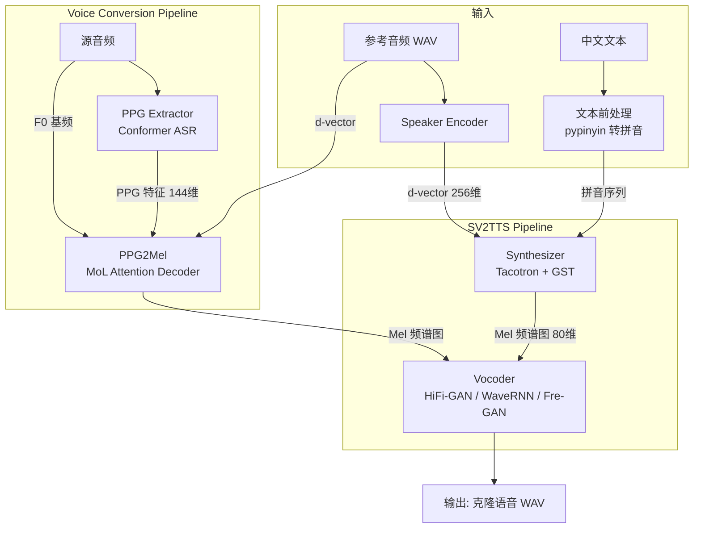
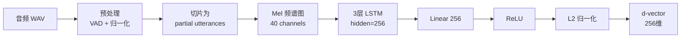
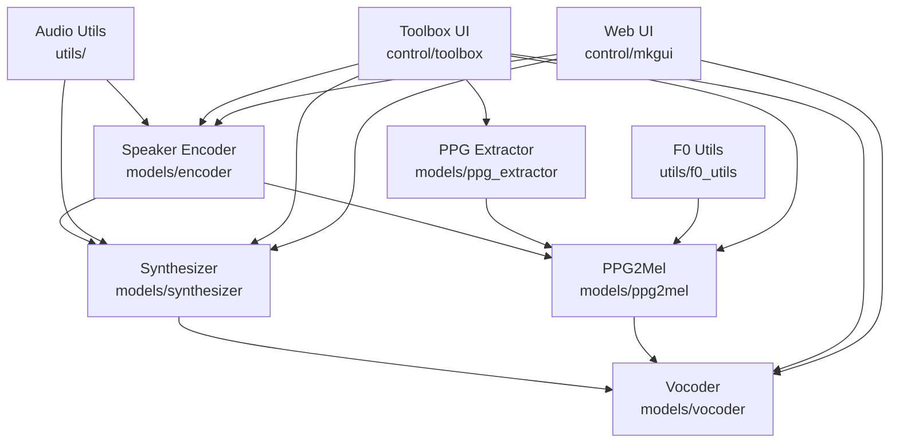
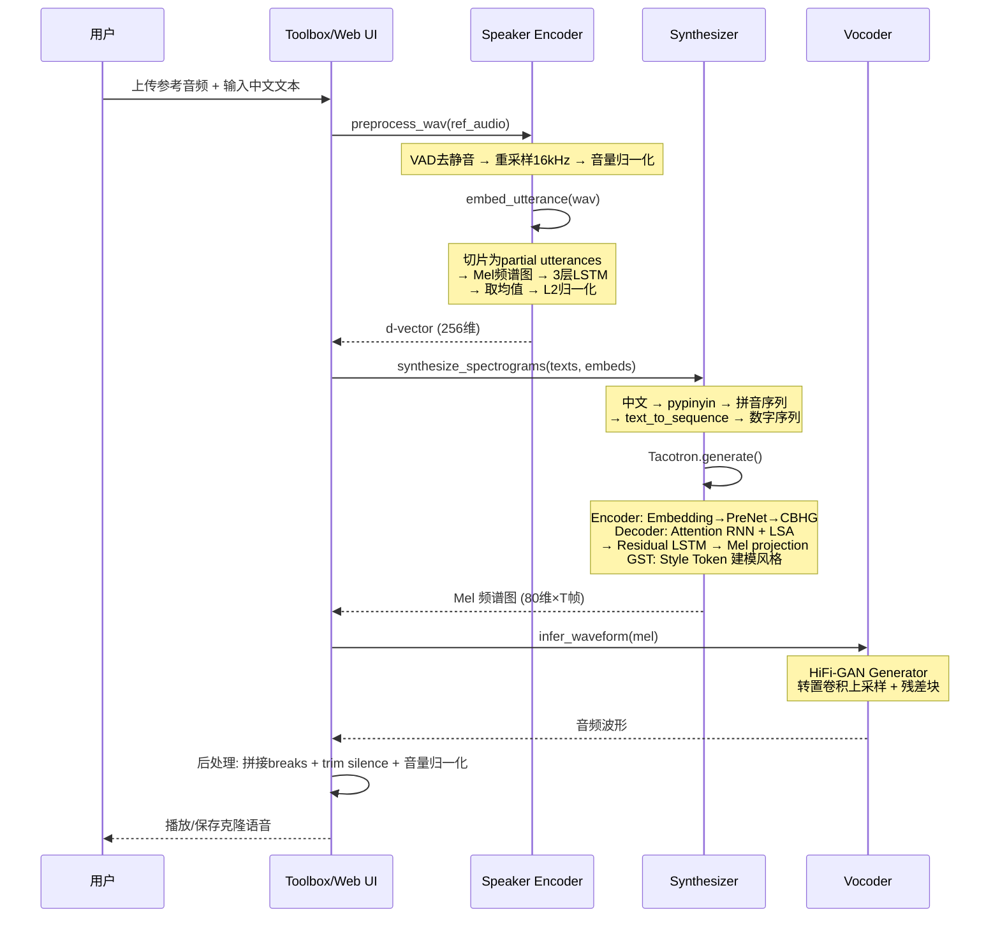
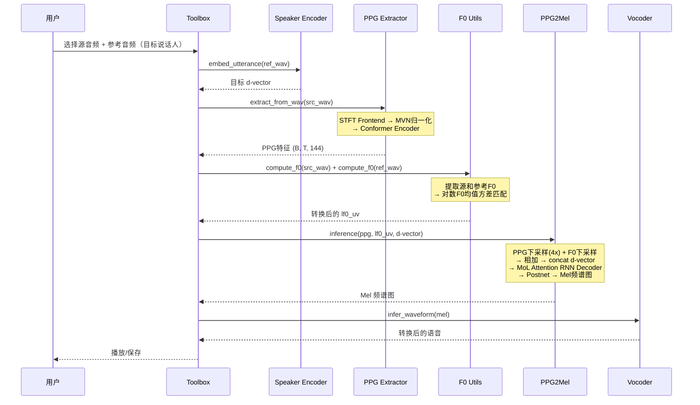

# MockingBird 源码学习笔记

> 仓库地址：[MockingBird](https://github.com/babysor/MockingBird)
> 学习日期：2026-03-22

---

> **以下为 AI 源码分析**
>
> ### 一句话概括
>
> MockingBird 是一个基于 SV2TTS 框架的中文实时语音克隆系统，通过 Encoder-Synthesizer-Vocoder 三阶段 pipeline 实现 few-shot 语音克隆。
>
> ### 要点速览
>
> | 核心模块 | 职责 | 关键文件 |
> |---------|------|---------|
> | Speaker Encoder | 从参考音频中提取说话人嵌入向量 (d-vector) | `models/encoder/model.py`, `models/encoder/inference.py` |
> | Synthesizer (Tacotron) | 将文本 + 说话人嵌入转换为 Mel 频谱图 | `models/synthesizer/models/tacotron.py`, `models/synthesizer/inference.py` |
> | Vocoder (HiFi-GAN/WaveRNN/Fre-GAN) | 将 Mel 频谱图转换为音频波形 | `models/vocoder/hifigan/`, `models/vocoder/wavernn/`, `models/vocoder/fregan/` |
> | PPG Extractor | 提取语音的 PPG (Phonetic PosteriorGram) 特征 | `models/ppg_extractor/__init__.py` |
> | PPG2Mel Converter | 基于 PPG 的语音转换 (Voice Conversion) | `models/ppg2mel/__init__.py`, `models/ppg2mel/rnn_decoder_mol.py` |
> | Toolbox UI | PyQt5 桌面交互界面 | `control/toolbox/__init__.py`, `control/toolbox/ui.py` |
> | Web UI | Streamlit Web 交互界面 | `control/mkgui/app.py`, `web.py` |

---

## 项目简介

MockingBird 是一个基于 [Real-Time-Voice-Cloning](https://github.com/CorentinJ/Real-Time-Voice-Cloning) 的中文语音克隆项目。原项目仅支持英文，MockingBird 在其基础上扩展了中文支持，集成了多种中文语音数据集（aidatatang_200zh、magicdata、aishell3、data_aishell 等），并实现了基于 SV2TTS (Speaker Verification to Text-To-Speech) 论文的三阶段语音克隆 pipeline。用户只需提供一小段参考音频，系统即可用该说话人的声音合成任意中文文本。此外还支持基于 PPG 的 Voice Conversion 模式，可以将一段语音转换为目标说话人的声音。

## 技术栈

| 类别 | 技术 |
|------|------|
| 语言 | Python 3.7+ |
| 框架 | PyTorch, Streamlit, Flask, FastAPI |
| 构建工具 | Docker, Dockerfile, docker-compose |
| 依赖管理 | pip (requirements.txt), conda (env.yml) |
| 测试框架 | 无专用测试框架（依赖人工验证） |

## 目录结构

```
MockingBird/
├── models/                          # 核心模型代码
│   ├── encoder/                     # Speaker Encoder（说话人编码器）
│   │   ├── model.py                 #   SpeakerEncoder 网络定义 (3层LSTM + Linear)
│   │   ├── inference.py             #   推理接口：embed_utterance()
│   │   ├── audio.py                 #   音频预处理 (VAD, 重采样, 归一化)
│   │   ├── train.py                 #   编码器训练逻辑
│   │   ├── params_model.py          #   模型超参 (hidden_size=256, embedding_size=256)
│   │   └── params_data.py           #   数据超参 (sample_rate=16000, mel_n_channels=40)
│   ├── synthesizer/                 # 语音合成器
│   │   ├── models/tacotron.py       #   Tacotron 模型 (Encoder-Decoder + Attention + GST)
│   │   ├── inference.py             #   Synthesizer 推理类
│   │   ├── hparams.py               #   合成器超参数 (80 mels, sample_rate=16000)
│   │   ├── train.py                 #   Tacotron 训练
│   │   ├── train_vits.py            #   VITS 训练
│   │   ├── preprocess.py            #   数据预处理
│   │   └── utils/                   #   文本符号表、文本处理工具
│   ├── vocoder/                     # 声码器
│   │   ├── hifigan/                 #   HiFi-GAN 声码器
│   │   │   ├── models.py            #     Generator (转置卷积 + 残差块)
│   │   │   └── inference.py         #     推理接口：infer_waveform()
│   │   ├── wavernn/                 #   WaveRNN 声码器
│   │   └── fregan/                  #   Fre-GAN 声码器
│   ├── ppg_extractor/               # PPG 特征提取器 (Conformer-based ASR encoder)
│   │   └── __init__.py              #   PPGModel: Frontend → Normalizer → ConformerEncoder
│   └── ppg2mel/                     # PPG → Mel 转换器 (Voice Conversion)
│       ├── __init__.py              #   MelDecoderMOLv2 模型定义
│       └── rnn_decoder_mol.py       #   MoL Attention RNN Decoder
├── control/                         # UI 控制层
│   ├── toolbox/                     #   PyQt5 桌面 Toolbox
│   │   ├── __init__.py              #     Toolbox 主类（事件绑定、流程编排）
│   │   └── ui.py                    #     UI 布局与控件
│   ├── mkgui/                       #   Streamlit Web 界面
│   │   ├── app.py                   #     Web 端合成入口
│   │   └── base/ui/streamlit_ui.py  #     Streamlit UI 渲染
│   └── cli/                         #   命令行训练入口
│       ├── encoder_train.py         #     Encoder 训练 CLI
│       ├── synthesizer_train.py     #     Synthesizer 训练 CLI
│       └── vocoder_train.py         #     Vocoder 训练 CLI
├── utils/                           # 通用工具
│   ├── f0_utils.py                  #   F0 基频提取与转换
│   ├── audio_utils.py               #   音频工具函数
│   └── logmmse.py                   #   LogMMSE 降噪算法
├── demo_toolbox.py                  # PyQt5 桌面 Toolbox 启动入口
├── web.py                           # Streamlit Web UI 启动入口
├── gen_voice.py                     # 命令行语音生成
├── run.py                           # PPG-based Voice Conversion 入口
├── pre.py                           # 数据预处理入口
└── train.py                         # 训练入口 (synth/vits)
```

## 架构设计

### 整体架构

MockingBird 采用经典的 **SV2TTS 三阶段 pipeline** 架构。整个系统由三个独立训练的神经网络模型串联而成，形成从「参考音频 + 文本」到「克隆语音」的完整链路。此外还支持基于 PPG 的 Voice Conversion 模式，绕过文本合成阶段，直接将源音频的声学特征映射到目标说话人。



核心设计思想是 **解耦说话人身份与语音内容**：
- **Speaker Encoder** 负责捕获「谁在说话」的声纹特征（d-vector）
- **Synthesizer** 负责「说什么」，将文本内容映射为声学特征
- **Vocoder** 负责将声学特征还原为高质量波形

这种解耦使得只需重新训练 Synthesizer 即可适配中文，而 Encoder 和 Vocoder 的预训练模型可以复用。

### 核心模块

#### 1. Speaker Encoder

**职责**：将任意长度的语音片段编码为固定维度的说话人嵌入向量 (d-vector)，用于后续合成时指定目标说话人。

**核心文件**：
- `models/encoder/model.py` — `SpeakerEncoder` 类
- `models/encoder/inference.py` — 推理 API

**关键实现**：
- 网络结构：3 层 LSTM (hidden_size=256) + Linear (256→256) + ReLU + L2 归一化
- 训练采用 GE2E (Generalized End-to-End) Loss，通过 cosine similarity matrix 优化说话人区分度
- 推理时将长音频切片为 partial utterances（每片 1600ms，50% overlap），分别编码后取平均，再 L2 归一化得到最终 d-vector
- 音频预处理包含 VAD (Voice Activity Detection) 去静音、重采样至 16kHz、音量归一化



#### 2. Synthesizer (Tacotron)

**职责**：接收文本拼音序列和说话人 d-vector，生成对应的 Mel 频谱图。

**核心文件**：
- `models/synthesizer/models/tacotron.py` — Tacotron 模型（Encoder + Decoder + Attention + GST）
- `models/synthesizer/inference.py` — `Synthesizer` 推理类
- `models/synthesizer/hparams.py` — 超参数配置

**关键实现**：
- **Encoder**：Embedding → PreNet(2层FC) → CBHG(Conv1DBank + Highway + Bidirectional GRU)
- **Decoder**：PreNet → GRUCell(Attention RNN) → LSA(Location-Sensitive Attention) → 2层 Residual LSTMCell → Linear Projection → Mel output
- **GST (Global Style Token)**：引入 Style Token Layer 建模语音风格（语速、情感等），用参考音频的 Mel 频谱经 Reference Encoder 得到 style embedding
- **中文适配**：使用 `pypinyin` 将中文转为带声调拼音（TONE3 格式），然后经 `text_to_sequence` 映射为数字序列
- 训练采用 Progressive Training Schedule，逐步降低 learning rate

#### 3. Vocoder (HiFi-GAN)

**职责**：将 Mel 频谱图转换为高质量时域音频波形。

**核心文件**：
- `models/vocoder/hifigan/models.py` — `Generator` 网络
- `models/vocoder/hifigan/inference.py` — 推理接口 `infer_waveform()`

**关键实现**：
- **Generator** 采用转置卷积逐步上采样 + 多尺度残差块（Multi-Receptive Field Fusion）
- 残差块 `ResBlock1` 使用 dilation=(1,3,5) 的 Conv1d 扩大感受野
- 推理时移除 weight norm 加速
- 同时支持 WaveRNN（自回归、质量高但慢）和 Fre-GAN（频域一致性优化）作为备选

#### 4. PPG Extractor

**职责**：从源音频中提取与说话人无关的语音学后验特征 (PPG)，用于 Voice Conversion。

**核心文件**：
- `models/ppg_extractor/__init__.py` — `PPGModel` 类

**关键实现**：
- 基于 Conformer 架构的 ASR Encoder，输出 144 维 bottleneck 特征
- Pipeline: STFT Frontend → Utterance MVN 归一化 → Conformer Encoder
- PPG 特征天然具有说话人无关性（ASR 任务训练的副产品），适合作为 VC 的内容表征

#### 5. PPG2Mel Converter (MelDecoderMOLv2)

**职责**：将 PPG 特征 + F0 基频 + 目标说话人 d-vector 融合后解码为 Mel 频谱图。

**核心文件**：
- `models/ppg2mel/__init__.py` — `MelDecoderMOLv2` 模型
- `models/ppg2mel/rnn_decoder_mol.py` — MoL Attention Decoder

**关键实现**：
- PPG 通过 1D 卷积下采样 (encoder_downsample_rates=[2,2]，共 4x 下采样)
- F0 基频信息通过独立的卷积通道处理后与 PPG 相加，保留韵律信息
- 说话人 d-vector 经 L2 归一化后 expand 到序列长度，concat 后经 Linear 降维
- Decoder 采用 Mixture of Logistic (MoL) Attention + LSTM RNN，输出 Mel 帧
- 后处理使用 CNN Postnet 细化 Mel 频谱

### 模块依赖关系



## 核心流程

### 流程一：文本到语音合成 (TTS)

这是 MockingBird 最核心的功能——给定一段参考音频和任意中文文本，生成带有参考说话人音色的语音。



**关键逻辑说明**：

1. **参考音频编码**：`encoder.preprocess_wav()` 对输入音频进行 VAD 去静音 + 16kHz 重采样 + 音量归一化。然后 `embed_utterance()` 将音频切成 1600ms 的片段（50% overlap），分别转为 40 通道 Mel 频谱后送入 3 层 LSTM，取最后隐层输出经 Linear+ReLU+L2norm 得到 d-vector。

2. **文本合成**：`Synthesizer.synthesize_spectrograms()` 首先用 `pypinyin` 将中文转为带声调拼音（如"你好"→"ni3 hao3"），再经 `text_to_sequence` 映射为整数序列。Tacotron 模型的 Encoder 通过 Embedding → PreNet → CBHG 编码文本，Decoder 通过 Location-Sensitive Attention 对齐文本与 Mel 帧，自回归生成 80 维 Mel 频谱图。

3. **波形生成**：HiFi-GAN 的 Generator 通过多级转置卷积将 Mel 频谱上采样至音频采样率，多尺度残差块保证频域细节。

### 流程二：语音转换 (Voice Conversion)

基于 PPG 的语音转换模式：直接将一段源音频的声音转换为目标说话人，无需文本输入。



**关键逻辑说明**：

1. **PPG 提取**：PPG Extractor（基于 Conformer 的 ASR Encoder）从源音频提取与说话人无关的语音学特征。这些特征保留了语音内容信息（音素序列），但去除了说话人特有的声学特征。

2. **F0 转换**：通过 `compute_f0()` 提取源和参考音频的基频，计算参考说话人的 F0 均值和方差，然后将源音频的 F0 进行线性变换匹配目标说话人的音高范围，保持原始韵律轮廓。

3. **PPG2Mel 融合**：`MelDecoderMOLv2` 将 PPG（内容信息）、F0（韵律信息）和 d-vector（说话人身份）三路特征融合。PPG 和 F0 分别经 1D 卷积下采样后相加，再与 d-vector concat 后经线性投影降维，送入 MoL Attention RNN Decoder 生成 Mel 频谱，最后经 CNN Postnet 细化。

## 关键设计亮点

### 1. GE2E Loss 实现说话人验证到语音合成的迁移学习

**解决的问题**：如何从少量参考音频中高效提取说话人声纹特征？

**实现方式**：Speaker Encoder (`models/encoder/model.py`) 采用 GE2E (Generalized End-to-End) Loss 训练。训练时构建 similarity matrix（每个 utterance embedding 与所有 speaker centroid 的余弦相似度），使同一说话人的 utterance 靠近对应 centroid，远离其他 centroid。采用 exclusive centroid（计算 centroid 时排除当前 utterance）避免训练退化。

**设计理由**：GE2E Loss 直接在 embedding 空间上优化区分度，不依赖具体说话人标签，使模型能泛化到训练集未见过的说话人。同时 cosine similarity + scaling (weight/bias) 的设计使梯度稳定。

### 2. Partial Utterance 策略处理变长音频

**解决的问题**：推理时参考音频长度不固定，如何稳定生成高质量 d-vector？

**实现方式**：`encoder/inference.py` 中的 `embed_utterance()` 将任意长度音频切成固定长度 (1600ms) 的 partial utterances，overlap 50%。分别编码后取均值 + L2 归一化。`compute_partial_slices()` 还处理了末尾不足长度的 padding 策略。

**设计理由**：LSTM 对输入长度敏感，固定长度输入保证了 embedding 质量稳定性。均值聚合 + L2 归一化使最终 d-vector 不受音频长度影响，且多个 partial 的平均能降低噪声影响。

### 3. 中文拼音前处理适配 Tacotron

**解决的问题**：原始 Tacotron 仅支持英文字符，中文字符集庞大且缺乏直接的音素映射。

**实现方式**：`models/synthesizer/inference.py` 中合成前先调用 `pypinyin.lazy_pinyin()` 将中文转为带声调的拼音（Style.TONE3, neutral_tone_with_five=True），如"你好"→"ni3 hao3"。然后通过 `text_to_sequence()` 将拼音字符映射为整数序列送入 Embedding。

**设计理由**：拼音是有限字符集（26 个字母 + 5 个声调标记），直接复用英文 Tacotron 的 Character Embedding 架构，避免了大规模中文字表或额外的 G2P（Grapheme-to-Phoneme）模型。声调信息通过数字后缀保留，确保合成的声调准确性。

### 4. 多 Vocoder 可插拔设计

**解决的问题**：不同场景对合成速度和音质有不同需求。

**实现方式**：`control/toolbox/__init__.py` 中的 `init_vocoder()` 方法根据模型文件名自动选择对应的 Vocoder 实现——包含 "hifigan" 用 `gan_vocoder`，包含 "fregan" 用 `fgan_vocoder`，否则默认 `rnn_vocoder`。三种 Vocoder 提供统一的 `load_model()` 和 `infer_waveform()` 接口。

**设计理由**：统一接口 + 名称约定的策略使得切换 Vocoder 无需修改上层代码。HiFi-GAN 速度快适合实时场景，WaveRNN 音质更细腻适合离线高质量合成，Fre-GAN 在频域一致性上有优势。

### 5. PPG + F0 + d-vector 三路融合的 Voice Conversion

**解决的问题**：传统 TTS-based 语音克隆需要文本输入，且中间步骤多，容易累积误差。Voice Conversion 可以跳过文本阶段直接转换。

**实现方式**：`models/ppg2mel/__init__.py` 中的 `MelDecoderMOLv2` 将三路信息解耦后融合：PPG（内容）经 1D Conv 下采样得到内容表征，F0（韵律）经独立卷积通道处理后与 PPG 相加，d-vector（说话人身份）经 L2 归一化后 expand + concat + Linear 降维。Decoder 使用 MoL (Mixture of Logistic) Attention 替代传统 soft attention，避免了 attention 退化问题。

**设计理由**：PPG 天然去除了说话人信息（ASR 任务的副产品），F0 携带韵律但需要做说话人匹配转换，d-vector 注入目标说话人身份。三路解耦使得每种信息的处理可以独立优化，MoL Attention 的单调性保证了稳定的时序对齐。
