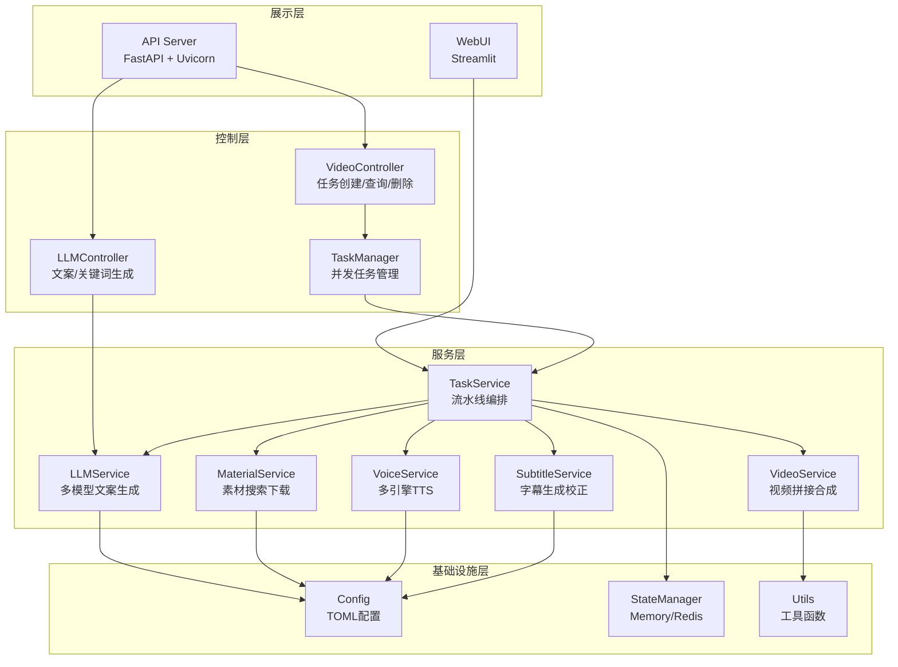
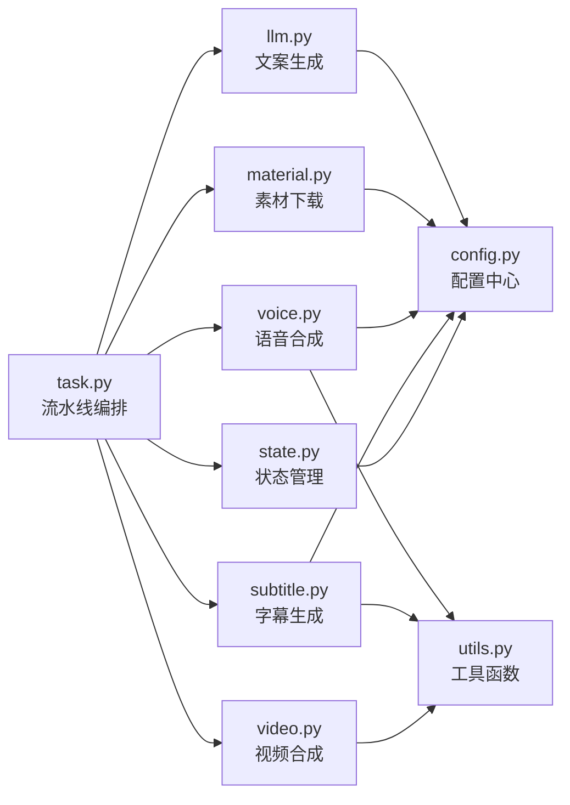
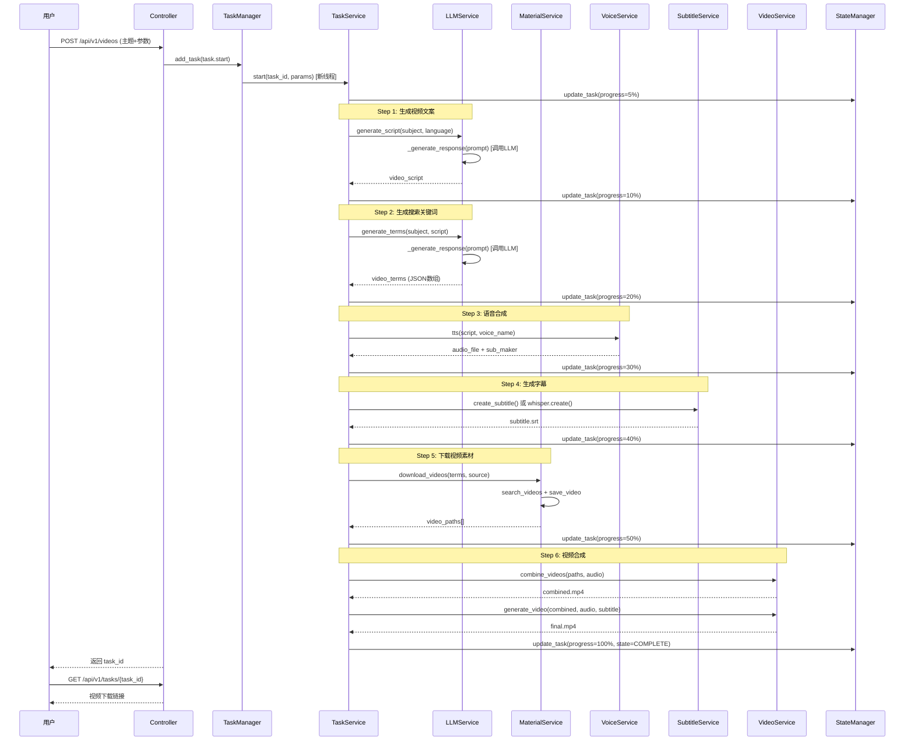
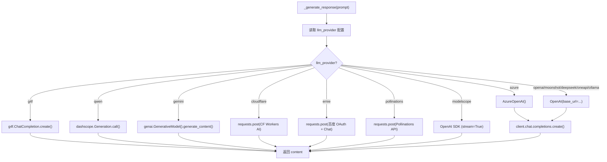

# MoneyPrinterTurbo 源码学习笔记

> 仓库地址：[MoneyPrinterTurbo](https://github.com/harry0703/MoneyPrinterTurbo)
> 学习日期：2026-03-29

---

> **以下为 AI 源码分析**
>
> ### 一句话概括
>
> 一个全自动短视频生成工具，只需输入主题或关键词，通过 LLM 生成文案、自动获取素材、TTS 语音合成、字幕生成，最终用 MoviePy 合成高清短视频。
>
> ### 要点速览
>
> | 核心模块 | 职责 | 关键文件 |
> |---------|------|---------|
> | LLM 服务 | AI 生成视频文案和搜索关键词 | `app/services/llm.py` |
> | 素材服务 | 从 Pexels/Pixabay 搜索下载视频素材 | `app/services/material.py` |
> | 语音服务 | TTS 语音合成（Edge/Azure/SiliconFlow/Gemini） | `app/services/voice.py` |
> | 字幕服务 | 字幕生成与校正（Edge/Whisper） | `app/services/subtitle.py` |
> | 视频服务 | 视频拼接、字幕叠加、背景音乐混合 | `app/services/video.py` |
> | 任务编排 | 端到端流水线，串联所有步骤 | `app/services/task.py` |
> | API 控制器 | FastAPI RESTful 接口层 | `app/controllers/v1/video.py` |
> | WebUI | Streamlit 可视化操作界面 | `webui/Main.py` |

---

## 项目简介

MoneyPrinterTurbo 是一个开源的 AI 短视频自动生成工具。用户只需提供一个视频主题或关键词，系统就会全自动完成以下工作：调用 LLM 生成视频文案、提取搜索关键词从免费素材库下载高清视频素材、通过 TTS 引擎合成语音旁白、生成同步字幕、随机添加背景音乐，最终使用 MoviePy 将所有元素合成为一个高清短视频。项目同时提供 Web 界面和 RESTful API 两种使用方式，支持 Docker 一键部署，适合内容创作者快速批量生产短视频。

## 技术栈

| 类别 | 技术 |
|------|------|
| 语言 | Python 3.11 |
| 框架 | FastAPI（API 服务） + Streamlit（Web 界面） |
| 构建工具 | Docker / Docker Compose |
| 依赖管理 | pip / requirements.txt |
| 测试框架 | 内置 test 目录（手动测试脚本） |
| 视频处理 | MoviePy 2.1.2 + ImageMagick + FFmpeg |
| 语音合成 | edge_tts + Azure Speech SDK + SiliconFlow + Gemini TTS |
| 字幕识别 | faster-whisper（基于 Whisper large-v3） |
| LLM 接入 | OpenAI SDK（兼容 OpenAI/Moonshot/DeepSeek/Azure/Ollama/Gemini/Qwen 等 13+ 提供商） |
| 素材来源 | Pexels API / Pixabay API / 本地上传 |
| 状态管理 | 内存字典 / Redis（可选） |
| 配置管理 | TOML（config.toml） |

## 目录结构

```
MoneyPrinterTurbo/
├── main.py                     # API 服务入口，启动 uvicorn
├── config.example.toml         # 配置文件模板
├── requirements.txt            # Python 依赖
├── Dockerfile                  # Docker 镜像构建
├── docker-compose.yml          # Docker Compose 编排（webui + api 双服务）
├── webui/
│   ├── Main.py                 # Streamlit Web 界面主文件
│   ├── .streamlit/config.toml  # Streamlit 配置
│   └── i18n/                   # 国际化语言文件（zh/en/de/ru/pt/vi/tr）
├── app/
│   ├── asgi.py                 # FastAPI 应用初始化、中间件、静态文件挂载
│   ├── router.py               # API 路由注册（video + llm）
│   ├── config/
│   │   └── config.py           # TOML 配置加载与全局配置变量
│   ├── models/
│   │   ├── schema.py           # Pydantic 数据模型（VideoParams、请求/响应）
│   │   ├── const.py            # 常量定义（任务状态、文件类型、标点符号）
│   │   └── exception.py        # 自定义异常
│   ├── controllers/
│   │   ├── v1/
│   │   │   ├── base.py         # 路由工厂函数
│   │   │   ├── video.py        # 视频相关 API（创建/查询/删除任务、BGM/素材管理）
│   │   │   └── llm.py          # LLM 相关 API（生成文案/关键词）
│   │   └── manager/
│   │       ├── base_manager.py    # 任务管理器基类（并发控制 + 队列）
│   │       ├── memory_manager.py  # 内存队列实现
│   │       └── redis_manager.py   # Redis 队列实现
│   ├── services/
│   │   ├── task.py             # 核心：视频生成流水线编排
│   │   ├── llm.py              # LLM 服务：文案生成 + 关键词提取
│   │   ├── material.py         # 素材服务：搜索 + 下载视频
│   │   ├── voice.py            # 语音服务：多引擎 TTS
│   │   ├── subtitle.py         # 字幕服务：Whisper 识别 + 校正
│   │   ├── video.py            # 视频服务：裁剪/拼接/字幕叠加/合成
│   │   ├── state.py            # 状态管理：Memory/Redis 双实现
│   │   └── utils/
│   │       └── video_effects.py   # 视频转场效果（淡入/淡出/滑入/滑出）
│   └── utils/
│       └── utils.py            # 工具函数（路径、UUID、时间转换、JSON 序列化等）
├── resource/
│   ├── fonts/                  # 字幕字体文件
│   ├── songs/                  # 背景音乐文件
│   └── public/                 # 静态首页
└── test/                       # 测试文件
```

## 架构设计

### 整体架构

MoneyPrinterTurbo 采用 **分层架构 + Pipeline 模式**。系统分为展示层（WebUI / API）、控制层（Controllers）、服务层（Services）和基础设施层（Config / State / Utils），通过一条清晰的流水线将 LLM 文案生成、素材获取、语音合成、字幕生成、视频合成串联起来。

API 服务基于 FastAPI 构建，提供 RESTful 接口，任务以异步线程方式在后台执行；WebUI 基于 Streamlit 构建，直接调用服务层函数同步执行。两种入口共享同一套服务层代码。



### 核心模块

#### 1. 任务编排服务 (`app/services/task.py`)

**职责**：作为核心调度器，串联视频生成的 6 个步骤，管理任务状态和进度。

- **核心函数**：`start(task_id, params, stop_at)` — 流水线入口，按顺序执行各步骤
- **支持分步停止**：通过 `stop_at` 参数可在任意步骤停止（script/terms/audio/subtitle/materials/video）
- **进度追踪**：在每个步骤完成后通过 `state.update_task()` 更新进度（5% → 10% → 20% → 30% → 40% → 50% → 100%）
- **子函数**：`generate_script()` / `generate_terms()` / `generate_audio()` / `generate_subtitle()` / `get_video_materials()` / `generate_final_videos()`

#### 2. LLM 服务 (`app/services/llm.py`)

**职责**：调用大语言模型生成视频文案和搜索关键词。

- **多提供商适配**：统一接口 `_generate_response(prompt)` 内部通过 `llm_provider` 配置分发到 13 种 LLM 提供商
- **兼容策略**：大部分提供商通过 OpenAI SDK 的兼容接口接入（`base_url` 不同），特殊提供商（Qwen/Gemini/Cloudflare/Ernie/Pollinations）使用各自的原生 SDK
- **重试机制**：最多重试 5 次
- **Prompt 工程**：
  - `generate_script()`：角色提示词 "Video Script Generator"，指定段落数和语言
  - `generate_terms()`：角色提示词 "Video Search Terms Generator"，要求返回 JSON 数组格式的英文搜索词

#### 3. 素材服务 (`app/services/material.py`)

**职责**：根据搜索关键词从 Pexels/Pixabay 搜索并下载高清视频素材。

- **搜索函数**：`search_videos_pexels()` / `search_videos_pixabay()` — 按视频方向（横屏/竖屏）和分辨率精确匹配
- **下载函数**：`save_video()` — 使用 URL 哈希作为文件名避免重复下载，验证下载文件有效性
- **流量控制**：`download_videos()` — 按音频时长计算所需素材总时长，下载够了就停止
- **API Key 轮转**：`get_api_key()` — 支持多个 API Key 轮流使用，避免限流

#### 4. 语音服务 (`app/services/voice.py`)

**职责**：将文案文字转换为语音音频，同时生成 SubMaker 对象用于字幕同步。

- **四种 TTS 引擎**：
  - `azure_tts_v1()`：使用 edge_tts 库（免费，默认方案）
  - `azure_tts_v2()`：使用 Azure Speech SDK（付费，更自然）
  - `siliconflow_tts()`：使用硅基流动 API
  - `gemini_tts()`：使用 Google Gemini TTS
- **路由分发**：`tts()` 函数根据 voice_name 前缀自动选择引擎
- **字幕数据**：每种引擎都返回 `SubMaker` 对象，包含词级别的时间偏移信息
- **大量声音**：内置 Azure 声音列表（500+ 种语言声音），支持实时筛选

#### 5. 字幕服务 (`app/services/subtitle.py`)

**职责**：提供两种字幕生成方案，以及字幕校正能力。

- **Edge 模式**：直接使用 TTS 过程中的 SubMaker 时间戳数据生成字幕（快，但可能不准确）
- **Whisper 模式**：使用 faster-whisper（large-v3 模型）对音频做语音识别生成字幕（慢，更准确）
- **字幕校正**：`correct()` 函数使用 Levenshtein 距离将 Whisper 识别结果与原始文案对齐，相似度 > 0.8 时合并修正

#### 6. 视频服务 (`app/services/video.py`)

**职责**：处理视频的裁剪、拼接、字幕渲染和最终合成。

- **视频拼接** `combine_videos()`：
  - 将下载的视频按 `max_clip_duration` 切割成片段
  - 支持随机/顺序两种拼接模式
  - 自动调整分辨率（等比缩放 + 黑边填充）
  - 支持转场效果（淡入/淡出/滑入/滑出/随机）
  - 渐进式合并策略避免内存溢出
  - 素材不足时循环使用
- **最终合成** `generate_video()`：
  - 叠加字幕层（支持自定义字体/颜色/位置/描边）
  - 混合背景音乐（随机选择/指定文件，音量可调）
  - 合并旁白音频 + BGM 为复合音轨
- **资源管理**：`close_clip()` 函数递归关闭 MoviePy 剪辑资源，防止文件句柄泄漏

#### 7. 状态管理 (`app/services/state.py`)

**职责**：管理视频生成任务的状态和进度信息。

- **策略模式**：`BaseState` 抽象基类 + `MemoryState`（内存字典）/ `RedisState`（Redis Hash）两种实现
- **全局单例**：根据 `enable_redis` 配置自动选择实现
- **接口方法**：`update_task()` / `get_task()` / `get_all_tasks()` / `delete_task()`

#### 8. 任务管理器 (`app/controllers/manager/`)

**职责**：控制视频生成任务的并发数量。

- **基类** `TaskManager`：使用 `threading.Lock` + 线程池实现有限并发（默认 max 5）
- **队列溢出**：超出并发数的任务放入队列等待，任务完成后自动拉取下一个
- **双实现**：`InMemoryTaskManager`（`queue.Queue`）/ `RedisTaskManager`（Redis 列表）

### 模块依赖关系



## 核心流程

### 流程一：完整视频生成流程

这是项目最核心的端到端流程，从用户输入主题到输出最终视频。入口为 `task.start()` 函数。



**关键逻辑说明**：

1. **异步执行**：API 调用后立即返回 `task_id`，视频生成在后台线程执行，用户通过轮询查询进度
2. **分步停止**：`stop_at` 参数允许在任意步骤停止，用于调试或只获取中间结果（如只生成文案）
3. **错误处理**：任何步骤失败都会将任务状态设为 `TASK_STATE_FAILED`，记录错误日志
4. **批量生成**：`video_count > 1` 时，使用相同的音频和字幕，随机组合素材生成多个不同版本

### 流程二：LLM 多提供商适配流程

该流程展示了 `_generate_response()` 如何统一适配 13+ 种 LLM 提供商。



**关键设计**：

1. **OpenAI SDK 兼容层**：大部分提供商（OpenAI/Moonshot/DeepSeek/OneAPI/Ollama）都兼容 OpenAI API 格式，只需修改 `base_url` 和 `api_key`
2. **特殊提供商**：Qwen 用 dashscope SDK、Gemini 用 google.generativeai、Cloudflare/Ernie/Pollinations 用原生 HTTP 请求
3. **统一返回**：所有提供商最终返回纯文本字符串，调用方无需关心底层差异

## 关键设计亮点

### 1. Pipeline 模式的流水线编排

**解决问题**：视频生成涉及 6 个串行步骤，每步都可能失败，需要统一管理进度和错误。

**实现方式**：`task.py` 中的 `start()` 函数是一个线性流水线，每个步骤由独立函数实现。通过 `stop_at` 参数可在任意步骤停止返回中间结果，这使得同一套代码既支持完整的视频生成，也支持单独生成文案、关键词、音频等。

**设计优势**：步骤解耦清晰，每个步骤可独立测试和复用；进度追踪天然融入流水线节点；`stop_at` 参数设计让 API 极其灵活。

### 2. LLM 提供商统一适配层

**解决问题**：需要支持 13+ 种 LLM 提供商，且随时可能新增。

**实现方式**：`llm.py` 的 `_generate_response()` 函数利用大部分提供商兼容 OpenAI API 格式的特点，通过 `base_url` + `api_key` + `model_name` 三元组统一适配。对于不兼容的提供商（Qwen/Gemini/Ernie 等），在同一函数内使用条件分支处理。

**设计优势**：新增 OpenAI 兼容提供商只需在 `config.toml` 添加三个配置项；调用方只需调用 `generate_script()` / `generate_terms()`，完全不感知底层差异。

### 3. 双入口共享服务层

**解决问题**：同时提供 Web 界面和 API 接口两种使用方式，但不想维护两套逻辑。

**实现方式**：`webui/Main.py`（Streamlit）和 `app/controllers/v1/video.py`（FastAPI）都直接调用 `app/services/task.py` 的 `start()` 函数。服务层完全独立于展示层，通过 `docker-compose.yml` 将 WebUI（端口 8501）和 API（端口 8080）作为两个独立容器运行。

**设计优势**：代码零重复，任何业务逻辑修改只需改一处；两种入口可以独立部署和扩展。

### 4. 渐进式视频合并策略

**解决问题**：大量视频片段一次性加载到内存会导致 OOM。

**实现方式**：`video.py` 的 `combine_videos()` 函数采用渐进式合并策略。先将每个素材裁剪为独立的临时文件（`temp-clip-*.mp4`），然后逐个合并：每次只加载当前合并结果和下一个片段两个文件，合并后立即释放资源并删除旧文件。同时，`close_clip()` 函数递归关闭 MoviePy 剪辑的所有子资源（reader/audio/mask/子 clips）并触发 GC。

**设计优势**：内存占用恒定，不随素材数量线性增长；即使在 4GB 内存的低配机器上也能处理长视频。

### 5. 字幕双引擎 + 自动校正机制

**解决问题**：TTS 生成的时间戳字幕可能对不齐，而 Whisper 语音识别可能有错字。

**实现方式**：默认使用 Edge 模式（直接利用 TTS 过程中的 `SubMaker` 时间戳数据），如果字幕文件生成失败则自动降级到 Whisper 模式。Whisper 模式在生成字幕后，还会调用 `correct()` 函数将识别结果与原始文案对齐——使用 Levenshtein 距离计算相似度，尝试合并被错误拆分的句子，然后用原始文案文本替换识别文本（保留 Whisper 的时间戳）。

**设计优势**：Edge 模式快速且免费（不需要额外模型），Whisper 作为 fallback 保证质量；校正机制巧妙利用了"原始文案一定是正确的"这一先验知识。
