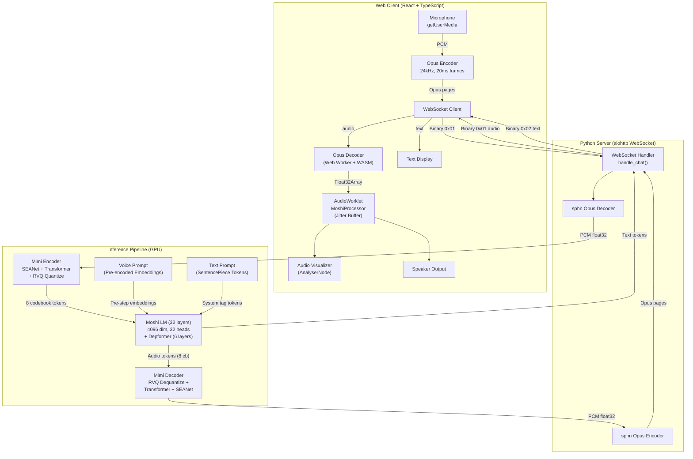
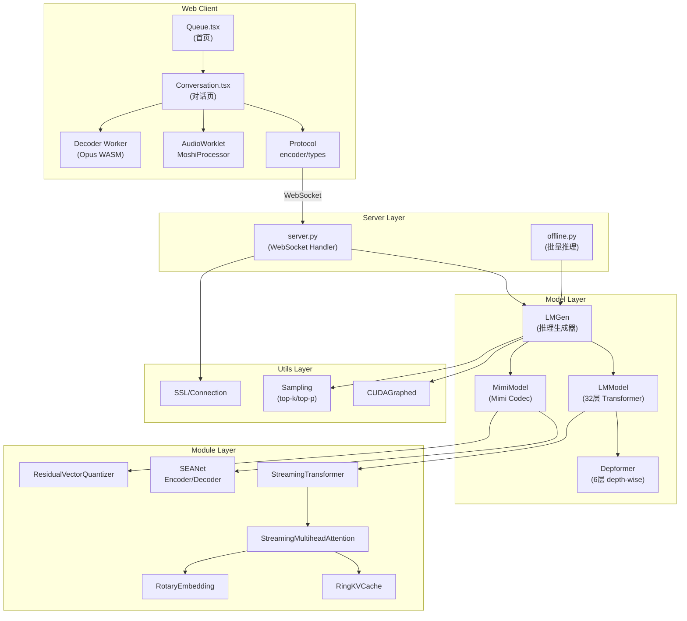
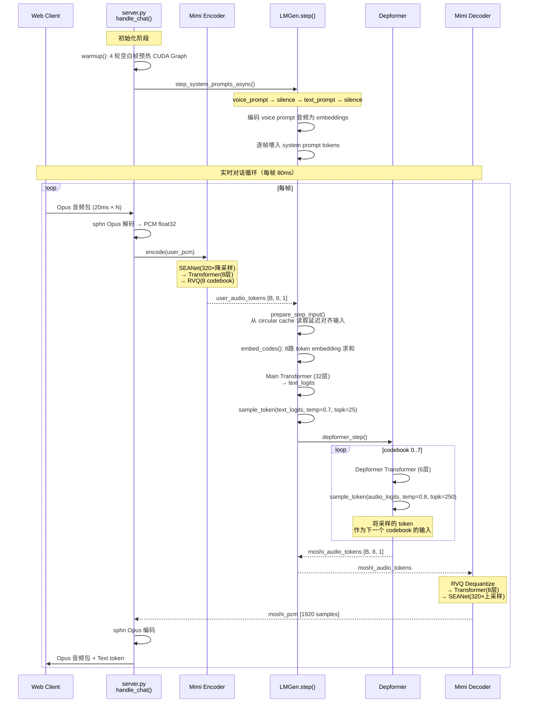
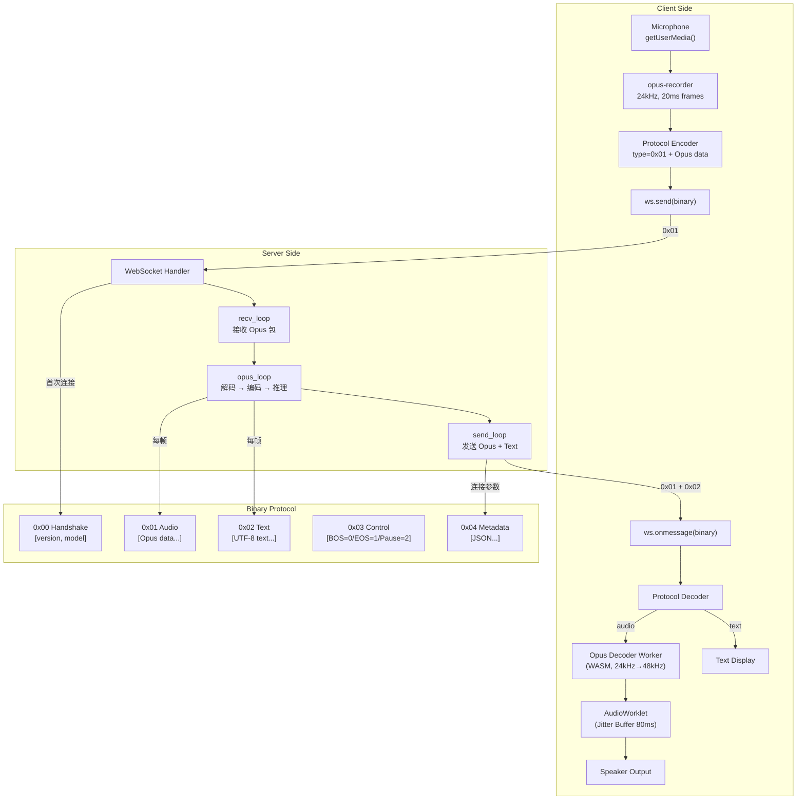

# PersonaPlex 源码学习笔记

> 仓库地址：[PersonaPlex](https://github.com/NVIDIA/personaplex)
> 学习日期：2026/04/15

---

> **以下为 AI 源码分析**
>
> ### 一句话概括
>
> NVIDIA 开发的实时全双工语音对话模型，基于 Moshi 架构微调，支持通过文本角色提示词和音频 voice prompt 精确控制对话 persona（人格特征和声音）。
>
> ### 要点速览
>
> | 核心模块 | 职责 | 关键文件 |
> |----------|------|----------|
> | Moshi LM | 32 层 Transformer 语言模型，联合生成文本 token 和 8 路音频 codebook token | `moshi/models/lm.py` |
> | Mimi Codec | SEANet + RVQ 音频编解码器，24kHz 音频 ↔ 离散 token（8 codebook × 2048 码本） | `moshi/models/compression.py` |
> | Streaming Server | WebSocket 全双工服务，实时接收 Opus 音频并流式返回生成音频+文本 | `moshi/server.py` |
> | Depformer | 6 层 depth-wise Transformer，逐 codebook 自回归采样音频 token | `moshi/models/lm.py:LMModel.forward_depformer()` |
> | Streaming Infra | 流式推理基础设施：RingKVCache、CUDA Graph、StreamingModule | `moshi/modules/streaming.py`, `moshi/utils/compile.py` |
> | Web Client | React + TypeScript 前端，Opus 编解码、AudioWorklet 播放、频谱可视化 | `client/src/` |

---

## 项目简介

PersonaPlex 是 NVIDIA 发布的实时全双工语音对话系统（论文 arXiv:2602.06053），解决了现有语音对话模型缺乏**角色和声音可控性**的问题。

核心价值：
1. **Persona 控制**：通过文本提示词定义角色人格（如"你是一个友善的老师"），通过音频 voice prompt 定义输出声音特征
2. **全双工对话**：真正的双向实时通信，用户和模型可以同时说话和听，无需轮流等待
3. **流式推理**：基于 Streaming Transformer + CUDA Graph + RingKVCache，实现逐帧（12.5fps）实时音频生成
4. **端到端架构**：直接从音频到音频，无需中间的 ASR/TTS 管道，保留韵律和情感信息

项目基于 Kyutai Lab 的 Moshi 架构和权重，通过微调添加 persona 控制能力。提供 16 种预训练声音（8 自然音 + 8 变体音）。

## 技术栈

| 类别 | 技术 |
|------|------|
| 语言 | Python 3.10+（后端）、TypeScript 5.2（前端） |
| 深度学习框架 | PyTorch >= 2.2.0, < 2.5 |
| 模型架构 | Streaming Transformer（32 层, 4096 维）+ Depformer（6 层）+ SEANet + RVQ |
| 音频编解码 | Mimi Codec（SEANet encoder/decoder + 8-codebook RVQ）、Opus（WebSocket 传输） |
| 推理优化 | CUDA Graphs、RingKVCache、torch.compile、混合精度 |
| 服务端 | aiohttp（async WebSocket 服务器）、sphn（Opus 编解码） |
| 前端框架 | React 18.3 + Vite 5.2 |
| 前端音频 | AudioWorklet（播放）、opus-recorder（录音）、Web Worker（Opus 解码） |
| UI | TailwindCSS 3.4 + DaisyUI 4.12 |
| 模型托管 | HuggingFace Hub（nvidia/personaplex-7b-v1） |
| 容器化 | Docker（CUDA 12.4.1 base）+ docker-compose |
| Token 化 | SentencePiece（32K 词表） |

## 目录结构

```
personaplex/
├── README.md                          # 项目文档（架构、安装、使用）
├── Dockerfile                         # CUDA 12.4 + Python 3.12 容器
├── docker-compose.yaml                # GPU 部署编排
├── moshi/                             # Python 后端（核心推理引擎）
│   ├── pyproject.toml                 #   项目元数据与依赖声明
│   ├── requirements.txt               #   锁定依赖版本
│   ├── setup.cfg                      #   Flake8 代码质量配置
│   └── moshi/                         #   Python 包
│       ├── server.py                  #     WebSocket 全双工服务器（入口）
│       ├── offline.py                 #     离线批量推理脚本
│       ├── client_utils.py            #     终端 UI 和彩色日志工具
│       ├── models/                    #     模型定义
│       │   ├── lm.py                  #       Moshi LM + Depformer + LMGen（1178 行，最大文件）
│       │   ├── compression.py         #       Mimi 音频编解码器
│       │   └── loaders.py             #       模型加载、权重修补、CPU offload
│       ├── modules/                   #     底层模块
│       │   ├── transformer.py         #       StreamingTransformer + MHA + RingKVCache
│       │   ├── streaming.py           #       StreamingModule 基类 + 流式卷积
│       │   ├── seanet.py              #       SEANet Encoder/Decoder（残差卷积网络）
│       │   ├── conv.py                #       流式 Conv1d / ConvTranspose1d
│       │   ├── rope.py                #       Rotary Positional Embedding
│       │   ├── gating.py              #       GLU 风格门控机制
│       │   └── resample.py            #       帧率转换（下采样/上采样）
│       ├── quantization/              #     向量量化
│       │   ├── core_vq.py             #       EuclideanCodebook + ResidualVQ
│       │   ├── vq.py                  #       ResidualVectorQuantizer（高层 API）
│       │   └── base.py                #       BaseQuantizer 抽象基类
│       └── utils/                     #     工具库
│           ├── sampling.py            #       Top-K / Top-P / 多项式采样
│           ├── compile.py             #       CUDAGraphed 封装 + torch.compile
│           ├── connection.py          #       SSL 证书生成 + mkcert
│           ├── autocast.py            #       混合精度自动转换
│           └── logging.py             #       彩色日志
└── client/                            # React TypeScript 前端
    ├── package.json                   #   NPM 依赖
    ├── vite.config.ts                 #   Vite + HTTPS 开发服务器
    └── src/
        ├── app.tsx                    #   路由入口
        ├── audio-processor.ts         #   AudioWorklet 音频播放处理器
        ├── env.ts                     #   环境变量类型定义
        ├── decoder/
        │   └── decoderWorker.ts       #   Opus 解码 Web Worker（预热 + WASM）
        ├── protocol/
        │   ├── types.ts               #   WebSocket 消息类型定义
        │   └── encoder.ts             #   二进制消息编解码器
        ├── pages/
        │   ├── Queue/Queue.tsx        #   首页：角色提示词 + 声音选择 + 连接
        │   └── Conversation/
        │       ├── Conversation.tsx   #   对话页：WebSocket + 立体声录制
        │       └── hooks/             #   自定义 Hooks（音频/文本/参数/Socket）
        └── components/                #   UI 组件（可视化器/控件/按钮）
```

## 架构设计

### 整体架构

PersonaPlex 采用**端到端全双工流式架构**，核心是 Moshi LM（联合语言-音频 Transformer）。用户音频和模型音频在同一个模型中并行处理，无需传统的 ASR → LLM → TTS 管道。

**设计思路**：
- **Mimi Codec** 将 24kHz 原始音频压缩为 12.5fps 的离散 token（8 个 codebook，每个 2048 词表）
- **Moshi LM**（32 层 Transformer）接收用户音频 token + 文本提示，联合预测下一帧的文本 token 和 Moshi 音频 token
- **Depformer**（6 层 depth-wise Transformer）在主 Transformer 输出之上，逐 codebook 自回归采样 8 路音频 token
- **Voice Prompt** 通过在推理开始前喂入一段参考音频的编码来设定输出声音特征
- **Text Prompt** 通过特殊 system tag 包裹文本 token 来定义角色人格



### 核心模块

#### 1. Moshi LM — 联合语言-音频 Transformer

**职责**：接收多路输入（用户音频 token + 系统文本 token + 已生成的 Moshi 音频 token），预测下一步的文本 token 和音频 token。

**核心文件**：`moshi/models/lm.py`（1178 行，项目最大文件）

**关键类与函数**：

- `LMModel(StreamingContainer)`：主 Transformer 模型
  - 32 层 `StreamingTransformerLayer`，4096 维，32 头
  - `embed_codes()`：将 K 路 codebook token 的 embedding 求和为统一表示
  - `forward_codes()`：主 Transformer 前向，输出 `text_logits` [B, 1, T, 32000]
  - `forward_depformer()`：逐 codebook Depformer 采样，输出 audio logits [B, K, T, 2048]
  - `delays` 机制：每个 codebook 有不同延迟偏移，通过 `_delay_sequence()` / `_undelay_sequence()` 实现

- `LMGen(StreamingModule)`：推理生成器
  - `step(input_tokens)`：核心推理步——接收用户音频 token，返回采样的 Moshi 音频 + 文本 token
  - `prepare_step_input()`：从循环缓存（circular cache）读取延迟对齐的输入
  - `depformer_step()`：逐 codebook 自回归采样
  - `step_system_prompts()`：预处理系统提示——voice prompt → silence → text prompt → silence
  - `load_voice_prompt()`：加载参考音频，归一化到 -24 LUFS，编码为 embeddings

**关键常量**：
- `AUDIO_TOKENS_PER_STREAM = 8`（每个音频流 8 个 codebook）
- `SILENCE_TOKENS = [948, 243, 1178, 546, 1736, 1030, 1978, 2008]`（静音帧的 token ID）
- 采样参数默认值：`temp_audio=0.8`, `temp_text=0.7`, `topk_audio=250`, `topk_text=25`

#### 2. Mimi Codec — 音频编解码器

**职责**：将 24kHz 原始音频压缩为 12.5fps 离散 token，以及将 token 还原为音频波形。

**核心文件**：`moshi/models/compression.py`（475 行）

**关键类**：

- `MimiModel(CompressionModel)`：
  - `encoder`：SEANetEncoder（1D 卷积，320× 下采样：8×6×5×4 ratio）
  - `encoder_transformer`：8 层 ProjectedTransformer（512 维，8 头）
  - `quantizer`：ResidualVectorQuantizer（8 active codebook，每个 2048 bins）
  - `decoder_transformer`：8 层 ProjectedTransformer
  - `decoder`：SEANetDecoder（转置卷积，320× 上采样）
  - `_to_framerate()`：编码器帧率 → 模型帧率的重采样

- 编码路径：`audio [B,1,T]` → SEANet Encoder → Transformer → RVQ Quantize → `codes [B,8,T']`
- 解码路径：`codes [B,8,T']` → RVQ Dequantize → Transformer → SEANet Decoder → `audio [B,1,T]`

#### 3. Streaming Transformer — 流式推理基础设施

**职责**：支持逐帧（single-step）流式推理的 Transformer 实现，带 KV Cache 和 CUDA Graph 优化。

**核心文件**：`moshi/modules/transformer.py`（774 行）、`moshi/modules/streaming.py`（630 行）

**关键类**：

- `RingKVCache`：环形 KV 缓存
  - 固定容量的循环缓冲区 `cache[2, B, H, capacity, D]`
  - `complete()`：写入新 K,V，返回完整缓存 + 位置索引
  - 避免内存拷贝，支持无限长序列推理

- `StreamingMultiheadAttention`：流式多头注意力
  - 支持 RoPE 位置编码
  - 支持 context window 截断（causal + 滑窗）
  - `weights_per_step`：不同绝对位置使用不同权重矩阵

- `StreamingModule(ABC)`：流式模块基类
  - `_streaming_state`：每个模块维护自己的流式状态
  - `streaming_forever()` / `streaming()`：进入/退出流式模式
  - `get_streaming_state()` / `set_streaming_state()`：状态序列化/反序列化

- `CUDAGraphed`（`utils/compile.py`）：CUDA Graph 封装
  - warmup N 步后捕获完整计算图
  - 后续调用直接 replay graph，避免 kernel launch 开销

#### 4. SEANet — 卷积编解码网络

**职责**：原始音频波形与低帧率 latent 之间的上下采样。

**核心文件**：`moshi/modules/seanet.py`（416 行）

**关键类**：

- `SEANetEncoder`：下采样 320×（ratios=[8,6,5,4]）
  - 每层：N 个残差块（扩张卷积）+ 下采样卷积
  - 输出：512 维 latent，帧率 = 24000 / 320 = 75Hz

- `SEANetDecoder`：上采样 320×（镜像结构）
  - 每层：转置卷积上采样 + N 个残差块
  - 输出：单声道 24kHz 音频

- `SEANetResnetBlock`：残差块，支持 true skip（恒等映射）或 1×1 卷积 skip

#### 5. Quantization — 残差向量量化

**职责**：将连续 latent 编码为离散 token 序列。

**核心文件**：`moshi/quantization/core_vq.py`、`moshi/quantization/vq.py`

**关键类**：

- `EuclideanCodebook`：单层码本
  - 欧氏距离最近邻查找
  - EMA（指数移动平均）码本更新
  - 不活跃 cluster 自动重置

- `ResidualVectorQuantization`：多层残差量化
  - 第 i 层量化第 i-1 层的残差
  - 返回每层的 codes [K, B, T]

- `SplitResidualVectorQuantizer`：分层量化
  - 语义层（1 个 codebook）+ 声学层（7 个 codebook）
  - `set_num_codebooks()` 可动态调整声学细节层数

#### 6. Web Client — 全双工前端

**职责**：浏览器端实时音频采集、编解码、播放和文本展示。

**核心文件**：`client/src/` 目录下约 30+ 文件

**关键组件与流程**：

- `Queue.tsx`：首页组件
  - 文本角色提示词编辑（1000 字符限制）
  - 18 种 voice prompt 下拉选择
  - AudioWorklet 和 Opus Decoder Worker 预热

- `Conversation.tsx`：对话页
  - WebSocket 连接管理 + 二进制协议编解码
  - 立体声录制（左声道=服务端音频，右声道=用户麦克风）
  - 参数实时调整（temperature / top-k / repetition penalty）

- `audio-processor.ts`（AudioWorkletProcessor）：
  - Jitter Buffer：初始缓冲 80ms，自适应增长
  - 丢包处理：缓冲溢出时丢弃旧帧
  - Fade-in/Fade-out 平滑过渡

- `decoderWorker.ts`：Opus 解码 Web Worker
  - WASM Opus 解码器预热（发送空白 OGG 页触发初始化）
  - 24kHz → 系统采样率重采样

- WebSocket 二进制协议：
  - 7 种消息类型：handshake(0x00) / audio(0x01) / text(0x02) / control(0x03) / metadata(0x04) / error(0x05) / ping(0x06)

### 模块依赖关系



## 核心流程

### 流程一：实时全双工对话（Server 端单帧推理）

这是 PersonaPlex 最核心的流程——每 80ms（12.5fps）处理一帧用户音频并生成一帧 Moshi 音频。



**关键逻辑说明**：

1. **延迟机制**（`delays`）：每个 codebook 有不同时间偏移，通过 `_delay_sequence()` 对齐。circular cache (`_LMGenState.cache`) 存储历史 token，`prepare_step_input()` 根据 delay offset 从缓存中读取正确位置
2. **Depformer 自回归**：8 个 codebook 不是并行采样，而是顺序从 codebook 0 到 7 逐个采样，前一个 codebook 的采样结果作为下一个的条件输入
3. **CUDA Graph 加速**：`CUDAGraphed` 封装了 main transformer、embedding、depformer 三个子图，warmup 后 replay
4. **Teacher Forcing**：当提供 target token（如 voice prompt 阶段）时，跳过采样直接使用提供的 token

### 流程二：WebSocket 全双工通信协议



**关键逻辑说明**：

1. **三协程并发**（`server.py:handle_chat()`）：`recv_loop`（接收用户 Opus）、`opus_loop`（编解码 + LM 推理）、`send_loop`（发送 Moshi Opus + text）通过 `asyncio.wait(FIRST_COMPLETED)` 协调，任一异常则清理退出
2. **Jitter Buffer**（`audio-processor.ts`）：AudioWorklet 维护 80ms 初始缓冲，自适应增长到最大 80ms + 10ms，溢出时丢弃旧帧并应用 fade-in/fade-out
3. **Opus 解码预热**（`decoderWorker.ts`）：在用户点击连接前就创建 Web Worker 并发送空白 OGG 页触发 WASM 加载，减少首帧延迟
4. **立体声录制**（`Conversation.tsx`）：通过 ChannelMergerNode 将服务端音频（左声道）和用户麦克风（右声道）合并录制，便于回放分析

## 关键设计亮点

### 1. Depformer 逐 codebook 自回归采样

**解决的问题**：音频需要 8 个 codebook 协同工作才能重建高质量波形。如果 8 个 codebook 独立并行采样，会丢失 codebook 间的依赖关系，导致音频质量下降。

**实现方式**（`lm.py:LMModel.forward_depformer()` + `LMGen.depformer_step()`）：
- 主 Transformer（32 层）输出一个上下文向量
- Depformer（6 层，1024 维）以该向量为条件，逐 codebook 从 0 到 7 自回归采样
- codebook i 的采样结果通过 `depformer_emb[i]` embedding 后，作为 codebook i+1 的输入
- 每个 codebook 有独立的 `linears[i]` 输出层映射到 2048 词表

**设计原因**：这种 depth-wise 自回归保留了 codebook 间的条件依赖，同时 Depformer 只有 6 层 + 1024 维（主 Transformer 的 1/4），计算开销可控。

### 2. Voice Prompt 预编码 Embedding 注入

**解决的问题**：如何在不改变模型结构的前提下，让模型在推理时保持特定的声音特征。

**实现方式**（`lm.py:LMGen.load_voice_prompt()` + `step_system_prompts()`）：
- 加载参考音频（如 `NATF2.pt`），归一化到 -24 LUFS
- 通过 Mimi encoder 编码为 codebook tokens，再通过 `embed_codes()` 转为 embedding
- 在推理开始前，将 voice prompt embeddings 作为 teacher-forced 输入逐帧喂入 LM
- 喂入顺序：voice prompt → 1帧静音 → text prompt → 1帧静音 → 开始正常推理
- 支持保存预编码 embeddings 到 `.pt` 文件，避免重复编码

**设计原因**：voice prompt 作为模型的 in-context learning 信号，让模型"听到"目标声音后自然模仿。这比 speaker embedding 更灵活——不需要额外的 speaker encoder 模块，且可以使用任意长度的参考音频。

### 3. RingKVCache 环形缓存实现无限长推理

**解决的问题**：流式推理需要无限长上下文，但 KV Cache 线性增长会耗尽 GPU 内存。

**实现方式**（`transformer.py:RingKVCache`）：
- 固定容量的循环缓冲区 `cache[2, B, H, capacity, D]`（2 表示 Key 和 Value）
- `end_offset` 追踪当前写入位置，写满后回卷到开头覆盖最旧数据
- `complete()` 方法：写入新 K,V → 更新 offset → 返回完整缓存 + 正确的位置索引
- 位置索引用于 RoPE 计算，保证旋转编码与实际位置一致

**设计原因**：Moshi LM 的 context window 固定为 3000 步（= 240 秒音频），RingKVCache 以 O(1) 内存支持任意长度的流式对话。配合 RoPE 的位置无关性，即使超出训练长度也能保持合理的注意力分布。

### 4. CUDA Graph 三图分离加速

**解决的问题**：流式推理每帧只处理 1 个 time step，kernel 很小，GPU 利用率低，kernel launch 开销占主导。

**实现方式**（`compile.py:CUDAGraphed` + `server.py:warmup()`）：
- 将推理 pipeline 分为 3 个 CUDA Graph：`graphed_embeddings`（token embedding）、`graphed_main`（主 Transformer 32 层）、`graphed_depth`（Depformer 6 层）
- 每个图独立 warmup N 步后 capture
- 后续推理直接 replay 捕获的图，将所有 kernel 作为一次 GPU 操作提交
- `NO_TORCH_COMPILE=1` 环境变量可禁用（用于调试）

**设计原因**：三图分离而非一个大图是因为 embedding、main transformer、depformer 在推理流程中有控制流分支（如 depformer 的逐 codebook 循环），CUDA Graph 不支持动态控制流，所以将每个静态子图单独捕获。

### 5. 前端 AudioWorklet Jitter Buffer 设计

**解决的问题**：网络延迟波动导致音频到达不均匀，直接播放会出现断音和卡顿。

**实现方式**（`audio-processor.ts:MoshiProcessor`）：
- 初始缓冲 `initialBufferSamples = 1 帧 = 80ms`：收到首个帧后等待积累足够数据
- 自适应增长 `partialBufferIncrement = 5ms`：如果缓冲不足，逐步增大门限
- 最大缓冲 `maxBufferSamples = 10ms`：超过阈值时丢弃最旧帧
- Fade-in/Fade-out（128 样本）：在帧边界应用淡入淡出防止爆音
- 指标追踪：`minDelay` / `maxDelay` / `actualAudioPlayed` / `totalAudioPlayed`
- 通过 `port.postMessage` 向主线程上报播放统计

**设计原因**：AudioWorklet 运行在独立的音频渲染线程，不受主线程 GC 和 DOM 更新影响，保证播放的实时性。Jitter Buffer 在延迟和流畅之间取平衡——80ms 初始缓冲足以覆盖大多数网络抖动，同时保持对话的低延迟感。
