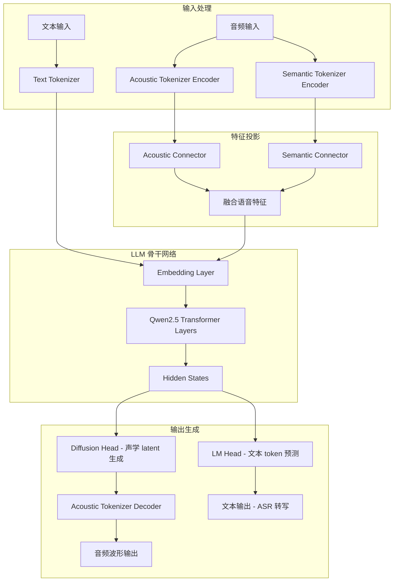
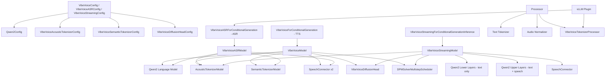
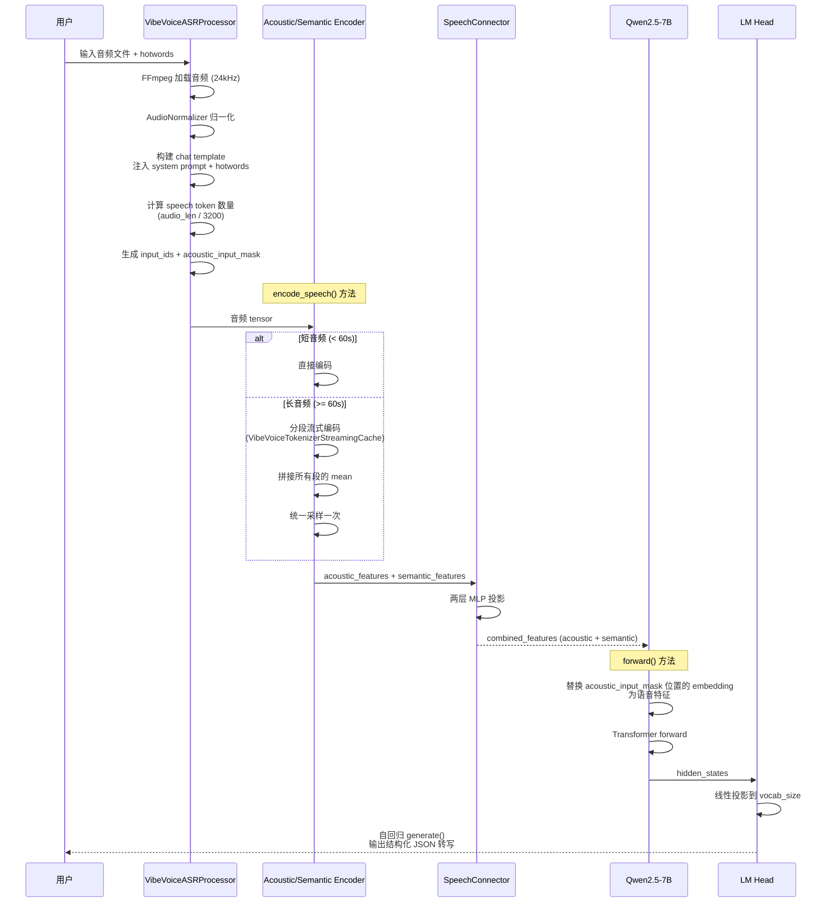
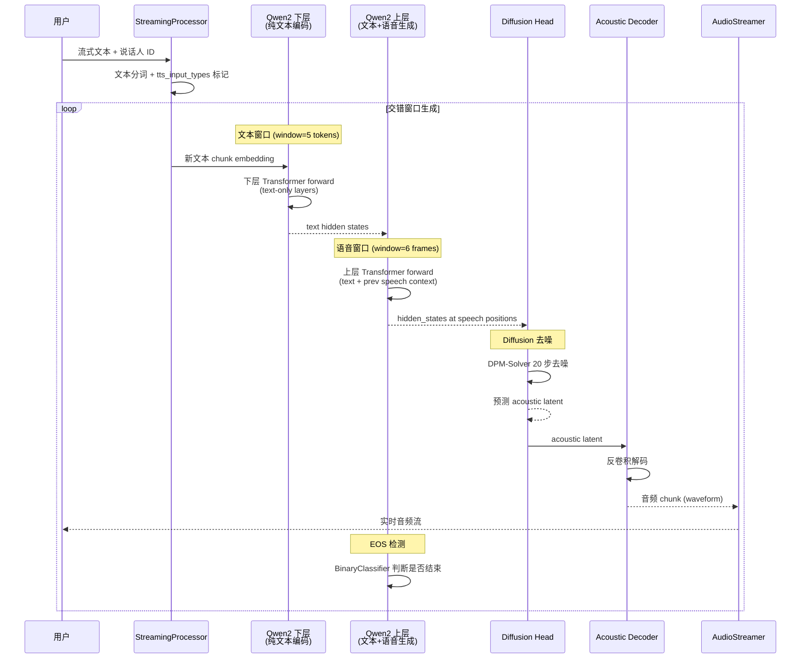

# VibeVoice 源码学习笔记

> 仓库地址：[VibeVoice](https://github.com/microsoft/VibeVoice)
> 学习日期：2026-04-05

---

> **以下为 AI 源码分析**
>
> ### 一句话概括
>
> 微软开源的前沿语音 AI 模型家族，基于 LLM + 连续语音 tokenizer + next-token diffusion 架构，统一支持长达 90 分钟的 TTS 和 60 分钟的 ASR 任务。
>
> ### 要点速览
>
> | 核心模块 | 职责 | 关键文件 |
> |---------|------|---------|
> | Acoustic Tokenizer | 将音频波形编码为超低帧率 (7.5 Hz) 的连续声学 latent | `modular/modular_vibevoice_tokenizer.py` |
> | Semantic Tokenizer | 提取语音的语义特征表示 | `modular/modular_vibevoice_tokenizer.py` |
> | LLM Decoder (Qwen2.5) | 理解文本上下文，生成 token 序列 | `modular/modeling_vibevoice.py` |
> | Diffusion Head | 基于 LLM hidden state 做 diffusion 生成声学 latent | `modular/modular_vibevoice_diffusion_head.py` |
> | Processor | 文本/音频预处理、特殊 token 管理 | `processor/vibevoice_processor.py` |
> | vLLM Plugin | ASR 模型的高性能推理部署 | `vllm_plugin/` |

---

## 项目简介

VibeVoice 是微软开源的**前沿语音 AI 模型家族**，涵盖 Text-to-Speech (TTS) 和 Automatic Speech Recognition (ASR) 两大方向。其核心创新在于使用运行在**超低帧率 7.5 Hz** 的连续语音 tokenizer（Acoustic + Semantic），在保持高保真音频质量的同时极大提升了长序列处理的计算效率。模型采用 **next-token diffusion** 框架——LLM 负责理解文本上下文和对话流，Diffusion Head 负责生成高保真的声学细节。项目包含三个模型变体：TTS-1.5B（长篇多说话人合成）、ASR-7B（60 分钟长音频识别）和 Realtime-0.5B（实时流式 TTS）。

## 技术栈

| 类别 | 技术 |
|------|------|
| 语言 | Python |
| 框架 | PyTorch, Hugging Face Transformers |
| 构建工具 | setuptools (pyproject.toml) |
| 依赖管理 | pip |
| 测试框架 | 无正式测试框架（vllm_plugin 下有 API 测试脚本） |
| 基座模型 | Qwen2.5 (0.5B / 1.5B / 7B) |
| Diffusion | DPMSolverMultistepScheduler (基于 diffusers) |
| 推理加速 | vLLM, Flash Attention 2 |
| 微调 | PEFT (LoRA) |

## 目录结构

```
VibeVoice/
├── vibevoice/                      # 核心库
│   ├── __init__.py                 # 导出 Streaming 模型和 Processor
│   ├── modular/                    # 模型定义层
│   │   ├── configuration_vibevoice.py          # TTS/ASR 配置（组合 Config）
│   │   ├── configuration_vibevoice_streaming.py # Streaming TTS 配置
│   │   ├── modeling_vibevoice.py               # TTS 完整模型（训练+推理）
│   │   ├── modeling_vibevoice_asr.py           # ASR 模型（训练+推理+generate）
│   │   ├── modeling_vibevoice_streaming.py     # Streaming TTS 基础模型
│   │   ├── modeling_vibevoice_streaming_inference.py # Streaming TTS 推理逻辑
│   │   ├── modular_vibevoice_tokenizer.py      # Acoustic/Semantic Tokenizer 实现
│   │   ├── modular_vibevoice_diffusion_head.py # Diffusion Head (adaLN + FFN)
│   │   ├── modular_vibevoice_text_tokenizer.py # 文本 tokenizer（扩展 Qwen2）
│   │   └── streamer.py                        # 音频流式输出（同步/异步）
│   ├── processor/                  # 数据预处理
│   │   ├── vibevoice_processor.py              # TTS Processor
│   │   ├── vibevoice_asr_processor.py          # ASR Processor
│   │   ├── vibevoice_streaming_processor.py    # Streaming TTS Processor
│   │   ├── vibevoice_tokenizer_processor.py    # 音频归一化等底层处理
│   │   └── audio_utils.py                     # FFmpeg 音频加载工具
│   ├── schedule/                   # 扩散调度器
│   │   ├── dpm_solver.py           # DPM-Solver 多步调度器
│   │   └── timestep_sampler.py     # 时间步采样器
│   ├── scripts/                    # 工具脚本
│   │   └── convert_nnscaler_checkpoint_to_transformers.py
│   └── configs/                    # 模型配置 JSON
│       ├── qwen2.5_1.5b_64k.json
│       └── qwen2.5_7b_32k.json
├── demo/                           # 演示脚本
│   ├── vibevoice_asr_gradio_demo.py            # ASR Gradio 演示
│   ├── vibevoice_asr_inference_from_file.py    # ASR 文件推理
│   ├── vibevoice_realtime_demo.py              # Realtime TTS WebSocket 演示
│   ├── realtime_model_inference_from_file.py   # Realtime TTS 文件推理
│   └── web/                        # Web 前端
├── vllm_plugin/                    # vLLM 推理插件
│   ├── __init__.py                 # 插件注册入口
│   ├── model.py                    # vLLM 模型适配
│   ├── inputs.py                   # 多模态输入映射
│   ├── scripts/start_server.py     # 服务启动脚本
│   └── tests/                      # API 测试
├── finetuning-asr/                 # ASR LoRA 微调
│   ├── lora_finetune.py            # 微调训练脚本
│   ├── inference_lora.py           # LoRA 推理脚本
│   └── toy_dataset/                # 示例数据集
├── docs/                           # 模型文档
└── pyproject.toml                  # 项目配置
```

## 架构设计

### 整体架构

VibeVoice 采用 **LLM + Continuous Speech Tokenizer + Next-Token Diffusion** 的统一架构。音频通过 Acoustic Tokenizer 和 Semantic Tokenizer 编码为低帧率连续 latent 表示，经 SpeechConnector 投影到 LLM 的隐藏空间。LLM（Qwen2.5）处理文本和语音的混合序列，其隐藏状态输出传递给 Diffusion Head，通过迭代去噪生成目标声学 latent，最后由 Acoustic Tokenizer 的 decoder 还原为波形。



### 核心模块

#### 1. Acoustic Tokenizer（声学分词器）

- **职责**：将原始音频波形编码为连续的 VAE latent 表示，帧率仅 7.5 Hz（常规方案通常 50-75 Hz）
- **核心文件**：`vibevoice/modular/modular_vibevoice_tokenizer.py`
- **关键类**：
  - `VibeVoiceAcousticTokenizerModel`：完整的 encoder-decoder 架构
  - `StreamingSEANetEncoder`：支持流式因果卷积的编码器，使用 depthwise conv + RMSNorm
  - `SEANetDecoder`：反卷积解码器，将 latent 还原为波形
  - `VibeVoiceTokenizerStreamingCache`：类似 KV cache 的流式卷积缓存，支持长音频分段处理
- **设计要点**：
  - 编码器使用 `encoder_ratios = [8, 5, 5, 4, 2, 2]`，总下采样率 3200x（24kHz 采样率下对应 7.5 Hz 帧率）
  - VAE 维度 `vae_dim=64`，使用高斯分布采样增加随机性
  - 因果卷积确保流式推理中不依赖未来帧

#### 2. Semantic Tokenizer（语义分词器）

- **职责**：提取音频的语义级别特征，为 ASR 提供语义信息补充
- **核心文件**：`vibevoice/modular/modular_vibevoice_tokenizer.py`
- **关键类**：`VibeVoiceSemanticTokenizerModel`
- **设计要点**：
  - 仅编码器（无解码器），`std_dist_type='none'` 不做高斯采样
  - 与 Acoustic Tokenizer 共享相同的卷积架构，但参数独立
  - 在 ASR 模型中，Acoustic + Semantic 特征相加后注入 LLM

#### 3. SpeechConnector（语音连接器）

- **职责**：将 tokenizer 输出的 latent 投影到 LLM 隐藏空间维度
- **核心文件**：`vibevoice/modular/modeling_vibevoice.py`
- **关键类**：`SpeechConnector`
- **结构**：`Linear → RMSNorm → Linear`，简洁的两层 MLP

#### 4. LLM Decoder（语言模型骨干）

- **职责**：处理文本和语音的混合 token 序列，理解上下文，输出隐藏状态
- **核心文件**：`vibevoice/modular/modeling_vibevoice.py`, `modeling_vibevoice_asr.py`, `modeling_vibevoice_streaming.py`
- **关键类**：
  - `VibeVoiceModel`：TTS 模型，使用完整的 Qwen2.5 Transformer
  - `VibeVoiceASRModel`：ASR 模型，同样使用完整 Qwen2.5（7B 参数）
  - `VibeVoiceStreamingModel`：Streaming TTS 模型，将 Transformer 分成上下两半
- **设计要点**：
  - TTS-1.5B 使用 Qwen2.5-1.5B，64K context（支持 ~90 分钟音频）
  - ASR-7B 使用 Qwen2.5-7B，64K context（支持 ~60 分钟音频）
  - Streaming-0.5B 使用 Qwen2.5-0.5B，8K context（支持 ~10 分钟音频）
  - Streaming 模型独创**双语言模型拆分**：下层 Transformer 仅编码文本，上层 Transformer 同时处理文本和语音生成

#### 5. Diffusion Head（扩散生成头）

- **职责**：以 LLM 的 hidden state 为条件，通过扩散过程生成目标声学 latent
- **核心文件**：`vibevoice/modular/modular_vibevoice_diffusion_head.py`
- **关键类**：
  - `VibeVoiceDiffusionHead`：主模型，多层 `HeadLayer` + `FinalLayer`
  - `HeadLayer`：使用 **adaLN（自适应层归一化）** 调制，`FFN` 使用 SwiGLU 激活
  - `TimestepEmbedder`：正弦时间步嵌入 + MLP
  - `FinalLayer`：输出层，带 adaLN 调制
- **设计要点**：
  - 默认 4 层，hidden_size=768，FFN 比例 3.0
  - 使用 **v_prediction** 模式（预测速度而非噪声）
  - 推理时使用 DPM-Solver 20 步去噪
  - adaLN 的条件输入 = LLM hidden state + timestep embedding

#### 6. DPM-Solver 调度器

- **职责**：管理扩散过程的噪声调度和多步去噪推理
- **核心文件**：`vibevoice/schedule/dpm_solver.py`
- **关键类**：`DPMSolverMultistepScheduler`
- **设计要点**：
  - 基于 diffusers 库的 `SchedulerMixin`
  - 训练使用 1000 步 cosine beta schedule
  - 推理使用 20 步 DPM-Solver 加速采样

#### 7. Processor（处理器）

- **职责**：将原始文本和音频转换为模型可接受的输入格式
- **核心文件**：`processor/vibevoice_processor.py`, `vibevoice_asr_processor.py`, `vibevoice_streaming_processor.py`
- **关键类**：
  - `VibeVoiceProcessor`：TTS 处理器，管理文本分词 + 音频归一化 + 特殊 token 插入
  - `VibeVoiceASRProcessor`：ASR 处理器，处理音频加载、speech token 占位符、hotword 注入
  - `VibeVoiceStreamingProcessor`：Streaming TTS 处理器
- **设计要点**：
  - 音频压缩比 `speech_tok_compress_ratio=3200`（与 Tokenizer 下采样率一致）
  - 使用 `<|speech_start|>`, `<|speech_end|>` 等特殊 token 标记语音段
  - ASR 支持自定义 hotwords 注入 system prompt

#### 8. vLLM Plugin

- **职责**：将 VibeVoice ASR 模型适配为 vLLM 可服务的高性能 API
- **核心文件**：`vllm_plugin/__init__.py`, `model.py`, `inputs.py`
- **关键类**：`VibeVoiceForCausalLM`（vLLM 适配版模型）
- **设计要点**：
  - 通过 `pyproject.toml` 的 entry-point 机制自动注册插件
  - 支持 Data Parallel (DP) 和 Tensor Parallel (TP) 部署
  - 使用 FFmpeg 作为统一音频解码后端
  - 提供 OpenAI 兼容的 `/v1/chat/completions` API

### 模块依赖关系



## 核心流程

### 流程一：ASR 推理（语音转文字）

ASR 推理流程是 VibeVoice 最核心的业务场景之一——将最长 60 分钟的音频一次性转写为包含说话人、时间戳和内容的结构化文本。



**关键逻辑说明**：
1. **长音频流式编码**：`encode_speech()` 对超过 60 秒的音频启用流式处理，每段独立编码后拼接 mean，最后统一采样，避免卷积溢出
2. **语音特征替换**：在 `forward()` 中，`inputs_embeds[acoustic_input_mask]` 被替换为语音特征，实现多模态融合
3. **ASR 支持自定义 hotwords**：通过 system prompt 注入领域术语，提升专业名词识别准确率
4. **输出格式**：自回归生成 JSON 格式文本，包含 `speaker`、`start`、`end`、`text` 字段

### 流程二：Streaming TTS 推理（实时文字转语音）

Streaming TTS 使用交错窗口式设计——增量编码新到达的文本，同时并行从先前上下文继续生成语音 latent，实现约 200ms 首音频延迟。



**关键逻辑说明**：
1. **双层 LLM 拆分**：`VibeVoiceStreamingModel` 将 Qwen2.5 的 Transformer 层拆分为 `language_model`（下层，纯文本编码）和 `tts_language_model`（上层，联合文本和语音），各自独立 forward
2. **交错窗口**：文本窗口 `TTS_TEXT_WINDOW_SIZE=5`，语音窗口 `TTS_SPEECH_WINDOW_SIZE=6`，交替处理文本输入和语音生成
3. **EOS 检测**：使用 `BinaryClassifier` 二分类器判断语音段是否结束，而非依赖 token
4. **流式输出**：`AudioStreamer` / `AsyncAudioStreamer` 基于 Queue 实现异步流式音频传输，支持批量推理

## 关键设计亮点

### 1. 超低帧率连续语音 Tokenizer (7.5 Hz)

- **解决问题**：传统离散语音 tokenizer 帧率高（50-75 Hz），导致长音频序列极长，LLM 处理效率低
- **实现方式**：
  - Acoustic Tokenizer 使用多级下采样卷积 `ratios=[8,5,5,4,2,2]`，总压缩比 3200x
  - 24kHz 采样率下每秒仅 7.5 帧连续 latent（维度 64）
  - 使用 VAE 框架（mean + std），推理时加入受控噪声
  - 参见 `modular/modular_vibevoice_tokenizer.py` 的 `StreamingSEANetEncoder`
- **为什么这样设计**：使得 64K context 即可覆盖 90 分钟音频（64000 / 7.5 / 60 ≈ 142 分钟），将长篇语音生成变为可行

### 2. Next-Token Diffusion 框架

- **解决问题**：直接用 LLM 预测连续 latent 效果差，离散 token 方案丢失音频细节
- **实现方式**：
  - LLM 在每个语音 token 位置输出 hidden state 作为条件
  - Diffusion Head 以 `condition = LLM_hidden_state + timestep_embedding` 做 adaLN 调制
  - 训练时随机采样 timestep，计算 v_prediction 的 MSE loss
  - 推理时用 DPM-Solver 20 步去噪，从纯噪声恢复 acoustic latent
  - 参见 `modular/modular_vibevoice_diffusion_head.py` 和 `modular/modeling_vibevoice.py:417-461`
- **为什么这样设计**：结合 LLM 强大的上下文理解能力和 diffusion 的高保真生成能力，各取所长

### 3. Streaming 模型的双 LLM 拆分架构

- **解决问题**：实时 TTS 需要边接收文本边输出语音，但标准 LLM 无法处理两种不同模态的并行流
- **实现方式**：
  - 将 Qwen2.5 拆为两个子模型：`language_model`（下层）和 `tts_language_model`（上层）
  - 下层处理纯文本编码，`norm` 层替换为 `nn.Identity()` 跳过最终归一化
  - 上层接收下层输出 + 前一步语音 latent，联合处理
  - `tts_input_types` Embedding 标记哪些文本需要被朗读
  - 参见 `modular/modeling_vibevoice_streaming.py:94-182`
- **为什么这样设计**：使文本编码和语音生成在不同 Transformer 层解耦，支持交错窗口式的流式推理

### 4. ASR 长音频流式编码

- **解决问题**：超过 60 秒的音频直接编码会导致卷积中间结果超过 2^32 溢出
- **实现方式**：
  - `encode_speech()` 检测音频长度，超过阈值启用流式处理
  - 使用 `VibeVoiceTokenizerStreamingCache` 缓存各卷积层的状态
  - 逐段编码，收集 mean，最后拼接后统一采样
  - 参见 `modular/modeling_vibevoice_asr.py:208-339`
- **为什么这样设计**：保证长音频编码的正确性，同时避免一次性处理导致的内存和数值溢出

### 5. vLLM 插件化高性能部署

- **解决问题**：ASR 推理需要支持高并发、长音频请求，原生 Transformers 推理效率不足
- **实现方式**：
  - 利用 `pyproject.toml` 的 `[project.entry-points."vllm.general_plugins"]` 实现零侵入式注册
  - 适配 vLLM 的 multimodal pipeline，自定义 `AudioMediaIO` 使用 FFmpeg 解码
  - 支持 DP (数据并行) + TP (张量并行) + 混合部署
  - 提供 OpenAI 兼容 API，可通过 Docker 一键启动
  - 参见 `vllm_plugin/__init__.py` 和 `vllm_plugin/model.py`
- **为什么这样设计**：无需修改 vLLM 源码即可集成，降低部署门槛，支持生产级并发处理
