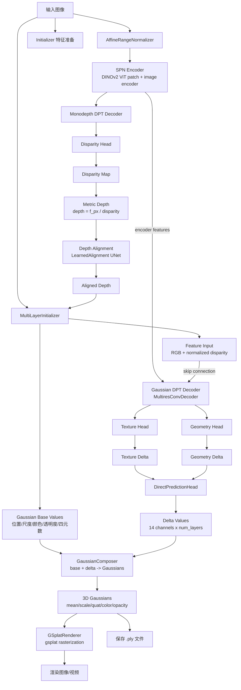
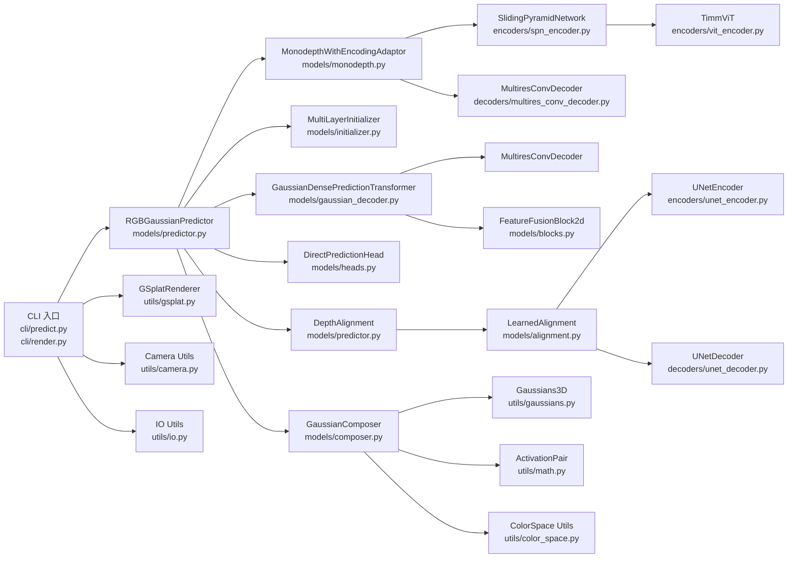
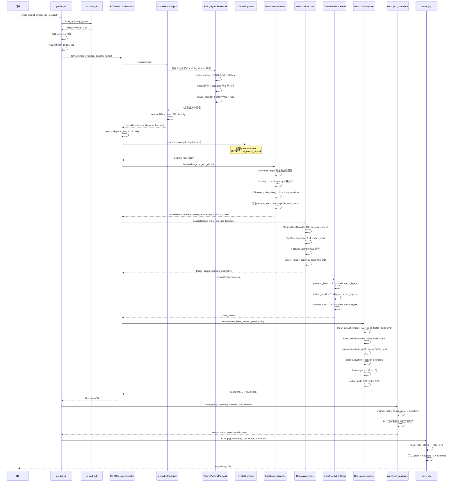
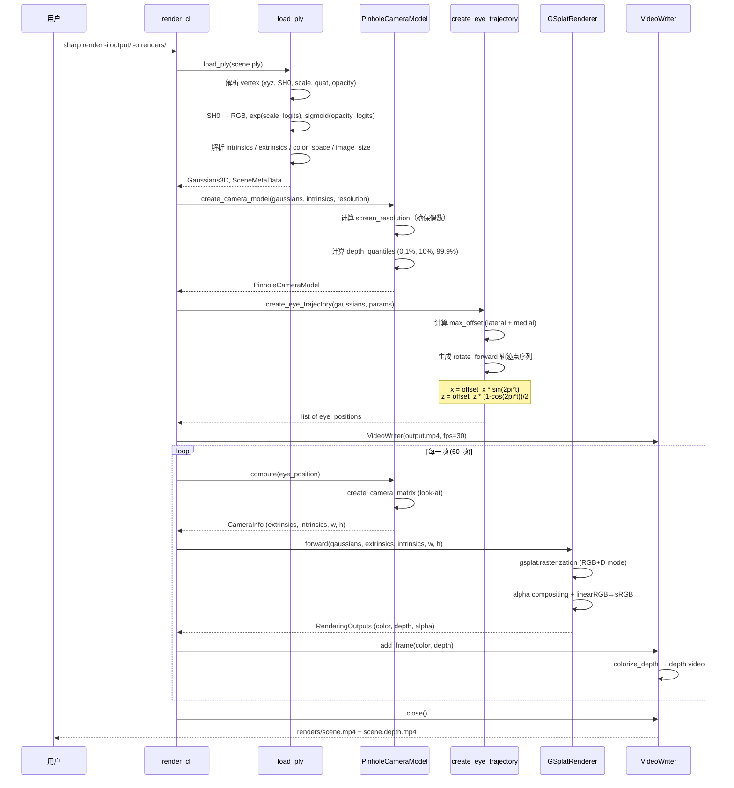

# ml-sharp 源码学习笔记

> 仓库地址：[ml-sharp](https://github.com/apple/ml-sharp)
> 学习日期：2026-04-10

---

> **以下为 AI 源码分析**
>
> ### 一句话概括
>
> Apple 提出的 SHARP 方法：从单张照片通过一次前馈神经网络推理（< 1 秒），回归出 3D Gaussian Splatting 表示，实现实时新视角合成。
>
> ### 要点速览
>
> | 核心模块 | 职责 | 关键文件 |
> |---------|------|---------|
> | CLI 入口 | 命令行接口，支持 predict 和 render 子命令 | `cli/__init__.py`, `cli/predict.py`, `cli/render.py` |
> | Monodepth 网络 | 基于 DINOv2 ViT 的单目深度估计 | `models/monodepth.py`, `encoders/spn_encoder.py`, `encoders/vit_encoder.py` |
> | Gaussian Decoder | 融合深度特征与图像特征，输出 delta 值 | `models/gaussian_decoder.py`, `decoders/multires_conv_decoder.py` |
> | Initializer | 从 RGBD 初始化多层 Gaussian 基值 | `models/initializer.py` |
> | Gaussian Composer | 将基值 + delta 组合为最终 3D Gaussians | `models/composer.py` |
> | Depth Alignment | UNet 学习对齐 monodepth 到 GT 深度 | `models/alignment.py` |
> | Rendering | 基于 gsplat 的 3DGS 渲染管线 | `utils/gsplat.py`, `utils/camera.py` |

---

## 项目简介

SHARP（**SH**arp monucul**AR** view synthesis in less than a second with 3D Gaussian s**P**latting）是 Apple 提出的单目新视角合成方法。给定一张照片，SHARP 在标准 GPU 上通过一次前馈推理（不到 1 秒）回归出场景的 3D Gaussian 表示，然后利用 3D Gaussian Splatting 进行实时渲染，生成高分辨率的近邻视角图像。该表示是度量级（metric）的，支持绝对尺度的相机运动。实验表明 SHARP 在多个数据集上实现了零样本泛化，相比先前最优方法将 LPIPS 降低 25–34%、DISTS 降低 21–43%，同时推理速度提升三个数量级。

## 技术栈

| 类别 | 技术 |
|------|------|
| 语言 | Python 3.13 |
| 框架 | PyTorch 2.8 + timm（DINOv2 ViT backbone）+ gsplat（3DGS 渲染器） |
| 构建工具 | setuptools + uv |
| 依赖管理 | pip + requirements.txt（由 uv pip compile 生成） |
| 测试框架 | pytest |

## 目录结构

```
src/sharp/
├── __init__.py
├── cli/                          # 命令行入口
│   ├── __init__.py               #   Click group：main_cli
│   ├── predict.py                #   sharp predict 子命令：图像→3DGS
│   └── render.py                 #   sharp render 子命令：3DGS→视频
├── models/                       # 核心模型
│   ├── __init__.py               #   create_predictor 工厂函数
│   ├── params.py                 #   所有 dataclass 参数定义
│   ├── predictor.py              #   RGBGaussianPredictor 主模型
│   ├── monodepth.py              #   MonodepthDPT + Adaptor
│   ├── gaussian_decoder.py       #   GaussianDensePredictionTransformer
│   ├── initializer.py            #   MultiLayerInitializer
│   ├── composer.py               #   GaussianComposer（base + delta → Gaussians）
│   ├── alignment.py              #   LearnedAlignment（深度对齐 UNet）
│   ├── heads.py                  #   DirectPredictionHead
│   ├── blocks.py                 #   ResidualBlock / FeatureFusionBlock2d
│   ├── normalizers.py            #   AffineRangeNormalizer / MeanStdNormalizer
│   ├── encoders/                 #   编码器
│   │   ├── vit_encoder.py        #     TimmViT（DINOv2-L/16）
│   │   ├── spn_encoder.py        #     SlidingPyramidNetwork
│   │   ├── monodepth_encoder.py  #     MonodepthFeatureEncoder
│   │   ├── unet_encoder.py       #     UNetEncoder
│   │   └── base_encoder.py       #     BaseEncoder ABC
│   ├── decoders/                 #   解码器
│   │   ├── multires_conv_decoder.py  # MultiresConvDecoder
│   │   ├── monodepth_decoder.py  #     create_monodepth_decoder 工厂
│   │   ├── unet_decoder.py       #     UNetDecoder
│   │   └── base_decoder.py       #     BaseDecoder ABC
│   └── presets/                  #   预设配置
│       ├── vit.py                #     ViTConfig / VIT_CONFIG_DICT
│       └── monodepth.py          #     encoder dims / hook ids map
└── utils/                        # 工具函数
    ├── gaussians.py              #   Gaussians3D 数据结构 / PLY IO / unproject
    ├── gsplat.py                 #   GSplatRenderer（gsplat wrapper）
    ├── camera.py                 #   相机模型 / 轨迹生成
    ├── io.py                     #   图像/视频 IO + EXIF 焦距提取
    ├── math.py                   #   ActivationPair / softclamp / inverse_sigmoid
    ├── linalg.py                 #   quaternion ↔ rotation matrix 互转
    ├── color_space.py            #   sRGB ↔ linearRGB 转换
    ├── vis.py                    #   深度图/alpha 可视化着色
    ├── robust.py                 #   robust_where 避免 NaN 梯度
    ├── module_surgery.py         #   冻结 norm 层
    ├── training.py               #   gradient checkpointing wrapper
    └── logging.py                #   日志配置
```

## 架构设计

### 整体架构

SHARP 采用 **encoder-decoder + 基值/增量(base + delta)** 的架构范式。核心思路是：

1. **Monodepth 分支**：利用预训练的 DINOv2 ViT 大模型通过 Sliding Pyramid Network（SPN）提取多分辨率特征，经 DPT 解码器预测单目深度（disparity），同时输出中间特征供后续模块复用。
2. **Initializer**：从输入图像和预测深度构建 Gaussian 的**基值**（位置、尺度、颜色、透明度、四元数），包含多层初始化（surface layer + background layer）。
3. **Gaussian Decoder**：复用 monodepth 编码器的多分辨率特征，融合图像像素信息，通过 DPT 风格的 decoder 提取特征。
4. **Prediction Head**：将特征分为 geometry 和 texture 两路，分别输出 3D 位置和其余属性的**增量值（delta）**。
5. **Gaussian Composer**：将基值与增量通过精心设计的激活函数组合，输出最终的 metric-scale 3D Gaussians。



### 核心模块

#### 1. SlidingPyramidNetwork (SPN Encoder)

**职责**：将输入图像构建为 3 层金字塔（1536 / 768 / 384），通过 DINOv2 ViT 提取多分辨率特征。

**核心文件**：`encoders/spn_encoder.py`、`encoders/vit_encoder.py`

**关键设计**：
- `TimmViT` 继承自 `timm.models.VisionTransformer`，使用 DINOv2-Large/16（embed_dim=1024, depth=24）
- SPN 对高分辨率图像进行 **sliding window 切块**（5x5 @1536、3x3 @768、1x1 @384），每个 patch 送入 patch_encoder 提取特征
- 切块后**批量编码**（合并为一个大 batch），避免逐块推理的开销
- `split()` / `merge()` 函数处理切块和拼合，支持重叠（overlap_ratio=0.25）和非重叠模式
- 最终输出 5 个分辨率层级的特征（包含 2 层 intermediate features + 3 层 pyramid features）
- 额外使用一个 `image_encoder` 处理最低分辨率（384x384），与 patch_encoder 的最低层特征融合

#### 2. Monodepth DPT

**职责**：从 SPN 编码特征解码出单目深度（disparity），同时暴露中间特征供 Gaussian Decoder 复用。

**核心文件**：`models/monodepth.py`

**关键设计**：
- `MonodepthDensePredictionTransformer` 组合 SPN encoder + `MultiresConvDecoder` + disparity head
- 默认冻结全部参数（`requires_grad_(False)`），可选择性解冻 patch_encoder / image_encoder / decoder / head
- `MonodepthWithEncodingAdaptor` 包装了 monodepth 模型，执行完整前向后返回 `MonodepthOutput`（disparity + encoder_features + decoder_features + output_features）
- 支持 2 层深度预测（`num_monodepth_layers=2`），通过 `replicate_head()` 复制最后一层 Conv2d
- 可选排序两层 disparity（确保第一层是前景、第二层是背景）

#### 3. MultiLayerInitializer

**职责**：从图像和深度图初始化 Gaussian 的基值（位置、尺度、颜色、透明度、四元数）。

**核心文件**：`models/initializer.py`

**关键设计**：
- 支持多层 Gaussian 初始化（默认 `num_layers=2`），实现 surface layer + background layer
- 位置基值使用 NDC 坐标：x/y 通过 stride 下采样后均匀分布于 [-1, 1]，z 为 disparity（逆深度）
- 尺度基值根据 disparity 和 stride 计算：`base_scale = disparity_scale_factor / disparity`
- 颜色基值可从输入图像 avg_pool 初始化（`color_option="all_layers"`）
- 透明度基值设为 `1/num_layers`，确保初始 transmittance ≈ 1/e
- 深度归一化（`normalize_depth`）：缩放深度使最小值为 1.0，返回 `global_scale = 1/depth_factor` 用于后续反归一化
- 特征输入为 `[RGB, normalized_disparity]` 拼接后映射到 [-1, 1]

#### 4. GaussianDensePredictionTransformer (Gaussian Decoder)

**职责**：复用 monodepth 编码器的多分辨率特征，融合图像 skip connection，输出 delta 预测所需的特征。

**核心文件**：`models/gaussian_decoder.py`

**关键设计**：
- 内部使用 `MultiresConvDecoder` 解码 monodepth 的 encoder features
- `SkipConvBackbone` 对图像 + depth 输入做简单卷积降维，作为 skip connection
- `FeatureFusionBlock2d` 将 decoder 输出与 skip features 融合
- 输出分为 `texture_features` 和 `geometry_features` 两路，分别送入独立的 head（ResidualBlock + Conv 1x1）

#### 5. GaussianComposer

**职责**：将 Initializer 的基值和 Prediction Head 的增量值组合为最终的 3D Gaussians。

**核心文件**：`models/composer.py`

**关键设计**：
- **位置激活**：x/y 直接相加 delta，z（逆深度）先 `inverse_softplus(base) + delta` 再 `softplus`，确保正值并保证可微
- **尺度激活**：`base * (sigmoid(a * delta + b) * (max - min) + min)`，将缩放因子约束在 [min_scale, max_scale] 范围内
- **四元数**：直接加法 `base + delta_factor * delta`
- **颜色/透明度**：`activation(inverse_activation(base) + delta_factor * delta)`，支持 sigmoid / exp / softplus 等激活
- `DeltaFactor` 对不同属性的 delta 乘以不同系数（xy=0.001, z=0.001, color=0.1 等），等效于属性级别的学习率衰减
- linearRGB 色彩空间时自动进行 `sRGB → linearRGB` 转换
- `global_scale` 将归一化空间的 Gaussians 恢复到 metric 空间

#### 6. Depth Alignment (LearnedAlignment)

**职责**：通过轻量 UNet 学习单目深度到 GT 深度的局部对齐缩放图。

**核心文件**：`models/alignment.py`

**关键设计**：
- 输入为 `(1/monodepth, 1/gt_depth)` 的拼接（转为 disparity 空间以获得合理数值范围）
- UNet 架构：`UNetEncoder`（4 步下采样） → `UNetDecoder`（部分上采样到目标 stride） → 1x1 Conv
- 输出经 activation（默认 `exp`）得到正值缩放图，乘以 monodepth 实现对齐
- 初始化 bias 使得初始输出为 1.0（即不做任何调整），通过 `activation.inverse(1.0)` 计算
- 可选冻结（`frozen=True`），推理时 `depth=None` 则跳过对齐

### 模块依赖关系



## 核心流程

### 流程一：单张图像预测 3D Gaussians (`sharp predict`)



**关键细节**：
1. **图像加载**：从 EXIF 提取焦距信息（35mm 等效），转换为像素焦距 `f_px`；支持 HEIC 格式
2. **预处理**：图像 resize 到固定 1536x1536 内部分辨率，`disparity_factor = f_px / width`
3. **推理**：`@torch.no_grad()` 装饰，整个前向无梯度计算
4. **后处理**：通过 `unproject_gaussians` 将 NDC 空间的 Gaussians 变换到 metric 世界坐标，需要构建反投影矩阵 `inv(ndc_matrix @ intrinsics @ extrinsics)`
5. **PLY 导出**：linearRGB 转 sRGB（兼容第三方渲染器）、RGB 转 SH0、附加 intrinsics/extrinsics/image_size/color_space 等元数据

### 流程二：3DGS 渲染相机轨迹视频 (`sharp render`)



**关键细节**：
1. **PLY 加载**：反序列化 vertex 元素 + 补充元素（intrinsics、extrinsics、color_space、image_size），支持 legacy 格式兼容
2. **相机模型**：`PinholeCameraModel` 使用 look-at 矩阵，焦点深度取 10% 分位数和最小 2m 中的较大者
3. **轨迹生成**：支持 swipe / shake / rotate / rotate_forward 四种模式，偏移量根据 `max_disparity`（0.08）和最小深度自适应计算
4. **gsplat 渲染**：调用 `gsplat.rendering.rasterization()` 进行 3DGS 光栅化，`render_mode="RGB+D"` 同时输出颜色和深度
5. **色彩空间**：linearRGB 渲染后转 sRGB 输出，确保 Gamma 校正

## 关键设计亮点

### 1. Sliding Pyramid Network (SPN) — 高效高分辨率特征提取

**解决的问题**：ViT 的计算量随图像分辨率二次增长，直接处理 1536x1536 图像不现实。

**具体实现**（`encoders/spn_encoder.py`）：
- 构建 3 层金字塔：1536 → 768 → 384
- 在每层用 sliding window 切出 384x384 的 patches（5x5 @高分辨率，3x3 @中分辨率，1x1 @低分辨率）
- 所有 patches 拼成一个大 batch（25+9+1=35 patches）一次性送入同一个 ViT
- 编码完成后通过 `merge()` 函数将 patches 拼合回完整特征图，处理重叠区域的裁剪

**设计理由**：复用单个 ViT 处理多尺度 patches，避免了对每个 patch 分别推理的开销，同时通过金字塔获得了全局上下文（低分辨率层）和局部细节（高分辨率层）。源自 Apple 的 Depth Pro 工作（Bochkovskii et al., ICLR 2024）。

### 2. Base + Delta 预测范式 — 结构化 Gaussian 回归

**解决的问题**：直接从图像回归 3D Gaussian 的全部属性（位置、尺度、旋转、颜色、透明度）空间巨大，难以学习。

**具体实现**（`models/initializer.py` + `models/composer.py`）：
- `MultiLayerInitializer` 用几何先验（深度图 + 规则网格）构建合理的**基值**
- 网络只需学习**残差增量（delta）**，搜索空间大幅缩小
- `DeltaFactor` 对不同属性施加不同的缩放系数（xy=0.001, z=0.001, color=0.1），等效于属性级别的学习率调节
- `GaussianComposer` 中的激活函数保证物理合理性：位置的 z 分量用 softplus 保证正值，尺度用 bounded sigmoid 约束范围

**设计理由**：利用单目深度的先验知识为 Gaussian 提供好的初始化，使网络收敛更快、结果更稳定。不同属性的 delta_factor 差异反映了它们的敏感度：位置需要精细调整（0.001），而颜色和透明度允许更大变化。

### 3. 多层 Gaussian 表示 — 处理遮挡和远景

**解决的问题**：单层 Gaussian（仅表面）无法表示被遮挡区域和远景内容。

**具体实现**（`models/initializer.py`、`models/monodepth.py`）：
- 默认 `num_layers=2`：第一层为 surface layer（前景深度），第二层为 background layer
- Monodepth 通过 `replicate_head()` 预测 2 通道 disparity
- 可选排序（`sorting_monodepth=True`）确保 layer 0 是近景、layer 1 是远景
- Initializer 对两层分别初始化深度（`first_layer_depth_option` vs `rest_layer_depth_option`）
- 透明度初始化为 `1/num_layers=0.5`，使初始 transmittance ≈ 1/e，对层数不变量

**设计理由**：多层表示是处理新视角合成中 disocclusion（反遮挡）问题的关键。当相机移动时，原本被遮挡的区域需要渲染内容，第二层提供了这些区域的颜色和深度信息。

### 4. 深度空间归一化 + Global Scale 恢复 — 数值稳定的 Metric 预测

**解决的问题**：真实场景的深度范围差异极大（室内 1–10m vs 室外 10–1000m），直接在原始 metric 空间训练数值不稳定。

**具体实现**（`models/initializer.py` 的 `_rescale_depth()` + `models/composer.py`）：
- `_rescale_depth()` 将深度缩放使最小值为 1.0：`depth_factor = 1.0 / min(depth)`
- 所有后续计算（基值、delta、尺度）在归一化深度空间进行
- `global_scale = 1 / depth_factor` 作为 `InitializerOutput` 的一部分传递
- `GaussianComposer.forward()` 最后将位置和尺度乘以 `global_scale` 恢复 metric 空间

**设计理由**：归一化使不同场景的深度分布统一到相似范围，避免了梯度爆炸/消失，使 `DeltaFactor` 等超参数在不同场景间通用。同时通过保存 `global_scale` 精确恢复了 metric 尺度。

### 5. Geometry/Texture 特征解耦 — 分路预测提升质量

**解决的问题**：3D Gaussian 的几何属性（位置）和外观属性（颜色、透明度、尺度、旋转）的学习难度和最优特征不同。

**具体实现**（`models/gaussian_decoder.py` + `models/heads.py`）：
- `GaussianDensePredictionTransformer` 的输出经过两个独立的 head（`texture_head` / `geometry_head`），产生 `ImageFeatures(texture_features, geometry_features)`
- `DirectPredictionHead` 分别用 `geometry_prediction_head`（3 channels：xyz delta）和 `texture_prediction_head`（11 channels：scale/quat/color/opacity delta）处理两路特征
- 两个 head 的权重和 bias 初始化为 **全零**，确保训练初期的 delta 为 0，网络输出即为 Initializer 的基值

**设计理由**：几何精度和外观质量是新视角合成的两大目标，它们可能受益于不同的特征表示。解耦设计允许 geometry 路径更关注结构一致性，texture 路径更关注视觉质量。全零初始化是一种常见的 residual learning 技巧，确保训练从良好的初始状态开始。
