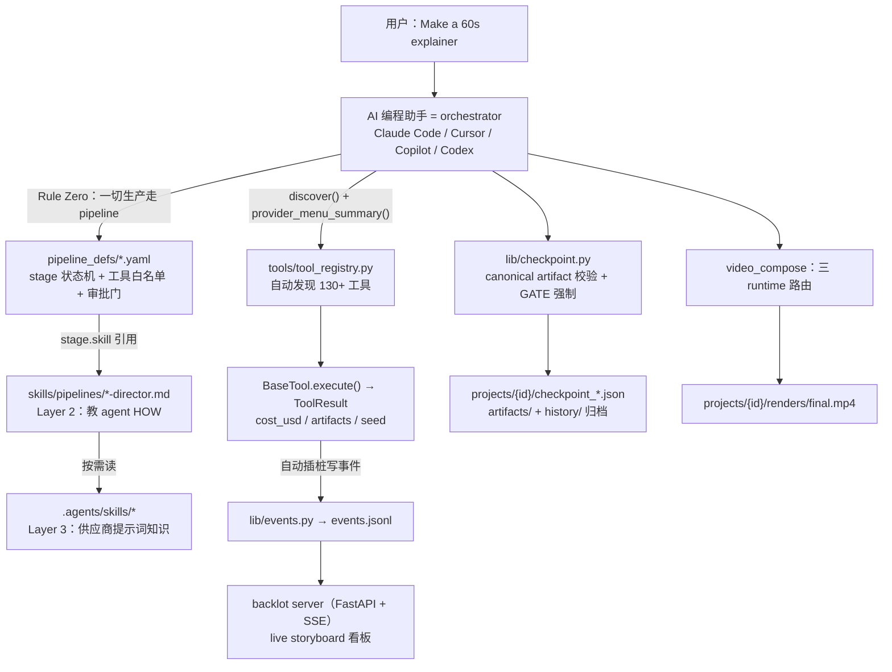
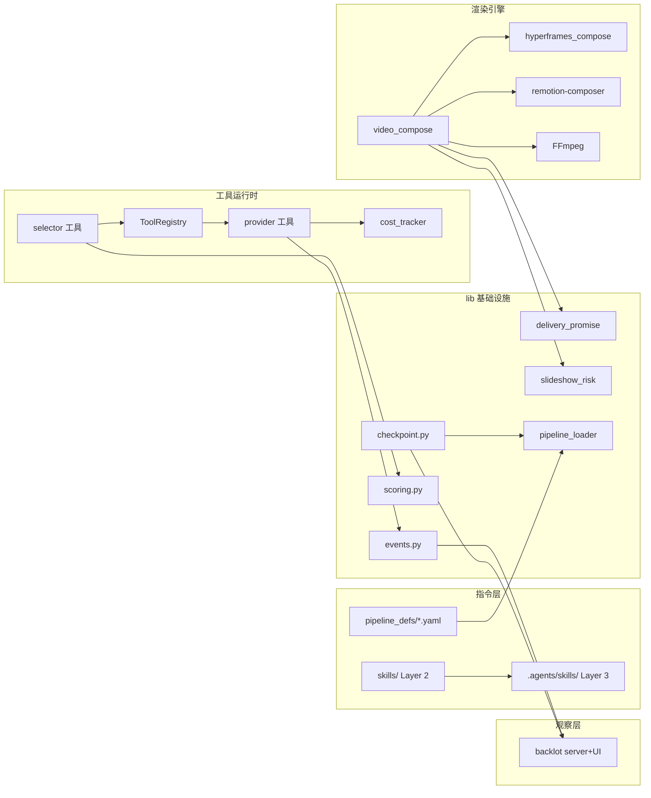
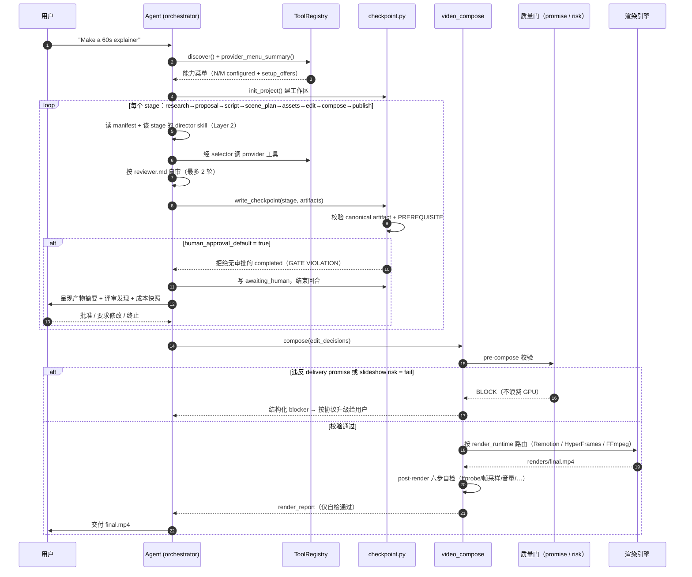
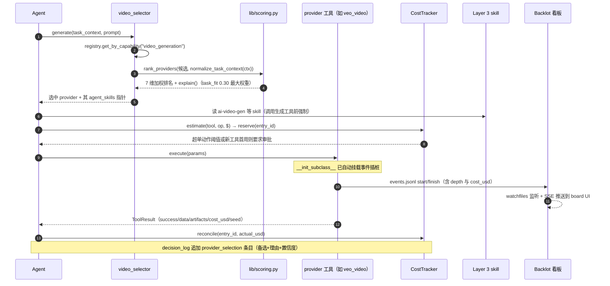

# OpenMontage 源码学习笔记

> 仓库地址：[OpenMontage](https://github.com/calesthio/OpenMontage)
> 学习日期：2026-09-30（基于浅克隆，最新提交 `08e2151`，2026-09-05）

---

> **以下为 AI 源码分析**
>
> ### 一句话概括
>
> OpenMontage 是一个"agent-first"的开源视频生产系统：AI 编程助手（Claude Code、Cursor、Copilot、Codex 等）本身担任 orchestrator，按 YAML pipeline manifest 与 Markdown director skill 驱动一条影视级生产流水线（research → proposal → script → scene_plan → assets → edit → compose → publish）；Python 侧只提供 130+ 可自动发现的生产工具、checkpoint 持久化与三重治理（7 维 provider 评分、预算生命周期、pre/post 质量门），所有编排与创意"智能"都以人类可读的指令文件形式存在。
>
> ### 要点速览
>
> | 模块 | 职责 | 关键文件 |
> |------|------|----------|
> | `tools/` | 130+ 生产工具（agent 的"手"），统一 `BaseTool` 契约，registry 自动发现 | `base_tool.py`、`tool_registry.py`、`video/video_compose.py` |
> | `pipeline_defs/` | 12 条 pipeline 的 YAML manifest：stage 状态机、工具白名单、审批门 | `animated-explainer.yaml` |
> | `skills/` | Layer 2 指令（agent 的"操作手册"）：157 个 MD，pipeline 导演 + 创意技法 + meta 协议 | `pipelines/explainer/research-director.md`、`meta/reviewer.md` |
> | `.agents/skills/` | Layer 3 外部技术知识包（90 个 skill 目录、994 个文件）：GSAP/Remotion/各供应商提示词知识 | `ai-video-gen/`、`gsap-core/` |
> | `lib/` | 基础设施：checkpoint 状态机、7 维评分、CLIP 语料库、交付承诺/幻灯片风险校验 | `checkpoint.py`、`scoring.py`、`corpus.py` |
> | `schemas/` | 21 个 artifact JSON Schema + checkpoint/pipeline/playbook schema | `schemas/artifacts/` |
> | `remotion-composer/` | React 18 + Remotion 4 渲染引擎：12 个 composition、场景组件库 | `src/Root.tsx`、`SCENE_TYPES.md` |
> | `backlot/` | 本地 live storyboard 看板：FastAPI + SSE，纯磁盘推导、只读不改 | `server.py`、`state.py` |
> | `ink-theater/` | 手绘 SVG 角色动画引擎：CMU mocap 驱动火柴人，确定性渲染 | `ink-puppet.js`、`mocap/clips.js` |
> | `styles/` | 视觉风格 playbook（YAML + loader + 设计智能） | `playbook_loader.py` |

---

## 项目简介

OpenMontage 把"AI 编程助手"变成一整个视频制作工作室：用户用自然语言下需求，agent 完成调研、提案、剧本、场景规划、资产生成、剪辑与最终合成。它自称"the first open-source, agentic video production system"（AGPLv3）。

与常规"AI 视频工具 = 文生视频 API 封装"的根本区别在于三点：

1. **没有代码 orchestrator**——agent（LLM）就是控制平面。Python 只承担"工具 + 持久化"，编排逻辑、创意决策、评审标准、检查点策略全部写在 YAML manifest 和 Markdown skill 里，人类可以直接阅读与修改。
2. **真实生产治理**——每个 provider 选择都经 7 维加权评分并留审计日志；每次付费调用走 estimate → reserve → reconcile 预算生命周期；渲染前有 delivery promise / slideshow risk 门，渲染后有 ffprobe + 帧采样 + 音频分析六步自检；创意关卡强制人审，checkpoint 写入器会直接拒绝"无审批的 completed"。
3. **零 key 也能出真视频**——免费路径用 Piper TTS + Archive.org/NASA/Wikimedia 开放素材 + Remotion/HyperFrames 本地渲染；documentary-montage pipeline 甚至用 CLIP 语义检索把免费库存视频剪成真正的"motion 剪辑"，而不是"静态图 Ken Burns"。

支持 12 条 pipeline（animated-explainer、cinematic、documentary-montage、talking-head、clip-factory、character-animation 等），宣称集成 60+ provider、700+ skill 文件。

## 技术栈

| 类别 | 技术 |
|------|------|
| 语言 | Python 3.10+（工具与基础设施）、TypeScript（remotion-composer）、JavaScript（backlot UI、ink-theater） |
| 框架 | 无编排框架——agent 即控制平面；Pydantic（config 校验）、FastAPI + watchfiles（backlot）、React 18 + Remotion 4（合成）、GSAP（HyperFrames/ink-theater 动效） |
| 构建工具 | Make（`make setup / test / preflight / demo`）、npm/npx（`remotion render`、`npx hyperframes`）、FFmpeg |
| 依赖管理 | pip（`requirements.txt` / `-dev` / `-gpu`）+ npm（remotion-composer） |
| 测试框架 | pytest（`tests/contracts/` 契约测试、`tests/qa/` 集成、`tests/eval/` golden 场景回放） |

## 目录结构

```text
OpenMontage/
├── AGENT_GUIDE.md          # agent 操作契约（720 行）：Rule Zero、审批门、runtime 规则
├── PROJECT_CONTEXT.md      # 架构速查（所有平台 MD 文件的共享真源）
├── config.yaml             # 全局配置：budget / checkpoint / output / paths
├── pipeline_defs/          # 12 条 pipeline 的 YAML manifest
│   ├── animated-explainer.yaml   # 9 stage：research→…→publish，逐 stage 声明审批门
│   └── documentary-montage.yaml  # 真实素材路径：CLIP 语料库检索优先
├── skills/                 # Layer 2：OpenMontage 项目约定（157 个 MD）
│   ├── pipelines/          #   每条 pipeline 的 stage director（如 explainer/ 有 10 个）
│   ├── creative/           #   创意技法（镜头、storytelling、ink-theater、3d-world…）
│   ├── core/               #   工具族指南（ffmpeg / remotion / hyperframes / whisperx）
│   └── meta/               #   协议（reviewer、checkpoint-protocol、onboarding…）
├── .agents/skills/         # Layer 3：外部技术知识包（90 个目录，供应商提示词/API 用法）
├── tools/                  # Layer 1：130+ 生产工具（约 6 万行 Python）
│   ├── base_tool.py        #   ToolContract 抽象基类 + 事件自动插桩
│   ├── tool_registry.py    #   单例注册表：pkgutil.walk_packages 自动发现
│   ├── cost_tracker.py     #   预算治理（estimate→reserve→reconcile）
│   ├── video/              #   62 个文件：20+ 视频生成 provider + compose/stitch/trim
│   ├── audio/ graphics/ enhancement/ analysis/ avatar/ subtitle/ character/ capture/
│   └── _kling/ _comfyui/   #   provider 内部 helper（不注册为工具）
├── lib/                    # 核心基础设施（18 个模块）
│   ├── checkpoint.py       #   stage 状态机 + GATE/PREREQUISITE VIOLATION 强制
│   ├── scoring.py          #   7 维加权 provider 评分（含同义词簇扩展）
│   ├── corpus.py           #   documentary CLIP 语料库（JSONL + npy 双 bank + MMR）
│   ├── delivery_promise.py #   交付承诺分类与 cuts 校验（motion 最低占比）
│   ├── slideshow_risk.py   #   6 维"像幻灯片"风险评分
│   └── events.py pipeline_loader.py config_model.py media_profiles.py …
├── schemas/                # JSON Schema 契约：artifacts(21) / checkpoints / pipelines / styles / tools
├── styles/                 # 5 个视觉 playbook（YAML）+ playbook_loader.py
├── remotion-composer/      # React/Remotion 合成引擎：12 个 composition + 组件库
├── backlot/                # live storyboard 看板（FastAPI 4750 端口 + SSE + 磁盘监听）
├── ink-theater/            # 手绘 SVG 角色动画引擎（InkPuppet mocap）
├── tests/                  # contracts / qa / eval / pipelines / tools / styles
└── scripts/                # e2e 演示与 backlot 模拟脚本
```

## 架构设计

### 整体架构

核心思想是**三层知识架构 + agent 作为控制平面**：

- **Layer 1（`tools/` + `pipeline_defs/`）**——"存在什么"：每个工具在 `BaseTool` 契约里声明 capability、provider、依赖（`cmd:` / `env:` / `python:` 前缀）、fallback 链、`agent_skills` 指针；每条 pipeline 在 YAML 里声明 stage 顺序、每 stage 的工具白名单与 `human_approval_default`。
- **Layer 2（`skills/`）**——"本项目怎么用"：stage director skill 教 agent 在该 stage 的具体工作法（如 research-director.md 规定了三批并行搜索查询、角度差异化的评审标准）；meta skill 定义 reviewer / checkpoint / onboarding 协议。
- **Layer 3（`.agents/skills/`）**——"技术本身怎么运作"：供应商级提示词工程与参数调优。工具的 `agent_skills` 字段指向这里，agent 调用生成类工具前**必须**先读对应 skill（"the difference between usable and cinematic"）。

agent 的一次生产循环：读 manifest → `checkpoint.get_next_stage()` 找恢复点 → 读该 stage 的 director skill → 经 registry 调工具 → 按 reviewer skill 自审（最多两轮）→ 写 checkpoint → 若 manifest 标了 `human_approval_default: true` 则写 `awaiting_human` 并**结束回合**等用户批准。



关键立场（`docs/ARCHITECTURE.md` "Key Design Decisions"）：**运行时不调 LLM API**——跑在用户 IDE 里的 coding assistant 就是 LLM；工具只调领域 API（fal.ai、ElevenLabs 等）。这让系统模型无关、可调试（"just read the skill"）。

### 核心模块

**1. 工具系统（`tools/base_tool.py` + `tools/tool_registry.py`）**

- `BaseTool`（`tools/base_tool.py:227`）是全部 130+ 工具的契约基类：身份字段（`name/tier/capability/provider/runtime/stability`）、依赖声明、`input_schema/output_schema`、`fallback_tools`、`agent_skills`、`resource_profile/retry_policy`；抽象方法 `execute(inputs) -> ToolResult`（`.success/.data/.artifacts/.error/.cost_usd/.seed/.model`）。
- `check_dependencies()`（`base_tool.py:304`）解析三种前缀：`cmd:`/`binary:` 查 PATH、`env:` 查环境变量、`python:` 做 `__import__` 探测——这就是 registry 判断 AVAILABLE/UNAVAILABLE 的依据，也是 preflight"X of Y configured"菜单的数据源。
- `__init_subclass__`（`base_tool.py:230`）+ `_instrument_execute`（`base_tool.py:148`）：所有子类的 `execute()` 被自动包一层 Backlot 事件发射（start/finish/error 写入所属项目的 `events.jsonl`，线程局部深度计数支持 selector→provider 嵌套去重）。插桩完全非致命，失败即吞掉。
- `ToolRegistry.discover()`（`tool_registry.py:118`）用 `pkgutil.walk_packages` 扫 `tools/` 包自动注册——新增工具零注册成本。查询 API：`get_by_capability/get_by_provider/get_available/find_fallback/support_envelope/capability_catalog/provider_menu/provider_menu_summary`。
- **selector 模式**：`tts_selector` / `image_selector` / `video_selector` 用 `registry.get_by_capability(...)` 动态发现 provider，选择基于"用户偏好 > 可用性 > 评分排序"，并透明适配不同 provider 的输入 schema。新 provider 工具落进 `tools/` 即自动进入 selector 候选。

**2. 指令层（`pipeline_defs/` + `skills/`）**

- manifest（以 `animated-explainer.yaml` 为例）逐 stage 声明：`skill`（director 路径）、`required_artifacts_in`/`produces`（canonical artifact 契约）、`tools_available`、`review_focus`、`success_criteria`、`human_approval_default`。9 个 stage 里 research/script/scene_plan/assets/publish 是人审门，edit/compose 自动推进。`orchestration` 块设 `budget_default_usd: 2.00`、`max_revisions_per_stage: 3`。
- stage director skill 是"给 agent 的岗位说明书"：`skills/pipelines/explainer/` 有 10 个（research/proposal/script/scene/asset/edit/compose/publish/idea/执行制片人）。以 `research-director.md` 为例，它规定了角色边界（"You do NOT make creative decisions"）、参考视频场景的分支处理（读到 VideoAnalysisBrief 时研究焦点转向"差异化"）、三批并行搜索的逐条查询语句、以及产出 `research_brief` 的成功标准（≥3 个 data_points、≥3 个 grounded angles、≥5 个带 URL 的来源）。
- meta skill 承担跨 pipeline 协议：`reviewer.md`（自审、critical/suggestion/nitpick 三级、最多两轮）、`checkpoint-protocol.md`（何时必须暂停）、`onboarding.md`（首次模糊提问的引导）、`bespoke-composition.md`（atelier 手作合成的工序）。

**3. 持久化与治理（`lib/` + `tools/cost_tracker.py`）**

- `lib/checkpoint.py`：`init_project()` 创建 `projects/{id}/` 工作区与 `project.json` marker；`write_checkpoint()` 是唯一写入路径——校验 `CANONICAL_STAGE_ARTIFACTS`（completed/awaiting_human 必含本 stage 产物）、**GATE VIOLATION**（manifest 标 `human_approval_default: true` 的 stage 无 `human_approved=True` 不许写 completed，错误信息直接指示"写 awaiting_human、END YOUR TURN"）、**PREREQUISITE VIOLATION**（前序 stage 必须完成且获批）；被覆盖的非 in_progress checkpoint 自动归档到 `history/`（审计链）；写入走 temp 文件 + `os.replace` 原子操作。`get_next_stage()` 支持从任意断点恢复。
- `lib/scoring.py`：`score_provider()` 的 7 维权重为 **task_fit 0.30 / output_quality 0.20 / control 0.15 / reliability 0.15 / cost_efficiency 0.10 / latency 0.05 / continuity 0.05**；`ProviderScore.explain()` 输出可解释排名；`normalize_task_context()` 用 11 组同义词簇把"Pixar-style"这类松散 brief 归一化成 scorer 友好的 intent/style 信号；premium-cinematic 特征（native_audio/multi_shot/camera_direction/lip_sync）≥3 项加分。
- `tools/cost_tracker.py`：`estimate() → reserve() → reconcile()/refund()` 生命周期；三档预算模式 observe/warn/cap；默认总额 $10、单动作超 $0.50 抛 `ApprovalRequiredError`、新付费工具首用需 `approve_tool()`、reserve 留 10% 安全垫；持久化到项目 `cost_log.json`。
- `lib/delivery_promise.py`：8 种 `PromiseType`（MOTION_LED/SOURCE_LED/DATA_EXPLAINER/…），`validate_cuts()` 校验 cuts 的 motion 占比——motion_led 要求 ≥0.7，text_card/chart 等 slide grammar **不算 motion**；从 proposal 锁定后，渲染侧静默降级为 still-led 会被拦截。
- `lib/slideshow_risk.py`：6 维各 0-5 分（repetition/decorative_visuals/weak_motion/weak_shot_intent/typography_overreliance/unsupported_cinematic_claims），verdict 阈值 <2.0 strong / <3.0 acceptable / <4.0 revise / ≥4.0 fail（fail 禁止进入 compose）。

**4. 渲染层（`tools/video/video_compose.py` 2944 行 + 三个引擎）**

- `execute()` 按 `edit_decisions.render_runtime` 路由：remotion+atelier → `_render_via_atelier`（把项目自有 .tsx 用 mtime-skip 拷进 `remotion-composer/projects/`，正则扫描禁止导入 stock 组件）；hyperframes → `hyperframes_compose.py`（workspace 物化 + `npx hyperframes lint/validate/render`）；ffmpeg → 纯剪接/字幕烧录；remotion（templated）→ `_remotion_render`（props 深拷贝写入、按 `renderer_family` 选 composition、`npx remotion render`）。runtime 在 proposal 锁定后**禁止静默切换**，不可用时返回结构化 blocker。
- pre-compose：`_pre_compose_validation` 调 delivery promise + slideshow risk + renderer_family 完整性，任一 BLOCK 则拒绝渲染（"Catches broken plans before wasting GPU time"）。
- post-render：`_run_final_review` 六步——ffprobe 技术探针（时长漂移 >25% 等）、10/35/65/90% 四帧采样（PNG <2KB 判黑帧）、`volumedetect`（<-60dB 静音 / >-0.5dB 削波）、promise 保留与 `runtime_swap_detected` 检测、字幕流检查、transcript 对 script 词准确率 ≥0.9。fail 则 ToolResult 失败，视频不交给用户。
- `remotion-composer/`：`src/Root.tsx` 注册 12 个 composition（Explainer、CinematicRenderer、TalkingHead、ProductReveal 等）+ `THEMES` 主题系统；组件库（TextCard/StatCard/三种 chart/TerminalScene/AnimeScene/TalkingHead…）由 `SCENE_TYPES.md` 权威列出，Python 侧 `edit_decisions.cuts[].type` 直接引用。
- **Templated vs Atelier** 是与 runtime 正交的"authoring mode"：templated 拼 stock 场景组件（快但千篇一律）；atelier 为 hero 作品手写整套合成，stock 组件导入即 fail。

**5. 观察层（`backlot/` + `lib/events.py`）**

- 设计原则"board derives everything from the project files the pipeline already writes"——agent 唯一职责是开工时 `python -m backlot open {id}`；之后 `server.py`（FastAPI，127.0.0.1:4750）用 `watchfiles.awatch` 监视 `projects/`，`ChangeHub` 做按项目过滤的 SSE fan-out；`state.py` 的 `load_board_state()` 纯磁盘推导：checkpoint + history 归档 + artifacts + `events.jsonl` 三方 join 成 storyboard（scene_plan × script × asset_manifest），事件 start/finish 推出"generating"微光；stall 检测窗口 10 分钟；一切解析失败都降级（"never block, never break"）。支持 **REPLAY RUN**——按 checkpoint 时间戳把整段生产压缩到 20 秒回放、可拖动。
- 全链路零侵入：事件由 `BaseTool` 的 `__init_subclass__` 插桩自动产生（含 selector 嵌套深度、cost_usd 只在 depth 0 汇总）。

**6. 垂直引擎：ink-theater 与 corpus**

- `ink-theater/`：确定性手绘动画引擎。`ink-theater.js` 提供变宽笔触/`boil()`（feTurbulence seed 步进，~9fps 手绘沸腾）/`springEase()`/`fabrik()` 2D IK；`ink-puppet.js` 的 `choreograph(tl, pup, segments)` 按 `{clip, dur, loop}` 播放 mocap clips——12 个 clip 全部来自 CMU 动捕库，`bvh2clip.mjs` 离线烘焙成 2D。全库用 mulberry32 种子随机、无 `Math.random()`，保证逐帧可复现；经 HyperFrames 的 paused GSAP timeline 渲染成 MP4。
- `lib/corpus.py`：documentary-montage 的检索底座。`Corpus` 维护 append-only 的 JSONL（人类可读真源）+ `.npy` 双 embedding bank（视觉 512 维 + 文本标签），漂移自动截断对齐；`rank_by_text()` fused score = (1−w)·visual + w·tag（w=0.3）；`find_similar_set()` 用 MMR（`(1-λ)·sim(c,seed) − λ·max sim(c,picked)`）保证素材多样性。`lib/clip_embedder.py` 用 openai/clip-vit-base-patch32 惰性单例（CPU 150-300ms/图，无需 FAISS）。

### 模块依赖关系



（实线均为 import/调用方向；agent 层在图外驱动一切——manifest → director skill → selector → provider → checkpoint → compose。）

## 核心流程

### 流程一：一次 animated-explainer 生产 run（stage 循环 + 三道质量门）

以 README 的 "Make a 60-second animated explainer" 为例，完整走 9 个 stage。agent 每个 stage 都重复"读 manifest → 读 director skill → 调工具 → 自审 → 写 checkpoint"循环，5 个人审门强制把回合交还用户。



文字要点：

- **research 无工具、无门**——这一 stage 只要求 agent 用自己的 web search 能力做调研并产出 `research_brief`，director skill 给出具体到查询语句的执行手册（如 `"[topic] explained" site:youtube.com`）。
- **proposal 是第一个门**——产出 `proposal_packet`（≥3 个概念、分项成本、可选路径）和 `decision_log`；render_runtime 与 composition mode（templated/atelier）都在这里锁定，后续静默改换是 CRITICAL 级违规。
- **assets 门配合 Backlot**——资产按 scene 逐个生成，checkpoint 的 `metadata.partial_progress` 实时刷新看板；用户在看板 filmstrip 上逐 scene 审批 contact sheet。
- **edit/compose 自动推进但有治理**——edit_decisions 里 cuts 必须引用 manifest 中真实存在的资产；compose 前 pre-compose 门拦截"motion_led 但 80% 是静态图"这类违约。

### 流程二：一次受治理的工具调用（selector 评分 → 预算锁定 → 事件流）

这是 runtime 侧最核心的横向流程，展示 7 维评分、预算治理与看板事件如何串成一条链。



文字要点：

- **评分可解释**——`ProviderScore.explain()` 让每个选择都能回答"为什么是它"；`decision_log` 是 append-only 审计史，同一 `(category, subject)` 的变更必须**追加**新条目而非改写旧条目，看板按 pair 渲染最新值为"revised"。
- **降级有序**——provider 不可用时 selector 落到次优或本地替代（如 `veo_video` 的 `fallback_tools=["gemini_omni_video","kling_video","minimax_video","wan_video"]`），但 agent 侧的"No Unilateral Substitutions"契约要求重大替换先问用户。
- **事件零成本**——agent 不需要为看板做任何事；插桩在类定义时自动完成，`infer_project_dir()` 从输入路径反推项目归属，找不到就不写（防幽灵项目）。

## 关键设计亮点

**1. Agent-first：把"智能"放进 Markdown/YAML 而不是代码**

- 解决的问题：AI 视频生产需要大量领域决策（何时该等用户、镜头怎么设计、哪个 provider 适合这个 brief），写成 Python 规则引擎既难维护也难审计。
- 实现方式：`pipeline_defs/*.yaml` 声明结构，`skills/` 教行为，`.agents/skills/` 存供应商知识；`AGENT_GUIDE.md` 720 行合同把 Rule Zero、审批协议、升级路径写成可执行的规范；Python 侧刻意"no orchestrator, no reviewer, no handlers"（`PROJECT_CONTEXT.md`）。
- 为什么值得学：行为可调（改文本不改代码）、模型无关（任何能读文件跑命令的 assistant 都能当控制平面）、决策可审计（decision_log 记录备选与理由）。这是"LLM 原生架构"（而非"给 LLM 套壳"）的完整范本。

**2. checkpoint 即治理：把审批门做成不可绕过的写入约束**

- 解决的问题："agent 应该在创意节点暂停"这类要求如果只是文档约定，一定会被绕过。
- 实现方式：`lib/checkpoint.py` 的 `write_checkpoint()` 直接拒绝无 `human_approved=True` 的 gated completed（GATE VIOLATION），并校验前序 stage 完成状态（PREREQUISITE VIOLATION）与 canonical artifact schema；被覆盖的 checkpoint 归档进 `history/` 保住审计链；temp+`os.replace` 原子写防半写状态。
- 为什么值得学：治理点放在**持久化边界**而不是调用边界——agent 无论多"想省事"，都必须穿过这扇门；同时 `get_next_stage()` 让任何 stage 崩溃后可精确恢复。

**3. 质量三支柱：7 维评分 + 预算生命周期 + 双侧渲染门**

- 解决的问题：多 provider 环境下的"选谁"、"花多少钱"、"结果像不像承诺"三个经典失控点。
- 实现方式：`lib/scoring.py` 加权评分（task_fit 0.30 主导、premium 特征加分、同义词簇归一化松散 brief）；`cost_tracker.py` 的 estimate→reserve→reconcile + 三档模式 + 单动作阈值；`delivery_promise.py`/`slideshow_risk.py` 在渲染**前**拦截违约计划，`video_compose._run_final_review` 在渲染**后**用 ffprobe/帧采样/音量/词准确率六步验收——fail 则不交付。
- 为什么值得学："估算-锁定-对账"的预算模式与"渲染前拦截 + 渲染后验收"双侧门，可以直接迁移到任何"贵且不可逆"的 AI 操作编排里。

**4. `__init_subclass__` 自动事件插桩：观察性零侵入**

- 解决的问题：想要每个工具调用的 live 可视化，但不想 137 个工具各自埋点，也不想 agent 记得上报。
- 实现方式：`tools/base_tool.py:230` 在子类定义时自动包一层 `execute()`，线程局部深度计数区分 selector→provider 嵌套（cost 只在 depth 0 汇总）；`lib/events.py` append-only jsonl、`infer_project_dir()` 只写已存在的项目目录；`backlot/state.py` 纯磁盘推导 board 状态，解析失败一律降级。
- 为什么值得学："derive, don't report"的观察架构——工具契约层一次性解决埋点，UI 层从文件系统重建全部状态，agent 与看板完全解耦（board 是 observer，永不阻塞生产）。

**5. 三渲染 runtime 锁定 + Templated/Atelier 双 authoring mode**

- 解决的问题：Remotion（React 场景栈）、HyperFrames（HTML/GSAP 动效）、FFmpeg（纯剪接）各有擅长；悄悄换引擎会把"motion-led 预告片"变成"Ken Burns 幻灯片"。
- 实现方式：`render_runtime` 在 proposal 锁定并贯穿 `edit_decisions`；`video_compose` 按字段分发，不可用时返回结构化 blocker 而非降级；atelier 模式用 `_ATELIER_STOCK_IMPORT_RE` 正则扫描**禁止**导入 stock 组件，逼着 hero 作品从头手写视觉语言；ink-theater 再补一个"确定性手绘"垂直引擎（mulberry32 种子、无 Math.random、CMU mocap 烘焙成 2D clips）。
- 为什么值得学：把"运行时选择"提升为一等治理对象（decision_log 里可审计的 `render_runtime_selection` 条目），并用代码约束（正则 import 门）守住"复用引擎知识、不复用创意组件"的品味规则。
