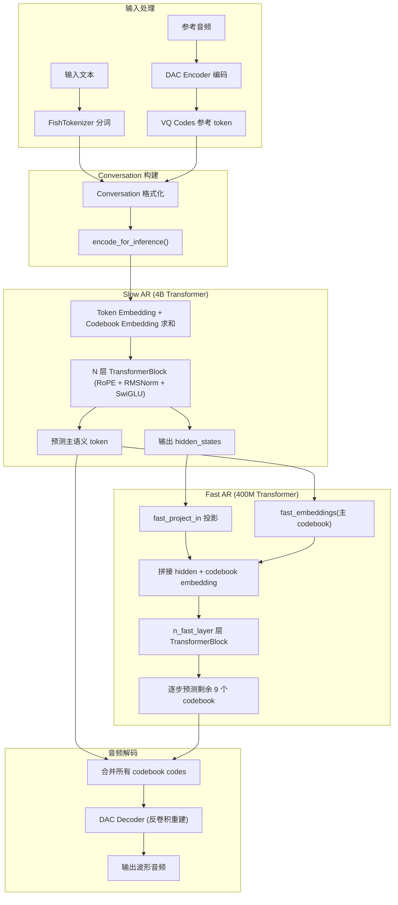
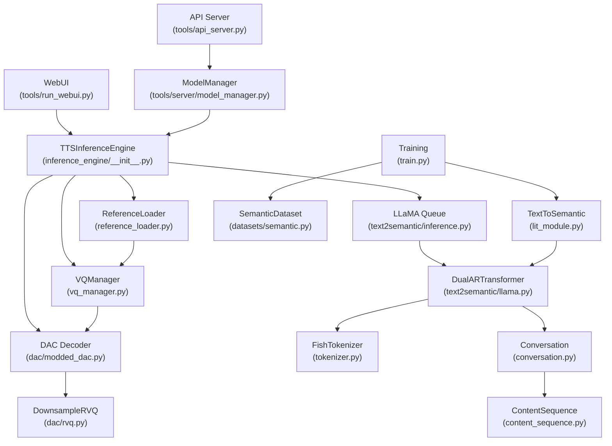
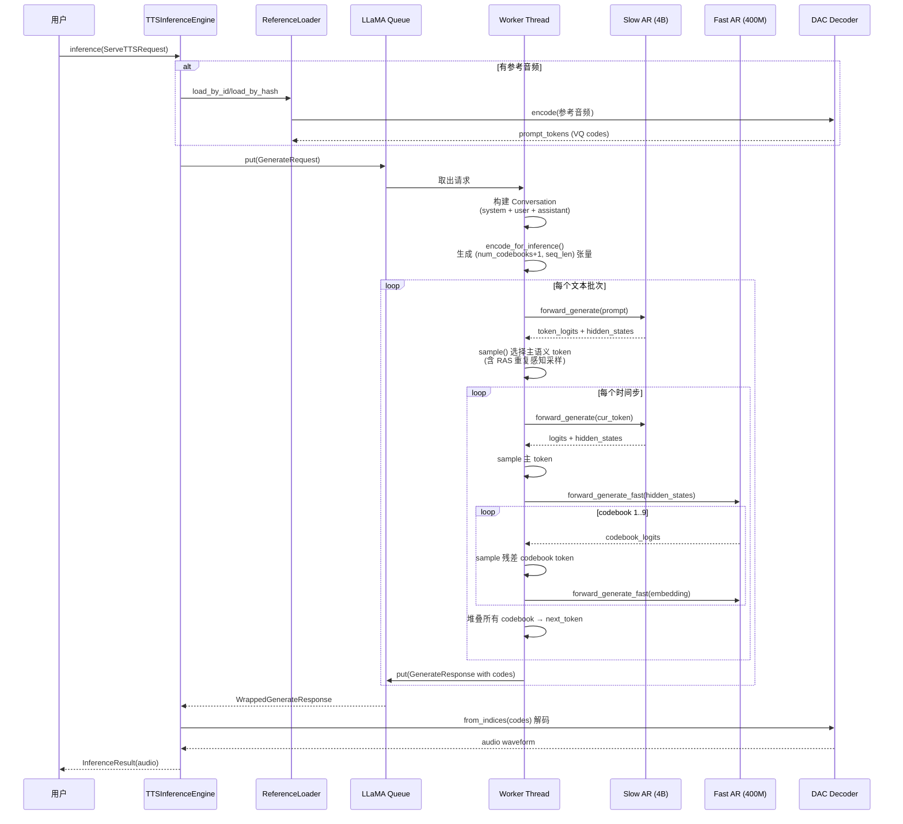
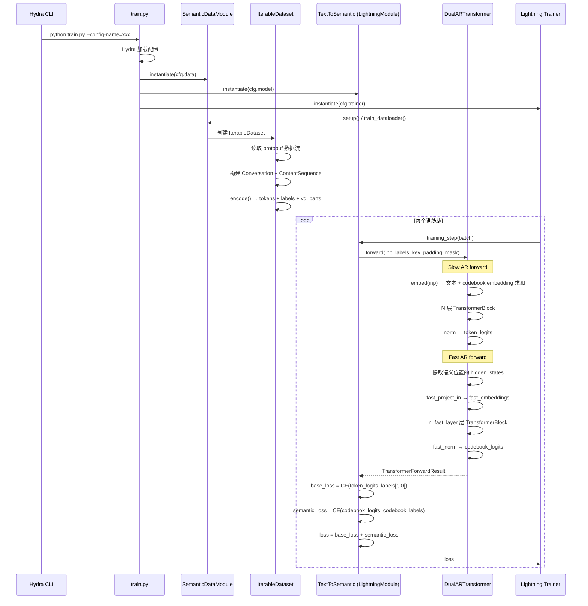

# fish-speech 源码学习笔记

> 仓库地址：[fish-speech](https://github.com/fishaudio/fish-speech)
> 学习日期：2026-04-05

---

> **以下为 AI 源码分析**
>
> ### 一句话概括
>
> Fish Speech 是由 Fish Audio 开发的先进多语言文本转语音（TTS）系统，采用创新的 Dual-AR（双自回归）架构，支持 80+ 语言、细粒度情感控制和快速语音克隆。
>
> ### 要点速览
>
> | 核心模块 | 职责 | 关键文件 |
> |---------|------|---------|
> | Slow AR (Text2Semantic) | 4B 参数的 decoder-only transformer，沿时间轴预测主语义 codebook | `fish_speech/models/text2semantic/llama.py` |
> | Fast AR | 400M 参数的快速 transformer，在每个时间步生成剩余 9 个残差 codebook | `fish_speech/models/text2semantic/llama.py` (DualARTransformer) |
> | DAC Codec | 基于 DAC 的 RVQ 音频编解码器，10 codebooks，~21Hz | `fish_speech/models/dac/modded_dac.py`, `fish_speech/models/dac/rvq.py` |
> | TTSInferenceEngine | 推理引擎，串联 Llama 队列和解码器 | `fish_speech/inference_engine/__init__.py` |
> | API Server | 基于 Kui + Uvicorn 的 REST API 服务 | `tools/api_server.py`, `tools/server/views.py` |
> | WebUI | 基于 Gradio 的交互式推理界面 | `tools/run_webui.py`, `tools/webui/` |
> | Training | 基于 PyTorch Lightning + Hydra 的训练框架 | `fish_speech/train.py`, `fish_speech/models/text2semantic/lit_module.py` |

---

## 项目简介

Fish Speech（Fish Audio S2 Pro）是一个最先进的多模态 TTS 系统，训练于超过 **1000 万小时**音频数据。项目的核心价值在于：

1. **Dual-AR 架构**：Slow AR（4B）负责语义预测，Fast AR（400M）负责声学细节重建，兼顾质量与速度
2. **细粒度控制**：支持 15000+ 内联 tag（如 `[whisper]`、`[excited]`），实现子词级别的韵律和情感控制
3. **多语言支持**：覆盖 80+ 语言，无需音素或语言特定预处理
4. **快速语音克隆**：仅需 10-30 秒参考音频即可克隆音色
5. **高性能推理**：原生兼容 SGLang 加速，单 H200 GPU 可达 RTF 0.195、TTFA ~100ms

## 技术栈

| 类别 | 技术 |
|------|------|
| 语言 | Python 3.10+, TypeScript (WebUI) |
| 框架 | PyTorch 2.8, PyTorch Lightning, Transformers, Gradio |
| 构建工具 | setuptools, Docker, Vite (WebUI) |
| 依赖管理 | uv (pyproject.toml), npm (awesome_webui) |
| 配置管理 | Hydra, OmegaConf |
| API 框架 | Kui (ASGI), Uvicorn |
| 测试框架 | 未见独立测试框架配置 |

## 目录结构

```
fish-speech/
├── fish_speech/                   # 核心库
│   ├── models/
│   │   ├── text2semantic/         # Dual-AR 语言模型（核心）
│   │   │   ├── llama.py           # BaseTransformer, DualARTransformer, NaiveTransformer
│   │   │   ├── inference.py       # 推理逻辑：generate, decode_one_token_ar, generate_long
│   │   │   ├── lit_module.py      # Lightning 训练模块 TextToSemantic
│   │   │   └── lora.py            # LoRA 微调支持
│   │   └── dac/                   # 音频编解码器
│   │       ├── modded_dac.py      # DAC 模型：Encoder, Decoder, Transformer
│   │       ├── rvq.py             # DownsampleResidualVectorQuantize (残差向量量化)
│   │       └── inference.py       # 编解码器加载与推理
│   ├── inference_engine/          # 高层推理引擎
│   │   ├── __init__.py            # TTSInferenceEngine（核心入口）
│   │   ├── reference_loader.py    # 参考音频加载与缓存
│   │   └── vq_manager.py          # VQ token 编解码管理
│   ├── configs/                   # Hydra 配置文件
│   ├── datasets/                  # 数据集处理（Protobuf + IterableDataset）
│   ├── tokenizer.py               # FishTokenizer：基于 HuggingFace 的语义 token 包装
│   ├── conversation.py            # 多轮对话格式（Message + Conversation）
│   ├── content_sequence.py        # 多模态内容序列（TextPart, VQPart, AudioPart）
│   ├── train.py                   # 训练入口（Hydra CLI）
│   ├── scheduler.py               # 学习率调度器
│   ├── callbacks/                 # Lightning Callbacks
│   ├── text/                      # 文本清洗
│   ├── i18n/                      # 国际化
│   └── utils/                     # 工具函数
├── tools/                         # 工具脚本与服务
│   ├── api_server.py              # REST API 服务入口
│   ├── run_webui.py               # WebUI 启动入口
│   ├── api_client.py              # API 客户端
│   ├── server/                    # API 服务内部模块
│   │   ├── views.py               # API 路由定义（/v1/tts, /v1/vqgan/*）
│   │   ├── model_manager.py       # 模型生命周期管理
│   │   ├── inference.py           # 推理包装器
│   │   └── model_utils.py         # VQGAN 编解码工具
│   ├── webui/                     # Gradio WebUI
│   ├── llama/                     # LLaMA 工具（量化、LoRA 合并、数据集构建）
│   └── vqgan/                     # VQGAN 工具（VQ 提取、训练集划分）
├── awesome_webui/                 # React + Vite 前端 WebUI
├── docker/                        # Docker 构建文件
├── docs/                          # 多语言文档（MkDocs）
└── pyproject.toml                 # 项目配置与依赖
```

## 架构设计

### 整体架构

Fish Speech S2 采用了 **Dual-Autoregressive（Dual-AR）** 架构，将 TTS 任务分解为两个协同工作的自回归模型：

1. **Slow AR（主 Transformer，4B）**：基于 decoder-only transformer，沿时间轴逐步预测主语义 codebook token。它接收文本 token 和多 codebook embedding 的求和作为输入，通过 RoPE 位置编码和 RMSNorm 归一化处理序列。
2. **Fast AR（辅助 Transformer，400M）**：在 Slow AR 预测出每个时间步的主 codebook 后，Fast AR 在该时间步内沿 codebook 维度自回归生成剩余的 9 个残差 codebook，重建精细声学细节。
3. **DAC Codec**：基于 Descript Audio Codec 改进的因果卷积音频编解码器，结合 DownsampleRVQ 实现 10 codebook、~21Hz 的音频量化。



### 核心模块

#### 1. Text2Semantic 语言模型

**职责**：将文本 token 序列转换为语义 codebook token 序列，是整个 TTS 系统的大脑。

**核心文件**：
- `fish_speech/models/text2semantic/llama.py` — 模型定义
- `fish_speech/models/text2semantic/inference.py` — 推理逻辑
- `fish_speech/models/text2semantic/lit_module.py` — 训练模块

**关键类与函数**：

| 类/函数 | 职责 |
|---------|------|
| `BaseModelArgs` / `DualARModelArgs` | 模型超参数配置（dataclass） |
| `BaseTransformer` | Slow AR 基础模型：embedding、N 层 TransformerBlock、RMSNorm |
| `DualARTransformer` | 继承 BaseTransformer，添加 Fast AR 分支（fast_layers, fast_embeddings） |
| `TransformerBlock` | 标准 transformer block：Attention + FeedForward + RMSNorm |
| `Attention` | 合并 QKV 投影（wqkv）、RoPE、GQA、KV Cache |
| `FeedForward` | SwiGLU FFN（w1/w3 gate + w2 down） |
| `KVCache` | 推理时的 Key-Value 缓存 |
| `decode_one_token_ar()` | 单步解码：Slow AR 预测主 token → Fast AR 逐个预测残差 codebook |
| `generate()` | 完整生成流程：prefill + decode_n_tokens |
| `generate_long()` | 长文本生成：按 speaker 分批、迭代式对话上下文累积 |
| `launch_thread_safe_queue()` | 线程安全的推理队列，支持并发请求 |

**Embedding 设计（`BaseTransformer.embed()`）**：
- `inp[:, 0]`（第一行）经 `self.embeddings` 映射为文本 embedding
- `inp[:, 1:]`（后续行）经 `self.codebook_embeddings` 映射为各 codebook embedding，按 offset 区分不同 codebook
- 两者相加作为最终输入，语义 token 位置才会叠加 codebook embedding

#### 2. DAC 音频编解码器

**职责**：将原始音频编码为离散 VQ codes，以及将 VQ codes 解码回波形音频。

**核心文件**：
- `fish_speech/models/dac/modded_dac.py` — 编解码器主体
- `fish_speech/models/dac/rvq.py` — 残差向量量化器

**关键类**：

| 类 | 职责 |
|---|------|
| `DAC` | 顶层编解码器：Encoder → Quantizer → Decoder |
| `Encoder` | 因果卷积编码器：Conv1d → EncoderBlock（ResidualUnit × 3 + 下采样）→ 输出 latent |
| `Decoder` | 因果反卷积解码器：Conv1d → DecoderBlock（上采样 + ResidualUnit × 3）→ 输出波形 |
| `WindowLimitedTransformer` | 窗口限制注意力 Transformer，用于编码器/解码器内部 |
| `DownsampleResidualVectorQuantize` | 下采样 RVQ：先降采样 → semantic_quantizer（1 codebook）+ residual_quantizer（9 codebooks）→ 上采样 |

**编码流程**：`audio → Encoder → downsample → semantic_quantizer + residual_quantizer → codes (10 codebooks)`

**解码流程**：`codes → semantic decode + residual decode → upsample → Decoder → waveform`

#### 3. 推理引擎（TTSInferenceEngine）

**职责**：协调 LLaMA 语言模型和 DAC 解码器，完成从文本到音频的端到端推理。

**核心文件**：
- `fish_speech/inference_engine/__init__.py` — TTSInferenceEngine
- `fish_speech/inference_engine/reference_loader.py` — 参考音频管理
- `fish_speech/inference_engine/vq_manager.py` — VQ 编解码管理

**设计要点**：
- `TTSInferenceEngine` 继承 `ReferenceLoader` 和 `VQManager`，通过多继承组合功能
- 使用 `queue.Queue` 实现线程安全的 LLaMA 请求-响应通信
- 支持流式推理（streaming），逐段返回音频
- 参考音频支持按 ID 和按内容 hash 两种缓存策略

#### 4. Tokenizer 与对话系统

**职责**：处理文本分词、语义 token 映射、多轮对话格式化。

**核心文件**：
- `fish_speech/tokenizer.py` — FishTokenizer
- `fish_speech/conversation.py` — Conversation, Message
- `fish_speech/content_sequence.py` — ContentSequence, TextPart, VQPart

**对话格式**：
```
<|im_start|>system
convert the provided text to speech reference to the following:
Text: <|speaker:0|>参考文本
Speech: [VQ codes]<|im_end|>
<|im_start|>user
<|speaker:0|>要合成的文本<|im_end|>
<|im_start|>assistant
<|voice|>[生成的 VQ codes]<|im_end|>
```

#### 5. API Server

**职责**：提供 HTTP REST API，支持 TTS 合成、VQGAN 编解码、参考音频管理。

**核心文件**：
- `tools/api_server.py` — 服务入口（Kui + Uvicorn）
- `tools/server/views.py` — 路由定义
- `tools/server/model_manager.py` — 模型管理

**API 端点**：

| 端点 | 方法 | 功能 |
|------|------|------|
| `/v1/tts` | POST | 文本转语音（支持流式） |
| `/v1/vqgan/encode` | POST | 音频编码为 VQ codes |
| `/v1/vqgan/decode` | POST | VQ codes 解码为音频 |
| `/v1/references/add` | POST | 添加参考音色 |
| `/v1/references/list` | GET | 列出参考音色 |
| `/v1/references/delete` | DELETE | 删除参考音色 |
| `/v1/references/update` | POST | 重命名参考音色 |
| `/v1/health` | GET/POST | 健康检查 |

### 模块依赖关系



## 核心流程

### 流程一：文本转语音（TTS）推理

这是项目最核心的业务流程，从用户输入文本到生成音频的完整调用链。



**关键逻辑说明**：

1. **Conversation 构建**：将参考音频的 VQ codes 和文本组合成 chat 格式的多轮对话，利用 `<|im_start|>/<|im_end|>` 和 `<|speaker:N|>` 标记
2. **Constrained Decoding**：通过 `semantic_logit_bias` 限制 Slow AR 只能输出语义 token 范围内的 token + `<|im_end|>`
3. **RAS（Repetition Aware Sampling）**：维护一个滑动窗口（10 token），如果新采样的 token 出现在窗口中，则使用高温度重新采样，防止重复
4. **迭代式长文本生成**：按 speaker 分割文本，分批生成，每批结果作为上下文传入下一批

### 流程二：模型训练



**训练关键点**：
- **数据格式**：使用 Protobuf 序列化的流式数据集，按 speaker 自动拼接多句话
- **双损失**：`base_loss`（主 token 预测）+ `semantic_loss`（codebook 预测），两者相加
- **梯度检查点**：`use_gradient_checkpointing=True`，在 TransformerBlock 上启用以节省显存
- **LoRA 支持**：训练时可选择仅训练 LoRA 参数，checkpoint 仅保存 LoRA 权重

## 关键设计亮点

### 1. Dual-AR 非对称架构

**解决的问题**：传统 autoregressive TTS 需要在音质和速度之间权衡。多 codebook 逐层预测太慢，单步预测所有 codebook 质量不够。

**实现方式**：`DualARTransformer`（`llama.py:660`）将模型分为两个异构的 AR 模块：
- Slow AR（4B，大模型）沿时间轴预测，确保语义连贯
- Fast AR（400M，小模型）沿 codebook 轴预测，快速重建声学细节
- Fast AR 的 KV Cache 尺寸仅为 `num_codebooks`（通常 10），极度紧凑

**设计理由**：这种非对称设计让 Slow AR 聚焦于高层语义决策（需要大模型），而声学细节的残差预测相对简单（小模型即可）。由于结构同构于标准 LLM，可直接复用 SGLang 的 Continuous Batching、Paged KV Cache 等加速技术。

### 2. Repetition Aware Sampling (RAS)

**解决的问题**：自回归生成容易陷入 token 重复循环，导致音频质量严重下降。

**实现方式**：`decode_one_token_ar()`（`inference.py:96`）维护一个大小为 10 的滑动窗口 `previous_tokens`，每次生成时同时用正常温度和高温度采样两个候选 token。如果正常采样的 token 属于语义 token 且出现在滑动窗口中，则切换为高温度采样结果。

**设计理由**：避免全局提高温度（会降低整体质量），仅在检测到重复风险时局部干预。使用纯 tensor 操作（`torch.where`）而非 Python 分支，保证 `torch.compile` 兼容性。

### 3. Conversation-based 对话式 TTS 格式

**解决的问题**：传统 TTS 系统将参考音频、文本、输出音频作为独立输入，难以利用上下文信息。

**实现方式**：`conversation.py` 和 `content_sequence.py` 将 TTS 任务建模为 LLM 的多轮对话：
- system message 包含参考音频的文本和 VQ codes
- user message 包含待合成文本
- assistant message 包含生成的 VQ codes
- 多批次生成时，前一批的输出自动成为下一批的上下文

**设计理由**：复用 LLM 的 in-context learning 能力，让模型通过对话上下文学习目标音色和风格，无需额外的 speaker embedding 或 adapter。同时支持多说话人对话场景（`<|speaker:N|>` token）。

### 4. DownsampleRVQ 带语义分离的向量量化

**解决的问题**：标准 RVQ 的所有 codebook 混合编码语义和声学信息，不利于语言模型建模。

**实现方式**：`DownsampleResidualVectorQuantize`（`rvq.py:204`）在量化前先对 latent 做下采样（降低时间分辨率），然后：
- `semantic_quantizer`（1 codebook，4096 词表）：捕获高层语义信息
- `quantizer`（9 codebooks，1024 词表）：捕获残差声学细节
- 最终 `z = semantic_z + residual_z`，解码时反向操作

**设计理由**：将第一个 codebook 的语义信息与剩余 codebook 的声学细节解耦，完美匹配 Dual-AR 架构——Slow AR 只需预测语义 codebook，Fast AR 预测残差 codebook。

### 5. 线程安全的异步推理队列

**解决的问题**：深度学习模型不支持多线程并发访问，但 API 服务器需要处理多个并发请求。

**实现方式**：`launch_thread_safe_queue()`（`inference.py:748`）创建一个独立的 worker 线程持有模型，通过 `queue.Queue` 接收请求。每个请求携带自己的 `response_queue`，worker 线程将结果逐段推送回去。

**设计理由**：避免了多进程方案的显存浪费（每个进程加载一份模型），也避免了多线程直接访问 GPU tensor 的竞态问题。生产者-消费者模式天然序列化了 GPU 访问，同时对调用方透明。
