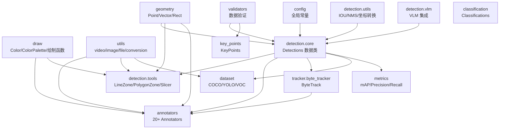
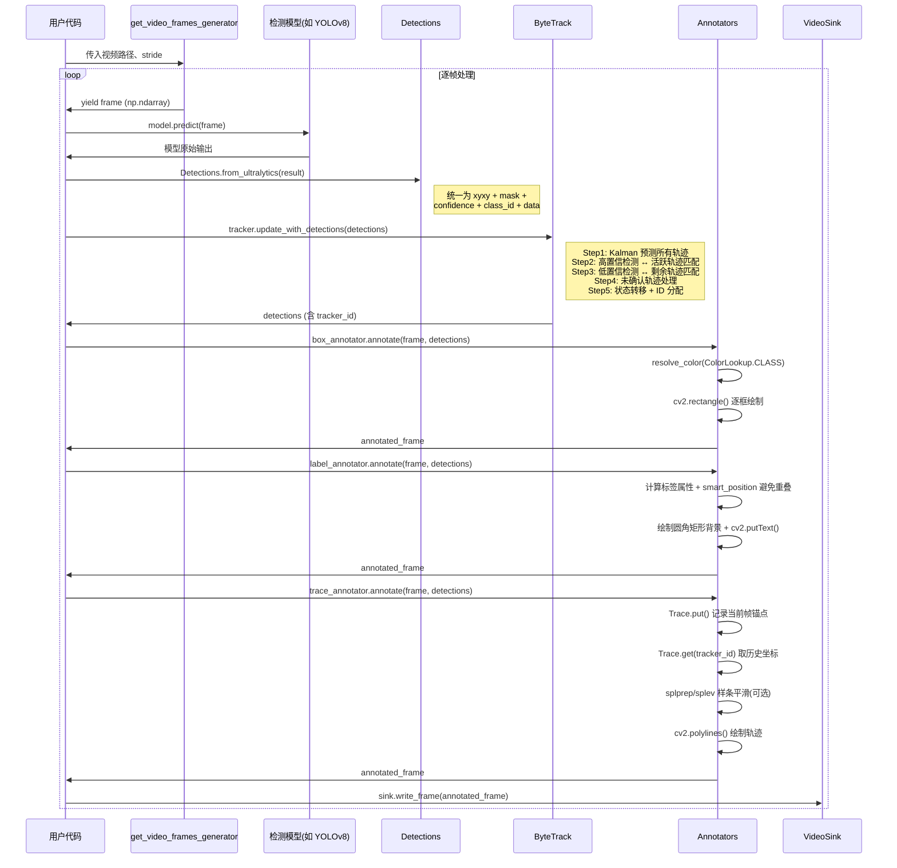
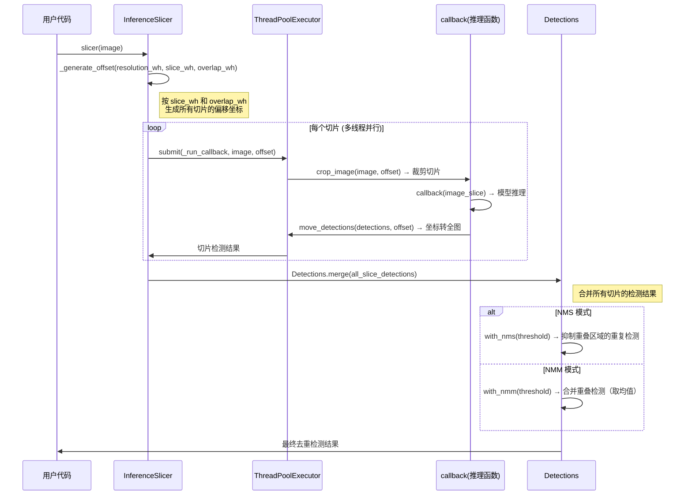

# supervision 源码学习笔记

> 仓库地址：[supervision](https://github.com/roboflow/supervision)
> 学习日期：2026-04-05

---

> **以下为 AI 源码分析**
>
> ### 一句话概括
>
> Supervision 是 Roboflow 开源的计算机视觉工具库，提供模型无关的检测数据结构、丰富的可视化注解器、多目标追踪、数据集格式转换和评估指标，让 CV 项目的后处理工作变得简洁统一。
>
> ### 要点速览
>
> | 核心模块 | 职责 | 关键文件 |
> |---------|------|---------|
> | detection | 统一检测数据结构 Detections，支持 10+ 模型框架适配 | `detection/core.py` |
> | annotators | 20+ 种可视化注解器（框、掩码、热力图、轨迹等） | `annotators/core.py` |
> | tracker | ByteTrack 多目标追踪（Kalman 滤波 + 匈牙利匹配） | `tracker/byte_tracker/core.py` |
> | dataset | 数据集加载/转换（COCO、YOLO、Pascal VOC） | `dataset/core.py`, `dataset/formats/` |
> | metrics | COCO 标准评估指标（mAP、Precision、Recall、F1） | `metrics/` |
> | key_points | 关键点检测数据结构与注解 | `key_points/core.py` |
> | utils | 视频/图像处理、颜色系统、几何计算等基础工具 | `utils/`, `draw/`, `geometry/` |

---

## 项目简介

Supervision 是一个面向计算机视觉任务的 Python 工具库，由 Roboflow 团队维护。它的核心理念是**模型无关**（model-agnostic）：无论使用 YOLOv8、Transformers、Detectron2 还是其他检测/分割模型，都可以通过统一的 `Detections` 数据结构进行后处理。项目提供了从检测结果可视化、目标追踪、数据集格式转换到模型评估的完整工具链，让开发者不必为每个 CV 项目重复编写这些通用逻辑。

## 技术栈

| 类别 | 技术 |
|------|------|
| 语言 | Python >= 3.9 |
| 框架 | NumPy + OpenCV + PIL（核心），可选集成 Ultralytics / Transformers / MediaPipe 等 |
| 构建工具 | setuptools (pyproject.toml) |
| 依赖管理 | pip / uv（uv.lock） |
| 测试框架 | pytest + tox |

## 目录结构

```
src/supervision/
├── __init__.py              # 统一导出所有公共 API（270 行导出列表）
├── config.py                # 全局常量定义（CLASS_NAME_DATA_FIELD 等）
├── validators/              # 数据验证函数（xyxy、mask、confidence 格式校验）
│
├── detection/               # 核心检测模块
│   ├── core.py              # Detections 数据类：10+ from_xxx 适配器、过滤/合并/NMS
│   ├── line_zone.py         # LineZone 线计数器（向量叉积判断穿线方向）
│   ├── vlm.py               # VLM/LMM 视觉语言模型集成（PaliGemma、Gemini 等）
│   ├── tools/               # 高级工具
│   │   ├── polygon_zone.py  # PolygonZone 多边形区域检测
│   │   ├── inference_slicer.py  # 切片推理（大图分块 + 多线程）
│   │   ├── csv_sink.py      # CSV 持久化（流式写入）
│   │   ├── json_sink.py     # JSON 持久化（内存缓存 + 统一写入）
│   │   └── smoother.py      # 检测平滑器（滑动窗口均值）
│   └── utils/               # 检测算法工具
│       ├── iou_and_nms.py   # IOU 计算、NMS/NMM 算法
│       ├── converters.py    # 坐标格式转换（xyxy/xywh/xcycwh/mask/polygon）
│       ├── boxes.py         # 边界框操作（裁剪、填充、平移、缩放）
│       ├── masks.py         # 掩码操作（质心、空洞检测、平移）
│       └── polygons.py      # 多边形简化
│
├── annotators/              # 可视化注解模块
│   ├── base.py              # BaseAnnotator 抽象基类
│   ├── core.py              # 20+ Annotator 实现（3200+ 行）
│   └── utils.py             # ColorLookup 策略、Trace 轨迹、标签布局工具
│
├── tracker/                 # 目标追踪模块
│   └── byte_tracker/
│       ├── core.py          # ByteTrack 主类（两阶段匹配策略）
│       ├── single_object_track.py  # STrack 状态机
│       ├── kalman_filter.py # 8 维 Kalman 滤波器
│       ├── matching.py      # IOU 距离 + 匈牙利匹配
│       └── utils.py         # ID 计数器
│
├── dataset/                 # 数据集模块
│   ├── core.py              # DetectionDataset / ClassificationDataset
│   ├── utils.py             # RLE 编解码、类别映射、数据集分割
│   └── formats/             # 格式转换
│       ├── coco.py          # COCO JSON 格式
│       ├── yolo.py          # YOLO TXT + data.yaml 格式
│       └── pascal_voc.py    # Pascal VOC XML 格式
│
├── metrics/                 # 评估指标模块
│   ├── core.py              # Metric 基类、MetricTarget、AveragingMethod
│   ├── detection.py         # ConfusionMatrix、MeanAveragePrecision（COCO 标准）
│   ├── mean_average_precision.py  # mAP 完整实现（1500+ 行）
│   ├── mean_average_recall.py     # mAR 实现
│   ├── precision.py         # Precision 指标
│   ├── recall.py            # Recall 指标
│   └── f1_score.py          # F1 Score 指标
│
├── key_points/              # 关键点模块
│   ├── core.py              # KeyPoints 数据类（3D 数组：对象 x 关键点 x 坐标）
│   ├── annotators.py        # VertexAnnotator / EdgeAnnotator / VertexLabelAnnotator
│   └── skeletons.py         # 骨架定义（COCO 17 点、MediaPipe 33 点等）
│
├── classification/          # 分类模块
│   └── core.py              # Classifications 数据类（from_ultralytics/clip/timm）
│
├── draw/                    # 绘制基础模块
│   ├── color.py             # Color / ColorPalette 颜色系统
│   └── utils.py             # 基础绘制函数（线、矩形、多边形、文本、图像合成）
│
├── geometry/                # 几何模块
│   ├── core.py              # Point / Vector / Rect / Position 基础类型
│   └── utils.py             # 多边形质心计算（Shoelace 公式）
│
├── utils/                   # 通用工具模块
│   ├── video.py             # VideoInfo / VideoSink / 帧生成器 / 三阶段流水线
│   ├── image.py             # ImageSink / 裁剪 / 缩放 / letterbox / 着色
│   ├── file.py              # 文件 I/O 工具（txt/json/yaml）
│   ├── notebook.py          # Jupyter 可视化（plot_image / plot_images_grid）
│   └── conversion.py        # PIL/OpenCV 格式互转 + 装饰器
│
└── assets/                  # 内置资产（示例图像/视频下载）
```

## 架构设计

### 整体架构

Supervision 采用**以 Detections 为核心的管道架构**。所有模块围绕统一的 `Detections` 数据结构协作：模型适配器将各种模型输出转换为 `Detections`，下游模块（追踪、可视化、持久化、评估）消费 `Detections` 完成各自任务。这种设计实现了模型层与后处理层的彻底解耦。

```mermaid
graph TD
    subgraph 模型层["模型层（Model-Agnostic）"]
        YOLOv8["YOLOv8/YOLO11"]
        Transformers["HuggingFace Transformers"]
        Detectron2["Detectron2"]
        Inference["Roboflow Inference"]
        VLM["VLM/LMM（Gemini 等）"]
        Others["YOLO-NAS / MMDet / PaddleDet..."]
    end

    subgraph 核心层["核心数据层"]
        Detections["Detections<br/>xyxy | mask | confidence<br/>class_id | tracker_id | data"]
        KeyPoints["KeyPoints<br/>xy(n,m,2) | confidence"]
        Classifications["Classifications<br/>class_id | confidence"]
    end

    subgraph 处理层["后处理层"]
        NMS["NMS / NMM<br/>过滤与合并"]
        Slicer["InferenceSlicer<br/>切片推理"]
        Smoother["DetectionsSmoother<br/>检测平滑"]
    end

    subgraph 追踪层["追踪层"]
        ByteTrack["ByteTrack<br/>Kalman + 匈牙利匹配"]
    end

    subgraph 可视化层["可视化层"]
        BoxAnn["BoxAnnotator"]
        MaskAnn["MaskAnnotator"]
        LabelAnn["LabelAnnotator"]
        TraceAnn["TraceAnnotator"]
        HeatMap["HeatMapAnnotator"]
        MoreAnn["15+ 其他 Annotators"]
    end

    subgraph 工具层["工具与输出层"]
        LineZone["LineZone 线计数"]
        PolyZone["PolygonZone 区域检测"]
        CSVSink["CSVSink"]
        JSONSink["JSONSink"]
        VideoSink["VideoSink"]
        Dataset["DetectionDataset<br/>COCO / YOLO / VOC"]
        Metrics["Metrics<br/>mAP / Precision / Recall / F1"]
    end

    YOLOv8 -->|from_ultralytics| Detections
    Transformers -->|from_transformers| Detections
    Detectron2 -->|from_detectron2| Detections
    Inference -->|from_inference| Detections
    VLM -->|from_vlm| Detections
    Others -->|from_xxx| Detections

    Detections --> NMS
    Detections --> Slicer
    Detections --> Smoother
    NMS --> Detections
    Slicer --> Detections
    Smoother --> Detections

    Detections --> ByteTrack
    ByteTrack -->|添加 tracker_id| Detections

    Detections --> BoxAnn
    Detections --> MaskAnn
    Detections --> LabelAnn
    Detections --> TraceAnn
    Detections --> HeatMap
    Detections --> MoreAnn

    Detections --> LineZone
    Detections --> PolyZone
    Detections --> CSVSink
    Detections --> JSONSink
    Detections --> Dataset
    Detections --> Metrics
```



### 核心模块

#### 1. Detection 模块 — 统一检测数据结构

**职责**：定义 `Detections` 数据类，作为整个库的数据枢纽。

**核心文件**：`detection/core.py`（2500+ 行）

**Detections 数据结构**：

```python
@dataclass
class Detections:
    xyxy: np.ndarray           # (n, 4) 必需：边界框 [x1, y1, x2, y2]
    mask: np.ndarray | None    # (n, H, W) 可选：实例分割掩码
    confidence: np.ndarray | None  # (n,) 可选：置信度
    class_id: np.ndarray | None    # (n,) 可选：类别 ID
    tracker_id: np.ndarray | None  # (n,) 可选：追踪 ID
    data: dict                     # 自定义扩展数据（类名、OBB 坐标等）
    metadata: dict                 # 集合级元数据
```

**关键方法体系**：

| 类别 | 方法 | 说明 |
|------|------|------|
| 工厂方法 | `from_ultralytics()`, `from_transformers()`, `from_detectron2()`, `from_inference()` 等 10+ | 适配各种模型输出 |
| 过滤 | `__getitem__()` 支持布尔掩码、整数、切片索引 | `detections[detections.confidence > 0.5]` |
| 合并 | `merge(detections_list)` | 纵向堆叠多个 Detections |
| NMS | `with_nms(threshold)` | 非最大抑制，支持 IOU/IOS 度量 |
| NMM | `with_nmm(threshold)` | 非最大合并（合并重叠检测而非丢弃） |
| 属性 | `area`, `box_area`, `is_empty()` | 计算属性 |

**NMS 算法核心逻辑**（`detection/utils/iou_and_nms.py`）：
1. 按置信度降序排列预测框
2. 计算所有框对之间的 IOU 矩阵（NumPy 向量化）
3. 贪心抑制：保留高置信度框，删除与其 IOU > 阈值的同类框
4. 内存优化：大规模掩码 IOU 计算自动分批处理（默认 5GB 内存限制）

#### 2. Annotators 模块 — 可视化注解

**职责**：提供 20+ 种标注器，在图像上绘制检测、掩码、轨迹、热力图等。

**核心文件**：`annotators/core.py`（3200+ 行）、`annotators/utils.py`

**设计模式**：
- **统一接口**：所有 Annotator 继承 `BaseAnnotator`，实现 `annotate(scene, detections) -> scene`
- **策略模式**：`ColorLookup` 枚举（INDEX / CLASS / TRACK / 自定义数组）控制颜色映射
- **装饰器模式**：`@ensure_cv2_image_for_class_method` 自动处理 PIL / OpenCV 格式互转

**主要 Annotator 分类**：

| 类别 | Annotators | 特点 |
|------|-----------|------|
| 几何框 | BoxAnnotator, BoxCornerAnnotator, CircleAnnotator, EllipseAnnotator, TriangleAnnotator, OrientedBoxAnnotator | 基础 cv2 绘制 |
| 掩码类 | MaskAnnotator, PolygonAnnotator, HaloAnnotator | 需要 mask 数据，面积排序防覆盖 |
| 效果类 | BlurAnnotator, PixelateAnnotator, ColorAnnotator, BackgroundOverlayAnnotator | 动态参数自适应 |
| 标签类 | LabelAnnotator (OpenCV), RichLabelAnnotator (PIL, 支持 Unicode) | smart_position 避免重叠 |
| 追踪类 | TraceAnnotator | 样条曲线平滑、历史轨迹管理 |
| 分析类 | HeatMapAnnotator | HSV 色调映射、多帧热力累积 |

**HeatMapAnnotator 核心算法**：
1. 在每个检测锚点绘制圆形热点 → 累积到 heat_mask
2. 归一化 heat_mask → 映射到 HSV 色调空间（蓝=冷 → 红=热）
3. HSV → BGR 颜色转换 → 与原图混合

#### 3. Tracker 模块 — ByteTrack 多目标追踪

**职责**：基于 ByteTrack 算法的在线多目标追踪，为 Detections 分配 tracker_id。

**核心文件**：`tracker/byte_tracker/core.py`、`single_object_track.py`、`kalman_filter.py`、`matching.py`

**STrack 状态机**：

```
New(新检测) → Tracked(活跃追踪) ⇄ Lost(丢失) → Removed(删除)
```

- `minimum_consecutive_frames`：连续出现 N 帧才激活，防止闪烁
- `lost_track_buffer`：丢失后保留 N 帧缓冲，处理短暂遮挡

**Kalman 滤波器**：8 维状态空间 `[x, y, aspect_ratio, height, vx, vy, va, vh]`，常速运动模型。

**ByteTrack 5 步更新算法**：

| 步骤 | 操作 | 策略 |
|------|------|------|
| 1 | 检测分类 | 高置信度 > threshold、低置信度 0.1~threshold |
| 2 | 第一次关联 | 高置信检测 ↔ 活跃+丢失轨迹，IOU + 得分融合 |
| 3 | 第二次关联 | 低置信检测 ↔ 未匹配活跃轨迹，纯 IOU |
| 4 | 处理未确认 | 未确认轨迹 ↔ 剩余检测 |
| 5 | 状态转移 | 新建/丢失/删除/去重 |

#### 4. Dataset 模块 — 数据集管理

**职责**：加载、转换、分割、合并数据集，支持 COCO / YOLO / Pascal VOC 格式。

**核心文件**：`dataset/core.py`、`dataset/formats/`

**坐标格式对照**：

| 格式 | 坐标表示 | 归一化 | 索引 |
|------|---------|-------|------|
| 内部 (XYXY) | `[x1, y1, x2, y2]` | 否 | 0-indexed |
| COCO | `[x, y, w, h]` 左上角 | 否 | 0-indexed |
| YOLO | `[xc, yc, w, h]` 中心 | 是 | 0-indexed |
| Pascal VOC | `[x1, y1, x2, y2]` | 否 | 1-indexed |

**关键特性**：延迟加载（路径列表）支持大数据集，RLE 编解码处理 COCO 掩码。

#### 5. Metrics 模块 — 评估指标

**职责**：COCO 标准评估指标，支持按对象大小（小/中/大）和 IoU 阈值分维度分析。

**核心文件**：`metrics/mean_average_precision.py`（1500+ 行）、`metrics/precision.py`、`metrics/recall.py`

**指标体系**：
- **mAP@50:95**：10 个 IoU 阈值 [0.50, 0.55, ..., 0.95] 的平均精度
- **Precision / Recall**：支持 MACRO / MICRO / WEIGHTED 三种聚合方式
- **F1 Score**：Precision 和 Recall 的调和平均

#### 6. Utils 模块 — 视频/图像/绘制/几何

**视频处理**（`utils/video.py`）：三阶段流水线架构（读取线程 → 主线程处理 → 写入线程），`process_video()` 支持 prefetch 队列和 writer buffer 避免阻塞。

**颜色系统**（`draw/color.py`）：`Color` 支持 RGB/BGR/HEX/RGBA 互转，`ColorPalette` 支持 Matplotlib 调色板集成。

**几何类型**（`geometry/core.py`）：`Point`、`Vector`（叉积判断方向）、`Rect`、`Position`（9 个锚点位置 + CENTER_OF_MASS）。

### 模块依赖关系



## 核心流程

### 流程一：检测 + 追踪 + 可视化管道

这是 Supervision 最典型的使用流程：从视频中逐帧检测目标、追踪目标、绘制标注并输出视频。



**关键设计要点**：
1. `Detections.from_ultralytics()` 自动提取 xyxy、confidence、class_id、mask、tracker_id（如模型内置追踪），并将类名存入 `data['class_name']`
2. `ByteTrack.update_with_detections()` 接收 Detections，返回新的 Detections（添加了 tracker_id），实现了追踪器与数据结构的解耦
3. 多个 Annotator 可链式调用：`frame = ann1.annotate(ann2.annotate(frame, det), det)`，每个 Annotator 只负责一种标注类型

### 流程二：InferenceSlicer 大图切片推理

处理高分辨率图像时，直接推理可能导致小目标漏检。InferenceSlicer 通过切片策略解决此问题。



**关键设计要点**：
1. **重叠区域处理**：相邻切片有 overlap_wh 像素重叠，确保边界目标不被截断
2. **坐标转换**：每个切片的检测结果通过 `move_detections(offset)` 映射回全图坐标
3. **去重策略**：提供 NMS（抑制冗余）和 NMM（合并冗余）两种重叠处理方式
4. **多线程加速**：`thread_workers` 参数控制并行推理线程数

## 关键设计亮点

### 1. 模型无关的 Detections 适配器模式

**解决的问题**：CV 领域模型输出格式碎片化（YOLOv8 返回 Boxes 对象、Transformers 返回字典、Detectron2 返回 Instances），每换一个模型就需要重写后处理代码。

**实现方式**：`detection/core.py` 中的 `from_xxx()` 类方法工厂，每个适配器负责将特定模型输出转换为统一的 `Detections` 数据结构。新增模型支持只需添加一个类方法，不影响现有代码。

**为什么这样设计**：将模型差异封装在适配器中，下游所有模块（追踪、可视化、评估）只依赖 `Detections` 接口，实现了 O(n+m) 的集成复杂度（n 个模型 + m 个功能），而非 O(n*m)。

### 2. ByteTrack 两阶段匹配策略

**解决的问题**：传统追踪器只使用高置信度检测进行匹配，低置信度检测被直接丢弃，导致在遮挡、模糊等场景下追踪中断。

**实现方式**：`tracker/byte_tracker/core.py` 中的 `update_with_tensors()` 方法：
- 第一阶段：高置信检测（> threshold）与所有活跃/丢失轨迹匹配（IOU + 得分融合）
- 第二阶段：低置信检测（0.1~threshold）与第一阶段未匹配的活跃轨迹匹配（纯 IOU）
- 结合 `minimum_consecutive_frames` 参数防止单帧噪声激活假轨迹

**为什么这样设计**：低置信度检测虽然不可靠，但在已有轨迹上下文中仍有价值。两阶段策略充分利用了检测器的全部输出，显著提升遮挡场景的追踪连续性。

### 3. 内存感知的掩码 IOU 计算

**解决的问题**：掩码 IOU 计算需要展开为 (N, M, H, W) 的 4D 张量进行逻辑运算，大量检测 + 高分辨率掩码会轻易耗尽内存。

**实现方式**：`detection/utils/iou_and_nms.py` 中的 `mask_iou_batch()` 函数：
```python
memory = N * M * H * W / 1024 / 1024  # 预估内存(MB)
if memory > memory_limit:  # 默认 5GB
    # 自动分批计算，每批限制在 memory_limit 内
    step = max(memory_limit * 1024**2 // M * H * W, 1)
    for i in range(0, N, step):
        ious[i:i+step] = _mask_iou_batch_split(masks[i:i+step], ...)
```

**为什么这样设计**：在保持 NumPy 向量化计算性能的同时，通过预估内存自动选择一次性计算还是分批计算，避免 OOM 崩溃。对用户透明，无需手动调参。

### 4. 三阶段视频处理流水线

**解决的问题**：视频处理中 I/O（读写）和计算（推理/标注）串行执行，GPU/CPU 利用率低下。

**实现方式**：`utils/video.py` 中的 `process_video()` 函数采用三线程流水线：
- **读取线程**：使用 `get_video_frames_generator()` 预取帧到 `frame_read_queue`（默认 32 帧缓冲）
- **主线程**：执行用户 callback（推理 + 标注）
- **写入线程**：从 `frame_write_queue` 取帧写入 `VideoSink`（默认 32 帧缓冲）

**为什么这样设计**：I/O 和计算并行化，读取线程始终领先于处理线程准备数据，写入线程异步消费结果。prefetch 和 writer_buffer 参数平衡了内存占用与吞吐量。

### 5. ColorLookup 策略模式 + 装饰器透明格式转换

**解决的问题**：
- 不同场景需要不同的颜色映射逻辑（按类别、按追踪 ID、按索引）
- OpenCV 和 PIL 格式混用导致代码冗余

**实现方式**：
- `annotators/utils.py` 中的 `ColorLookup` 枚举 + `resolve_color()` 函数：运行时根据策略选择颜色索引来源，支持 INDEX / CLASS / TRACK / 自定义 NumPy 数组
- `utils/conversion.py` 中的 `@ensure_cv2_image_for_class_method` 装饰器：自动检测输入格式，转换为 OpenCV 处理，处理完毕后转换回原格式

**为什么这样设计**：策略模式让颜色逻辑与绘制逻辑解耦，用户一行参数切换即可；装饰器让所有 Annotator 只需编写 NumPy 版本代码，PIL 支持自动获得，消除了大量样板代码。
