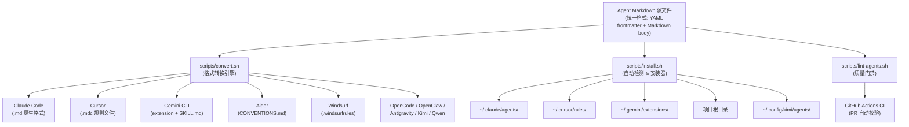
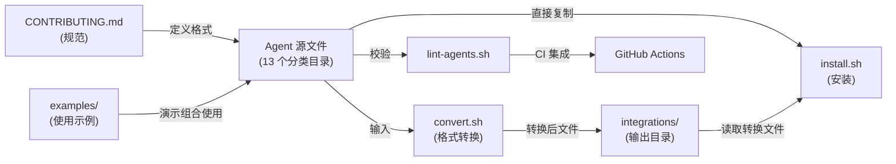
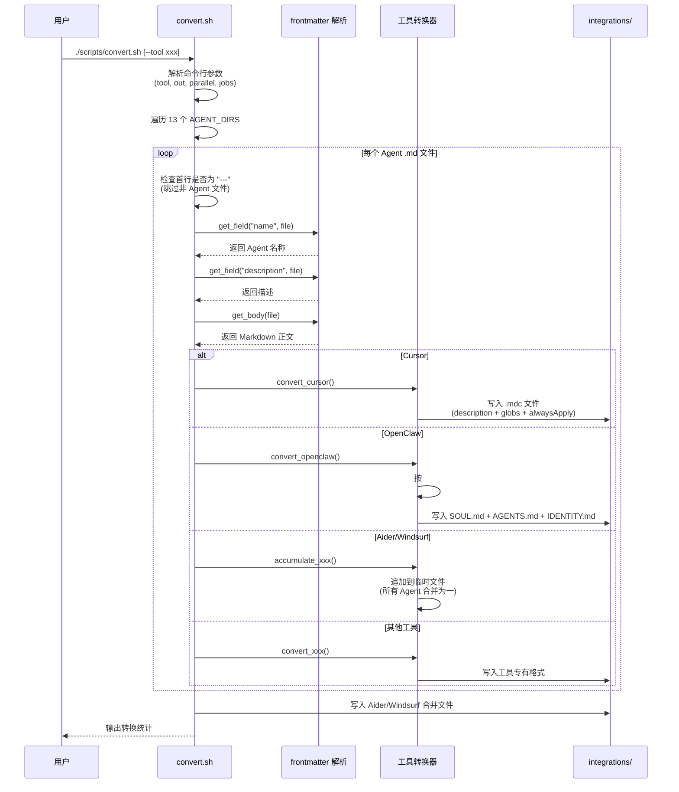
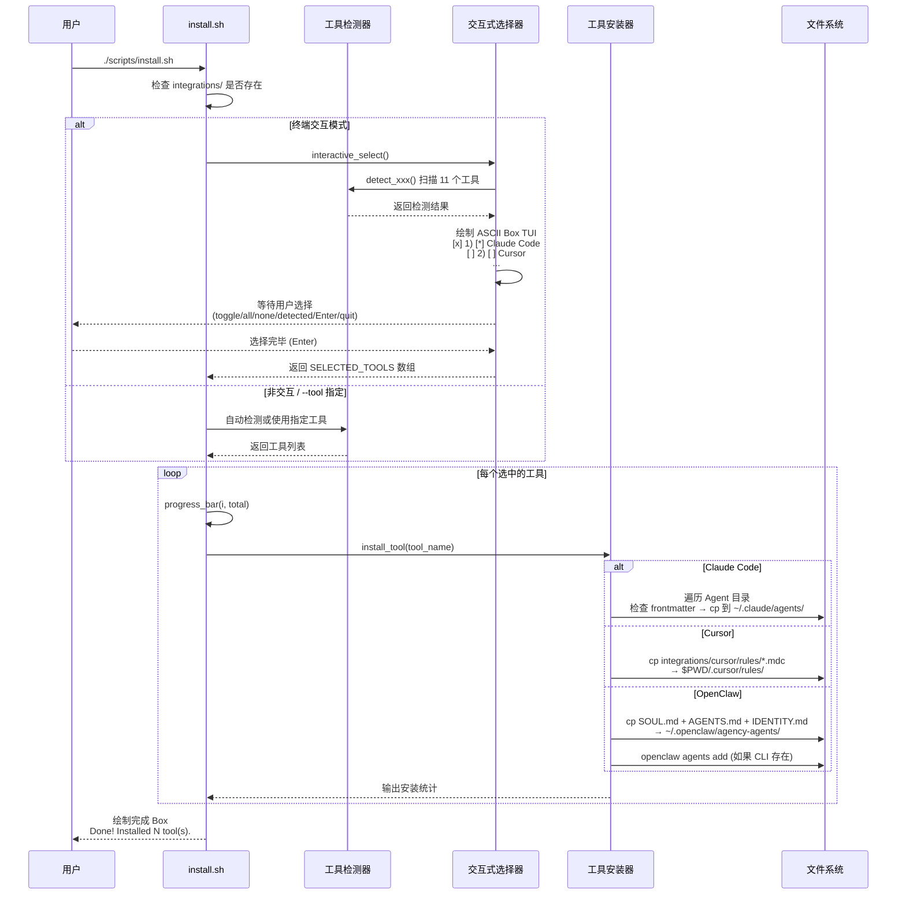

# agency-agents 源码学习笔记

> 仓库地址：[agency-agents](https://github.com/msitarzewski/agency-agents)
> 学习日期：2026-04-05

---

> **以下为 AI 源码分析**
>
> ### 一句话概括
>
> 一个精心设计的 AI Agent 人格集合仓库，提供 150+ 个专业化 Agent 提示词模板，覆盖工程、设计、营销、销售等 13 个业务领域，并支持 11 种 AI 编码工具的一键安装。
>
> ### 要点速览
>
> | 核心模块 | 职责 | 关键文件 |
> |---------|------|---------|
> | Agent 定义文件 | 各领域专业 Agent 的人格、技能、工作流定义 | `engineering/*.md`, `design/*.md`, `marketing/*.md` 等 13 个目录 |
> | 转换脚本 | 将统一格式的 Agent 文件转换为各工具专有格式 | `scripts/convert.sh` |
> | 安装脚本 | 自动检测并安装 Agent 到目标工具配置目录 | `scripts/install.sh` |
> | Lint 脚本 | 验证 Agent 文件的 frontmatter 和结构规范 | `scripts/lint-agents.sh` |
> | 集成适配层 | 存放转换后的各工具专有格式文件 | `integrations/` |
> | 示例工作流 | 展示多 Agent 协作的实际场景 | `examples/` |

---

## 项目简介

**The Agency** 是一个社区驱动的 AI Agent 人格集合库，起源于 Reddit 社区讨论并经过数月迭代。项目的核心理念是：每个 AI Agent 不应是泛泛的"通用助手"，而应具备**深度专业化、独特人格、可量化交付物和经过验证的工作流**。

项目提供了 150+ 个精心设计的 Agent 定义，覆盖从前端开发到区块链安全审计、从小红书运营到 visionOS 开发等广泛领域。每个 Agent 都以 Markdown + YAML frontmatter 的统一格式编写，通过工具链脚本可一键转换和安装到 Claude Code、Cursor、Gemini CLI、Aider 等 11 种主流 AI 编码工具中。

## 技术栈

| 类别 | 技术 |
|------|------|
| 语言 | Markdown (Agent 定义) + Bash (工具链脚本) |
| 框架 | 无代码框架，纯内容型项目 |
| 构建工具 | Shell 脚本 (`convert.sh`, `install.sh`) |
| 依赖管理 | 无外部依赖，纯 Bash 实现 |
| 测试框架 | `lint-agents.sh` (自定义 Bash Linter) + GitHub Actions CI |

## 目录结构

```
agency-agents/
├── engineering/              # 工程开发类 Agent（26 个：前端、后端、DevOps、安全等）
├── design/                   # 设计类 Agent（8 个：UI、UX、品牌、视觉叙事等）
├── marketing/                # 营销类 Agent（30 个：SEO、TikTok、小红书、微信等）
├── paid-media/               # 付费媒体类 Agent（7 个：PPC、程序化购买等）
├── sales/                    # 销售类 Agent（8 个：外拓、SDR、Deal 策略等）
├── product/                  # 产品类 Agent（5 个：PM、Sprint 优先级、行为助推等）
├── project-management/       # 项目管理类 Agent（6 个：制片人、项目经理、Jira 管理等）
├── testing/                  # 测试类 Agent（8 个：API 测试、性能基准、无障碍审计等）
├── support/                  # 运营支持类 Agent（6 个：客服、数据分析、财务等）
├── spatial-computing/        # 空间计算类 Agent（6 个：visionOS、WebXR 等）
├── specialized/              # 特殊领域 Agent（30+ 个：MCP Builder、Agent 编排器等）
├── academic/                 # 学术类 Agent（5 个：人类学、地理学、心理学等）
├── game-development/         # 游戏开发类 Agent（跨引擎 + Unity/Unreal/Godot/Roblox/Blender）
├── scripts/
│   ├── convert.sh            # Agent 格式转换脚本（统一格式 → 各工具专有格式）
│   ├── install.sh            # 自动检测 & 安装脚本（支持交互式 TUI 选择器）
│   └── lint-agents.sh        # Agent 文件结构校验脚本
├── integrations/             # 各工具集成说明和转换输出目录
│   ├── claude-code/          # Claude Code 直接使用
│   ├── cursor/               # Cursor .mdc 规则文件
│   ├── aider/                # Aider CONVENTIONS.md
│   ├── windsurf/             # Windsurf .windsurfrules
│   ├── gemini-cli/           # Gemini CLI 扩展格式
│   ├── antigravity/          # Antigravity skill 格式
│   ├── opencode/             # OpenCode agent 格式
│   ├── openclaw/             # OpenClaw workspace 格式
│   ├── kimi/                 # Kimi Code agent YAML 格式
│   └── mcp-memory/           # MCP Memory 集成示例
├── examples/                 # 多 Agent 协作工作流示例
├── .github/workflows/        # CI：PR 时自动 lint 变更的 Agent 文件
├── CONTRIBUTING.md           # 贡献指南和 Agent 设计规范
└── README.md                 # 项目总览和 Agent 目录
```

## 架构设计

### 整体架构

本项目采用**内容即代码 (Content-as-Code)** 的架构理念。所有 Agent 定义以统一的 Markdown + YAML frontmatter 格式作为"源码"（Single Source of Truth），通过 Bash 脚本工具链实现格式转换和自动化安装，形成一个轻量但完整的**内容生产-转换-分发**管道。



### 核心模块

#### 1. Agent 定义层（13 个分类目录）

**职责**：定义每个 AI Agent 的完整人格、专业技能和工作流

**核心文件格式**：每个 Agent 是一个 `.md` 文件，结构如下：

```markdown
---
name: Agent Name              # 必填：Agent 名称
description: One-line desc     # 必填：一行描述
color: blue                    # 必填：主题颜色（用于部分工具 UI）
emoji: 🏗️                     # 可选：图标
vibe: One-line hook            # 可选：人格标语
services:                      # 可选：外部服务依赖声明
  - name: Service
    url: https://...
    tier: free
---
# Agent 正文（Markdown）
## Identity & Memory           → Persona 层（谁）
## Core Mission                → Operations 层（做什么）
## Critical Rules              → Persona 层（约束）
## Technical Deliverables      → Operations 层（交付物）
## Workflow Process             → Operations 层（怎么做）
## Communication Style         → Persona 层（怎么说）
## Success Metrics             → Operations 层（衡量标准）
```

这种**Persona/Operations 双层结构**是项目的核心设计——它允许 `convert.sh` 根据 Section Header 自动将 Agent 拆分为不同工具所需的格式（如 OpenClaw 需要将 Persona 写入 `SOUL.md`，Operations 写入 `AGENTS.md`）。

**关键 Agent 举例**：
- `specialized/agents-orchestrator.md`（366 行）：多 Agent 协调编排器，定义了 PM → Architect → [Dev ↔ QA] → Integration 的完整管道
- `engineering/engineering-backend-architect.md`（234 行）：后端架构师，包含完整的系统架构设计模板
- `specialized/specialized-mcp-builder.md`（247 行）：MCP Server 构建专家

#### 2. 格式转换引擎（`scripts/convert.sh`）

**职责**：将统一格式的 Agent 源文件转换为各工具专有格式

**核心逻辑**：
- `get_field()`：从 YAML frontmatter 中提取指定字段值
- `get_body()`：剥离 frontmatter，返回 Markdown 正文
- `slugify()`：将 Agent 名称转换为 kebab-case slug（如 "Frontend Developer" → "frontend-developer"）
- 每个目标工具有独立的 `convert_xxx()` 函数

**转换策略差异**：

| 目标工具 | 格式 | 策略 |
|---------|------|------|
| Cursor | `.mdc` | frontmatter 替换为 `description` + `globs` + `alwaysApply` |
| Antigravity | `SKILL.md` | frontmatter 加入 `risk: low` + `source: community` |
| OpenClaw | `SOUL.md` + `AGENTS.md` + `IDENTITY.md` | 按 Section Header 语义拆分 Persona/Operations |
| Aider | `CONVENTIONS.md` | 所有 Agent 合并为单一文件 |
| Windsurf | `.windsurfrules` | 所有 Agent 合并为单一文件 |
| Kimi | `agent.yaml` + `system.md` | YAML 配置 + 独立 system prompt 文件 |
| OpenCode | `.md` | frontmatter 加入 `mode: subagent` + 颜色名映射为 hex |
| Qwen | `.md` | 保留 `name` + `description`，支持 `${variable}` 模板 |

**并行优化**：支持 `--parallel` 和 `--jobs N` 参数，对独立目录的工具并行转换。

#### 3. 安装器（`scripts/install.sh`）

**职责**：自动检测已安装工具并将 Agent 安装到对应配置目录

**核心逻辑**：
- **工具检测**（`detect_xxx()` 系列函数）：检查命令是否存在 + 检查配置目录是否存在
- **交互式 TUI 选择器**（`interactive_select()`）：ASCII Box 绘制 + 终端着色 + 键盘控制（toggle/all/none/detected）
- **进度条**（`progress_bar()`）：tqdm 风格的 `[=======>    ] 3/8` 进度展示
- **并行安装**：`--parallel` 模式通过 `xargs -P` + 环境变量（`AGENCY_INSTALL_WORKER`）实现 worker 子进程

**安装目标差异**：
- 全局安装（home-scoped）：Claude Code (`~/.claude/agents/`)、Copilot (`~/.github/agents/`)、Kimi (`~/.config/kimi/agents/`)
- 项目安装（project-scoped）：Cursor (`.cursor/rules/`)、OpenCode (`.opencode/agents/`)、Aider (`CONVENTIONS.md`)

#### 4. 质量门禁（`scripts/lint-agents.sh` + GitHub Actions）

**职责**：确保所有 Agent 文件符合项目规范

**校验规则**：
- **ERROR 级**（阻断 CI）：
  - frontmatter 必须存在且以 `---` 开头
  - 必填字段 `name`、`description`、`color`
- **WARN 级**：
  - 推荐 Section："Identity"、"Core Mission"、"Critical Rules"
  - 正文内容不得少于 50 词

**CI 集成**：GitHub Actions 在 PR 中检测变更的 Agent 文件，仅对变更文件运行 lint。

### 模块依赖关系



## 核心流程

### 流程一：Agent 格式转换流程

从统一的 Markdown 源文件到各工具专有格式的转换全过程。



### 流程二：Agent 安装与工具检测流程

自动检测用户已安装的 AI 编码工具并安装 Agent 的全过程。



## 关键设计亮点

### 1. Persona/Operations 双层语义结构

**解决的问题**：不同 AI 工具对 Agent 定义的格式需求截然不同——有的需要独立的"人格"文件和"操作"文件（如 OpenClaw），有的需要全部合并（如 Aider）。

**实现方式**：Agent 正文中的 `## Header` 按关键词自动分类。`convert.sh` 的 `convert_openclaw()` 函数通过逐行扫描 Header 内容，将包含 `identity`、`communication`、`style`、`critical rule` 等关键词的 Section 归入 Persona（SOUL.md），其余归入 Operations（AGENTS.md）。

**设计优势**：Agent 作者无需关心各工具格式差异，只需按语义组织内容，转换脚本自动处理拆分。这也是该项目能支持 11 种工具的关键。

### 2. 交互式终端 TUI 安装器

**解决的问题**：用户环境中可能安装了多种 AI 编码工具，需要灵活选择安装目标。

**实现方式**：`install.sh` 中的 `interactive_select()` 完全用纯 Bash 实现（兼容 Bash 3.2+），包含 ASCII Box 绘制（`box_top/box_row/box_bot`）、ANSI 颜色输出、光标控制重绘、进度条动画等。支持数字 toggle、`a`(全选)、`n`(全不选)、`d`(仅已检测) 等快捷键。

**设计优势**：零外部依赖（无需 `fzf`、`dialog` 等），跨平台支持 Linux/macOS/Git Bash/WSL。

### 3. 内容即代码 + CI 质量门禁

**解决的问题**：社区贡献的 Agent 质量参差不齐，需要自动化质量保障。

**实现方式**：`lint-agents.sh` 检查 frontmatter 必填字段和推荐 Section；GitHub Actions CI（`.github/workflows/lint-agents.yml`）仅对 PR 中变更的 Agent 文件运行 lint，通过 `git diff --name-only --diff-filter=ACMR` 精确识别变更文件。

**设计优势**：增量校验而非全量扫描，对大型仓库友好；ERROR/WARN 分级让规范强制与灵活并存。

### 4. 多 Agent 编排模式（Agents Orchestrator）

**解决的问题**：单个 Agent 能力有限，复杂项目需要多个 Agent 按流水线协作。

**实现方式**：`specialized/agents-orchestrator.md` 定义了完整的 4 阶段管道——Phase 1（PM 分析计划）→ Phase 2（架构设计）→ Phase 3（Dev-QA 持续循环）→ Phase 4（集成验收），每个阶段有严格的质量门禁和最大重试 3 次的失败处理机制。

**设计优势**：将"Agent 协作"本身也抽象为一个 Agent，实现了元级别的工作流编排能力。

### 5. 颜色名到 Hex 的智能映射

**解决的问题**：Agent 作者用人类可读的颜色名（如 `cyan`、`neon-green`），但 OpenCode 等工具需要 `#RRGGBB` 格式。

**实现方式**：`convert.sh` 中的 `resolve_opencode_color()` 函数维护了 18 种颜色名到 hex 的映射表，对已有 `#` 前缀的值进行标准化（大小写转换），无法识别的颜色 fallback 到 `#6B7280`（灰色）。

**设计优势**：在源文件中保持可读性，在输出中保证工具兼容性，实现了作者友好与工具严格之间的平衡。
