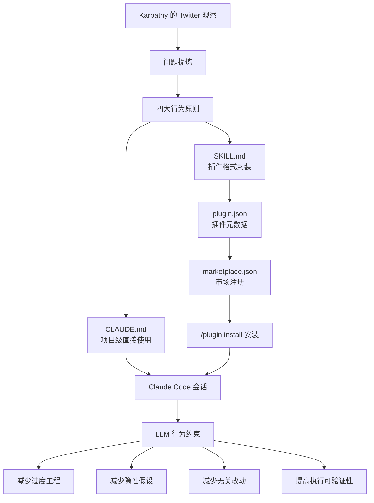
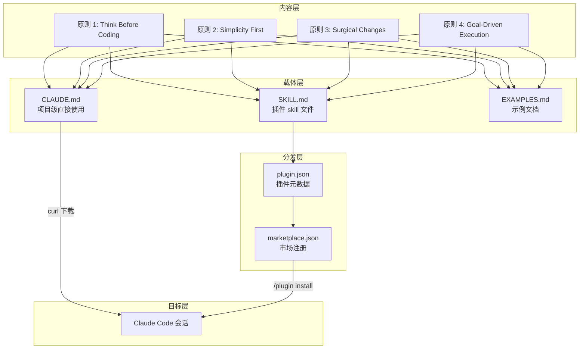
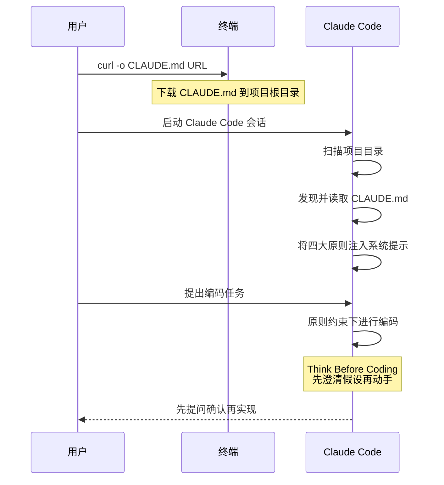
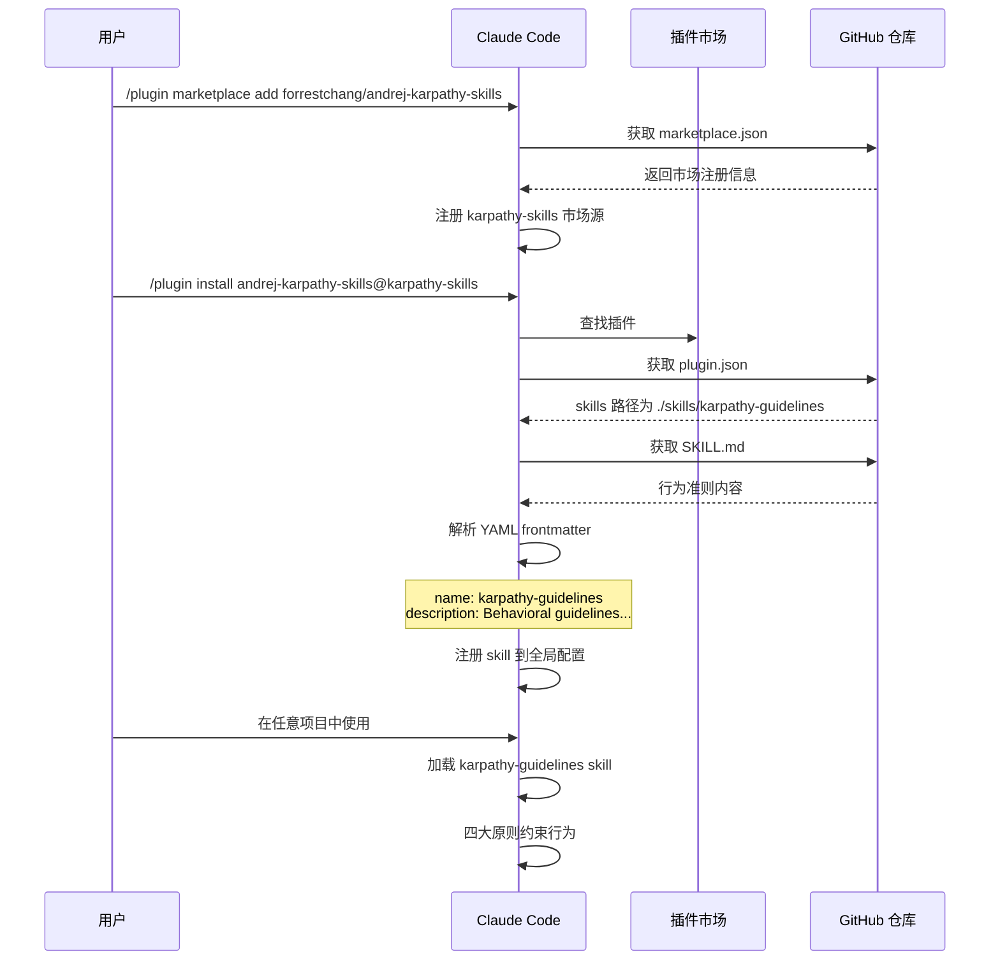

# andrej-karpathy-skills 源码学习笔记

> 仓库地址：[andrej-karpathy-skills](https://github.com/forrestchang/andrej-karpathy-skills)
> 学习日期：2026/04/14

---

> **以下为 AI 源码分析**
>
> ### 一句话概括
>
> 一个 Claude Code 插件，将 Andrej Karpathy 对 LLM 编码缺陷的观察提炼为四条行为准则（Think Before Coding / Simplicity First / Surgical Changes / Goal-Driven Execution），通过 CLAUDE.md 或插件机制注入 Claude Code 会话，纠正 LLM 常见的过度工程、隐性假设、无关改动和模糊执行等问题。
>
> ### 要点速览
>
> | 核心组件 | 职责 | 关键文件 |
> |----------|------|----------|
> | CLAUDE.md | 项目级行为准则，直接被 Claude Code 加载 | `CLAUDE.md` |
> | SKILL.md | 插件格式的行为准则，含 YAML frontmatter 元数据 | `skills/karpathy-guidelines/SKILL.md` |
> | plugin.json | Claude Code 插件描述，声明 skill 路径 | `.claude-plugin/plugin.json` |
> | marketplace.json | 插件市场注册信息 | `.claude-plugin/marketplace.json` |
> | EXAMPLES.md | 四大原则的正反对比示例 | `EXAMPLES.md` |
> | README.md | 项目介绍、原则详解与安装指南 | `README.md` |

---

## 项目简介

andrej-karpathy-skills 是一个 Claude Code 行为准则插件，由 forrestchang 基于 Andrej Karpathy 在 Twitter 上对 LLM 编码缺陷的公开观察整理而成。Karpathy 指出 LLM 编码时存在三大核心问题：**不验证假设就执行**、**过度复杂化代码**、**随意修改不相关代码**。本项目将这些观察提炼为四条可操作的行为原则，通过 Claude Code 的 CLAUDE.md 机制或插件系统注入 AI 编码会话，从根源上约束 LLM 的行为倾向。

项目本身不含可执行代码，全部内容为 Markdown 文档和 JSON 配置文件，属于"配置即产品"类型的开源项目。

## 技术栈

| 类别 | 技术 |
|------|------|
| 语言 | Markdown + JSON（无可执行代码） |
| 框架 | Claude Code Plugin System |
| 构建工具 | 无（纯文本项目） |
| 依赖管理 | 无 |
| 测试框架 | 无 |

## 目录结构

```
andrej-karpathy-skills/
├── .claude-plugin/
│   ├── plugin.json              # 插件元数据：名称、版本、skill 路径
│   └── marketplace.json         # 插件市场注册信息：ID、描述、分类
├── skills/
│   └── karpathy-guidelines/
│       └── SKILL.md             # 插件格式的行为准则（含 YAML frontmatter）
├── CLAUDE.md                    # 项目级行为准则（直接使用方式）
├── EXAMPLES.md                  # 四大原则的正反对比代码示例
└── README.md                    # 项目介绍、原则详解与安装指南
```

## 架构设计

### 整体架构

本项目的"架构"体现在内容组织和分发机制上，而非代码结构。它利用 Claude Code 的两种配置注入通道将行为准则传递给 LLM：

1. **CLAUDE.md 通道**：将准则写入项目根目录的 `CLAUDE.md`，Claude Code 启动时自动加载到系统提示中
2. **Plugin 通道**：通过 `.claude-plugin/` 目录注册为正式插件，`SKILL.md` 作为 skill 内容被加载



### 核心模块

#### 1. 行为准则内容（CLAUDE.md / SKILL.md）

**职责**：定义 LLM 编码时应遵循的四条行为原则。

两个文件内容几乎相同，区别在于 `SKILL.md` 包含 YAML frontmatter 元数据（`name`、`description`、`license`），用于插件系统识别。

四大原则的内在逻辑关系：

| 原则 | 约束目标 | 对应的 Karpathy 观察 |
|------|----------|---------------------|
| Think Before Coding | 编码前的认知过程 | "不验证假设就跑" |
| Simplicity First | 代码产出的复杂度 | "过度复杂化代码和 API" |
| Surgical Changes | 代码修改的范围 | "作为副作用修改不相关代码" |
| Goal-Driven Execution | 执行过程的可验证性 | "LLM 擅长循环直到满足目标" |

#### 2. 插件分发机制（.claude-plugin/）

**职责**：将行为准则注册为 Claude Code 可安装的插件。

- `plugin.json`：声明插件名称 `andrej-karpathy-skills`、版本 `1.0.0`、作者 `forrestchang`，以及 skill 目录路径 `./skills/karpathy-guidelines`
- `marketplace.json`：注册到插件市场，ID 为 `karpathy-skills`，分类为 `workflow`

安装流程：
1. 用户执行 `/plugin marketplace add forrestchang/andrej-karpathy-skills` 添加市场源
2. 执行 `/plugin install andrej-karpathy-skills@karpathy-skills` 安装插件
3. Claude Code 加载 `SKILL.md` 内容到会话上下文

#### 3. 示例文档（EXAMPLES.md）

**职责**：为每条原则提供正反对比的真实代码示例，展示 LLM 常见错误和正确做法。

每个示例遵循统一结构：
- 用户请求（触发场景）
- 错误做法（LLM 典型输出 + 问题分析）
- 正确做法（遵循原则的输出）

### 模块依赖关系



## 核心流程

### 流程一：通过 CLAUDE.md 直接注入

最简单的使用方式——将准则文件下载到项目根目录。



**关键逻辑**：

1. `curl` 直接下载原始 CLAUDE.md 到项目根目录
2. Claude Code 启动时自动扫描并加载项目根目录的 CLAUDE.md
3. 文件内容成为会话系统提示的一部分，在整个会话期间持续约束 LLM 行为
4. 对于已有 CLAUDE.md 的项目，用 `echo "" >> CLAUDE.md` 追加

### 流程二：通过插件系统安装

更正式的分发方式——利用 Claude Code 插件市场。



**关键逻辑**：

1. `marketplace.json` 作为插件市场入口，声明可用插件列表
2. `plugin.json` 描述插件结构，指向 `./skills/karpathy-guidelines` 目录
3. `SKILL.md` 的 YAML frontmatter 提供 skill 元数据（名称、描述、许可证）
4. 安装后 skill 全局可用，不需要每个项目单独配置 CLAUDE.md

## 关键设计亮点

### 1. 从观察到可操作原则的提炼

**解决的问题**：Karpathy 的原始观察是散文式的问题描述，无法直接作为 LLM 指令使用。

**实现方式**：将模糊的观察映射为四条结构化原则，每条原则包含：
- 一句话口号（如 "Don't assume. Don't hide confusion. Surface tradeoffs."）
- 可检查的行为列表（如 "State your assumptions explicitly. If uncertain, ask."）
- 自检标准（如 "Would a senior engineer say this is overcomplicated?"）

**设计理由**：LLM 需要明确、可检查的指令，而非泛泛的建议。口号便于记忆，行为列表便于执行，自检标准便于验证。

### 2. 双通道分发——CLAUDE.md + Plugin

**解决的问题**：不同用户有不同的使用偏好和技术水平。

**实现方式**：
- **CLAUDE.md 方式**（`CLAUDE.md`）：一条 `curl` 命令即可，零门槛，适合快速试用和单项目使用
- **Plugin 方式**（`.claude-plugin/`）：通过 `/plugin install` 安装，全局生效，适合长期使用和多项目场景

**设计理由**：同一份内容适配两种分发渠道，最大化覆盖面。CLAUDE.md 利用 Claude Code 的"自动加载项目配置"机制，Plugin 利用"市场安装全局生效"机制。

### 3. 正反对比示例驱动理解（EXAMPLES.md）

**解决的问题**：抽象原则容易被误解或忽视。

**实现方式**（`EXAMPLES.md`）：为每条原则提供 2-3 个真实编码场景，展示：
- LLM 典型错误输出（标记 "What LLMs Do"）
- 错误原因分析（逐条列出"Problems"）
- 正确输出（标记 "What Should Happen"）

**设计理由**：通过对比让读者/LLM 直观理解"什么是过度工程"、"什么是隐性假设"，比纯规则更有效。例如，"计算折扣"场景中，错误版本用了 Strategy Pattern + ABC + dataclass + Config 共 30 行，正确版本只有 3 行函数。

### 4. 原则间的层次递进设计

**解决的问题**：四条原则不是孤立的，需要按正确顺序应用。

**实现方式**：原则按编码流程的时间顺序排列：
1. **Think Before Coding** — 编码前（理解需求）
2. **Simplicity First** — 编码中（控制复杂度）
3. **Surgical Changes** — 修改时（控制范围）
4. **Goal-Driven Execution** — 验证时（确保完成）

**设计理由**：这个顺序对应了一次编码任务的完整生命周期。先理解清楚问题（避免走错方向），再以最小复杂度实现（避免过度设计），修改时只动必要部分（避免副作用），最后通过明确标准验证完成（避免半成品）。

### 5. 谨慎与速度的显式权衡声明

**解决的问题**：严格准则可能导致简单任务的过度流程化。

**实现方式**：在 CLAUDE.md 顶部和 README.md 的 "Tradeoff Note" 中明确声明：

> "These guidelines bias toward caution over speed. For trivial tasks, use judgment."

**设计理由**：承认准则有适用边界，避免 LLM 对一行 typo 修复也执行完整的"先提问再实现"流程。这是对原则本身的"原则 2: Simplicity First"——不对不需要的场景施加不必要的复杂度。
