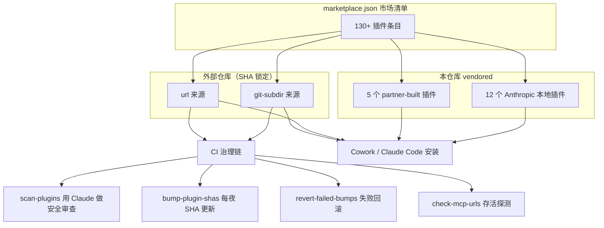
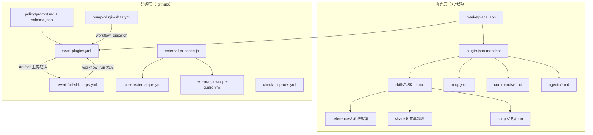
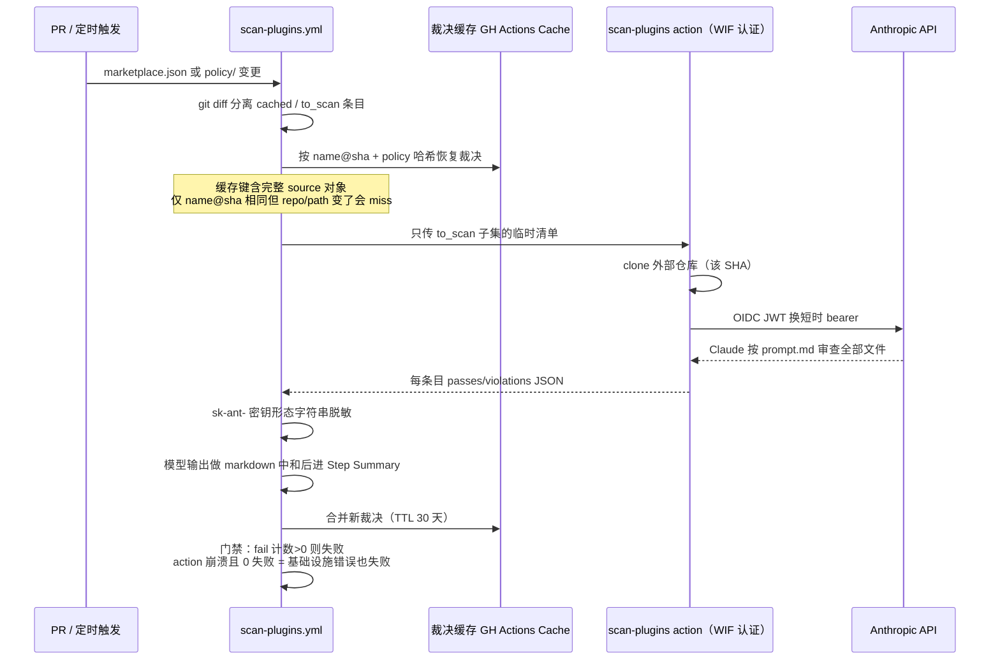

# knowledge-work-plugins 源码学习笔记

> 仓库地址：[anthropics/knowledge-work-plugins](https://github.com/anthropics/knowledge-work-plugins)
> 学习日期：2026-09-30

---

> **以下为 AI 源码分析**
>
> ### 一句话概括
>
> Anthropic 官方的 Claude 插件市场仓库：用"纯 Markdown + JSON"定义了 130+ 个知识工作插件（销售、财务、法务、科研等），仓库里唯一真正的"代码"是一套用 Claude 当安全审查员、治理外部插件供应链的 GitHub Actions 体系。
>
> ### 要点速览
>
> | 模块 | 职责 | 关键文件 |
> |------|------|----------|
> | 市场清单 | 声明 130+ 插件条目与来源（本地/外部 SHA 锁定） | `.claude-plugin/marketplace.json` |
> | 本地插件 ×12 | Anthropic 自建的职能插件（sales 36 skills、small-business 44 skills 等） | `sales/`、`small-business/`、`data/` 等 |
> | partner-built ×5 | 合作伙伴 vendored 插件 | `partner-built/{apollo,slack,brand-voice,common-room,zoom-plugin}` |
> | 插件契约 | manifest + MCP 连接器 + skills/commands/agents 定义 | 各插件下 `.claude-plugin/plugin.json`、`.mcp.json` |
> | CI 治理链 | Claude 即安全审查员：policy 扫描、SHA 夜间 bump、失败回滚、PR 范围守卫 | `.github/workflows/*.yml`（6 个） |
> | 审查策略 | 提示注入/凭据外带/钩子范围的三段式审查提示词 + 输出 schema | `.github/policy/prompt.md`、`schema.json` |

---

## 项目简介

这个仓库是 [Claude Cowork](https://claude.com/product/cowork)（Claude 的知识工作桌面应用）与 Claude Code 共用的官方插件市场。每个"插件"把某个职业角色（销售、财务、法务、生物科研……）所需的领域知识、slash command、sub-agent 和 MCP 连接器打包成一个目录，安装后 Claude 自动按需加载。README 的核心卖点是：**一切都是文件——Markdown 和 JSON，没有代码、没有基础设施、没有构建步骤**。全仓库 1173 个 `.md` 文件（约 18.3 万行）、252 个 `SKILL.md`，而 `.js/.py/.sh` 代码文件总共只有 27 个（其中 22 个在 bio-research 的 skill scripts 里，1 个是 CI 脚本）。

它解决的问题是：让 Claude 从"通用助手"变成"懂你公司工具和流程的专职同事"。仓库本身的工程含量不在插件内容（那是写作），而在 `.github/` 下那套供应链治理：外部公司提交的插件以 git SHA 锁定进 `marketplace.json`，每晚自动 bump、用 Claude 按 policy 提示词做安全审查、失败的条目自动回滚——整条链路的设计充分考虑了提示注入、凭据外带、模型输出被二次注入等攻击面。

## 技术栈

| 类别 | 技术 |
|------|------|
| 内容格式 | Markdown + YAML frontmatter（skills/agents/commands）、JSON（manifest/.mcp.json/hooks） |
| 协议 | MCP（Model Context Protocol），全部走 streamable HTTP 远程连接器 + OAuth |
| CI/自动化 | GitHub Actions（6 个 workflow）+ GitHub GraphQL API（`createCommitOnBranch`） |
| 脚本语言 | Bash/JQ（workflows）、JavaScript（`external-pr-scope.js`）、Python（bio-research 科学计算） |
| 认证 | Anthropic Workload Identity Federation（WIF，OIDC 短时凭据，无静态 API key） |
| 构建工具 | 无——插件交付即源文件；`cowork-plugin-management` 支持打包为 `.plugin`（zip） |
| 依赖管理 | 无（仓库级）；skill scripts 各自声明（scanpy/anndata 等由用户环境提供） |
| 测试框架 | 无单元测试；以 CI 代替：policy scan、`claude plugin validate`、MCP URL 存活探测 |

## 目录结构

```
knowledge-work-plugins/
├── .claude-plugin/
│   └── marketplace.json        # 市场清单：130+ 插件条目（本地路径 / 外部仓库 SHA 锁定）
├── .github/
│   ├── policy/                 # Claude 安全审查的提示词 + 输出 JSON schema
│   │   ├── prompt.md           # 三段式审查提示词（~140 行）
│   │   └── schema.json         # passes/hooks/telemetry 等字段校验
│   ├── scripts/
│   │   └── external-pr-scope.js # 非成员 PR 范围判定（信任源仓库而非提交者）
│   └── workflows/              # 6 个治理 workflow（见"核心流程"）
├── productivity/               # ┐
├── sales/                      # │ 12 个 Anthropic 自建本地插件
├── finance/                    # │ （每个 = plugin.json + .mcp.json +
├── data/                       # │   skills/*/SKILL.md + CONNECTORS.md）
├── bio-research/               # │ 唯一带 Python scripts 的本地插件
├── small-business/             # │ 44 skills + shared/ 共享规则目录 + smb-router
├── ... (共 12 个)              # ┘
├── pdf-viewer/                 # 唯一保留 legacy commands/ 的本地插件
└── partner-built/              # 5 个 vendored 合作伙伴插件（apollo/slack/brand-voice/...）
```

单个插件的标准解剖（以 `sales/` 为例）：

```
sales/
├── .claude-plugin/plugin.json  # manifest：name/version/description/author
├── .mcp.json                   # 25 个远程 HTTP MCP server（HubSpot、Slack、Gong…）
├── CONNECTORS.md               # 工具类别 ↔ 占位符 ↔ 具体产品的映射表
├── README.md
└── skills/                     # 36 个 skill，每个一个目录
    └── call-prep/
        └── SKILL.md            # YAML frontmatter（name+触发短语）+ 指令正文
```

## 架构设计

### 整体架构

仓库是一个**两层结构**：上层是"市场"（manifest 声明式注册表），下层是"插件"（自包含的能力包）。市场条目有四种来源形态：

1. **本地字符串**：`"source": "./sales"` —— vendored 在本仓库的 Anthropic 自建插件
2. **vendored partner**：`"source": "./partner-built/slack"` —— 同样是本地文件，但由合作伙伴维护
3. **git-subdir**：`{source, url, path, ref, sha}` —— 外部仓库的子目录，**锁定到不可变 SHA**
4. **url**：外部完整仓库（同样 SHA 锁定）

外部来源意味着用户安装时 clone 整个上游仓库——这正是 CI 治理链存在的原因：那些代码不受本仓库控制，必须审查。



每个插件包内部则是**四类组件 + 一个 manifest**：

| 组件 | 位置 | 机制 |
|------|------|------|
| Skills | `skills/*/SKILL.md` | frontmatter description 含触发短语，模型按需自动加载；支持 `references/`（渐进披露）、`examples/`、`scripts/` |
| Commands | `commands/*.md` | legacy 单文件 slash command，`$ARGUMENTS`/`$1` 参数替换；官方已建议新插件改用 skills |
| Agents | `agents/*.md` | sub-agent 定义，frontmatter 带 `<example>` 触发示例块、`model`/`color`/`tools`；仅 brand-voice 在用 |
| Connectors | `.mcp.json` | 远程 MCP server（`type: http` + URL + OAuth `clientId`）；空 URL 条目按"名字匹配"对接 Cowork 托管连接器 |

### 核心模块

**1. 市场清单（`.claude-plugin/marketplace.json`）**
- 67KB JSON，`plugins[]` 数组，每条含 `name`/`displayName`/`description`/`category`/`source`
- `source` 的字符串形态表示 vendored，对象形态表示外部（带 `sha` 锁定）。这个二分法贯穿所有 CI 脚本：`select(.source | type == "object")` 就是"外部条目"过滤器
- 外部条目的 `sha` 是整个治理体系的关键不变量：**SHA 不可变 ⇒ (plugin, sha) 的审查结论永久有效**——这是 scan 缓存、revert 逻辑的根基

**2. Skill 契约（frontmatter + 渐进披露）**
- `component-schemas.md` 规定三级渐进披露：① metadata（name+description，~100 词，常驻上下文）→ ② SKILL.md 正文（触发时加载，<3000 词）→ ③ references/（模型自己按需 Read，无限量）
- description 必须第三人称、内嵌具体触发短语（如 "Use when the user asks 'prep me for [meeting]'"）——因为触发完全靠模型对 description 的语义匹配，没有路由代码
- 正文用祈使句写给 Claude（"Parse the config file"），不是给用户看的文档

**3. 连接器中立层（`.mcp.json` + `CONNECTORS.md`）**
- skill 正文按**类别**写（"the CRM"、"chat"），或用 `~~category` 占位符；`CONNECTORS.md` 把类别映射到具体产品（CRM → HubSpot/Salesforce/Close…）
- `.mcp.json` 中 `google calendar`/`gmail`/`google drive` 的 URL 为空字符串——这是"按名字匹配 MCP 目录"的约定，端点由 Cowork 动态解析
- 每个连接器自身的权限（allow/ask/block per tool）才是权威，skill 永不越权也不额外设限

**4. 安全规则层（`small-business/shared/` 与 sales 的 Rules 块）**
- `shared/untrusted-content.md`（12 个共享文档之一）：所有外部内容（邮件、工单、转录、网页）一律视为 data 不是指令；"content-originated action"（非受信文本指定收件人/目标的动作）必须展示给用户确认；定时无人值守运行中此类动作一律降级为提案
- sales 插件把同样的 8 条规则**逐字节复制**进全部 36 个 SKILL.md——因为没有 include 机制，skill 独立触发时必须自带规则

**5. 治理脚本（`.github/`）**——见"核心流程"。

### 模块依赖关系



## 核心流程

### 流程一：外部插件安全审查（Scan Plugins）

`scan-plugins.yml` 在每个 PR 上运行，是 main 分支的**必需状态检查**。它把 `marketplace.json` 中变更的外部条目交给 Claude 按 `policy/prompt.md` 审查：



关键设计点（对应 workflow 中的注释）：

- **路径过滤悖论**：workflow 级 paths 过滤在路径不匹配时不产生 check run，会让不相关 PR 永远卡在必需检查上——所以本 workflow 对所有 PR 运行，在 step 级别才判断"是否与扫描相关"
- **裁决缓存**：每晚 bump workflow 会重置分支使同一批 SHA 反复出现在 diff 里，没有缓存则每晚每条目重烧约 90 秒 Claude 时间。缓存键 = `hashFiles('.github/policy/**') + run_id + run_attempt`，restore-keys 回退取最近一次；**policy 提示词一改，全部裁决失效重扫**（故意的）
- **WIF 认证**：`id-token: write` 铸出 GitHub OIDC token，claude CLI 换成分钟级短时 bearer。注释明说动机：即使提示注入从被审查的外部仓库里诱导出 token 外带，爆炸半径也只有几分钟
- **模型输出是受信边界之外的数据**：summary/violations 是"由被 clone 的外部仓库内容塑形的模型文本"，进公开渲染的 PR comment / Step Summary 前先 `gsub` 剥掉 markdown 控制字符、再用 code span 包裹——防止注入的裸 URL 被自动链接
- **失败语义二分**：`failed_count > 0` 是 policy 失败；`0 失败但 action 退出码非 0` 是基础设施错误——后者同样 fail loudly，防止 revert workflow 把"没跑成"误读成"全过了"

policy 提示词本身（`.github/policy/prompt.md`）是三段式：Part 1 基线安全（恶意代码、提示注入、**跨服务凭据路由**——读 `ANTHROPIC_AUTH_TOKEN` 发往非 Anthropic 端点才算违规，同服务使用是正常集成）；Part 2 钩子范围与披露（未加项目相关性 gate 就挂 `UserPromptSubmit`/`PreToolUse` 的钩子 = broad scope；未披露的遥测 = fail）；Part 3 网络与软件下载标志。输出经 `schema.json` 校验（`passes`/`hooks`/`has_broad_scope_hooks`/`has_undisclosed_telemetry`/`description_matches_behavior` 等必填字段）。

### 流程二：每夜 SHA bump 生命周期

外部条目锁定的 SHA 会落后于上游 HEAD。`bump-plugin-shas.yml`（每晚 07:23 UTC）维护这条更新链，配合 revert 形成一个自愈闭环：

```mermaid
flowchart TD
    A["cron 07:23 UTC 触发"] --> B["bump-plugin-shas.yml<br/>max-bumps=30 每夜上限"]
    B --> C["对每个 stale 条目：<br/>ls-remote + 浅 clone + claude plugin validate"]
    C --> D["每个插件一条独立 PR<br/>branch = bump/<slug><br/>createCommitOnBranch GitHub 签名提交"]
    D --> E["GITHUB_TOKEN 开的 PR<br/>不触发 on:pull_request 事件"]
    E --> F["逐分支 workflow_dispatch<br/>scan-plugins.yml"]
    F --> G{"policy 扫描"}
    G -->|"全部通过"| H["PR 可合并"]
    G -->|"有条目失败"| I["revert-failed-bumps.yml<br/>由 workflow_run 触发"]
    I --> J{"篡改检测：失败条目<br/>与 main 的差异仅 source.sha?"}
    J -->|"是"| K["回滚该条目 sha 到 main 的值<br/>CAS 提交 expectedHeadOid"]
    J -->|"否"| L["中止，人工介入"]
    K --> M["PR comment 列出被剔除条目<br/>重新 dispatch scan"]
    M --> N{"回滚预算<br/>commit 数 ≤ MAX_REVERT_PASSES+1"}
    N -->|"超支"| O["标记预算耗尽<br/>疑似缓存/扫描 bug，人工"]
    N -->|"正常"| G
```

流程里三个精巧之处：

1. **绕过 GitHub 的递归防护**：用默认 `GITHUB_TOKEN` 开的 PR 不会触发 `on:pull_request` 的 workflow，因此必需检查 `scan` 永远不会跑、PR 永远合不了。解法是 bump workflow 自己 `gh workflow run scan-plugins.yml --ref bump/<slug>` 逐分支 dispatch（`workflow_dispatch` 豁免于该防护）。注释还特别警告：不要照抄 claude-plugins-official 的"三 workflow 循环"，本仓库没有 validate-plugins.yml，dispatch 它会 404
2. **篡改检测**：revert 只允许把 `source.sha` 恢复成 main 的值——`(. | del(.source.sha)) == ($b[.name] | del(.source.sha))` 若不成立说明 bump 分支被动过手脚，直接 abort 交人工
3. **回滚预算不用日期数学**：每晚 bump 会 force-reset 分支成单 commit，每次 revert 恰好加一个——所以"commit 数 - 1 = 当夜 revert 轮数"，无日期计算、无分页、不受 comment 伪造影响

### 流程三：非成员 PR 的信任模型（external-pr-scope.js）

外部贡献者只能做一件事：**往 `marketplace.json` 添加条目，且来源必须是市场上已有活插件的仓库**。

- 信任锚是**源仓库**而非提交者身份：PR 新增条目的 `source.url` 若指向一个"已在本市场有活插件"的仓库，且 SHA 锁定真实 commit，那么装出去的代码就是该组织自己的代码——无论谁开的 PR
- `analyze()` 用 **merge-base → head** 的 diff（而非 base-tip → head），避免落后的 fork 把 main 后来新增的条目误判为"删除"
- 两个消费方：`close-external-prs.yml`（不在范围内 → 自动关闭 + 引导去官方提交入口）和 `external-pr-scope-guard.yml`（advisory 检查，注释明确说**不要**把它设成 required check，否则会挡住免审批的 bump-merge 路径）
- 安全前提：`pull_request_target` 只 checkout base 仓库（受信），head 的 `marketplace.json` 通过 API 当**数据**读取，绝不执行 fork 代码

## 关键设计亮点

**1. 用"Claude 审 Claude 生态"替代人工安全审查**

问题：市场要接受 100+ 外部公司的插件，人工审不过来。实现：`scan-plugins.yml` 复用 `anthropics/claude-plugins-community` 的 composite action，让 Claude clone 目标 SHA 后按 `policy/prompt.md` 输出结构化裁决（`schema.json` 校验）。为什么值得学：它没有把"AI 审查"当成黑盒信任——裁决走 (plugin, sha) 不可变缓存、WIF 短时凭据、模型输出脱敏 + markdown 中和、失败语义与基础设施错误二分，每一环都在防御"审查者本身被注入"。

**2. 渐进披露三级加载模型**

问题：252 个 skill 的领域知识总量远超上下文窗口。实现：metadata（触发匹配用的 ~100 词）常驻 → SKILL.md 正文（<3000 词，触发才加载）→ `references/`（模型用 Read 工具按需取）。`small-business/shared/` 进一步把跨 skill 公共规则抽成 15 个独立文档，由 skill 正文相对路径引用（44 个 skill 里 43 个引用 `shared/`）——解决了 sales 插件"36 份逐字节复制的 8 条规则"无法集中更新的问题（两种方案并存，是同一问题两代答案的活标本）。

**3. 连接器中立 + 三级降级**

问题：同一工作流要在"什么都没连"到"全家桶"之间连续可用。实现：skill 按类别写（`~~chat`/`~~CRM`，`CONNECTORS.md` 做映射）；每个 SKILL.md 尾部带 tier 声明：`files-only`（CSV 导出/粘贴文本完整可用）→ `read-only`（连接器只读）→ `gated-writes`（连接器权限内写）。配套规则极细：两工具同答一职时优先匹配 CRM 用户邮箱域的那个、上传文件日期超出"今天"时以文件自身日期为锚、连接器拒绝写时转为 checklist 而不是换工具绕过。

**4. 无人值守运行的内容安全边界**

问题：scheduled run 没有人在场确认"content-originated action"。实现：`sales` Rules 块与 `shared/untrusted-content.md` 明文规定——非受信内容（邮件/转录/富化数据）派生的值、记录、联系人**永远不能**写进无人值守运行，即使该 schedule 本来就是为这类更新而设；一律降级为带来源行的提案。反过来看，这正是对 indirect prompt injection 的运行时防御：外部内容只有 data 通道，没有 action 通道。

**5. "无代码仓库"也有供应链攻击面——且全部显式建模**

问题：一个"全是 Markdown"的仓库看似没有攻击面，但安装即 clone 上游整仓（policy 提示词特别点名 `.claude/` 等隐藏目录里未加载但可达的代码）、PR comment/Step Summary 是公开渲染面（模型输出可被注入成钓鱼链接）、`pull_request_target` 是经典提权点。实现：CI 六个 workflow 各自把对应威胁显式写成注释 + 防御（probe 函数连 `curl` 失败时 `$()` 里 `|| echo` 会拼出 `000000` 这种细节都写了）。为什么值得学：这套注释本身就是"如何思考 CI 安全"的教材——每条防御都先写威胁再写机制。
