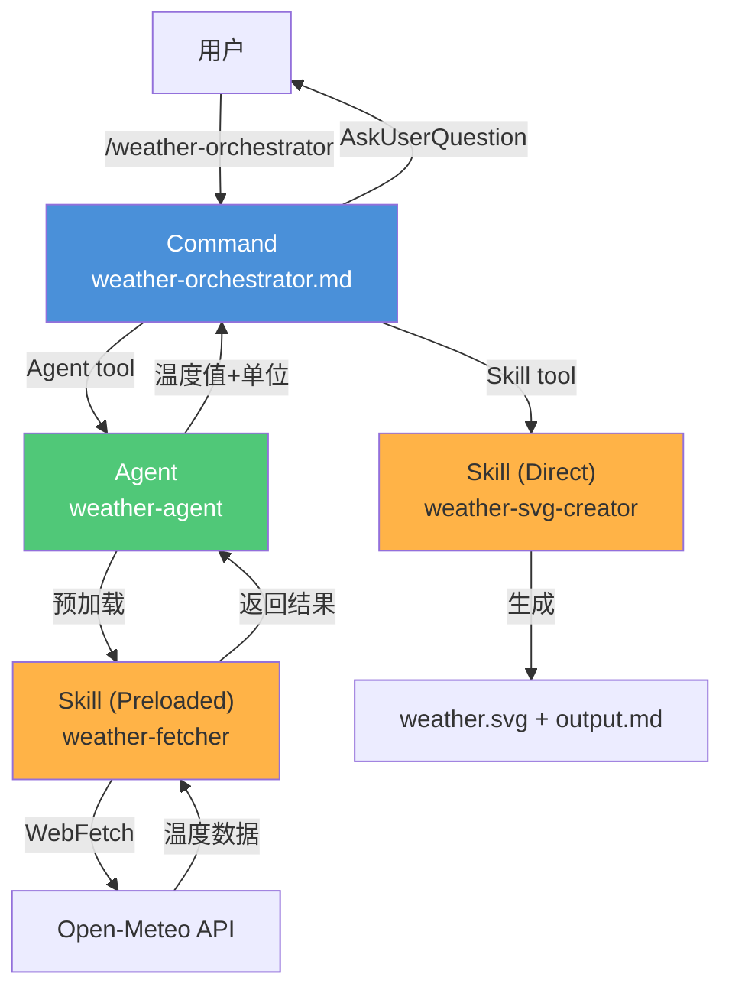
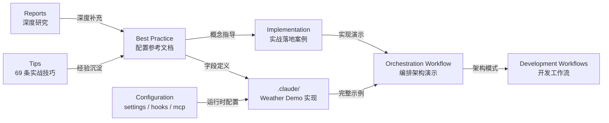
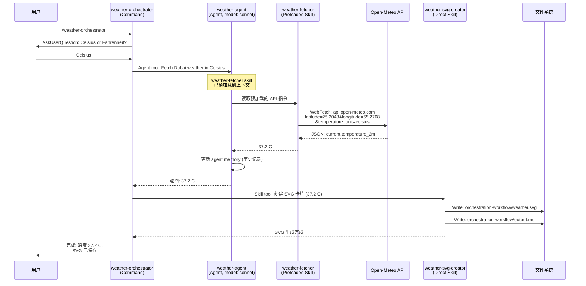
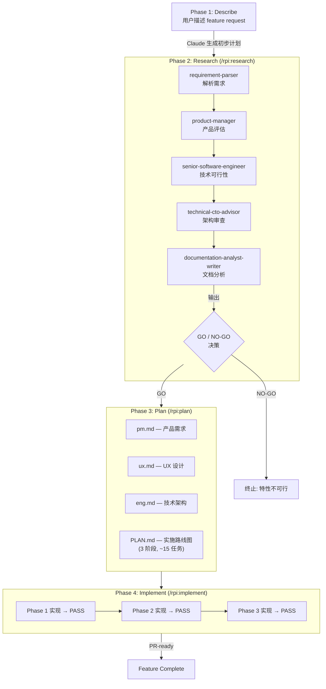

# claude-code-best-practice 源码学习笔记

> 仓库地址：[claude-code-best-practice](https://github.com/shanraisshan/claude-code-best-practice)
> 学习日期：2026/04/15

---

> **以下为 AI 源码分析**
>
> ### 一句话概括
>
> 一个系统化整理 Claude Code 最佳实践的知识库，覆盖 Subagents、Commands、Skills、Hooks、MCP、Workflows 等全部核心概念，并通过 Weather 示例项目展示 Command → Agent → Skill 三层编排架构的完整实现。
>
> ### 要点速览
>
> | 核心模块 | 职责 | 关键文件 |
> |----------|------|----------|
> | Best Practice | 8 大核心概念的配置字段、使用模式和推荐做法 | `best-practice/*.md` |
> | Implementation | 5 个实战落地案例（Skills / Subagents / Commands / Agent Teams / Scheduled Tasks） | `implementation/*.md` |
> | Orchestration Workflow | Command → Agent → Skill 三层编排架构设计与演示 | `orchestration-workflow/` |
> | Development Workflows | RPI（Research → Plan → Implement）、Cross-Model 等开发工作流 | `development-workflows/` |
> | Reports | 9 篇深度研究报告（Agent vs Command vs Skill 对比、LLM 退化分析等） | `reports/*.md` |
> | Tips | 69 条来自 Boris Cherny（Claude Code 创建者）及社区的实战技巧 | `tips/*.md` |
> | Weather Demo | 完整的 Command → Agent → Skill 编排示例实现 | `.claude/commands/`, `.claude/agents/`, `.claude/skills/` |
> | Configuration | settings.json、hooks、MCP servers 等团队级配置示例 | `.claude/settings.json`, `.mcp.json` |

---

## 项目简介

`claude-code-best-practice` 是由 Shayan Rais 维护的 Claude Code 最佳实践知识库，口号是 "from vibe coding to agentic engineering"。该项目曾登上 GitHub Trending 日榜第一，是巴基斯坦第四多 star 的仓库。

项目的核心价值在于：
1. **系统化文档**：将 Claude Code 的 8 大核心概念（Subagents、Commands、Skills、Hooks、MCP、Memory、Settings、Workflows）的所有配置字段和最佳实践整理为结构化参考文档
2. **实战落地**：通过 Weather 示例项目完整演示 Command → Agent → Skill 三层编排架构的实现
3. **社区智慧**：汇聚 Boris Cherny（Claude Code 创建者）、Thariq、Cat Wu 等核心团队成员及社区的 69 条实战技巧
4. **深度研究**：包含 9 篇原创研究报告，覆盖 Agent/Command/Skill 对比、SDK vs CLI 系统提示差异、LLM 退化分析等主题
5. **工作流参考**：整理 10+ 个主流开发工作流框架（Superpowers、Spec Kit、gstack 等）的对比分析

## 技术栈

| 类别 | 技术 |
|------|------|
| 项目类型 | 知识库 / 配置参考（非应用代码） |
| 内容格式 | Markdown + YAML frontmatter |
| 配置格式 | JSON（settings.json、.mcp.json） |
| 编排工具 | Claude Code CLI（Subagents / Commands / Skills） |
| MCP Servers | Playwright、Context7、DeepWiki |
| Hook 脚本 | Python（hooks.py） |
| 演示 API | Open-Meteo（免费天气 API） |
| 可视化 | SVG（天气卡片）、Mermaid（架构图） |

## 目录结构

```
claude-code-best-practice/
├── README.md                           # 主文档：概念表 + 69 条 Tips + 视频/播客索引
├── CLAUDE.md                           # 项目级 Claude 配置指令
├── .mcp.json                           # MCP servers 配置（Playwright / Context7 / DeepWiki）
├── .claude/                            # Claude Code 配置根目录
│   ├── settings.json                   #   权限、Hooks、UI 自定义、输出风格等
│   ├── agents/                         #   Subagent 定义
│   │   ├── weather-agent.md            #     天气数据获取 agent
│   │   ├── time-agent.md              #     时间获取 agent
│   │   └── presentation-curator.md    #     演示文稿策展 agent
│   ├── commands/                       #   Slash command 定义
│   │   └── weather-orchestrator.md    #     天气编排命令（入口）
│   ├── skills/                         #   Skill 定义
│   │   ├── weather-fetcher/           #     天气数据获取 skill（agent 预加载型）
│   │   ├── weather-svg-creator/       #     天气 SVG 卡片生成 skill（直接调用型）
│   │   ├── time-skill/                #     时间 skill
│   │   └── agent-browser/             #     浏览器 agent skill
│   ├── hooks/                          #   Hook 系统
│   │   ├── scripts/hooks.py           #     Python hook 处理器
│   │   ├── config/hooks-config.json   #     Hook 配置
│   │   └── sounds/                    #     音频反馈文件
│   └── rules/                          #   规则文件
│       ├── markdown-docs.md           #     Markdown 写作规则
│       └── presentation.md            #     演示文稿规则
├── best-practice/                      # 8 大核心概念最佳实践文档
│   ├── claude-subagents.md            #   Subagents：16 个 frontmatter 字段 + 5 个内置 agent
│   ├── claude-commands.md             #   Commands：14 个 frontmatter 字段 + 70+ 内置命令
│   ├── claude-skills.md               #   Skills：14 个 frontmatter 字段 + 5 个内置 skill
│   ├── claude-memory.md               #   Memory：CLAUDE.md 祖先/后代加载机制
│   ├── claude-settings.md             #   Settings：60+ 配置项 + 170+ 环境变量
│   ├── claude-mcp.md                  #   MCP：5 个推荐 server + 配置层级
│   ├── claude-cli-startup-flags.md    #   CLI：16 类启动 flag + 子命令
│   └── claude-power-ups.md            #   Power-ups：10 个交互式学习课程
├── implementation/                     # 5 个实战落地案例
│   ├── claude-skills-implementation.md
│   ├── claude-subagents-implementation.md
│   ├── claude-commands-implementation.md
│   ├── claude-agent-teams-implementation.md
│   └── claude-scheduled-tasks-implementation.md
├── orchestration-workflow/             # 编排工作流演示
│   ├── orchestration-workflow.md       #   架构设计文档
│   ├── orchestration-workflow.svg      #   架构流程图
│   └── orchestration-workflow.gif      #   运行演示 GIF
├── development-workflows/              # 开发工作流
│   ├── cross-model-workflow/          #   Claude + Codex 跨模型工作流
│   └── rpi/                           #   Research → Plan → Implement 工作流
├── reports/                            # 9 篇深度研究报告
│   ├── claude-agent-command-skill.md  #   Agent vs Command vs Skill 对比
│   ├── claude-advanced-tool-use.md    #   高级工具使用（PTC / 动态过滤 / Tool Search）
│   ├── claude-agent-memory.md         #   Agent Memory 持久化机制
│   ├── claude-agent-sdk-vs-cli-system-prompts.md  # SDK vs CLI 系统提示差异
│   ├── claude-global-vs-project-settings.md       # 全局 vs 项目级配置
│   ├── claude-skills-for-larger-mono-repos.md     # 大型 monorepo 的 skill 发现
│   ├── claude-usage-and-rate-limits.md            # 用量与速率限制
│   ├── claude-in-chrome-v-chrome-devtools-mcp.md  # 浏览器自动化工具对比
│   └── llm-day-to-day-degradation.md              # LLM 日常退化：神话 vs 现实
├── tips/                               # 团队及社区 Tips 专题文章
├── videos/                             # 播客/视频笔记
├── agent-teams/                        # Agent Teams 示例项目
└── tutorial/                           # 入门教程（Mac / Windows / Linux）
```

## 架构设计

### 整体架构

该项目的核心架构是 **Command → Agent → Skill 三层编排模式**，这是 Claude Code 官方推荐的扩展架构，将用户交互、业务执行、输出生成三个关注点清晰分离。

**设计思路**：
- **Command**（命令）：用户交互的入口点，负责收集用户偏好、协调工作流、返回最终结果
- **Agent**（代理）：自主执行者，拥有独立上下文窗口，负责领域特定的数据获取和业务逻辑
- **Skill**（技能）：可复用的知识单元，分为两种模式——Agent Skill（预加载型）和 Direct Skill（直接调用型）



### 核心模块

#### 1. Best Practice 模块 — 配置参考文档

**职责**：为 Claude Code 的 8 大核心概念提供完整的配置字段说明和最佳实践指南。

**核心文件**：
- `best-practice/claude-subagents.md`：定义 16 个 frontmatter 字段（name / description / tools / model / permissionMode / maxTurns / skills / mcpServers / hooks / memory / background / effort / isolation / color 等），记录 5 个内置 agent 类型（general-purpose / Explore / Plan / statusline-setup / claude-code-guide）
- `best-practice/claude-commands.md`：定义 14 个 frontmatter 字段（name / description / when_to_use / argument-hint / context / agent / model / effort / paths / hooks 等），索引 70+ 内置命令（分 11 个类别：Auth / Config / Context / Debug / Export / Extensions / Memory / Model / Project / Remote / Session）
- `best-practice/claude-skills.md`：定义 14 个 frontmatter 字段，记录 5 个内置 skill（simplify / batch / debug / loop / claude-api）
- `best-practice/claude-settings.md`：整理 60+ 配置项和 170+ 环境变量，覆盖权限模式（default / acceptEdits / auto / plan / bypassPermissions）、Sandbox、MCP、Display、Attribution 等
- `best-practice/claude-memory.md`：说明 CLAUDE.md 的祖先加载（从当前目录向上遍历）和后代懒加载（访问子目录文件时才加载）机制
- `best-practice/claude-mcp.md`：推荐 5 个日常必备 MCP server（Context7 / Playwright / Chrome / DeepWiki / Excalidraw），说明三层配置作用域（Project / User / Subagent）
- `best-practice/claude-cli-startup-flags.md`：整理 16 类 CLI 启动 flag 和核心子命令
- `best-practice/claude-power-ups.md`：索引 10 个交互式学习课程（v2.1.90+）

**关键设计**：每个最佳实践文档都采用「概念定义 → 字段列表 → 使用示例 → 注意事项」的统一结构。

#### 2. Implementation 模块 — 实战落地

**职责**：展示最佳实践文档中概念的具体实现方式。

**核心文件**：
- `implementation/claude-skills-implementation.md`：演示两种 Skill 模式——Agent Skill（通过 `skills:` 字段预加载到 agent 上下文）和 Direct Skill（通过 Skill tool 直接调用）
- `implementation/claude-subagents-implementation.md`：展示 weather-agent 的完整配置（model: sonnet, maxTurns: 5, memory: project, 预加载 weather-fetcher skill）
- `implementation/claude-commands-implementation.md`：展示 weather-orchestrator 的三步工作流（AskUserQuestion → Agent → Skill）
- `implementation/claude-agent-teams-implementation.md`：展示多个独立 Claude Code session 通过共享 task list 协同工作的 Agent Teams 模式
- `implementation/claude-scheduled-tasks-implementation.md`：展示 `/loop` 定时任务的实现（cron 最小粒度 1 分钟，自动 3 天过期）

#### 3. Orchestration Workflow 模块 — 编排架构

**职责**：完整定义和演示 Command → Agent → Skill 编排模式。

**核心文件**：
- `orchestration-workflow/orchestration-workflow.md`：架构设计文档，解释三层分离的设计原理和数据流
- `.claude/commands/weather-orchestrator.md`：Command 层实现——收集用户偏好（Celsius / Fahrenheit）、调度 Agent、调用 Skill
- `.claude/agents/weather-agent.md`：Agent 层实现——独立上下文、预加载 weather-fetcher skill、从 Open-Meteo API 获取数据
- `.claude/skills/weather-fetcher/SKILL.md`：Preloaded Skill——提供 API URL 和数据提取指令（`user-invocable: false`）
- `.claude/skills/weather-svg-creator/SKILL.md`：Direct Skill——根据温度数据生成 SVG 卡片和 Markdown 摘要

**关键设计**：Agent 不能通过 bash 命令调用其他 Agent，必须使用 Agent tool；Skill 分为预加载型（注入 agent 上下文作为参考知识）和直接调用型（独立执行产出输出）。

#### 4. Development Workflows 模块 — 开发工作流

**职责**：提供可复制的开发工作流模板。

**核心文件**：
- `development-workflows/rpi/rpi-workflow.md`：RPI 工作流（Research → Plan → Implement），每个阶段有验证门控，使用多个专用 agent（requirement-parser / product-manager / senior-software-engineer / technical-cto-advisor 等）
- `development-workflows/cross-model-workflow/cross-model-workflow.md`：跨模型工作流（Plan[Claude] → QA Review[Codex] → Implement[Claude] → Verify[Codex]），利用双模型交叉验证提升质量

#### 5. Reports 模块 — 深度研究

**职责**：对 Claude Code 生态中的关键技术问题进行深入分析。

**核心文件与发现**：
- `reports/claude-agent-command-skill.md`：Agent / Command / Skill 三者对比——Agent 拥有独立上下文、Command 是用户显式入口、Skill 是最轻量的自动触发机制；Claude 优先选择最轻量的方式
- `reports/claude-advanced-tool-use.md`：PTC（Programmatic Tool Calling）可节省约 37% token；Tool Search 可减少约 85% 工具定义 token；这些是 API 级特性，CLI 中不直接可用
- `reports/claude-agent-memory.md`：Agent Memory 的三个作用域（user / project / local），MEMORY.md 的前 200 行注入 agent 系统提示
- `reports/llm-day-to-day-degradation.md`：LLM 日常退化的真实原因——基础设施 bug（影响达 16%）、MoE 路由方差（±8-14%）、系统提示/后训练更新、硬件异构性；并非模型权重被修改

#### 6. Configuration 模块 — 团队级配置示例

**职责**：提供可直接参考的 Claude Code 配置文件。

**核心文件**：
- `.claude/settings.json`：完整的团队级配置示例，包括权限管理（allow / ask / deny 三级权限）、20+ Hook 事件配置、自定义 spinner 动词和 tips、输出风格（Explanatory）、状态栏、归因设置
- `.mcp.json`：三个 MCP server 配置（Playwright / Context7 / DeepWiki），全部使用 npx 按需执行

### 模块依赖关系



## 核心流程

### 流程一：Command → Agent → Skill 天气编排工作流

这是项目的核心演示流程，展示三层编排架构的完整运作方式。



**关键逻辑说明**：
1. **Command 层**（weather-orchestrator）：使用 `model: haiku` 保持轻量，通过 AskUserQuestion 收集用户偏好，通过 Agent tool 调度 agent，通过 Skill tool 触发输出
2. **Agent 层**（weather-agent）：使用 `model: sonnet` 保证数据获取质量，`maxTurns: 5` 防止无限循环，`memory: project` 实现持久化历史记录，weather-fetcher 通过 `skills:` 字段预加载
3. **Skill 层**：weather-fetcher 是 `user-invocable: false` 的后台知识（只在 agent 上下文中可用）；weather-svg-creator 是直接调用型，从上下文中获取温度数据生成输出

### 流程二：RPI 开发工作流 (Research → Plan → Implement)

RPI 是项目推荐的系统化开发工作流，每个阶段有验证门控防止在不可行的特性上浪费精力。



**关键逻辑说明**：
1. **Research 阶段**：5 个专用 agent 协作评估可行性，输出 GO/NO-GO 决策，避免在不可行特性上投入
2. **Plan 阶段**：产出 4 份文档（产品需求 / UX / 技术架构 / 实施路线图），路线图拆分为 3 个阶段约 15 个任务
3. **Implement 阶段**：按阶段门控逐步实施，每个阶段通过测试后才进入下一阶段

## 关键设计亮点

### 1. 两种 Skill 模式的分离设计

**解决的问题**：如何区分"注入领域知识到 agent 上下文"和"独立执行产出输出"两种不同的 skill 使用场景。

**实现方式**：
- **Preloaded Skill**（Agent Skill）：通过 agent 的 `skills:` frontmatter 字段声明，完整 skill 内容在 agent 启动时注入上下文。设置 `user-invocable: false` 对用户隐藏。例如 `weather-fetcher` 将 API 指令注入 weather-agent 的上下文
- **Direct Skill**（独立 Skill）：通过 `Skill(skill: "name")` 工具直接调用，在调用者的上下文中执行。例如 `weather-svg-creator` 从对话上下文获取温度数据并生成文件

**设计原因**：这种分离让 agent 在获取数据时拥有完整的领域知识（预加载），同时让输出生成 skill 保持独立和可复用（直接调用）。一个 skill 可以被多个 agent 预加载，也可以被多个 command 直接调用。

### 2. 配置优先级的五层层叠机制

**解决的问题**：在团队协作场景中，如何同时满足组织强制策略、团队共享配置和个人偏好的需求。

**实现方式**（`.claude/settings.json` 中体现）：
1. **Managed settings**（组织级 MDM/Registry）— 最高优先级，不可覆盖
2. **CLI arguments**（命令行参数）— 单次会话覆盖
3. **`.claude/settings.local.json`**（项目个人）— git-ignored，个人在此项目的偏好
4. **`.claude/settings.json`**（项目团队）— 提交到 git，团队共享
5. **`~/.claude/settings.json`**（全局个人）— 所有项目的默认值

**设计原因**：安全策略向上强制（组织级不可被项目覆盖），个人偏好向下细化（项目级可覆盖全局默认），local 文件不提交 git 保护隐私。权限同样分三级（allow / ask / deny），且 deny 优先于 allow。

### 3. 20+ Hook 事件的全生命周期覆盖

**解决的问题**：如何在不修改 Claude Code 核心的前提下，对 agentic loop 的每个关键环节注入自定义行为。

**实现方式**（`.claude/settings.json` 的 `hooks` 配置）：
- 覆盖 20+ 生命周期事件：PreToolUse / PostToolUse / PostToolUseFailure / UserPromptSubmit / Stop / SubagentStart / SubagentStop / PreCompact / PostCompact / SessionStart / SessionEnd / Setup / PermissionRequest / PermissionDenied / TaskCreated / TaskCompleted / WorktreeCreate / WorktreeRemove / FileChanged / CwdChanged / ConfigChange 等
- 统一路由到 `python3 .claude/hooks/scripts/hooks.py` 处理
- 支持 matcher 模式匹配（如 FileChanged 只监听 `.envrc|.env|.env.local`）
- 支持 `once: true` 标记（如 SessionStart 只执行一次）
- 音频反馈系统（`sounds/` 目录存放 ElevenLabs TTS 生成的音效文件）

**设计原因**：Hook 系统让团队无需 fork Claude Code 即可实现通知（声音/桌面）、审计日志、代码格式化、权限增强等横切关注点。Python hook 处理器作为统一入口简化了多事件的路由和配置管理。

### 4. Agent Memory 的三作用域持久化

**解决的问题**：如何让 agent 在多次会话间积累领域知识，同时区分个人知识和团队知识。

**实现方式**：
- **user 作用域**（`~/.claude/agent-memory/<agent>/`）：跨项目的个人知识，不受版本控制
- **project 作用域**（`.claude/agent-memory/<agent>/`）：团队共享的项目知识，提交到 git
- **local 作用域**（`.claude/agent-memory-local/<agent>/`）：个人在此项目的知识，git-ignored

MEMORY.md 的前 200 行在 agent 启动时注入系统提示，超出部分通过主题文件按需加载。

**设计原因**：三作用域设计让 agent 能在正确的边界积累知识——个人的调试经验留在 user 作用域，团队的 API 约定放在 project 作用域，本地的环境配置信息放在 local 作用域。与 CLAUDE.md（人工编写，所有 agent 共享）和 Auto Memory（主 Claude 自动维护）形成互补。

### 5. 跨模型交叉验证工作流

**解决的问题**：如何利用多个 AI 模型的差异性互相校验，减少单模型的盲区和偏见。

**实现方式**（`development-workflows/cross-model-workflow/`）：
- **Stage 1 Plan**（Claude Opus 4.6, Plan Mode）：Claude 通过 AskUserQuestion 访谈用户，生成分阶段计划
- **Stage 2 QA Review**（Codex CLI, GPT-5.4）：Codex 在独立 terminal 中审查计划，对照实际代码库添加 "Codex Finding" 和中间阶段（如 "Phase 2.5"），但不修改原始计划
- **Stage 3 Implement**（Claude Opus 4.6）：新会话按更新后的计划逐阶段实现
- **Stage 4 Verify**（Codex CLI, GPT-5.4）：Codex 验证实现是否符合计划

**设计原因**：不同模型对代码库的理解视角不同，Codex 的代码库分析能力可以弥补 Claude 计划中的盲点。四阶段的双模型门控确保计划和实现都经过独立审查，类似于人工 code review 的双人校验机制。
