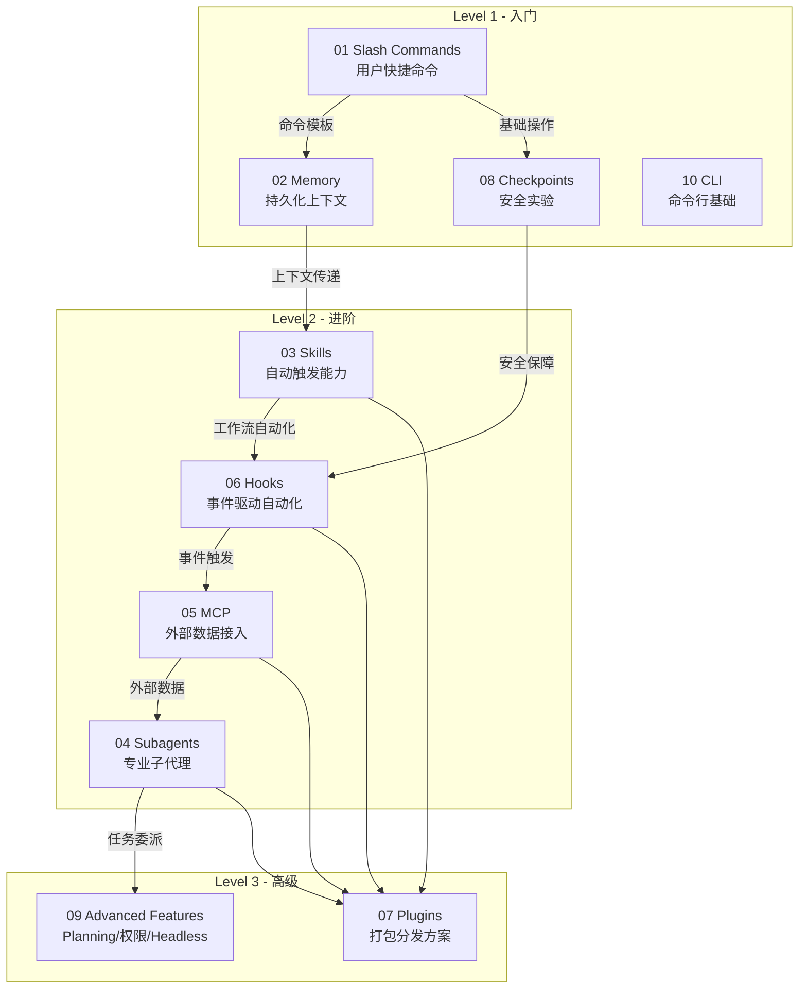
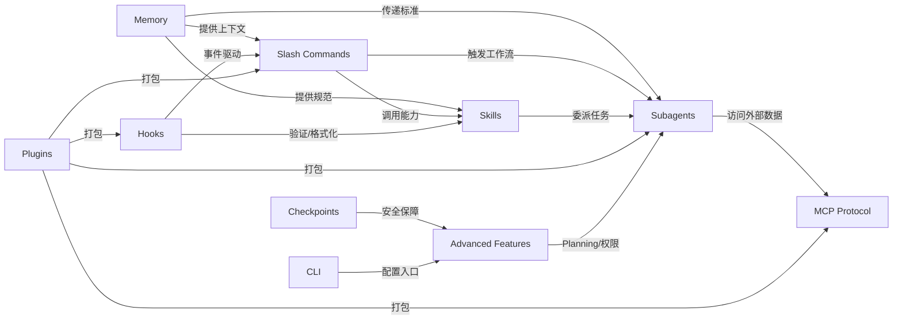
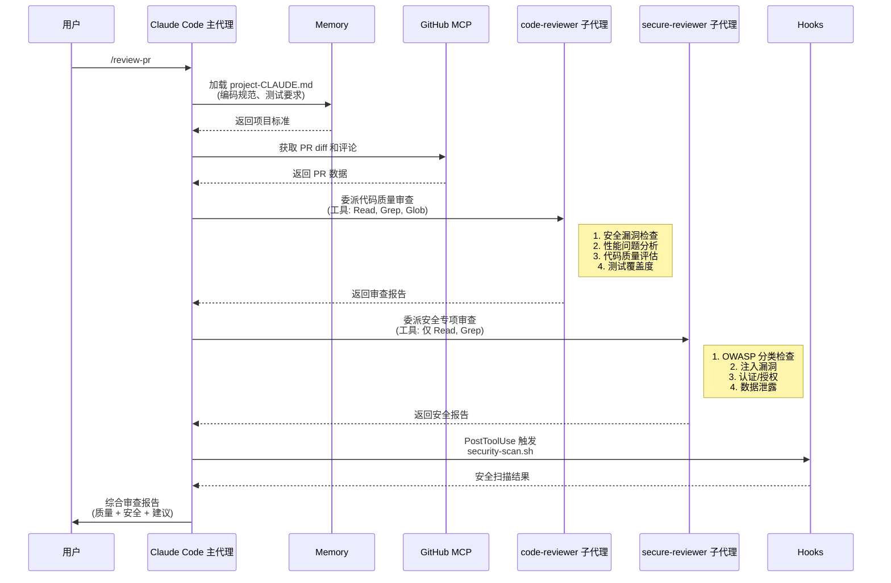
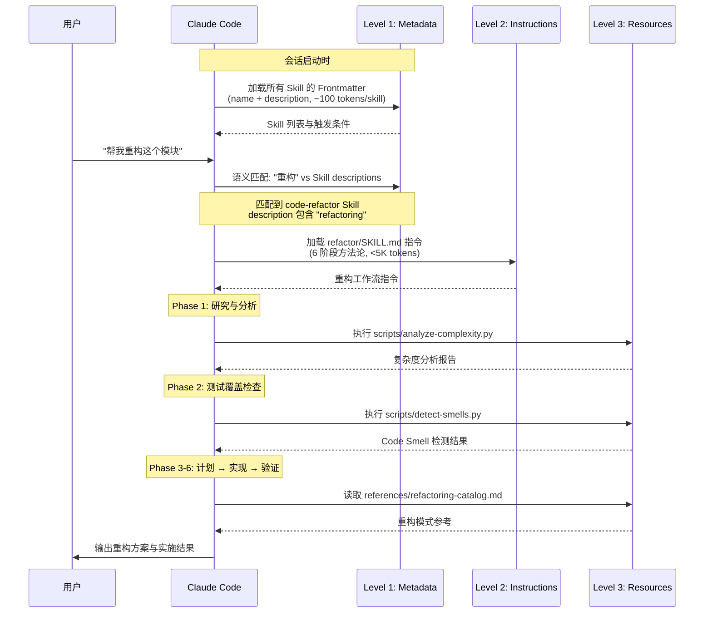

# claude-howto 源码学习笔记

> 仓库地址：[claude-howto](https://github.com/luongnv89/claude-howto)
> 学习日期：2026-04-05

---

> **以下为 AI 源码分析**
>
> ### 一句话概括
>
> 一份结构化、可视化、示例驱动的 Claude Code 全功能教学指南，涵盖 10 大模块共 117+ 功能点，帮助开发者从入门到精通 Claude Code 的 Slash Commands、Memory、Skills、Subagents、MCP、Hooks、Plugins、Checkpoints、Advanced Features 和 CLI。
>
> ### 要点速览
>
> | 模块 | 职责 | 关键文件/目录 |
> |------|------|---------------|
> | **01-slash-commands** | 用户可调用的快捷命令模板（8 个示例） | `optimize.md`, `pr.md`, `commit.md` 等 |
> | **02-memory** | 跨会话持久化上下文（项目/目录/个人三级） | `project-CLAUDE.md`, `personal-CLAUDE.md` |
> | **03-skills** | 可复用的自动触发能力（6 个 Skill） | `code-review/SKILL.md`, `refactor/SKILL.md` 等 |
> | **04-subagents** | 专业化 AI 子代理（8 个定义） | `code-reviewer.md`, `secure-reviewer.md` 等 |
> | **05-mcp** | 外部工具/API 集成协议（4 个配置示例） | `github-mcp.json`, `database-mcp.json` 等 |
> | **06-hooks** | 事件驱动自动化（8 个脚本） | `security-scan.sh`, `format-code.sh` 等 |
> | **07-plugins** | 打包分发的功能集合（3 个完整插件） | `pr-review/`, `devops-automation/` 等 |
> | **08-checkpoints** | 会话快照与回退机制 | `checkpoint-examples.md` |
> | **09-advanced-features** | 高级功能：Planning、权限、Headless 等 | `config-examples.json` |
> | **10-cli** | CLI 命令行参考 | `README.md` |

---

## 项目简介

claude-howto 是一个开源的 Claude Code 教学资源库，由 luongnv89 维护，在 GitHub 上获得 5900+ stars。它不同于 Anthropic 官方的功能参考文档，而是以**结构化教程 + Mermaid 可视化图表 + 可复制粘贴的生产级模板**为核心形式，提供从初学者到高级用户的渐进式学习路径。

项目解决的核心问题：Claude Code 功能强大但缺乏系统化的学习路径，开发者在安装后不知道如何组合使用 Slash Commands、Memory、Skills、Subagents、MCP、Hooks 等功能构建自动化工作流。该指南提供了 10 个教学模块、11-13 小时的完整学习路线，以及即用型配置模板。

## 技术栈

| 类别 | 技术 |
|------|------|
| 语言 | Markdown（文档主体）、Python（工具脚本）、Bash（Hook 脚本）、JSON（配置文件） |
| 框架 | Claude Code 2.1+（目标平台）、Mermaid（图表渲染） |
| 构建工具 | `build_epub.py`（EPUB 电子书生成）、`mmdc`（Mermaid CLI） |
| 依赖管理 | uv（Python）、npm（Node.js 工具链） |
| 测试框架 | pytest（Python 单元测试）、Ruff（代码检查）、Bandit（安全扫描）、mypy（类型检查） |

## 目录结构

```
claude-howto/
├── 01-slash-commands/          # Slash Commands 教程与 8 个命令模板
│   ├── README.md               #   模块文档（55+ 内置命令参考 + 自定义指南）
│   ├── optimize.md             #   /optimize - 代码优化分析
│   ├── pr.md                   #   /pr - PR 准备工作流
│   ├── commit.md               #   /commit - 智能提交（支持动态上下文注入）
│   └── ...                     #   push-all, generate-api-docs, setup-ci-cd 等
├── 02-memory/                  # Memory 持久化上下文教程
│   ├── README.md               #   8 级 Memory 层次结构文档
│   ├── project-CLAUDE.md       #   项目级 CLAUDE.md 模板
│   ├── directory-api-CLAUDE.md #   目录级（API 规范）模板
│   └── personal-CLAUDE.md      #   个人偏好 CLAUDE.md 模板
├── 03-skills/                  # Agent Skills 教程与 6 个 Skill 示例
│   ├── code-review/            #   代码审查 Skill（含脚本和模板）
│   ├── refactor/               #   重构 Skill（基于 Martin Fowler 方法论）
│   ├── brand-voice/            #   品牌语气一致性 Skill
│   ├── doc-generator/          #   API 文档生成 Skill
│   ├── claude-md/              #   CLAUDE.md 管理 Skill
│   └── blog-draft/             #   博客草稿 Skill（多阶段工作流）
├── 04-subagents/               # Subagents 子代理教程与 8 个定义
│   ├── code-reviewer.md        #   代码审查专家（只读工具）
│   ├── test-engineer.md        #   测试工程师（80%+ 覆盖率要求）
│   ├── secure-reviewer.md      #   安全审查（最小权限：仅 Read+Grep）
│   ├── implementation-agent.md #   全栈实现代理（完整工具集）
│   ├── debugger.md             #   调试专家
│   └── ...                     #   documentation-writer, data-scientist, clean-code-reviewer
├── 05-mcp/                     # MCP 协议教程与 4 个配置示例
│   ├── github-mcp.json         #   GitHub 集成配置
│   ├── database-mcp.json       #   数据库（PostgreSQL/MySQL）配置
│   ├── filesystem-mcp.json     #   文件系统操作配置
│   └── multi-mcp.json          #   多服务器组合配置（GitHub+DB+Slack）
├── 06-hooks/                   # Hooks 事件驱动自动化教程
│   ├── format-code.sh          #   PreToolUse:Write 代码自动格式化
│   ├── security-scan.sh        #   PostToolUse:Write 安全扫描
│   ├── pre-commit.sh           #   提交前测试验证
│   ├── validate-prompt.sh      #   用户输入验证（阻止危险操作）
│   ├── context-tracker.py      #   上下文 token 使用监控
│   └── ...                     #   log-bash, notify-team, context-tracker-tiktoken
├── 07-plugins/                 # Plugins 插件教程与 3 个完整插件
│   ├── pr-review/              #   PR 审查插件（commands+agents+mcp+hooks）
│   ├── devops-automation/      #   DevOps 自动化插件（部署/回滚/监控）
│   └── documentation/          #   文档生成插件（API docs+README+sync）
├── 08-checkpoints/             # Checkpoints 会话快照与回退教程
├── 09-advanced-features/       # 高级功能教程（Planning/权限/Headless 等）
├── 10-cli/                     # CLI 命令行完整参考
├── scripts/                    # 构建与质量保障脚本
│   ├── build_epub.py           #   EPUB 电子书生成（异步 Mermaid 渲染）
│   ├── check_links.py          #   外部链接验证
│   ├── check_mermaid.py        #   Mermaid 图语法检查
│   └── check_cross_references.py #  交叉引用验证
├── claude_concepts_guide.md    # 原始概念指南（83KB 全面参考）
├── clean-code-rules.md         # Clean Code 编码规范
├── LEARNING-ROADMAP.md         # 学习路线图（自评+分级+进度跟踪）
└── QUICK_REFERENCE.md          # 快速参考卡片
```

## 架构设计

### 整体架构

claude-howto 采用**模块化教学架构**，将 Claude Code 的 10 大功能领域组织为独立但相互关联的教学模块。整个项目的知识体系遵循"渐进式披露"原则：从最简单的 Slash Commands 开始，逐步引入 Memory、Skills、Subagents 等高级概念，最终教会用户将多个功能组合为自动化工作流。



### 核心模块

#### 模块 1：Slash Commands（01-slash-commands/）

**职责**：提供用户可手动调用的快捷命令模板，是 Claude Code 最基础的扩展机制。

**核心文件**：
- `README.md` — 55+ 内置命令参考 + 自定义命令创建指南
- `optimize.md` — `/optimize` 代码性能分析
- `pr.md` — `/pr` PR 准备工作流（含 `allowed-tools` 工具限制）
- `commit.md` — `/commit` 智能提交（使用 `` !`git status` `` 动态上下文注入）
- `push-all.md` — `/push-all` 批量推送（含密钥检测、大文件检查等安全门禁）

**关键设计**：
- YAML Frontmatter 定义元数据：`description`、`allowed-tools`、`argument-hint`、`tags`
- 支持 `$ARGUMENTS` 参数替换和 `` !`command` `` shell 命令动态注入
- `allowed-tools` 字段限制命令可访问的工具范围（最小权限原则）

**与其他模块的关系**：Slash Commands 可组合 Memory（加载项目规范）、调用 Subagents（委派审查任务）、触发 Hooks（自动格式化），是工作流的入口点。

#### 模块 2：Memory（02-memory/）

**职责**：通过文件系统中的 `CLAUDE.md` 文件实现跨会话的持久化上下文，让 Claude 记住项目规范、团队标准和个人偏好。

**核心文件**：
- `README.md` — 8 级 Memory 层次结构文档
- `project-CLAUDE.md` — 项目级模板（技术栈、架构、编码规范、Git 工作流）
- `directory-api-CLAUDE.md` — 目录级模板（API 验证规则、响应格式、分页策略）
- `personal-CLAUDE.md` — 个人偏好模板（经验水平、代码风格、沟通方式）

**关键接口**：
- 8 级优先级层次：Managed Policy > Managed Drop-ins > Project > Project Rules > User > User Rules > Local > Auto Memory
- 模块化规则系统：`.claude/rules/*.md` 支持 YAML frontmatter 指定路径匹配（如 `paths: src/api/**/*.ts`）
- Auto Memory：`~/.claude/projects/<project>/memory/MEMORY.md` 自动学习机制
- 命令：`/init`（初始化）、`/memory`（编辑）、`#`（快速添加）、`@path`（文件导入）

**与其他模块的关系**：Memory 为所有模块提供上下文基础 — Skills 读取 CLAUDE.md 获取项目规范，Subagents 继承 Memory 中的编码标准，Hooks 可访问 Memory 决定执行策略。

#### 模块 3：Skills（03-skills/）

**职责**：提供可自动触发的复用能力包，通过语义匹配在用户请求相关时自动激活。

**核心文件**：
- `code-review/SKILL.md` — 代码审查 Skill（安全、性能、质量、可维护性四维分析）
- `refactor/SKILL.md` — 重构 Skill（基于 Martin Fowler 方法论的 6 阶段流程）
- `brand-voice/SKILL.md` — 品牌语气一致性（`user-invocable: false`，仅后台自动触发）
- `blog-draft/SKILL.md` — 博客草稿（9 步工作流：研究 → 大纲 → 撰写 → 迭代）

**关键设计**：
- 三级渐进式加载：Level 1 Metadata（~100 tokens 始终加载）→ Level 2 Instructions（触发时加载）→ Level 3 Resources（按需加载）
- 安装位置决定作用域：`~/.claude/skills/`（个人）、`.claude/skills/`（项目）
- Frontmatter 控制调用方式：`disable-model-invocation: true`（仅用户手动调用）、`user-invocable: false`（仅 Claude 自动调用）
- `context: fork` 可在隔离的子代理上下文中运行 Skill

#### 模块 4：Subagents（04-subagents/）

**职责**：提供专业化的 AI 子代理定义，每个子代理拥有独立上下文窗口、定制工具集和专属系统提示词。

**核心文件**：
- `code-reviewer.md` — 只读工具（Read, Grep, Glob），五维审查优先级
- `test-engineer.md` — 完整写入工具，80%+ 覆盖率要求，100% 关键路径
- `secure-reviewer.md` — 最小权限（仅 Read+Grep），OWASP 分类输出
- `implementation-agent.md` — 全功能工具集（Read, Write, Edit, Bash, Grep, Glob）
- `debugger.md` — 5 步调试流程：错误捕获 → git diff → 假设 → 隔离 → 修复

**关键设计**：
- YAML Frontmatter 配置：`tools`（允许工具）、`model`（模型选择）、`permissionMode`、`maxTurns`、`memory`（持久记忆）、`isolation: worktree`（Git worktree 隔离）
- 4 级配置优先级：CLI 定义 > Project > User > Plugin
- 调用方式：自动委派、显式请求、`@`提及、`--agent` 会话级

#### 模块 5：MCP Protocol（05-mcp/）

**职责**：通过标准化协议接入外部工具和 API，为 Claude 提供实时数据访问能力。

**核心文件**：
- `github-mcp.json` — GitHub PR/Issue/Repo 管理
- `database-mcp.json` — PostgreSQL/MySQL 数据库查询
- `filesystem-mcp.json` — 本地文件系统操作
- `multi-mcp.json` — 多服务器组合（GitHub + DB + Slack + 文件系统）

**关键设计**：
- 4 种传输协议：HTTP（推荐）、Stdio（本地）、WebSocket（持久双向）、SSE（已弃用）
- OAuth 2.0 认证支持，token 存储在系统钥匙链
- 环境变量扩展：`${VAR}` 和 `${VAR:-default}` 语法
- Tool Search：工具描述超过上下文 10% 时自动启用搜索
- 子代理作用域 MCP：在 Subagent frontmatter 中内联定义专属 MCP 服务器

#### 模块 6：Hooks（06-hooks/）

**职责**：25 种事件驱动的自动化钩子，在 Claude Code 的工具调用、会话管理、任务执行等生命周期节点自动执行。

**核心文件**：
- `format-code.sh` — PreToolUse:Write 触发，支持 Prettier/Black/gofmt/rustfmt
- `security-scan.sh` — PostToolUse:Write 触发，检测硬编码密码/API Key/私钥
- `pre-commit.sh` — 检测 git commit 命令时运行测试，失败则阻止提交
- `validate-prompt.sh` — UserPromptSubmit 触发，阻止 `rm -rf`、数据库删除等危险操作
- `context-tracker.py` — Token 使用监控（字符估算 ~80-90% 准确度）

**关键设计**：
- 4 种 Hook 类型：Command（Shell 脚本）、HTTP（Webhook）、Prompt（LLM 评估）、Agent（子代理验证）
- JSON stdin/stdout 协议，exit code 语义：0=成功，2=阻止操作，其他=警告
- Matcher 模式：精确匹配 `"Write"`、正则 `"Edit\\|Write"`、通配符 `"*"`
- 6 级配置优先级：组件 Frontmatter > Plugin > settings.local.json > settings.json > ~/.claude/settings.json > Managed Policy

#### 模块 7：Plugins（07-plugins/）

**职责**：将 Commands、Agents、Skills、Hooks、MCP 等功能打包为可分发的完整解决方案。

**核心文件**：
- `pr-review/` — PR 审查插件：3 命令 + 3 子代理 + GitHub MCP + pre-review Hook
- `devops-automation/` — DevOps 插件：4 命令 + 3 子代理 + K8s MCP + 部署脚本
- `documentation/` — 文档插件：4 命令 + 3 子代理 + 3 模板

**关键设计**：
- `.claude-plugin/plugin.json` 清单文件定义插件元数据
- 支持 `userConfig` 配置项（`sensitive: true` 存储到钥匙链）
- 安装方式：`/plugin install name`（Marketplace）、`github:user/repo`（Git）、`--plugin-dir`（本地开发）
- 插件子代理沙箱限制：不能注册 Hooks、不能配置 MCP、不能覆盖权限模式
- Marketplace 分发：Official / Community / Organization / Personal 四种类型

### 模块依赖关系



## 核心流程

### 流程一：自动化代码审查工作流

这是项目中最典型的多模块协作流程，展示了 Slash Commands + Memory + Subagents + MCP + Hooks 的完整组合。



**关键逻辑说明**：
1. 用户通过 `/review-pr` Slash Command 触发流程
2. 主代理从 Memory 加载项目编码规范作为审查基准
3. 通过 GitHub MCP 获取 PR 的实时数据（diff、评论、文件变更）
4. 并行委派两个子代理：`code-reviewer`（只读工具集）负责代码质量，`secure-reviewer`（最小权限仅 Read+Grep）负责安全审查
5. Hooks 在工具执行后自动运行安全扫描脚本
6. 主代理综合所有结果，输出结构化审查报告

### 流程二：Skills 渐进式加载与自动触发

展示 Skills 的三级加载机制和自动匹配触发逻辑。



**关键逻辑说明**：
1. **Level 1（始终加载）**：会话启动时仅加载所有 Skill 的 YAML Frontmatter（name + description），每个约 100 tokens，不消耗大量上下文
2. **语义匹配**：Claude 根据用户请求语义与 Skill description 自动匹配，无需显式调用
3. **Level 2（触发时加载）**：匹配成功后加载 SKILL.md 正文指令（< 5K tokens），包含具体工作流步骤
4. **Level 3（按需加载）**：脚本和模板文件通过 Bash 工具执行，结果返回但文件本身不占用上下文
5. 整个过程实现了上下文效率最大化：只在需要时加载需要的内容

## 关键设计亮点

### 1. 最小权限原则的分层实现

**解决的问题**：不同任务需要不同级别的系统访问权限，过度授权会带来安全风险。

**实现方式**：
- Slash Commands 通过 `allowed-tools` Frontmatter 限制工具（如 `/pr` 仅允许 `Bash(git add:*)`, `Bash(git diff:*)`）
- Subagents 按角色设计工具集：`secure-reviewer` 仅有 Read+Grep（绝对只读），`implementation-agent` 拥有全部工具
- Plugins 子代理沙箱：不能注册 Hooks、配置 MCP 或覆盖权限模式，防止权限提升
- 6 种 Permission Modes（default → plan → confirm → auto → dontAsk → bypassPermissions）提供渐进式权限控制

**设计原因**：安全审查只需读取代码，给予写入权限只会增加误操作风险。每个组件只获得完成任务所需的最小工具集，从架构层面防止安全事故。

### 2. Memory 的 8 级层次优先级

**解决的问题**：企业级场景中，组织策略、项目规范、团队标准、个人偏好需要共存且有明确的优先级。

**实现方式**（`02-memory/README.md`）：
1. Managed Policy（组织强制策略）
2. Managed Drop-ins（模块化组织策略）
3. Project Memory（`.claude/CLAUDE.md`，Git 版本控制）
4. Project Rules（`.claude/rules/*.md`，支持路径匹配）
5. User Memory（`~/.claude/CLAUDE.md`）
6. User Rules（`~/.claude/rules/*.md`）
7. Local Project Memory（`CLAUDE.local.md`，Git 忽略）
8. Auto Memory（Claude 自动学习笔记）

**设计原因**：企业中安全策略必须不可覆盖（Managed Policy 最高优先级），项目规范优先于个人偏好，但个人偏好可以在不冲突的情况下生效。路径匹配规则（如 `paths: src/api/**/*.ts`）实现了精确到目录级别的上下文定制。

### 3. Skills 的三级渐进式披露

**解决的问题**：大量 Skills 同时加载会消耗宝贵的上下文窗口空间。

**实现方式**（`03-skills/README.md`）：
- Level 1 Metadata：仅加载 name + description（~100 tokens/skill），始终在上下文中
- Level 2 Instructions：匹配触发后加载 SKILL.md 正文（< 5K tokens）
- Level 3 Resources：脚本/模板通过 Bash 执行，数据留在执行环境中不进入上下文
- Description Budget：Skill 描述总量限制在上下文窗口的 2%

**设计原因**：上下文窗口是 LLM 最稀缺的资源。10 个 Skill 在 Level 1 仅消耗约 1000 tokens，而完全展开可能需要 50K+ tokens。按需加载确保了在拥有丰富能力的同时保持上下文效率。

### 4. Hooks 的 JSON 协议与 Exit Code 语义

**解决的问题**：Hook 脚本需要与 Claude Code 进行结构化通信，支持阻止操作、修改参数、注入系统消息等复杂交互。

**实现方式**（`06-hooks/README.md` 和各脚本文件）：
- JSON stdin 输入：包含 `session_id`、`tool_name`、`tool_input`、`cwd` 等完整上下文
- JSON stdout 输出：支持 `continue`（是否继续）、`systemMessage`（注入警告）、`updatedInput`（修改工具参数）、`permissionDecision`（allow/deny/ask）
- Exit Code 语义：0=成功解析输出，2=阻止操作并显示错误，其他=非阻塞警告
- 如 `validate-prompt.sh` 检测到 `rm -rf /` 时返回 exit 2 直接阻止，检测到 "refactor without tests" 时返回 `systemMessage` 警告

**设计原因**：简单的 success/fail 不够灵活。JSON 协议让 Hook 可以精细控制操作流程 — 不仅能阻止危险操作，还能修改工具参数（如自动格式化代码后传递给 Write 工具），或者在不阻止操作的情况下注入安全提醒。

### 5. Plugin 的多组件打包与 Marketplace 分发

**解决的问题**：团队需要将 Commands + Agents + Skills + Hooks + MCP 作为一个整体来分发和管理。

**实现方式**（`07-plugins/README.md`）：
- `.claude-plugin/plugin.json` 清单文件定义元数据和用户配置（敏感配置自动存入钥匙链）
- 统一目录结构：`commands/` + `agents/` + `skills/` + `hooks/` + `.mcp.json` + `templates/` + `scripts/`
- 多来源安装：Marketplace、GitHub、本地目录、npm/pip 包
- 企业管理：`enabledPlugins` 白名单、`deniedPlugins` 黑名单、`strictKnownMarketplaces` 限制来源
- 如 `pr-review` 插件一次安装即获得 `/review-pr` 命令 + security-reviewer 子代理 + GitHub MCP + pre-review Hook

**设计原因**：单独管理 Commands、Agents、MCP 配置在团队规模下不可维护。Plugin 机制将相关功能原子化打包，一键安装确保所有组件版本一致、配置正确，同时企业管理功能防止了未授权插件的使用。
