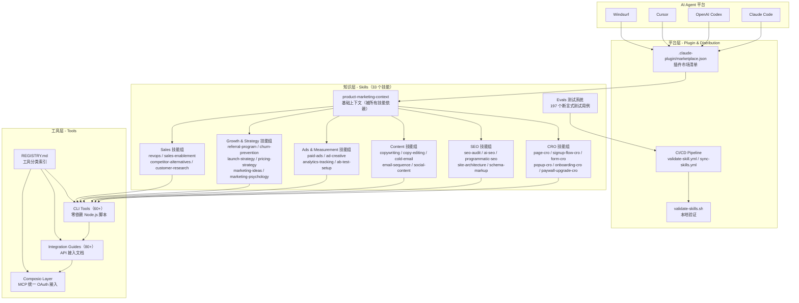
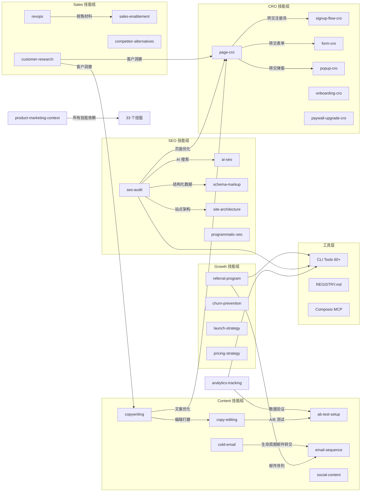
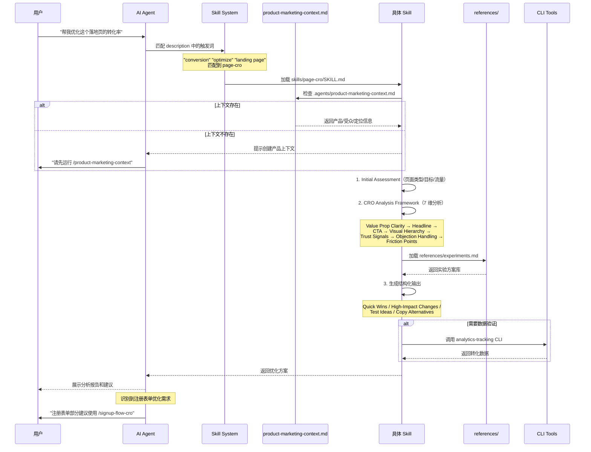
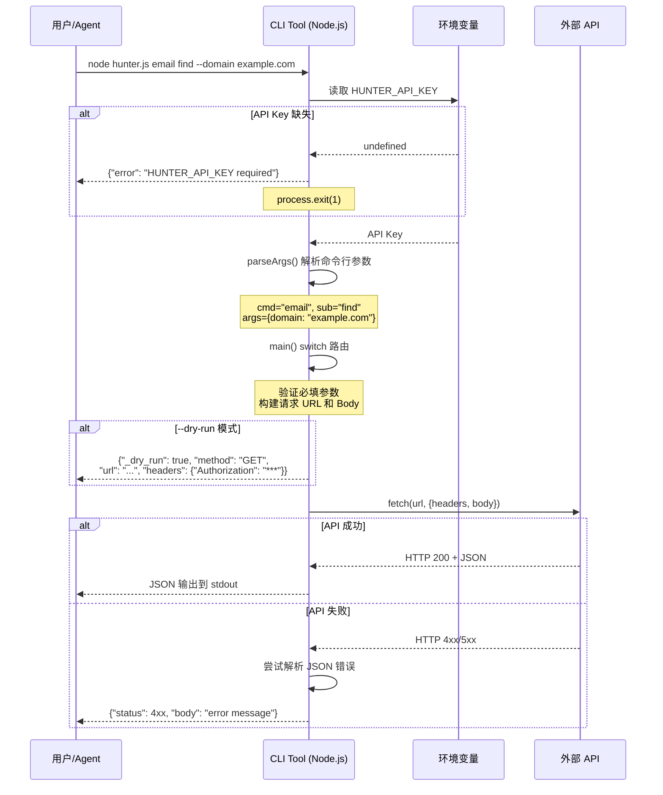
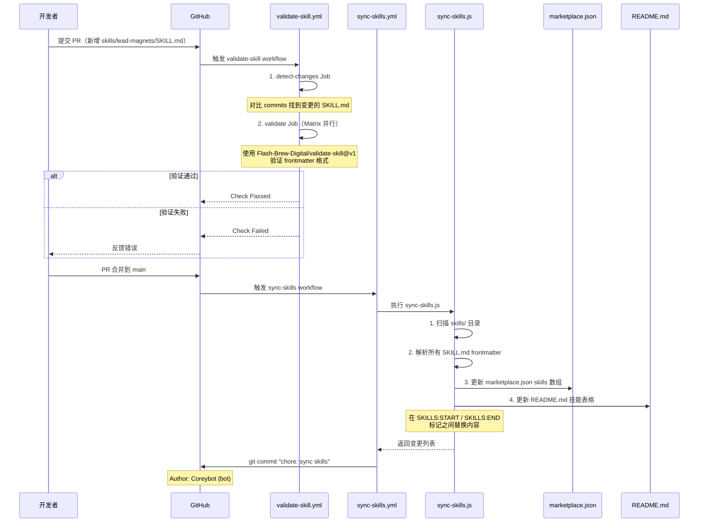

# marketingskills 源码学习笔记

> 仓库地址：[marketingskills](https://github.com/coreyhaines31/marketingskills)
> 学习日期：2026-04-05

---

> **以下为 AI 源码分析**
>
> ### 一句话概括
>
> 一套面向 AI Agent 的营销技能（Skills）集合，包含 33 个 Markdown 技能定义和 60+ 个零依赖 Node.js CLI 工具，让 Claude Code、Codex、Cursor 等 AI 编码 Agent 具备 CRO、SEO、Copywriting、广告投放、增长运营等专业营销能力。
>
> ### 要点速览
>
> | 核心模块 | 职责 | 关键文件 |
> |----------|------|----------|
> | Skills（技能定义） | 33 个 Markdown 技能文件，赋予 Agent 专业营销知识和工作流 | `skills/*/SKILL.md` |
> | CLI Tools（命令行工具） | 60+ 个零依赖 Node.js 脚本，封装各营销平台 API | `tools/clis/*.js` |
> | Integration Guides（集成指南） | 80+ 个平台的 API 接入指南 | `tools/integrations/*.md` |
> | Composio Layer（集成层） | 通过 MCP 为 OAuth 重型工具提供统一接入 | `tools/composio/` |
> | Plugin Marketplace（插件市场） | Claude Code 插件市场清单 | `.claude-plugin/marketplace.json` |
> | CI/CD Pipeline | 自动化验证、同步和发布 | `.github/workflows/` |
> | Evals（质量测试） | 197 个测试用例覆盖全部 33 个技能 | `skills/*/evals/evals.json` |

---

## 项目简介

Marketing Skills 是一个为 AI Agent 构建的营销技能知识库，由 Corey Haines 创建并开源（MIT 协议）。项目的核心理念是：通过标准化的 Markdown 技能文件，让 AI 编码 Agent（如 Claude Code、OpenAI Codex、Cursor、Windsurf 等）在用户提出营销相关需求时，能够自动识别任务类型并调用专业的营销框架和最佳实践。

项目遵循 [Agent Skills 规范](https://agentskills.io/specification.md)，是一个跨 Agent 平台的通用解决方案。它解决的核心问题是：AI Agent 在通用场景下缺乏营销领域的专业知识和结构化工作流，导致营销任务输出质量不高。通过注入专业技能定义，Agent 可以像一位资深营销专家一样工作——从 CRO（转化率优化）、SEO 审计、文案撰写到冷邮件、定价策略、增长黑客，覆盖 SaaS 营销的完整生命周期。

## 技术栈

| 类别 | 技术 |
|------|------|
| 语言 | Markdown（技能定义）、JavaScript/Node.js（CLI 工具） |
| 框架 | Agent Skills Specification（技能标准）、Claude Code Plugin System |
| 构建工具 | 无构建步骤（Skills 为纯内容；CLI 为零依赖脚本） |
| 依赖管理 | 无（CLI 工具使用 Node.js 18+ 原生 `fetch` API，零 npm 依赖） |
| 测试框架 | 自定义 JSON Evals 系统（`evals.json` 断言式测试） |

## 目录结构

```
marketingskills/
├── skills/                          # 33 个 Agent 技能定义
│   ├── product-marketing-context/   #   基础技能：产品营销上下文（被所有技能依赖）
│   ├── page-cro/                    #   CRO：页面转化率优化
│   ├── copywriting/                 #   文案：营销页面文案撰写
│   ├── seo-audit/                   #   SEO：搜索引擎优化审计
│   ├── cold-email/                  #   冷邮件：B2B 冷启动外发邮件
│   ├── analytics-tracking/          #   分析：事件追踪和埋点
│   ├── referral-program/            #   增长：推荐计划设计
│   └── ...                          #   另外 26 个技能
│       ├── SKILL.md                 #     主技能文件（<500行，YAML frontmatter）
│       ├── evals/                   #     测试用例
│       │   └── evals.json           #       JSON 格式的断言式测试
│       └── references/              #     参考资料（框架、示例、指南）
├── tools/
│   ├── clis/                        # 60+ 零依赖 Node.js CLI 工具
│   │   ├── README.md                #   安装和使用说明
│   │   ├── ga4.js                   #   Google Analytics 4 CLI
│   │   ├── stripe.js                #   Stripe 支付 CLI
│   │   ├── hunter.js                #   Hunter 邮件查找 CLI
│   │   └── ...                      #   57+ 其他 CLI 工具
│   ├── integrations/                # 80+ 平台 API 集成指南
│   │   ├── hubspot.md               #   HubSpot CRM
│   │   ├── composio.md              #   Composio 统一接入层
│   │   └── ...
│   ├── composio/                    # Composio MCP 集成层
│   │   ├── README.md                #   快速开始
│   │   └── marketing-tools.md       #   工具映射表
│   └── REGISTRY.md                  # 工具注册表（按分类索引）
├── .claude-plugin/
│   └── marketplace.json             # Claude Code 插件市场清单
├── .github/
│   ├── workflows/
│   │   ├── validate-skill.yml       #   CI：技能验证（PR 触发）
│   │   └── sync-skills.yml          #   CD：自动同步 marketplace.json 和 README
│   ├── scripts/
│   │   └── sync-skills.js           #   同步脚本（解析 frontmatter → 更新清单）
│   ├── ISSUE_TEMPLATE/              #   Issue 模板
│   └── PULL_REQUEST_TEMPLATE/       #   PR 模板
├── validate-skills.sh               # 本地验证脚本（自研）
├── validate-skills-official.sh      # 官方验证脚本（基于 skills-ref）
├── VERSIONS.md                      # 技能版本追踪表
├── CONTRIBUTING.md                  # 贡献指南
├── AGENTS.md                        # AI Agent 工作指南
└── README.md                        # 项目文档
```

## 架构设计

### 整体架构

Marketing Skills 采用**以知识为中心的插件化架构**，核心设计思路是将营销专业知识从 AI Agent 的通用能力中解耦出来，以标准化的 Markdown 文件形式注入。架构分为三层：知识层（Skills）、工具层（Tools）、平台层（Plugin/CI/CD）。



### 核心模块

#### 1. Skills 知识层（技能定义）

**职责**：为 AI Agent 提供营销领域的专业知识、工作流和输出模板

**核心文件**：`skills/*/SKILL.md`（33 个技能文件）

**架构特征**：

- **Context-First 模式**：所有技能执行前先检查 `.agents/product-marketing-context.md`，确保 Agent 了解产品、受众和定位
- **Framework-Based 方法**：每个技能围绕专业框架组织，而非线性检查清单。例如 `page-cro` 有 7 维 CRO 分析框架，`cold-email` 有 7 种邮件结构框架（PAS、BAB、QVC 等）
- **Boundary-Aware 边界意识**：技能明确知道自己的能力边界，会主动将请求转交给更合适的技能（如 `page-cro` 会将注册表单优化转交给 `signup-flow-cro`）
- **Progressive Elaboration 渐进式深入**：核心指导在 SKILL.md 中（<500 行），详细参考资料放在 `references/` 子目录

**关键技能分类**：

| 类别 | 技能数量 | 代表技能 |
|------|----------|----------|
| CRO（转化率优化） | 6 | `page-cro`、`signup-flow-cro`、`onboarding-cro` |
| SEO & 发现 | 6 | `seo-audit`、`ai-seo`、`programmatic-seo` |
| Content & Copy | 5 | `copywriting`、`cold-email`、`email-sequence` |
| Ads & 测量 | 4 | `paid-ads`、`ad-creative`、`analytics-tracking` |
| Growth & Strategy | 8 | `referral-program`、`pricing-strategy`、`launch-strategy` |
| Sales & RevOps | 4 | `revops`、`sales-enablement`、`customer-research` |

#### 2. CLI Tools 工具层（命令行工具）

**职责**：封装 60+ 营销平台的 API，提供统一的命令行接口

**核心文件**：`tools/clis/*.js`

**架构特征**：

- **零依赖设计**：每个 CLI 是独立的单文件 Node.js 脚本，仅使用 Node 18+ 原生 `fetch` API
- **统一接口模式**：`{tool} <resource> <action> [--options]`（如 `hunter email find --domain example.com`）
- **环境变量认证**：通过 `{TOOL}_API_KEY` 环境变量传递凭证
- **JSON-only I/O**：所有输入输出均为 JSON，便于脚本化和管道操作
- **Dry-Run 支持**：`--dry-run` 参数可预览 API 请求而不实际发送

#### 3. Integration Guides（集成指南）

**职责**：为 80+ 营销平台提供详细的 API 接入文档

**核心文件**：`tools/integrations/*.md`、`tools/REGISTRY.md`

**架构特征**：

- **分类索引**：`REGISTRY.md` 按 Analytics、SEO、CRM、Email、Ads 等分类索引
- **四种接入方式标注**：每个工具标注 API / MCP / CLI / SDK 可用性
- **Agent 推荐**：每个分类附带场景化推荐（如 "Start with GA4 if using Google ecosystem"）

#### 4. Composio 集成层

**职责**：通过 MCP（Model Context Protocol）为 OAuth 重型工具提供统一接入

**核心文件**：`tools/composio/`、`tools/integrations/composio.md`

**架构特征**：

- **托管 OAuth**：Composio 管理 500+ 工具的 OAuth 认证流程和 Token 刷新
- **三层覆盖深度**：Deep（20+ actions）→ Medium（5-20）→ Shallow（<5）
- **补充定位**：优先使用原生 MCP Server（如 GA4、Stripe），Composio 覆盖无原生 MCP 的平台（如 HubSpot、Salesforce、Meta Ads）

#### 5. Evals 测试系统

**职责**：197 个断言式测试用例，确保技能输出质量

**核心文件**：`skills/*/evals/evals.json`

**架构特征**：

- **JSON 格式**：每个测试包含 `prompt`（输入）、`expected_output`（预期描述）、`assertions`（8-18 个断言条件）
- **四类断言**：上下文检查、框架应用、输出结构、边界转交
- **边界测试**：专门验证技能识别"不属于自己领域"的能力

### 模块依赖关系



## 核心流程

### 流程一：Skill 触发与执行

用户向 AI Agent 提出营销需求时，技能的完整调用链：



### 流程二：CLI Tool API 调用

CLI 工具处理 API 请求的统一流程：



### 流程三：CI/CD 自动化同步

当新技能合并到 main 分支时的自动化流程：



## 关键设计亮点

### 1. Context-First 架构：`product-marketing-context` 作为全局上下文

**解决的问题**：AI Agent 做营销分析时缺乏对产品、受众和竞争格局的了解，每次都需要重复收集信息。

**具体实现**：

- `product-marketing-context` 是唯一没有 `references/` 目录的"元技能"，它的输出本身就是其他所有技能的输入
- 生成的 `.agents/product-marketing-context.md` 包含 12 个维度：产品概述、目标受众、用户画像、痛点、竞争格局、差异化、异议处理、切换动力（JTBD Four Forces）、客户原话、品牌调性、信任背书、业务目标
- 所有 33 个技能在执行第一步都检查该文件是否存在，若不存在则引导用户先创建
- 文件路径从 `.claude/` 迁移到 `.agents/`（v1.1.0），保留向后兼容 fallback

**为什么这样设计**：避免每个技能独立收集重复信息，实现"一次录入，全局复用"。同时 `.agents/` 路径符合 Agent Skills 跨平台规范，不绑定 Claude Code。

### 2. 零依赖 CLI 工具设计：单文件 + 原生 fetch

**解决的问题**：AI Agent 需要与 60+ 营销平台 API 交互，但传统 SDK 安装依赖多、版本冲突频繁。

**具体实现**（参考 `tools/clis/hunter.js`、`tools/clis/ga4.js`）：

- 每个 CLI 是一个独立的 `.js` 文件，无任何 `require()` 或 `import`（除 Node.js 内置模块）
- 使用 Node.js 18+ 原生 `fetch()` API 发起 HTTP 请求
- 统一的 `parseArgs()` 函数手写解析命令行参数（不依赖 `yargs`、`commander` 等）
- 统一的 `api()` 函数处理请求构建、认证注入和错误处理，并支持 `--dry-run`
- 所有输出为 JSON，错误也是 JSON（`{ "error": "..." }`），便于 Agent 解析

**为什么这样设计**：零依赖 = 零安装步骤 + 零版本冲突。AI Agent 可以直接 `node tool.js` 执行，无需 `npm install`。单文件设计也便于分发和代码审计。

### 3. Skill 边界意识与自动转交（Deference Pattern）

**解决的问题**：33 个技能存在领域交叉（如 `page-cro` 和 `signup-flow-cro` 都涉及页面优化），如何避免技能越界？

**具体实现**（参考 `skills/page-cro/SKILL.md`、`skills/page-cro/evals/evals.json`）：

- 每个技能在 SKILL.md 的 Related Skills 部分明确列出相关技能和边界
- Evals 测试中包含**边界转交测试用例**：模拟一个属于其他技能领域的请求，验证当前技能能否正确识别并推荐用户使用更合适的技能
- 例如 `page-cro` 的 eval 测试会验证：当用户请求优化注册表单时，是否正确转交给 `signup-flow-cro`
- 技能间形成清晰的"转交网络"：`page-cro` → `signup-flow-cro` / `form-cro` / `popup-cro`

**为什么这样设计**：防止技能产生低质量的越界输出。与其让一个通用技能勉强覆盖所有场景，不如让每个技能专注自己的核心领域，并在边界处精准转交。

### 4. Evals 断言式测试：面向 AI 输出的质量保证

**解决的问题**：如何验证 AI Agent 在使用技能后产出的内容质量？传统单元测试无法测试非确定性的自然语言输出。

**具体实现**（参考 `skills/page-cro/evals/evals.json`）：

- 每个测试用例包含 `prompt`（模拟用户输入）和 8-18 个 `assertions`（断言条件）
- 断言覆盖四个维度：
  - **上下文检查**：Agent 是否查找了 `product-marketing-context.md`
  - **框架应用**：Agent 是否使用了正确的分析框架（如 7 维 CRO 框架）
  - **输出结构**：输出是否包含规定的章节（Quick Wins、High-Impact Changes 等）
  - **边界处理**：Agent 是否正确识别了越界请求
- 197 个测试覆盖全部 33 个技能，平均每个技能 6 个测试

**为什么这样设计**：AI 输出是非确定性的，不能用精确匹配测试。断言式方法只检查"输出是否包含关键要素"，而不要求逐字匹配，既保证了质量下限，又保留了 AI 的灵活性。

### 5. CI/CD 双向自动同步：代码即文档

**解决的问题**：`marketplace.json`、`README.md` 中的技能列表和 `skills/` 目录下的实际技能容易不一致。

**具体实现**（参考 `.github/workflows/sync-skills.yml`、`.github/scripts/sync-skills.js`）：

- `sync-skills.js` 扫描 `skills/` 目录，解析每个 `SKILL.md` 的 YAML frontmatter
- 自动更新 `.claude-plugin/marketplace.json` 中的技能路径列表和数量描述
- 自动更新 `README.md` 中 `<!-- SKILLS:START -->` 和 `<!-- SKILLS:END -->` 标记之间的技能表格
- 由 `sync-skills.yml` 在每次 push 到 main 时自动触发，以 Bot 身份提交 commit
- 描述超过 120 字符自动截断，保持表格整洁

**为什么这样设计**：开发者只需要关注 `SKILL.md` 文件本身，插件清单和文档索引由 CI/CD 自动维护，实现"Single Source of Truth"——`skills/*/SKILL.md` 的 frontmatter 是唯一的技能元数据来源。
