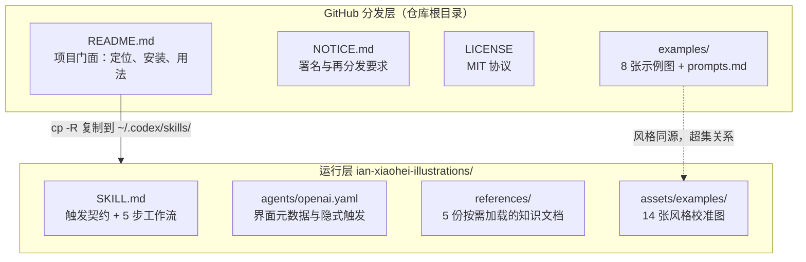
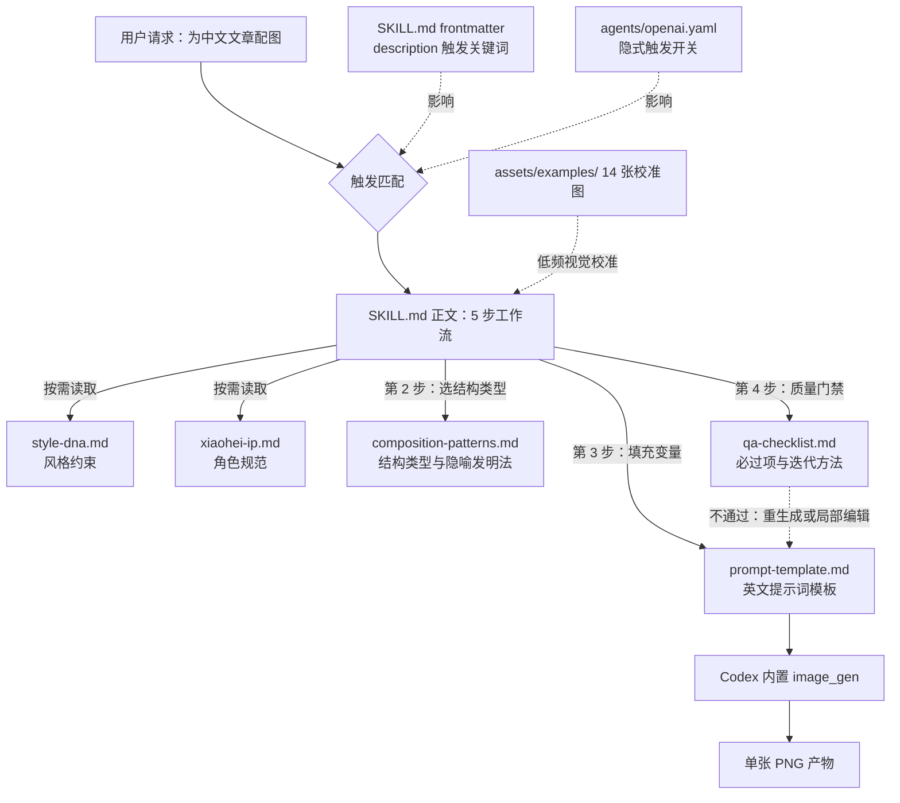
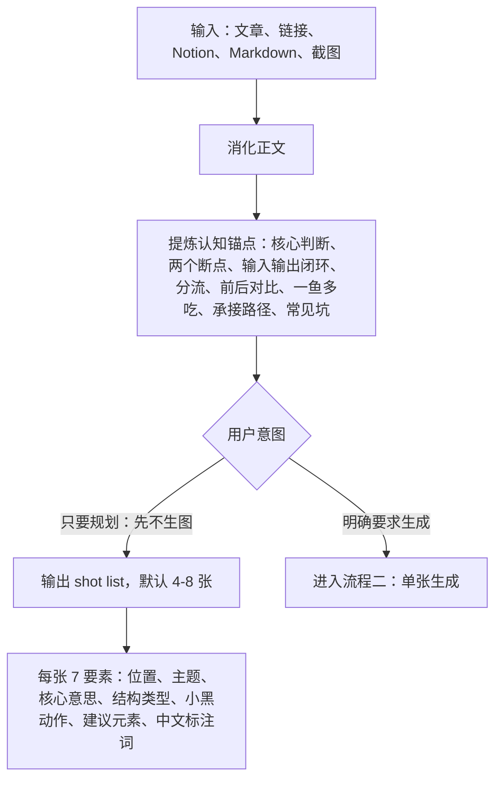
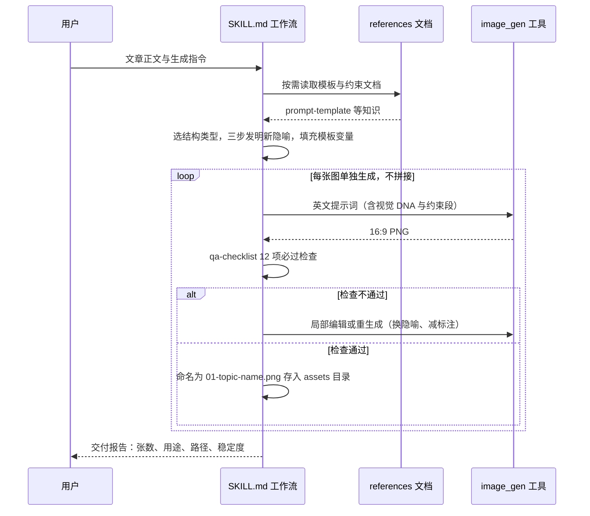

# ian-xiaohei-illustrations 源码学习笔记

> 仓库地址：[ian-xiaohei-illustrations](https://github.com/helloianneo/ian-xiaohei-illustrations)
> 学习日期：2026-09-30

---

> **以下为 AI 源码分析**
>
> ### 一句话概括
>
> 一个"零代码"的 Codex Skill：仅靠 1 份 SKILL.md 入口、5 份 Markdown 知识文档、1 张英文提示词模板和 14 张风格校准图，就把"为中文文章配怪诞手绘插图"这件主观审美活，约束成 AI 可稳定复用的生产流程。
>
> ### 要点速览
>
> | 模块 | 职责 | 关键文件 |
> |------|------|---------|
> | Skill 入口 | 触发契约（frontmatter description 关键词）+ 5 步工作流 + 输出口径 | `ian-xiaohei-illustrations/SKILL.md` |
> | Codex 界面元数据 | 展示名、默认 prompt、隐式触发开关 | `ian-xiaohei-illustrations/agents/openai.yaml` |
> | 风格约束 | 视觉 DNA、四色语义、禁忌清单 | `references/style-dna.md` |
> | 角色 IP 规范 | 小黑外形、性格、动作库、禁止事项、装饰判定 | `references/xiaohei-ip.md` |
> | 构图知识 | 8 种结构类型、三步隐喻发明法、反复刻规则 | `references/composition-patterns.md` |
> | 生图模板 | 单张图英文提示词模板（6 组变量）+ 2 个改图模板 | `references/prompt-template.md` |
> | 质量门禁 | 12 条必过项、10 类失败信号、6 种迭代方法 | `references/qa-checklist.md` |
> | 校准资产 | 14 张 1672×941 风格样例，仅校准不复刻 | `assets/examples/` |
> | 分发门面 | README 安装指引、NOTICE 署名要求、MIT 协议 | 根目录与 `examples/` |

---

## 项目简介

ian-xiaohei-illustrations 是作者 Ian 发布的 Codex Skill，用于指导 AI Agent 为中文文章（博客、帖子、Notion 文档、方法论内容）设计并生成 16:9 横版正文配图。

它解决的问题很具体：AI 生图默认输出的是"商业插画 / PPT 信息图 / 可爱卡通"，而中文知识内容需要的是"白纸上的怪诞产品草图"——一种有个人识别度、能表达认知结构、比信息图更轻的视觉语言。仓库把这套审美体系完整编码成机器可执行的约束：视觉 DNA（纯白底、黑线稿、留白 35% 以上）、固定 IP 角色"小黑"（黑色实心、白点眼、必须承担核心动作）、8 种构图结构类型、四色标注语义，再通过 QA 闭环保证风格不漂移。

整个仓库没有一行可执行代码，全部"源码"是结构化 Markdown 提示词工程，唯一依赖的外部能力是 Codex 内置的 `image_gen` 工具。学习边界说明：本次分析未能直接查看示例图片内容（运行环境不支持读图），对图片的判断基于文件名、PNG 规格（统一 1672×941，即 16:9）与文档描述。

## 技术栈

| 类别 | 技术 |
|------|------|
| 语言 | Markdown + YAML frontmatter（无可执行代码） |
| 运行平台 | OpenAI Codex Skill 体系（安装到 `~/.codex/skills/`） |
| 核心依赖 | Codex 内置 `image_gen` 工具（唯一外部能力） |
| 包管理 / 安装 | `git clone` + `cp -R` 手工复制 |
| 构建工具 | 无（纯静态文档） |
| 测试框架 | 无自动化测试，以 `references/qa-checklist.md` 检查清单替代 |

## 目录结构

```text
.
├── README.md                      # GitHub 门面：定位、安装、用法、工作流程总览
├── LICENSE                        # MIT 协议
├── NOTICE.md                      # 署名要求：再分发需保留名称或注明 Ian
├── .gitignore                     # 忽略 generated/ outputs/ dist/（本地产物约定）
├── assets/
│   └── ian-wechat-qr.jpg          # 作者微信二维码（README 展示用）
├── examples/                      # —— 分发层：给 GitHub 访客看 ——
│   ├── images/                    # 8 张 1672×941 PNG 风格样例
│   └── prompts.md                 # 8 个可直接复制的 Codex prompt 范例
└── ian-xiaohei-illustrations/     # —— 运行层：真正安装到 Codex 的目录 ——
    ├── SKILL.md                   # 入口：frontmatter 触发契约 + 5 步工作流
    ├── agents/
    │   └── openai.yaml            # Codex 界面元数据 + 隐式触发开关
    ├── assets/
    │   └── examples/              # 14 张校准图（根目录 8 张的超集）
    └── references/                # 5 份按需加载的知识文档
        ├── style-dna.md           # 风格 DNA：必须 / 颜色 / 绝对不要
        ├── xiaohei-ip.md          # 小黑 IP：外形 / 性格 / 职责 / 禁止 / 判定标准
        ├── composition-patterns.md # 构图：8 种结构 + 隐喻发明法 + 反复刻规则
        ├── prompt-template.md     # 单张生图英文模板（6 组变量）+ 改图模板
        └── qa-checklist.md        # QA：必过项 / 失败信号 / 迭代方法 / 交付判断
```

值得注意的一个细节：根目录 `examples/images/` 有 8 张图，skill 内 `assets/examples/` 有 14 张，后者是前者的超集（多出 `02-minimum-loop`、`06-three-sources`、`07-three-content-jobs`、`08-handoff-copy-toolbox`、`09-common-pits-no-title`、`13-system-bearing` 等编号，其余同名图仅编号偏移）。分发层只精选代表作，运行层保留全量校准集。文件名 `09-common-pits-no-title.png` 甚至把一条 QA 规则（图上不要出现类型标题）编码进了文件名。

## 架构设计

### 整体架构

仓库采用**双层打包 + 渐进披露**架构：

- **双层打包**：根目录是面向 GitHub 访客的"分发层"（README / NOTICE / LICENSE / examples），真正的运行层是 `ian-xiaohei-illustrations/` 子目录。安装动作只复制这个子目录到 `${CODEX_HOME:-$HOME/.codex}/skills/`。两层互不依赖——删掉根目录全部门面文件，skill 仍能完整运行。
- **渐进披露（progressive disclosure）**：SKILL.md 只保留约 107 行的精简入口（触发契约 + 工作流骨架），所有细节下沉到 `references/`，并且明确指令"按任务需要读取，不要一次塞满上下文"。这是 Agent Skill 设计的典型上下文经济学：入口常驻，知识按需。



### 核心模块

**1. SKILL.md（入口模块）**

- frontmatter 只有两个字段：`name` 和 `description`。`description` 是唯一的触发面，刻意堆满触发关键词（怪诞、小黑、手绘、正文配图、文章插图、shot list、去标题/改图），让 Codex 的隐式匹配有足够词面可命中。
- 正文定义 5 步工作流：消化正文 → 先出配图策略 → 单张生成 → 检查与迭代 → 保存交付。
- 结尾的"输出口径"约束输出形态：策略输出短而准；交付必须包含张数、每张用途、保存路径、稳定度分级；禁止长篇解释风格理论。

**2. agents/openai.yaml（元数据模块）**

- `interface` 三件套：`display_name`（"Ian 小黑配图"）、`short_description`、`default_prompt`（Codex 界面上的默认调用语）。
- `policy.allow_implicit_invocation: true`：任务匹配 description 时无需用户显式写 `$ian-xiaohei-illustrations` 即可触发。这是整个仓库唯一的"配置代码"。

**3. references/（知识模块，5 份文档各管一个正交维度）**

| 文档 | 维度 | 核心内容 |
|------|------|---------|
| `style-dna.md` | 画面 | 一句话风格、7 条必须、四色语义、12 条"绝对不要" |
| `xiaohei-ip.md` | 角色 | 外形 6 条、性格 5 条、常见职责 12 种、禁止 6 条、装饰判定法 |
| `composition-patterns.md` | 结构 | 8 种基础结构类型、三步隐喻发明法、物件池、动作池、反复刻规则 |
| `prompt-template.md` | 执行 | 单张生图英文模板（6 组变量）、去标题编辑模板、增强参与感模板 |
| `qa-checklist.md` | 验收 | 12 条必过项、10 类失败信号、6 种"太 X → 对策"迭代方法、交付判断 |

**4. assets/examples/（校准模块）**

14 张 PNG。SKILL.md 对它的定位写得很克制："只作低频视觉校准，不进入默认生成路径。不要照抄这些案例的构图、物件或标注。"

### 模块依赖关系



依赖关系的特殊性：模块间没有任何代码级 import / 调用，全部是 SKILL.md 工作流里的**文字引用**（"检查 `references/qa-checklist.md`"）。SKILL.md 是唯一的调度中心，5 份 references 彼此正交、互不引用——风格、角色、构图、模板、验收五个维度可以独立演进。

## 核心流程

### 流程一：shot list 配图规划（只规划，不生图）

用户说"分析怎么配图 / 哪里需要配图"时，skill 停在策略层，不调 image_gen。



关键逻辑：

- **认知锚点优先，反对平均配图**。SKILL.md 第 1 步明确"不要平均配图"，只挑承担认知转折的段落；哪些地方只适合文字也要判断出来。
- **数量克制**：默认 4-8 张，短文 1-3 张，长文不超过 9 张，"够用就好，避免把正文做成画册"。
- shot list 的 7 要素是后续生图的完整输入规格，这一步实际是在做"配图需求分析"。

### 流程二：单张生成与 QA 迭代闭环

用户明确要求"生成 / 输出 / 做图"时，"不要停下来等确认"，直接逐张生成。



关键逻辑：

- **三步隐喻发明法**（`composition-patterns.md`）：抽象概念 → 物理动作（卡住、漏掉、分拣、发酵）；系统结构 → 低科技物件（坏机器、纸箱、漏斗、井、梯子）；小黑承担该动作（不是旁观）。每次从当前文章重新发明，禁止照搬旧图。
- **模板变量**（`prompt-template.md`）：英文提示词模板固定了视觉 DNA 段、小黑角色段、颜色语义段和约束段，需要填充的只有 6 组变量——主题、结构类型、核心意思、具体画面、建议元素、中文标注词。模板本身就是一个"函数签名"。
- **QA 闭环**：12 条必过项 + 10 类失败信号 + 6 种迭代对策（太普通→让小黑成为动作主体；太复杂→删节点；太可爱→强调 deadpan；太像 PPT→去标题边框；太像旧案例→换主物件；文字错→减标注重生成）。
- **交付约定**：保存到 workspace 的 `assets/<article-slug>-illustrations/`，按 `01-topic-name.png` 顺序命名，不覆盖已有资产。

## 关键设计亮点

### 1. 渐进披露的上下文经济学

- **解决了什么问题**：skill 若把全部风格知识塞进入口文件，每次触发都占用大量上下文窗口，挤占用户文章本身的空间。
- **实现方式**：`SKILL.md` 仅 107 行，列一个 references 清单并写明"按任务需要读取，不要一次塞满上下文"；5 份知识文档在触发后按工作流步骤分阶段加载。
- **为什么这样设计**：LLM 上下文是稀缺资源。入口文件负责"何时加载我"，references 负责"加载后看什么"，分层让单次任务的实际 token 开销与任务复杂度成正比。这与本仓库 `article-collect` / `repo-learner` 的模板分层思路一致，是 Agent Skill 的通用范式。

### 2. 反少样本污染的"反复刻规则"

- **解决了什么问题**：提供示例图做 few-shot，模型会倾向于复刻示例的构图和物件，产出千篇一律的"旧案例变体"——示例越具体，污染越严重。
- **实现方式**：`composition-patterns.md` 把示例图显式降级为"风格校准"（只校准线条密度、留白、颜色克制、小黑气质），并逐条枚举 9 个已有构图（传送带断点、小黑拉线、素材鱼、盖章工具箱……）明令禁止复用，还给出反例指引："一鱼多吃不一定画鱼，可以画小黑把一个纸团压成几种形状"。
- **为什么这样设计**：把"参考风格"与"复用构图"两类信息从同一组图片中拆开——图片只承载前者，后者用否定清单显式封禁。这是对 LLM 模仿倾向的主动防御，也是多数 few-shot 提示词工程忽略的问题。

### 3. 约束式提示词：负面清单精确到具体失败模式

- **解决了什么问题**：AI 生图的失败不是随机的，而是高度模式化的——模型偏爱加左上角标题、加渐变阴影、做成 PPT 感、把角色画萌。
- **实现方式**：`style-dna.md` 用 12 条"绝对不要"逐条封禁；`prompt-template.md` 的 Constraints 段把禁令写进每次生图请求（"Do not write a title in the top-left corner"）；`qa-checklist.md` 的失败信号再按同一批模式反向验收。三处对齐，形成"事前预防—事中约束—事后检查"的同一条防线。
- **为什么这样设计**：泛泛的"要简洁"对扩散/生图模型几乎无效，只有命名到具体失败模式（左上角标题、纸纹、闪亮眼睛）的禁令才可执行。负面清单同时充当验收标准，使风格漂移可检测、可修复。

### 4. 可证伪的质量判据

- **解决了什么问题**："画面要有趣"“小黑要有参与感"是主观标准，模型和人都无法一致执行。
- **实现方式**：`xiaohei-ip.md` 给出小黑装饰性的可证伪判据——"如果去掉小黑，图的核心隐喻还能完全成立，说明小黑太装饰了，要重写提示词"；`qa-checklist.md` 给出整体质量判据——"先觉得有点怪，然后 1 秒内看懂结构"“第一眼像教程页就不合格"。颜色也语义化成可检查规则：橙=主路径、红=重点/问题、蓝=补充，QA 里逐条核对。
- **为什么这样设计**：把审美偏好翻译成可操作的反事实测试（去掉某元素看结构是否仍成立）和秒级阅读测试，主观风格才可能被 AI 稳定复现，而不是每次掷骰子。

### 5. 双受众打包与安装边界

- **解决了什么问题**：GitHub 访客需要 README、示例、许可证、联系方式；Codex 运行时只需要 skill 本体。混在一个目录里会互相污染。
- **实现方式**：根目录放分发层（README / NOTICE / LICENSE / examples / 二维码），`ian-xiaohei-illustrations/` 子目录放运行层，安装命令只有一句 `cp -R`。NOTICE.md 独立于 MIT LICENSE 追加署名要求（再分发保留名称或注明 Ian），把法律条款与社区礼节分开。`.gitignore` 忽略 `generated/ outputs/ dist/`，与 SKILL.md 的产物保存约定呼应。
- **为什么这样设计**：分发层可以随意营销化（放二维码、推广相关项目），运行层保持纯净以控制 token 与行为。两层唯一的耦合是风格同源的示例图，且运行层是超集——门面精选、内核全量。
