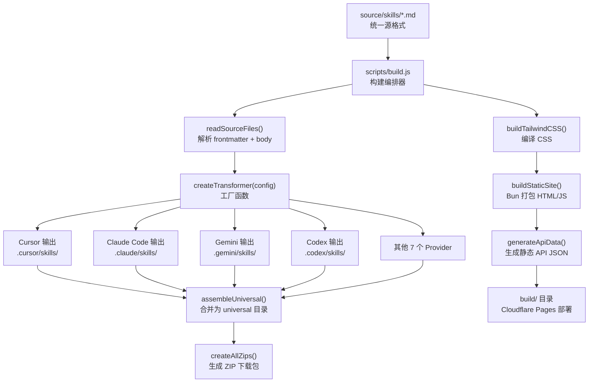
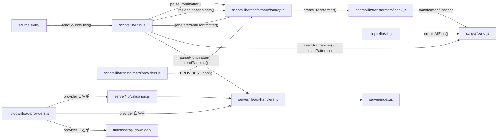
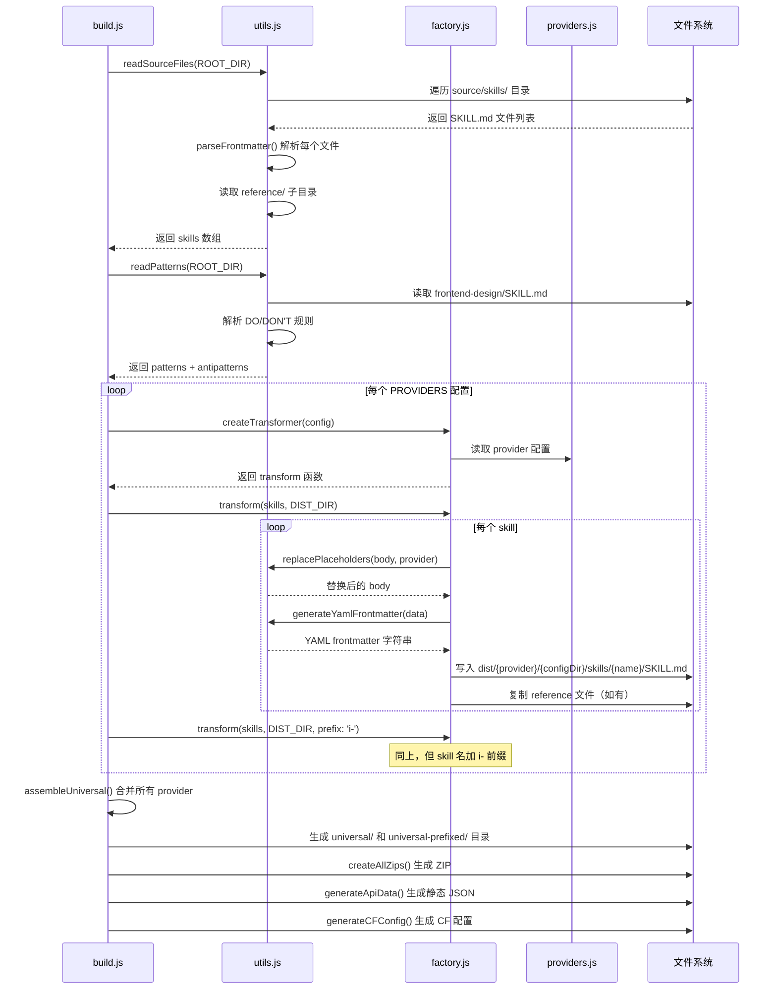
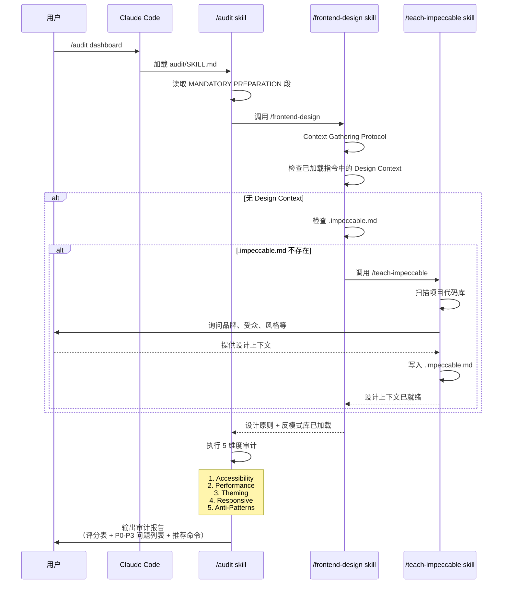

# impeccable 源码学习笔记

> 仓库地址：[impeccable](https://github.com/pbakaus/impeccable)
> 学习日期：2026-04-05

---

> **以下为 AI 源码分析**
>
> ### 一句话概括
>
> 一个跨 AI 编码工具的前端设计 skill 分发系统，通过统一的源格式和工厂模式构建管线，将 20+ 设计指令和反模式库转换为 Cursor、Claude Code、Gemini CLI 等 11 个 provider 的专属格式。
>
> ### 要点速览
>
> | 核心模块 | 职责 | 关键文件 |
> |----------|------|----------|
> | Source Skills | 设计指令和参考文档的源定义 | `source/skills/*/SKILL.md` |
> | Build System | 将源 skill 转换为多 provider 格式 | `scripts/build.js` |
> | Transformer Factory | 配置驱动的 provider 转换器工厂 | `scripts/lib/transformers/factory.js` |
> | Provider Configs | 11 个 provider 的配置定义 | `scripts/lib/transformers/providers.js` |
> | Dev Server | 本地开发的 Bun HTTP 服务与 API | `server/index.js` |
> | Cloudflare Functions | 生产环境下载 API（边缘函数） | `functions/api/download/` |
> | Static Site | 网站构建与部署配置 | `public/`, `build.js` (site 部分) |

---

## 项目简介

Impeccable 是一个面向 AI 编码助手的前端设计能力增强项目。LLM 生成的 UI 普遍存在"AI 味"问题——千篇一律的 Inter 字体、紫色渐变、嵌套卡片、灰色文字等通病。Impeccable 通过提供一套增强版的 `frontend-design` skill（含 7 个领域参考文档）和 20 个可交互式调用的 steering command（如 `/audit`、`/polish`、`/distill`），以及精心策划的反模式清单，引导 AI 工具生成更具设计品质的前端代码。

项目的核心价值在于**跨工具分发**：同一套源定义能自动转换为 Cursor、Claude Code、Gemini CLI、Codex CLI、VS Code Copilot、Kiro、OpenCode、Pi、Trae、Rovo Dev 等 11 个 provider 的专属格式，实现"一次编写、处处可用"。

## 技术栈

| 类别 | 技术 |
|------|------|
| 语言 | JavaScript (ES Modules) |
| 框架 | Bun (运行时 + HTTP 服务器 + 打包器) |
| 构建工具 | Bun + Tailwind CSS CLI + archiver (ZIP) |
| 依赖管理 | Bun (bun.lock) |
| 测试框架 | bun:test |
| 部署 | Cloudflare Pages + Cloudflare Pages Functions |
| 其他依赖 | archiver (ZIP 生成)、Playwright (截图)、motion (动画库) |

## 目录结构

```
impeccable/
├── source/                          # 源文件（编辑入口，单一真相源）
│   └── skills/                      # 21 个 skill 定义
│       ├── frontend-design/         # 核心 skill，含 7 个 reference 子文件
│       │   ├── SKILL.md             # 主指令文件
│       │   └── reference/           # 领域参考文档
│       │       ├── typography.md
│       │       ├── color-and-contrast.md
│       │       ├── spatial-design.md
│       │       ├── motion-design.md
│       │       ├── interaction-design.md
│       │       ├── responsive-design.md
│       │       └── ux-writing.md
│       ├── audit/SKILL.md           # /audit 命令
│       ├── polish/SKILL.md          # /polish 命令
│       ├── normalize/SKILL.md       # /normalize 命令
│       ├── teach-impeccable/SKILL.md # 一次性设计上下文配置
│       └── ...                      # 其他 16 个命令 skill
├── scripts/                         # 构建系统
│   ├── build.js                     # 构建编排器（入口）
│   └── lib/
│       ├── utils.js                 # frontmatter 解析、placeholder 替换、YAML 生成
│       ├── zip.js                   # ZIP 打包工具
│       └── transformers/
│           ├── factory.js           # createTransformer() 工厂函数
│           ├── providers.js         # PROVIDERS 配置映射表（11 个 provider）
│           └── index.js             # 导出所有预构建的 transformer 函数
├── server/                          # 本地开发服务器
│   ├── index.js                     # Bun.serve() 路由定义
│   └── lib/
│       ├── api-handlers.js          # API 处理函数（skill 查询、文件下载）
│       └── validation.js            # 输入校验工具
├── lib/                             # 共享库
│   └── download-providers.js        # 下载 provider 白名单（服务端+Functions 共用）
├── functions/                       # Cloudflare Pages Functions（边缘函数）
│   └── api/download/
│       ├── [type]/[provider]/[id].js  # 单文件下载
│       └── bundle/[provider].js       # ZIP 包下载
├── tests/                           # Bun 测试套件
│   ├── build.test.js                # 构建编排测试
│   ├── lib/transformers/            # 工厂和 provider 测试
│   │   ├── factory.test.js
│   │   └── providers.test.js
│   ├── lib/utils.test.js            # 工具函数测试
│   └── server/download-validation.test.js  # 下载校验测试
├── dist/                            # 构建产物（gitignored）
├── public/                          # 静态网站资源
├── .claude-plugin/                  # Claude Code 插件清单
│   ├── plugin.json
│   └── marketplace.json
├── DEVELOP.md                       # 开发者文档
└── README.md                        # 用户文档
```

## 架构设计

### 整体架构

Impeccable 采用**配置驱动的工厂模式**进行多 provider 构建。核心思路是将 skill 内容与 provider 格式解耦：skill 的指令文本用通用 placeholder（如 `{{model}}`、`{{config_file}}`）编写，由构建系统根据 provider 配置自动替换为目标值。

整体分为三层：
1. **Source 层**：`source/skills/` 下的 SKILL.md 文件，是内容的唯一真相源
2. **Build 层**：`scripts/` 下的构建管线，读取源文件 → 工厂生成 transformer → 按 provider 配置输出
3. **Distribution 层**：`dist/` 下的多 provider 产物，以及 Cloudflare Pages 的静态站点和下载 API



### 核心模块

#### 1. Source Skills（源 Skill 定义）

**职责**：定义所有设计指令的内容和元数据

**核心文件**：`source/skills/*/SKILL.md`

每个 SKILL.md 包含 YAML frontmatter 和 Markdown body：
- `name`：skill 标识符（必需）
- `description`：描述（必需）
- `user-invocable`：是否可作为 slash command 调用
- `argument-hint`：参数提示
- `license`、`compatibility`、`metadata`、`allowed-tools`：可选字段

Body 中使用 placeholder 实现 provider 无关性：
- `{{model}}` → "Claude" / "Gemini" / "GPT" / "the model"
- `{{config_file}}` → "CLAUDE.md" / ".cursorrules" / "GEMINI.md"
- `{{ask_instruction}}` → provider 特定的用户交互指令
- `{{command_prefix}}` → "/" 或 "$"
- `{{available_commands}}` → 动态生成的可用命令列表

Skill 分为两类：
- **frontend-design**：核心设计基座 skill，含 7 个 reference 子文件，不可被用户直接调用
- **20 个 command skill**：用户可调用的 slash command（如 `/audit`、`/polish`、`/normalize`），大多在开头声明 "Invoke /frontend-design" 作为前置依赖

#### 2. Build System（构建系统）

**职责**：读取源文件，驱动 transformer 工厂产出多 provider 格式，打包部署

**核心文件**：`scripts/build.js`

构建流程分为以下阶段：
1. `buildTailwindCSS()` — 通过 Tailwind CLI 编译 CSS
2. `buildStaticSite()` — 用 Bun.build() 打包 HTML/JS/CSS
3. `readSourceFiles()` — 遍历 `source/skills/` 解析所有 SKILL.md
4. 对每个 PROVIDERS 配置调用 `createTransformer(config)` 并执行转换（普通版 + `i-` 前缀版）
5. `assembleUniversal()` — 将所有 provider 输出合并为 universal 目录
6. `createAllZips()` — 用 archiver 库生成 ZIP 下载包
7. `generateApiData()` — 生成静态 JSON API 数据
8. `generateCFConfig()` — 生成 Cloudflare Pages 配置（`_headers`、`_redirects`、`_routes.json`）

#### 3. Transformer Factory（转换器工厂）

**职责**：根据 provider 配置生成 skill 转换函数

**核心文件**：`scripts/lib/transformers/factory.js`

`createTransformer(config)` 接收 provider 配置对象，返回一个 `transform(skills, distDir, options?)` 函数。核心处理：

1. 根据 `frontmatterFields` 白名单决定输出哪些 frontmatter 字段（通过 `FIELD_SPECS` 映射）
2. 调用 `replacePlaceholders()` 替换 body 中的 `{{xxx}}` 占位符
3. 如有 `prefix` 选项，调用 `prefixSkillReferences()` 将 `/skillname` 引用替换为 `/i-skillname`
4. 如有 `bodyTransform`，对 body 做自定义后处理
5. 输出 `SKILL.md` 文件和 reference 子文件

关键设计：每个 provider 对 frontmatter 字段的支持不同（如 Cursor 不支持 `user-invocable`，Gemini 不输出任何可选字段），通过配置的 `frontmatterFields` 数组精确控制。

#### 4. Provider Configs（Provider 配置）

**职责**：定义 11 个 provider 的输出格式参数

**核心文件**：`scripts/lib/transformers/providers.js`

每个 provider 配置包含：
- `provider`：标识符，用于目录名和 placeholder 查找
- `configDir`：点目录名（如 `.claude`、`.cursor`）
- `displayName`：日志输出的可读名称
- `frontmatterFields`：需要输出的 frontmatter 字段白名单
- `bodyTransform`（可选）：body 后处理函数
- `placeholderProvider`（可选）：覆盖 placeholder 查找键（如 `trae-cn` 共用 `trae` 的 placeholder）

#### 5. Dev Server（开发服务器）

**职责**：本地开发时提供静态文件服务和 API 接口

**核心文件**：`server/index.js`、`server/lib/api-handlers.js`

基于 `Bun.serve()` 构建，提供：
- 静态文件路由（HTML、CSS、JS、图片）
- REST API：
  - `GET /api/skills` — 返回所有 skill 列表
  - `GET /api/commands` — 返回可调用命令列表
  - `GET /api/patterns` — 返回设计模式和反模式
  - `GET /api/command-source/:id` — 返回 skill 源码
  - `GET /api/download/:type/:provider/:id` — 单文件下载
  - `GET /api/download/bundle/:provider` — ZIP 包下载

API handlers 复用构建系统的 `parseFrontmatter()` 和 `readPatterns()` 函数，保持逻辑一致性。

#### 6. Cloudflare Pages Functions（边缘函数）

**职责**：生产环境的动态下载 API

**核心文件**：`functions/api/download/`

只有下载 API 使用 Cloudflare Pages Functions（需要从 `env.ASSETS` 读取文件），其余 API 通过静态 JSON + `_redirects` rewrite 实现零函数调用。这是性能优化的关键设计。

### 模块依赖关系



## 核心流程

### 流程一：Skill 构建流程（Build Pipeline）

这是项目最核心的流程，将源 skill 转换为 11 个 provider 的分发格式。



关键逻辑：
1. **Frontmatter 字段白名单**：每个 provider 只输出其支持的 frontmatter 字段，由 `FIELD_SPECS` 定义条件逻辑（如 `argument-hint` 仅在 `user-invocable: true` 时输出）
2. **Placeholder 替换**：`{{model}}` 等 token 根据 provider 映射表替换为具体值，Codex 还会将 `/` 命令前缀替换为 `$`
3. **前缀变体**：每个 provider 额外生成 `i-` 前缀版本，避免与用户已有 skill 命名冲突
4. **静态 API**：大部分 API 响应预构建为 JSON 文件，通过 `_redirects` rewrite 提供，只有文件下载需要 Cloudflare Functions

### 流程二：Skill 调用链（运行时协作）

以用户在 Claude Code 中执行 `/audit` 为例，展示 skill 之间的运行时调用关系。



关键逻辑：
1. **强制前置依赖**：大多数 command skill 在 MANDATORY PREPARATION 段声明必须先调用 `/frontend-design`
2. **设计上下文协议**：`frontend-design` 定义了严格的 3 步上下文获取流程——先查指令、再查 `.impeccable.md`、最后强制运行 `/teach-impeccable`
3. **持久化设计上下文**：`/teach-impeccable` 将用户回答写入 `.impeccable.md`，避免重复询问
4. **命令推荐闭环**：`/audit` 输出审计结果时推荐其他命令（如 `/normalize`、`/harden`），形成工作流闭环

## 关键设计亮点

### 1. 配置驱动的工厂模式——零代码添加 Provider

**解决的问题**：每新增一个 AI 工具的支持，传统方式需要编写新的转换逻辑代码。

**实现方式**：`createTransformer(config)` 工厂函数（`scripts/lib/transformers/factory.js`）接收纯配置对象，自动生成完整的 transformer。新增 provider 只需在 `providers.js` 添加一个配置条目 + 在 `utils.js` 添加 placeholder 映射，无需编写任何转换逻辑。

**为什么这样设计**：Agent Skills 生态正在快速扩展（从 4 个 provider 增长到 11 个），工厂模式将变化点隔离到配置层，使扩展成本从"写代码"降低为"加配置"。`FIELD_SPECS` 通过声明式的 condition/value 函数处理字段间的条件逻辑（如 `argument-hint` 依赖 `user-invocable`），避免了大量 if-else。

### 2. 静态 API + 最少化边缘函数——近乎零成本运维

**解决的问题**：Cloudflare Pages Functions 按调用计费，频繁的 API 请求会产生成本。

**实现方式**：构建时通过 `generateApiData()`（`scripts/build.js:179-212`）将所有 API 响应预生成为 JSON 文件（`_data/api/skills.json`、`commands.json` 等），然后用 `_redirects` 将 `/api/skills` rewrite 到 `/_data/api/skills.json`（HTTP 200 rewrite，非 301 重定向）。只有文件下载 API（需要从 `env.ASSETS` 动态读取 ZIP）使用真正的 Cloudflare Pages Functions。

**为什么这样设计**：`_routes.json` 明确声明只有 `/api/download/*` 走 Functions，其余请求完全由 CDN 静态服务。这将绝大多数 API 调用的成本降为零，同时享受 CDN 的全球缓存加速。

### 3. Placeholder + Prefix 双层内容适配

**解决的问题**：同一份 skill 内容需要在不同 AI 工具中正确运行，而各工具的交互方式差异很大。

**实现方式**：
- **Placeholder 替换**（`utils.js:replacePlaceholders()`）：将 `{{model}}`、`{{config_file}}` 等 token 替换为 provider 特定值。Codex 的命令前缀是 `$` 而非 `/`，通过对所有 skill 名做正则替换实现 `/audit` → `$audit`。
- **Prefix 机制**（`utils.js:prefixSkillReferences()`）：生成 `i-` 前缀变体时，不仅重命名目录和 frontmatter，还智能替换 body 中的所有交叉引用（`/normalize` → `/i-normalize`、"the normalize skill" → "the i-normalize skill"），按 skill 名长度降序处理避免部分匹配。

**为什么这样设计**：前缀变体解决了真实场景中的命名冲突问题（用户可能已有同名 skill），而交叉引用的自动更新保证了前缀版本中 skill 间的调用链仍然正确。

### 4. 设计上下文持久化协议——从泛泛生成到精准设计

**解决的问题**：AI 生成的 UI 因缺乏项目特定的设计上下文而千篇一律。

**实现方式**：`frontend-design` skill（`source/skills/frontend-design/SKILL.md`）定义了严格的 Context Gathering Protocol：
1. 先查当前加载的指令
2. 再查项目根目录的 `.impeccable.md`
3. 都没有则强制运行 `/teach-impeccable`

`/teach-impeccable`（`source/skills/teach-impeccable/SKILL.md`）先自动扫描代码库提取可推断的信息（技术栈、已有设计 token 等），再只询问无法推断的信息（品牌个性、目标受众、审美方向），最后写入 `.impeccable.md` 持久化。

**为什么这样设计**：设计上下文是所有其他命令的质量基础——没有它，`/audit` 不知道什么是"正确"的设计，`/normalize` 不知道往哪个方向统一。通过 `.impeccable.md` 文件持久化，这些上下文只需收集一次，跨会话长期有效。

### 5. 共享验证模块——前后端一致的安全边界

**解决的问题**：本地 dev server 和 Cloudflare Pages Functions 需要相同的输入验证逻辑，但运行环境不同。

**实现方式**：`lib/download-providers.js` 作为共享模块，用 `Object.freeze()` 定义不可变的 provider 白名单（`FILE_DOWNLOAD_PROVIDERS`、`BUNDLE_DOWNLOAD_PROVIDERS`）。`server/lib/validation.js` 在此基础上封装 `isValidId()`、`isAllowedProvider()`、`sanitizeFilename()` 等函数。Cloudflare Functions 直接导入同一个 `download-providers.js`。

**为什么这样设计**：单一真相源确保开发环境和生产环境的安全校验完全一致，不会出现"本地测试通过但生产环境被绕过"的漏洞。`VALID_ID = /^[a-zA-Z0-9_-]+$/` 的严格正则有效防止路径遍历攻击。
