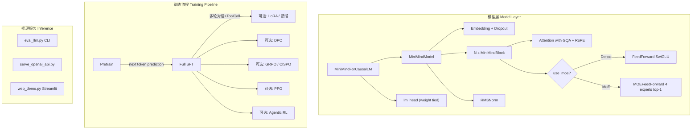
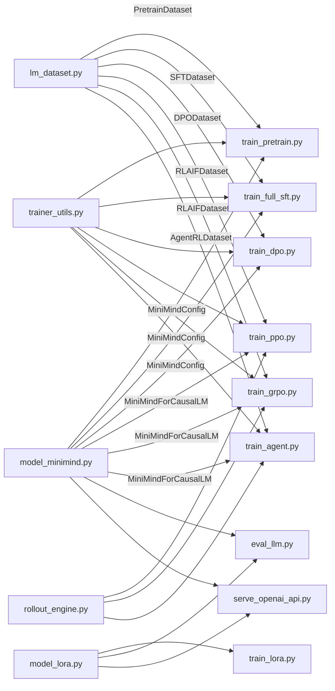
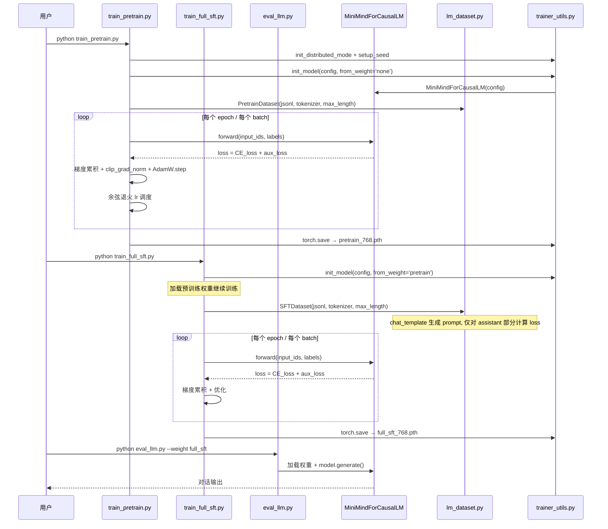
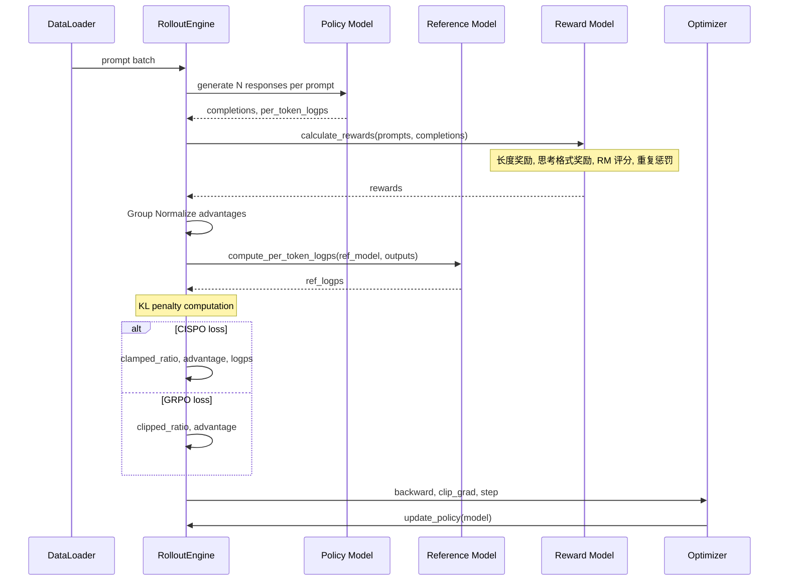

# minimind 源码学习笔记

> 仓库地址：[minimind](https://github.com/jingyaogong/minimind)
> 学习日期：2026-03-29

---

> **以下为 AI 源码分析**
>
> ### 一句话概括
>
> 从零开始、仅用 3 元成本与 2 小时训练即可复现的 64M 超小型大语言模型全阶段训练项目，覆盖 Pretrain、SFT、LoRA、DPO、PPO/GRPO/CISPO、Tool Use、Agentic RL 与模型蒸馏。
>
> ### 要点速览
>
> | 核心模块 | 职责 | 关键文件 |
> |---------|------|---------|
> | 模型定义 | Transformer Decoder-Only 结构（Dense + MoE），对齐 Qwen3 生态 | `model/model_minimind.py` |
> | LoRA | 低秩适配微调的纯手写实现 | `model/model_lora.py` |
> | 数据集 | Pretrain/SFT/DPO/RLAIF/AgentRL 五类 Dataset | `dataset/lm_dataset.py` |
> | 预训练 | 基于 next token prediction 的无监督预训练 | `trainer/train_pretrain.py` |
> | 监督微调 | 多轮对话 + Tool Call + Thinking 的全参数 SFT | `trainer/train_full_sft.py` |
> | 强化学习 | DPO / PPO / GRPO / CISPO 四种 RLHF/RLAIF 算法 | `trainer/train_dpo.py`, `train_ppo.py`, `train_grpo.py` |
> | Agent RL | 多轮 Tool-Use 场景下的 Agentic RL 训练 | `trainer/train_agent.py` |
> | Rollout 引擎 | 可插拔的推理后端抽象（PyTorch / SGLang） | `trainer/rollout_engine.py` |
> | 推理服务 | 兼容 OpenAI API 的推理服务端 | `scripts/serve_openai_api.py` |
> | Tokenizer | BPE + ByteLevel 自定义分词器（6400 词表） | `trainer/train_tokenizer.py`, `model/tokenizer.json` |

---

## 项目简介

MiniMind 是一个完全从零开始训练超小型大语言模型（~64M 参数）的开源项目。它旨在以极低的成本（约 3 元人民币、单卡 3090 约 2 小时）让个人开发者可以亲手完成 LLM 从预训练到强化学习的全流程复现。项目的核心价值在于：所有关键算法（LoRA、DPO、PPO、GRPO、CISPO）均使用 PyTorch 原生实现，不依赖第三方框架的高层封装，同时兼容 `transformers`、`llama.cpp`、`vllm`、`ollama` 等主流生态。这既是一个 LLM 全阶段复现项目，也是一套面向入门与实践的教程。

## 技术栈

| 类别 | 技术 |
|------|------|
| 语言 | Python |
| 框架 | PyTorch, Transformers |
| 构建工具 | 无（纯 Python 脚本） |
| 依赖管理 | pip / requirements.txt |
| 测试框架 | 无独立测试框架（通过 eval_llm.py 手动验证） |
| 分布式 | PyTorch DDP / DeepSpeed |
| 可视化 | SwanLab（WandB 兼容） |
| 推理服务 | FastAPI / Streamlit |

## 目录结构

```
minimind/
├── model/                          # 模型定义与 Tokenizer
│   ├── model_minimind.py           # 核心模型结构（Config/Attention/FFN/MoE/Block/Model/CausalLM）
│   ├── model_lora.py               # LoRA 实现（apply/load/save/merge）
│   ├── tokenizer.json              # BPE 分词器词表
│   └── tokenizer_config.json       # 分词器配置（含 chat_template）
├── dataset/                        # 数据集定义
│   ├── lm_dataset.py               # 五种 Dataset 类
│   └── dataset.md                  # 数据集说明
├── trainer/                        # 训练脚本
│   ├── trainer_utils.py            # 工具函数（lr调度/checkpoint/分布式初始化）
│   ├── train_pretrain.py           # 预训练
│   ├── train_full_sft.py           # 全参数 SFT
│   ├── train_lora.py               # LoRA 微调
│   ├── train_dpo.py                # DPO 训练
│   ├── train_ppo.py                # PPO 训练（含 CriticModel）
│   ├── train_grpo.py               # GRPO/CISPO 训练
│   ├── train_agent.py              # Agentic RL（多轮 Tool-Use）
│   ├── train_distillation.py       # 白盒知识蒸馏
│   ├── train_tokenizer.py          # Tokenizer 训练示例
│   └── rollout_engine.py           # 可插拔 Rollout 引擎
├── scripts/                        # 推理与服务脚本
│   ├── serve_openai_api.py         # OpenAI API 兼容服务
│   ├── web_demo.py                 # Streamlit WebUI
│   ├── chat_api.py                 # API 调用示例
│   ├── eval_toolcall.py            # Tool Call 测试
│   └── convert_model.py            # LoRA 权重合并导出
├── eval_llm.py                     # CLI 推理与对话
├── requirements.txt                # 依赖列表
└── README.md                       # 项目文档
```

## 架构设计

### 整体架构

MiniMind 采用经典的 Transformer Decoder-Only 架构，整体设计对齐 Qwen3 生态，以便于与 `transformers`、`llama.cpp`、`ollama` 等框架兼容。模型架构使用 Pre-Norm（RMSNorm）、SwiGLU 激活函数、RoPE 旋转位置编码（支持 YaRN 长文本外推），以及 GQA（Grouped Query Attention，8 个 query head、4 个 KV head）。MoE 变体在前馈层扩展为 4 experts / top-1 routing 的混合专家结构。

训练流程按阶段递进：Pretrain → SFT → (可选) LoRA/蒸馏 → (可选) DPO/PPO/GRPO/CISPO → (可选) Agentic RL。



### 核心模块

#### 1. 模型定义模块 (`model/model_minimind.py`)

**职责**：定义 MiniMind 的完整模型结构，包括配置、各层组件和生成方法。

**关键类与函数**：

- **`MiniMindConfig`** (L10-44)：模型配置类，继承 `PretrainedConfig`，默认 `hidden_size=768, num_hidden_layers=8, vocab_size=6400, num_attention_heads=8, num_key_value_heads=4`，支持 MoE 和 YaRN 配置。
- **`RMSNorm`** (L49-59)：RMS 归一化实现，用于 Pre-Norm 结构。
- **`precompute_freqs_cis`** (L61-77)：预计算 RoPE 旋转位置编码的 cos/sin 频率矩阵，内置 YaRN 外推逻辑（linear ramp interpolation）。
- **`Attention`** (L90-132)：带 GQA 的多头注意力，包含 Q/K/V/O 投影、QK Norm、RoPE 旋转编码、KV Cache 支持、Flash Attention 自动检测。
- **`FeedForward`** (L134-144)：SwiGLU 前馈网络，`gate_proj` + `up_proj` + `down_proj` 三路结构。
- **`MOEFeedForward`** (L146-174)：Mixture of Experts 前馈层，包含 gate 路由、top-k 专家选择、负载均衡辅助损失（`aux_loss`）。
- **`MiniMindBlock`** (L176-192)：单个 Transformer Block，Pre-Norm → Attention → Residual → Pre-Norm → FFN/MoE → Residual。
- **`MiniMindModel`** (L194-226)：模型主体，管理 Embedding、N 层 Block、最终 RMSNorm，以及 RoPE 频率缓冲。
- **`MiniMindForCausalLM`** (L228-279)：最终的因果语言模型，继承 `PreTrainedModel` + `GenerationMixin`。关键设计：**Embedding 与 lm_head 权重绑定**（L235），大幅减少参数量。自定义 `generate` 方法支持 Top-K/Top-P 采样、KV Cache、流式输出和重复惩罚。

#### 2. LoRA 模块 (`model/model_lora.py`)

**职责**：纯手写的 LoRA（Low-Rank Adaptation）实现，不依赖 peft 等第三方库。

**关键函数**：

- **`LoRA`** (L6-18)：LoRA 核心类，包含低秩矩阵 A（高斯初始化）和 B（零初始化），`forward` 返回 `B(A(x))`。
- **`apply_lora`** (L21-32)：遍历模型所有方阵 `nn.Linear`，为其附加 LoRA 分支，`forward = original(x) + lora(x)`。
- **`merge_lora`** (L56-65)：将 LoRA 权重合并回主模型权重：`W' = W + B @ A`。

#### 3. 数据集模块 (`dataset/lm_dataset.py`)

**职责**：为不同训练阶段提供统一的 Dataset 接口。

**五种 Dataset**：

- **`PretrainDataset`**：读取 jsonl 文本，tokenize 后加 BOS/EOS，padding 到固定长度，labels 中 padding 位置设为 -100。
- **`SFTDataset`**：读取多轮对话 jsonl，通过 `chat_template` 生成完整 prompt，仅对 assistant 回复部分计算 loss（通过 `generate_labels` 识别 BOS/EOS 边界）。
- **`DPODataset`**：读取 chosen/rejected 偏好对，生成 `x_chosen/y_chosen/mask_chosen` 和 `x_rejected/y_rejected/mask_rejected`。
- **`RLAIFDataset`**：读取对话数据，按概率开启 `open_thinking`，生成 prompt 供 rollout 使用。
- **`AgentRLDataset`**：读取多轮 Tool-Use 对话，解析 tools 和 ground truth。

#### 4. 训练工具模块 (`trainer/trainer_utils.py`)

**职责**：提供训练公共工具函数。

**关键实现**：

- **`get_lr`**：余弦退火学习率调度，`lr * (0.1 + 0.45 * (1 + cos(pi * step / total)))` 。
- **`lm_checkpoint`**：统一的 checkpoint 保存/加载逻辑，支持跨 GPU 数量恢复（自动调整 step）、wandb ID 恢复。
- **`init_model`**：统一的模型初始化流程（创建模型 → 加载权重 → 打印参数量）。
- **`SkipBatchSampler`**：支持断点续训的 Sampler，跳过已训练的 batch。
- **`LMForRewardModel`**：加载第三方 Reward 模型并计算得分。

#### 5. Rollout 引擎模块 (`trainer/rollout_engine.py`)

**职责**：将 RL 训练中的推理采样（rollout）抽象为可插拔接口。

**设计模式**：策略模式（Strategy Pattern）

- **`RolloutEngine`** (ABC)：抽象基类，定义 `rollout()` 和 `update_policy()` 接口。
- **`TorchRolloutEngine`**：PyTorch 原生推理，直接调用 `model.generate()`。
- **`SGLangRolloutEngine`**：通过 HTTP API 调用外部 SGLang 推理服务器，支持 `update_weights_from_disk` 动态更新权重。
- **`create_rollout_engine`**：工厂函数，根据 `engine_type` 创建对应引擎。

### 模块依赖关系



## 核心流程

### 流程一：预训练 → SFT → 推理（主线训练链路）

这是 MiniMind 最核心的训练流程，将一个随机初始化的模型训练成具有对话能力的语言模型。



**关键细节**：

1. **预训练阶段**：使用 `pretrain_t2t_mini.jsonl`，每条数据是纯文本，tokenize 后加 BOS/EOS，进行 next token prediction。默认 `max_seq_len=340`，`batch_size=32`，`lr=5e-4`。
2. **SFT 阶段**：基于预训练权重继续训练。数据为多轮对话格式，通过 `chat_template` 渲染为完整文本。关键设计——**仅对 assistant 回复部分计算 loss**：`generate_labels` 方法通过匹配 BOS/EOS token 序列边界来确定哪些 token 属于 assistant 输出，非 assistant 部分的 labels 设为 -100（CrossEntropy 忽略）。
3. **权重绑定**：`embed_tokens.weight = lm_head.weight`，即 Embedding 层和输出投影层共享权重，这是小模型减少参数量的经典技巧。

### 流程二：GRPO/CISPO 强化学习训练

GRPO (Group Relative Policy Optimization) 和 CISPO 是 MiniMind 主推的 RLAIF 训练算法，不需要额外训练 Critic 模型（相比 PPO 更轻量）。



**关键细节**：

1. **Rollout**：每个 prompt 生成 `num_generations=6` 个候选回复，形成一组（Group）。
2. **奖励计算**：组合多个信号——回复长度奖励、思考标签格式奖励、Reward Model 打分、重复惩罚（n-gram 重复率）。
3. **Group 归一化**：在每个 prompt 的组内计算 advantages = (reward - mean) / std，无需全局 baseline。
4. **CISPO vs GRPO**：CISPO 使用 clamped ratio（仅设上界）直接乘以 advantage 和 logps；GRPO 使用标准 PPO-clip 风格的 min(ratio*adv, clip*adv)。
5. **KL 惩罚**：使用 `exp(d) - d - 1` 形式的近似 KL 散度（总是非负），确保策略不偏离参考模型太远。

## 关键设计亮点

### 1. Embedding 与 lm_head 权重绑定

**解决的问题**：小模型中 Embedding 和输出投影层占总参数量的比例极高（vocab_size × hidden_size 重复出现两次）。

**实现方式**：`model/model_minimind.py:235`

```python
self.model.embed_tokens.weight = self.lm_head.weight
```

**设计原因**：对于 MiniMind 的 6400 词表 × 768 维度，仅这两层就有 ~10M 参数。权重绑定将其减半为 ~5M，使得模型总参数从 ~69M 降至 ~64M，效果几乎无损。

### 2. 纯 PyTorch 手写 LoRA

**解决的问题**：避免依赖 peft 等第三方库的黑盒封装，让学习者理解 LoRA 的全部细节。

**实现方式**：`model/model_lora.py`

- `LoRA` 类：A 矩阵高斯初始化（std=0.02）、B 矩阵零初始化 → 训练初期 LoRA 增量为零，不破坏预训练能力
- `apply_lora`：仅对方阵 Linear 层添加 LoRA 分支（Q/K/V/O 等）
- `merge_lora`：`W' = W + B @ A`，一行代码完成权重合并

**设计原因**：LoRA 的核心思想极其简洁——在原始权重旁并行一个低秩矩阵对。手写实现约 60 行代码，比引入 peft 更透明、更轻量。

### 3. 可插拔的 Rollout 引擎抽象

**解决的问题**：RL 训练中的 rollout（推理采样）是性能瓶颈，需要灵活切换推理后端。

**实现方式**：`trainer/rollout_engine.py`

- 定义 `RolloutEngine` 抽象基类 + `RolloutResult` dataclass
- `TorchRolloutEngine`：PyTorch 原生推理，适合单卡调试
- `SGLangRolloutEngine`：通过 HTTP API 调用高性能推理服务器，支持动态权重更新
- 工厂函数 `create_rollout_engine` 根据参数切换

**设计原因**：PyTorch 原生推理在 RL 训练中会成为瓶颈（占总时间 60%+），通过抽象接口可以无缝切换到 SGLang 等优化推理引擎，同时保持训练代码不变。

### 4. SFT 中仅对 Assistant 回复计算 Loss

**解决的问题**：多轮对话训练中，user 的提问和 system prompt 不应参与 loss 计算，否则模型会"学习"去生成用户的问题。

**实现方式**：`dataset/lm_dataset.py:88-104` 的 `generate_labels` 方法

通过扫描 token 序列中的 BOS/EOS 标记对（`<|im_start|>assistant\n` 和 `<|im_end|>\n`），精确定位每个 assistant 回复的起止位置，仅这些位置的 labels 保留原始 token id，其余全部设为 -100。

**设计原因**：这是标准的"Causal LM + 选择性 loss masking"范式，确保模型只在 assistant 角色的输出上学习生成，避免模型学习"生成用户输入"的错误模式。

### 5. Checkpoint 断点续训与跨 GPU 恢复

**解决的问题**：长时间训练可能被中断，且恢复时 GPU 数量可能改变。

**实现方式**：`trainer/trainer_utils.py:63-116` 的 `lm_checkpoint` 函数

- 保存完整状态：model、optimizer、scaler、epoch、step、world_size、wandb_id
- 跨 GPU 数量恢复：`step = saved_step * saved_world_size / current_world_size`
- 原子性写入：先写 `.tmp` 文件再 `os.replace`，防止写入中途断电导致文件损坏
- `SkipBatchSampler`：配合 checkpoint 跳过已训练的 batch

**设计原因**：对于个人开发者来说，训练环境不稳定是常态。这套机制确保训练不会因为中断而从头开始，且在更换 GPU 数量后仍可无缝继续。
