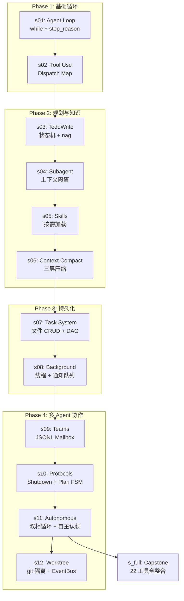
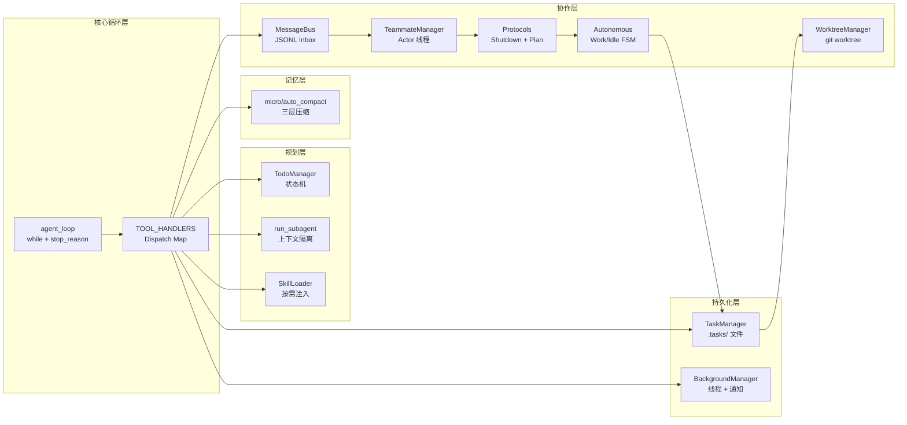
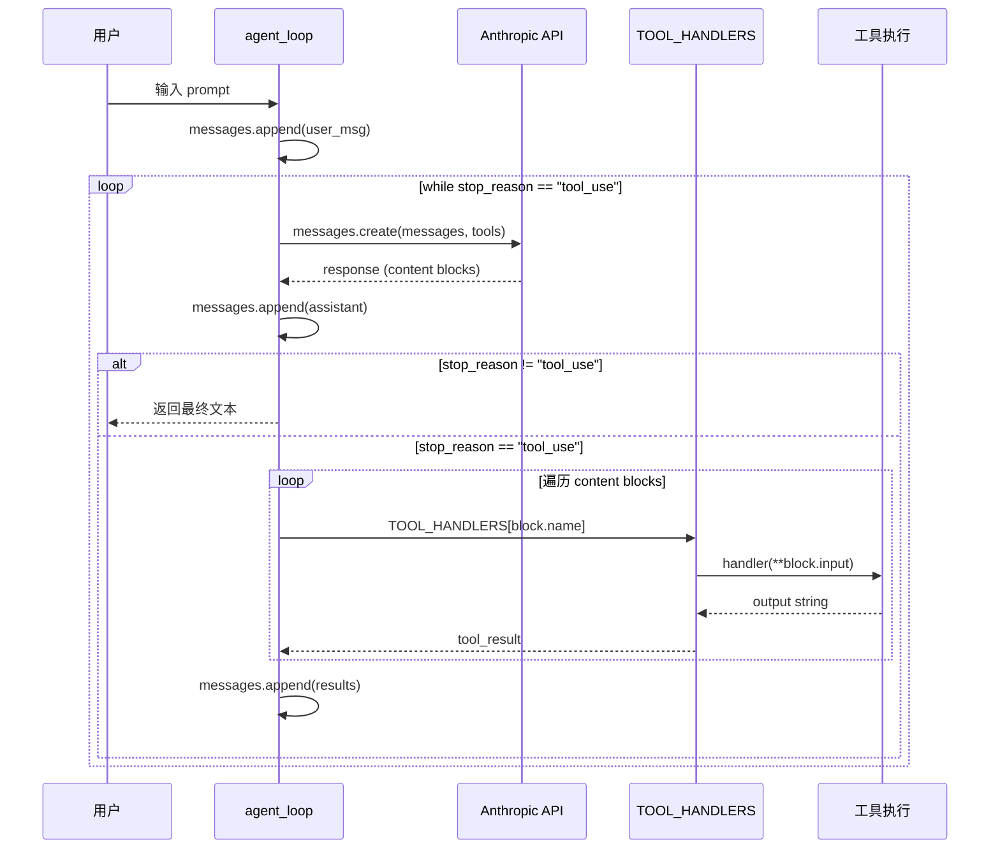
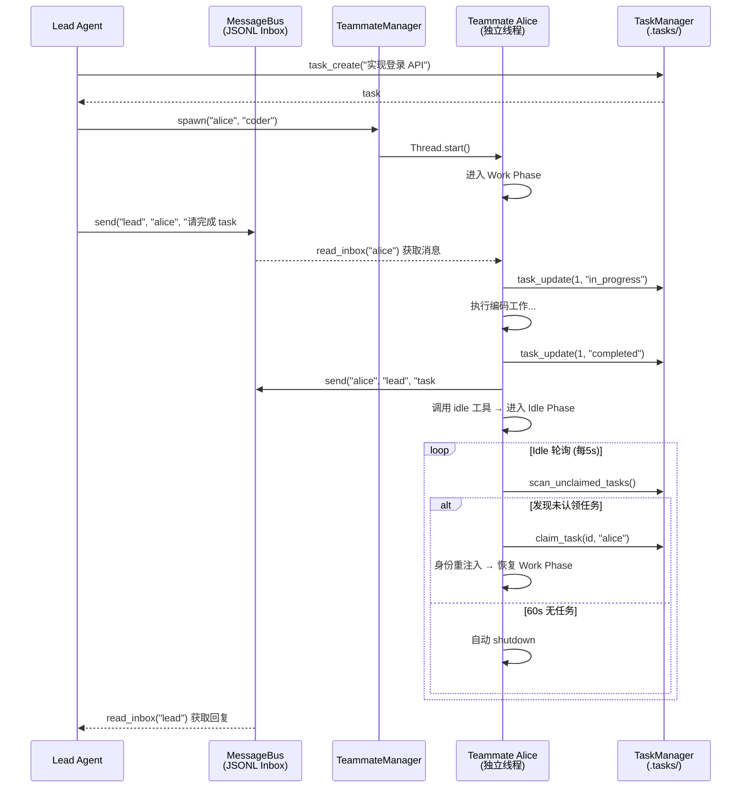

# learn-claude-code 源码学习笔记

> 仓库地址：[learn-claude-code](https://github.com/shareAI-lab/learn-claude-code)
> 学习日期：2026-04-05

---

> **以下为 AI 源码分析**
>
> ### 一句话概括
>
> 一个渐进式拆解 Claude Code Agent 内部机制的教学项目，通过 12 个 Python 实现 + 交互式 Web 平台，从零构建完整的 AI Agent Harness 工程。
>
> ### 要点速览
>
> | 模块 | 职责 | 关键文件 |
> |------|------|----------|
> | s01 Agent Loop | 基础 while 循环 + bash 工具 | `agents/s01_agent_loop.py` |
> | s02 Tool Use | Dispatch Map 工具分发 + 路径沙箱 | `agents/s02_tool_use.py` |
> | s03 TodoWrite | 任务状态机 + nag reminder | `agents/s03_todo_write.py` |
> | s04 Subagent | 上下文隔离 + 摘要蒸馏 | `agents/s04_subagent.py` |
> | s05 Skills | 按需知识加载 (两层注入) | `agents/s05_skill_loading.py` |
> | s06 Context Compact | 三层渐进压缩 | `agents/s06_context_compact.py` |
> | s07 Task System | 文件持久化任务 + DAG 依赖 | `agents/s07_task_system.py` |
> | s08 Background Tasks | 非阻塞后台执行 + 通知队列 | `agents/s08_background_tasks.py` |
> | s09 Agent Teams | JSONL Mailbox + Actor 模型 | `agents/s09_agent_teams.py` |
> | s10 Team Protocols | Shutdown/Plan Approval FSM | `agents/s10_team_protocols.py` |
> | s11 Autonomous Agents | 双相状态机 + 自主任务认领 | `agents/s11_autonomous_agents.py` |
> | s12 Worktree Isolation | git worktree 隔离 + EventBus | `agents/s12_worktree_task_isolation.py` |
> | s_full Capstone | 22 工具全整合版本 | `agents/s_full.py` |
> | Web 平台 | 交互式学习前端 | `web/` |
> | Skills | 可注入专业知识包 | `skills/` |

---

## 项目简介

Learn Claude Code 是一个面向 AI Agent 工程师的教学项目，核心理念为 **"模型即 Agent，代码只是 Harness（驾驶舱）"**。项目通过 12 个渐进式 Python 实现，从最小的 30 行 Agent 循环开始，逐步叠加工具分发、任务规划、子 Agent 隔离、上下文压缩、持久化任务系统、后台并发、多 Agent 团队协作、自主任务认领、git worktree 隔离等机制，完整复刻了 Claude Code 的 Harness 架构设计。配套的 Next.js Web 平台提供可视化动画、代码对比、Agent 模拟器等交互式学习工具。

## 技术栈

| 类别 | 技术 |
|------|------|
| 语言 | Python 3.x, TypeScript |
| 框架 | Anthropic SDK (Agent 后端), Next.js 16.1.6 + React 19 (Web 前端) |
| 构建工具 | pip (Python), npm + Next.js (Web), GitHub Actions CI |
| 依赖管理 | requirements.txt (Python), package.json (Web) |
| 测试框架 | pytest (Python), TypeScript 类型检查 (Web) |

## 目录结构

```
learn-claude-code/
├── agents/                          # 12 个渐进式 Python Agent 实现 + capstone
│   ├── s01_agent_loop.py            # 基础循环 (121 行)
│   ├── s02_tool_use.py              # 工具扩展 (151 行)
│   ├── s03_todo_write.py            # TodoWrite (212 行)
│   ├── s04_subagent.py              # 子 Agent (188 行)
│   ├── s05_skill_loading.py         # 技能加载 (228 行)
│   ├── s06_context_compact.py       # 上下文压缩 (257 行)
│   ├── s07_task_system.py           # 任务系统 (244 行)
│   ├── s08_background_tasks.py      # 后台任务 (235 行)
│   ├── s09_agent_teams.py           # Agent 团队 (404 行)
│   ├── s10_team_protocols.py        # 团队协议 (485 行)
│   ├── s11_autonomous_agents.py     # 自主 Agent (587 行)
│   ├── s12_worktree_task_isolation.py # Worktree 隔离 (783 行)
│   └── s_full.py                    # 全整合版 (741 行)
├── docs/                            # 三语言文档 (心智模型优先)
│   ├── en/                          # 英文文档
│   ├── zh/                          # 中文文档
│   └── ja/                          # 日文文档
├── web/                             # Next.js 交互式学习平台
│   ├── src/app/                     # App Router 页面
│   ├── src/components/              # 可视化组件、模拟器、代码查看器
│   ├── src/data/                    # 生成的版本元数据 + 场景 JSON
│   ├── src/hooks/                   # 自定义 Hooks (模拟器、暗色模式)
│   ├── src/i18n/                    # 自实现国际化系统
│   └── scripts/extract-content.ts   # Python 源码静态分析 → JSON 管道
├── skills/                          # 可注入 Agent 知识包
│   ├── code-review/SKILL.md         # 代码审查 checklist
│   ├── agent-builder/               # Agent 构建哲学 + 脚手架 + 模板
│   ├── pdf/SKILL.md                 # PDF 处理知识
│   └── mcp-builder/SKILL.md         # MCP Server 构建知识
├── tests/                           # pytest 测试
├── .github/workflows/               # CI: 类型检查 + 构建
├── requirements.txt                 # Python 依赖: anthropic, dotenv, pyyaml
└── .env.example                     # 多厂商 API 配置模板
```

## 架构设计

### 整体架构

项目的核心架构基于一个不变的 Agent 循环，通过渐进叠加 Harness 机制来扩展能力。整体分为 4 个阶段、5 个架构层：



核心设计哲学：**循环不变性** — 从 s01 到 s12，`agent_loop` 的核心 `while True` 结构从未改变，所有能力都通过增加工具处理函数或在循环前后插入逻辑来叠加。

```python
# 贯穿全系列的不变核心
def agent_loop(messages):
    while True:
        response = client.messages.create(
            model=MODEL, system=SYSTEM,
            messages=messages, tools=TOOLS,
        )
        messages.append({"role": "assistant", "content": response.content})
        if response.stop_reason != "tool_use":
            return
        results = []
        for block in response.content:
            if block.type == "tool_use":
                output = TOOL_HANDLERS[block.name](**block.input)
                results.append({"type": "tool_result",
                                "tool_use_id": block.id, "content": output})
        messages.append({"role": "user", "content": results})
```

### 核心模块

#### 1. Agent Loop 核心 (s01-s02)

**职责**：建立 LLM 与真实世界的交互闭环

- `s01_agent_loop.py` — 最小 Agent：`while True` + `stop_reason` 退出条件 + 单一 `bash` 工具，仅 30 行核心逻辑
- `s02_tool_use.py` — Dispatch Map 模式：`TOOL_HANDLERS = {name: handler}` 字典分发，新增工具不改循环；引入 `safe_path()` 路径沙箱防止目录穿越

关键接口：
- `run_bash(command: str) -> str` — Shell 执行，含危险命令黑名单 + 120s 超时 + 50KB 输出截断
- `run_read(path, limit) / run_write(path, content) / run_edit(path, old_text, new_text)` — 文件操作四件套

#### 2. 规划与上下文管理 (s03-s06)

**职责**：让 Agent 保持方向、管理知识、突破上下文限制

- `s03_todo_write.py` — `TodoManager` 状态机（pending → in_progress → completed），强制"同一时间只做一件事"；`rounds_since_todo >= 3` 时注入 `<reminder>` 催促
- `s04_subagent.py` — 子 Agent 以空 `messages=[]` 启动独立循环，完整执行历史被丢弃，仅摘要文本返回父 Agent；`CHILD_TOOLS` 不含 `task` 防止递归
- `s05_skill_loading.py` — `SkillLoader` 两层注入：系统提示放技能目录（~100 tokens/个），`load_skill` 工具按需返回完整 `SKILL.md` 内容（~2000 tokens）
- `s06_context_compact.py` — 三层压缩流水线：`micro_compact`（静默替换旧工具结果为占位符）→ `auto_compact`（超 50K token 时 LLM 生成摘要替代全历史）→ 手动 `compact` 工具

#### 3. 持久化与并发 (s07-s08)

**职责**：让状态跨对话存活、让执行不阻塞思考

- `s07_task_system.py` — `TaskManager` 将任务持久化为 `.tasks/task_N.json`，支持 DAG 依赖图（`blockedBy` 字段），完成任务时 `_clear_dependency()` 自动级联解除下游阻塞
- `s08_background_tasks.py` — `BackgroundManager` 用守护线程执行耗时命令，`_notification_queue` 收集结果，`agent_loop` 每轮通过 `drain_notifications()` 注入 `<background-results>` 消息

#### 4. 多 Agent 协作 (s09-s12)

**职责**：从单 Agent 升级到团队协作与自主执行

- `s09_agent_teams.py` — `TeammateManager` 管理持久化命名 Agent，每个 Teammate 在独立线程运行；`MessageBus` 通过 JSONL 文件 inbox 实现异步消息传递（Actor 模型）
- `s10_team_protocols.py` — 两个请求-响应协议：Shutdown（优雅关闭握手）和 Plan Approval（计划审批 FSM），通过 `request_id` 关联异步消息
- `s11_autonomous_agents.py` — Work/Idle 双相状态机：工作阶段执行任务，空闲阶段每 5s 轮询任务板寻找未认领任务；`_claim_lock` 确保原子认领；`make_identity_block()` 解决压缩后身份丢失
- `s12_worktree_task_isolation.py` — `WorktreeManager` 用 `git worktree` 为每个任务创建独立目录和分支；`EventBus` 以 JSONL 追加写记录生命周期事件（Event Sourcing）

#### 5. Web 交互式学习平台 (web/)

**职责**：可视化教学前端

- **数据管道**：`extract-content.ts` 静态分析 Python 源码 → `versions.json` + `docs.json`，构建时嵌入
- **可视化系统**：12 个独立 SVG 动画组件（`visualizations/s01-s12.tsx`），通过 `lazy + Suspense` 按需加载
- **Agent 模拟器**：JSON 驱动的 `AgentLoopSimulator`，逐步"揭示" Agent 循环的每个消息
- **代码对比**：`CodeDiff` 组件支持 unified/split 视图展示版本间差异
- **国际化**：自实现轻量 i18n（Context + `useTranslations` Hook），支持 en/zh/ja 三语言

#### 6. Skills 知识包 (skills/)

**职责**：可按需注入 Agent 的专业领域知识

- `code-review` — 5 维度代码审查 checklist（安全/正确/性能/可维护/测试）
- `agent-builder` — Agent 构建哲学 + 渐进复杂度框架 + 最小 Agent 模板 + 脚手架工具
- `pdf` — PDF 读取/创建/合并/分割 4 种工作流
- `mcp-builder` — MCP Server 开发全流程（Python + TypeScript 双模板）

### 模块依赖关系



## 核心流程

### 流程一：Agent 循环 — 单轮工具调用

这是整个项目的基础，所有 12 个 session 都构建在这个不变的循环之上。



关键设计：
1. **退出条件唯一**：`stop_reason != "tool_use"` 是循环唯一出口，模型完全控制何时停止
2. **工具结果回写**：工具输出以 `{"role": "user", "content": [tool_results]}` 格式追加，保持 user/assistant 交替
3. **共享状态修改**：`agent_loop` 通过 in-place 修改传入的 `messages` 列表积累历史

### 流程二：多 Agent 协作 — 团队任务分配与执行

展示 s09-s11 的完整协作流程，从 Lead 派发任务到 Teammate 自主认领。



关键设计：
1. **异步通信**：Lead 和 Teammate 通过 JSONL 文件 inbox 异步交互，互不阻塞
2. **双相循环**：Work Phase 处理任务，Idle Phase 主动寻找新工作
3. **原子认领**：`_claim_lock` 确保多个 Teammate 不会重复认领同一任务
4. **身份重注入**：上下文压缩后 `messages` 过短时，在首部插入 `<identity>` 消息防止 LLM 忘记角色

## 关键设计亮点

### 1. 循环不变性 — 开闭原则的极致体现

**解决的问题**：如何在 12 个 session 中不断叠加能力而不增加核心复杂度

**实现方式**：`agent_loop` 的 `while True` + `stop_reason` 结构从 s01 到 s12 完全不变。所有新能力通过三种方式叠加：
- 往 `TOOL_HANDLERS` 字典添加条目（新工具）
- 在循环前/后插入预处理逻辑（压缩、通知注入）
- 在工具结果中附加文本（nag reminder、background results）

**设计价值**：体现了 Harness 工程的核心哲学 — Harness 只提供环境，不替代模型决策。循环属于 Agent（模型），机制属于 Harness（代码）。

### 2. 三层上下文压缩 — 无限会话的实用解法

**解决的问题**：LLM 上下文窗口有限，长会话必然溢出

**实现方式**（`s06_context_compact.py`）：
- **Layer 1 micro_compact**：每轮静默执行，将旧工具结果替换为 `[Previous: used {tool_name}]` 占位符，但 `read_file` 结果豁免保留
- **Layer 2 auto_compact**：token 超阈值时，保存完整对话到 `.transcripts/` 存档，LLM 生成三点摘要替代全部历史
- **Layer 3 manual compact**：模型主动调用 `compact` 工具触发压缩

**设计价值**：差异化保留策略是关键洞察 — `read_file` 结果是"参考材料"需要保留，`bash` 输出是"过程记录"可以丢弃。三层互补形成渐进退化，而非一刀切。

### 3. 两层知识注入 — Token 成本优化

**解决的问题**：10 个 Skill × 2000 token/个 = 20K token 预占系统提示，大部分浪费

**实现方式**（`s05_skill_loading.py`）：
- Layer 1（系统提示）：只放 `"- skill_name: 一行描述"`，~100 tokens/个
- Layer 2（tool_result）：`load_skill("name")` 时才返回完整 `<skill>...</skill>` 内容

**设计价值**：模型知道"有什么"（便宜），需要时再获取"是什么"（按需付费）。从 O(全部技能总量) 降至 O(技能数 × 摘要) + O(实际使用的技能)。

### 4. JSONL Mailbox + Actor 模型 — 文件即基础设施

**解决的问题**：多 Agent 通信需要消息中间件，但教学场景不宜引入 Redis/RabbitMQ

**实现方式**（`s09_agent_teams.py`）：
- 每个 Agent 有独立 `.team/inbox/{name}.jsonl` 文件
- `send()` = 追加写一行 JSON，`read_inbox()` = 读取全部 + 清空文件
- 5 种消息类型：`message | broadcast | shutdown_request | shutdown_response | plan_approval_response`

**设计价值**：完整实现了 Actor 模型的核心语义（独立状态 + 消息传递 + 无共享内存），无需任何外部依赖。文件系统作为持久化消息队列，"简单到不可能出错"。

### 5. 预构建数据管道 — Python 源码的 Web 可视化

**解决的问题**：如何让 Web 前端实时展示 Python Agent 源码的结构信息

**实现方式**（`web/scripts/extract-content.ts`）：
- 构建前用正则静态分析 `agents/*.py`，提取 class、function、工具名称、LOC
- 计算相邻版本间的结构 diff（新增类/函数/工具/代码量变化）
- 输出为 `versions.json` + `docs.json`，Next.js 构建时导入生成静态页面
- Vercel 部署环境无 Python 源码时优雅降级为使用预提交的 JSON

**设计价值**：跨语言的预构建管道让"Python 教学代码"和"TypeScript 可视化前端"之间建立了自动化数据桥梁，避免手动维护元数据的同步负担。
