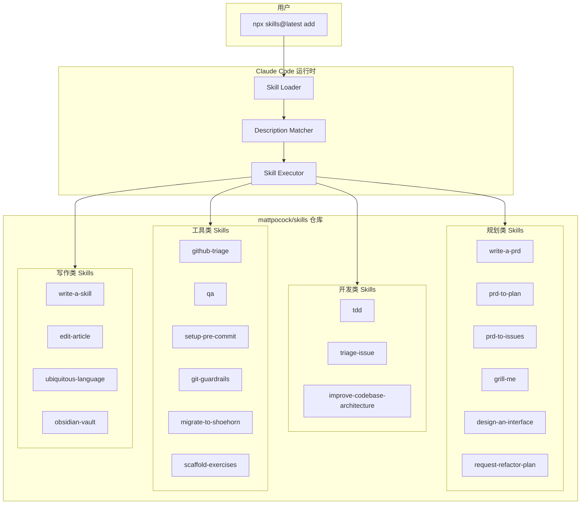
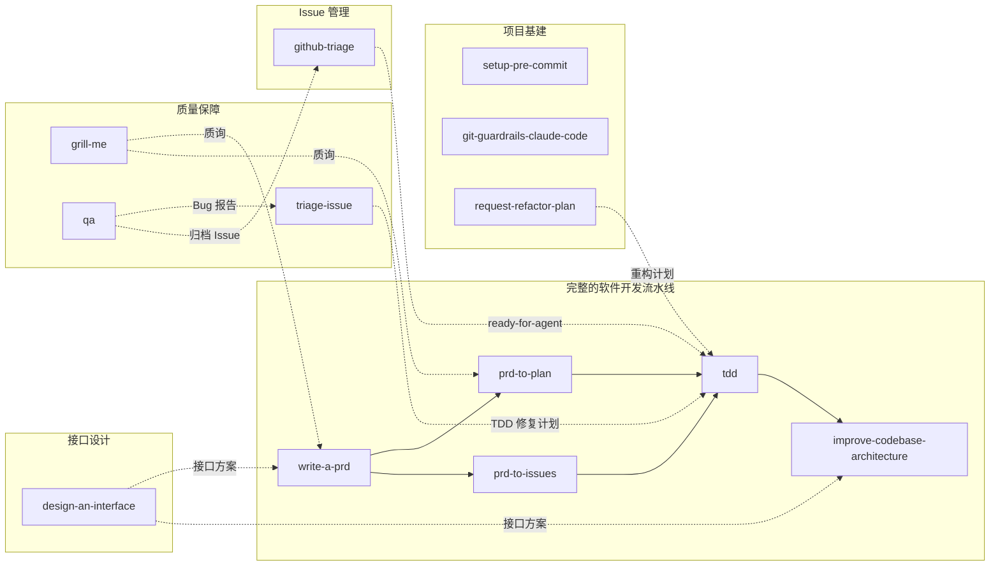
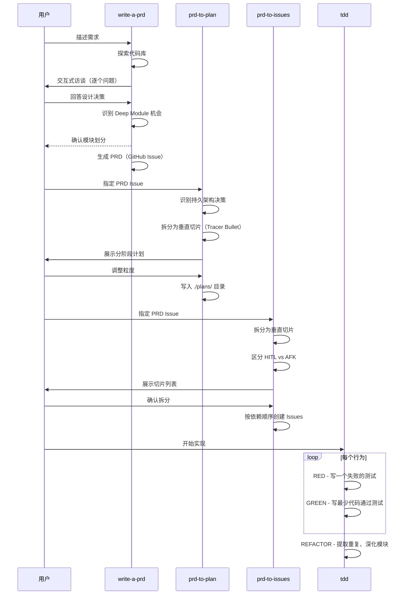
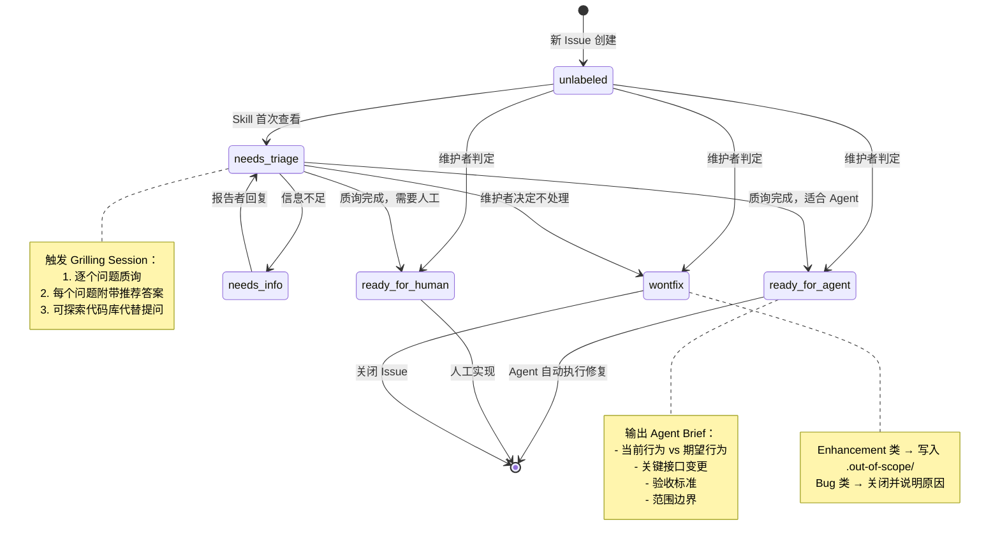

# skills 源码学习笔记

> 仓库地址：[skills](https://github.com/mattpocock/skills)
> 学习日期：2026-04-05

---

> **以下为 AI 源码分析**
>
> ### 一句话概括
>
> 一个开源的 Claude Code Agent Skills 集合，提供从需求规划、TDD 开发、代码架构改进到 GitHub 工作流自动化的完整 AI 辅助开发工具链。
>
> ### 要点速览
>
> | 模块 | 职责 | 关键文件 |
> |------|------|----------|
> | write-a-prd | 通过交互式访谈创建产品需求文档 | `SKILL.md` |
> | prd-to-plan | 将 PRD 拆分为 tracer bullet 垂直切片实施计划 | `SKILL.md` |
> | prd-to-issues | 将 PRD 转换为独立可认领的 GitHub Issues | `SKILL.md` |
> | grill-me | 对设计方案进行穷举式质询 | `SKILL.md` |
> | design-an-interface | 并行生成多个截然不同的接口设计方案 | `SKILL.md` |
> | request-refactor-plan | 创建细粒度的重构计划并提交为 GitHub Issue | `SKILL.md` |
> | tdd | Red-Green-Refactor 循环驱动的测试先行开发 | `SKILL.md` + 5 个子文档 |
> | triage-issue | 自动探查 Bug 根因并生成 TDD 修复计划 | `SKILL.md` |
> | improve-codebase-architecture | 发现架构摩擦点并提出 Deep Module 重构方案 | `SKILL.md` + `REFERENCE.md` |
> | github-triage | 基于标签状态机的 GitHub Issue 分流系统 | `SKILL.md` + 2 个子文档 |
> | qa | 交互式 QA 会话，自动将 Bug 归档为 Issue | `SKILL.md` |
> | setup-pre-commit | 一键配置 Husky + lint-staged + Prettier | `SKILL.md` |
> | git-guardrails-claude-code | Hook 拦截危险 git 命令 | `SKILL.md` + `block-dangerous-git.sh` |
> | write-a-skill | 创建新 skill 的编写指南 | `SKILL.md` |
> | edit-article | 文章编辑与改进 | `SKILL.md` |
> | ubiquitous-language | 提取 DDD 通用语言词汇表 | `SKILL.md` |
> | obsidian-vault | Obsidian 笔记管理 | `SKILL.md` |
> | migrate-to-shoehorn | 测试代码中 `as` 断言迁移到 shoehorn | `SKILL.md` |
> | scaffold-exercises | 脚手架生成教学练习目录结构 | `SKILL.md` |

---

## 项目简介

`mattpocock/skills` 是一个面向 Claude Code（Anthropic 的 AI 编程 CLI 工具）的 **Agent Skills 集合**。它不是传统的代码库，而是一组结构化的 Markdown 指令文件，每个 skill 定义了一套完整的 AI Agent 工作流程。

项目的核心价值在于：将软件工程最佳实践（TDD、垂直切片、Deep Module 架构思想等）编码为可复用的 AI Agent 指令，使 Claude Code 能够按照结构化流程执行复杂的软件开发任务。用户通过 `npx skills@latest add mattpocock/skills/<skill-name>` 安装 skill 到本地项目中。

## 技术栈

| 类别 | 技术 |
|------|------|
| 语言 | Markdown（SKILL.md 指令文件）、Bash（辅助脚本） |
| 框架 | Claude Code Agent Skills 框架 |
| 构建工具 | 无（纯文本指令，无需构建） |
| 依赖管理 | npx skills CLI（安装分发） |
| 测试框架 | 无（skill 本身不含可执行测试） |

## 目录结构

```
skills/
├── README.md                          # 项目总览与安装说明
├── LICENSE                            # MIT 许可证
│
├── write-a-prd/                       # 📋 规划类：创建产品需求文档
│   └── SKILL.md
├── prd-to-plan/                       # 📋 规划类：PRD → 实施计划
│   └── SKILL.md
├── prd-to-issues/                     # 📋 规划类：PRD → GitHub Issues
│   └── SKILL.md
├── grill-me/                          # 📋 规划类：方案质询
│   └── SKILL.md
├── design-an-interface/               # 📋 规划类：并行接口设计
│   └── SKILL.md
├── request-refactor-plan/             # 📋 规划类：重构计划
│   └── SKILL.md
│
├── tdd/                               # 🔨 开发类：测试驱动开发（最复杂的 skill）
│   ├── SKILL.md                       #   主入口：TDD 核心工作流
│   ├── tests.md                       #   好测试 vs 坏测试的对比示例
│   ├── mocking.md                     #   Mock 的使用原则和设计模式
│   ├── deep-modules.md                #   Deep Module 设计思想
│   ├── interface-design.md            #   可测试性接口设计原则
│   └── refactoring.md                 #   重构候选模式清单
├── triage-issue/                      # 🔨 开发类：Bug 分诊与修复计划
│   └── SKILL.md
├── improve-codebase-architecture/     # 🔨 开发类：架构改进
│   ├── SKILL.md                       #   架构探索与模块深化工作流
│   └── REFERENCE.md                   #   依赖分类与 Issue 模板
│
├── github-triage/                     # 🔧 工具类：GitHub Issue 分流
│   ├── SKILL.md                       #   标签状态机与分流工作流
│   ├── AGENT-BRIEF.md                 #   Agent Brief 编写规范
│   └── OUT-OF-SCOPE.md               #   .out-of-scope/ 知识库管理
├── qa/                                # 🔧 工具类：交互式 QA 会话
│   └── SKILL.md
├── setup-pre-commit/                  # 🔧 工具类：pre-commit hook 配置
│   └── SKILL.md
├── git-guardrails-claude-code/        # 🔧 工具类：危险 git 命令拦截
│   ├── SKILL.md
│   └── scripts/
│       └── block-dangerous-git.sh     #   唯一的可执行脚本
│
├── write-a-skill/                     # ✍️ 写作类：skill 编写指南
│   └── SKILL.md
├── edit-article/                      # ✍️ 写作类：文章编辑
│   └── SKILL.md
├── ubiquitous-language/               # ✍️ 写作类：DDD 通用语言提取
│   └── SKILL.md
├── obsidian-vault/                    # ✍️ 写作类：Obsidian 笔记管理
│   └── SKILL.md
├── migrate-to-shoehorn/              # 🔧 工具类：测试断言迁移
│   └── SKILL.md
└── scaffold-exercises/                # 🔧 工具类：教学练习脚手架
    └── SKILL.md
```

## 架构设计

### 整体架构

项目采用 **扁平化的 Skill 集合架构**，每个 skill 是一个独立的目录，包含一个 `SKILL.md` 主文件和可选的子文档。所有 skill 通过统一的 YAML frontmatter（`name` + `description`）接入 Claude Code 的 skill 加载机制。



项目的核心设计理念是 **"将软件工程最佳实践编码为 AI Agent 指令"**：

1. **声明式工作流**：每个 SKILL.md 定义了一套结构化的步骤序列，Agent 按步骤执行
2. **渐进式信息披露**：复杂 skill（如 tdd）通过 Markdown 链接引用子文档，主文件保持简洁
3. **统一的 frontmatter 契约**：`name` 用于安装标识，`description` 用于运行时匹配触发
4. **无运行时依赖**：纯文本指令，不依赖任何编程语言运行时

### 核心模块

#### 1. 规划类 Skills（Planning）

**职责**：覆盖从需求收集到实施计划拆分的完整规划链。

核心设计模式——**垂直切片（Vertical Slice / Tracer Bullet）**：

- `write-a-prd`：通过 5 步交互式访谈（描述→探索→面试→模块设计→输出）生成 PRD，提交为 GitHub Issue
- `prd-to-plan`：将 PRD 拆分为多个阶段，每个阶段是一个端到端的垂直切片（schema → API → UI → tests），输出到 `./plans/` 目录
- `prd-to-issues`：将 PRD 拆分为独立的 GitHub Issues，区分 HITL（需人工参与）和 AFK（可自动完成）类型，按依赖顺序创建
- `grill-me`：极简但强大的质询 skill，逐个问题深挖设计方案的每个分支
- `design-an-interface`：基于 "Design It Twice" 原则，使用并行 sub-agent 生成 3+ 个截然不同的接口设计，通过不同约束（最少方法、最大灵活性、常用场景优先等）引导差异化
- `request-refactor-plan`：通过 8 步流程创建重构计划，核心原则是 Martin Fowler 的"每个重构步骤尽可能小"

**关键接口**：

```yaml
# 统一的 frontmatter 格式
---
name: skill-name
description: 功能描述。Use when [触发条件]。
---
```

#### 2. 开发类 Skills（Development）

**职责**：指导 AI Agent 进行测试驱动开发、Bug 分诊和架构改进。

- **tdd** 是整个仓库中最复杂的 skill，拥有 6 个文件组成的知识体系：
  - `SKILL.md`：定义 Red-Green-Refactor 循环的 4 步工作流（Planning → Tracer Bullet → Incremental Loop → Refactor）
  - `tests.md`：通过代码示例对比好测试（集成式、行为驱动）和坏测试（实现耦合、mock 内部协作者）
  - `mocking.md`：明确 mock 的边界——只在系统边界 mock（外部 API、数据库、时间/随机数），内部模块间禁止 mock
  - `deep-modules.md`：John Ousterhout 的 Deep Module 概念——小接口 + 深实现 = 好模块
  - `interface-design.md`：三条可测试性接口设计原则：接受依赖而非创建、返回结果而非产生副作用、小表面积
  - `refactoring.md`：5 种重构候选模式清单

- **triage-issue**：5 步 Bug 分诊流程，从问题描述到自动创建带 TDD 修复计划的 GitHub Issue，强调"耐久性"——修复建议应描述行为和契约，而非内部结构

- **improve-codebase-architecture**：基于 Deep Module 思想的架构改进 skill，7 步流程包括有机探索（摩擦点即信号）、候选项展示、并行 sub-agent 设计多种接口方案、RFC Issue 创建。`REFERENCE.md` 定义了 4 种依赖分类：In-process、Local-substitutable、Remote but owned（Ports & Adapters）、True external（Mock）

#### 3. 工具类 Skills（Tooling）

**职责**：自动化 GitHub 工作流、Git 安全防护、代码迁移等。

- **github-triage**：最完整的工具类 skill，定义了一个完整的 **标签状态机**（unlabeled → needs-triage → needs-info / ready-for-agent / ready-for-human / wontfix），包含 Agent Brief 编写规范（`AGENT-BRIEF.md`）和 `.out-of-scope/` 知识库管理（`OUT-OF-SCOPE.md`）
- **qa**：交互式 QA 会话，用户口述 Bug → Agent 后台探索代码库 → 自动归档 GitHub Issue，支持单 Issue 和拆分为多个子 Issue
- **git-guardrails-claude-code**：通过 Claude Code 的 `PreToolUse` Hook 拦截危险 git 命令（push、reset --hard、clean、branch -D 等），唯一包含可执行 Bash 脚本的 skill
- **setup-pre-commit**：7 步配置 Husky + lint-staged + Prettier 的 pre-commit hook

#### 4. 写作类 Skills（Writing）

**职责**：辅助文档写作、知识管理和 skill 自身编写。

- **write-a-skill**：skill 编写的元指南，定义了目录结构规范、description 编写要求（最大 1024 字符）、文件拆分原则（超过 100 行拆分）
- **ubiquitous-language**：从对话中提取 DDD 通用语言词汇表，输出包含术语表、关系描述、示例对话和歧义标记的 `UBIQUITOUS_LANGUAGE.md`

### 模块依赖关系



## 核心流程

### 流程一：从 PRD 到代码的端到端开发流

这是项目最核心的价值主张——将完整的软件开发生命周期编码为 AI Agent 工作流。



### 流程二：GitHub Issue 分流状态机

`github-triage` skill 定义了一套完整的 Issue 生命周期管理机制。



## 关键设计亮点

### 1. 垂直切片（Tracer Bullet）贯穿全局

**解决的问题**：传统的水平分层开发（先写所有 schema，再写所有 API，再写所有 UI）导致集成风险后移、反馈周期长。

**实现方式**：`prd-to-plan`、`prd-to-issues`、`tdd` 三个 skill 统一使用垂直切片理念。每个切片切穿所有集成层（schema → API → UI → tests），可独立演示和验证。`tdd` 更是在代码层面强制执行：每次只写一个测试、只写最少代码通过，禁止一次性写完所有测试再实现。

**设计原因**：垂直切片最大化了反馈速度——每个切片完成后立即可验证，风险被分散到每个小步骤中。

### 2. Deep Module 思想的系统性应用

**解决的问题**：AI 生成的代码容易产生"浅模块"——大量小函数、小类，接口复杂但实现单薄，测试困难。

**实现方式**：
- `tdd/deep-modules.md` 定义了 Deep Module 概念（小接口 + 深实现）并用 ASCII 图直观对比
- `write-a-prd` 在模块设计阶段主动寻找 Deep Module 机会
- `improve-codebase-architecture` 的核心目标就是将 shallow module 深化
- `REFERENCE.md` 中的依赖分类（In-process / Local-substitutable / Ports & Adapters / Mock）为不同场景提供了系统化的深化策略

**设计原因**：源自 John Ousterhout 的 "A Philosophy of Software Design"，Deep Module 降低了认知负担，提高了可测试性和 AI 可导航性。

### 3. Agent Brief 的"耐久性"设计

**解决的问题**：Issue 创建后代码库会持续演变，引用具体文件路径和行号的 Issue 很快过时。

**实现方式**：`github-triage/AGENT-BRIEF.md` 明确规定：
- 描述接口、类型和行为契约，不引用文件路径和行号
- 描述"做什么"而非"怎么做"
- 验收标准必须可独立验证
- 必须声明范围边界

这一原则同样体现在 `triage-issue`（"只建议能经受住代码库剧变的修复方案"）和 `prd-to-plan`（"不包含具体文件名或可能变化的实现细节"）中。

**设计原因**：AI Agent 会在 Issue 创建后的某个不确定时间点执行任务，此时代码库状态可能已与创建时大不相同。耐久性设计确保 Issue 在代码重构后仍然有意义。

### 4. 并行 Sub-Agent 驱动的方案探索

**解决的问题**：单一方案容易陷入局部最优，人类和 AI 的第一直觉往往不是最佳选择。

**实现方式**：
- `design-an-interface` 基于 "Design It Twice" 原则，生成 3+ 个并行 sub-agent，每个使用不同约束（最少方法、最大灵活性、常用场景优先、特定范式启发）
- `improve-codebase-architecture` 同样使用并行 sub-agent 生成多种接口设计，然后通过散文式对比（非表格）讨论 trade-off

**设计原因**：通过约束差异化强制产生根本不同的方案，避免 sub-agent 产出相似设计。对比本身就是价值——差异最大的地方往往是决策最关键的地方。

### 5. `.out-of-scope/` 知识库——组织级决策记忆

**解决的问题**：被拒绝的 Feature Request 关闭 Issue 后决策理由丢失，相同需求反复被提出时需要重新讨论。

**实现方式**：`github-triage/OUT-OF-SCOPE.md` 定义了一套持久化决策记忆机制：
- 每个被拒绝的概念对应 `.out-of-scope/` 下的一个 Markdown 文件
- 按概念而非 Issue 组织（多个 Issue 请求同一功能归入同一文件）
- 包含决策理由（必须实质性，不是"我们不想做"）、技术约束说明、所有相关 Issue 链接
- 分流时自动检查新 Issue 是否匹配已有的 out-of-scope 概念（按概念相似度，非关键词匹配）

**设计原因**：这是一种轻量级的组织级知识管理——将隐性的"为什么不做"决策显性化，避免反复消耗维护者的决策带宽。
