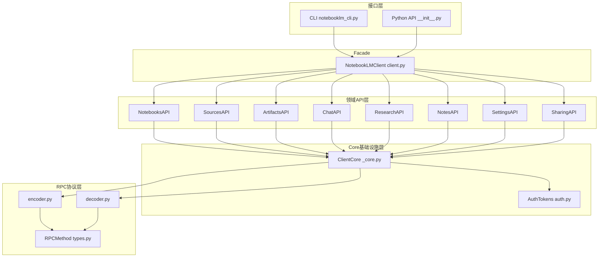
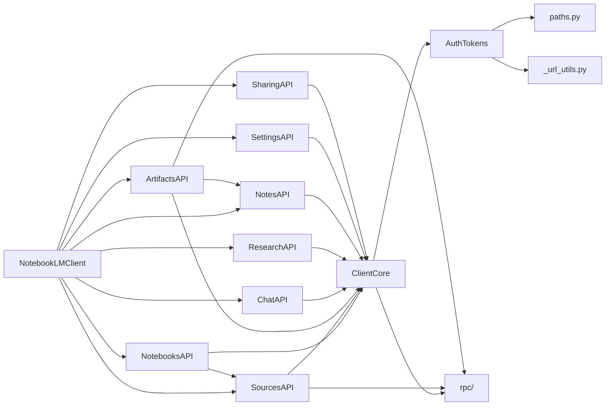
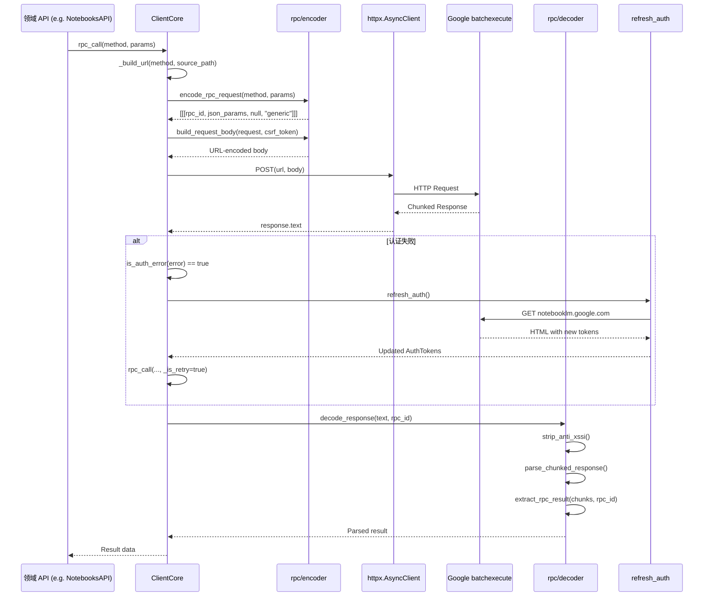
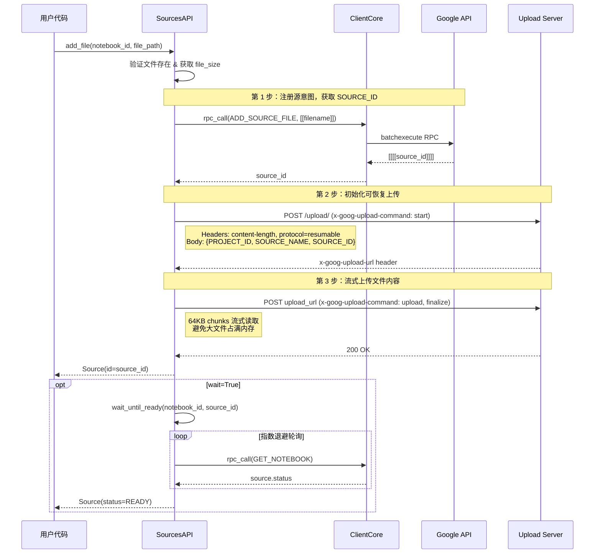

# notebooklm-py 源码学习笔记

> 仓库地址：[notebooklm-py](https://github.com/teng-lin/notebooklm-py)
> 学习日期：2026-04-05

---

> **以下为 AI 源码分析**
>
> ### 一句话概括
>
> 通过逆向工程 Google NotebookLM 的未公开 batchexecute RPC 协议，用 Python 实现了完整的非官方 API 客户端，支持 Notebook 管理、源文件添加、AI 内容生成、聊天对话等全部功能。
>
> ### 要点速览
>
> | 核心模块 | 职责 | 关键文件 |
> |---------|------|---------|
> | RPC 协议层 | 编解码 Google batchexecute 协议 | `rpc/encoder.py`, `rpc/decoder.py`, `rpc/types.py` |
> | 认证模块 | Cookie 提取、CSRF Token 获取、自动刷新 | `auth.py` |
> | 核心客户端 | HTTP 管理、RPC 调用调度、认证重试 | `_core.py`, `client.py` |
> | Notebooks API | 笔记本 CRUD 和元数据 | `_notebooks.py` |
> | Sources API | 多类型源文件添加（URL/文件/Drive/YouTube） | `_sources.py` |
> | Artifacts API | AI 内容生成与下载（音频/视频/报告/测验等） | `_artifacts.py` |
> | Chat API | 流式对话、引用解析、会话管理 | `_chat.py` |
> | CLI | Click 命令行界面 | `notebooklm_cli.py`, `cli/` |

---

## 项目简介

notebooklm-py 是一个非官方的 Python 库，对 Google NotebookLM 提供完整的编程访问能力。它通过逆向工程 NotebookLM Web 应用使用的 batchexecute RPC 协议，实现了 Python API、CLI 命令行工具和 AI Agent 集成三种使用方式。该项目不仅覆盖了 Web UI 的所有功能（笔记本管理、源添加、聊天、内容生成），还提供了 Web UI 不支持的能力——如批量下载 artifact、Quiz/Flashcard 导出为 JSON/Markdown、Mind Map 数据提取、Slide Deck PPTX 导出等。

## 技术栈

| 类别 | 技术 |
|------|------|
| 语言 | Python 3.10+ |
| 框架 | httpx (异步 HTTP)、Click (CLI) |
| 构建工具 | Hatchling (hatch-fancy-pypi-readme) |
| 依赖管理 | uv (lockfile: uv.lock)、pip |
| 测试框架 | pytest + pytest-asyncio + pytest-httpx + VCR.py |

## 目录结构

```
src/notebooklm/
├── __init__.py           # 公共 API 导出，版本管理，弃用兼容
├── client.py             # NotebookLMClient 主入口，组合所有子 API
├── _core.py              # ClientCore：HTTP 客户端、RPC 调用、认证刷新
├── auth.py               # Cookie 加载、CSRF/Session Token 提取
├── types.py              # 公共数据类（Notebook, Source, Artifact 等）
├── exceptions.py         # 分层异常体系（按域划分）
├── paths.py              # 存储路径管理
├── migration.py          # Profile 迁移
├── _notebooks.py         # NotebooksAPI：笔记本 CRUD
├── _sources.py           # SourcesAPI：多类型源添加/管理
├── _artifacts.py         # ArtifactsAPI：内容生成/下载
├── _chat.py              # ChatAPI：对话/引用/历史
├── _research.py          # ResearchAPI：Web/Drive 研究
├── _notes.py             # NotesAPI：笔记/Mind Map
├── _sharing.py           # SharingAPI：分享权限
├── _settings.py          # SettingsAPI：用户设置
├── _url_utils.py         # URL 工具函数
├── _version_check.py     # Python 版本检查
├── _logging.py           # 日志配置
├── notebooklm_cli.py     # CLI 主入口（Click group）
├── rpc/                  # RPC 协议层
│   ├── __init__.py       # 重导出
│   ├── types.py          # RPCMethod 枚举、API 常量
│   ├── encoder.py        # 请求编码（batchexecute 格式）
│   └── decoder.py        # 响应解码（chunked、anti-XSSI）
└── cli/                  # CLI 子命令
    ├── session.py        # login/use/status
    ├── notebook.py       # list/create/delete
    ├── source.py         # source add/list/delete
    ├── generate.py       # generate audio/video/quiz...
    ├── download.py       # download audio/video/quiz...
    ├── chat.py           # ask
    ├── research.py       # research start/poll
    ├── share.py          # share 管理
    ├── note.py           # note CRUD
    ├── artifact.py       # artifact list/delete
    ├── agent.py          # agent 模板
    ├── skill.py          # skill install
    ├── profile.py        # profile 管理
    ├── language.py       # 语言设置
    └── grouped.py        # SectionedGroup 自定义 Click group
```

## 架构设计

### 整体架构

notebooklm-py 采用经典的 **分层架构 + Facade 模式**，从底到顶分为四层：

1. **RPC 协议层**：负责 Google batchexecute 协议的编解码，是最底层的协议适配
2. **Core 基础设施层**：管理 HTTP 客户端生命周期、执行 RPC 调用、处理认证刷新和错误重试
3. **领域 API 层**：按业务域拆分的 8 个子 API（Notebooks、Sources、Artifacts、Chat、Research、Notes、Settings、Sharing），每个子 API 独立负责一个功能域
4. **接口层**：NotebookLMClient 作为 Facade 组合所有子 API，CLI 和 Python API 共享底层实现



### 核心模块

#### 1. RPC 协议层 (`rpc/`)

**职责**：实现 Google batchexecute 协议的完整编解码

- `types.py`：定义 `RPCMethod` 枚举（30+ 个逆向工程获得的 RPC 方法 ID）、API 端点 URL、所有配置枚举（AudioFormat, VideoStyle, QuizDifficulty 等）
- `encoder.py`：`encode_rpc_request()` 将方法 ID 和参数编码为 batchexecute 的三重嵌套数组格式 `[[[rpc_id, json_params, null, "generic"]]]`；`build_request_body()` 构建 URL 编码的 POST body
- `decoder.py`：`decode_response()` 完整解码流水线——`strip_anti_xssi()` 移除 Google 的 `)]}'\n` 前缀 → `parse_chunked_response()` 解析 `rt=c` 分块格式 → `extract_rpc_result()` 提取指定 RPC ID 的结果，包含错误码检测和 `UserDisplayableError` 限流识别

#### 2. 认证模块 (`auth.py`)

**职责**：管理 Google Cookie 认证和 Token 提取

- `AuthTokens` dataclass：持有 cookies 字典、CSRF token (SNlM0e)、Session ID (FdrFJe)
- `from_storage()` 类方法：从 Playwright 存储文件加载 cookie，自动访问 NotebookLM 首页提取 Token
- Cookie 加载支持三种来源：显式路径 > `NOTEBOOKLM_AUTH_JSON` 环境变量 > 默认存储文件
- 支持 40+ 个 Google 区域域名的 Cookie 提取（`.google.com.sg`, `.google.co.uk` 等）
- Cookie 优先级规则：`.google.com` 基础域名优先于区域域名

#### 3. Core 基础设施层 (`_core.py`)

**职责**：HTTP 客户端管理、RPC 调用编排、认证自动刷新

- `ClientCore`：内部基础设施类，管理 `httpx.AsyncClient` 生命周期
- `rpc_call()` 核心方法：构建 URL → 编码请求 → HTTP POST → 解码响应，失败时自动检测认证错误并通过 `refresh_callback` 重试一次
- 使用 `asyncio.Lock` + 共享 Task 模式确保并发下只执行一次 Token 刷新
- HTTP 状态码精确映射：429 → `RateLimitError`、5xx → `ServerError`、4xx → `ClientError`
- 会话缓存（`OrderedDict` FIFO 淘汰）用于 Chat follow-up 对话

#### 4. 领域 API 层

**NotebooksAPI** (`_notebooks.py`)：笔记本 CRUD、获取 AI 摘要/描述、元数据导出，使用 `asyncio.gather` 并发获取笔记本和源列表

**SourcesAPI** (`_sources.py`)：支持 URL、文本、文件上传（三步 resumable upload：注册 → 获取上传 URL → 流式上传）、Google Drive、YouTube（自动检测视频 ID）；`wait_until_ready()` 使用指数退避轮询源处理状态

**ArtifactsAPI** (`_artifacts.py`)：最庞大的子 API，支持 10 种 artifact 类型的生成和下载（Audio, Video, Report, Quiz, Flashcard, Mind Map, Infographic, Slide Deck, Data Table）；下载逻辑处理多种格式（MP3/MP4/PNG/PDF/CSV/JSON/Markdown/HTML）

**ChatAPI** (`_chat.py`)：使用独立的流式 Query 端点（非 batchexecute），解析 chunked 响应提取答案文本、引用信息（source ID + 引用文本 + 字符位置）和服务端会话 ID

**ResearchAPI** (`_research.py`)：Web/Drive 研究功能，支持 fast/deep 两种模式，poll 轮询结果，import 导入发现的源

**SharingAPI** (`_sharing.py`)：笔记本分享管理，支持公开/私有链接、用户级权限（Viewer/Editor）、视图级别（Full/Chat Only）

### 模块依赖关系



## 核心流程

### 流程一：RPC 调用与认证刷新

这是整个库最核心的流程——每一个 API 操作最终都通过 `ClientCore.rpc_call()` 执行 RPC 调用。



**关键逻辑**：
1. `encode_rpc_request` 将参数编码为 Google batchexecute 的三重嵌套数组 `[[[rpc_id, json_params, null, "generic"]]]`
2. `build_request_body` 生成 URL 编码的 form data，包含 `f.req` 和 `at`（CSRF token）
3. 响应解码：先移除 `)]}'\n` anti-XSSI 前缀 → 解析交替的 byte_count/json 行 → 查找匹配 rpc_id 的 `wrb.fr` 项
4. 认证失败自动重试：检测 `AuthError` 或 HTTP 401/403 → 用锁保护的共享 Task 执行一次 Token 刷新 → 重试一次（`_is_retry=True` 防止无限循环）

### 流程二：文件上传（Resumable Upload）

文件上传是最复杂的源添加流程，使用 Google 的三步 Resumable Upload 协议。



**关键逻辑**：
1. 文件上传不使用 batchexecute，而是使用 Google 的 Resumable Upload 协议（`/upload/_/` 端点）
2. 三步流程：RPC 注册获取 SOURCE_ID → HTTP 初始化获取 upload URL → HTTP 流式上传文件
3. 文件以 64KB chunks 流式读取上传，避免大文件一次性加载到内存
4. `wait_until_ready` 使用指数退避策略（初始 1s，最大 10s，系数 1.5）轮询状态直到 READY 或超时

## 关键设计亮点

### 1. 协议逆向工程的系统化封装

**解决的问题**：Google batchexecute 是一个复杂的未文档化协议，包含 anti-XSSI 保护、分块响应格式、嵌套数组参数等

**实现方式**：`rpc/` 模块将协议完全抽象——`RPCMethod` 枚举集中管理 30+ 个逆向获取的方法 ID，`encoder.py` 和 `decoder.py` 处理编解码细节，上层 API 只需要传入方法名和参数列表

**设计原因**：将易变的协议细节（RPC ID 可能因 Google 更新而改变）集中管理，当 API 变化时只需更新枚举值和解码逻辑，无需修改业务代码

### 2. 分层异常体系

**解决的问题**：用户需要区分不同类型的错误以做出不同的处理（重试 vs 退出 vs 重新认证）

**实现方式**：`exceptions.py` 定义了完整的异常层次结构——`NotebookLMError` 为根，下分 `NetworkError`（可重试）、`RPCError`（协议错误）、以及按域划分的 `SourceError`/`ArtifactError`/`ChatError` 等。每个异常携带丰富的上下文（`method_id`、`raw_response`、`rpc_code`、`retry_after`）

**设计原因**：让调用者可以用 `except NotebookLMError` 捕获所有错误，也可以精确到 `except RateLimitError` 做退避重试，异常类型本身就传达了处理策略

### 3. 自动认证刷新与并发安全

**解决的问题**：Google 的 CSRF Token 和 Session ID 会过期，并发 RPC 调用时多个请求可能同时检测到认证失败

**实现方式**：`ClientCore` 使用 `asyncio.Lock` + 共享 `asyncio.Task` 模式——第一个检测到认证错误的请求创建刷新 Task，后续请求在锁外 await 同一个 Task，避免重复刷新。刷新后通过 `update_auth_headers()` 更新 HTTP 客户端的 Cookie header

**设计原因**：在异步高并发场景下，多个 RPC 调用可能同时失败。共享 Task 模式既保证只执行一次刷新，又不阻塞其他请求（锁只保护 Task 创建，不保护整个刷新过程）

### 4. 区域化 Cookie 域名支持

**解决的问题**：不同国家/地区的用户，Google 会将认证 Cookie 设置在不同的区域域名上（如 `.google.com.sg`, `.google.co.jp`）

**实现方式**：`auth.py` 维护了 `GOOGLE_REGIONAL_CCTLDS` 白名单（40+ 个区域），`_is_google_domain()` 函数验证域名合法性。提取 Cookie 时使用优先级规则：`.google.com` 始终优先于区域域名，防止同名 Cookie 被区域值覆盖

**设计原因**：使用显式白名单而非正则匹配，防止恶意域名（如 `evil-google.com`）被错误接受；优先级规则解决了 PR #34 中发现的 Cookie 值不确定性 bug

### 5. Chat API 的独立流式协议

**解决的问题**：Chat 功能使用不同于 batchexecute 的流式端点，响应中嵌套了答案文本、引用信息和会话 ID

**实现方式**：`ChatAPI.ask()` 使用独立的 `GenerateFreeFormStreamed` 端点，自己构建请求 body（不复用 `ClientCore.rpc_call()`）。解析逻辑通过 `_extract_answer_and_refs_from_chunk()` 递归遍历嵌套 JSON，使用「标记答案优先」策略——优先取标记了 `first[4][-1]==1` 的文本块作为答案，回退到最长未标记文本

**设计原因**：Chat 协议与 batchexecute 差异太大（不同端点、不同编码、流式响应），强行复用会增加复杂度。引用解析采用递归 UUID 提取（`_extract_uuid_from_nested`）适应 Google API 返回结构的不确定性
