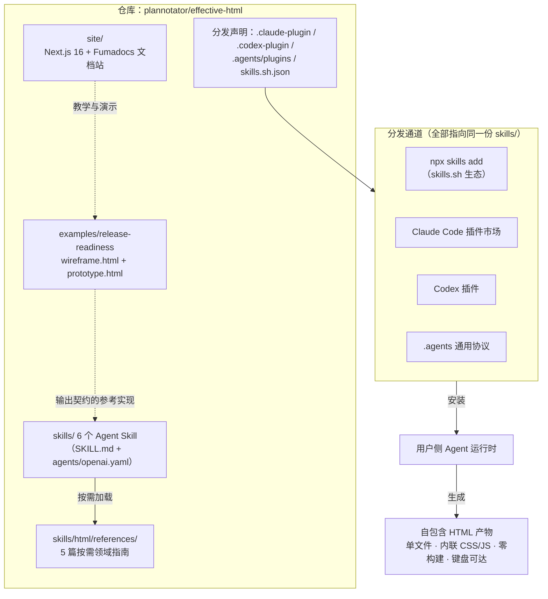
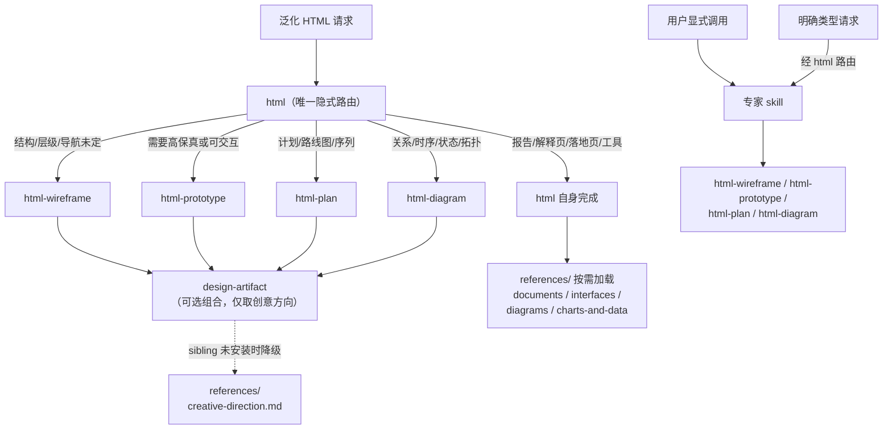
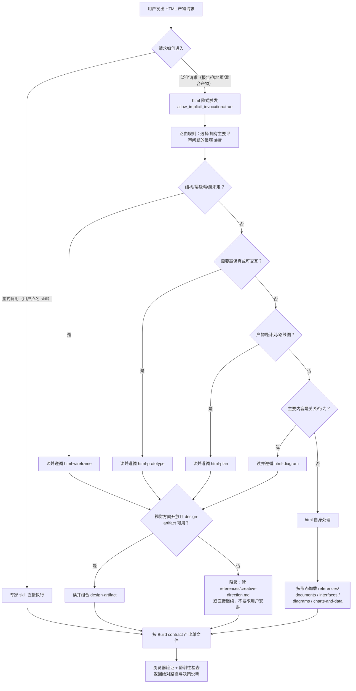
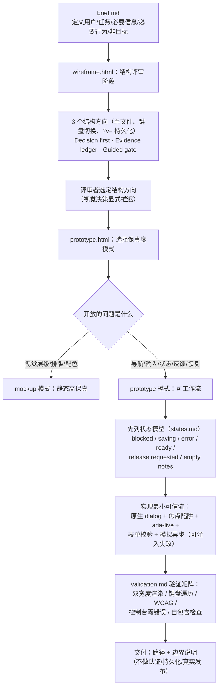
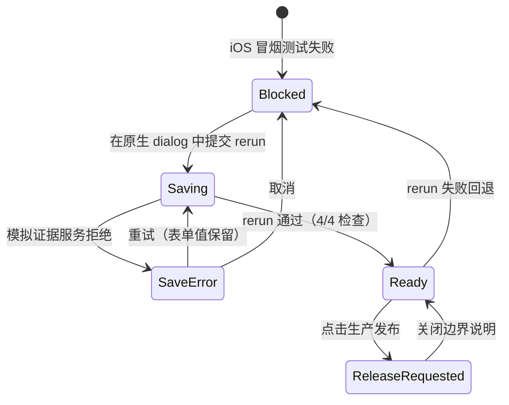

# effective-html 源码学习笔记

> 仓库地址：[effective-html](https://github.com/plannotator/effective-html)
> 学习日期：2026-09-30

---

> **以下为 AI 源码分析**
>
> ### 一句话概括
>
> 一个 "prompt 即产品" 的 Agent Skills 集合：核心交付物是 6 份总计约 440 行的 SKILL.md，教会编码代理产出自包含、无构建依赖的 HTML 产物（线框图、原型、计划、图表），并配套参考实现、文档站和 4 条分发通道。
>
> ### 要点速览
>
> | 模块 | 职责 | 关键文件 |
> |------|------|----------|
> | `skills/html` | 唯一的隐式路由 skill，承接泛化 HTML 请求并分发到专家 | `SKILL.md`（77 行）+ `references/`（5 篇按需指南） |
> | `skills/design-artifact` | 横切创意方向 skill：调色板、字体、排版、主题与"反 AI 审美" | `SKILL.md`（83 行，集合中最长） |
> | `skills/html-wireframe` | 低保真结构探索专家，要求"故意未完成"的视觉契约 | `SKILL.md`（86 行） |
> | `skills/html-prototype` | 高保真 mockup 与可交互原型专家，核心是状态建模 | `SKILL.md`（102 行，含状态清单） |
> | `skills/html-plan` | 计划/路线图文档专家，强调源承诺的 traceability | `SKILL.md`（45 行） |
> | `skills/html-diagram` | 关系/时序/拓扑图表专家，先选视觉语法再选渲染器 | `SKILL.md`（48 行） |
> | `examples/release-readiness` | 完整参考实现：同一 brief 的 wireframe（993 行）与 prototype（1728 行） | `wireframe.html`、`prototype.html`、`states.md`、`validation.md` |
> | `site/` | effectivehtml.com 文档站，"人类看 HTML、LLM 看 Markdown"双渲染 | `lib/llm-content.ts`、`app/llms.txt/`、`app/*.md/` |
> | 插件元数据 | 4 条分发通道的声明式注册，全部指向同一份 `skills/` 源 | `.claude-plugin/`、`.codex-plugin/`、`.agents/`、`skills.sh.json` |

---

## 项目简介

effective-html 解决的问题是：**编码代理生成的 HTML 产物质量不稳定、且千篇一律**。它的答案不是写一个工具或框架，而是把一套设计判断（何时用 HTML、用什么保真度、如何避免 AI 审美套路、如何验证可访问性）沉淀为 6 份结构化的 SKILL.md prompt，让任何支持 Agent Skills 协议的运行时（Claude Code、Codex、skills.sh 生态）都能复用。

项目灵感来自 Thariq Shihipar 的《The unreasonable effectiveness of HTML》——HTML 单文件几乎可以可视化任何东西（报告、原型、图表、演示），且比大段文字更清晰。仓库的核心理念是 "fat artifacts + fat context"：与其在 prompt 里堆文字，不如把上下文放进可检查的产物里。

三类交付物相互独立：`skills/` 是可安装的技能集合（核心产品）；`examples/` 是技能输出契约的参考实现（质量基准）；`site/` 是营销与教学层（Next.js 文档站）。README 明确说：可以不安装任何东西，把它当作参考来读。

## 技术栈

| 类别 | 技术 |
|------|------|
| 语言 | Markdown（SKILL.md 即产品源码）+ TypeScript/TSX（site 层）+ 原生 HTML/CSS/JS（示例产物） |
| 框架 | skill 层无运行时框架；site 层为 Next.js 16.3.5 + Fumadocs 16.14 + React 19.2 |
| 构建工具 | skill 层无构建（这是产物契约的一部分）；site 层 `next build --webpack` |
| 依赖管理 | pnpm 10.34（site）；npx skills CLI（分发） |
| 测试框架 | 无自动化测试框架——用"干净调用"测试 + 人工浏览器验证矩阵 + `validation.md` 记录文档代替 |

## 目录结构

```text
effective-html/
├── skills/                        # 核心产品：6 个 Agent Skill
│   ├── html/                      #   隐式路由 skill（唯一入口）
│   │   ├── SKILL.md               #   路由规则 + Build contract
│   │   ├── references/            #   5 篇按需加载的领域指南（渐进披露）
│   │   │   ├── creative-direction.md      # design-artifact 缺席时的降级方案
│   │   │   ├── documents-and-presentations.md
│   │   │   ├── interfaces.md
│   │   │   ├── diagrams.md
│   │   │   └── charts-and-data.md
│   │   └── agents/openai.yaml     #   Codex 侧触发策略（隐式允许）
│   ├── design-artifact/           #   横切创意方向 skill
│   ├── html-wireframe/            #   低保真专家（隐式禁止）
│   ├── html-prototype/            #   高保真/交互专家（隐式禁止）
│   ├── html-plan/                 #   计划文档专家（隐式禁止）
│   └── html-diagram/              #   图表专家（隐式禁止）
├── examples/
│   └── release-readiness/         # 参考实现：brief → wireframe → prototype 全链路
│       ├── brief.md               #   产品需求（用户/任务/必要信息/行为/非目标）
│       ├── wireframe.html         #   993 行，3 个结构方向可切换
│       ├── prototype.html         #   1728 行，含完整状态机
│       ├── states.md              #   状态模型表（触发/可见结果/可用动作）
│       └── validation.md          #   验证记录 + 干净调用测试结果
├── site/                          # effectivehtml.com（Next.js + Fumadocs）
│   ├── app/                       #   路由：页面 + *.md/route.ts + llms.txt 端点
│   ├── lib/                       #   catalog-data.ts（719 行目录数据）+ llm-content.ts
│   ├── content/docs/              #   9 篇 MDX 指南
│   ├── components/                #   catalog-explorer 等 React 组件
│   └── .impeccable/               #   外部设计审计工具的产物（design.json + 审计报告）
├── .claude-plugin/                # Claude Code 插件市场注册（marketplace + plugin）
├── .codex-plugin/                 # Codex 插件注册（含 interface 元数据）
├── .agents/plugins/               # 通用 agent 插件发现协议
└── skills.sh.json                 # skills.sh 目录页的分组声明
```

## 架构设计

### 整体架构

仓库是一个**三层 + 一分发**的结构：内容层（skills/）是唯一真源，参考层（examples/）示范内容层应产出什么，文档站层（site/）对外教学，分发声明层（4 个元数据文件）把内容层注册到各 agent 生态。所有分发通道都指向同一份 `skills/` 目录，没有任何代码复制。



架构的深层理念是**把设计判断协议化**：不提供库，而是提供一组带路由关系的 prompt。skill 之间的关系（谁路由给谁、谁组合谁、缺席时怎么降级）全部用 SKILL.md 内的相对链接表达，例如 `html` 中写道 "Read and follow `../html-wireframe/SKILL.md`"——这让关系在安装为子集时依然成立。

### 核心模块

**模块一：`skills/html` —— 隐式路由与通用兜底**

- 职责：承接所有"HTML 是交付物"的泛化请求（报告、解释页、落地页、演示、工具、混合产物），并在请求有更明确归属时路由到专家 skill。
- 核心文件：`SKILL.md`（路由规则 + 五步设计前置 + Build contract + 交付格式）、`references/`（5 篇领域指南）。
- 关键接口：frontmatter `description` 同时承担触发条件与路由指令（"Route clear wireframe, prototype, mockup, plan, or diagram requests to the matching direct-invocation specialist when available"）。
- 关键机制：
  - **authority 链条**（用户显式指令 > 项目设计系统 > 主题/受众 > 自身品味），六个 skill 全部一致复用这一顺序；
  - **降级路径**：sibling skill 未安装时不阻塞用户（"Do not make the user install another skill before completing the request"），转而加载 `references/` 里最接近的指南；
  - **原创性终检**："if the subject were swapped for a neighboring topic, would the same visual concept still make just as much sense? If yes, the direction is too generic"。

**模块二：`skills/design-artifact` —— 横切创意方向**

- 职责：为任何 HTML 产物提供"主题特定的视觉方向"，刻意**不**提供可复用的风格（"nothing should smell like it came off a shelf"）。
- 关键内容：三档 register（workmanlike / editorial / expressive）；双主题 token 工程模式（`:root` 自定义属性 + `prefers-color-scheme` + `data-theme` 属性必须双向压过媒体查询）；**反 AI 审美清单**——明确点名当前模型输出的套路：暖米色 `#F4F1EA` + 衬线标题 + 陶土色点缀、紫蓝渐变 hero、Inter / Space Grotesk、`rounded-lg` 到处喷、emoji 当章节标记等。
- 与其他模块关系：被四个专家 skill 以"可选组合"方式引用（各专家 skill 的保真度/结构契约保持权威，创意方向从属于它）。

**模块三：四个专家 skill —— 保真度分层**

每个专家 skill 的 frontmatter `description` 都写明 "Do not activate independently from a general request"，由用户显式调用或由 `html` 路由触发：

| Skill | 核心契约 | 特色约束 |
|-------|----------|----------|
| `html-wireframe` | 灰度、系统字体、朴素边框；禁止品牌色/渐变/阴影/插画 | "intentional unfinishedness"——低保真是评审纪律而非美学偏好；未定结构时给出 2–3 个**结构上**不同的方向（导航模型、分组顺序、信息密度），并放进单文件用键盘可切换的 selector 对比 |
| `html-prototype` | 两模式：mockup（静态高保真）/ prototype（可工作流） | 建前列出状态清单（loading / empty / error / success / disabled / mobile + 领域状态）；禁止死按钮——真实系统才有的行为要**说明边界**而不是假装完成 |
| `html-plan` | 源承诺保真：不丢失、不膨胀 | "Do not add a timeline, progress percentage, status badge, or dashboard summary unless the source supports it" |
| `html-diagram` | 先选视觉语法（topology/sequence/process/state/hierarchy/timeline/matrix）再选渲染器（HTML+CSS / SVG / Canvas / WebGL） | 反对"清一色圆角盒子加箭头"的架构图壁纸 |

**模块四：`examples/release-readiness` —— 契约的参考实现**

不是文档而是**可执行的规格说明**：`brief.md` 定义需求，`wireframe.html`（993 行）实现 3 个方向对比 + `?v=` URL 状态 + 键盘切换（数字键 1–3 / 方向键），`prototype.html`（1728 行）实现完整状态机。`states.md` 用表格定义每个状态的触发、可见结果、可用动作；`validation.md` 记录浏览器验证矩阵与"干净调用"测试结果。

**模块五：`site/` —— 双渲染文档站**

Next.js 16 App Router + Fumadocs。独特的架构决策是**同一内容双出口**：人类访问 React 页面（`app/page.tsx`、`app/catalog/page.tsx`），LLM 访问等价的 Markdown 端点——`app/llms.txt/route.ts`（站点索引）、`app/llms-full.txt/route.ts`（全文）、`app/index.md/route.ts` / `catalog.md` / `examples.md`（页面级 Markdown 镜像）、`app/llms.mdx/docs/[[...slug]]/route.ts`（指南页 Markdown）。`lib/llm-content.ts`（255 行）统一生成这些响应，`revalidate = false` 静态化。`lib/catalog-data.ts`（719 行）是 20 个 SVG 样本目录的单一数据源。

### 模块依赖关系



注意依赖的方向性：专家 skill 引用 `design-artifact` 时明确"保真度/结构/行为契约以我为准"（"This skill's low-fidelity contract remains authoritative"）——创意方向是可插拔的增强，不是依赖。

## 核心流程

### 流程一：skill 触发与路由决策

这是集合最重要的运行时机制，由三层声明协同实现：frontmatter `description` 描述触发条件（所有运行时都会读）、`agents/openai.yaml` 的 `allow_implicit_invocation` 控制隐式触发（Codex 读）、SKILL.md 正文的相对链接实现路由（模型读）。



流程的关键逻辑：

1. **路由优先于执行**。`html` 的路由段放在所有设计指导之前（SKILL.md 第 10–24 行），确保泛化请求先收敛到正确的保真度层级。
2. **隐式/显式双轨**。`html` 与 `design-artifact` 的 `openai.yaml` 设 `allow_implicit_invocation: true`（入口必须能被隐式命中），四个专家全部为 `false`（避免多个 skill 抢同一请求）。这个布尔值与 frontmatter description 里的 "Do not activate independently" 互相印证，是跨平台一致性的范例。
3. **降级不阻塞**。每个"读并遵循 X"的指令都隐含"sibling 可用"前提；不可用时回到自身 references 或直接继续。集合支持任意子集安装。
4. **交付格式统一**。所有 skill 都要求返回绝对路径 + 显式说明（wireframe 要列出各方向的 tradeoff 与推迟的视觉决策；prototype 要列出模式、已实现状态与刻意未含的生产行为）。

### 流程二：brief → wireframe → prototype 的产物演进

以 `examples/release-readiness` 为例，这是四个专家 skill 契约的完整落地：一个发布决策工具从结构探索到可交互原型的最短路径。



prototype 内部的状态机（`states.md` 定义、`prototype.html` 用 `body[data-release-state]` 属性驱动）：



实现层面的关键细节（引用 `examples/release-readiness/prototype.html`）：

- **状态驱动 CSS**：状态写在 `<body data-release-state="blocked">`（1201 行），CSS 用 `body[data-release-state="ready"]` 选择器切换决策章与分隔线（259、305 行）——DOM 结构不变，纯属性驱动视图。
- **原生 `<dialog>`**（1346 行）+ 手写焦点陷阱 `trapDialogFocus`（1441 行）+ `cancel` 事件在保存中阻止关闭（1535 行）+ 关闭后焦点回到触发器（1530 行）。
- **aria-live 播报**：`#status-announcer`（1204 行）通过 `announce()` 先清空再 `requestAnimationFrame` 填充，确保连续状态变化都能被读屏器播报（1462 行）。
- **XSS 安全**：评审者输入的备注全部用 `createElement` + `textContent` 构建（1554–1572 行），validation.md 明确把 "safe rendering of reviewer-entered text" 列入测试项。
- **wireframe 的方向切换**：三个方向是 `variants[]` 数组里的模板函数，挂载到 `#stage`；键盘 1–3 / 左右方向键切换、`?v=` 参数经 `history.replaceState` 持久化（对可分享、可回归的评审链接至关重要）。

## 关键设计亮点

**1. Router + Specialist + 横切 skill 的 prompt 架构——把"单一巨 prompt"拆成有路由关系的网络**

- 解决的问题：一个巨型 prompt 同时教"低保真灰度"和"高保真精致"会互相矛盾；而六个独立 skill 又会被同一请求重复触发。
- 实现方式：`skills/html/SKILL.md` 作为唯一隐式路由（frontmatter description 写明路由指令 + `agents/openai.yaml` 设 `allow_implicit_invocation: true`）；四个专家全部禁止隐式触发（`false`）；`design-artifact` 作为横切层被专家"可选组合"且明确从属（专家的保真度契约保持权威）。
- 为什么值得学：这是 skill 生态里少见的**显式拓扑设计**——依赖关系、缺席降级、组合权威性全部写成文字合同，任一子集安装后行为依然正确。对比常见的"一堆平铺 skill 靠 description 撞运气触发"，这种设计把激活语义从概率变成了协议。

**2. "故意未完成"作为可执行契约**

- 解决的问题：低保真 wireframe 常被模型"顺手美化"，导致评审者过早讨论品牌色而忽略信息架构。
- 实现方式：`skills/html-wireframe/SKILL.md` 的 "Keep the artifact intentionally unfinished" 一节列出硬约束：灰度、系统字体、朴素边框、禁品牌色/渐变/阴影/插画；同时区分 "intentional unfinishedness" 与 "careless spacing"——间距、可读性、响应式仍然要合格。配套要求 2–3 个方向必须是**结构差异**（导航模型、分组顺序、信息密度），"色彩变化或卡片重排不算独立方向"。
- 为什么值得学：把"低保真"从模糊的审美偏好翻译成了可验证的负向清单 + 正向质量底线，模型无法曲解；`examples/release-readiness/wireframe.html` 用 Arial + 灰阶 token 落实了这份合同。

**3. 统一的 Build contract + 交付格式——产物质量下限由文字合同保证**

- 解决的问题：agent 生成的 HTML 常见缺陷——引 CDN 字体、需要构建、横向溢出、死按钮、hover 才可见的信息。
- 实现方式：所有六个 skill 收敛到同一组条款（`skills/html/SKILL.md` 的 "Build contract" 最完整）：单 `.html` 文件、CSS/JS 内联、直接打开即用、无网络依赖、语义 HTML、可见键盘焦点、`prefers-reduced-motion`、宽内容放独立滚动容器、CSS token 小而特定；外加原创性终检（"换成相邻主题还成立吗"）。交付时必须返回绝对路径 + 视觉与交互决策说明。
- 为什么值得学：`examples/release-readiness/prototype.html`（1728 行）证明这份合同可以产出生产级可访问性（原生 dialog、焦点管理、aria-live、状态清单先行），而 `validation.md` 把验证结果固化为回归基准。**合同 + 参考实现 + 验证记录**三者闭环，是 prompt 工程里少见的"测试文化"。

**4. 多通道声明式分发，单一真源零复制**

- 解决的问题：Agent Skills 生态碎片化——Claude Code 插件、Codex 插件、skills.sh、通用 agent 协议各有自己的元数据格式。
- 实现方式：`.claude-plugin/marketplace.json` + `plugin.json`（skills 路径数组）、`.codex-plugin/plugin.json`（含 `interface.defaultPrompt`、`capabilities: ["Write"]`）、`.agents/plugins/marketplace.json`（安装策略 `ON_INSTALL`）、`skills.sh.json`（目录页分组）——四个文件全部指向仓库根的 `skills/` 目录，没有任何 skill 内容的复制。
- 为什么值得学：`examples/release-readiness/validation.md` 记录了每个通道的真实打包验证（"Claude Code 2.1.270's native marketplace validator passes"），元数据不是写了就算，而是持续回归。

**5. 人机双渲染的内容策略**

- 解决的问题：文档站的教学内容（何时用 HTML、保真度选择）既要给人类看，也要被检索/引用它的 LLM 消费——同一内容维护两份必然漂移。
- 实现方式：`site/lib/llm-content.ts` 基于 Fumadocs 的 `source.getPages()` + 处理后的 Markdown 生成所有 LLM 出口；`site/app/` 下 `llms.txt`（索引）、`llms-full.txt`（全文）、`index.md` / `catalog.md` / `examples.md`（页面级镜像）、`llms.mdx/docs/[[...slug]]`（指南页）全部是薄 route handler，`revalidate = false` 静态输出。
- 为什么值得学：把 llms.txt 生态当作一等公民数据出口（而非事后 sitemap），与仓库主旨"HTML 给人看、结构化文本给 agent 看"完全自洽。

---

## 未深入分析的部分

- `site/components/` 下的 React 组件实现细节（`catalog-explorer.tsx` 等约千行 UI 代码）与 `site/.impeccable/` 设计审计工具的完整工作方式——它们服务于站点本身而非 skill 契约。
- `site/public/catalog/effective-svg/` 的 20 个静态/动态 SVG 样本内容与 `site/public/examples/` 下的产品复刻示例（Linear / Notion / Vercel 界面研究）。
- `site/app/api/search/route.ts` 的检索实现。
- 集合的商业生态关联：`plannotator`（本地 HTML 渲染标注工具）与 `tot`（HTML 分享链接 CLI）是同组织的配套产品，skill 中仅在收尾步骤可选提及（需用户明确同意才安装/发布）。

## 学习收获

1. **prompt 也可以有架构**：路由、降级、组合权威性、横切关注点分离——软件架构的经典命题在纯 Markdown prompt 集合上同样成立，且实现成本远低于代码。
2. **质量下限靠合同而非运气**：负向清单（禁什么）+ 正向底线（必须什么）+ 参考实现（长什么样）+ 验证记录（测过什么）四件套，值得任何 agent 工作流仓库借鉴。
3. **frontmatter description 是激活协议的一部分**，不只是描述：触发条件、反触发条件、路由指令都写在这里，并与平台专属元数据（`openai.yaml`）互相印证。
