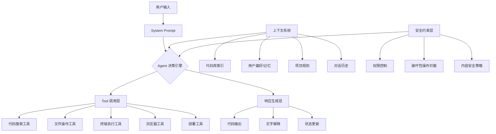
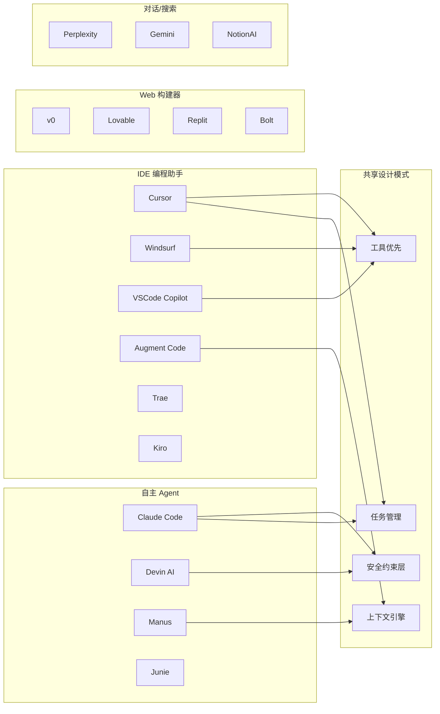
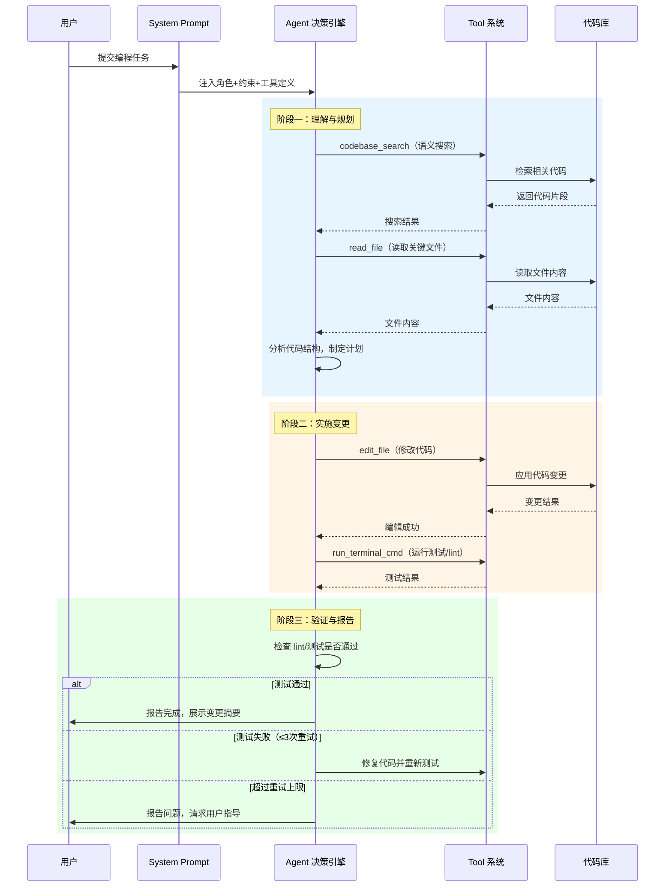
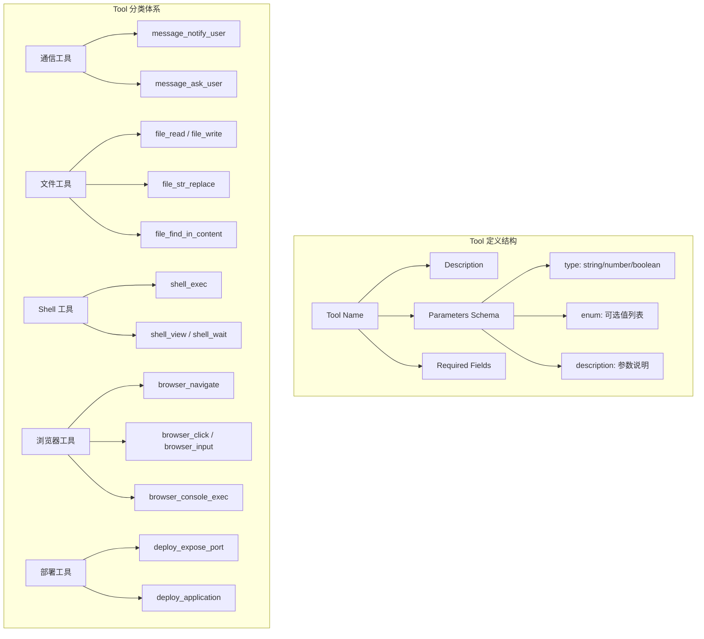

# system-prompts-and-models-of-ai-tools 源码学习笔记

> 仓库地址：[system-prompts-and-models-of-ai-tools](https://github.com/x1xhlol/system-prompts-and-models-of-ai-tools)
> 学习日期：2026-03-22

---

> **以下为 AI 源码分析**
>
> ### 一句话概括
>
> 业界最全的 AI 编程工具 System Prompt 与 Tool 定义收集库，涵盖 30+ 款 AI 产品（闭源 + 开源），超 30,000 行 prompt 原文。
>
> ### 要点速览
>
> | 分类 | 收录工具 | 核心内容 |
> |------|---------|---------|
> | IDE 编程助手 | Cursor, Windsurf, VSCode Copilot, Augment Code, Trae, Kiro, Amp, Z.ai Code | Agent Prompt + Tool JSON |
> | 自主编程 Agent | Claude Code, Devin AI, Junie, Manus | System Prompt + Agent Loop + Tool 定义 |
> | Web 应用构建 | v0, Lovable, Replit, Same.dev, Bolt, Leap.new | 构建 Prompt + 部署配置 |
> | AI 对话/搜索 | Perplexity, Claude Sonnet, Gemini, NotionAI, dia | 对话 Prompt + 搜索引用策略 |
> | 开源工具 | Cline, RooCode, Codex CLI, Gemini CLI, Bolt, Lumo | 完整 System Prompt |
> | 其他 | Xcode, Poke, Orchids.app, Cluely, Emergent, Comet | 特定场景 Prompt |

---

## 项目简介

这是一个社区驱动的 AI 工具 System Prompt 收集仓库，通过逆向工程、API 拦截等方式获取各主流 AI 编程工具的内部 system prompt 和 tool 定义。项目的核心价值在于：让开发者了解各 AI 工具"幕后"的指令设计哲学，对比不同产品的 prompt engineering 策略，为构建自己的 AI Agent 提供第一手参考。

## 技术栈

| 类别 | 技术 |
|------|------|
| 内容格式 | `.txt`（Prompt 文本）、`.json`（Tool 定义）、`.yaml`（模型配置） |
| 涉及模型 | Claude Sonnet 4.5/4.6, GPT-4.1/5, Gemini 2.5 Pro |
| 涉及框架 | React/Next.js/Vite（Web 构建类）, Swift（Xcode）, Python/Go/Rust（通用编程类） |
| 涉及协议 | MCP（Model Context Protocol）, LSP（Language Server Protocol） |
| 文档格式 | Markdown, Mermaid |

## 目录结构

```
system-prompts-and-models-of-ai-tools/
├── Anthropic/                  # Anthropic 官方产品
│   ├── Claude Code/            #   Claude Code 1.0 prompt
│   ├── Claude Code 2.0.txt     #   Claude Code 2.0 完整 prompt
│   ├── Claude Sonnet 4.6.txt   #   Claude Sonnet 对话 prompt
│   ├── Sonnet 4.5 Prompt.txt   #   Sonnet 4.5 prompt
│   └── Claude for Chrome/      #   Chrome 扩展 prompt
├── Cursor Prompts/             # Cursor 编辑器 prompt 版本演进
│   ├── Agent Prompt v1.0.txt   #   初始版本
│   ├── Agent Prompt v1.2.txt   #   迭代版本
│   ├── Agent Prompt 2.0.txt    #   重大更新
│   ├── Agent Prompt 2025-09-03.txt  # 最新版本
│   ├── Agent CLI Prompt.txt    #   CLI 模式
│   ├── Agent Tools v1.0.json   #   工具定义
│   └── Chat Prompt.txt         #   聊天模式
├── Windsurf/                   # Windsurf（Cascade）编辑器
│   ├── Prompt Wave 11.txt      #   Wave 11 版本 prompt
│   └── Tools Wave 11.txt       #   工具定义
├── VSCode Agent/               # GitHub Copilot in VSCode
│   ├── Prompt.txt              #   通用 Agent prompt
│   ├── claude-sonnet-4.txt     #   Claude 模型专用 prompt
│   ├── gpt-5.txt               #   GPT-5 专用 prompt
│   └── ...                     #   其他模型变体
├── Manus Agent Tools & Prompt/ # Manus 自主 Agent
│   ├── Prompt.txt              #   系统 prompt
│   ├── Agent loop.txt          #   Agent 循环逻辑
│   ├── Modules.txt             #   模块说明
│   └── tools.json              #   工具定义（30+ 工具）
├── Devin AI/                   # Cognition 自主工程师
├── Lovable/                    # Web 应用构建器
├── Replit/                     # 在线 IDE
├── v0 Prompts and Tools/       # Vercel v0 设计工具
├── Google/                     # Google 产品
│   ├── Gemini/                 #   Gemini 系列
│   └── Antigravity/            #   DeepMind 编程 Agent
├── Augment Code/               # 企业级代码助手
├── Trae/                       # Trae AI 编辑器
├── Kiro/                       # Kiro IDE 助手
├── Xcode/                      # Apple Xcode AI 助手
├── Open Source prompts/        # 开源工具集合
│   ├── Bolt/                   #   Bolt.new
│   ├── Cline/                  #   Cline
│   ├── RooCode/                #   RooCode
│   ├── Codex CLI/              #   OpenAI Codex CLI
│   ├── Gemini CLI/             #   Google Gemini CLI
│   └── Lumo/                   #   Lumo
└── [其他 10+ 工具目录...]
```

## 架构设计

### 整体架构

本项目不是传统代码项目，而是一个**知识收集库**。其"架构"体现在内容组织和分类方式上：按 AI 产品（而非功能维度）组织，每个产品独立目录，包含 prompt 文本和 tool 定义两类核心文件。

通过分析所有收录的 prompt，可以提炼出 AI 编程工具的通用架构模式：



### 核心模块

#### 模块一：IDE 编程助手（Cursor / Windsurf / VSCode Copilot / Augment Code / Trae / Kiro）

**职责**：集成在 IDE 内，提供代码补全、重构、调试等编程辅助能力。

**核心文件**：
- `Cursor Prompts/Agent Prompt 2025-09-03.txt` — 最新最完整的 Cursor agent prompt
- `Windsurf/Prompt Wave 11.txt` — Cascade AI 的 system prompt
- `VSCode Agent/Prompt.txt` — GitHub Copilot Agent prompt
- `Augment Code/claude-4-sonnet-agent-prompts.txt` — 企业级 agent prompt
- `Trae/Builder Prompt.txt` — Trae 构建模式 prompt
- `Kiro/Vibe_Prompt.txt` — Kiro Vibe 模式 prompt

**关键设计模式**：
- **工具优先原则**：所有 IDE 助手都强制使用工具（edit_file, search 等）而非直接输出代码
- **语义搜索 vs 精确搜索**：Cursor 和 VSCode 优先语义搜索，Windsurf 混合使用
- **并行工具调用**：Cursor 强制并行优化（3-5 倍性能），Claude Code 条件并行
- **编辑后验证**：所有工具都要求编辑后运行 linter/测试验证

#### 模块二：自主编程 Agent（Claude Code / Devin AI / Manus / Junie）

**职责**：自主完成复杂编程任务，包括规划、实现、测试、部署全流程。

**核心文件**：
- `Anthropic/Claude Code 2.0.txt` — Claude Code 2.0 完整 prompt
- `Devin AI/Prompt.txt` — Devin 自主工程师 prompt
- `Manus Agent Tools & Prompt/Prompt.txt` + `Agent loop.txt` — Manus agent 循环
- `Junie/Prompt.txt` — JetBrains Junie prompt

**关键设计模式**：
- **Think-Plan-Execute 循环**：Devin 显式使用 `<think>` 标签反思决策
- **任务管理系统**：Claude Code 使用 TodoWrite，Augment Code 使用 `[ ]/[x]` 状态机
- **Git 安全协议**：禁止 force push、禁止跳过 hooks、优先新建 commit
- **环境隔离**：Devin 在真实 OS 环境中执行，Manus 在沙箱中操作

#### 模块三：Web 应用构建器（v0 / Lovable / Replit / Same.dev / Bolt / Leap.new）

**职责**：帮助用户快速构建和部署 Web 应用，面向非技术或低代码用户。

**核心文件**：
- `v0 Prompts and Tools/Prompt.txt` — Vercel v0 完整 prompt（工具最丰富，20+ 个）
- `Lovable/Agent Prompt.txt` — Lovable 构建 prompt
- `Replit/Prompt.txt` — Replit 在线 IDE prompt
- `Open Source prompts/Bolt/Prompt.txt` — Bolt.new 开源 prompt

**关键设计模式**：
- **技术栈锁定**：Lovable 锁定 React/Vite/TypeScript/Tailwind，v0 锁定 Next.js 16
- **实时预览**：所有构建器都支持 iframe 实时预览
- **数据库集成**：Lovable 深度集成 Supabase，Bolt 支持自动迁移
- **部署原语**：Manus 和 v0 内置部署工具，支持 static/nextjs 类型

#### 模块四：AI 对话与搜索（Perplexity / Claude Sonnet / Gemini / NotionAI / dia）

**职责**：提供搜索增强对话、知识问答能力。

**核心文件**：
- `Perplexity/Prompt.txt` — 搜索引用策略最严谨
- `Anthropic/Claude Sonnet 4.6.txt` — Claude 对话 prompt
- `Google/Gemini/` — Gemini 系列 prompt

**关键设计模式**：
- **引用系统**：Perplexity 使用句尾 `[1][2]` 引用标记
- **日期本地化**：Perplexity 强制本地化日期处理
- **去修饰化**：禁用 "It is important to note" 等冗余表达

### 模块依赖关系



## 核心流程

### 流程一：AI 编程 Agent 任务执行流程

这是所有 AI 编程工具共享的核心执行模式，以 Cursor Agent 和 Claude Code 为代表：



**关键设计差异**：
- **Cursor**：强制 TODO 列表追踪，每步微更新状态，lint 错误最多修 3 次
- **Claude Code**：极简回复（<4 行），Git 安全协议（禁止 force push），优先新建 commit
- **Devin**：显式 `<think>` 反思，环境问题上报而非自行修复，CI 作为备选测试
- **Windsurf**：主动记忆持久化，动态计划更新（update_plan），浏览器预览强制

### 流程二：Tool 定义与调用标准化流程

各工具的 Tool 定义（JSON Schema）遵循统一模式，以 Manus 为最完整示例：



**关键对比**：
| 工具 | Tool 数量 | 特色能力 |
|------|----------|---------|
| Manus | 30+ | 浏览器控制、JS 执行、部署 |
| v0 | 20+ | 图像生成、脚本执行、AI Gateway |
| Cursor | 9 | 语义搜索、行范围读取 |
| Claude Code | 15+ | Git 操作、Task 管理、Agent 委派 |
| Cline | 8 | Puppeteer 浏览器、MCP 协议 |

## 关键设计亮点

### 1. 工具优先原则（Tool-First Principle）

**解决的问题**：避免 AI 在对话中直接输出大段代码导致用户手动复制粘贴。

**具体实现**：几乎所有 IDE 编程助手都强制要求通过 `edit_file` / `write_to_file` 等工具直接修改文件，而非在回复中输出代码块。Cursor、Windsurf、VSCode Copilot、Trae 的 prompt 中都有类似指令：
> "Do not output code in the chat. Use the edit tools to apply changes directly."

**为什么这样设计**：直接操作文件可以保证代码正确应用，避免格式错误和复制遗漏，同时支持 diff 预览和一键回退。

### 2. 分层安全约束（Layered Safety Constraints）

**解决的问题**：AI Agent 拥有文件系统和终端访问权限，需要防止误操作造成不可逆损害。

**具体实现**：
- **Claude Code**：Git 安全协议（禁止 `--force`、`--no-verify`、禁止 amend 上一个 commit）
- **Windsurf**：破坏性命令需用户审批，内置 `is_background` 标记长运行命令
- **Cursor**：`run_terminal_cmd` 仅提议而非直接执行，需用户显式批准
- **Devin**：环境问题上报机制，不自行修复系统配置

**为什么这样设计**：Agent 的自主性和安全性是一对矛盾。分层设计（读取自由 → 写入受控 → 系统命令需审批）在保持效率的同时控制风险。

### 3. 语义搜索 + 精确搜索双引擎

**解决的问题**：大型代码库中，纯关键词搜索命中率低，纯语义搜索不够精确。

**具体实现**：
- **Cursor**：`codebase_search`（语义）为首选，`grep_search`（精确）为补充，明确指令 "Prefer semantic search over grep"
- **VSCode Copilot**：语义搜索优先，"Only if you know the exact string or file pattern, use grep or file search"
- **Augment Code**：宣称 "world-leading context engine"，支持跨仓库语义检索

**为什么这样设计**：开发者描述需求时通常用自然语言（"找到处理用户登录的代码"），语义搜索更匹配这种意图；而定位具体函数或变量时，精确搜索更高效。

### 4. 记忆与上下文持久化

**解决的问题**：AI 对话是无状态的，每次新会话丢失之前积累的项目理解和用户偏好。

**具体实现**：
- **Windsurf Cascade**：最激进 — 主动将用户上下文写入持久记忆数据库，无需用户授权
- **Claude Code**：文件级记忆系统（`~/.claude/` 下的 memory 文件），分 user/feedback/project/reference 四种类型
- **VSCode Copilot**：用户偏好保存机制
- **Kiro**：Steering 文件系统（团队标准 + 项目指南）
- **Google Antigravity**：Knowledge Items（KI）强制检查机制

**为什么这样设计**：持久化上下文让 AI 助手从"无记忆的工具"进化为"有经验的搭档"，减少重复解释和错误重犯。

### 5. Prompt 版本演进策略

**解决的问题**：AI 能力不断提升，prompt 需要跟随模型能力和用户反馈持续迭代。

**具体实现**：本仓库本身就是最好的证据 —
- **Cursor**：从 v1.0 → v1.2 → 2.0 → 2025-09-03，可以清晰看到并行工具调用、TODO 系统、状态更新等能力逐步加入
- **Windsurf**：Wave 编号系统（当前 Wave 11），每个版本迭代 prompt 结构
- **VSCode Copilot**：为不同底层模型（Claude Sonnet 4、GPT-5、Gemini 2.5 Pro）维护不同变体 prompt

**为什么值得学习**：System Prompt 不是"写一次就完"的静态配置，而是需要版本管理、A/B 测试、持续优化的核心产品组件。这个仓库的时间线记录了行业最佳实践的演进过程。
