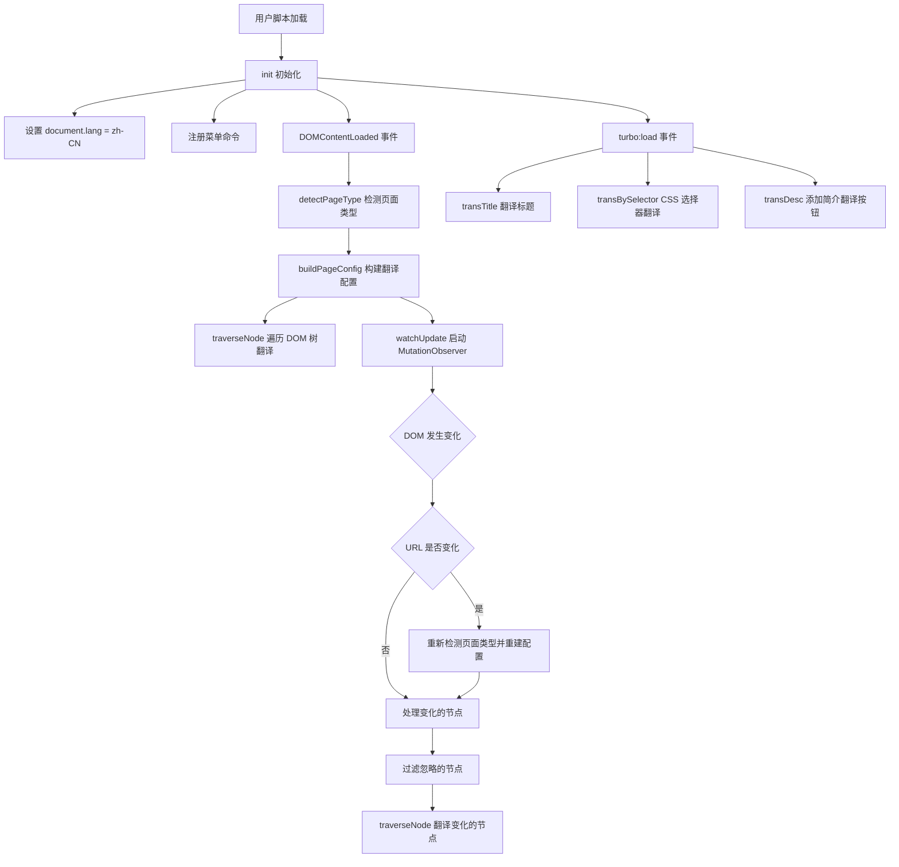
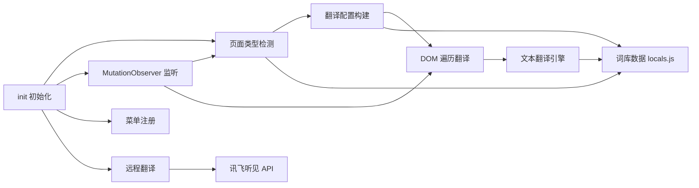
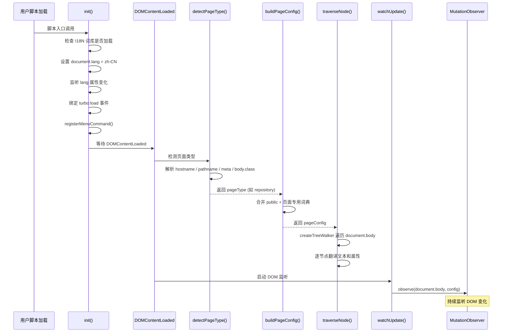
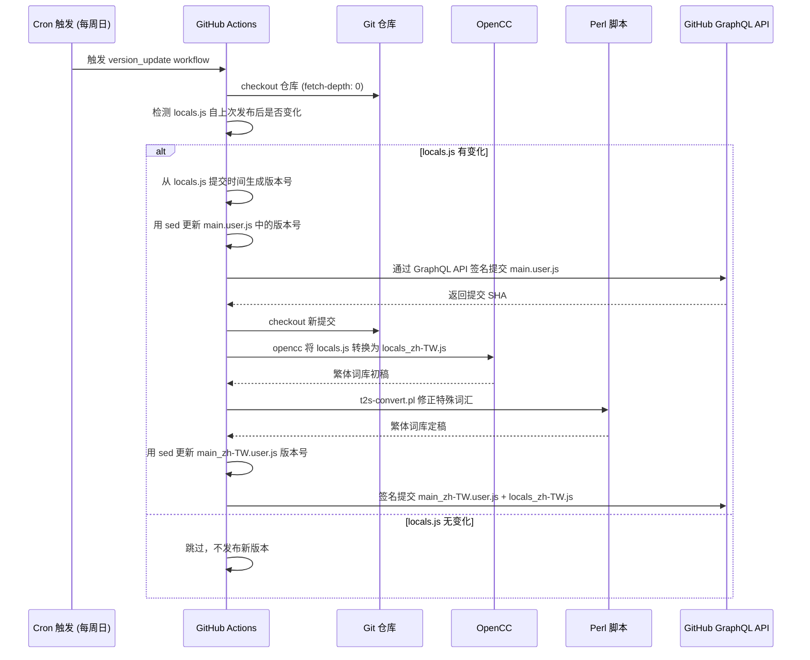

# github-chinese 源码学习笔记

> 仓库地址：[github-chinese](https://github.com/maboloshi/github-chinese)
> 学习日期：2026-04-05

---

> **以下为 AI 源码分析**
>
> ### 一句话概括
>
> 一个基于 Tampermonkey 用户脚本的 GitHub 界面中文化插件，通过 MutationObserver 监听 DOM 变化并实时翻译界面文本。
>
> ### 要点速览
>
> | 核心模块 | 职责 | 关键文件 |
> |---------|------|---------|
> | 主脚本（开发版） | 脚本入口，DOM 监听、翻译调度、页面类型检测 | `main.user.js` |
> | 主脚本（GreasyFork 版） | 面向 GreasyFork 平台的旧版主脚本 | `main(greasyfork).user.js` |
> | 繁体中文版主脚本 | 繁体中文界面翻译 | `main_zh-TW.user.js` |
> | 词库文件（简体） | 存放所有页面匹配规则、翻译忽略规则和中文词条 | `locals.js` |
> | 词库文件（繁体） | 由简体词库自动转换生成 | `locals_zh-TW.js` |
> | 简繁转换工具 | 将简体词库按规则转换为繁体 | `script/t2s-convert.pl` |
> | 词条去重工具 | 清理词库中 static 部分的重复键值 | `script/rd.py` |
> | CI 提交脚本 | 通过 GitHub GraphQL API 进行签名提交 | `script/ci_commit_with_signature.sh` |
> | CI/CD 工作流 | 自动化版本更新、词库同步、繁体转换 | `.github/workflows/*.yaml` |

---

## 项目简介

GitHub 中文化插件是一个 Tampermonkey/Violentmonkey 用户脚本，用于将 GitHub 网站界面（菜单、按钮、标题、提示等）翻译成简体中文或繁体中文。项目源自 [52cik/github-hans](https://github.com/52cik/github-hans)，由沙漠之子持续维护和扩展。它通过静态词典映射 + 正则表达式匹配两种策略翻译界面文本，同时支持对仓库简介进行在线机器翻译（讯飞听见），并利用 MutationObserver 实时捕获 GitHub SPA 的 DOM 变化进行增量翻译。词库拥有近 29,000 行条目，覆盖 GitHub 几乎所有页面类型。

## 技术栈

| 类别 | 技术 |
|------|------|
| 语言 | JavaScript (UserScript)、Perl、Python、Bash |
| 框架 | Tampermonkey / Violentmonkey UserScript API |
| 构建工具 | 无独立构建工具，CI 中使用 `sed`、`opencc`、Perl 脚本 |
| 依赖管理 | 无 — 纯用户脚本，通过 `@require` 加载词库 |
| 测试框架 | 无自动测试 — 依赖手工验证 |

## 目录结构

```
github-chinese/
├── main.user.js                  # 主脚本（开发版，GitHub 源）
├── main(greasyfork).user.js      # 主脚本（GreasyFork 稳定版，旧版架构）
├── main_zh-TW.user.js            # 繁体中文版主脚本
├── locals.js                     # 简体中文词库（~29000 行，核心数据）
├── locals(greasyfork).js         # GreasyFork 版词库（同步自 locals.js）
├── locals_zh-TW.js               # 繁体中文词库（由 opencc + Perl 脚本生成）
├── t2s_rules.conf                # 简繁转换自定义修正规则
├── script/
│   ├── t2s-convert.pl            # Perl 简繁转换后处理脚本
│   ├── rd.py                     # Python 词条去重工具
│   └── ci_commit_with_signature.sh  # CI 签名提交脚本（GitHub GraphQL API）
├── .github/
│   ├── workflows/
│   │   ├── main.user.js_version_update_and_sync_zh-TW.yaml  # 每周日：版本更新 + 繁体同步
│   │   ├── locals(greasyfork).js_update.yaml                 # 每周四：GreasyFork 词库同步
│   │   ├── remove_dup.yml                                     # 手动触发：词条去重
│   │   └── update_contributors_images.yml                     # 手动触发：更新贡献者列表
│   ├── copilot-instructions.md
│   └── ISSUE_TEMPLATE/
├── preview/                       # 效果预览图
├── README.md                      # 项目文档（简体）
├── README_zh-TW.md                # 项目文档（繁体）
└── LICENSE                        # GPL-3.0 许可证
```

## 架构设计

### 整体架构

本项目采用**事件驱动的实时翻译架构**。核心思路是：在页面加载时立即翻译整个 DOM 树，然后通过 MutationObserver 持续监听 DOM 变化，对新增/修改的节点进行增量翻译。翻译策略分为两层——先查静态词典（精确匹配），再走正则匹配（模式匹配），确保覆盖率和准确率的平衡。

词库按页面类型分区组织，主脚本在每次 URL 变化时重新检测页面类型并重建翻译配置对象（`pageConfig`），实现了页面级的词库隔离和优先级控制。



### 核心模块

#### 1. 页面类型检测模块

- **职责**：根据当前 URL、`<meta>` 标签、`<body>` class 等信息判断用户当前所在的 GitHub 页面类型
- **核心文件**：`main.user.js` — `detectPageType()` 函数
- **关键逻辑**：
  - 通过 `CONFIG.PAGE_MAP` 映射域名到站点类型（gist / status / skills / education）
  - 读取 `<meta name="analytics-location">` 判断是否为仓库页或组织页
  - 使用 `I18N.conf` 中的三组正则 `rePagePath` / `rePagePathRepo` / `rePagePathOrg` 匹配 pathname 提取子页面类型
  - 采用 `switch(true)` 模式按优先级处理：登录页 > 特殊站点 > 个人资料 > 首页 > 仓库页 > 组织页 > 默认路径
- **返回值**：如 `repository`、`repository/issues`、`dashboard`、`page-profile/stars` 等字符串，用于在词库中索引对应翻译条目

#### 2. 翻译配置构建模块

- **职责**：根据页面类型从词库中聚合当前页面需要的所有翻译资源
- **核心文件**：`main.user.js` — `buildPageConfig()` 函数
- **关键数据结构** — `pageConfig` 对象包含：
  - `staticDict`：当前页面静态词典（合并 public + 页面专用）
  - `regexpRules`：正则翻译规则数组（页面专用优先于 public）
  - `titleStaticDict` / `titleRegexpRules`：标题翻译专用词典
  - `ignoreMutationSelectors`：需忽略 DOM 变化的 CSS 选择器
  - `ignoreSelectors`：需跳过翻译的元素 CSS 选择器
  - `characterData`：是否启用文本节点监听
  - `tranSelectors`：CSS 选择器翻译规则

#### 3. DOM 遍历与翻译模块

- **职责**：递归遍历 DOM 节点，根据节点类型分发到不同的翻译处理逻辑
- **核心文件**：`main.user.js` — `traverseNode()` 函数
- **关键逻辑**：
  - 使用 `document.createTreeWalker` 高效遍历元素节点和文本节点
  - 对文本节点：调用 `transElement(node, 'data')` 翻译文本内容
  - 对元素节点按 `tagName` 分类处理：
    - `RELATIVE-TIME`：翻译时间元素（通过 `shadowRoot` 访问）
    - `INPUT/TEXTAREA`：翻译 `value` / `placeholder` / `data-confirm`
    - `BUTTON`：翻译 `title` / `data-confirm` / `data-disable-with` 等属性
    - `OPTGROUP`：翻译 `label` 属性
    - 含 `tooltipped` class 的元素：翻译 `aria-label`
  - 使用 `pageConfig.ignoreSelectors` 跳过不需要翻译的区域（如代码块、Markdown 正文）

#### 4. 文本翻译引擎模块

- **职责**：对清理后的文本执行静态词典匹配 + 正则替换
- **核心文件**：`main.user.js` — `transText()` + `fetchTranslatedText()` 函数
- **翻译流程**：
  1. `transText()` 跳过纯空白、纯数字、纯中文的文本
  2. 清理文本：`trim()` + 替换多余空白字符（含 `&nbsp;`）
  3. `fetchTranslatedText()` 先查 `pageConfig.staticDict`（精确匹配）
  4. 未命中则遍历 `pageConfig.regexpRules`（正则替换）
  5. 翻译成功后保留原始文本的首尾空白

#### 5. 远程翻译模块

- **职责**：通过讯飞听见 API 翻译仓库/Gist 简介（英文 → 中文）
- **核心文件**：`main.user.js` — `transDesc()` + `requestRemoteTranslation()` 函数
- **关键逻辑**：
  - 在仓库简介元素后动态插入"翻译"按钮
  - 点击后通过 `GM_xmlhttpRequest` 调用讯飞听见翻译 API
  - 引擎配置可扩展（`CONFIG.TRANS_ENGINES`），当前仅配置了 `iflyrec`

#### 6. 词库数据模块

- **职责**：存放所有翻译数据和页面配置规则
- **核心文件**：`locals.js`（~29000 行）
- **数据结构**：
  - `I18N.conf`：页面匹配正则、忽略规则、选择器规则等配置
  - `I18N["zh-CN"]`：按页面类型组织的翻译词条
  - 每个页面类型下包含 `static`（静态词典对象）、`regexp`（正则规则数组）、`selector`（CSS 选择器规则）
  - 部分页面类型通过展开运算符 `...` 继承公共部分（如 `page-profile-public`）

### 模块依赖关系



## 核心流程

### 流程一：页面加载与首次翻译



**关键逻辑说明**：
1. 脚本在 `document-start` 注入（开发版），确保尽早设置 `lang` 属性
2. `DOMContentLoaded` 触发后进行首次全量翻译
3. 同时启动 MutationObserver，后续所有 DOM 变化都会增量翻译
4. GitHub 使用 Turbo（类 SPA 框架），页面导航通过 `turbo:load` 事件通知，此时重新翻译标题和 CSS 选择器规则

### 流程二：CI 自动化词库同步与版本发布



**关键逻辑说明**：
1. 每周日 UTC 16:00（北京时间周一 0:00）自动检测词库变化
2. 版本号格式为 `1.9.3-2026-03-26`，日期部分取自 `locals.js` 最后修改时间
3. 使用 GitHub App Token（而非 PAT）进行签名提交，保证提交的 verified 标记
4. 简繁转换分两步：先用 `opencc` 做标准简→繁转换，再用 Perl 脚本按 `t2s_rules.conf` 修正特殊词汇（如"复刻→複刻""代码→程式碼"）
5. GreasyFork 版本每周四单独同步

## 关键设计亮点

### 1. 基于页面类型的词库分区与继承

- **解决问题**：GitHub 页面众多，不同页面的相同英文文本可能需要不同翻译，同时大量通用文本需要复用
- **实现方式**：词库按 `I18N["zh-CN"]["<页面类型>"]` 分区，每个区有独立的 `static` 和 `regexp`。查找时先查页面专用词典再查 `public` 公共词典。部分页面通过 ES6 展开运算符 `...` 继承公共基类（如所有 `page-profile/*` 页面共享 `page-profile-public`）
- **设计优势**：既保证了翻译精确度（同一文本在不同上下文可以有不同译文），又通过继承减少了重复维护成本

### 2. MutationObserver + flatMap 的高效增量翻译

- **解决问题**：GitHub 是基于 Turbo 的 SPA 应用，页面内容频繁动态更新，需要实时翻译新出现的内容
- **实现方式**（`main.user.js` — `watchUpdate()` 函数）：
  - 对 `childList` 类型的突变，直接处理 `addedNodes`（而非 `target`），大幅减少重复翻译
  - 使用 `flatMap` + `filter` 链式操作，在一次遍历中完成节点提取和忽略规则过滤
  - 通过 `ignoreMutationSelectors` 跳过代码编辑器、Markdown 正文等不需要翻译的区域
- **设计优势**：相比旧版（GreasyFork 版）对每个 mutation 的 `target` 做全量遍历，新版只处理实际新增的节点，性能提升显著

### 3. TreeWalker 替代递归遍历

- **解决问题**：大型 DOM 树的递归遍历可能导致调用栈过深和性能问题
- **实现方式**（`main.user.js` — `traverseNode()` 函数）：
  - 开发版使用 `document.createTreeWalker` 替代旧版的 `childNodes.forEach(traverseNode)` 递归
  - TreeWalker 内置了 `FILTER_REJECT`（跳过整个子树）的能力，用于跳过匹配 `ignoreSelectors` 的元素
  - 通过 `performance.now()` 计时，超过 10ms 的遍历输出日志辅助优化
- **设计优势**：浏览器原生的 TreeWalker API 比 JS 递归更高效，且 `FILTER_REJECT` 可以直接裁剪不需要的子树

### 4. 双版本发布策略（开发版 vs 稳定版）

- **解决问题**：GreasyFork 平台不允许引用 GitHub Raw 地址，且用户对稳定性需求不同
- **实现方式**：
  - 开发版 (`main.user.js`)：`@require` 指向 GitHub Raw 的 `locals.js`，`@run-at document-start`，词库实时更新
  - 稳定版 (`main(greasyfork).user.js`)：`@require` 指向 GreasyFork 托管的词库，`@run-at document-end`，每周四从开发版同步
  - 两个版本的主脚本架构有显著差异（开发版做了大量重构优化）
- **设计优势**：满足不同用户群体——追求最新功能的用户用开发版，追求稳定的用户用 GreasyFork 版

### 5. 自动化简繁转换流水线

- **解决问题**：手动维护简繁两套词库工作量巨大，且容易遗漏
- **实现方式**：
  - CI 流水线先用 `opencc`（s2tw.json 规则）做标准简→繁转换
  - 再用 Perl 脚本 `t2s-convert.pl` 按 `t2s_rules.conf` 修正 OpenCC 处理不当的特殊词汇（如"复刻"应为"複刻"而非 OpenCC 默认的转换）
  - 规则文件支持普通替换和正则替换（`REGEX:` 前缀），方便处理上下文相关的转换
- **设计优势**：只需维护一套简体词库，繁体版完全自动生成，大幅降低维护成本
