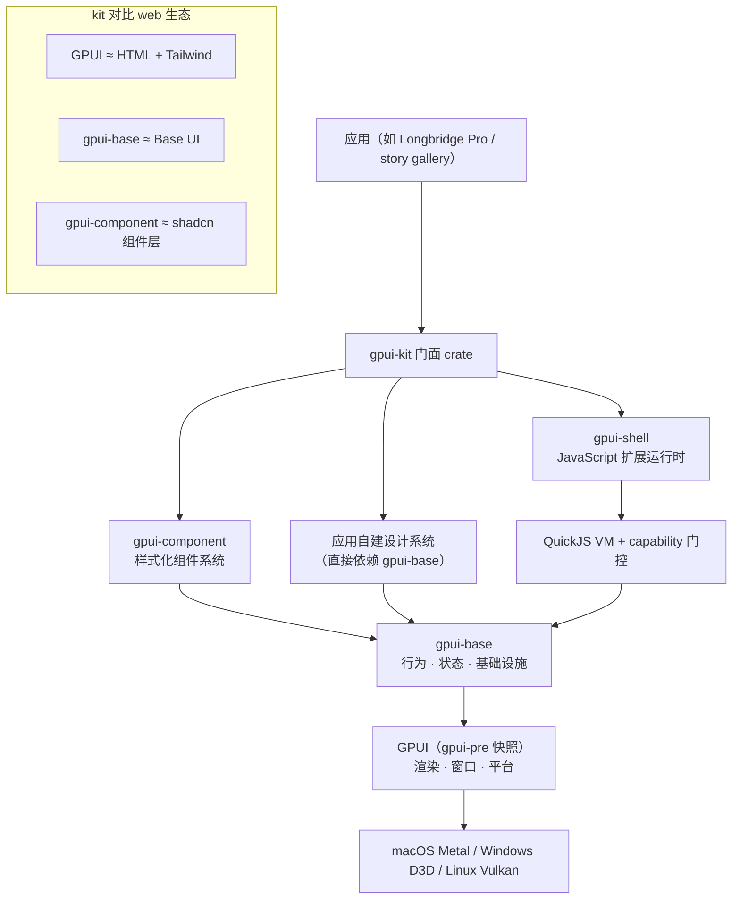
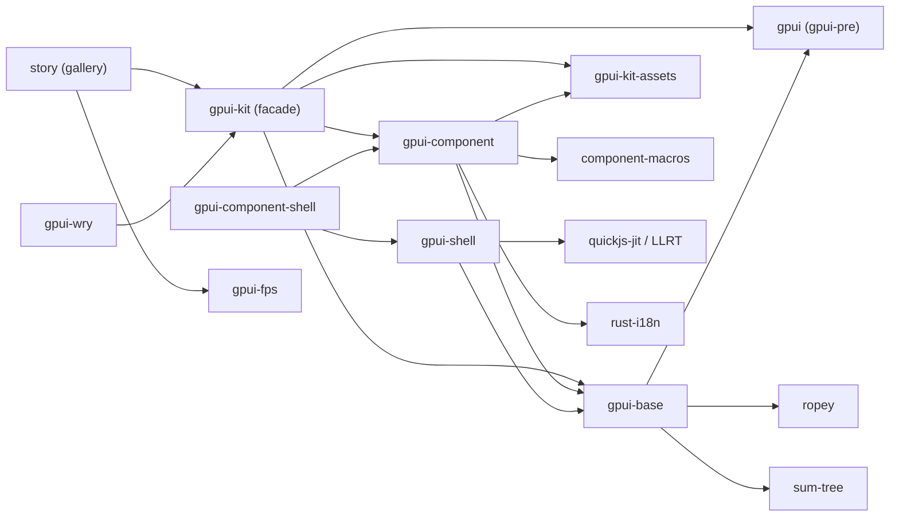
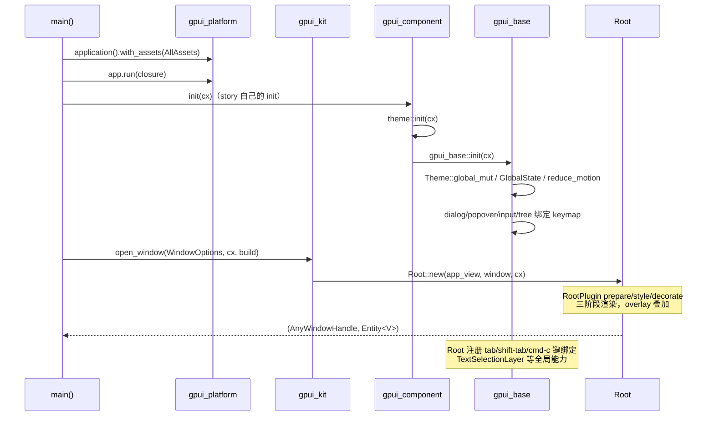
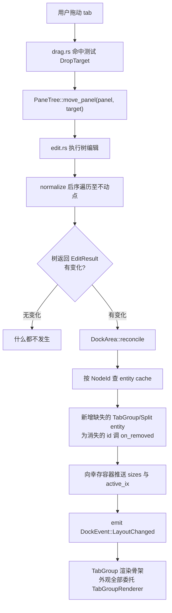

# gpui-kit 源码学习笔记

> 仓库地址：[gpui-kit](https://github.com/longbridge/gpui-kit)
> 学习日期：2026-09-30

---

> **以下为 AI 源码分析**
>
> ### 一句话概括
>
> gpui-kit 是 Longbridge 基于 Zed 的 GPUI 抽取出来的 Rust 桌面应用框架：`gpui-base` 承载无样式的交互行为与基础设施，`gpui-component` 在其上叠加完整视觉系统，`gpui-kit` 把两者与 GPUI 封装成单一依赖，另有 `gpui-shell` 提供 QuickJS 驱动的 JavaScript 扩展运行时。
>
> ### 要点速览
>
> | 模块 | Crate / 路径 | 职责 | 关键文件 |
> |------|-------------|------|---------|
> | 门面 | `crates/kit` | 单一依赖入口，re-export GPUI / base / component / assets | `crates/kit/src/lib.rs` |
> | 行为基础层 | `crates/base` | 75+ 无样式控件的行为、状态、虚拟化、定位、布局代数 | `crates/base/src/lib.rs` |
> | 视觉系统 | `crates/component` | 主题、尺寸、variant、图标、组装好的样式化组件 | `crates/component/src/lib.rs` |
> | 过程宏 | `crates/component-macros` | `icon_named` 宏 | `crates/component-macros/src/` |
> | 图标资产 | `crates/assets` | Lucide SVG 图标集（`gpui-kit-assets`） | `crates/assets/src/` |
> | JS 运行时 | `crates/shell` | QuickJS 脚本运行时 + capability 权限门控 | `crates/shell/src/lib.rs` |
> | Shell 组件目录 | `crates/component-shell` | 面向脚本的样式化组件注册表 | `crates/component-shell/src/` |
> | 组件画廊 | `crates/story` | 桌面 gallery 应用，兼作 UI 集成测试载体 | `crates/story/src/main.rs` |
> | Web 画廊 | `crates/story-web` | wasm32 上的同一套组件 showcase | `crates/story-web/src/` |
> | FPS 监控 | `crates/fps` | 性能 HUD | `crates/fps/src/` |
> | WebView | `crates/webview` | `gpui-wry`，内嵌浏览器视图 | `crates/webview/src/` |
> | 文档站 | `website/` | Astro 文档站点（gpui-kit.com） | `website/` |

---

## 项目简介

gpui-kit 是一个 Rust 桌面应用框架，解决的问题是：GPUI（Zed 的 GPU 加速 UI 框架）只提供渲染、窗口和平台能力，离"能写一个商业桌面应用"还差一整层——组件行为、主题、文本编辑、虚拟列表、dock 布局、无障碍、测试工具。gpui-kit 把这一层补齐，并且刻意拆成行为（`gpui-base`）与表现（`gpui-component`）两层，使应用既可以直接用完整视觉系统，也可以自建设计系统只复用行为。它从 Longbridge Pro（商业证券桌面客户端）第一天开发起就在真实产品中使用并反向打磨，提供 75+ 组件、WebAssembly 支持、AccessKit 无障碍、headless UI 集成测试，以及可通过 `gpui-shell` 在发布后加载 JavaScript 面板的扩展机制。

## 技术栈

| 类别 | 技术 |
|------|------|
| 语言 | Rust（edition 2024） |
| UI 框架 | GPUI，来自 Zed 的 `gpui-pre-*` 周刊快照，workspace 精确 pin `=0.3.7` |
| 脚本引擎 | QuickJS（`quickjs-jit`），LLRT crates pinned 到固定 commit |
| 构建工具 | Cargo workspace + Makefile（web 构建）+ bun（website / CI 脚本） |
| 依赖管理 | crates.io + `[patch.crates-io]`（rquickjs 兼容 facade） |
| 测试框架 | `#[gpui::test]` / `TestAppContext` / `VisualTestContext` + AccessKit 驱动的 UI 测试 |
| 布局 | taffy（GPUI 内部）+ 自研 VirtualList / PaneTree / Positioner |
| 文本编辑 | ropey（rope 数据结构）+ Tree-sitter 语法高亮 + LSP（lsp-types） |
| 国际化 | rust-i18n（`locales/` 目录） |
| 文档站 | Astro（`website/`） |

## 目录结构

```text
gpui-kit/
├── crates/
│   ├── kit/                  门面 crate：open_window / init / re-export，无自有逻辑
│   ├── base/                 行为基础层（约 70 个模块）
│   │   └── src/
│   │       ├── input/        文本编辑引擎（base + input + textarea + editor 四个子目录）
│   │       ├── dock/         dock 布局（layout/ 纯数据树 + dock_area reconcile + 渲染接缝）
│   │       ├── motion/       keyframes / spring / presence / stagger 动画原语
│   │       ├── text/         富文本：markdown / html / inline flow / 选区
│   │       └── *.rs          button / checkbox / dialog / popover / virtual_list 等
│   ├── component/            样式化组件层（约 80 个模块）
│   │   └── src/
│   │       ├── theme/        主题：色板 / token schema / registry / JSON 主题
│   │       ├── button/       Button + ButtonGroup + DropdownButton + Toggle
│   │       ├── input/        styled Input / Textarea / Editor + InputGroup
│   │       ├── dock/         DockSkin：base dock 的生产皮肤
│   │       └── *.rs          table / sidebar / chart / markdown 等
│   ├── component-macros/     #[icon_named] 过程宏
│   ├── assets/               Lucide 图标（编译进二进制的 SVG）
│   ├── shell/                QuickJS 运行时：engine/ capability/ materialize/ policy/
│   ├── component-shell/      面向脚本的组件目录（FrozenComponentRegistry）
│   ├── story/                桌面 gallery（60+ *_story.rs）
│   ├── story-web/            wasm gallery + .cargo 构建配置
│   ├── fps/                  FPS 监控 HUD
│   └── webview/              gpui-wry
├── examples/                 28 个独立示例 crate（hello_world / editor / dock / js_todolist…）
├── docs/                     ARCHITECTURE.md / gpui-shell.md / STYLING-AND-MOTION.md
├── skills/                   给 AI coding agent 的 skill（npx skills add longbridge/gpui-kit）
├── script/                   bootstrap / check-gpui-pin.ts / bump-version.sh
├── themes/                   外置主题 JSON
└── website/                  Astro 文档站（gpui-kit.com）
```

## 架构设计

### 整体架构

核心命题写在 `docs/ARCHITECTURE.md` 里：**"Base owns reusable behavior and the geometry required to implement it. The presentation layer owns the product's visual language."**（行为归基础层，表现归应用层）。整个仓库的分层、命名、seam 设计都是这句话的推论。



三层分工：

1. **`gpui-base`**——"headless"不等于空 `div`。键盘导航、文本编辑、弹层碰撞、虚拟化、日历网格、可调面板、toast 堆叠这些模块内部有结构、测量和保留状态，base 拥有这些复杂度，但不含品牌色、字号、密度、圆角等任何产品决策。类比 web 生态：base ≈ Base UI，GPUI ≈ HTML + Tailwind。
2. **`gpui-component`**——表现适配器。把 Theme 投影到 base token，用 label/icon/size/variant 包装 base 元素，保留历史 API 并把行为委托给 base。
3. **`gpui-shell`**——发布后的扩展性。Rust host 拥有渲染与系统能力，脚本拥有组合、表现和业务逻辑；每项能力（fs / localStorage / clipboard / process / HTTP）都要显式授予。

依赖方向强制向下：`gpui-base` 不得 import `gpui-component` 的主题、资产或 facade 类型；`gpui_component::init` 可以初始化并主题化 base，但 base 单独初始化也必须能工作。

### 核心模块

#### 1. `crates/kit` — 门面

`crates/kit/src/lib.rs` 只有 184 行，做四件事：

- `pub use ::gpui::*` + `#[doc(hidden)] pub use crate as gpui`——应用 `use gpui_kit::*` 即 GPUI，宏输出也能解析；
- re-export `base` / `component` / `assets` / `platform`（feature 门控）；
- `open_window()`（lib.rs:149）——打开窗口时挂载 base 的 `Root`，返回应用 view 而非另一个 Root；
- `init(cx)`（lib.rs:175）——component feature 开启时是 `gpui_component::init`，否则 `gpui_base::init`。

关键决策注释（lib.rs:80-93）写明这是"Public facade decision"：Kit 是应用唯一需要面对的名字，GPUI 内部换 snapshot 不应要求用户改 import。

#### 2. `crates/base` — 行为基础层

`lib.rs` 把 70 个模块分为四族（`docs/ARCHITECTURE.md` 的分类）：

| 模块族 | 代表 | 特征 |
|--------|------|------|
| 语义元素 | `button.rs` / `checkbox.rs` / `switch.rs` | 直接实现 `IntoElement + Styled + ParentElement`，提供稳定 element id、事件规范化、焦点、键盘激活、a11y 语义、受控值 |
| 复合行为根 | `dialog.rs` / `sheet.rs` / `popover.rs` / `combobox.rs` | 协调多个部件：开合请求与原因、焦点转移、Escape/方向键、backdrop 命中测试、focus trap、触发器测量与弹层定位 |
| 有状态系统 | `InputState` / `EditorState` / `DockArea` / `ToastManager` | 行为跨帧或需测量/订阅/历史，状态放 GPUI `Entity` 或 keyed element state |
| 基础设施 | `positioner.rs` / `scrollbar.rs` / `virtual_list.rs` / `motion/` | 深模块：小接口后面藏布局/生命周期/数据结构复杂度 |

`init`（base/src/lib.rs:228）注册全局 Theme、GlobalState、reduce-motion 偏好，并为 dialog / focus trap / popover / sheet / combobox / select / input / tree / text / root 绑定 keymap。

**Button 是四族里最能说明问题的样本**（base/src/button.rs）：`Button::new("save")` 接收的是 `ElementId` 而非 label；它没有默认高度、padding、背景、边框、圆角；但它拥有——焦点（`use_keyed_state` 缓存 FocusHandle，button.rs:132）、Tab 序（`tab_index` / `tab_stop`）、Enter/Space 与指针点击汇合到同一个 `on_click`（GPUI 的 `ClickEvent` 含 Keyboard 变体）、disabled 时的 `stop_propagation`（button.rs:242，阻止父级误激活）、AccessKit role/label/action。语义状态样式通过 `ButtonStyles`（selected/disabled 两个 `StyleRefinement`）注入，优先级由共享的 `state_style::resolve_style` 统一（button.rs:141）。

**文本编辑引擎**（base/src/input/）是仓库里最深的模块：`input/base/state.rs` 单文件 10225 行。组织方式是"一个引擎、三个门面"：

| 形态 | 状态 | 用途 |
|------|------|------|
| `Input` | `InputState` | 单行、占位符、掩码、校验、提交 |
| `Textarea` | `TextareaState` | 多行、固定行数、软换行、自动增高 |
| `Editor` | `EditorState` | 源码、Tree-sitter 高亮、行号、折叠、搜索、诊断、LSP |

`InputBaseState` 拥有三者共享的机制：rope 文本与编辑历史、光标/选区/IME/剪贴板/焦点、shaping/布局/命中测试/绘制、自动滚动与光标可见性。`InputState` 是真正的 facade 而非 alias——多行、折叠、诊断、LSP 配置根本不在它的 API 上。目录用 `#[path]` 组织成实现细节（input/mod.rs:13-75），外部 seam 始终是 `gpui_base::input`。

**Dock 布局**（base/src/dock/）是"树是纯数据"的典范，详见下方流程二。

#### 3. `crates/component` — 样式化组件层

`component/src/button/button.rs`（1978 行）与 base 的 556 行对照着读最有效率：component `Button` 字段里赫然是 `base: gpui_base::Button`（button.rs:192），加上 `variant`（Primary/Danger/Ghost/Link/Text/Custom…）、`size`（XSmall…Large）、`rounded`、`icon`、`label`、`tooltip`、`loading` 这些纯视觉概念。`render`（button.rs:598）做的是翻译工作：

- variant + theme → normal/hovered/active/disabled 四组颜色（`style.normal(self.outline, cx)`）；
- size → `h_8().px_2p5()` 等几何（icon-only 走 `size_8()`）；
- `ButtonRounded::Medium` → `cx.theme().radius`；
- 最后把 `.selected(selected).disabled(disabled)` 转发给 base，并用 `.styles()` 把主题状态色注入 base 的语义样式槽位。

主题系统（component/src/theme/mod.rs）：`ActiveTheme` trait 挂在 `App` 上（`cx.theme()` 全局单例）；`Theme::change` 时投影到 `gpui_base::Theme::global_mut` 的 `SemanticThemeTokens`（base 侧测试直接断言 `gpui_base::Theme::global(cx).tokens.colors.primary == primary`）。token 描述角色和刻度，不含组件名；base 控件不因此自动获得样式。

窗口根：base 的 `Root`（base/src/root.rs）+ `RootPlugin` trait（prepare/style/decorate 三阶段钩子，root.rs:46）。表现层在初始化时注册插件，渲染时插件 overlay 按注册顺序叠在应用内容之上——`open_window` 挂的始终是 base Root，Cargo feature 不改变 Root 类型。

#### 4. `crates/shell` — JavaScript 扩展运行时

`shell/src/lib.rs` 的注释本身就是一份接口契约文档，明确列出"host 可依赖的面"与"crate 私有及原因"。四个支柱：

1. **引擎 seam**：QuickJS 藏在 `engine/` 后面（`engine/quickjs/` 有 sandbox.rs / scheduler.rs / host.rs），LLRT crates pinned 固定 commit，`[patch.crates-io]` 把 `rquickjs` 路由到源兼容 facade `rquickjs-compat`，让 shell 与 LLRT 共享同一 VM 类型；
2. **capability 门控**（lib.rs:186）：`set_capabilities` 之前脚本拿不到任何 fs / storage / clipboard / process 权限；grant 位于引擎 seam 之上，任何引擎都无法绕过；
3. **组件注册表**：`ComponentRegistry` → `FrozenComponentRegistry`，脚本用组件目录渲染 UI；`init_with_components` 调用目录注册的 initializer；
4. **类型声明**：`write_type_declarations_with_components` 生成 `gpui-kit.d.ts`，宿主模块通过 `export_module` 暴露并要求声明与实现对账。

身份与存储：`set_bundle_id`（lib.rs:224）以 bundle id 而非路径为持久化身份——目录被移动/升级后用户数据仍在；同一 id 还作为 dock 面板持久化命名空间（`shell:<id>/<panel>`）。

### 模块依赖关系



workspace 的 `Cargo.toml` 把 12 个内部 crate 全部以 path 依赖声明为 workspace.dependencies，`default-members = ["crates/story"]`——裸 `cargo run` 启动 gallery。

## 核心流程

### 流程一：应用启动与窗口装配

以 `crates/story/src/main.rs` 的真实调用链为例：



关键逻辑逐条说明：

1. `gpui_kit::application()` 实际是 `gpui_platform::application` 的 re-export（kit/src/lib.rs:168），desktop/web 打开对应后端，移动端走 `Application::with_platform`；
2. init 顺序有讲究：`gpui_component::init` 内部调用 `gpui_base::init`（component/src/lib.rs:133），文档明确"调用 component init 的应用不得再二次初始化 base"；
3. `open_window` 的 build 闭包返回应用 view，kit 再 `cx.new(|cx| base::Root::new(view, window, cx))` 包一层——窗口根永远是 base 的 Root，确保 TextSelectionLayer、RootPlugin overlay、全局键绑定对所有应用一致生效；
4. story 的 `create_new_window_with_size`（story/src/lib.rs:122）展示应用层惯例：按主显示器 85% 约束窗口尺寸、居中、设置最小尺寸。

### 流程二：Dock 布局编辑与 reconcile（拖拽面板为例）



这条链路的设计要点：

1. **树是纯数据**：`PaneTree`（dock/layout/tree.rs:46）只存 `NodeId`（容器）与 `PanelId`（面板实体 id），没有任何 GPUI entity handle，因此整个布局代数可以用普通 `#[test]` 跑，不需要 `TestAppContext`；`NodeId` 由进程级全局 `AtomicU64` 分配（tree.rs:28）——因为一个 `DockArea` 有四棵树（center + 三个 dock），per-tree 计数会让两棵树铸出同一个 id 抢同一个 cache 槽；
2. **类型即不变量**：`NodeKind` 只有 `Split` 和 `Tabs` 两种，没有 leaf 变体——"面板只能住在 Tabs 里"这个旧实现要用运行时断言维护的不变量，在类型上直接表达；
3. **normalize 是幂等的**（layout/normalize.rs）：后序单趟重复到不动点，规则五条——空容器摘除、单子 Split 被子节点替换（继承槽位尺寸）、同轴 Split 嵌套拼接、`active_ix` 截断、root 形状约束。没有父指针、没有 deferred pass，编辑返回的瞬间树就自洽；
4. **reconcile 是 diff 不是 rebuild**：`DockArea` 按 `NodeId` 缓存容器 entity，`NodeId` 活过每一次编辑和 normalize，稳态 reconcile 零创建零销毁——这就是"拖动不会重置未触碰面板状态"的机制根源；
5. **渲染接缝**：`TabGroupRenderer` / `DockAreaRenderer` 只见解析后的 `TabGroupContext` / `DockContext`（附带回调），从不见拖拽事件。没有 renderer 的 DockArea 照样 dock、拖拽、持久化，只是不画任何 chrome。`crates/component/src/dock` 的 `DockSkin` 与 `crates/base/examples/showcase/components/dock.rs` 是同一接缝上两个毫不相干的外观。

## 关键设计亮点

### 1. "行为归 base、表现归应用"的 seam 设计

- **解决的问题**：UI 组件库的经典困境——要么带默认样式的组件库无法换肤，要么 headless 库每个控件都要应用层重建一遍键盘导航、焦点陷阱、弹层碰撞这些难写对的行为。
- **实现**：base 实现一次行为（含行为所需的几何），component 是纯翻译层。以 Button 为证：`component/src/button/button.rs:192` 字段 `base: gpui_base::Button`，render 时 variant/size/rounded 全部翻译成 theme 几何后转发（button.rs:643-733）。对照文件行数（556 vs 1978）可见视觉语言确实占大头，而行为一行没复制。
- **为什么这样设计**：Longbridge 的产品迭代证明"应用应拥有组件源码、布局、样式与动效，同时复用难写对的行为"。这也是 shadcn 生态灵活性的根源，仓库在 README 里明确做了这组类比。

### 2. 布局树是值，entity 是投影

- **解决的问题**：dock 容器做成 live view 的三宗罪——空态传播需要父指针的相互递归和 deferred pass（存在树自相矛盾的窗口期）；结构与身份同体，重排即重建 view，拖动会重置未触碰容器状态；离开 `App` 无法测试。
- **实现**：`dock/layout/tree.rs` 的 `PaneTree` 纯数据 + `normalize` 到不动点 + `DockArea` 按 `NodeId` diff reconcile。
- **为什么这样设计**：把"布局代数"（可 compare/clone/serialize 的普通值）与"布局投影"（entity cache）分开后，`normalize(normalize(t)) == normalize(t)` 成立，持久化格式天然 canonical，拖动不重置旁路面板状态。

### 3. 文本编辑的"一个引擎、三个门面"

- **解决的问题**：单行输入、多行文本、代码编辑器共享 90% 机制，但 API 需求差异巨大——给每个控件暴露完整编辑器接口会把使用者淹没。
- **实现**：`input/base/state.rs` 的 `InputBaseState` 拥有 rope、光标、选区、IME、布局、绘制；`InputState` / `TextareaState` / `EditorState` 是三个独立 GPUI entity 门面，各自只暴露本形态的概念（掩码只在 Input、自动增高只在 Textarea、LSP 只在 Editor）。目录用 `#[path]` 保持实现细节（input/mod.rs:13）。
- **为什么这样设计**：`InputState` 是"真 facade 不是 alias"（文档原话）——多行能力不出现在单行 API 上，调用者不会误用；引擎的每个能力增强（粘贴钩子、触摸选区、原生菜单、a11y）自动到达三个门面，无需镜像。

### 4. capability-gated 脚本运行时

- **解决的问题**：已发布的桌面应用如何在不出 fork、不发版的前提下让贡献者扩展产品——而嵌入式 JS 又天然想伸手拿宿主的全部权限。
- **实现**：`shell/src/lib.rs:186` `set_capabilities` 位于引擎 seam 之上，默认零权限；fs/storage/clipboard/process/HTTP 每项单独授予；`export_module` 是宿主唯一扩展面（脚本无法 `dlopen` 原生扩展，lib.rs 注释直言"dlopen 的 Rust 持有进程全部权限，沙箱允许它就毫无意义"）；`set_bundle_id` 让存储与 dock 布局持久化以身份而非路径为键，升级/移动目录不丢数据。
- **为什么这样设计**：安全边界必须高于引擎实现——引擎换成什么都绕不过 grant；宿主模块注册要求 `.declarations()` 与实现对账，启动期就暴露漂移而不是让编辑器持续补全已删除的函数。

### 5. 演进策略：GPUI 快照 + 精确 pin + AI 工作流

- **解决的问题**：依赖 Zed 上游快速移动的 GPUI，又不 fork、不承担维护成本，同时让发布物可复现构建。
- **实现**：`gpui-pre-*` 是上游 crates 的版本对齐快照（不含行为补丁，CI 每周检查上游并发布），workspace 用 `=x.y.z` 精确 pin（Cargo.toml:68 注释解释了为什么 caret 不行：会让周发布把应用推到未编译过的新 snapshot，#3156 事故）；`script/check-gpui-pin.ts` 在 CI 拒绝非精确 pin。另外仓库直接拥抱 AI 协作：CONTRIBUTING.md 明确欢迎 100% AI 生成的 PR（"关键是改动是否周到、聚焦、经过验证"），并为 AI agent 发布 `skills/gpui-kit` 技能包，`docs/` 下还有 ACCESSIBILITY-UI-TESTING.md 规定 a11y 驱动的验收证据格式。
- **为什么这样设计**：这是"寄生在活跃上游但不被上游拖死"的工程答案——快照机制让适配成本显式化（一次 PR 同时改 pin 与适配代码），pin 保证 crates.io 上的发布物永远按被测过的 snapshot 构建。

---

**未深入分析的部分**（受篇幅与聚焦约束）：`plot/` 图表实现、`questionnaire/`、Tree-sitter 高亮与 LSP 协议细节、`text/` 的 inline flow 布局算法、`motion/` 的 spring/keyframes 数值实现、`component-macros` 过程宏、`webview`（wry 集成）、`story-web` 的 wasm 构建链、`website/` Astro 站点。这些模块均为独立子系统，可在 `docs/` 与源码内各自的模块文档找到同等密度的架构说明——这个仓库的模块级 rustdoc/README 密度是它最突出的可读性资产。
