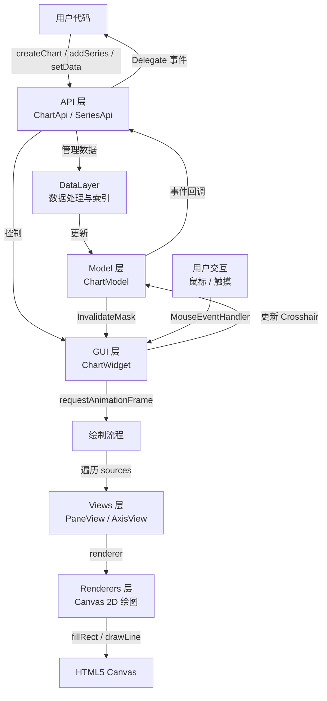
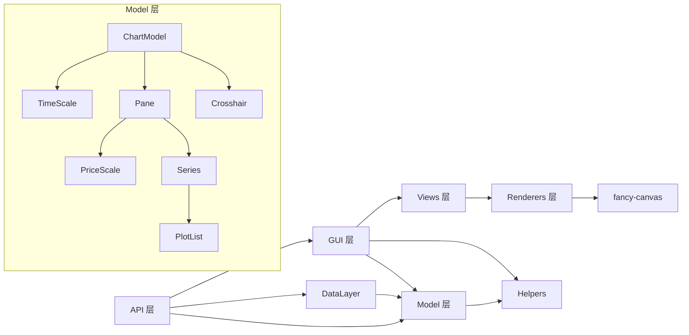
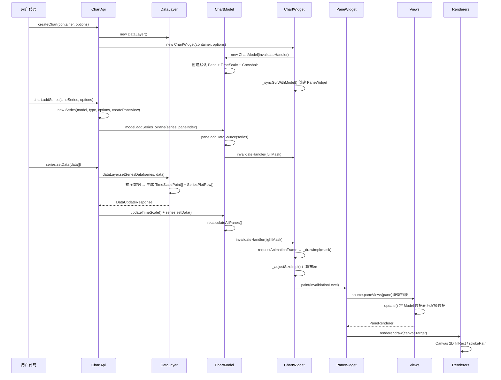
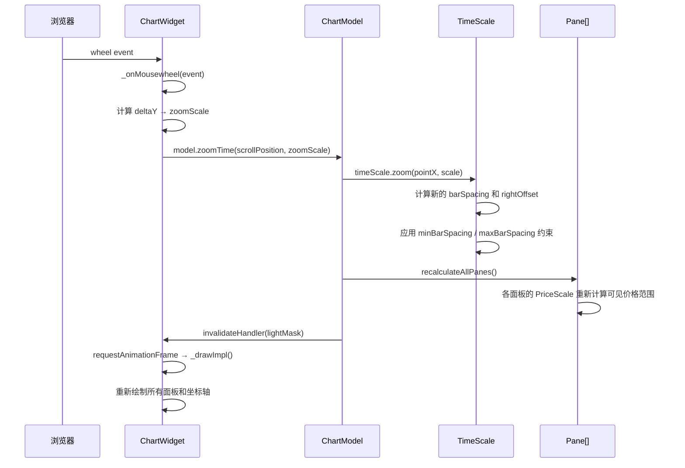

# lightweight-charts 源码学习笔记

> 仓库地址：[lightweight-charts](https://github.com/tradingview/lightweight-charts)
> 学习日期：2026/04/15

---

> **以下为 AI 源码分析**
>
> ### 一句话概括
>
> TradingView 出品的轻量级金融图表库，基于 HTML5 Canvas 实现高性能 K 线图、折线图等金融数据可视化。
>
> ### 要点速览
>
> | 核心模块 | 职责 | 关键文件 |
> |---------|------|---------|
> | API 层 | 对外暴露 chart/series/timeScale 等公共接口 | `src/api/chart-api.ts`, `src/api/series-api.ts` |
> | Model 层 | 数据模型与业务逻辑：图表状态、时间轴、价格轴、数据系列 | `src/model/chart-model.ts`, `src/model/series.ts` |
> | GUI 层 | DOM 管理、Canvas 绑定、用户交互事件处理 | `src/gui/chart-widget.ts`, `src/gui/pane-widget.ts` |
> | Views 层 | 将 Model 数据转换为可渲染的视图对象 | `src/views/pane/`, `src/views/price-axis/` |
> | Renderers 层 | Canvas 2D 绘图逻辑，逐像素绘制 K 线、折线等图形 | `src/renderers/candlesticks-renderer.ts` |
> | Plugins 层 | 可扩展的插件机制：水印、标记、自定义系列 | `src/plugins/text-watermark/`, `src/plugins/series-markers/` |

---

## 项目简介

Lightweight Charts 是 TradingView 推出的开源轻量级金融图表库。它专为在网页中高效展示金融数据（K 线、折线、面积图、柱状图等）而设计，核心优势在于极小的包体积（约 47KB gzipped）和高渲染性能。该库完全基于 HTML5 Canvas 进行渲染，无需额外依赖重量级图表框架，适合替换静态图表图片或在需要大量图表的场景中使用。它还提供了插件系统，允许开发者扩展自定义系列类型和绘图原语。

## 技术栈

| 类别 | 技术 |
|------|------|
| 语言 | TypeScript 5.5 |
| 框架 | 无框架依赖，纯 Canvas 2D 渲染 |
| 构建工具 | Rollup + ts-patch（TypeScript 自定义 Transformer） |
| 依赖管理 | npm（唯一运行时依赖：`fancy-canvas`） |
| 测试框架 | Node.js 内置 test runner + Chai + Puppeteer（e2e 截图对比） |

## 目录结构

```
src/
├── api/                    # 公共 API 层：createChart、SeriesApi、TimeScaleApi 等
│   ├── chart-api.ts        #   ChartApi 类：面向用户的图表控制接口
│   ├── series-api.ts       #   SeriesApi 类：数据系列操作接口
│   ├── create-chart.ts     #   createChart/createChartEx 入口工厂函数
│   └── options/            #   默认选项配置
├── model/                  # 核心数据模型层
│   ├── chart-model.ts      #   ChartModel：图表全局状态管理
│   ├── series.ts           #   Series：数据系列模型
│   ├── series/             #   各类型系列定义（Line、Candlestick、Area 等）
│   ├── time-scale.ts       #   TimeScale：水平时间轴模型
│   ├── price-scale.ts      #   PriceScale：垂直价格轴模型
│   ├── pane.ts             #   Pane：图表面板（支持多面板）
│   ├── crosshair.ts        #   Crosshair：十字光标模型
│   ├── data-layer.ts       #   DataLayer：数据处理与时间点索引管理
│   └── ihorz-scale-behavior.ts  # 水平轴行为抽象接口
├── gui/                    # GUI 层：DOM 与 Canvas 管理
│   ├── chart-widget.ts     #   ChartWidget：图表根 Widget，布局编排
│   ├── pane-widget.ts      #   PaneWidget：面板 Widget，Canvas 绑定与事件
│   ├── price-axis-widget.ts#   价格轴 Widget
│   ├── time-axis-widget.ts #   时间轴 Widget
│   └── mouse-event-handler.ts  # 鼠标/触摸事件标准化处理
├── views/                  # 视图层：Model → Renderer 的桥梁
│   ├── pane/               #   面板视图（十字光标、网格、系列价格线等）
│   ├── price-axis/         #   价格轴视图
│   └── time-axis/          #   时间轴视图
├── renderers/              # 渲染层：Canvas 2D 绘图实现
│   ├── candlesticks-renderer.ts  # K 线渲染器
│   ├── line-renderer.ts    #   折线渲染器
│   ├── area-renderer.ts    #   面积图渲染器
│   ├── histogram-renderer.ts    # 柱状图渲染器
│   └── crosshair-renderer.ts   # 十字光标渲染器
├── plugins/                # 插件系统
│   ├── text-watermark/     #   文字水印插件
│   ├── image-watermark/    #   图片水印插件
│   ├── series-markers/     #   系列标记插件
│   └── up-down-markers-plugin/  # 涨跌标记插件
├── formatters/             # 数据格式化（价格、日期、百分比等）
├── helpers/                # 工具函数（断言、事件委托、类型检查等）
├── index.ts                # ESM 导出入口
└── standalone.ts           # IIFE 独立版入口（挂载到 window.LightweightCharts）
```

## 架构设计

### 整体架构

Lightweight Charts 采用经典的 **MVC 变体架构**，各层职责清晰分离：

- **API 层**（Controller）负责接收用户调用，协调 Model 和 GUI 层
- **Model 层** 维护图表的全部状态（数据系列、坐标系、十字光标等）
- **GUI 层** 管理 DOM 结构和 Canvas 元素，处理用户交互事件
- **Views 层** 作为 Model 到 Renderer 的适配层，将模型数据转换为可渲染的数据结构
- **Renderers 层** 执行实际的 Canvas 2D 绘图操作

核心设计特点是采用 **InvalidateMask 驱动的异步批量渲染**：Model 变更不会立即触发绘制，而是通过 InvalidateMask 标记脏区域，在下一个 `requestAnimationFrame` 中统一执行绘制，极大地提升了性能。



### 核心模块

#### 1. ChartApi（API 层入口）

- **职责**：面向用户的图表接口，管理系列的增删改、事件订阅、选项配置
- **核心文件**：`src/api/chart-api.ts`
- **关键类**：`ChartApi<HorzScaleItem>`
- **核心方法**：
  - `addSeries(definition, options, paneIndex)` — 添加数据系列
  - `removeSeries(seriesApi)` — 移除数据系列
  - `applyNewData() / updateData()` — 通过 DataLayer 更新数据
  - `subscribeClick() / subscribeCrosshairMove()` — 事件订阅
  - `_sendUpdateToChart(update)` — 将 DataLayer 处理结果发送到 Model 层
- **关系**：持有 `ChartWidget`（GUI 层）和 `DataLayer`（数据处理），是两者的协调者

#### 2. ChartModel（全局状态管理）

- **职责**：管理图表的全部状态，包括面板、数据系列列表、时间轴、十字光标、缩放/滚动
- **核心文件**：`src/model/chart-model.ts`
- **关键类**：`ChartModel<HorzScaleItem>`
- **核心方法**：
  - `fullUpdate() / lightUpdate()` — 触发不同级别的重绘
  - `addSeriesToPane() / removeSeries()` — 管理系列与面板的关系
  - `zoomTime() / scrollChart()` — 时间轴缩放和滚动
  - `setAndSaveCurrentPosition()` — 十字光标定位（含 Magnet 吸附逻辑）
  - `recalculateAllPanes()` — 全量重算所有面板
- **关系**：被 ChartWidget 持有，通过 `_invalidateHandler` 回调通知 GUI 层需要重绘

#### 3. ChartWidget（GUI 根组件）

- **职责**：管理 DOM 布局（table 结构），创建和编排 PaneWidget / TimeAxisWidget，执行绘制调度
- **核心文件**：`src/gui/chart-widget.ts`
- **关键类**：`ChartWidget<HorzScaleItem>`
- **核心机制**：
  - `_invalidateHandler(mask)` — 接收 Model 层的 InvalidateMask，合并脏标记
  - `_drawImpl(mask, time)` — 在 `requestAnimationFrame` 中执行实际绘制
  - `_syncGuiWithModel()` — 同步面板数量、布局尺寸
  - `_adjustSizeImpl()` — 计算价格轴宽度、面板高度分配
  - `resize() / takeScreenshot()` — 尺寸调整和截图功能
- **关系**：持有 `ChartModel`、`PaneWidget[]`、`TimeAxisWidget`

#### 4. Series（数据系列模型）

- **职责**：管理单个数据系列的绘图数据、格式化器、样式选项
- **核心文件**：`src/model/series.ts`, `src/model/series/`
- **关键类**：`Series<T extends SeriesType>` 继承自 `PriceDataSource`
- **系列类型定义**：通过 `SeriesDefinition<T>` 接口实现开放封闭原则
  - 每种类型（Line、Candlestick、Area、Bar、Histogram、Custom）独立定义在 `src/model/series/` 下
  - 每个定义包含 `type`、`defaultOptions`、`createPaneView` 工厂方法
- **关系**：被 Pane 持有，通过 `SeriesBarColorer` 处理颜色逻辑

#### 5. TimeScale / PriceScale（坐标系）

- **职责**：
  - `TimeScale` — 水平时间轴：坐标↔索引转换、barSpacing 管理、缩放/滚动
  - `PriceScale` — 垂直价格轴：坐标↔价格转换、支持 Normal/Log/Percentage/IndexedTo100 四种模式
- **核心文件**：`src/model/time-scale.ts`, `src/model/price-scale.ts`
- **关系**：TimeScale 全局唯一，PriceScale 每个面板可有左/右/多个 overlay

#### 6. DataLayer（数据处理层）

- **职责**：接收用户原始数据，排序合并时间点，生成统一的 `TimeScalePoint` 和 `SeriesPlotRow`
- **核心文件**：`src/model/data-layer.ts`
- **核心输出**：`DataUpdateResponse`（包含 timeScale 变更和各 series 的数据变更）
- **关系**：被 ChartApi 持有，处理后的数据通过 `_sendUpdateToChart` 写入 Model

#### 7. Pane（图表面板）

- **职责**：管理面板内的数据源（Series）、左右 PriceScale、overlay 价格轴、网格
- **核心文件**：`src/model/pane.ts`
- **关系**：被 ChartModel 持有，支持多面板（multi-pane）布局

### 模块依赖关系



## 核心流程

### 流程一：创建图表并渲染数据

从 `createChart()` → `addSeries()` → `setData()` 的完整链路，展示数据如何从用户输入最终渲染到 Canvas。



**关键细节说明**：
1. `DataLayer.setSeriesData()` 负责将用户传入的时间序列数据与全局时间点列表合并，确保多个系列共享统一的时间索引
2. `ChartModel.recalculateAllPanes()` 触发每个 Pane 对其 PriceScale 进行自动缩放（autoScale），计算可见范围内的价格区间
3. `ChartWidget._invalidateHandler()` 将多次 Model 变更合并为一个 `InvalidateMask`，在同一个 `requestAnimationFrame` 中统一处理
4. 绘制流程分两步：先 `drawBackground`（网格背景等），再 `drawForeground`（系列数据、十字光标等）

### 流程二：用户交互 — 鼠标滚轮缩放时间轴

展示用户通过鼠标滚轮缩放图表时的完整事件处理链路。



**关键细节说明**：
1. `_onMousewheel` 处理了跨平台差异：Chromium on Windows 有 HiDPI 滚动速度 bug，通过 `_determineWheelSpeedAdjustment()` 修正
2. 缩放以鼠标位置为中心点（`pointX`），而非固定在左右边缘，提供自然的缩放体验
3. `TimeScale.zoom()` 同时调整 `barSpacing`（柱间距）和 `rightOffset`（右侧偏移），保持鼠标位置不变

## 关键设计亮点

### 1. InvalidateMask 批量渲染机制

- **解决的问题**：多次连续的数据更新或选项变更会导致冗余的重绘操作
- **实现方式**：`src/model/invalidate-mask.ts` 定义了三级失效级别（`None` / `Light` / `Full`），每次 Model 变更只标记脏区域（哪些 Pane、是否需要 autoScale、时间轴操作类型等），ChartWidget 在 `requestAnimationFrame` 回调中合并所有标记后一次性执行绘制
- **为什么这样设计**：金融图表交互频繁（滚轮缩放、十字光标移动），如果每次变更都立即重绘会导致严重的性能问题。通过 batch + rAF 实现了流畅的 60fps 渲染

### 2. 泛型水平轴行为抽象（IHorzScaleBehavior）

- **解决的问题**：默认的 X 轴是时间轴，但某些场景（如 yield curve 收益率曲线）的 X 轴是价格而非时间
- **实现方式**：`src/model/ihorz-scale-behavior.ts` 定义了 `IHorzScaleBehavior<HorzScaleItem>` 接口，将时间轴的所有行为（数据预处理、格式化、权重计算等）抽象化。`createChart()` 使用时间行为，`createYieldCurveChart()` 使用价格行为
- **为什么这样设计**：通过策略模式使整个图表库的水平轴可替换，无需修改核心代码即可支持全新的 X 轴类型。入口函数 `createChartEx()` 接受任意 `IHorzScaleBehavior` 实现

### 3. SeriesDefinition 插件化系列类型

- **解决的问题**：内置系列类型（Line、Candlestick 等）和自定义系列需要统一的扩展机制
- **实现方式**：`src/model/series/series-def.ts` 定义了 `SeriesDefinition<T>` 接口，每种系列类型只需提供 `type`、`defaultOptions` 和 `createPaneView` 工厂方法。用户可通过 `addCustomSeries(customPaneView)` 注入自定义的 `ICustomSeriesPaneView`，由库内部自动包装为 `SeriesDefinition`
- **为什么这样设计**：遵循开放封闭原则，新增系列类型无需修改现有代码，只需实现接口即可。内置的 6 种系列和用户自定义系列走完全相同的代码路径

### 4. Delegate 事件系统

- **解决的问题**：需要一个轻量的发布-订阅机制在各层之间传递事件（十字光标移动、点击、选项变更等）
- **实现方式**：`src/helpers/delegate.ts` 实现了一个仅 46 行的事件委托类，支持 `subscribe` / `unsubscribe` / `unsubscribeAll`（按关联对象批量取消）/ `fire`（快照触发，防止迭代中修改），还支持 `singleshot` 一次性订阅
- **为什么这样设计**：金融图表不需要 DOM 事件冒泡或复杂的事件总线，一个精简的观察者模式足矣。`unsubscribeAll(linkedObject)` 的设计简化了组件销毁时的清理逻辑

### 5. 像素级渲染精度控制

- **解决的问题**：在不同 DPI 屏幕上，K 线的 wick（影线）、border（边框）、body（实体）需要对齐到物理像素，否则会出现模糊或不对称
- **实现方式**：`src/renderers/candlesticks-renderer.ts` 中，`_drawImpl()` 根据 `horizontalPixelRatio` 计算最优 barWidth，确保 wick 宽度和 bar 宽度的奇偶性一致（使十字光标与 K 线对称）。所有坐标在绘制前通过 `Math.round(value * pixelRatio)` 对齐到物理像素
- **为什么这样设计**：金融图表用户对视觉精度极为敏感，亚像素模糊或不对称的 K 线会被视为渲染 bug。`fancy-canvas` 库提供的 `BitmapCoordinatesRenderingScope` 统一处理了逻辑坐标到物理像素的转换
