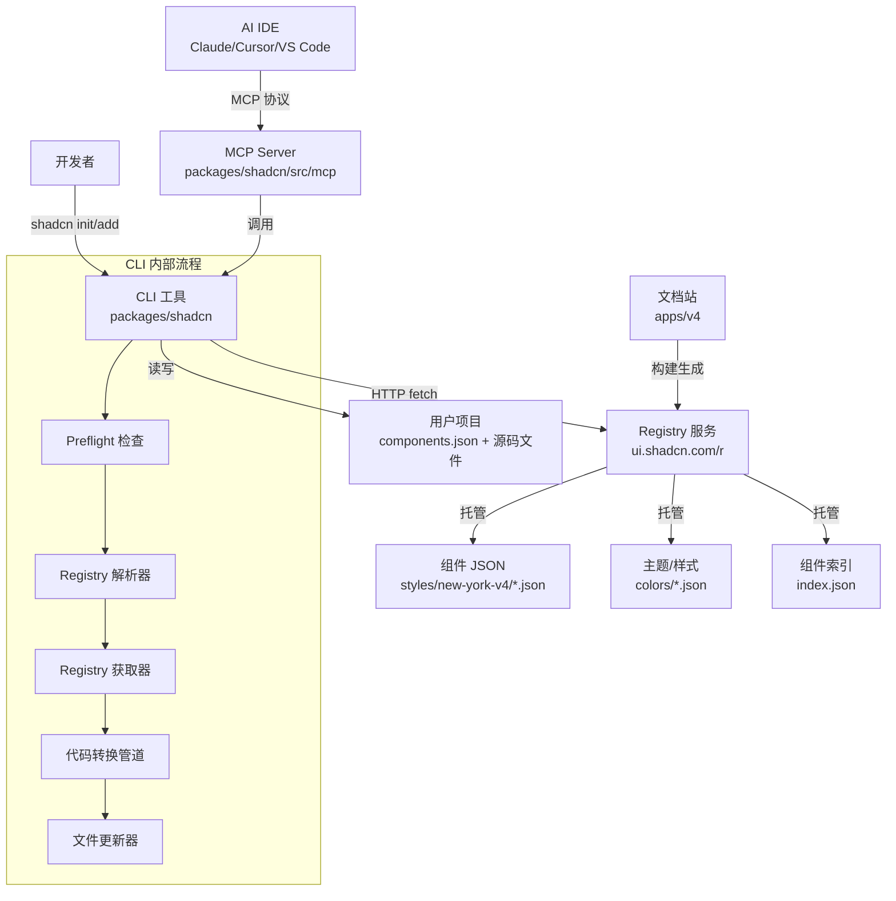
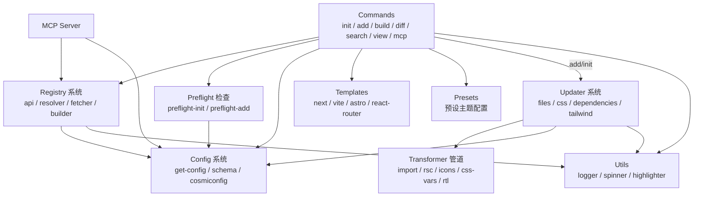
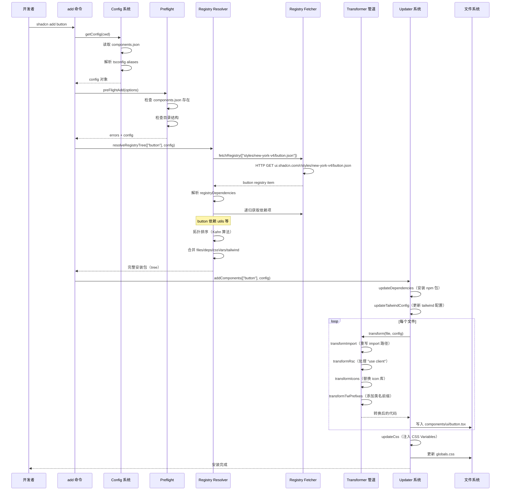
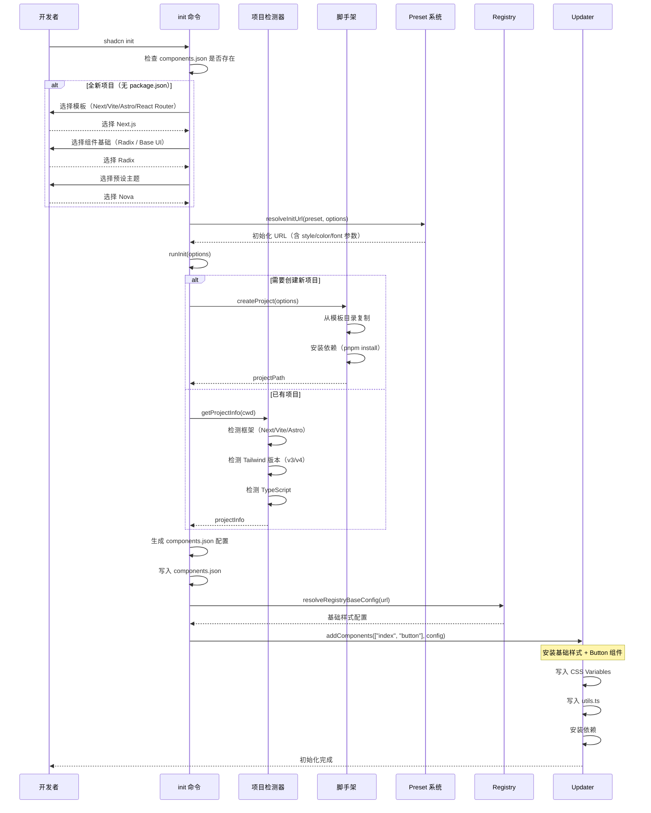

# shadcn/ui 源码学习笔记

> 仓库地址：[shadcn-ui/ui](https://github.com/shadcn-ui/ui)
> 学习日期：2026-04-05

---

> **以下为 AI 源码分析**
>
> ### 一句话概括
>
> shadcn/ui 是一个基于 Radix UI / Base UI 和 Tailwind CSS 的开源组件集合，通过 CLI 工具将组件源码直接复制到用户项目中，实现"拥有代码"而非依赖 npm 包的全新组件分发模式。
>
> ### 要点速览
>
> | 核心模块 | 职责 | 关键文件 |
> |---------|------|---------|
> | CLI 入口 | commander 命令路由 | `packages/shadcn/src/index.ts` |
> | init 命令 | 项目初始化、生成 components.json | `packages/shadcn/src/commands/init.ts` |
> | add 命令 | 从 registry 添加组件到项目 | `packages/shadcn/src/commands/add.ts` |
> | Registry 系统 | 组件索引、解析、获取、依赖树 | `packages/shadcn/src/registry/` |
> | Transformer 管道 | AST 级别代码转换（import/RSC/icon/RTL） | `packages/shadcn/src/utils/transformers/` |
> | Updater 系统 | 写入文件、CSS、依赖、tailwind 配置 | `packages/shadcn/src/utils/updaters/` |
> | MCP Server | AI IDE 集成（Claude/Cursor/VS Code） | `packages/shadcn/src/mcp/` |
> | v4 文档站 | Next.js 文档网站 + registry 构建 | `apps/v4/` |

---

## 项目简介

shadcn/ui 重新定义了前端组件库的分发方式。传统组件库通过 npm 包分发，用户对样式和行为的定制受限于库暴露的 API。shadcn/ui 采用了截然不同的策略：通过 CLI 工具将组件源码直接复制到用户项目中。用户完全拥有代码，可以自由修改、扩展、组合，不存在版本锁定问题。

项目的核心由两部分组成：一个功能强大的 CLI 工具（`shadcn`），负责项目初始化、组件安装、代码转换等；一个 Registry 系统，作为组件的集中式索引和分发中心。组件基于 Radix UI（或 Base UI）提供无障碍的交互基础，使用 Tailwind CSS 实现样式，支持 CSS Variables 主题系统，并提供多种预设风格（preset）。

## 技术栈

| 类别 | 技术 |
|------|------|
| 语言 | TypeScript |
| 框架 | Next.js (文档站), commander (CLI) |
| 构建工具 | tsup (CLI), Turborepo (monorepo 编排) |
| 依赖管理 | pnpm (workspace) |
| 测试框架 | vitest |
| 样式方案 | Tailwind CSS v3/v4, CSS Variables |
| UI 基础 | Radix UI, Base UI |
| 代码分析 | ts-morph (AST 操作) |
| Schema 验证 | zod |
| AI 集成 | MCP (Model Context Protocol) |

## 目录结构

```
shadcn-ui/ui
├── apps/
│   └── v4/                          # Next.js 文档网站 + Registry 构建
│       ├── app/                     # Next.js App Router 页面
│       ├── components/              # 文档站专用组件
│       ├── content/docs/            # MDX 文档内容
│       ├── registry.json            # 组件 registry 定义
│       ├── styles/                  # 预设主题样式（nova/maia/lyra 等）
│       └── public/r/                # 构建后的 registry JSON 文件
├── packages/
│   ├── shadcn/                      # ★ 核心 CLI 工具
│   │   └── src/
│   │       ├── index.ts             # CLI 入口，注册所有命令
│   │       ├── commands/            # CLI 子命令实现
│   │       ├── registry/            # Registry 解析、获取、搜索系统
│   │       ├── utils/               # 工具函数集合
│   │       │   ├── transformers/    # AST 代码转换管道
│   │       │   └── updaters/        # 文件/CSS/依赖更新器
│   │       ├── preflights/          # 命令前置检查
│   │       ├── preset/              # 预设配置系统
│   │       ├── templates/           # 项目模板定义
│   │       ├── mcp/                 # MCP Server 实现
│   │       └── schema/              # Zod Schema 定义
│   └── tests/                       # 端到端测试
├── templates/                       # 项目脚手架模板
│   ├── next-app/                    # Next.js 单体模板
│   ├── vite-app/                    # Vite + React 模板
│   ├── react-router-app/            # React Router 模板
│   ├── astro-app/                   # Astro 模板
│   ├── start-app/                   # TanStack Start 模板
│   └── *-monorepo/                  # 各框架的 monorepo 变体
├── turbo.json                       # Turborepo 管道配置
└── package.json                     # 根 package.json (pnpm workspace)
```

## 架构设计

### 整体架构

shadcn/ui 采用 monorepo 架构，核心分为两个独立的子系统：**CLI 工具链** 和 **文档/Registry 站点**。CLI 负责面向开发者的交互，Registry 站点负责组件内容的托管和分发。两者通过 HTTP API（Registry URL）连接。



CLI 工具的设计遵循"管道"模式：**解析 -> 获取 -> 转换 -> 写入**。每个阶段职责单一，通过 Zod schema 严格验证数据在各阶段间的传递。

### 核心模块

#### 1. Commands 命令模块

**职责**：定义 CLI 的所有子命令，处理参数解析和用户交互。

**核心文件**：
- `commands/init.ts` — 项目初始化，生成 `components.json` 配置
- `commands/add.ts` — 添加组件到项目
- `commands/build.ts` — 为自定义 registry 构建组件 JSON
- `commands/mcp.ts` — 启动 MCP Server / 配置 AI IDE 集成
- `commands/diff.ts` — 对比本地组件与 registry 最新版本
- `commands/search.ts` — 搜索 registry 中的组件
- `commands/view.ts` — 查看 registry item 详情

**关键函数**：
- `runInit()` — init 命令的核心逻辑，处理模板选择、preflight 检查、配置写入、组件安装
- `add.action()` — add 命令入口，支持 dry-run、diff、批量添加

**设计要点**：每个命令通过 Zod schema（如 `initOptionsSchema`）验证参数，使用 `prompts` 库实现交互式 UI，通过 `preflight` 机制在执行前检查项目状态。

#### 2. Registry 系统

**职责**：组件的索引、解析、获取和依赖树解析。这是 CLI 的核心引擎。

**核心文件**：
- `registry/api.ts` — 高层 API：获取 registry 索引、样式列表、组件详情
- `registry/resolver.ts` — 依赖树解析，递归获取所有 registryDependencies
- `registry/fetcher.ts` — HTTP 获取器，带缓存和代理支持
- `registry/builder.ts` — URL 和 Headers 构建，处理命名空间（`@shadcn/button`）
- `registry/schema.ts` — 所有 registry 相关的 Zod Schema 定义
- `registry/search.ts` — 模糊搜索功能
- `registry/constants.ts` — 常量定义：Registry URL、内置 registry、基色列表

**关键接口**：
- `resolveRegistryTree(names, config)` — 核心函数，解析完整依赖树，返回合并后的安装包（文件、依赖、CSS 变量、tailwind 配置）
- `fetchRegistryItems(items, config)` — 获取一组 registry item
- `fetchRegistry(paths)` — 底层 HTTP 获取，带 Promise 级缓存

**Registry Item Schema** 支持多种类型：
- `registry:ui` — UI 组件（Button、Card 等）
- `registry:hook` — React Hook
- `registry:lib` — 工具库
- `registry:theme` — 主题（CSS 变量集合）
- `registry:style` — 完整样式包
- `registry:base` — 基础配置（Radix/Base UI 选择）
- `registry:font` — 字体配置
- `registry:block` — 完整页面区块

#### 3. Transformer 管道

**职责**：在组件源码写入用户项目前，进行 AST 级别的代码转换，适配用户的项目配置。

**核心文件**：
- `utils/transformers/index.ts` — 管道编排，定义 `transform()` 函数
- `transform-import.ts` — 重写 import 路径，适配用户的 aliases 配置
- `transform-rsc.ts` — 添加/移除 `"use client"` 指令
- `transform-icons.ts` — 替换 icon 库（Lucide / Radix Icons）
- `transform-css-vars.ts` — CSS 变量转换
- `transform-tw-prefix.ts` — Tailwind 类名前缀处理
- `transform-rtl.ts` — RTL（从右到左）布局转换
- `transform-jsx.ts` — TypeScript -> JavaScript 转换
- `transform-cleanup.ts` — 清理多余代码

**关键设计**：使用 `ts-morph`（TypeScript Compiler API 封装）操作 AST，确保代码转换的安全性和准确性。管道模式允许转换器自由组合。

#### 4. Updater 系统

**职责**：将解析后的组件数据写入用户项目的各个位置。

**核心文件**：
- `utils/add-components.ts` — 顶层编排：调用各 updater
- `updaters/update-files.ts` — 写入组件文件到目标目录
- `updaters/update-css.ts` — 更新全局 CSS（注入 CSS Variables）
- `updaters/update-dependencies.ts` — 安装 npm 依赖
- `updaters/update-tailwind-config.ts` — 更新 tailwind.config.js
- `updaters/update-fonts.ts` — 配置字体（next/font 或 fontsource）
- `updaters/update-env-vars.ts` — 写入环境变量

**关键函数**：
- `addComponents(components, config, options)` — 核心入口，自动检测 workspace 模式
- `addWorkspaceComponents()` — monorepo 下的组件安装，将 UI 文件和依赖分发到不同 workspace

#### 5. MCP Server

**职责**：为 AI IDE（Claude Code、Cursor、VS Code）提供 MCP 协议接口，让 AI 助手能够浏览、搜索、安装组件。

**核心文件**：
- `mcp/index.ts` — MCP Server 定义，注册 7 个工具
- `mcp/utils.ts` — 格式化输出、配置读取

**MCP 工具列表**：
- `get_project_registries` — 获取项目配置的 registry 列表
- `list_items_in_registries` — 列出 registry 中的所有组件
- `search_items_in_registries` — 模糊搜索组件
- `view_items_in_registries` — 查看组件详情和源码
- `get_item_examples_from_registries` — 获取使用示例代码
- `get_add_command_for_items` — 生成安装命令
- `get_audit_checklist` — 组件审计清单

### 模块依赖关系



## 核心流程

### 流程一：shadcn add button（添加组件）

这是用户最常用的操作——从 registry 安装一个组件到本地项目。



**关键逻辑**：
1. **Config 解析**：通过 `cosmiconfig` 读取 `components.json`，结合 `tsconfig.json` 的 paths 解析 alias 到绝对路径
2. **依赖树解析**：`resolveRegistryTree` 递归获取所有 `registryDependencies`，使用 Kahn 算法进行拓扑排序，确保依赖先于被依赖者安装
3. **代码转换**：通过 `ts-morph` AST 操作，将 registry 中的通用代码转换为适配用户项目配置的代码
4. **文件写入**：CSS 最后写入，确保 tailwind 的 file watcher 在所有文件就绪后才触发重建

### 流程二：shadcn init（项目初始化）

初始化是使用 shadcn/ui 的第一步，处理复杂的项目检测和配置生成。



**关键逻辑**：
1. **项目检测**：`getProjectInfo` 通过检查 `next.config.*`、`vite.config.*`、`astro.config.*` 等文件识别框架，检查 `tailwindcss` 版本判断 v3/v4
2. **Monorepo 支持**：检测到 monorepo 根目录时，引导用户到具体 workspace 中执行
3. **Preset 系统**：预设包含 style（样式风格）、baseColor（基色）、font（字体）、iconLibrary（图标库）等完整配置
4. **components.json 备份**：在重新初始化时创建备份，出错时自动恢复

## 关键设计亮点

### 1. "拥有代码"的分发模式

**解决了什么问题**：传统 npm 组件库限制了用户对组件的定制能力，升级时可能引入 breaking changes。

**具体实现**：CLI 将组件源码直接复制到用户项目的 `components/ui/` 目录中（`utils/updaters/update-files.ts`）。组件不以 npm 包形式分发，用户可以自由修改任何组件代码。Registry 仅作为组件的"来源"，而非运行时依赖。

**为什么这样设计**：开发者对 UI 组件的定制需求极高（间距、动画、变体、交互细节），复制代码比暴露配置 API 更直接。通过 `diff` 命令，用户仍可与上游保持同步。

### 2. AST 级别的代码转换管道

**解决了什么问题**：Registry 中的组件是"通用"写法，需要适配不同用户项目的 import alias、RSC 设置、icon 库、Tailwind 前缀等。

**具体实现**：`utils/transformers/index.ts` 定义了转换管道，使用 `ts-morph`（TypeScript Compiler API）对源码进行 AST 操作。每个转换器是一个纯函数 `(opts) => Promise<SourceFile>`，管道按序执行：import 重写 -> RSC 处理 -> CSS 变量 -> Tailwind 前缀 -> RTL -> Icon 替换 -> 清理。

**为什么这样设计**：字符串替换容易出错，AST 操作确保了类型安全的代码转换。管道模式使转换器可以独立测试和组合。

### 3. Registry 命名空间与第三方 Registry 生态

**解决了什么问题**：不仅 shadcn 官方可以发布组件，任何人都可以创建自己的组件 registry 并分享。

**具体实现**：`registry/schema.ts` 定义了 `registryConfigSchema`，支持 `@namespace` 前缀。`components.json` 的 `registries` 字段可以配置多个 registry 源（如 `@acme: "https://acme.com/r/{name}.json"`）。`registry/builder.ts` 负责将 `@acme/button` 解析为完整 URL，支持自定义 headers（用于认证）。`build` 命令让用户可以构建自己的 registry。

**为什么这样设计**：开放的 registry 生态让组件复用不局限于官方库，企业可以建立私有 registry 分享内部组件。

### 4. 依赖树拓扑排序

**解决了什么问题**：组件之间存在复杂的依赖关系（如 Dialog 依赖 Button，Form 依赖多个底层组件），安装顺序必须正确。

**具体实现**：`registry/resolver.ts` 的 `resolveRegistryTree` 递归解析所有 `registryDependencies`，使用 **Kahn 算法** 进行拓扑排序（`topologicalSortRegistryItems`）。通过 SHA-256 hash 为每个 item 计算唯一标识，支持同名 item 来自不同 registry。处理循环依赖时会优雅降级。

**为什么这样设计**：拓扑排序确保依赖项先于依赖者处理，避免文件引用缺失。Hash 标识解决了多 registry 下的命名冲突。

### 5. MCP 协议集成 AI IDE

**解决了什么问题**：让 AI 编程助手（Claude Code、Cursor、Copilot）能够直接浏览和安装 shadcn/ui 组件，无需开发者手动操作。

**具体实现**：`mcp/index.ts` 实现了 MCP Server，提供 7 个工具（搜索、查看、安装等）。`commands/mcp.ts` 提供 `mcp init` 子命令，可以一键配置 Claude Code (`.mcp.json`)、Cursor (`.cursor/mcp.json`)、VS Code (`.vscode/mcp.json`)、Codex (`.codex/config.toml`) 等客户端。Server 通过 stdio 传输，AI IDE 作为 MCP client 调用。

**为什么这样设计**：MCP 是 Anthropic 主导的开放协议，为 AI 助手提供了结构化的工具调用能力。将组件库能力暴露为 MCP 工具，让 AI 助手成为组件安装的"代理人"，大幅简化了 UI 开发工作流。
