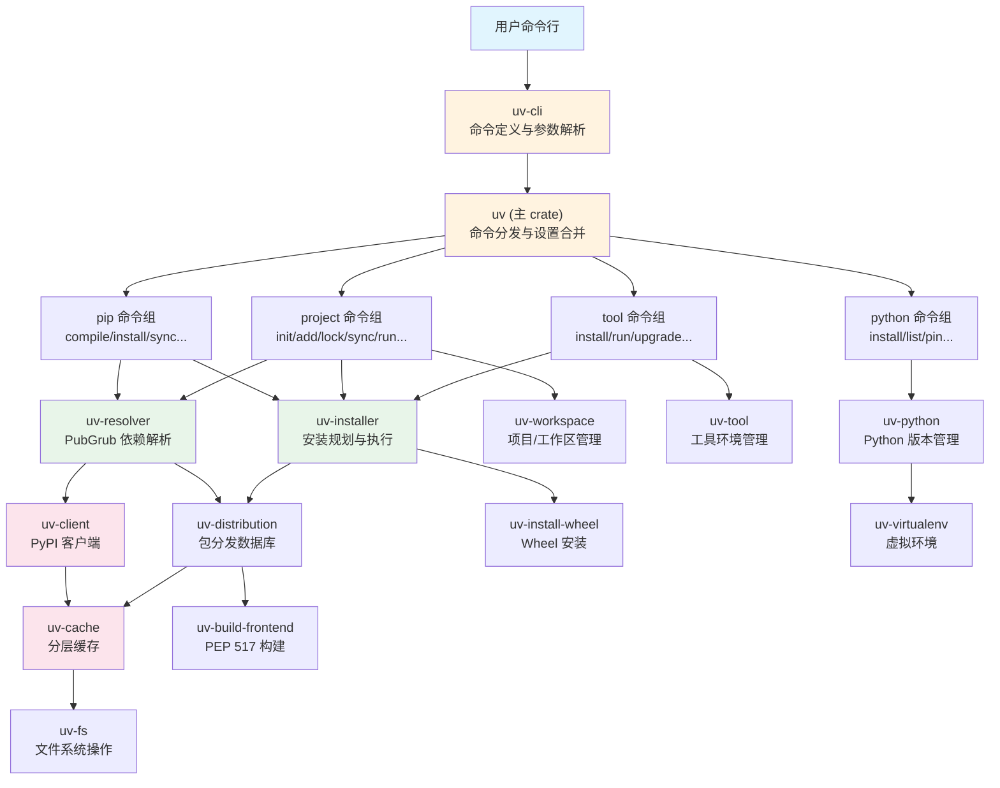
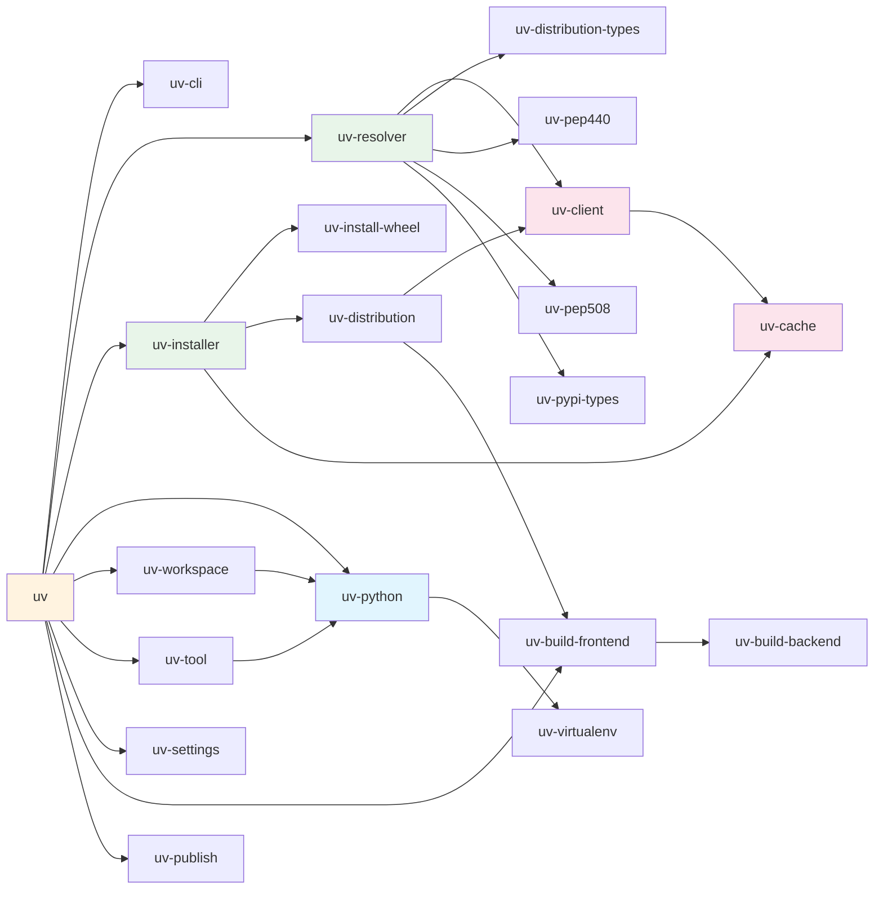
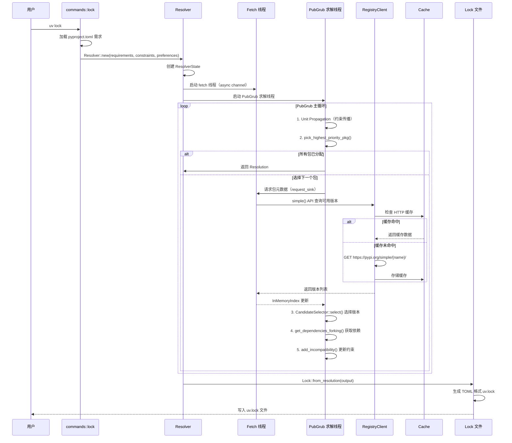
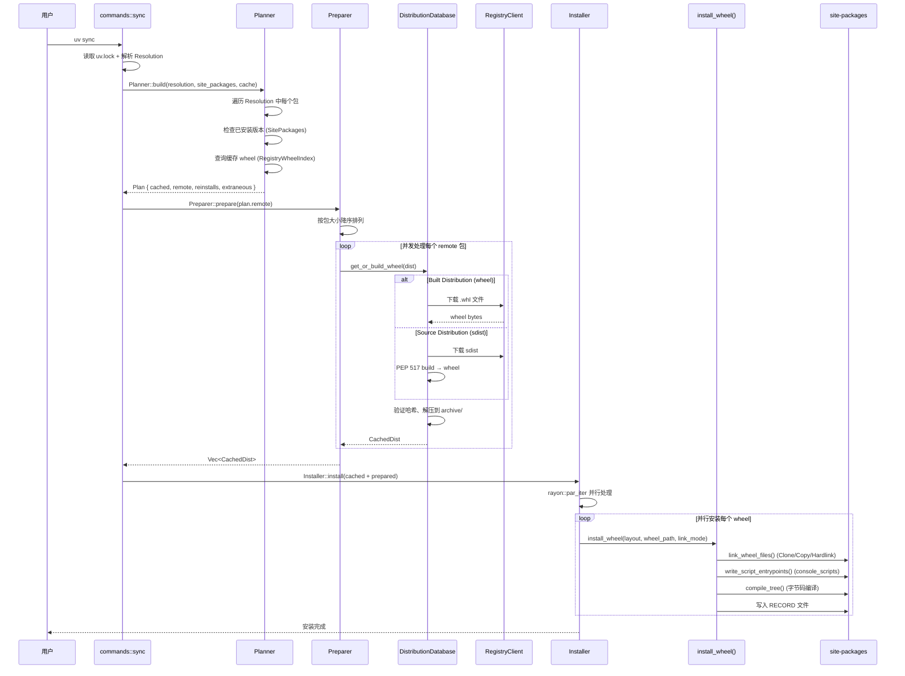

# uv 源码学习笔记

> 仓库地址：[uv](https://github.com/astral-sh/uv)
> 学习日期：2026-04-05

---

> **以下为 AI 源码分析**
>
> ### 一句话概括
>
> uv 是一个用 Rust 编写的超高性能 Python 包和项目管理器，可替代 pip、pip-tools、pipx、poetry、pyenv、virtualenv 等工具，速度比 pip 快 10-100 倍。
>
> ### 要点速览
>
> | 核心模块 | 职责 | 关键文件 |
> |---------|------|---------|
> | uv (主 crate) | CLI 入口、命令分发、设置合并 | `crates/uv/src/lib.rs` |
> | uv-cli | 命令行定义（clap derive） | `crates/uv-cli/src/lib.rs` |
> | uv-resolver | PubGrub 依赖解析、lock 文件生成 | `crates/uv-resolver/src/resolver/mod.rs` |
> | uv-installer | 安装规划、并行安装 | `crates/uv-installer/src/plan.rs` |
> | uv-client | PyPI 注册表客户端、HTTP 缓存 | `crates/uv-client/src/registry_client.rs` |
> | uv-python | Python 版本发现、下载、管理 | `crates/uv-python/src/discovery.rs` |
> | uv-workspace | 项目/工作区管理 | `crates/uv-workspace/src/workspace.rs` |
> | uv-cache | 分层缓存系统 | `crates/uv-cache/src/lib.rs` |
> | uv-virtualenv | 虚拟环境创建 | `crates/uv-virtualenv/src/virtualenv.rs` |
> | uv-build-frontend | PEP 517 构建前端 | `crates/uv-build-frontend/src/lib.rs` |

---

## 项目简介

uv 是由 Astral（Ruff 的创建者）开发的下一代 Python 包管理器。它用 Rust 从零构建，旨在用一个统一工具替代 Python 生态中碎片化的工具链（pip、pip-tools、pipx、poetry、pyenv、virtualenv 等）。uv 的核心价值在于**极致性能**（基于 Rust 的并发 I/O 和高效解析算法）、**一站式体验**（项目管理、依赖解析、虚拟环境、Python 版本管理、工具安装全覆盖）以及**pip 兼容性**（提供熟悉的 CLI 接口降低迁移成本）。项目采用 Cargo workspace 架构，包含 50+ 个独立 crate，各司其职，充分利用 Rust 的类型系统和并发能力。

## 技术栈

| 类别 | 技术 |
|------|------|
| 语言 | Rust (edition 2024, MSRV 1.92.0) |
| 框架 | Tokio (异步运行时), clap (CLI 解析) |
| 构建工具 | Cargo, cargo-dist |
| 依赖管理 | Cargo workspace (50+ crates) |
| 测试框架 | insta (快照测试), assert_cmd, wiremock |
| 核心算法 | astral-pubgrub (依赖解析) |
| 网络库 | reqwest + reqwest-middleware (重试/缓存) |
| 序列化 | rkyv (零拷贝), serde + rmp-serde (MessagePack) |

## 目录结构

```
uv/
├── crates/                          # Cargo workspace 成员（核心代码）
│   ├── uv/                          #   主 crate：CLI 入口和命令实现
│   │   ├── src/bin/uv.rs            #     二进制入口点
│   │   ├── src/lib.rs               #     核心 run() 函数和命令分发
│   │   ├── src/commands/            #     各命令实现（pip/project/tool/python...）
│   │   └── src/settings.rs          #     设置解析和合并
│   ├── uv-cli/                      #   CLI 定义：clap 结构体和子命令枚举
│   ├── uv-resolver/                 #   依赖解析器：PubGrub 集成 + lock 文件
│   │   ├── src/resolver/            #     核心解析循环
│   │   ├── src/pubgrub/             #     PubGrub 包/依赖/优先级模型
│   │   ├── src/lock/                #     uv.lock 文件读写
│   │   └── src/candidate_selector.rs#     版本选择策略
│   ├── uv-installer/                #   安装器：规划 + 准备 + 并行安装
│   ├── uv-client/                   #   PyPI 客户端：HTTP 请求 + 缓存
│   ├── uv-python/                   #   Python 版本管理：发现/下载/安装
│   ├── uv-workspace/                #   项目和工作区管理
│   ├── uv-cache/                    #   分层缓存系统
│   ├── uv-virtualenv/               #   虚拟环境创建
│   ├── uv-distribution/             #   包分发数据库：获取/构建 wheel
│   ├── uv-install-wheel/            #   Wheel 安装：link + script + bytecode
│   ├── uv-build-frontend/           #   PEP 517 构建前端
│   ├── uv-build-backend/            #   PEP 517 构建后端
│   ├── uv-tool/                     #   工具管理（类 pipx）
│   ├── uv-settings/                 #   配置文件发现和加载
│   ├── uv-pep440/                   #   PEP 440 版本解析
│   ├── uv-pep508/                   #   PEP 508 依赖规范解析
│   ├── uv-publish/                  #   包发布到 PyPI
│   └── ...                          #   30+ 其他辅助 crate
├── docs/                            # 文档（mkdocs）
├── scripts/                         # 开发和发布脚本
├── python/                          # Python 辅助代码
└── Cargo.toml                       # Workspace 根配置
```

## 架构设计

### 整体架构

uv 采用**分层模块化架构**，从用户交互层到底层 I/O 层清晰分离。顶层是 CLI 解析层（uv-cli），中间是业务逻辑层（commands + resolver + installer），底层是基础设施层（cache + client + fs）。所有 I/O 操作基于 Tokio 异步运行时，安装阶段使用 rayon 并行加速。



### 核心模块

#### 1. uv-cli — 命令行定义

- **职责**：使用 clap derive 宏定义所有 CLI 命令、子命令和参数
- **核心文件**：`crates/uv-cli/src/lib.rs`（6300+ 行）
- **关键类型**：
  - `Cli` — 顶层 CLI 结构体
  - `Commands` — 命令枚举（Auth/Pip/Project/Tool/Python/Build/Publish/Cache...）
  - `ProjectCommand` — 项目子命令（Run/Init/Add/Remove/Sync/Lock/Export/Tree/Audit）
  - `PipCommand` — pip 兼容子命令（Compile/Sync/Install/Uninstall/Freeze/List）
  - `ToolCommand` — 工具子命令（Run/Install/Upgrade/List/Uninstall）
  - `PythonCommand` — Python 管理子命令（List/Install/Find/Pin/Uninstall）
- **与其他模块的关系**：被 uv 主 crate 消费，提供类型安全的参数传递

#### 2. uv-resolver — 依赖解析器

- **职责**：基于 PubGrub 算法进行依赖解析，生成和读取 uv.lock 文件
- **核心文件**：
  - `crates/uv-resolver/src/resolver/mod.rs` — 核心解析循环（4230 行）
  - `crates/uv-resolver/src/pubgrub/package.rs` — PubGrub 包模型
  - `crates/uv-resolver/src/pubgrub/priority.rs` — 优先级策略
  - `crates/uv-resolver/src/candidate_selector.rs` — 版本候选选择
  - `crates/uv-resolver/src/lock/mod.rs` — lock 文件数据结构
- **关键类型**：
  - `Resolver<Provider, InstalledPackages>` — 主解析器
  - `ResolverState` — 解析器共享状态
  - `PubGrubPackage` / `PubGrubPackageInner` — 包模型（Root/Python/Package/Extra/Group/Marker）
  - `CandidateSelector` — 版本选择策略（highest/lowest + prerelease 处理）
  - `Lock` — lock 文件顶层结构（version/packages/manifest）
  - `ResolverOutput` — 解析结果（依赖图 + fork markers + 诊断信息）
- **与其他模块的关系**：消费 uv-client 获取包元数据，输出 Resolution 供 uv-installer 使用

#### 3. uv-installer — 安装器

- **职责**：基于解析结果规划安装方案，并行下载/构建/安装 wheel
- **核心文件**：
  - `crates/uv-installer/src/plan.rs` — 安装规划（Planner）
  - `crates/uv-installer/src/preparer.rs` — 包准备（下载/构建）
  - `crates/uv-installer/src/installer.rs` — 并行安装
  - `crates/uv-installer/src/compile.rs` — 字节码编译
- **关键类型**：
  - `Planner` — 生成 `Plan`（cached/remote/reinstalls/extraneous）
  - `Preparer` — 并发准备分发包（按大小降序处理）
  - `Installer` — rayon 并行安装 wheel
  - `Plan` — 安装计划数据结构
- **与其他模块的关系**：消费 uv-resolver 的 Resolution，调用 uv-install-wheel 执行安装

#### 4. uv-client — PyPI 客户端

- **职责**：实现 PEP 503 Simple Repository API 客户端，支持 HTTP 缓存和重试
- **核心文件**：
  - `crates/uv-client/src/registry_client.rs` — 注册表客户端
  - `crates/uv-client/src/base_client.rs` — HTTP 基础客户端
  - `crates/uv-client/src/cached_client.rs` — RFC 7234 缓存层
- **关键类型**：
  - `RegistryClient` — PyPI 客户端（simple API + JSON API）
  - `BaseClient` — HTTP 客户端（reqwest + 认证/重试/代理中间件）
  - `CachedClient` — 缓存层（支持 MessagePack 和 rkyv 序列化）
- **与其他模块的关系**：被 uv-resolver 和 uv-distribution 消费

#### 5. uv-python — Python 版本管理

- **职责**：发现、下载、安装和管理 Python 版本
- **核心文件**：
  - `crates/uv-python/src/discovery.rs` — Python 发现（7 种查询模式）
  - `crates/uv-python/src/downloads.rs` — 版本下载和哈希验证
  - `crates/uv-python/src/managed.rs` — 受管 Python 安装
  - `crates/uv-python/src/interpreter.rs` — 解释器元数据查询
- **关键类型**：
  - `PythonRequest` — 查询请求（Default/Version/Directory/File/ExecutableName/Implementation）
  - `Interpreter` — 解释器（含平台标签、路径、site-packages 等 17 个字段）
  - `ManagedPythonInstallations` — 受管 Python 集合（~/.local/uv/pythons/）
  - `PythonEnvironment` — 环境封装（根目录 + 解释器）
- **与其他模块的关系**：被 uv-virtualenv 和 commands 层消费

#### 6. uv-cache — 分层缓存系统

- **职责**：管理全局缓存目录，支持分桶存储、文件锁和刷新策略
- **核心文件**：`crates/uv-cache/src/lib.rs`
- **关键类型**：
  - `Cache` — 缓存管理器
  - `CacheBucket` — 缓存桶（WheelMetadata/Wheels/Archive/Build/Http）
  - `CacheEntry` / `CacheShard` — 缓存条目和分片
  - `Refresh` — 刷新策略（None/Some/All）
  - `WheelCache` — wheel 缓存路由（Index/Url/Path/Editable/Git）
- **缓存目录结构**：
  - `~/.cache/uv/wheel-metadata-v0/` — 元数据缓存
  - `~/.cache/uv/wheels/` — wheel 文件缓存
  - `~/.cache/uv/archive/` — 解压缩的 wheel 内容
- **与其他模块的关系**：被 uv-client、uv-installer、uv-distribution 等广泛使用

### 模块依赖关系



## 核心流程

### 流程一：依赖解析（uv lock / uv pip compile）

这是 uv 最核心的流程，基于 PubGrub 算法将用户声明的依赖解析为完整的、无冲突的版本锁定方案。



**关键逻辑说明**：

1. **双线程架构**：PubGrub 求解线程与元数据 fetch 线程通过 async channel 通信，实现批量预取（pre-visit），避免逐个等待网络请求
2. **版本选择策略**：`CandidateSelector` 支持 highest/lowest 策略，优先使用 lockfile 偏好（preferences），其次检查已安装版本，最后按策略从可用版本中选择
3. **Fork 支持**：当某包在不同平台/Python 版本下依赖不同时，创建多个 fork state 分别解析，最终合并
4. **优先级排序**：URL 依赖 > 单一版本约束 > 冲突包 > 无约束包，确保确定性强的包优先求解

### 流程二：包安装（uv pip install / uv sync）

从解析结果到将 wheel 安装到 site-packages 的完整流程。



**关键逻辑说明**：

1. **三阶段流水线**：Plan（规划）→ Prepare（准备）→ Install（安装），每个阶段职责清晰
2. **智能跳过**：Planner 对比已安装版本和缓存，只下载真正需要的包，极大减少 I/O
3. **并发下载**：Preparer 使用 `FuturesUnordered` + `Semaphore` 控制并发，大包优先下载
4. **并行安装**：Installer 使用 rayon 线程池，多个 wheel 同时安装到 site-packages
5. **链接模式**：支持 Clone（macOS COW）、Hardlink、Copy、Symlink 四种模式，Clone 最高效

## 关键设计亮点

### 1. PubGrub + 双线程架构实现高效依赖解析

- **问题**：传统依赖解析器（如 pip 的 backtracking resolver）在面对复杂依赖图时极慢，且网络请求是串行瓶颈
- **实现**：uv 将 PubGrub 求解循环和元数据 fetch 放在两个独立线程中，通过 async channel 通信。求解线程在等待元数据时不阻塞，而是通过 `pre_visit()` 批量预取即将需要的包信息
- **关键代码**：`crates/uv-resolver/src/resolver/mod.rs`（第 278-310 行：双线程创建，第 313-650 行：求解循环）
- **效果**：网络延迟被隐藏在求解计算中，实测解析速度比 pip 快 10-100x

### 2. 分层缓存 + 零拷贝反序列化

- **问题**：重复下载和解析包元数据浪费大量时间和带宽
- **实现**：uv 设计了多层缓存——HTTP 响应缓存（RFC 7234）、wheel 元数据缓存（MessagePack）、wheel 文件缓存、解压缩 archive 缓存。元数据使用 rkyv 零拷贝反序列化，避免 JSON/TOML 解析开销。缓存键基于 URL SHA256 哈希，支持 `Refresh` 策略控制过期
- **关键代码**：`crates/uv-cache/src/lib.rs`（CacheBucket 定义）、`crates/uv-client/src/cached_client.rs`（HTTP 缓存）
- **效果**：warm cache 场景下安装近乎零网络开销，cold cache 也受益于并发下载

### 3. Fork 解析支持跨平台 lock 文件

- **问题**：同一个包在不同平台/Python 版本下可能有不同的依赖树，传统工具需要在每个目标平台单独 lock
- **实现**：uv 的 resolver 支持 fork——当检测到依赖的 marker 条件（如 `sys_platform == 'win32'`）导致依赖树分叉时，自动创建多个 `ForkState` 分别求解，最终合并为一个统一的 lock 文件。lock 文件中每个 dependency 携带 `SimplifiedMarkerTree` 和 `UniversalMarker`
- **关键代码**：`crates/uv-resolver/src/resolver/mod.rs`（`get_dependencies_forking()`）、`crates/uv-resolver/src/lock/mod.rs`（`Dependency` 结构的双标记设计）
- **效果**：单个 `uv.lock` 文件即可描述所有平台的依赖关系，真正实现"一次 lock，处处 sync"

### 4. rayon 并行安装 + Copy-on-Write 链接

- **问题**：pip 的串行安装在大量包时成为瓶颈，且文件复制带来不必要的磁盘 I/O
- **实现**：uv 使用 rayon 线程池并行安装所有 wheel 到 site-packages。文件传输支持 4 种 `LinkMode`：macOS 上优先使用 Clone（Copy-on-Write，几乎零 I/O），其次 Hardlink，最后 Copy。并发安装时通过 `InstallState` 中的 `CopyLocks` 和 `Mutex<FxHashMap>` 防止目录级冲突
- **关键代码**：`crates/uv-installer/src/installer.rs`（rayon 并行）、`crates/uv-install-wheel/src/linker.rs`（LinkMode 实现）
- **效果**：warm cache + Clone 模式下，数百个包的安装在毫秒级完成

### 5. 统一 CLI 架构与多源配置合并

- **问题**：用户需要在命令行、配置文件、环境变量之间统一管理行为偏好
- **实现**：每个命令都有对应的 `Settings` 类型，通过 `resolve()` 方法将 CLI 参数、`uv.toml`/`pyproject.toml` 配置文件（支持项目/用户/系统三级）和环境变量三者合并为最终配置。`FilesystemOptions::combine()` 实现链式配置覆盖
- **关键代码**：`crates/uv/src/settings.rs`（Settings resolve）、`crates/uv-settings/src/lib.rs`（FilesystemOptions）、`crates/uv/src/lib.rs`（第 223-257 行：配置发现流程）
- **效果**：用户可以灵活地在任意层级定义默认行为，且优先级规则清晰一致
