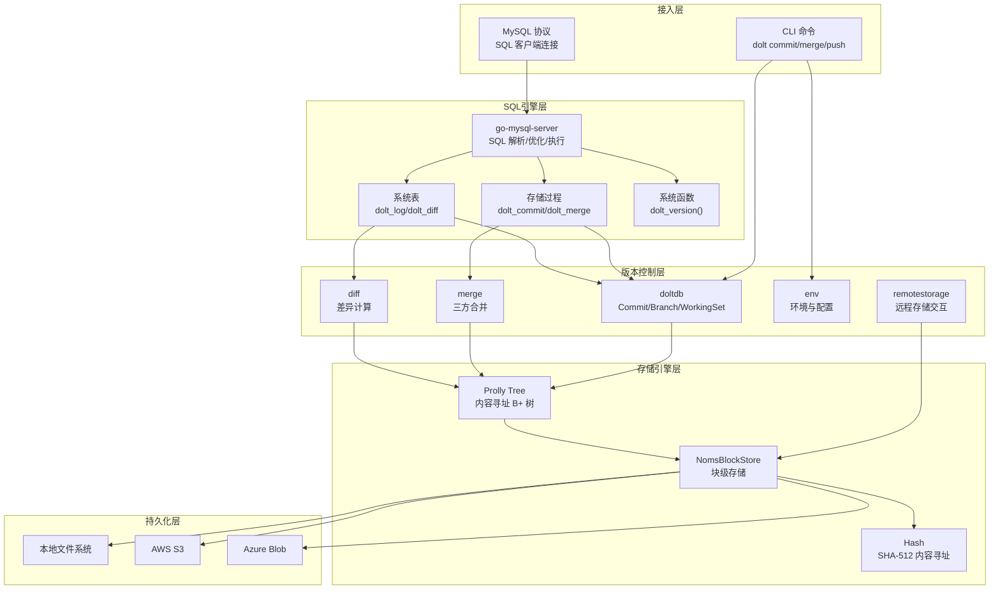
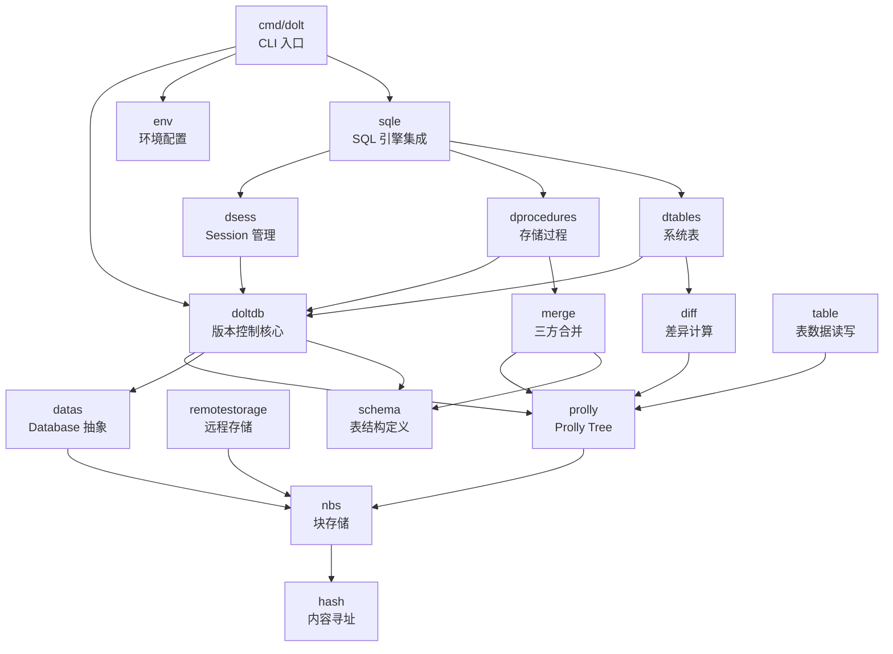
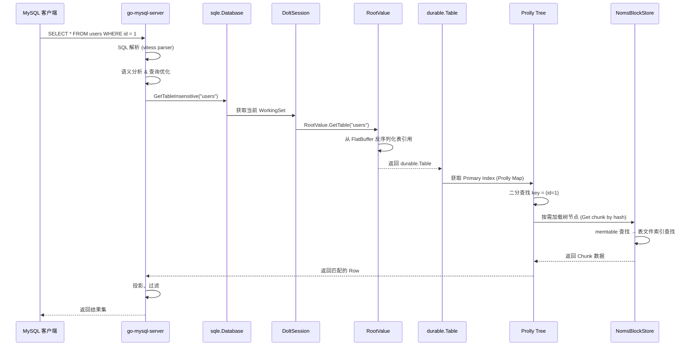
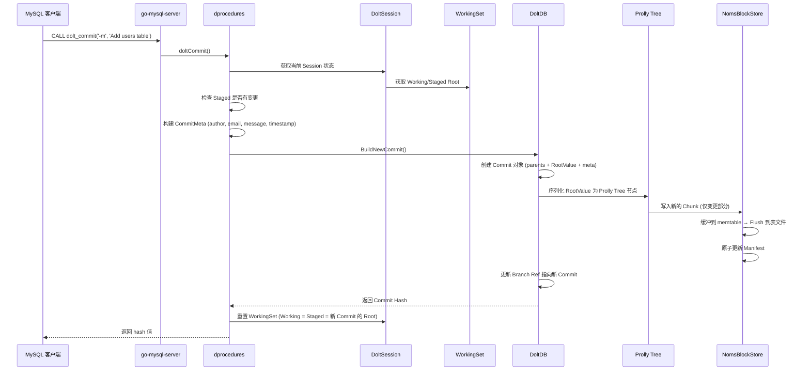

# Dolt 源码学习笔记

> 仓库地址：[dolthub/dolt](https://github.com/dolthub/dolt)
> 学习日期：2026-04-05

---

> **以下为 AI 源码分析**
>
> ### 一句话概括
>
> Dolt 是一个用 Go 实现的 MySQL 兼容数据库，基于 Prolly Tree 内容寻址存储引擎，提供 Git 级别的版本控制能力（branch、merge、diff、clone）。
>
> ### 要点速览
>
> | 核心模块 | 职责 | 关键路径 |
> |---------|------|---------|
> | CLI 入口 | 命令解析与分发，Git-like CLI 体验 | `go/cmd/dolt/` |
> | doltcore/doltdb | 版本控制核心：Commit、Branch、WorkingSet | `go/libraries/doltcore/doltdb/` |
> | doltcore/sqle | SQL 引擎集成层，MySQL 协议适配 | `go/libraries/doltcore/sqle/` |
> | doltcore/merge | 三方合并算法，Schema + Row 合并 | `go/libraries/doltcore/merge/` |
> | store/prolly | Prolly Tree —— 内容寻址 B+ 树 | `go/store/prolly/` |
> | store/nbs | NomsBlockStore —— 块级持久化存储 | `go/store/nbs/` |
> | SQL Server | MySQL 兼容服务器，支持多数据库 | `go/cmd/dolt/commands/sqlserver/` |

---

## 项目简介

Dolt 是世界上第一个支持 Git-like 版本控制的 SQL 数据库。它兼容 MySQL 协议，用户可以像连接 MySQL 一样连接 Dolt 进行读写操作，同时通过 SQL 系统表、存储过程和函数来使用版本控制功能（commit、branch、merge、diff、push、pull 等）。Dolt 也提供与 Git 完全对齐的 CLI，支持 `dolt init`、`dolt commit`、`dolt push` 等命令。其核心存储基于 Prolly Tree（概率 B+ 树）实现内容寻址，使得数据的差异计算和结构共享极其高效。

## 技术栈

| 类别 | 技术 |
|------|------|
| 语言 | Go |
| 框架 | [go-mysql-server](https://github.com/dolthub/go-mysql-server)（SQL 引擎）、[vitess](https://github.com/dolthub/vitess)（SQL 解析器） |
| 构建工具 | Go Build、Makefile |
| 依赖管理 | Go Modules |
| 测试框架 | Go testing、BATS（Bash 集成测试）、sqllogictest |
| 序列化 | FlatBuffers、Protocol Buffers |
| 存储后端 | 本地文件系统、AWS S3、Azure Blob、Alibaba OSS |

## 目录结构

```
dolt/
├── go/                              # Go 源码主目录
│   ├── cmd/dolt/                    # CLI 入口与命令
│   │   ├── dolt.go                  #   main() 入口，启动流程
│   │   ├── doltcmd/                 #   命令注册表
│   │   ├── cli/                     #   CLI 框架（Command 接口、参数解析）
│   │   └── commands/                #   所有 CLI 命令实现
│   │       ├── sqlserver/           #     SQL Server 启动与配置
│   │       ├── sql.go               #     交互式 SQL Shell
│   │       ├── merge.go             #     merge 命令
│   │       └── ...                  #     init/commit/branch/push/pull 等
│   ├── libraries/                   # 核心业务库
│   │   └── doltcore/               #   Dolt 核心逻辑
│   │       ├── doltdb/             #     版本控制核心（Commit/Branch/RootValue）
│   │       ├── sqle/               #     SQL 引擎集成
│   │       │   ├── dsess/          #       Session 与事务管理
│   │       │   ├── dprocedures/    #       dolt_commit/dolt_merge 等存储过程
│   │       │   ├── dtables/        #       dolt_log/dolt_diff 等系统表
│   │       │   └── dfunctions/     #       dolt_version() 等函数
│   │       ├── merge/              #     三方合并算法
│   │       ├── diff/               #     差异计算
│   │       ├── env/                #     环境与配置管理
│   │       ├── schema/             #     表 Schema 定义
│   │       ├── table/              #     表数据读写
│   │       ├── remotestorage/      #     远程存储交互（push/pull）
│   │       └── ref/                #     Git-like 引用管理
│   └── store/                       # 底层存储引擎
│       ├── prolly/                  #   Prolly Tree 实现
│       ├── nbs/                     #   NomsBlockStore（块存储）
│       ├── chunks/                  #   ChunkStore 接口
│       ├── datas/                   #   Database/Commit 抽象
│       ├── hash/                    #   内容寻址哈希（SHA-512 前 20 字节）
│       ├── val/                     #   Tuple 值编码
│       └── types/                   #   类型系统
├── proto/                           # Protocol Buffers 定义
├── integration-tests/               # 集成测试（MySQL 兼容性、ORM、事务）
└── docker/                          # Docker 镜像构建
```

## 架构设计

### 整体架构

Dolt 采用清晰的分层架构，从上到下分为 4 层：CLI/SQL 接入层、版本控制逻辑层、存储抽象层、持久化层。用户可以通过 CLI 或 MySQL 协议两种方式与 Dolt 交互，所有版本控制操作最终都转化为对 Prolly Tree 的不可变数据操作。



### 核心模块

#### 1. CLI 入口层 (`go/cmd/dolt/`)

**职责**：解析命令行参数，初始化环境，分发命令执行。

**核心文件**：
- `dolt.go` — `main()` 入口，`runMain()` 编排启动流程
- `doltcmd/doltcmd.go` — 命令注册表，定义完整命令树
- `cli/command.go` — `Command` 接口和 `SubCommandHandler` 分发器
- `cli/cli_context.go` — `CliContext` 上下文，支持延迟绑定查询引擎

**关键接口**：

```go
// Command — 所有 CLI 命令的统一接口
type Command interface {
    Name() string
    Description() string
    Exec(ctx context.Context, commandStr string, args []string,
         dEnv *env.DoltEnv, cliCtx CliContext) int
    Docs() *CommandDocumentation
    ArgParser() *argparser.ArgParser
}

// SubCommandHandler — 命令树分发器，支持嵌套子命令
type SubCommandHandler struct {
    name        string
    Subcommands []Command
    Unspecified Command  // 无参数时的默认命令
}
```

**启动流程**：`main()` → `runMain()` → `createBootstrapConfig()` 解析全局参数 → `env.LoadWithoutDB()` 加载环境 → `MultiEnvForDirectory()` 加载多数据库 → `doltCommand.Exec()` 分发到具体命令。

#### 2. 版本控制核心 (`go/libraries/doltcore/doltdb/`)

**职责**：实现 Git-like 版本控制原语 —— Commit、Branch、Tag、WorkingSet、RootValue。

**核心文件**：
- `doltdb.go` — `DoltDB` 主体，管理所有版本控制操作
- `commit.go` — `Commit` 对象，包装底层 Noms Commit
- `root_val.go` — `RootValue` 接口，数据库某一时刻的完整快照（不可变）
- `workingset.go` — `WorkingSet`，追踪 Working/Staged/MergeState
- `table.go` — `Table` 对象，包含 Schema + Row Data + Indexes

**关键数据结构**：

```go
// DoltDB — 仓库入口，管理 commits/branches/tags
type DoltDB struct {
    db           hooksDatabase           // 底层 Noms 数据库
    vrw          types.ValueReadWriter   // 值读写器
    ns           tree.NodeStore          // Prolly Tree 节点存储
    commitCache  *lru.Cache[hash.Hash, *OptionalCommit]
}

// WorkingSet — Git 三阶段模型
type WorkingSet struct {
    WorkingRoot  RootValue   // 工作目录
    StagedRoot   RootValue   // 暂存区
    MergeState   *MergeState // 合并中间状态（可选）
    RebaseState  *RebaseState
}
```

**数据模型**：`DoltDB` → `Commit` → `RootValue` → `Table` → `durable.Table`（Prolly 索引）→ `Row`。所有修改基于不可变模式，`RootValue.PutTable()` 返回新的 `RootValue` 实例。

#### 3. SQL 引擎集成层 (`go/libraries/doltcore/sqle/`)

**职责**：将 Dolt 版本控制能力适配为 MySQL 兼容的 SQL 接口。

**核心文件**：
- `database.go` — 实现 `sql.Database` 接口，适配 go-mysql-server
- `dsess/session.go` — `DoltSession`，管理数据库连接状态
- `dsess/transactions.go` — `DoltTransaction`，基于哈希的乐观并发控制
- `dprocedures/` — 33 个存储过程（`dolt_commit`、`dolt_merge`、`dolt_checkout` 等）
- `dtables/` — 42 个系统表（`dolt_log`、`dolt_diff`、`dolt_branches` 等）
- `dfunctions/` — 12 个系统函数

**SQL 版本控制示例**：

```sql
-- 通过存储过程执行版本控制
CALL dolt_add('users');
CALL dolt_commit('-m', 'Add user table');
CALL dolt_checkout('-b', 'feature/auth');
CALL dolt_merge('main');

-- 通过系统表查询版本信息
SELECT * FROM dolt_log;
SELECT * FROM dolt_diff('main', 'feature/auth', 'users');
SELECT * FROM dolt_branches;
```

#### 4. 三方合并 (`go/libraries/doltcore/merge/`)

**职责**：实现 Git-like 三方合并算法，支持 Schema 合并和行级数据合并。

**核心文件**：
- `merge.go` — 主合并入口，`MergeCommits()` 函数
- `merge_prolly_rows.go`（78KB）— 基于 Prolly Tree 的行级合并
- `merge_schema.go`（47KB）— Schema 合并（列变更、索引变更、约束变更）

**合并流程**：计算 LCA（最近公共祖先）→ Schema 三方合并 → 行数据三方合并 → 冲突检测与记录 → 约束验证。

#### 5. Prolly Tree (`go/store/prolly/`)

**职责**：Dolt 的核心数据结构 —— 内容寻址概率 B+ 树，实现高效的差异计算和结构共享。

**核心文件**：
- `map.go` — `Map` 主结构，键值对有序映射
- `tree/node.go` — 树节点定义（叶节点 + 内部节点）
- `tree/chunker.go` — 分块器，基于 Rolling Hash 确定节点边界
- `message/prolly_map.go` — FlatBuffers 序列化

**关键特性**：
- **内容寻址**：节点由内容哈希标识，相同数据产生相同哈希
- **结构共享**：相似的树共享大部分节点，存储效率极高
- **高效 Diff**：O(log n + changes) 时间复杂度
- **概率分块**：Rolling Hash 决定节点边界，插入/删除只影响局部

#### 6. NomsBlockStore (`go/store/nbs/`)

**职责**：块级持久化存储，管理 Chunk 的读写、缓存、垃圾回收。

**核心文件**：
- `store.go` — `NomsBlockStore` 主结构
- `table_reader.go` / `table_writer.go` — 表文件读写
- `manifest.go` — 清单文件，记录所有表文件元数据

**存储格式**：Chunk 数据 → Prefix Map（8B 前缀 + 序号）→ Lengths Array → Suffixes Array。查询时两阶段定位：前缀查找 + 后缀验证。

**写入流程**：`Put()` → memtable 缓冲 → Flush 到表文件 → 原子更新 Manifest。ACID 保证通过乐观锁 + 原子清单更新实现。

### 模块依赖关系



## 核心流程

### 流程一：SQL 查询 → 版本控制数据读取

这是 Dolt 最核心的流程，展示了一条 SQL 查询如何穿透整个分层架构，最终从 Prolly Tree 中读取数据。



**关键步骤说明**：
1. go-mysql-server 负责 SQL 解析和查询计划生成，Dolt 不重写 SQL 引擎
2. `sqle.Database` 实现 `sql.Database` 接口，负责将表名解析为 `doltdb.Table`
3. `DoltSession` 维护当前事务的 `WorkingSet`，决定查询哪个版本的数据
4. `RootValue` 是不可变快照，`GetTable()` 返回指定表的 Prolly Tree 索引
5. Prolly Tree 按需从 NBS 加载节点，支持懒加载和 LRU 缓存

### 流程二：dolt_commit 存储过程执行

展示通过 SQL 接口执行版本控制操作的完整流程。



**关键步骤说明**：
1. `dolt_commit` 存储过程检查 Staged Root 与 HEAD Root 的差异
2. `BuildNewCommit()` 创建不可变的 Commit 对象，父节点指向当前 HEAD
3. 由于 Prolly Tree 的结构共享特性，只有变更部分会产生新的 Chunk
4. NBS 通过原子 Manifest 更新保证 ACID
5. 提交完成后重置 WorkingSet，三阶段模型回到一致状态

## 关键设计亮点

### 1. Prolly Tree —— 内容寻址概率 B+ 树

**解决的问题**：传统 B+ 树在版本控制场景下无法高效计算差异和共享结构。

**实现方式**：Prolly Tree 使用 Rolling Hash（Buzhash）来确定节点边界，而非固定大小分裂。相同的数据必然产生相同的树结构（内容寻址），因此两棵树之间的差异可以通过比较根哈希快速判断，不同时只需递归比较不同的子树。

**关键代码**：`go/store/prolly/tree/chunker.go`（分块策略）、`go/store/prolly/map.go`（Map 操作）

**为什么这样设计**：这是 Dolt 与传统数据库的根本区别。Prolly Tree 同时满足了数据库索引的 O(log n) 查询性能和版本控制的 O(changes) 差异计算需求，使得 branch/merge/diff 操作不依赖数据库大小，只依赖变更量。

### 2. SQL 接口暴露版本控制 —— 存储过程 + 系统表

**解决的问题**：如何让用户在不学习新工具的情况下使用版本控制功能。

**实现方式**：通过 go-mysql-server 的扩展机制注册 33 个存储过程（`dolt_commit`、`dolt_merge` 等）和 42 个系统表（`dolt_log`、`dolt_diff` 等），将所有 Git 操作映射为 SQL 调用。

**关键代码**：`go/libraries/doltcore/sqle/dprocedures/init.go`（过程注册）、`go/libraries/doltcore/sqle/dtables/`（系统表实现）

**为什么这样设计**：任何支持 MySQL 协议的工具（BI、ORM、连接器）无需任何修改就能操作 Dolt。版本控制功能通过 SQL 标准语法（`CALL`、`SELECT`）暴露，学习成本极低。

### 3. 延迟绑定查询引擎 (Lazy Binding)

**解决的问题**：CLI 命令中并非所有命令都需要查询引擎，提前初始化浪费资源且增加启动时间。

**实现方式**：`CliContext` 中的 `QueryEngine` 方法使用 `LateBindQueryist` 函数类型，首次调用时才创建查询引擎并缓存结果。支持本地引擎和远程连接两种模式。

**关键代码**：`go/cmd/dolt/cli/cli_context.go`（`LateBindCliContext`）

**为什么这样设计**：`dolt status`、`dolt branch` 等命令不需要完整的 SQL 引擎。延迟绑定使这些命令几乎瞬间启动，只有 `dolt sql` 等需要引擎的命令才会触发初始化。

### 4. 服务化架构 —— Controller 模式管理 SQL Server 生命周期

**解决的问题**：SQL Server 启动涉及 20+ 个初始化步骤，需要有序启动、依赖管理和优雅关闭。

**实现方式**：使用 `svcs.Controller` 注册服务链，按顺序启动（ValidateConfig → InitLogging → InitMultiEnv → InitSqlEngine → InitMySQLServer 等），关闭时反序执行。每个服务是独立的注册单元。

**关键代码**：`go/cmd/dolt/commands/sqlserver/server.go`（`ConfigureServices()` 注册 23 个服务）

**为什么这样设计**：将复杂的启动流程解耦为独立服务，每个服务可以单独测试和替换。反序关闭确保资源正确释放（先关 MySQL 连接，再关引擎，最后关存储）。

### 5. 不可变数据模型 + 乐观并发控制

**解决的问题**：多事务并发修改数据库时的一致性保证。

**实现方式**：`RootValue` 是不可变的，任何修改都返回新实例。`DoltTransaction` 记录事务起始时的根哈希，提交时检查根哈希是否变化。如果其他事务已修改，则执行自动重试（最多 5 次），失败则报错。

**关键代码**：`go/libraries/doltcore/sqle/dsess/transactions.go`（乐观锁检测）、`go/libraries/doltcore/doltdb/root_val.go`（不可变 RootValue）

**为什么这样设计**：内容寻址存储天然支持不可变性——修改只生成新节点，旧数据不受影响。乐观锁避免了传统数据库的锁竞争开销，在低冲突场景下（绝大多数场景）性能优异。
