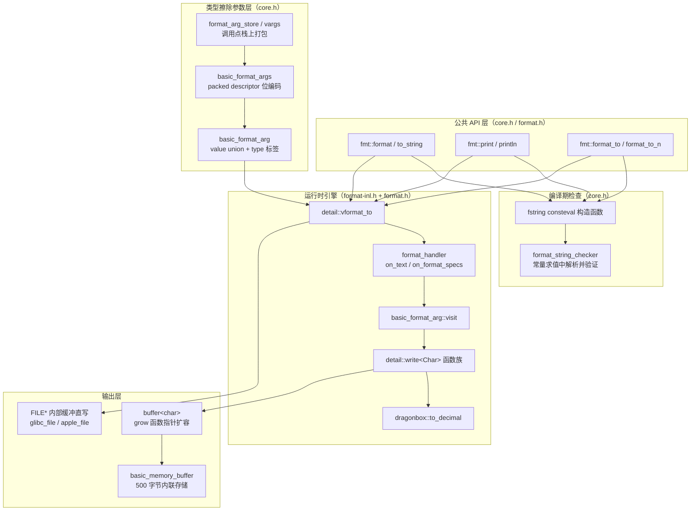
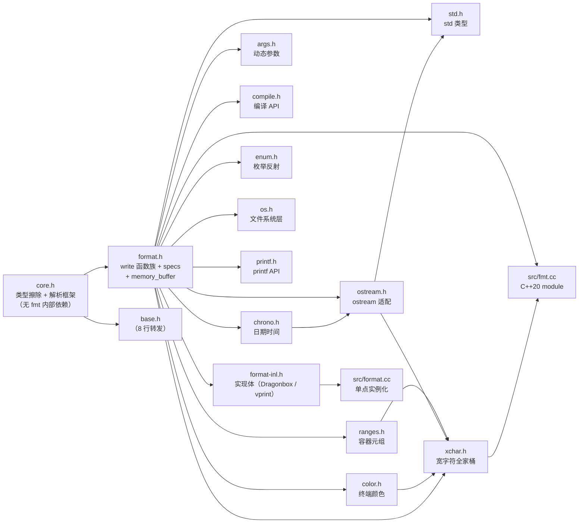
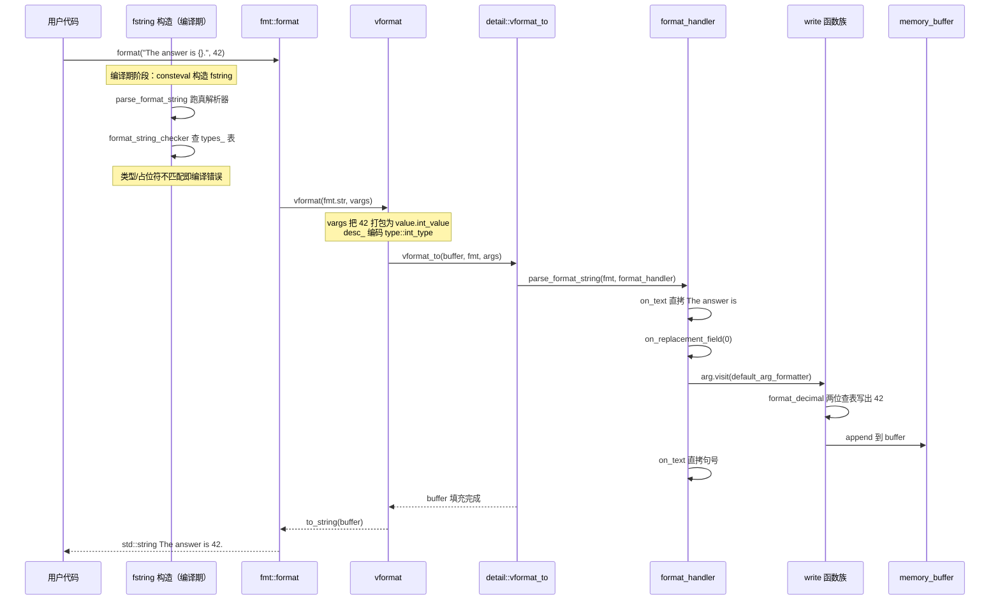
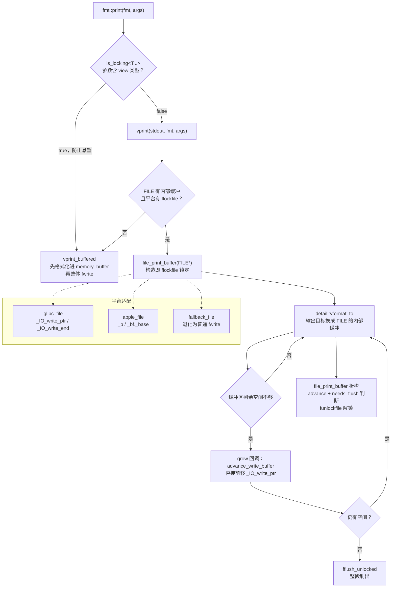

# fmt 源码学习笔记

> 仓库地址：[fmt](https://github.com/fmtlib/fmt)
> 学习日期：2026-09-30
> 学习版本：12.2.1（`FMT_VERSION 120201`，master 分支浅克隆）

---

> **以下为 AI 源码分析**
>
> ### 一句话概括
>
> {fmt} 是一个以三个头文件为最小内核（`core.h` + `format.h` + `format-inl.h`）的 C++ 格式化库：编译期用 consteval 校验格式串，运行时用类型擦除的参数包 + 一次遍历解析器直写连续缓冲区，配合 Dragonbox 算法实现最短往返浮点输出，最终成为 C++20 `std::format` 与 C++23 `std::print` 的参考实现。
>
> ### 要点速览
>
> | 模块 | 职责 | 关键文件 | 规模 |
> |------|------|----------|------|
> | core（核心 API） | 类型擦除参数系统、格式串解析框架、编译期检查 | `include/fmt/core.h` | 2962 行 |
> | format（格式化算法） | 内置类型 write 函数族、specs 解析、Dragonbox、memory_buffer | `include/fmt/format.h` | 4657 行 |
> | format-inl（非内联实现） | vformat_to / vprint / Dragonbox 实现体、FILE* 缓冲直写 | `include/fmt/format-inl.h` | 1981 行 |
> | os（系统层） | `file` / `buffered_file` / `output_file` 高速文件写、system_error | `include/fmt/os.h` + `src/os.cc` | 421 + 401 行 |
> | compile（编译 API） | `FMT_COMPILE` 把格式串编译成类型级代码 | `include/fmt/compile.h` | 605 行 |
> | xchar（宽字符） | `wchar_t` / `char16_t` / `char32_t` 全套 API 变体 | `include/fmt/xchar.h` | 378 行 |
> | 扩展 formatter 层 | chrono / ranges / std / enum / color / ostream / printf | `include/fmt/{chrono,ranges,std,enum,color,ostream,printf,args}.h` | 各 170–2255 行 |
> | 编译单元 | 显式模板实例化 + C++20 module + C API | `src/{format,os,fmt,fmt-c}.cc` | 43 + 401 + 165 + 67 行 |
> | 测试 | gtest 测试矩阵 + fuzzing + module 测试 | `test/` | 30+ 测试文件 |
>
> 交付形态：编译库（默认）、header-only（`FMT_HEADER_ONLY`）、C++20 module（`src/fmt.cc`）三种共享同一份源码。

---

## 项目简介

{fmt} 是 Victor Zverovich 自 2012 年维护至今的开源 C++ 格式化库（MIT 协议），定位是 **C stdio 与 C++ iostream 的快速且安全的替代品**。它解决的问题：printf 类型不安全且不支持用户自定义类型、iostream 慢且语法冗长。它给出的答案是一套 Python 风格的 `{}` 格式串语法，**错误在编译期报告**（C++20 起零成本），运行时路径高度优化（比 sprintf 快 20–30 倍量级），并通过类型擦除 + 函数指针实现用户类型扩展。

它的行业地位体现在两点：一是 C++20 `std::format` / C++23 `std::print` 直接以其为参考实现（作者即提案人之一）；二是被 ClickHouse、PyTorch、Envoy、MongoDB、Windows Terminal、spdlog 等大规模生产项目直接采用。库本体零外部依赖、最小配置只需 3 个文件、支持 C++11 起的老编译器，同时又是 C++20 module 和 C++26 reflection 的先行者——「现代 C++ 特性在不破坏老编译器兼容的前提下渐进落地」是整个代码库的工程主线。

## 技术栈

| 类别 | 技术 |
|------|------|
| 语言 | C++（C++11 兼容，按 `FMT_CPLUSPLUS` 渐进启用 C++14/17/20/26 特性） |
| 框架 | 无（零依赖头文件库，仅依赖 C 标准库与编译器 intrinsics） |
| 构建工具 | CMake ≥ 3.8（可选 module 支持 3.28+ / Ninja 1.11+） |
| 依赖管理 | 无外部依赖；开发工具链含 `clang-format`、`mkdocs`（文档）、`python`（release 脚本） |
| 测试框架 | 自带魔改 gtest（`test/gtest/`）+ `test/gtest-extra` + OSS-Fuzz 持续模糊测试 |
| 持续集成 | GitHub Actions（linux / macos / windows 三平台矩阵） |

## 目录结构

```text
fmt/
├── include/fmt/           # 全部公共 API（header-first，16 个头文件）
│   ├── core.h             # 地基：string_view、buffer、类型擦除参数、解析框架、fstring
│   ├── base.h             # 8 行转发头，仅 #include "core.h"（API 兼容别名）
│   ├── format.h           # 格式化算法：write<Char> 族、specs 解析、Dragonbox 声明、memory_buffer
│   ├── format-inl.h       # 上述声明的非内联实现（编译库模式下由 src/format.cc 单点实例化）
│   ├── os.h               # file / buffered_file / ostream(output_file) / system_error
│   ├── compile.h          # FMT_COMPILE / "_cf" 字面量：格式串编译成类型级代码
│   ├── args.h             # dynamic_format_arg_store：运行时动态构建参数列表
│   ├── xchar.h            # wchar_t / char16_t / char32_t 版 API（wformat、to_wstring…）
│   ├── chrono.h           # std::chrono 时长/时间点格式化（含 locale）
│   ├── ranges.h           # 容器/元组/range 格式化（is_range_ SFINAE 检测）
│   ├── std.h              # std 类型 formatter（path/optional/variant/expected…）
│   ├── enum.h             # 枚举名反射（C++26 reflection 或手动 enumerator 表）
│   ├── color.h            # 终端颜色与文本样式（text_style / rgb）
│   ├── ostream.h          # std::ostream 互操作（formatbuf / streamed()）
│   ├── printf.h           # printf 风格 API（含 POSIX 位置参数扩展）
│   └── fmt-c.h            # 纯 C API（C++ 文件里 extern "C"）
├── src/
│   ├── format.cc          # 唯一编译单元：显式实例化 dragonbox / thousands_sep / buffer<char>::append
│   ├── os.cc              # file / ostream / system_error 的实现体
│   ├── fmt.cc             # C++20 module 包装（global module fragment + export module fmt）
│   └── fmt-c.cc           # C API 实现桥接
├── test/                  # gtest 测试（core/format/chrono/printf/xchar…各一）+ fuzzing/ + module-test
├── doc/                   # mkdocs 站点源（api.md / syntax.md）
├── support/               # 构建辅助（Android NDK、Vagrant、release.py）
├── CMakeLists.txt         # 库 / 测试 / 文档 / module 四类目标
└── README.md / ChangeLog.md / CONTRIBUTING.md
```

## 架构设计

### 整体架构

整个库是一个**严格的单向分层结构**：公共 API → 类型擦除参数层 → 运行时解析/格式化引擎 → 连续缓冲输出层。所有扩展头（chrono/ranges/std/enum/color…）都不碰引擎内部，只是给 `formatter<T>` 特化「喂参数」。

三条贯穿全局的设计轴：

1. **「一份源码，三种交付」**：同一套头文件，编译库模式把 `format-inl.h` 的实现收进 `src/format.cc` 单点实例化；`FMT_HEADER_ONLY` 让 `format.h` 末尾直接 `#include "format-inl.h"` 并把 `FMT_FUNC` 定义为 `inline`；`src/fmt.cc` 用 global module fragment 把所有标准库头隔离后 `export module fmt`。三种模式靠宏切换，零代码分叉。
2. **「编译期能查的绝不留到运行时」**：`fmt::format` 的第一个参数是 `fstring<T...>` 而不是 `string_view`，其 consteval 构造函数在常量求值阶段跑一遍完整解析器，占位符与实参类型不匹配直接变成编译错误；`fmt::runtime()` 是显式的逃生门。
3. **「类型擦除但不虚函数」**：参数在调用点打包成 `value<Context>` union + 4 bit 类型标签，自定义类型用**裸函数指针** `format_custom` 携带，运行期按 type 枚举 switch 分发——没有 vtable、没有 RTTI，二进制体积和缓存局部性都优于典型 type-erasure 方案。



### 核心模块

#### 1. core.h —— 类型擦除参数系统与解析框架

**职责**：定义不依赖 `<string>` / `<locale>` 等重头的最小地基，是整个库的 ABI 底座。

- **关键结构**（均位于 `fmt::detail` 与 `fmt` 命名空间）：
  - `basic_string_view<Char>`（core.h:521）：自带 string_view，避免与不同 `-std` 编译的客户端产生 ABI 问题；
  - `basic_specs`（core.h:682）：把 type/align/sign/width/precision/fill 全部手工位打包进一个 `unsigned` + 4 字节 fill 数组——不用 C 位域是因为 gcc bug 61414，整包数据仅 **8 字节**；
  - `buffer<T>`（core.h:1759）：连续缓冲抽象，`grow_` 是**普通函数指针**而非虚函数，子类（`iterator_buffer` / `container_buffer` / `counting_buffer`）通过静态回调 + `static_cast` 回收自己；
  - `value<Context>`（core.h:2148）：16 成员 union（int/uint/long_long/…/string/custom/named_args），承载擦除后的实参；
  - `type` 枚举（core.h:973）：15 种类型标签，整数排最前使 `is_integral_type` 可用范围比较一次判断；
  - `type_mapper`（core.h:1174）：SFINAE 映射器，把 `short/signed char` 收敛成 `int`，`long` 按 `sizeof` 收敛成 int 或 long long，减少需实例化的类型数。
- **打包机制**：`basic_format_args`（core.h:2547）的 `desc_` 是一个 `ullong`——≤15 个参数时每个类型占 4 bit 直接编码进描述符（packed 模式，`max_packed_args = 62/4`），此时实参以裸 `value` 数组存放；>15 个才退化为 `basic_format_arg` 数组（unpacked 模式）。bit 63 标记 unpacked，bit 62 标记有命名参数。**这是二进制体积优化的核心**：值数组比带标签数组小，栈拷贝代码也更短（注释引实测省 ~10%）。
- **编译期检查**：`fstring<T...>`（core.h:2698）的 consteval 构造函数调用 `parse_format_string<char>(str, checker(str, arg_pack()))`。`format_string_checker`（core.h:1692）持有 `types_[]`（实参类型表）和 `parse_funcs_[]`（每个实参对应 `formatter<T>::parse` 的函数指针表），在常量求值中跑真解析器——`{:d}` 配字符串这种错误在编译期就被 `parse_presentation_type` 的 `in(arg_type, set)` 检查拦下。
- **顶层 API**：`format_to` / `format_to_n` / `formatted_size` / `print` / `println` 全部是薄模板壳，把 `vargs<T...>{{args...}}` 转发给 `vformat_to` / `vprint` / `vprint_buffered`。

#### 2. format.h / format-inl.h —— 格式化算法引擎

**职责**：`write<Char>` 函数族 + 格式规格解析 + 浮点算法 + `memory_buffer`。

- **`parse_format_specs`**（core.h:1457，规格语法在 core.h 解析）：显式状态机（`state::start → align → sign → hash → zero → width → precision → locale`），乱序组合直接 `report_error`；支持 `{}`
  嵌套引用动态宽度/精度（`{:{}}`），引用延迟到格式化期由 `handle_dynamic_spec`（format.h:3944）解析。
- **`write<Char>` 重载族**（format.h:2072–3860，约 40 个重载）：整型走 `format_decimal`（两位查表 `digits` 数组）+ `count_digits`（Kendall Willets 的 log10 位技巧，format.h:1291）；指针走 `write_ptr` 十六进制；字符串对齐填充；bool 按呈现类型选 `true/false` 或 `1/0`。
- **浮点双路径**（format.h:3733）：
  - **快路径**（`is_fast_float<T>`，IEEE754 float/double，无显式精度）：`dragonbox::to_decimal`（format-inl.h:1275）产出最短往返十进制 `decimal_fp{significand, exponent}`，再 `write_float` 直接铺开；
  - **慢路径**（long double / 指定精度 / hexfloat）：`format_float` 回退到 `snprintf` 或 `big_divisor` 大数运算（bigint 用于 round-trip 校验），hexfloat 手写位级提取。
- **Dragonbox**（format-inl.h:208–1398，~1200 行）：Junyeong Lee 的最短表示算法。三步：算 k/β 与 2^k 十进制缓存幂 → 大除数试除 → 小除数分支 + 奇偶性修正。所有路径纯整数运算，无除法循环无浮点，`to_decimal(double)` 实测是 sprintf 快一个量级的基础。
- **`basic_memory_buffer`**（format.h:937）：前 500 字节内联（`inline_buffer_size`），超出走 1.5 倍扩容的 malloc 路径；allocator 空基类优化（`FMT_NO_UNIQUE_ADDRESS`）。
- **`format_int`**（format.h:4428）：栈上 `char buffer_[23]` 的零分配整数转字符串，`fmt::to_string(42)` 即此路径，constexpr 可用。
- **format-inl.h 还藏了 print 引擎**：`vformat_to`（format-inl.h:1468）+ `format_handler`（format.h:3992）+ `vprint` 家族 + FILE* 直写三件套（见流程二）。

#### 3. os.h / os.cc —— 系统层

**职责**：`file`（裸 fd 封装，EINTR 用 `FMT_RETRY` 循环重试）、`buffered_file`（FILE* RAII）、`ostream`（`fmt::output_file` 的返回类型）。

- `ostream`（os.h:361）继承 `buffer<char>`，构造时 `new char[buffer_size]`，默认 `buffer_size` 取 **`BUFSIZ` 与页面大小的较大值**（os.h:320 `buffer_size{4096}` 可通过 `fmt::buffer_size=N` 传参调整），写满即整页 `write()`——这就是 README 宣称「比 fprintf 快 9 倍」的实现：跳过 stdio 的逐字节路径，直接页对齐批量写。
- `system_error` / `windows_error`：错误码 + 格式化消息的异常工厂，全部走 `vsystem_error`。

#### 4. compile.h —— 编译 API

**职责**：`FMT_COMPILE("{}")` 把格式串在编译期拆解成 `type_list` 与参数索引，生成**直接调用 write 的代码**，跳过整个运行时解析器。依赖 C++17 `if constexpr`；C++20 起可用 `"_cf"` 字面量（NTTP 类参数）。注意它与「编译期检查」是两件事：`fstring` 只做验证，`FMT_COMPILE` 做真正的代码生成。

#### 5. xchar.h + 扩展 formatter 层

**职责**：xchar 复用 `generic_context<basic_appender<Char>, Char>` 把整个窄字符引擎泛化到 `wchar_t`/`char16_t`/`char32_t`；chrono/ranges/std/enum 各自只是给对应类型提供 `formatter<T, Char>` 特化：

- ranges.h 用 `is_range_`（检测 `begin/end`）+ `range_format_kind_`（sequence/set/map/string/debug_string 五种呈现）自动选择格式；
- enum.h 走两条路：有 `__cpp_impl_reflection`（C++26）直接反射取名，否则要求用户 `FMT_ENUM` 声明枚举表；
- std.h 集中放 `std::filesystem::path`、`std::optional`、`std::variant`、`std::expected` 等标准库 formatter；
- printf.h 完全建在核心 API 之上，把 printf 语法翻译成 `format_specs` 再走同一 write 引擎。

### 模块依赖关系

实测 include 关系（`grep '#include "fmt/'`）如下，可见 `core.h` 是唯一根，`format.h` 是唯一中间层，扩展头全部是叶子：



值得注意的细节：`ostream.h` 依赖 `chrono.h`（借其 `formatbuf`），`std.h` 依赖 `ostream.h`，`xchar.h` 汇总四个头提供宽字符版全家桶——扩展层内部也有小规模分层，但没有任何反向边指向 `format.h`/`core.h` 内部。

## 核心流程

### 流程一：`fmt::format("The answer is {}.", 42)` 完整调用链

这是全库最核心的路径，跨越编译期检查与运行时格式化两个阶段：



文字拆解（对应源码位置）：

1. **编译期**（core.h:2715）：`fstring` 的 consteval 构造函数对 `"The answer is {}."` 跑 `parse_format_string`。`format_string_checker` 的 `on_replacement_field` 会调 `parse_funcs_[0]`（即 `formatter<int>::parse`），空 specs 直接通过；若写 `"{:d}"` 配字符串，`parse_format_specs` 中 `in(arg_type, set)` 检查失败 → `report_error` → 常量求值失败 → **编译错误**。
2. **参数打包**（core.h:2782）：`vargs<T...>{{args...}}` 在栈上构造 `format_arg_store`，把 `42` 存为 `value.int_value`，`desc_` 低 4 位编码 `type::int_type`（packed 模式）。
3. **运行时入口**（format-inl.h:1458）：`vformat` 创建 `memory_buffer`（500 字节内联，零堆分配）转 `detail::vformat_to`。
4. **短路径优化**（format-inl.h:1471）：格式串恰为 `"{}"` 时跳过解析器直接 `args.get(0).visit(default_arg_formatter)`——热路径特殊化。
5. **逐段解析**（core.h:1642 `parse_format_string` + format.h:3992 `format_handler`）：纯文本段 `on_text` 用 `copy_noinline` 直拷；遇到 `{` 走 `on_replacement_field(id)` → `ctx.arg(id).visit(default_arg_formatter<Char>{out})`。
6. **visit 分发**（core.h:2506）：对 `type_` 做 switch，`int_type` 命中 `operator()(int)` → `write<Char>(out, 42)`（format.h:2262）→ `format_decimal` 两位查表 + 反向填充。
7. **带 specs 的分支**（format.h:4016 `on_format_specs`）：自定义类型直接走 `arg.format_custom`（函数指针，不做 visit 以获得更好 codegen）；内置类型先 `parse_format_specs` 填 `dynamic_format_specs`，若有 `{}` 动态宽度再 `handle_dynamic_spec` 从 ctx 取实参解引用，最后 `arg.visit(arg_formatter{out, specs, locale})`。
8. **收尾**：`vformat` 用 `to_string(buffer)` 构造 `std::string`（一次分配拷走，或 COW 到 string 的 SSO）。

### 流程二：`fmt::print` 的 FILE* 内部缓冲直写（零拷贝打印）

print 是「性能」卖点的主战场，其写路径直接操纵 libc FILE 结构体内部指针：



文字拆解：

1. **入口分派**（core.h:2911）：`print` 先查 `detail::is_locking<T...>()`——若实参含 `string_view` 之类 view 类型（可能调用点后析构），强制走 `vprint_buffered` 先完整物化再写出，防止悬垂引用；这是 fmt 在 11.x 之后加的著名安全修复。
2. **vprint 探测**（format-inl.h:1770）：`file_ref(f).is_buffered()` 且平台有 `flockfile`（glibc/macOS 有）才走直写；否则退回 memory_buffer + `fwrite_all`。
3. **锁定与借缓冲**（format-inl.h:1690 `file_print_buffer`）：构造函数 `flockfile(f)` 拿互斥锁（TSAN 下还插 `__tsan_acquire`），然后 `init_buffer()`——如果 libc 还没给 FILE 分配缓冲（首次写前），先 `putc_unlocked(0)` 强制初始化再回退指针，然后 `set(_IO_write_ptr 到 _IO_buf_end 区间)` 把 **FILE 自己的缓冲**挂成 `buffer<char>` 的存储。
4. **直接写入**：`vformat_to` 全速往 FILE 内部缓冲写，`grow_` 回调只做 `advance_write_buffer`（前移 `_IO_write_ptr`），空间耗尽才 `fflush_unlocked`。对比 `fprintf` 每次调用都过 `vfprintf` 的 locale/格式解析，这里省掉了锁竞争和二次拷贝。
5. **平台三件套**（format-inl.h:1537–1667）：`glibc_file` 用 `_IO_write_ptr/_IO_buf_end`、`apple_file` 用 `_p/_bf`、其余平台 `fallback_file` 直接 `fwrite`。**编译期探测、运行期零分支**——依赖实现细节但有 `FMT_USE_FLOCKFILE` 开关兜底，出错可整体关闭。
6. **析构收尾**：`advance_write_buffer(size)` + `needs_flush()`（行缓冲模式下查写入内容里有没有 `\n`）+ `funlockfile`，行缓冲时再 `fflush`——完整保留 stdio 的行缓冲语义。
7. Windows 特例：`write_console`（format-inl.h:1734）检测到 tty 时把输出转 UTF-16 走 `WriteConsoleW`，规避代码页问题；非 Unicode 编译的 legacy 路径 `vprint_mojibake` 是独立实现。

## 关键设计亮点

### 1. packed 描述符：为二进制体积把类型信息压进一个 ullong

**问题**：类型擦除通常意味着「每个参数带一个 tag」，栈布局膨胀、每次调用生成的打包代码变多，库被海量调用点 include 后代码膨胀显著（README 用 bloat-test 专门度量此事）。

**实现**（core.h:2292–2321）：`make_descriptor<Context, T...>()` 把每个参数的 `type` 枚举值按 **4 bit** 编码进一个 `ullong`；≤15 个参数时 `basic_format_args` 只存 `desc_` + 裸 `value` 数组指针，`get(id)` 时按 `4*id` 位移取出类型再补进 `basic_format_arg`；>15 个才存完整的 `{value, type}` 数组。bit 63（`is_unpacked_bit`）与 bit 62（`has_named_args_bit`）复用同一个字。

**为什么值得学**：这是「用编译期已知信息消灭运行期冗余」的教科书案例——参数个数与类型在调用点全部已知，类型表没必要占独立的栈空间。命名参数同理：`named_arg_store` 把 `named_arg_info` 表放在 `args[-1]` 的负索引位置（core.h:2328），反向查找零额外成员。

### 2. consteval 检查与运行时解析共用同一个解析器

**问题**：编译期校验格式串容易做成「玩具版解析器」——检查逻辑与运行时逻辑两套代码，校验通过的串运行时仍可能炸。

**实现**：`fstring` 的 consteval 构造（core.h:2720）调用的 `parse_format_string` 与运行时 `format_handler` 用的是**同一个函数模板**，只是 Handler 不同——编译期是 `format_string_checker`（on_error → `report_error` 常量求值失败），运行时是 `format_handler`（on_error → 抛 `format_error`）。甚至每个实参的 `formatter<T>::parse` 也通过 `parse_funcs_[]` 函数指针表在编译期真跑一遍（core.h:1698 `invoke_parse`）。

**为什么值得学**：「一套逻辑、两种语境」避免了双实现漂移；`fmt::runtime()` 作为显式逃生门，而不是隐式的「字符串长得像变量就不查」——API 设计把安全变成了默认值。

### 3. Dragonbox：最短往返浮点的纯整数实现

**问题**：`printf("%g")` 的 Grisu/lookup 路径要么不保证 round-trip（`0.1` 读回不是同一个 double），要么有循环除法慢路径。

**实现**（format-inl.h:208–1398）：Dragonbox 算法把 IEEE754 位模式直接映射到最短十进制：预计算 2 的幂次对应的 128 位十进制缓存（`cache_accessor<float/double>` 专化了压缩表），三步纯整数运算（大除数试除 → 小除数修正 → 奇偶 tie-break）产出 `{significand, exponent}`，保证输出字符串 `strtod` 回来是同一个 bit。`write<Char>` 快路径（format.h:3735）拿到结果后按 `use_fixed(exponent)` 判断定长/科学计数法，然后**手写铺位**——包括 `*begin = begin[1]; begin[1] = '.'` 这种原地挪小数点的微操。

**为什么值得学**：核心算法（dragonbox）独立成 `detail::dragonbox` 命名空间与主格式化代码隔离，只在两处被调用（快路径与 `write_float`），替换算法不影响引擎；同时「正确性（round-trip）作为不可协商的约束，性能靠整数技巧」是数值格式化的正确取舍顺序。

### 4. buffer 的 grow 函数指针：无虚函数的多态缓冲

**问题**：输出目标多样（栈数组、容器、FILE 内部缓冲、计数器、迭代器），若用虚函数基类，每次 push_back 都有一次虚调用，且 `dynamic_cast`/RTTI 依赖与 `-fno-rtti` 冲突。

**实现**（core.h:1759）：`buffer<T>` 持有 `void (*grow_)(buffer&, size_t)` 普通函数指针，子类 `iterator_buffer` / `container_buffer` / `counting_buffer` / `file_print_buffer` / `ostream` 各自传静态函数，内部 `static_cast<Derived&>(buf)` 恢复类型。配合 `iterator_buffer` 的 256 字节栈上暂存（先攒再 flush 到慢速迭代器，core.h:1935），以及 `to_pointer` 快速路径（已知大小时直接返回裸指针 memcpy，跳过逐字符 push_back）。

**为什么值得学**：这是「CRTP 的函数指针版」——保留了多态分发，但没有 vtable 指针开销、没有 RTTI、对象可以 constexpr 构造。整个库零虚函数（除了异常类），对 `-fno-rtti` / 嵌入式环境天然友好。

### 5. 直接写入 libc FILE 内部缓冲：依赖实现细节换 9 倍吞吐

**问题**：`vformat_to` 已经很快，但 `fprintf` 慢的另一半原因在 stdio 层——每次调用要锁、要检查 locale、要把用户缓冲拷进 FILE 缓冲。

**实现**（format-inl.h:1537–1725，见流程二）：`vprint` 在 glibc/macOS 上 `flockfile` 后把 FILE 的 `_IO_write_ptr.._IO_buf_end` 直接作为 `buffer<char>` 的存储区，格式化引擎无感知地写进 libc 自己的缓冲；缓冲满时 `grow_` 回调推进 `_IO_write_ptr`，耗尽才 `fflush_unlocked`。同时保留行缓冲语义（`needs_flush` 查 `\n`）、TSAN 注记、以及 `FMT_USE_FLOCKFILE=0` 的整体退路。

**为什么值得学**：这是「敢用实现细节但留好退路」的范本——glibc 的 `_IO_FILE` 布局是事实标准但非语言标准，fmt 用编译期探测（`has_flockfile` SFINAE）+ 运行时探测（`is_buffered`）+ 宏开关三层防御，任何一层失效都安全降级到 `fwrite` 路径而不是 UB。配合参数生命周期检查（`is_locking`）防悬垂，性能与安全没有互搏。

### 6. 三种交付形态共享一份源码

**问题**：header-only（集成方便但拖慢编译）、编译库（编译快但要装）、C++20 module（两者兼得但生态新）各有适用场景，维护三份代码必然漂移。

**实现**：全部靠宏分流——`FMT_HEADER_ONLY` 定义时 `format.h` 末尾 `#include "format-inl.h"` 且 `FMT_FUNC=inline`（format.h:4647）；编译库模式由 `src/format.cc` 用 `template FMT_API auto dragonbox::to_decimal(double)` 等显式实例化声明收拢符号（src/format.cc:19）；module 模式 `src/fmt.cc` 把所有标准库头放进 global module fragment 防止附着，再 `export module fmt` 统一 include 全部扩展头（src/fmt.cc:108-146）。CMake 侧 `FMT_MODULE` / `FMT_USE_CMAKE_MODULES` 按编译器与 CMake 版本自动判断（CMakeLists.txt:64-105）。

**为什么值得学**：module 适配中最难的「标准库头不能附着到 module」问题，用「全部提前进 global module fragment」一次解决；`FMT_EXPORT` 宏在普通模式为空、module 模式为 `export`，让导出标注零侵入地写进所有头文件。对任何想同时支持 module 与传统 include 的库，这份 `fmt.cc` 是现成模板。

---

## 未深入分析的部分

- `chrono.h`（2255 行）内部的时间单位换算表与 locale aware 输出细节，仅分析了结构与 formatter 挂接方式；
- `printf.h` 的完整 POSIX 位置参数语义翻译；
- `test/` 下 30+ 测试文件的断言策略与 `mock-allocator.h` / `posix-mock.h` 的测试基建；
- `support/` 下的 Android NDK / Vagrant / release 工程化脚本。

如需补齐，优先级建议：chrono.h（唯一一个自带完整算法表的扩展头）> printf.h（观察「旧语法如何翻译到新引擎」）> posix-mock.h（学习可注入的 POSIX mock 设计）。
