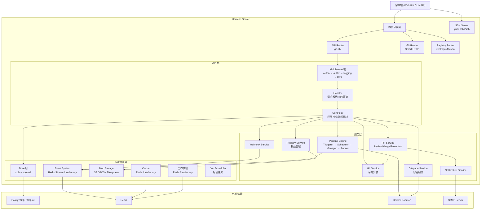
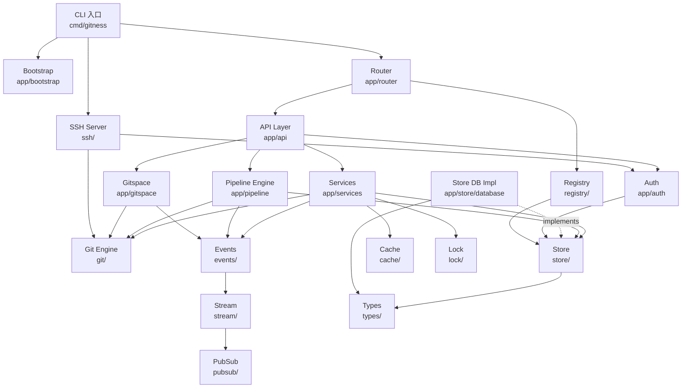
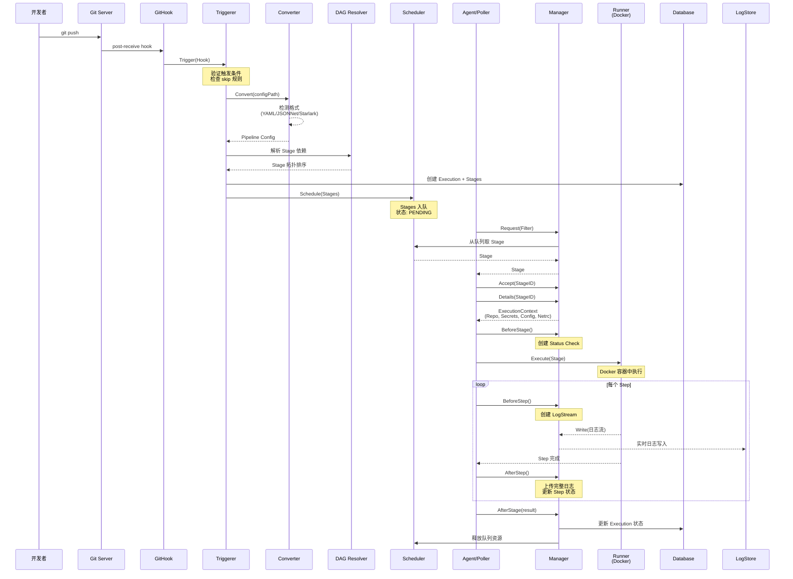
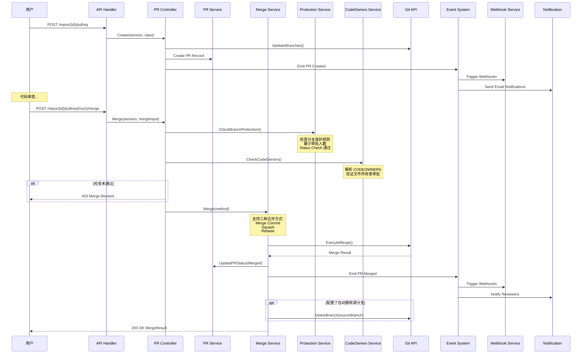

# harness/harness 源码学习笔记

> 仓库地址：[harness/harness](https://github.com/harness/harness)
> 学习日期：2026-04-05

---

> **以下为 AI 源码分析**
>
> ### 一句话概括
>
> Harness 是一个集代码托管、CI/CD Pipeline、云开发环境（Gitspace）和制品仓库（Artifact Registry）于一体的开源 DevOps 平台，是 Drone CI 的下一代演进。
>
> ### 要点速览
>
> | 核心模块 | 职责 | 关键目录 |
> |---------|------|---------|
> | API Server | RESTful API 网关，路由分发与中间件链 | `app/api/`, `app/router/` |
> | Git Engine | 代码托管，封装系统 git 命令 | `git/`, `app/githook/` |
> | Pipeline Engine | CI/CD 流水线，从触发到容器化执行 | `app/pipeline/` |
> | Artifact Registry | 多格式制品仓库（Docker/npm/Maven 等） | `registry/` |
> | Gitspace | 云开发环境，类似 GitHub Codespaces | `app/gitspace/` |
> | Store | 数据持久层，sqlx + squirrel | `store/`, `app/store/` |
> | Events | 事件驱动系统，Redis/内存 Stream | `events/`, `stream/` |
> | Auth | JWT 认证 + RBAC 授权 | `app/auth/` |
> | SSH Server | Git over SSH 支持 | `ssh/` |
> | Web UI | React + TypeScript 前端 | `web/` |

---

## 项目简介

Harness Open Source（前身为 Gitness）是一个一站式开源 DevOps 平台。它在 Drone CI 的基础上大幅扩展，提供了完整的代码托管（类似 GitHub/GitLab）、自动化 CI/CD Pipeline、云端开发环境（Gitspace）和多格式制品仓库。用户可以通过单个二进制文件（`gitness`）启动所有服务，也支持 Docker 一键部署。项目旨在为团队提供轻量级、自托管的端到端 DevOps 解决方案，替代 GitHub + Jenkins + Nexus 等多工具组合。

## 技术栈

| 类别 | 技术 |
|------|------|
| 语言 | Go 1.25（后端）、TypeScript 4.7（前端） |
| 框架 | go-chi/chi（HTTP 路由）、React 17（前端 UI） |
| 构建工具 | Make（后端）、Webpack 5（前端）、Docker multi-stage build |
| 依赖管理 | Go Modules（后端）、Yarn（前端） |
| 依赖注入 | Google Wire（编译期 DI） |
| 数据库 | PostgreSQL / SQLite3（sqlx + squirrel） |
| 缓存/消息 | Redis（Stream、PubSub、分布式锁） |
| CI 执行引擎 | drone-runner-docker（容器化执行） |
| 测试框架 | Go testing（后端）、Jest 29（前端） |
| SSH | gliderlabs/ssh（Git over SSH） |

## 目录结构

```
harness/
├── cmd/gitness/          # 程序入口，Wire 依赖注入定义
│   ├── main.go           # CLI 入口，注册所有子命令
│   ├── wire.go           # Wire DI 注入定义（75+ 组件）
│   └── wire_gen.go       # Wire 自动生成的注入代码
├── cli/                  # CLI 子命令实现
│   └── operations/       # server、migrate、swagger 等命令
├── app/                  # 核心应用层
│   ├── api/              # REST API 层
│   │   ├── handler/      # HTTP Handler（参数解析、响应渲染）
│   │   ├── controller/   # 业务控制器（权限检查、流程编排）
│   │   ├── middleware/    # 中间件（authn、authz、logging、cors）
│   │   ├── openapi/      # Swagger/OpenAPI 文档生成
│   │   └── auth/         # 资源级权限检查函数
│   ├── auth/             # 认证（authn）与授权（authz）核心
│   ├── bootstrap/        # 启动引导（创建 system principal、admin 用户）
│   ├── config/           # 配置加载（环境变量 → Config 结构体）
│   ├── router/           # 路由注册（API/Git/Registry/Web 四类路由器）
│   ├── server/           # HTTP Server 创建与 TLS 配置
│   ├── pipeline/         # CI/CD Pipeline 引擎
│   │   ├── triggerer/    # 触发器（Webhook → Execution 创建）
│   │   ├── scheduler/    # 调度器（Stage 入队、Agent 分配）
│   │   ├── manager/      # 管理器（Agent 通信、日志、状态回调）
│   │   ├── runner/       # 执行器（Docker 容器化运行）
│   │   └── converter/    # 配置转换（YAML/JSONNet/Starlark）
│   ├── gitspace/         # 云开发环境（Gitspace）
│   │   └── orchestrator/ # 容器编排、IDE 管理
│   ├── services/         # 业务服务层（30+ 子模块）
│   │   ├── webhook/      # Webhook 触发与投递
│   │   ├── pullreq/      # Pull Request 生命周期
│   │   ├── merge/        # 合并逻辑（Merge/Squash/Rebase）
│   │   ├── protection/   # 分支保护规则
│   │   ├── codeowners/   # CODEOWNERS 解析
│   │   └── notification/ # 邮件通知
│   ├── events/           # 领域事件定义（pipeline、PR、repo 等）
│   ├── store/            # Store 实现
│   │   └── database/     # 数据库 Store 实现（SQL 查询）
│   └── cron/             # 定时任务
├── git/                  # Git 操作封装层
│   ├── api/              # 高级 Git API（GetCommit、Diff、Merge）
│   └── command/          # git 命令构建器（安全的命令行拼接）
├── store/                # 顶层 Store 接口定义（41+ 接口）
├── types/                # 核心类型定义
│   └── enum/             # 枚举类型
├── registry/             # Artifact Registry（制品仓库）
│   └── app/              # Registry 独立应用层
│       ├── api/          # Registry API（OCI/npm/Maven 等协议）
│       ├── storage/      # Blob 存储（S3/GCS/Filesystem）
│       └── metadata/     # 制品元数据管理
├── events/               # 事件系统框架（Reporter/Reader/Stream）
├── stream/               # Stream 实现（Redis/InMemory）
├── pubsub/               # PubSub 发布订阅
├── ssh/                  # SSH Server（Git over SSH）
├── blob/                 # Blob 存储抽象
├── cache/                # 缓存抽象
├── encrypt/              # 加密服务
├── lock/                 # 分布式锁
├── job/                  # 后台任务框架
├── web/                  # 前端应用（React + TypeScript）
│   └── src/              # 前端源码
├── charts/               # Helm Charts
├── scripts/              # 构建和工具脚本
└── tests/                # 集成测试
```

## 架构设计

### 整体架构

Harness 采用**单体服务 + 模块化分层**的架构，所有功能打包在单个 `gitness` 二进制中，通过 go-chi 路由器将请求分发到不同的子系统。整体遵循 **Handler → Controller → Service → Store** 四层架构，业务模块间通过事件系统松耦合。



### 核心模块

#### 1. API 层 (`app/api/`)

**职责**：接收 HTTP 请求，解析参数，调用业务逻辑，返回响应。

**分层设计**：
- **Handler**（`app/api/handler/`）：纯 HTTP 处理，负责从 `*http.Request` 中提取参数、调用 Controller、通过 `render.JSON()` 返回结果
- **Controller**（`app/api/controller/`）：业务流程编排层，执行权限检查（`apiauth.CheckRepo()` 等）、调用多个 Service、组装返回数据
- **Middleware**（`app/api/middleware/`）：横切关注点，包括 `authn`（JWT/Cookie 认证）、`authz`（RBAC 授权）、`logging`（请求日志）、`cors`（跨域）、`nocache`（禁缓存）

**关键接口**：
- `repo.Controller` - 仓库 CRUD、内容读取、分支管理
- `pullreq.Controller` - PR 创建、评审、合并
- `pipeline.Controller` - 流水线 CRUD、执行
- `space.Controller` - 命名空间管理

**API 资源**（17 类）：Space、Repository、PullRequest、Pipeline、Execution、Connector、Secret、Template、Webhook、User、ServiceAccount、GitSpace、InfraProvider、Trigger、Principal、Check、System

#### 2. Pipeline 引擎 (`app/pipeline/`)

**职责**：CI/CD 流水线的完整生命周期管理——从代码推送触发到容器化执行再到结果回报。

**核心组件**：
- **Triggerer**（`app/pipeline/triggerer/`）：接收 Git Hook 事件，验证触发条件，获取配置文件，使用 DAG 解析 Stage 依赖，创建 Execution 和 Stage 记录
- **Converter**（`app/pipeline/converter/`）：支持 YAML、JSONNet、Starlark 三种配置格式的转换
- **Scheduler**（`app/pipeline/scheduler/`）：内存队列 + 分布式锁，Agent 通过 Filter（OS/Arch/Labels）拉取任务
- **Manager**（`app/pipeline/manager/`）：Agent 通信协议（Request → Accept → Details → Before/AfterStage → Before/AfterStep），管理日志流和执行上下文
- **Runner**（`app/pipeline/runner/`）：基于 drone-runner-docker，在 Docker 容器中编译和执行 Pipeline

**关键数据流**：
```
Git Push → Triggerer.Trigger() → Converter 转换配置 → DAG 解析 →
创建 Execution/Stages → Scheduler 入队 → Agent.Request() →
Manager.Accept() → Runner 容器执行 → 日志流式上报 → Stage 完成回调
```

#### 3. Git 操作层 (`git/`)

**职责**：封装所有 Git 操作，提供安全的命令行构建和高级 API。

**架构**：两层封装
- **Command 层**（`git/command/`）：安全的 git 命令构建器，通过 `PostSepArgs` 防止命令注入，支持 `GIT_CONFIG_COUNT` 环境变量动态配置
- **API 层**（`git/api/`）：高级接口如 `GetTreeNode()`、`GetBlob()`、`GetCommit()`、`GetDiff()`、`Merge()`

**设计选择**：使用系统 git 命令而非 go-git 库，优点是兼容性强、支持最新 git 特性、性能更好（原生 git 命令经过高度优化）。

#### 4. Artifact Registry (`registry/`)

**职责**：多格式制品仓库，支持 11 种制品类型。

**支持格式**：Docker (OCI)、npm、Maven、Python (PyPI)、NuGet、RPM、Cargo、Go Module、Helm、HuggingFace、Generic

**分层架构**：
- **API/Handler 层**（`registry/app/api/handler/`）：按制品格式分独立 handler（oci/、npm/、maven/ 等）
- **Metadata 层**（`registry/app/metadata/`）：制品元数据管理
- **Storage 层**（`registry/app/storage/`）：Blob 存储抽象，支持断点续传、302 重定向
- **Driver 层**（`registry/app/driver/`）：存储驱动（s3-aws/、gcs/、filesystem/）

#### 5. Gitspace (`app/gitspace/`)

**职责**：云开发环境，类似 GitHub Codespaces，提供容器化的远程 IDE。

**核心组件**：
- **Orchestrator**（`app/gitspace/orchestrator/`）：编排容器生命周期（创建、启动、停止、删除）
- **Container Orchestrator**：管理 Docker 容器（拉取镜像、挂载代码、注入环境变量）
- **IDE Factory**：支持 VSCode Web、VSCode Desktop、Cursor、Windsurf、IntelliJ 等 IDE
- **SCM**（`app/gitspace/scm/`）：仓库克隆与分支检出
- **Secret**（`app/gitspace/secret/`）：凭证注入

#### 6. 事件系统 (`events/`, `stream/`)

**职责**：模块间的异步通信，实现松耦合的事件驱动架构。

**设计**：Pub/Sub 模式
- **Reporter**：事件发布者，使用 gob 编码将事件序列化后写入 Stream
- **Reader**：事件消费者，从 Stream 读取并反序列化
- **Stream 后端**：Redis Stream（生产）/ InMemory（开发）
- **事件分类**：pipeline、pullreq、repo、user、gitspace、check、rule 等

#### 7. Store 层 (`store/`, `app/store/`)

**职责**：数据持久化抽象，按资源拆分为 41+ 个细粒度接口。

**技术选型**：sqlx（轻量 SQL 包装）+ squirrel（SQL 构建器），不使用重 ORM
- **迁移方案**：SQL 文件 + Go 代码混合迁移（`app/store/database/migrate/`），分别维护 PostgreSQL 和 SQLite 脚本
- **设计特性**：软删除（`Deleted *int64`）、乐观锁（`Version int64`）、事务支持（`dbtx` 包）

### 模块依赖关系



## 核心流程

### 流程一：Pipeline CI/CD 执行流程

一个完整的 CI/CD Pipeline 从代码推送到执行完成的调用链：



**关键设计**：
1. **Triggerer** 负责将 Git 事件转化为 Execution 对象，同时解析 DAG 依赖确保 Stage 按正确顺序执行
2. **Converter** 支持三种配置格式（YAML/JSONNet/Starlark），JSONNet 和 Starlark 可动态生成 Pipeline 配置
3. **Scheduler** 使用内存队列 + 分布式锁，Agent 通过 Filter 机制匹配兼容的 Stage（按 OS/Arch/Labels 过滤）
4. **Manager** 为每次执行生成临时 JWT token（72h 有效，Contributor 角色），注入到 Netrc 中供容器内 git 操作使用
5. **Runner** 基于 drone-runner-docker，在隔离的 Docker 容器中执行每个 Step

### 流程二：Pull Request 合并流程

从 PR 创建到合并的完整流程，涉及分支保护、代码审查、自动合并等机制：



**关键设计**：
1. **分支保护规则**（`app/services/protection/`）：支持 Glob/Globstar 模式匹配分支名，可配置最少审批人数、必须通过的 Status Check、禁止 Force Push 等
2. **CODEOWNERS**（`app/services/codeowners/`）：解析 CODEOWNERS 文件（兼容 GitHub 格式），自动识别文件变更涉及的所有者并验证审批状态
3. **合并方法**：支持 Merge Commit、Squash、Rebase 三种方式，均通过 Git API 层执行原生 git 操作
4. **事件驱动**：PR 的每个状态变更都通过 Event System 触发 Webhook 投递和邮件通知，实现模块解耦

## 关键设计亮点

### 1. Google Wire 编译期依赖注入

**解决的问题**：75+ 个组件的依赖关系管理，避免手工构造对象图。

**实现方式**：在 `cmd/gitness/wire.go` 中声明 `initSystem` 函数的依赖关系，Wire 在编译期自动生成 `wire_gen.go`，包含完整的对象构造代码。每个子模块通过 `WireSet` 暴露其 Provider。

**设计优势**：
- 编译期检查依赖完整性，消除运行时 DI 的反射开销和延迟报错
- 类型安全，IDE 可以直接跳转到 Provider 定义
- 与 Go 的简洁哲学一致，生成的代码可读可调试

### 2. 四层 API 分层（Handler → Controller → Service → Store）

**解决的问题**：将 HTTP 协议处理与业务逻辑完全解耦，使得同一业务逻辑可被 REST API、SSH、内部调用等多种入口复用。

**实现方式**：
- **Handler**（`app/api/handler/`）：只做 HTTP 参数提取和响应渲染，不含业务逻辑
- **Controller**（`app/api/controller/`）：编排权限检查和业务调用，是唯一的权限边界
- **Service**（`app/services/`）：纯业务逻辑，可被多个 Controller 复用
- **Store**（`store/`）：按资源拆分的 41+ 个数据访问接口

**设计优势**：关注点分离清晰，单元测试可以 mock 任意一层；Store 接口的细粒度拆分避免了"God Interface"问题。

### 3. 系统 Git 命令封装而非 go-git

**解决的问题**：需要完整的 git 功能支持（包括最新特性），同时要防止命令注入。

**实现方式**：`git/command/command.go` 构建器模式，通过 `PostSepArgs`（`--` 分隔符后的参数）处理不可信输入，使用 `GIT_CONFIG_COUNT` 环境变量动态注入配置而非修改全局 gitconfig。

**设计优势**：
- 利用原生 git 的高性能和完整功能
- `PostSepArgs` 机制天然防止路径/参数被解释为 flag
- Action 字段强制正则校验（`^[[:alnum:]]+[-[:alnum:]]*$`），阻止命令注入

### 4. 事件系统的双后端抽象

**解决的问题**：生产环境需要 Redis 持久化事件流，而开发/测试环境不想依赖外部服务。

**实现方式**：`events/` 包定义 Reporter/Reader 泛型接口，`stream/` 包提供 Redis Stream 和 InMemory 两种实现，通过 `Config.Events.Mode` 切换。事件使用 gob 编码，Stream ID 格式为 `events:{category}:{event_type}`。

**设计优势**：开发者零依赖启动（SQLite + InMemory），生产部署切换到 PostgreSQL + Redis 只需改环境变量，代码无需修改。

### 5. Registry 多格式制品仓库的统一架构

**解决的问题**：需要支持 11 种制品格式（Docker、npm、Maven 等），每种格式有不同的协议规范，但底层存储和权限管理需要统一。

**实现方式**：`registry/` 作为独立的子应用层，按制品格式拆分 Handler（OCI/npm/Maven 等），但共享统一的 Storage Driver 层（S3/GCS/Filesystem）和 Metadata 层。每种格式实现自己的协议适配器，通过路由分发到对应的 Handler。

**设计优势**：
- 新增制品格式只需实现 Handler + Metadata，无需修改存储层
- 统一的 Blob 存储支持断点续传和 302 重定向，提升大文件传输效率
- 权限模型与主平台复用，无需独立的认证体系
