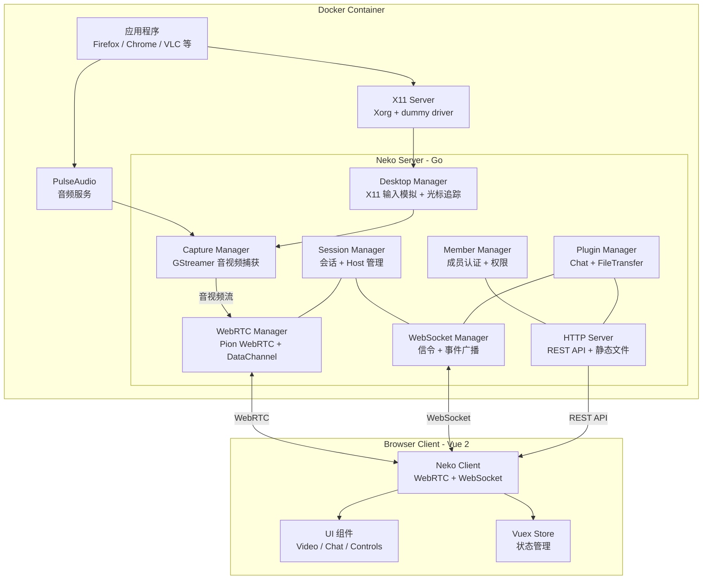
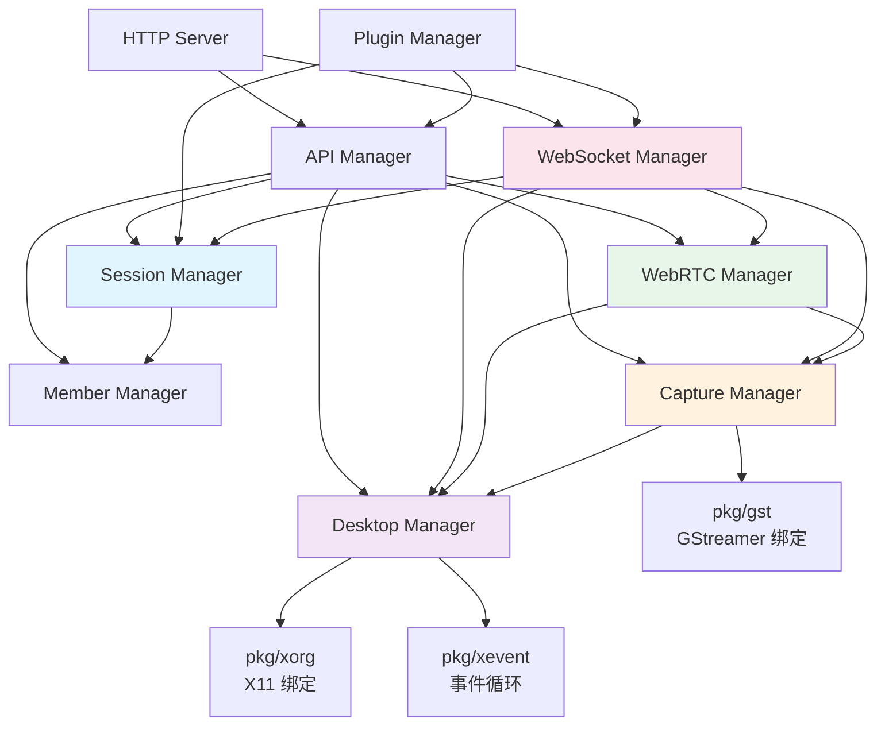
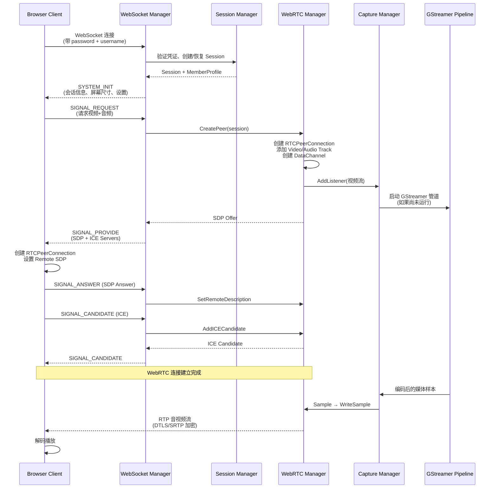
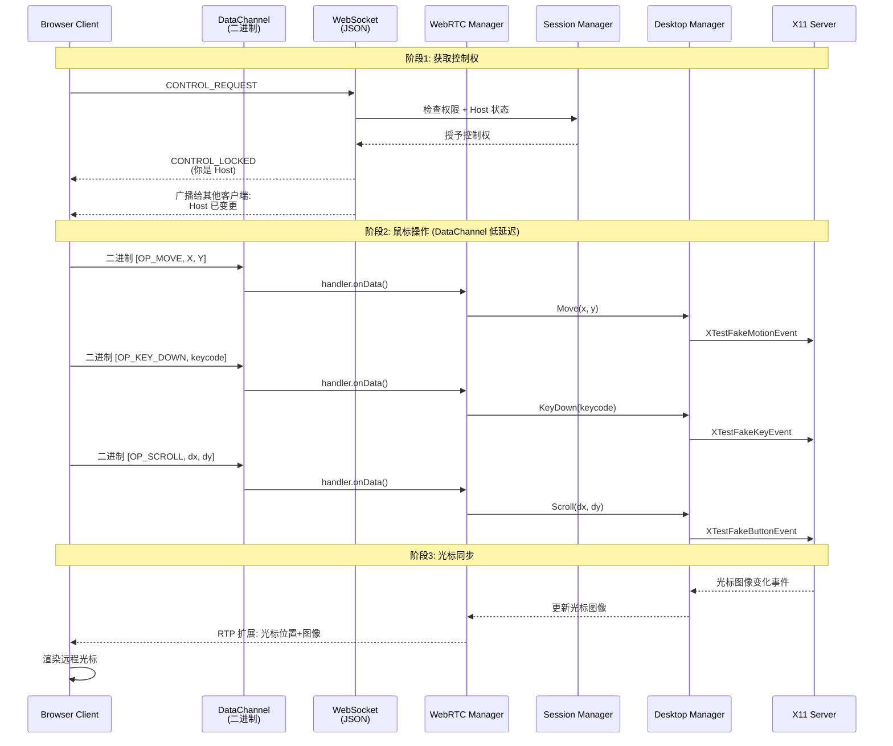
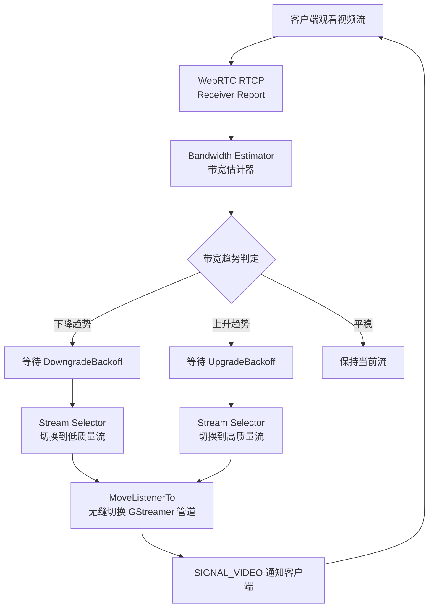

# neko 源码学习笔记

> 仓库地址：[neko](https://github.com/m1k1o/neko)
> 学习日期：2026-04-05

---

> **以下为 AI 源码分析**
>
> ### 一句话概括
>
> neko 是一个基于 Docker + WebRTC 的自托管虚拟浏览器/远程桌面系统，支持多人同时观看和交互控制。
>
> ### 要点速览
>
> | 核心模块 | 职责 | 关键文件 |
> |---------|------|---------|
> | Server (Go) | WebRTC 信令、会话管理、媒体捕获、桌面控制 | `server/cmd/serve.go`, `server/internal/` |
> | Client (Vue 2) | WebRTC 播放、输入捕获、UI 交互 | `client/src/neko/`, `client/src/components/` |
> | Runtime (Docker) | X11 桌面环境、PulseAudio 音频、supervisord 进程管理 | `runtime/Dockerfile`, `runtime/supervisord.conf` |
> | Plugin System | Chat、文件传输等可扩展功能 | `server/internal/plugins/` |
> | Apps | 各类浏览器和应用的 Docker 镜像配置 | `apps/firefox/`, `apps/chromium/` 等 |

---

## 项目简介

neko 是一个自托管的虚拟浏览器/远程桌面解决方案。它在 Docker 容器中运行完整的 Linux 桌面环境（X11 + PulseAudio），通过 GStreamer 捕获屏幕和音频，经由 WebRTC 以低延迟流式传输到浏览器客户端。核心价值在于：**多人可以同时连接同一个虚拟桌面，一个人操作、所有人实时观看**，非常适合 Watch Party、协同浏览、远程教学、安全浏览等场景。与传统 VNC/RDP 方案相比，neko 基于 WebRTC 提供了更流畅的视频体验和内置的音频支持。

## 技术栈

| 类别 | 技术 |
|------|------|
| 语言 | Go 1.24 (服务端), TypeScript 4.8 (客户端) |
| 框架 | chi (HTTP Router), Vue 2.7 + Vuex 3 (前端) |
| 构建工具 | Go build, Vue CLI 5, Docker multi-stage build |
| 依赖管理 | Go Modules, npm |
| 媒体引擎 | GStreamer (音视频编解码), Pion WebRTC v3 |
| 桌面环境 | X11 (Xorg + dummy driver), PulseAudio, supervisord |
| 测试框架 | Go test (服务端), ESLint (客户端) |

## 目录结构

```
neko/
├── server/                          # Go 服务端
│   ├── cmd/                         # CLI 入口 (cobra)
│   │   ├── neko/main.go            # 程序入口
│   │   ├── root.go                 # 配置加载、日志初始化
│   │   └── serve.go                # 核心启动命令，编排所有 Manager
│   ├── internal/                    # 内部模块
│   │   ├── capture/                # GStreamer 媒体捕获 (音视频编码)
│   │   ├── webrtc/                 # WebRTC Peer 管理、DataChannel
│   │   ├── websocket/              # WebSocket 信令和事件处理
│   │   ├── desktop/                # X11 桌面交互 (输入模拟、剪贴板)
│   │   ├── session/                # 会话生命周期管理
│   │   ├── member/                 # 成员认证 (multiuser/file/noauth)
│   │   ├── http/                   # HTTP 服务器和路由
│   │   ├── api/                    # REST API 端点
│   │   ├── config/                 # 配置结构定义
│   │   └── plugins/                # 插件系统 (chat, filetransfer)
│   └── pkg/                        # 公共包
│       ├── types/                  # 核心接口和类型定义
│       ├── gst/                    # GStreamer C 绑定
│       ├── xorg/                   # X11 C 绑定
│       ├── xevent/                 # X11 事件循环
│       ├── xinput/                 # 输入驱动管理
│       ├── auth/                   # HTTP 认证中间件
│       └── drop/                   # 文件拖拽支持
├── client/                          # Vue 2 + TypeScript 客户端
│   └── src/
│       ├── neko/                   # 核心通信层 (WebRTC + WebSocket)
│       ├── components/             # UI 组件 (video, chat, controls 等)
│       ├── store/                  # Vuex 状态管理 (8 个 modules)
│       ├── locale/                 # 国际化 (16 种语言)
│       └── utils/                  # 工具函数 (键盘处理等)
├── runtime/                         # Docker 运行时环境
│   ├── Dockerfile                  # 基础镜像 (Debian + X11 + PulseAudio)
│   ├── supervisord.conf            # 进程管理配置
│   └── xorg.conf                   # X Server 配置
├── apps/                            # 各应用 Docker 配置
│   ├── firefox/                    # Firefox 浏览器
│   ├── chromium/                   # Chromium 浏览器
│   ├── google-chrome/              # Google Chrome
│   └── ...                         # 更多浏览器和应用
├── Dockerfile.tmpl                  # 多阶段构建模板
├── docker-compose.yaml              # 快速启动配置
└── config.yml                       # 默认配置文件
```

## 架构设计

### 整体架构

neko 采用典型的 **客户端-服务端** 架构，服务端运行在 Docker 容器中，包含完整的 Linux 桌面环境。服务端通过 GStreamer 管道捕获 X11 屏幕和 PulseAudio 音频，编码后通过 WebRTC 推送给客户端。客户端捕获用户的鼠标/键盘输入，通过 WebRTC DataChannel（低延迟二进制协议）或 WebSocket（JSON 信令）发送回服务端，服务端通过 X11 API 模拟输入操作。



### 核心模块

#### 1. Desktop Manager（桌面管理）

**职责**：连接 X11 Display，模拟鼠标/键盘输入，追踪光标位置和图像，管理剪贴板和文件拖拽。

**核心文件**：
- `server/internal/desktop/manager.go` — 主管理器，初始化 X11 连接
- `server/internal/desktop/xorg.go` — X11 基础操作封装（Move、KeyPress、ButtonPress）
- `server/internal/desktop/xevent.go` — X11 事件循环，监听光标变化和剪贴板事件
- `server/internal/desktop/clipboard.go` — 剪贴板读写（文本和二进制）
- `server/internal/desktop/drop.go` — 文件拖拽模拟（通过 xdotool）
- `server/pkg/xorg/xorg.go` — X11 C FFI 绑定（libX11、libXrandr、libXtst）

**关键接口**：
```go
type DesktopManager interface {
    Move(x, y int)                              // 移动光标
    Scroll(deltaX, deltaY int, controlKey bool) // 滚轮滚动
    ButtonDown(code uint32) / ButtonUp(code uint32)
    KeyDown(codes ...uint32) / KeyUp(codes ...uint32)
    GetScreenSize() ScreenSize
    SetScreenSize(ScreenSize) (ScreenSize, error)
    GetCursorImage() *CursorImage               // 获取光标图像
    ClipboardGetText() / ClipboardSetText()
    DropFiles(x, y int, files []string) bool
}
```

#### 2. Capture Manager（媒体捕获）

**职责**：通过 GStreamer 管道捕获 X11 屏幕和 PulseAudio 音频，编码为 H.264/VP8/Opus 等格式，支持多质量流、RTMP 广播和屏幕截图。

**核心文件**：
- `server/internal/capture/manager.go` — 主协调器，管理所有媒体流
- `server/internal/capture/streamsink.go` — 单个媒体流的 GStreamer 管道管理和样本分发
- `server/internal/capture/streamselector.go` — 多质量流选择器（自适应码率）
- `server/internal/capture/broadcast.go` — RTMP 广播推流
- `server/internal/capture/screencast.go` — JPEG 屏幕截图
- `server/pkg/gst/` — GStreamer C 绑定

**架构**：支持配置多个不同分辨率/码率的视频管道（如 1080p/720p/480p），每个客户端可以根据带宽自动选择最合适的流。

#### 3. WebRTC Manager

**职责**：管理 WebRTC Peer Connection 的创建、SDP 协商、ICE 候选交换、媒体轨道绑定和 DataChannel 通信。

**核心文件**：
- `server/internal/webrtc/manager.go` — 主管理器，ICE 配置、TCP/UDP Mux
- `server/internal/webrtc/peer.go` — 单个 Peer 连接生命周期
- `server/internal/webrtc/handler.go` — DataChannel 二进制消息处理（鼠标/键盘事件）
- `server/internal/webrtc/track.go` — 媒体轨道（WriteSample 写入编码数据）
- `server/internal/webrtc/metrics.go` — Prometheus 性能指标和带宽估计

**关键设计**：
- **DataChannel** 用于低延迟的鼠标/键盘输入传输（二进制格式）
- **带宽估计器（Estimator）**：基于 RTCP Receiver Report 自动调整视频质量
- **ICE Lite 模式**：简化 NAT 穿透，适合服务端部署

#### 4. WebSocket Manager

**职责**：管理 WebSocket 连接，处理信令消息（WebRTC SDP/ICE 交换）和控制事件（控制权、屏幕设置、剪贴板），广播系统事件给所有连接的客户端。

**核心文件**：
- `server/internal/websocket/manager.go` — 连接管理和心跳
- `server/internal/websocket/peer.go` — 单个 WebSocket 客户端
- `server/internal/websocket/handler/` — 按功能划分的消息处理器：
  - `signal.go` — WebRTC 信令（Offer/Answer/Candidate）
  - `control.go` — 控制权管理（Request/Release/Give）
  - `screen.go` — 屏幕分辨率设置
  - `clipboard.go` — 剪贴板同步
  - `session.go` — 会话事件
  - `system.go` — 系统初始化和心跳

#### 5. Session Manager（会话管理）

**职责**：管理用户会话的完整生命周期，包括创建、连接、断开、删除，以及 Host 控制权的分配和转移。

**核心文件**：
- `server/internal/session/manager.go` — 会话管理主逻辑
- `server/internal/session/session.go` — 单个会话实体
- `server/internal/session/auth.go` — Token/Cookie 认证

**关键机制**：
- **Implicit Hosting**：所有用户自动获得控制权
- **Explicit Hosting**：需要请求-批准流程
- **Merciful Reconnect**：5 秒内重连不清理会话状态

#### 6. Plugin System（插件系统）

**职责**：提供可扩展的功能框架，支持外部 `.so` 插件和内置插件，自动解析依赖关系。

**核心文件**：
- `server/internal/plugins/manager.go` — 插件加载和生命周期管理
- `server/internal/plugins/dependency.go` — DAG 拓扑排序依赖解析
- `server/internal/plugins/chat/` — 内置 Chat 插件
- `server/internal/plugins/filetransfer/` — 内置文件传输插件

**插件接口**：
```go
type Plugin interface {
    Name() string
    Config() PluginConfig
    Start(PluginManagers) error
    Shutdown() error
}
```

#### 7. Client - Neko Core（客户端通信核心）

**职责**：封装 WebRTC 和 WebSocket 连接逻辑，处理信令协商、媒体流接收和用户输入发送。

**核心文件**：
- `client/src/neko/base.ts` — BaseClient 基类（WebRTC 创建、DataChannel、消息路由）
- `client/src/neko/index.ts` — NekoClient 主类（事件处理、Store 同步）
- `client/src/neko/data.ts` — DataChannel 二进制协议定义
- `client/src/neko/events.ts` — 事件常量定义

#### 8. Client - Video Component（视频组件）

**职责**：核心 UI 组件，负责视频播放、鼠标/键盘输入捕获和坐标转换、全屏控制。

**核心文件**：
- `client/src/components/video.vue` — 820 行核心组件
- `client/src/utils/guacamole-keyboard.ts` — 跨平台键盘事件标准化
- `client/src/store/video.ts` — 视频状态管理
- `client/src/store/remote.ts` — 远程控制状态管理

### 模块依赖关系



## 核心流程

### 流程一：WebRTC 连接建立与媒体流传输

这是 neko 最核心的流程——客户端如何与服务端建立 WebRTC 连接并开始接收音视频流。



**关键步骤说明**：
1. 客户端通过 WebSocket 连接并携带认证信息，服务端验证后创建会话
2. 客户端发送 `SIGNAL_REQUEST` 请求媒体流
3. 服务端创建 `RTCPeerConnection`，绑定视频/音频 Track 和 DataChannel
4. 通过 WebSocket 交换 SDP Offer/Answer 和 ICE Candidate 完成信令协商
5. GStreamer 管道持续捕获 X11 屏幕，编码后的样本通过 `WriteSample` 写入 WebRTC Track
6. 客户端浏览器原生解码 WebRTC 流并播放

### 流程二：用户输入控制流程

用户如何获得控制权并远程操作虚拟桌面。



**关键设计**：
1. **双通道通信**：高频鼠标/键盘输入走 DataChannel（二进制、低延迟），控制权管理等低频操作走 WebSocket（JSON）
2. **DataChannel 二进制协议**：`[1字节操作码 + 2字节数据长度 + N字节数据]`，比 JSON 高效得多
3. **坐标转换**：客户端将浏览器视口坐标按比例转换为远程桌面分辨率坐标
4. **光标追踪**：服务端独立线程监听 X11 光标变化事件，通过 RTP 扩展头发送给客户端

### 流程三：自适应码率切换



## 关键设计亮点

### 1. DataChannel 二进制输入协议

**解决的问题**：远程桌面对输入延迟极其敏感，鼠标移动频率可达 60Hz+，使用 JSON over WebSocket 会引入不必要的序列化开销和延迟。

**实现方式**：通过 WebRTC DataChannel 传输紧凑的二进制数据。操作码仅 1 字节，鼠标移动只需 7 字节（1 操作码 + 2 长度 + 4 坐标），比等价的 JSON 消息（~50 字节）小 7 倍。

```
客户端 (client/src/neko/base.ts):
  OP_MOVE:   [0x01] [len:2B] [x:2B] [y:2B]     = 7 bytes
  OP_SCROLL: [0x02] [len:2B] [dx:2B] [dy:2B]    = 7 bytes
  OP_KEY:    [0x03] [len:2B] [keycode:8B]        = 11 bytes

服务端 (server/internal/webrtc/handler.go):
  解析二进制 → 调用 DesktopManager 对应方法
```

**为什么这样设计**：DataChannel 基于 SCTP 协议，天然支持可靠/不可靠传输切换，且走 P2P 连接不经过 HTTP 服务器，延迟最低。

### 2. 多质量流自适应传输

**解决的问题**：不同网络环境的用户需要不同的视频质量，固定码率会导致弱网用户卡顿或强网用户画质浪费。

**实现方式**（`server/internal/capture/streamselector.go`）：
- 服务端同时维护多个 GStreamer 管道（如 1080p@5Mbps、720p@2.5Mbps、480p@1Mbps）
- 每个管道独立编码，客户端订阅其中一个
- `StreamSelector` 根据 RTCP Receiver Report 的带宽估计，自动通过 `MoveListenerTo()` 将客户端从一个流无缝迁移到另一个
- 管道按需启停：没有订阅者时自动停止 GStreamer 管道以节省 CPU

**为什么这样设计**：相比单流动态调参（需要重新协商 WebRTC），多流切换更快、更稳定，且不同客户端可以独立选择流。

### 3. 插件化架构与 DAG 依赖解析

**解决的问题**：核心功能（如 Chat、文件传输）需要与 WebSocket/API 层深度集成，但又不应该硬编码在核心代码中。

**实现方式**（`server/internal/plugins/`）：
- 插件实现 `Plugin` 接口（Name/Config/Start/Shutdown）
- 可选实现 `DependablePlugin`（声明依赖其他插件）和 `ExposablePlugin`（向其他插件暴露服务）
- 插件管理器使用 DAG 拓扑排序（`dependency.go`）确保启动顺序正确
- 插件通过 `PluginManagers` 获取 API Router、WebSocket Handler 等系统服务进行注册
- 支持外部 `.so` 动态链接库加载

**为什么这样设计**：保持核心精简，功能可按需加载。第三方开发者可以编写自己的插件（如自定义认证、录制等）而无需修改核心代码。

### 4. Manager 模式 + 事件驱动的模块编排

**解决的问题**：系统包含 9 个核心模块，模块间有复杂的依赖关系，需要有序启动和优雅关闭。

**实现方式**（`server/cmd/serve.go`）：
- 每个模块封装为 `XxxManagerCtx`，统一实现 `Start()` / `Shutdown()` 生命周期
- `serve.go` 按依赖顺序创建和启动所有 Manager：Session → Member → Desktop → Capture → WebRTC → WebSocket → Plugins → API → HTTP
- 关闭时严格逆序
- 模块间通过事件（`kataras/go-events`）松耦合通信，避免循环依赖

**为什么这样设计**：Manager 模式提供清晰的职责边界和生命周期管理，事件驱动避免模块间的强依赖，使系统易于理解和维护。

### 5. 跨平台键盘输入标准化

**解决的问题**：不同浏览器和操作系统的键盘事件差异巨大（尤其是 macOS），需要统一映射为 X11 keysym。

**实现方式**（`client/src/utils/guacamole-keyboard.ts` + `client/src/components/video.vue`）：
- 使用 Apache Guacamole 键盘库处理浏览器原生键盘事件，输出标准化的 X11 keysym
- 客户端额外处理 macOS 特殊键位映射：Cmd → Ctrl、Win → Alt、Alt → Alt Gr
- 服务端 `DesktopManager` 直接将 keysym 通过 `XTestFakeKeyEvent` 注入 X11

**为什么这样设计**：Guacamole 键盘库是经过多年实战验证的跨平台方案，X11 keysym 作为中间表示层统一了客户端（浏览器各异）和服务端（X11 标准）之间的键盘语义。
