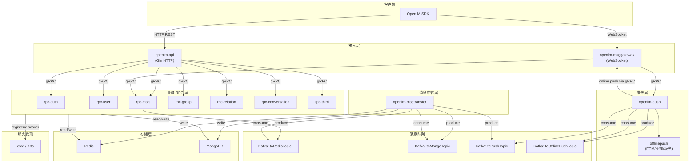
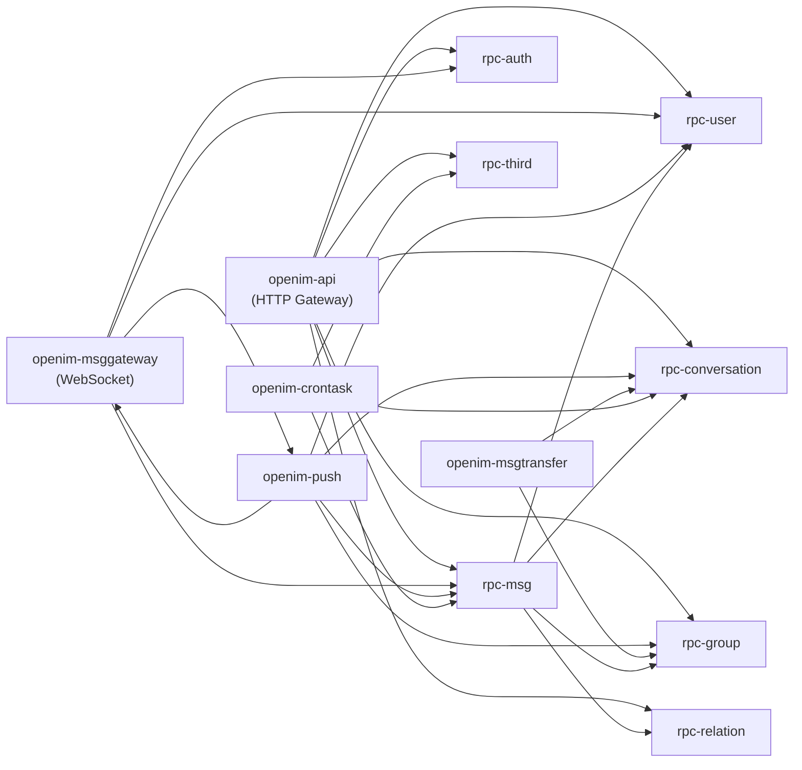
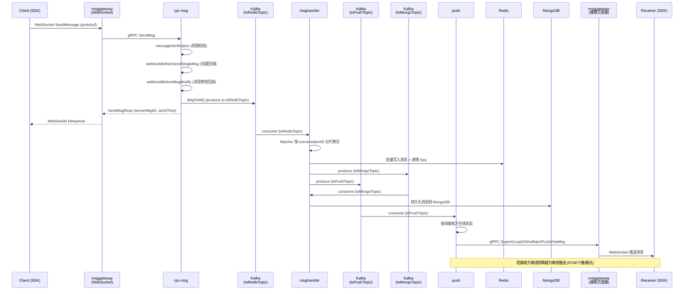
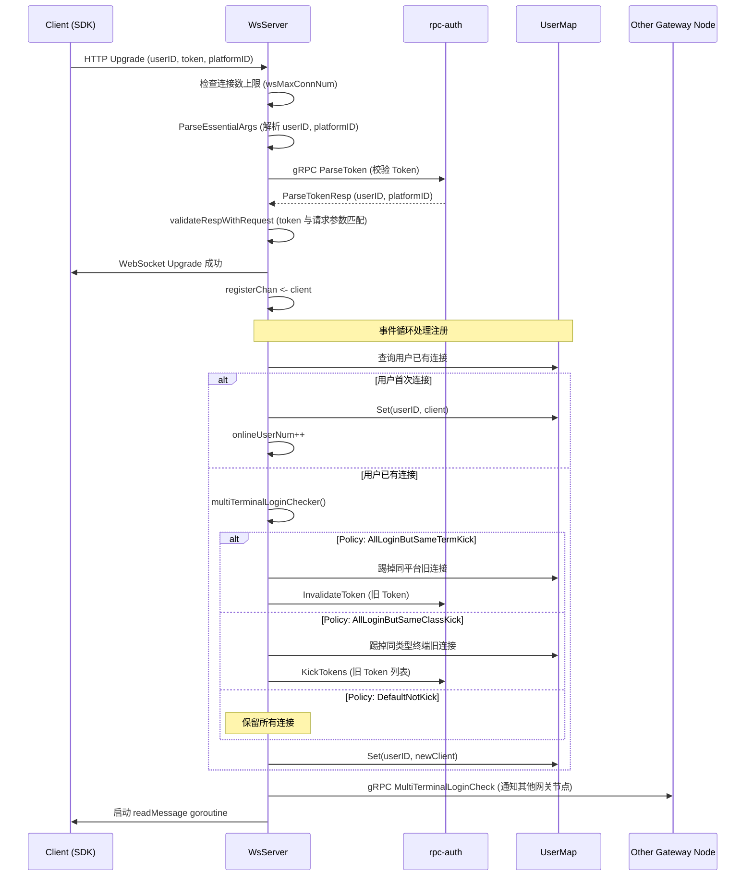

# open-im-server 源码学习笔记

> 仓库地址：[open-im-server](https://github.com/openimsdk/open-im-server)
> 学习日期：2026-04-05

---

> **以下为 AI 源码分析**
>
> ### 一句话概括
>
> OpenIM Server 是一个基于 Go 微服务架构的开源即时通讯服务端，通过 Kafka 消息队列异步解耦消息投递流程，为开发者提供可嵌入应用的 IM 基础设施。
>
> ### 要点速览
>
> | 核心模块 | 职责 | 关键文件 |
> |---------|------|---------|
> | openim-api | HTTP REST API 网关，路由请求到各 RPC 服务 | `internal/api/router.go`, `internal/api/init.go` |
> | openim-msggateway | WebSocket 长连接网关，管理客户端连接与在线状态 | `internal/msggateway/ws_server.go`, `internal/msggateway/hub_server.go` |
> | openim-msgtransfer | 消息中转服务，消费 Kafka 消息写入 Redis/MongoDB | `internal/msgtransfer/init.go`, `internal/msgtransfer/online_history_msg_handler.go` |
> | openim-push | 消息推送服务，在线推送 + 离线推送（FCM/个推/极光） | `internal/push/push_handler.go`, `internal/push/onlinepusher.go` |
> | openim-rpc-msg | 消息核心 RPC，处理发送/撤回/已读等消息操作 | `internal/rpc/msg/server.go`, `internal/rpc/msg/send.go` |
> | openim-rpc-user | 用户管理 RPC，注册/信息查询/在线状态 | `internal/rpc/user/user.go` |
> | openim-rpc-group | 群组管理 RPC，创建/解散/成员管理 | `internal/rpc/group/group.go` |
> | openim-rpc-relation | 好友关系 RPC，申请/黑名单/好友列表 | `internal/rpc/relation/` |
> | openim-rpc-conversation | 会话管理 RPC，会话列表/未读数/免打扰 | `internal/rpc/conversation/` |
> | openim-crontask | 定时任务，清理过期消息与 S3 对象 | `internal/tools/cron/cron_task.go` |

---

## 项目简介

OpenIM Server 是一套面向开发者的开源即时通讯（IM）服务端解决方案。与 Telegram、Signal 等独立聊天应用不同，OpenIM 的定位是**可嵌入的 IM 基础设施**——开发者通过 OpenIM SDK + OpenIM Server 将即时通讯能力集成到自有应用中。

核心价值：
- **微服务架构**：支持集群部署，各服务独立扩缩容，适配百万级用户和十亿级消息场景
- **完整 IM 能力**：覆盖单聊、群聊、消息推送、好友关系、会话管理等即时通讯全链路
- **可扩展性**：通过 REST API 和 Webhook 机制，业务系统可灵活扩展 IM 功能
- **多端支持**：配合 OpenIM SDK（Go/iOS/Android/Web），支持多平台多终端登录策略

## 技术栈

| 类别 | 技术 |
|------|------|
| 语言 | Go 1.25+ |
| 框架 | Gin (HTTP), gRPC (RPC), gorilla/websocket (WebSocket) |
| 构建工具 | Mage (Go-based build tool) |
| 依赖管理 | Go Modules |
| 测试框架 | Go testing + stretchr/testify |
| 消息队列 | Kafka (IBM/sarama) |
| 数据库 | MongoDB (go.mongodb.org/mongo-driver) |
| 缓存 | Redis (go-redis/v9) + rockscache |
| 服务发现 | etcd / Kubernetes / Standalone |
| 监控 | Prometheus + Grafana |
| 离线推送 | FCM (Firebase) / 个推 (GeTui) / 极光 (JPush) |
| 容器化 | Docker, Kubernetes |

## 目录结构

```
open-im-server/
├── cmd/                          # 各服务独立入口（可独立部署模式）
│   ├── main.go                   # 单进程统一入口（Standalone 模式）
│   ├── openim-api/               # REST API 网关入口
│   ├── openim-msggateway/        # WebSocket 长连接网关入口
│   ├── openim-msgtransfer/       # 消息中转服务入口
│   ├── openim-push/              # 推送服务入口
│   ├── openim-crontask/          # 定时任务服务入口
│   ├── openim-cmdutils/          # 命令行工具入口
│   └── openim-rpc/               # 各 RPC 服务独立入口
│       ├── openim-rpc-auth/
│       ├── openim-rpc-user/
│       ├── openim-rpc-group/
│       ├── openim-rpc-msg/
│       ├── openim-rpc-friend/
│       ├── openim-rpc-conversation/
│       └── openim-rpc-third/
├── internal/                     # 各服务核心业务实现
│   ├── api/                      # HTTP API 层：路由、Handler、中间件
│   ├── msggateway/               # WebSocket 网关：连接管理、消息分发
│   ├── msgtransfer/              # 消息中转：Kafka 消费、Redis/Mongo 写入
│   ├── push/                     # 推送服务：在线推送 + 离线推送
│   │   └── offlinepush/          # 离线推送实现（FCM/个推/极光）
│   ├── rpc/                      # 各业务 RPC 服务实现
│   │   ├── auth/                 # 认证：Token 签发与校验
│   │   ├── user/                 # 用户管理
│   │   ├── group/                # 群组管理
│   │   ├── relation/             # 好友关系
│   │   ├── msg/                  # 消息处理核心
│   │   ├── conversation/         # 会话管理
│   │   ├── third/                # 第三方服务（S3、日志）
│   │   └── incrversion/          # 增量版本同步
│   └── tools/cron/               # 定时清理任务
├── pkg/                          # 公共包
│   ├── common/                   # 通用模块
│   │   ├── config/               # 配置定义与解析
│   │   ├── storage/              # 存储层抽象
│   │   │   ├── cache/            # 缓存接口与 Redis/MongoDB 实现
│   │   │   ├── controller/       # 数据库控制器（业务逻辑与存储间的桥梁）
│   │   │   └── database/mgo/     # MongoDB 数据模型
│   │   ├── prommetrics/          # Prometheus 指标定义
│   │   └── webhook/              # Webhook 客户端
│   ├── rpccache/                 # RPC 结果本地缓存
│   ├── rpcli/                    # RPC 客户端封装
│   ├── msgprocessor/             # 消息处理工具
│   ├── notification/             # 通知发送器
│   ├── dbbuild/                  # 数据库连接构建器
│   └── mqbuild/                  # 消息队列构建器
├── config/                       # YAML 配置文件
├── tools/                        # 辅助工具（压测、S3 管理、seq 修复等）
├── test/                         # 测试（e2e、压测、webhook 测试）
├── magefile.go                   # Mage 构建脚本（Build/Start/Stop）
├── start-config.yml              # 服务实例数配置
└── Dockerfile                    # Docker 构建文件
```

## 架构设计

### 整体架构

OpenIM Server 采用**微服务 + 消息队列异步解耦**的架构设计。客户端通过 WebSocket 长连接或 HTTP REST API 接入，服务端内部通过 gRPC 进行服务间调用，通过 Kafka 实现消息的异步流转。

核心设计思路：
1. **接入层**：openim-api (HTTP) + openim-msggateway (WebSocket) 双通道接入
2. **业务 RPC 层**：各业务领域独立为 gRPC 微服务，通过服务发现（etcd/K8s）互相调用
3. **消息流转层**：Kafka 作为消息总线，解耦消息发送、存储、推送三个环节
4. **存储层**：MongoDB 持久化 + Redis 缓存加速，支持 MongoDB-only 模式
5. **推送层**：在线推送（通过 WebSocket 直达）+ 离线推送（FCM/个推/极光）



### 核心模块

#### 1. openim-api（HTTP API 网关）

- **职责**：接收客户端 HTTP 请求，路由到对应的 gRPC 服务
- **核心文件**：
  - `internal/api/router.go` — 路由注册，定义所有 REST API 端点
  - `internal/api/init.go` — 服务启动，HTTP Server 初始化
  - `internal/api/msg.go` — 消息相关 API Handler
  - `internal/api/user.go` — 用户相关 API Handler
  - `internal/api/group.go` — 群组相关 API Handler
- **关键接口**：
  - `newGinRouter()` — 创建 Gin 路由引擎，注册所有路由组
  - `GinParseToken()` — Token 校验中间件
  - `RateLimitMiddleware()` — 限流中间件
- **API 路由组**：`/user`, `/friend`, `/group`, `/auth`, `/third`, `/msg`, `/conversation`, `/statistics`, `/jssdk`, `/config`

#### 2. openim-msggateway（WebSocket 网关）

- **职责**：管理客户端 WebSocket 长连接，实现消息的实时双向通信
- **核心文件**：
  - `internal/msggateway/ws_server.go` — WebSocket Server，连接注册/注销/踢人
  - `internal/msggateway/hub_server.go` — Hub Server，gRPC 服务注册
  - `internal/msggateway/message_handler.go` — 消息处理器，转发到 gRPC
  - `internal/msggateway/client.go` — 客户端连接抽象
  - `internal/msggateway/user_map.go` — 用户连接映射管理
  - `internal/msggateway/subscription.go` — 用户在线状态订阅
- **关键接口**：
  - `LongConnServer` — 长连接服务接口，定义 `Run()`, `wsHandler()`, `KickUserConn()` 等
  - `MessageHandler` — 消息处理接口，定义 `SendMessage()`, `GetSeq()` 等
  - `WsServer.Run()` — 启动 WebSocket Server 事件循环
  - `WsServer.multiTerminalLoginChecker()` — 多终端登录策略控制
- **连接管理**：通过 `registerChan`/`unregisterChan`/`kickHandlerChan` 三个 channel 实现事件驱动的连接生命周期管理

#### 3. openim-msgtransfer（消息中转服务）

- **职责**：消费 Kafka 消息，聚合写入 Redis/MongoDB，触发推送
- **核心文件**：
  - `internal/msgtransfer/init.go` — 服务初始化，创建 Consumer 和 Handler
  - `internal/msgtransfer/online_history_msg_handler.go` — Redis 消息批处理器
  - `internal/msgtransfer/online_msg_to_mongo_handler.go` — MongoDB 持久化处理器
- **关键接口**：
  - `OnlineHistoryRedisConsumerHandler` — 消费 `toRedisTopic`，使用 Batcher 批量聚合消息（500条/批，50 worker，100ms 间隔），写入 Redis 后产出到 `toMongoTopic` 和 `toPushTopic`
  - `OnlineHistoryMongoConsumerHandler` — 消费 `toMongoTopic`，将消息持久化到 MongoDB
- **设计亮点**：使用 `batcher.Batcher` 按 conversationID 哈希分片，保证同一会话消息顺序性，同时通过批量写入提升吞吐量

#### 4. openim-push（推送服务）

- **职责**：接收消息推送请求，先在线推送，在线推送失败则降级为离线推送
- **核心文件**：
  - `internal/push/push.go` — 服务初始化，注册 gRPC 服务，启动 Consumer
  - `internal/push/push_handler.go` — 推送核心逻辑：在线/离线判断与分发
  - `internal/push/onlinepusher.go` — 在线推送器，通过 gRPC 调用 msggateway
  - `internal/push/offlinepush/` — 离线推送实现（FCM/个推/极光/dummy）
- **关键接口**：
  - `ConsumerHandler.HandleMs2PsChat()` — 消费 `toPushTopic`，按会话类型分发
  - `ConsumerHandler.Push2User()` — 单聊推送：在线推送 → 失败则离线推送
  - `ConsumerHandler.Push2Group()` — 群聊推送：获取群成员 → 在线推送 → 失败成员离线推送
  - `OnlinePusher` — 在线推送接口，通过 gRPC 调用所有 msggateway 节点
  - `OfflinePusher` — 离线推送接口，支持 FCM/个推/极光三种实现

#### 5. openim-rpc-msg（消息 RPC 服务）

- **职责**：消息发送、撤回、已读、删除、清理等核心消息操作
- **核心文件**：
  - `internal/rpc/msg/server.go` — 服务初始化，注册 gRPC Server
  - `internal/rpc/msg/send.go` — 消息发送核心逻辑
  - `internal/rpc/msg/verify.go` — 消息发送前校验
  - `internal/rpc/msg/revoke.go` — 消息撤回
  - `internal/rpc/msg/seq.go` — 消息序列号管理
- **关键接口**：
  - `msgServer.SendMsg()` — 统一发送入口，根据 SessionType 分发到单聊/群聊/通知
  - `msgServer.sendMsgSingleChat()` — 单聊发送：校验 → Webhook → 写入 Kafka
  - `msgServer.sendMsgGroupChat()` — 群聊发送：校验 → Webhook → 写入 Kafka
  - `MessageInterceptorChain` — 消息拦截器链，支持发送前的自定义处理

#### 6. openim-crontask（定时任务）

- **职责**：定时清理过期消息和 S3 对象
- **核心文件**：`internal/tools/cron/cron_task.go`
- **关键逻辑**：通过 `robfig/cron` 库调度，使用 etcd 分布式锁确保集群中只有一个实例执行

### 模块依赖关系



## 核心流程

### 流程一：单聊消息发送与投递

从客户端发送一条单聊消息到接收方收到消息的完整链路：



**关键步骤说明：**

1. **发送入口**：客户端通过 WebSocket 发送 protobuf 编码的消息，`GrpcHandler.SendMessage()` 解码后调用 `rpc-msg` 的 gRPC `SendMsg` 接口
2. **消息校验**：`msgServer.messageVerification()` 检查发送权限（好友关系、群成员身份、黑名单等）
3. **Webhook 回调**：发送前触发 `BeforeSendSingleMsg` 和 `BeforeMsgModify` 回调，业务系统可拦截或修改消息
4. **写入 Kafka**：消息写入 `toRedisTopic`，以 conversationID 作为 Kafka key 保证分区有序
5. **消息聚合**：`msgtransfer` 使用 Batcher 按 conversationID 哈希分片（50 worker），100ms 或 500 条触发批量写入
6. **Redis 写入**：批量写入 Redis 并递增消息 Seq，同时产出到 `toMongoTopic`（持久化）和 `toPushTopic`（推送）
7. **在线推送**：`push` 服务通过 gRPC 调用所有 `msggateway` 节点，尝试将消息直接推送到在线用户的 WebSocket 连接
8. **离线降级**：若在线推送失败，根据用户的免打扰设置决定是否发送离线推送（FCM/个推/极光）

### 流程二：WebSocket 连接建立与多端登录控制



**多端登录策略说明：**

- `DefalutNotKick`：允许多端同时在线，不踢任何旧连接
- `AllLoginButSameTermKick`：允许多端登录，但同一平台（如两个 Android）只保留最新连接
- `AllLoginButSameClassKick`：允许多端登录，但同一类型终端（如 PC 类）只保留最新连接
- `PCAndOther`：PC 端和其他端分开管理，非 PC 端按 `AllLoginButSameTermKick` 策略执行

## 关键设计亮点

### 1. Batcher 消息批量聚合机制

- **解决的问题**：高并发场景下逐条写入 Redis/MongoDB 会造成大量 I/O 开销
- **具体实现**：`internal/msgtransfer/online_history_msg_handler.go` 中使用 `pkg/tools/batcher.Batcher`，按 conversationID 哈希分配到 50 个 worker，每个 worker 缓冲 50 条消息，达到 500 条或 100ms 触发批量写入
- **设计优势**：哈希分片保证同一会话消息有序处理，批量写入减少网络 RTT，`SyncWait` 模式确保 Kafka offset 在写入成功后才提交

### 2. Standalone 单进程模式

- **解决的问题**：微服务部署复杂，开发/测试环境需要简化方案
- **具体实现**：`cmd/main.go` 通过反射统一加载所有服务配置，使用 `standalone.GetSvcDiscoveryRegistry()` 替代 etcd 服务发现，所有 RPC 服务在进程内直接通信
- **设计优势**：`putCmd()` 泛型函数统一了服务启动签名，`cmds.parseConf()` 通过反射自动将全局配置分发到各服务的私有 Config 结构体，实现了零配置的单进程运行

### 3. 在线推送 → 离线推送的渐进降级

- **解决的问题**：消息推送需要兼顾实时性（在线用户）和可达性（离线用户）
- **具体实现**：`internal/push/push_handler.go` 中 `Push2User()`/`Push2Group()` 先通过 `onlineCache` 判断用户在线状态，调用所有 msggateway 节点进行在线推送；推送失败的用户降级到离线推送队列（通过 `toOfflinePushTopic` 异步处理），支持 FCM、个推、极光三种离线推送通道
- **设计优势**：在线状态使用 Redis 缓存加速查询，离线推送通过 Kafka 异步解耦避免阻塞在线推送流程

### 4. Webhook 扩展机制

- **解决的问题**：业务系统需要在消息发送前后注入自定义逻辑（审核、修改、通知等）
- **具体实现**：在消息发送流程中埋入 `BeforeSendSingleMsg`、`BeforeSendGroupMsg`、`BeforeMsgModify`、`AfterSendSingleMsg` 等 Webhook 节点，通过 HTTP POST 回调业务服务器。`Before` 类型回调可拦截或修改消息，`After` 类型回调用于异步通知
- **设计优势**：Webhook 配置集中在 `config/webhooks.yml`，无需修改源码即可扩展 IM 业务逻辑

### 5. 多层缓存策略

- **解决的问题**：高频读取操作（用户信息、群成员、会话配置）直接查库会成为性能瓶颈
- **具体实现**：
  - **L1 本地缓存**（`pkg/rpccache/`）：`UserLocalCache`、`GroupLocalCache`、`ConversationLocalCache` 等，基于 `hashicorp/golang-lru` 实现进程内 LRU 缓存，通过 Redis Pub/Sub 实现多节点缓存失效
  - **L2 Redis 缓存**（`pkg/common/storage/cache/redis/`）：使用 `rockscache` 实现防缓存击穿的分布式缓存
  - **L3 MongoDB 持久化**（`pkg/common/storage/database/mgo/`）：最终数据源
- **设计优势**：支持 Redis-less 模式（使用 MongoDB 作为缓存后端），通过 `dbbuild.NewBuilder()` 根据配置自动选择缓存实现
