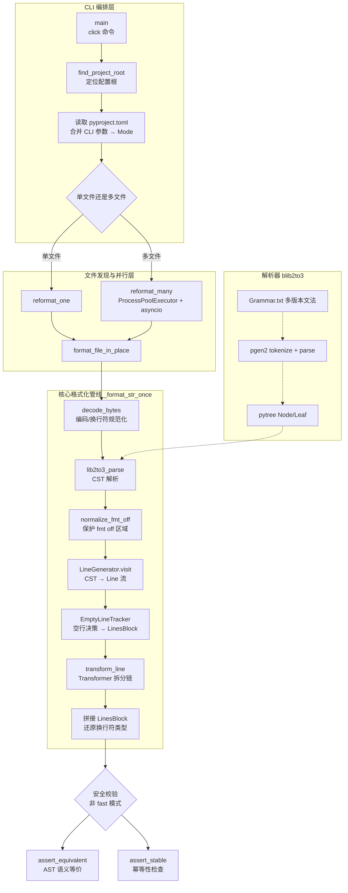
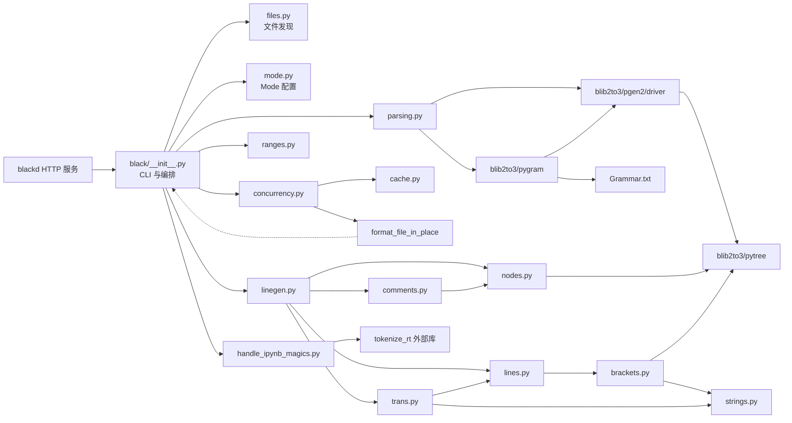
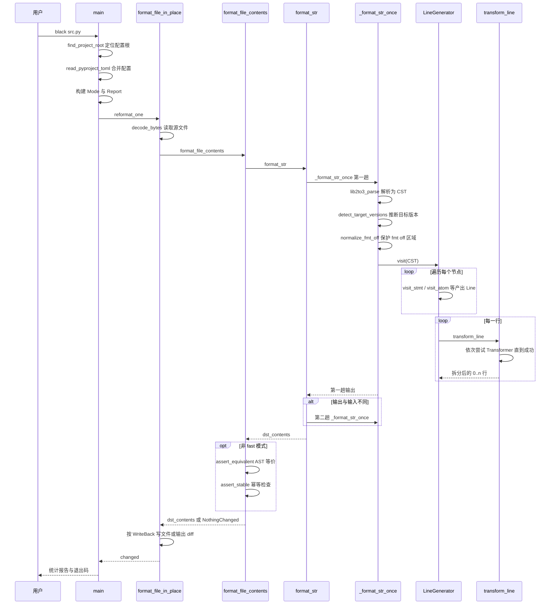
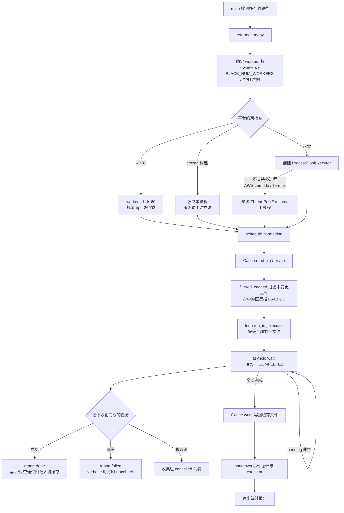

# black 源码学习笔记

> 仓库地址：[psf/black](https://github.com/psf/black)
> 学习日期：2026-10-01
> 分析基线：main 分支 commit `a7c2368b`（2026-09-29）

---

> **以下为 AI 源码分析**
>
> ### 一句话概括
>
> Black 是一个"不妥协"的 Python 代码格式化器：把源码解析成保留注释与空白的 CST（blib2to3），按 88 列等固定规则从零重新生成代码，输出确定、幂等、语义等价，让格式争论彻底消失。
>
> ### 要点速览
>
> | 模块 | 职责 | 关键文件 |
> |------|------|----------|
> | CLI 与编排 | click 命令入口、pyproject.toml 配置、调度整体流程 | `src/black/__init__.py` |
> | 解析器（CST） | Python 源码 → 保留 prefix 的 Node/Leaf 树 | `src/blib2to3/`（fork 自 CPython lib2to3） |
> | 行生成 | Visitor 遍历 CST，产出逻辑行流 | `src/black/linegen.py` |
> | 行变换 | 超长行拆分的 Transformer 回退链、字符串处理 | `src/black/trans.py` |
> | 行数据结构 | `Line` / `LinesBlock` / `EmptyLineTracker` | `src/black/lines.py` |
> | 括号跟踪 | 括号深度、分隔符优先级、magic trailing comma | `src/black/brackets.py` |
> | 注释处理 | 注释重排、fmt off/on 与 fmt skip 区域保护 | `src/black/comments.py` |
> | 文件发现 | include/exclude、gitignore、配置解析 | `src/black/files.py` |
> | 并行执行 | ProcessPoolExecutor + asyncio 调度 | `src/black/concurrency.py` |
> | 缓存 | 基于 mtime/size/hash 的 pickle 缓存 | `src/black/cache.py` |
> | 配置模型 | `Mode` / `TargetVersion` / `Feature` / `Preview` | `src/black/mode.py` |
> | Jupyter 支持 | ipynb 逐 cell 格式化、magic 掩码 | `src/black/handle_ipynb_magics.py` |
> | HTTP 服务 | blackd（aiohttp）按 header 传参格式化 | `src/blackd/__init__.py` |

---

## 项目简介

Black 是 PSF（Python Software Foundation）维护的 Python 代码格式化器，自称"The Uncompromising Code Formatter"——不妥协。用户把代码格式的控制权完全交给它，换回三样东西：**速度、确定性、免争论**。任何符合语法的输入永远得到同一份输出，与项目无关、与历史格式无关。它通过双引号统一、88 字符行宽等少量刻意收敛的规则，让 code review 中的格式意见彻底消失，且重排后产生的 diff 最小。为保证"格式化绝不改变代码语义"，默认模式还会对输出做 AST 等价性与幂等性双重校验。

## 技术栈

| 类别 | 技术 |
|------|------|
| 语言 | Python 3.10+（mypy strict 全量类型注解） |
| CLI 框架 | click（blackd 额外用 aiohttp） |
| 构建工具 | hatchling + hatch-vcs（版本号从 git tag 推导）+ 可选 mypyc 编译为 C 扩展 |
| 依赖管理 | PEP 621 `pyproject.toml` + dependency-groups + tox |
| 测试框架 | pytest + pytest-xdist（另有 hypothesis / hypothesmith 模糊测试） |
| 运行时依赖 | click、mypy-extensions、packaging、pathspec、platformdirs、pytokens、tomli（<3.11） |
| 可选依赖 | colorama（Windows 彩色输出）、uvloop/winloop（事件循环）、aiohttp（blackd）、ipython + tokenize-rt（jupyter） |

## 目录结构

```text
black/
├── src/
│   ├── black/                    # 主包：CLI、编排、行生成与变换
│   │   ├── __init__.py           # main / format_str 等入口与编排（59KB）
│   │   ├── __main__.py           # 支持 python -m black
│   │   ├── linegen.py            # LineGenerator：CST → 逻辑行（96KB）
│   │   ├── trans.py              # Transformer：字符串处理与行拆分（101KB）
│   │   ├── lines.py              # Line / LinesBlock / EmptyLineTracker（70KB）
│   │   ├── nodes.py              # Visitor 基类、whitespace 规则、syms 常量
│   │   ├── brackets.py           # BracketTracker 与分隔符优先级
│   │   ├── comments.py           # 注释生成与 fmt off/on 处理
│   │   ├── strings.py            # 引号/前缀规范化、unicode escape、str_width
│   │   ├── mode.py               # Mode / TargetVersion / Feature / Preview
│   │   ├── files.py              # 文件发现、pyproject.toml 解析、gitignore
│   │   ├── cache.py              # 格式化结果缓存（pickle）
│   │   ├── concurrency.py        # 多文件并行（进程池 + asyncio）
│   │   ├── ranges.py             # --line-ranges 选择性格式化
│   │   ├── handle_ipynb_magics.py# Jupyter cell magic 掩码/还原
│   │   ├── parsing.py            # lib2to3_parse 包装与语法选择
│   │   ├── numerics.py / output.py / report.py / debug.py / rusty.py / const.py
│   │   └── resources/            # black.schema.json（配置 JSON Schema）
│   ├── blib2to3/                 # fork 自 CPython lib2to3 的 CST 解析器
│   │   ├── Grammar.txt           # Python 完整文法（含 match / type params / t-string 等）
│   │   ├── PatternGrammar.txt    # 模式匹配文法
│   │   ├── pytree.py             # Node / Leaf / BasePattern 树结构
│   │   ├── pygram.py             # 文法加载与多版本变体
│   │   └── pgen2/                # tokenize / parse / driver / pgen 解析引擎
│   └── blackd/                   # HTTP 服务版：handle / parse_mode / middlewares
├── tests/                        # pytest 套件；data/cases 为快照式风格测试
├── docs/                         # Sphinx 文档（ReadTheDocs 发布）
├── scripts/                      # 发布、schema 生成、fuzz 等辅助脚本
├── profiling/                    # 性能分析脚本与样本
├── plugin/black.vim              # Vim 编辑器插件
├── action/                       # GitHub Action 封装
└── pyproject.toml                # 构建、依赖与工具链配置（自身也用 black 格式化）
```

## 架构设计

### 整体架构

Black 是一条**单向流水线**：源码文本 → CST（保留注释与空白的语法树）→ 逻辑行（`Line`）流 → 拆分变换 → 拼接输出。整体分四层：

1. **CLI 编排层**（`black/__init__.py`）：click 解析参数，`find_project_root` 向上找 `.git` / 含 `[tool.black]` 的 `pyproject.toml` 确定配置根（`files.py:45`），合并出不可变的 `Mode` 配置对象。
2. **文件发现与并行层**：`get_sources` 按 include/exclude 正则、gitignore、缓存过滤收集文件集合；单文件走 `reformat_one`，多文件走 `reformat_many`（进程池 + asyncio 调度）。
3. **核心格式化管线**（`_format_str_once`，`__init__.py:1349`）：`decode_bytes` 规范化编码与换行符 → `lib2to3_parse` 解析为 CST → `normalize_fmt_off` 把 fmt off 区域折叠成不可动的 `STANDALONE_COMMENT` 节点 → `LineGenerator.visit` 遍历树产出 `Line` 流 → `EmptyLineTracker` 决定块间空行 → `transform_line` 对超长行执行 Transformer 拆分链 → 拼接所有 `LinesBlock` 输出。
4. **安全校验层**：默认（非 `--fast`）对输出做 `assert_equivalent`（AST 语义等价）与 `assert_stable`（再格式化一次结果不变，即幂等）双重检查。



### 核心模块

**1. CLI 与编排 — `src/black/__init__.py`**

- 职责：`main`（`:554`）是 click 命令入口；`patched_main`（`:1785`）是 console script 入口，处理 `--version` 与 uvloop 安装。
- 关键函数：`get_sources`（`:792`）收集文件；`reformat_one`（`:933`）单文件路径（含缓存读写）；`format_file_in_place`（`:994`）读文件、按后缀切换 pyi/ipynb 模式、按 `WriteBack` 枚举（NO/DIFF/COLOR_DIFF/YES/CHECK）写回或输出 diff；`format_file_contents`（`:1167`）调用 `format_str` 并触发安全校验，无变化时抛 `NothingChanged`；`format_str`（`:1276`）对外 API（库用户主要入口）；`_format_str_once`（`:1349`）单趟格式化。
- 关系：向下依赖 `files` / `parsing` / `linegen` / `lines` / `mode` / `cache` / `concurrency`，是全仓库的组装点。

**2. CST 解析器 — `src/blib2to3/`**

- 职责：把 Python 源码解析成**保留格式信息**的语法树。这是 fork 自 CPython 标准库 lib2to3（已被标准库移除）的独立维护版本，Black 在其上追加了 match 语句、soft keywords、PEP 695 type params、t-string、lazy imports 等新语法支持。
- 核心结构：`pytree.py` 的 `Base`（`:54`）→ `Node`（`:248`，内部节点）/ `Leaf`（`:470`，token 叶子）。`Leaf` 携带 `prefix`（前置空白与注释）、`lineno`/`column`、`bracket_depth`——**注释和空白挂在 leaf 的 prefix 上**，这是能重排代码又不丢注释的关键。
- 文法体系：`Grammar.txt` 描述完整文法；`pygram.py:170` 的 `initialize` 加载并派生三个变体——`python_grammar`（3.0-3.6，async 是标识符）、`python_grammar_async_keywords`（3.7-3.9，async 是关键字）、`python_grammar_soft_keywords`（3.10+，match/case/type 是 soft keyword）。`parsing.py` 的 `lib2to3_parse`（`:77`）按 target version 从新到旧依次尝试，全部失败时报出**最新**文法的 `InvalidInput` 错误（带行号列号和原文摘录）。
- 解析引擎：`pgen2/driver.py` 的 `parse_tokens`（`:123`）逐 token 驱动 LR 自动机（`parse.py` 的 `Parser.addtoken`），prefix 累积逻辑把注释与 NL 归入下一个 token 的前缀。

**3. 行生成 — `src/black/linegen.py`**

- 职责：`LineGenerator(Visitor[Line])`（`:110`）遍历 CST，把 token 流切成逻辑行。
- 机制：基类 `Visitor`（`nodes.py:146`）按节点类型动态派发 `visit_*` 方法（如 `visit_stmt`、`visit_suite`、`visit_atom`、`visit_fstring`），无专用方法则走 `visit_default` 递归。`LineGenerator` 覆写了 30+ 个 `visit_*` 处理特殊语法；类 docstring 明确说明它会**破坏性修改**这棵树（改写 leaf prefix、插入隐式括号 leaf）。`visit_stmt`/`visit_suite` 在语句边界调用 `self.line()` 产出完整 `Line`。
- 其余职责：`normalize_invisible_parens`（`:1756`）给表达式补齐/删除隐式括号；`maybe_make_parens_in_atom_in_atom`（`:2161`）决定原子是否包一层括号；`visit_decorators`、`visit_power`（幂运算 hug）等。

**4. 行变换 — `src/black/trans.py` + `linegen.py` 的拆分函数**

- 职责：对超出行宽的 `Line` 做拆分。`transform_line`（`linegen.py:775`）按行类型组装一条 **Transformer 回退链**：行足够短且不拆 → 只做字符串预处理；`def` 头 → `left_hand_split`（`:928`）；一般情况 → `right_hand_split_with_omits`（`:1014`）、括号内 → `delimiter_split`（`:1505`）、`standalone_comment_split`（`:1603`）、字符串四件套（`StringMerger` 合并隐式拼接、`StringParenStripper` 剥多余括号、`StringSplitter` 长字符串按 f-string 表达式边界切、`StringParenWrapper` 包裹拆分）。
- 回退机制：每个 Transformer 失败时抛 `CannotTransform`，`transform_line` 捕获后尝试下一个；全部失败则**原样输出该行**（仅当含 standalone comment 时强制拆分保证语法合法）。这保证格式化永不 crash。
- 结果类：`hug_power_op`（`trans.py:70`）处理 `a ** b` 紧凑排版。

**5. 行数据结构 — `src/black/lines.py` / `src/black/brackets.py`**

- `Line`（`lines.py:44`）：一行 = `leaves` 列表 + `comments` 字典 + `depth` 缩进 + `bracket_tracker`。`append` 时由 `whitespace()` 计算前后空格、由 `BracketTracker.mark` 登记括号与 magic trailing comma。
- `LinesBlock`（`:551`）+ `EmptyLineTracker`（`:591`）：前者是"内容行 + before/after 空行数"的块（fmt off 与未选中行会变成 `is_standalone` 块原样输出），后者按上下文（函数/类边界、pyi 模式等）决定块间保留几行空行。
- `BracketTracker`（`brackets.py:60`）：跟踪括号深度；`get_open_bracket` 生成括号栈；`max_delimiter_priority`（`:340`）计算**分隔符拆分优先级**（`Priority`：逗号 > `and/or` 比较符等），`delimiter_split` 按这个优先级找最佳切分点。magic trailing comma：元组/调用/参数等括号内末尾有逗号时，Black 将**无条件**在这些逗号后拆行——这是用户影响输出布局的主要逃生舱之一。

**6. 注释与区域保护 — `src/black/comments.py`**

- 职责：`generate_comments`（`:62`）从 leaf prefix 抽出注释挂在行上；`make_comment` 规范注释格式（两空格缩进、行宽内换行）。
- fmt 区域：`normalize_fmt_off`（`:214`）在格式化前扫描 `# fmt: off` / `# fmt: on` / `# fmt: skip` 注释，把中间的原始代码转换为不可修改的节点块（`generate_ignored_nodes` `:610`、`convert_one_fmt_off_pair` `:368`），输出时原样回放。fmt skip 的处理（`_generate_ignored_nodes_from_fmt_skip` `:779`）在语法层面定位其覆盖的语句并整块跳过。

**7. 文件发现与配置 — `src/black/files.py`**

- `find_project_root`（`:45`）：从命令行源向上找共同父目录，再逐级向上探测 `.git`、`.hg` 或含 `[tool.black]` 的 `pyproject.toml`。
- `gen_python_files`（`:335`）：递归遍历目录，套用 include/extend-exclude/force-exclude 正则与 gitignore（pathspec GitIgnoreSpec），跳过 `.git` 等目录、按后缀识别 py/pyi/ipynb。
- `parse_pyproject_toml` + `__init__.py` 的 `read_pyproject_toml`（`:116`）：配置合并顺序为 CLI > 项目 pyproject.toml > 用户级 `~/.config/black/pyproject.toml`，并有 `spellcheck_pyproject_toml_keys` 拼写纠错提示。

**8. 并行与缓存 — `src/black/concurrency.py` / `src/black/cache.py`**

- `reformat_many`（`concurrency.py:81`）：worker 数取 `--workers` / `BLACK_NUM_WORKERS` / CPU 核数；`ProcessPoolExecutor` 不可用时优雅降级为单线程 `ThreadPoolExecutor`（GIL 限制下多线程无益）；frozen（PyInstaller）构建强制单进程避免关机错误。`schedule_formatting`（`:157`）用 `loop.run_in_executor` 把每个文件提交进池，`asyncio.wait(FIRST_COMPLETED)` 逐批收割，注册 SIGINT/SIGTERM 取消 handler；diff 输出模式用 `multiprocessing.Manager().Lock()` 串行化 stdout。
- `Cache`（`cache.py:56`）：按 `Mode.get_cache_key()`（版本+行宽+features 的 sha256）分文件存 pickle，值是 `(mtime, size, hash)` 三元组；写回或 check 通过的文件才进缓存，diff 模式不写缓存。

**9. HTTP 服务 — `src/blackd/__init__.py`**

- aiohttp 服务：`POST /`，请求体为源码，全部配置走 HTTP header（`X-Line-Length`、`X-Target-Versions`、`Fast-or-Safe: fast`、`Diff: true` 等），`parse_mode`（`:246`）解析成 `Mode`；`handle`（`:154`）内部把格式化扔进 executor 限并发跑。无变化返回 204，语法错误返回 400。纯功能子集，无文件系统/配置交互——适合编辑器插件远程调用。

**10. Jupyter 支持 — `src/black/__init__.py` + `handle_ipynb_magics.py`**

- `format_ipynb_string`（`:1244`）逐 code cell 调 `format_cell`（`:1195`）：先剥掉 cell 末尾分号、用 tokenize-rt 把 IPython magics（`%`、`%%`）替换成占位 token（`mask_cell` `handle_ipynb_magics.py:148`，`CellMagicFinder` 是 ast.NodeVisitor 定位 magic 位置），格式化后还原分号与 magics。这层"掩码-格式化-还原"设计让核心管线完全无感知 ipynb。

### 模块依赖关系



## 核心流程

### 流程一：单文件格式化管线（format_str 主链路）



关键逻辑说明：

- **参数与配置合并**（`__init__.py:554-722`）：click 参数经 `read_pyproject_toml`（`:116`）以 default_map 形式注入——项目 `pyproject.toml` 的值成为 CLI 参数默认值，显式命令行覆盖之。`main` 里还有大量参数互斥校验（`-c` 与 SRC 互斥、`--pyi` 与 `--ipynb` 互斥、`--line-ranges` 限制单文件等）。
- **解析**（`parsing.py:77`）：`lib2to3_parse` 按目标版本取 1-3 个文法从新到旧尝试，ParseError/TokenError 被捕获积累，全部失败时抛**最新**文法的 `InvalidInput`（含原文摘录 + 脱字符定位），这是用户看到的语法报错。
- **行生成**（`linegen.py:110`）：Visitor 模式深度优先遍历。`visit_default`（`:148`）对每个 leaf 先 `generate_comments` 抽出 prefix 里的注释（括号内注释挂在行上参与拆分，行尾注释先 `append` 再 `self.line()` 立刻断行，独立注释独占一行）；`visit_stmt`（`:228`）在语句节点处 `yield from self.line()` 输出累积完整的行。
- **拆分**（`linegen.py:775`）：`transform_line` 先判断行是否够短、是否 def 头、是否在括号内，组装对应 Transformer 链；`run_transformer`（`:2413`）执行，`CannotTransform` 异常驱动回退。`right_hand_split`（`:994`）是最常用策略：把行拆成 head（`x = `）/ body（括号内按 `delimiter_split` 优先级切）/ tail（闭合括号）三段，body 整体缩进一级。
- **双趟**（`__init__.py:1313-1319`）：第一趟可能把可选尾逗号变成强制尾逗号，第二趟让布局收敛；`assert_stable` 校验的正是这个幂等性。
- **安全检查**（`__init__.py:1140-1166`，`:1724-1784`）：`assert_equivalent` 用 blibto3 分别 parse 源和目标，遍历两棵树比较规范化后的 token 序列（忽略位置与注释）；`assert_stable` 把输出再格式化一次，结果必须与输出一致。失败抛 `AssertionError`，带"INTERNAL ERROR"提示用户提 issue——这是 Black "格式化永不改变语义"承诺的兜底。

### 流程二：多文件并行格式化（reformat_many）



关键逻辑说明：

- **缓存过滤先行**（`concurrency.py:174-183`）：diff/color-diff 模式不读缓存（保证输出真实 diff），其余模式先用 `(mtime, size, hash)` 过滤掉自上次格式化后未变更的文件，命中者直接 `report.done(CACHED)`——大仓库重复运行的加速核心。
- **跨进程执行**（`:196-203`）：每个文件一个 `loop.run_in_executor(executor, format_file_in_place, ...)` future。`format_file_in_place` 是**模块级函数、参数全部可 pickle**（Path/bool/Mode/WriteBack/lock），这是它能跨进程边界的前提；`@mypyc_attr(patchable=True)`（`:80`）让 diff-shades 可 monkeypatch 做模糊测试对照。
- **信号处理**（`:206-210`）：SIGINT/SIGTERM 注册为取消所有 pending future；Windows 上不可用则静默跳过。`shutdown`（`:58`）借鉴 CPython 3.7b2 runners 的收尾逻辑，并把 `concurrent.futures` logger 调成 CRITICAL 压掉"事件循环已关闭"的噪音。
- **缓存写回条件**（`:225-228`）：只有真实写回（YES）或 check 且未变化（CHECK+NO）的文件才进缓存——diff 模式、失败文件都不污染缓存。
- **锁**（`:189-193`）：diff 输出需要保序，跨进程用 `Manager().Lock()`；单文件路径传 `lock=None` 时 `format_file_in_place` 用 `nullcontext()` 兜底。

## 关键设计亮点

**1. 双重安全校验：格式化被当作"纯函数"对待**

- 解决什么问题：格式化器最严重的故障不是"格式不好看"而是"悄悄改变语义"（比如吞掉一个负号、移动一个 await）。
- 实现：`__init__.py:1140` 的 `check_stability_and_equivalence` 在每次格式化后调 `assert_equivalent`（`:1724`，双树遍历逐 token 比较）与 `assert_stable`（`:1757`，输出再格式化必须幂等），任一失败抛"INTERNAL ERROR"级 AssertionError 并请求用户报 issue。`--fast` 可跳过换取速度。
- 为什么值得学：用"输出必须通过校验"把格式化器从"尽力而为"变成"可验证"系统；幂等性检查同时兜住了双趟拆分逻辑的收敛 bug。

**2. 选择 CST 而非 AST：fork blib2to3 保留 prefix**

- 解决什么问题：CPython `ast` 模块在 parse 时丢弃注释、空白、引号样式，而格式化器恰恰要操作这些。
- 实现：`blib2to3/` 是 lib2to3 的自维护 fork，`Leaf`（`pytree.py:470`）携带 `prefix`（前置注释+空白）、`lineno/column`、`bracket_depth`；文法以 `Grammar.txt` 文本维护，`pygram.py:170` 在加载时派生三个 Python 版本变体（async 标识符/关键字、soft keywords），`parsing.py:77` 从新到旧回退解析，兼容 3.0-3.15 全部语法。
- 为什么值得学：当标准库组件停止维护（lib2to3 计划移除）而需求真实存在时，fork 并继续演进是正当选项；"多文法回退解析"让一份代码同时服务所有目标版本。

**3. Transformer 回退链：永不 crash 的拆分策略**

- 解决什么问题：超长行的拆分有无数种语法情境，任何单一策略都有覆盖不到的死角。
- 实现：`transform_line`（`linegen.py:775`）按行类型（够短/def 头/括号内/一般）组装 1-8 个 Transformer 的有序链（`left_hand_split`、`delimiter_split`、字符串四件套……），每个失败抛 `CannotTransform`（`trans.py:42`）即换下一个，全失败则原样返回该行——最坏情况是"这行没格式化"，而永远不会是"black 崩了"。
- 为什么值得学：把"多策略+降级"显式建模为异常驱动的责任链，比 if/else 树更易扩展（trans.py 里新增一个 Transformer 只需实现 `do_match`/`do_transform` 并挂进链条）。

**4. 有节制的不妥协：用户意图只有两个通道**

- 解决什么问题："完全无视输入格式"虽纯粹但不可用——1 元组必须保留逗号、某些表格化数据不该被重排。
- 实现：**magic trailing comma**（`lines.py:93-106`、`brackets.py`）——括号结构末尾的逗号触发无条件拆行，`--skip-magic-trailing-comma` 关闭；**fmt off/on 与 fmt skip**（`comments.py:214`）——把区域折叠成原样回放的 `STANDALONE_COMMENT` 块。此外 `strings.py:189` 的引号规范化等每一步都可通过 CLI/配置关闭。
- 为什么值得学：看似"独裁"的工具实际把用户意图入口收敛到极少数、语义极明确的机制上，既保住确定性叙事又留足逃生舱；配置面刻意保持小（`Preview` 特性逐个灰度，`mode.py:249`，`unstable` 全开、`preview` 排除 `UNSTABLE_FEATURES`）。

**5. 性能工程成体系：缓存 + 进程池 + mypyc 编译**

- 解决什么问题：解析器是 Python 写的，吞吐量天然吃亏；大仓库（数万文件）需要分钟级内完成。
- 实现：三层加速——`cache.py` 按 Mode 分文件的 pickle 缓存（mtime+size+hash 命中直接跳过）；`concurrency.py` 进程池并行（绕开 GIL）+ uvloop 事件循环 + frozen 构建降级；发布 wheel 时用 **mypyc** 把性能敏感模块（`trans.py`、`linegen.py`、`lines.py`、`nodes.py`、`comments.py` 等）编译为 C 扩展（`pyproject.toml` `[tool.hatch.build.targets.wheel.hooks.mypyc]`，显式排除 `blackd`/`__main__.py` 等不适合编译的模块），官方独立二进制用 PyInstaller 打包。
- 为什么值得学：类型注解（mypy strict）在这里不是文档装饰而是**编译输入**；"哪些模块编译、哪些排除"的清单本身就是一份性能敏感度地图。

**未深入分析的部分**：`tests/` 的快照测试基础设施（`data/cases` 每个风格特性一对 .py/.out）、`scripts/fuzz.py` 与 hypothesis 模糊测试管线、`scripts/release.py` 发布流程、`action/` GitHub Action 与 `docs/` Sphinx 站点。这些属于工程外围，核心格式化语义不经过它们。
