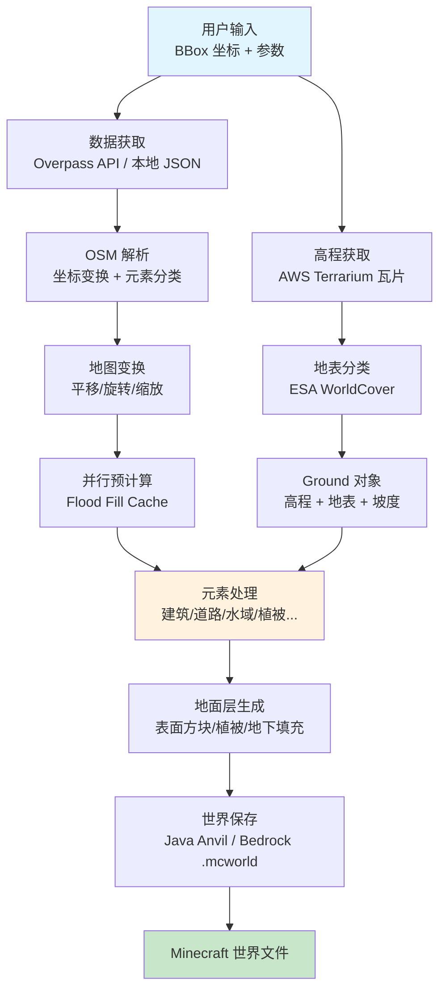
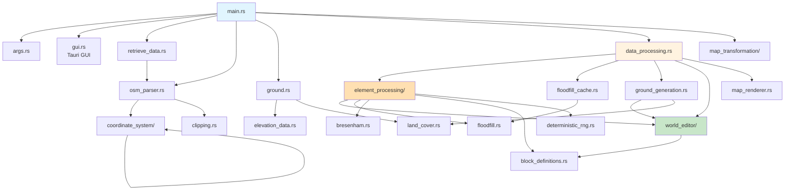
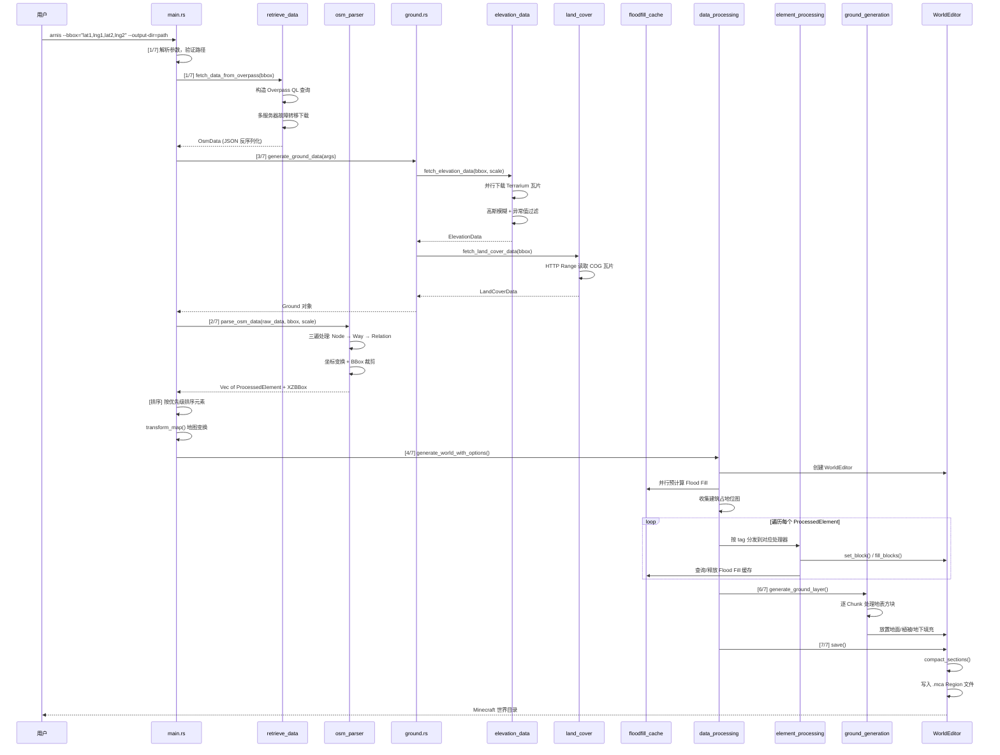
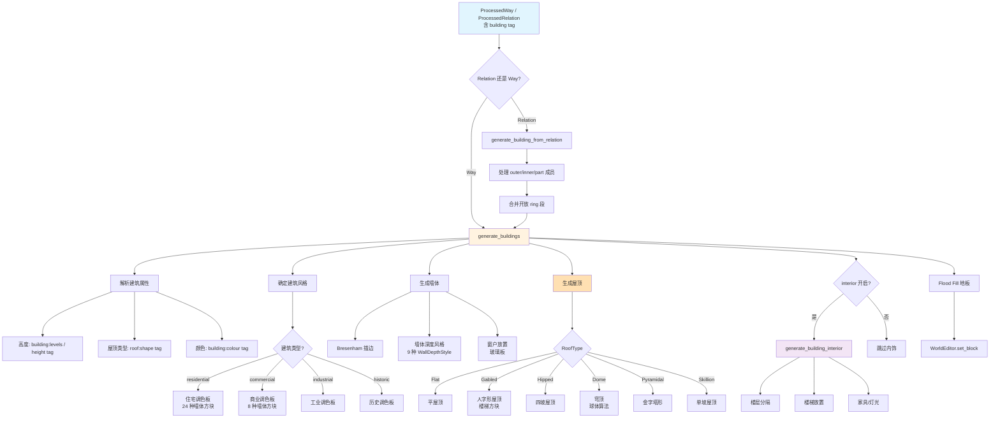

# arnis 源码学习笔记

> 仓库地址：[arnis](https://github.com/louis-e/arnis)
> 学习日期：2026-04-05

---

> **以下为 AI 源码分析**
>
> ### 一句话概括
>
> Arnis 是一个 Rust 编写的工具，能将真实世界的地理数据（OpenStreetMap + 高程 + 卫星地表分类）转换为精确的 Minecraft Java/Bedrock Edition 世界。
>
> ### 要点速览
>
> | 核心模块 | 职责 | 关键文件 |
> |---------|------|---------|
> | 数据获取 | 从 Overpass API 获取 OSM 地理数据 | `src/retrieve_data.rs` |
> | OSM 解析 | 将原始 JSON 解析为结构化元素（Node/Way/Relation） | `src/osm_parser.rs` |
> | 坐标变换 | 经纬度 → Minecraft XZ 坐标映射 | `src/coordinate_system/` |
> | 高程处理 | 获取 AWS Terrarium 高程瓦片，生成地形 | `src/elevation_data.rs`, `src/ground.rs` |
> | 地表分类 | ESA WorldCover 卫星数据，分类地表类型 | `src/land_cover.rs` |
> | 元素处理 | 将 OSM 元素（建筑/道路/水域等）转为方块 | `src/element_processing/` |
> | Flood Fill | 多边形内部区域填充算法 | `src/floodfill.rs`, `src/floodfill_cache.rs` |
> | 世界编辑器 | 方块放置与世界文件写入（Java Anvil / Bedrock） | `src/world_editor/` |
> | GUI | Tauri 桌面应用，地图选区交互 | `src/gui.rs`, `src/gui/` |

---

## 项目简介

Arnis 是一个开源的地理空间数据到 Minecraft 世界的转换引擎。它从 OpenStreetMap 获取建筑、道路、水域、植被等地理信息，结合 AWS S3 提供的 Terrarium 高程瓦片和 ESA WorldCover 10m 分辨率卫星地表分类数据，生成包含真实地形、建筑和地貌的 Minecraft 世界。支持 Java Edition（1.17+ Anvil 格式）和 Bedrock Edition（.mcworld 格式），提供 GUI 和 CLI 两种使用模式。

## 技术栈

| 类别 | 技术 |
|------|------|
| 语言 | Rust（Edition 2021） |
| 框架 | Tauri 2（GUI）、clap 4（CLI 参数解析） |
| 构建工具 | Cargo、tauri-build |
| 依赖管理 | Cargo（Cargo.toml / Cargo.lock） |
| 测试框架 | Rust 内置 `#[cfg(test)]` + tempfile |

## 目录结构

```
arnis/
├── src/
│   ├── main.rs                    # 程序入口，CLI/GUI 模式切换
│   ├── args.rs                    # CLI 参数定义与验证
│   ├── gui.rs                     # Tauri GUI 启动与命令处理
│   ├── gui/                       # GUI 前端资源（HTML/CSS/JS）
│   │   ├── index.html             # 主界面
│   │   ├── maps.html              # 地图选区页面
│   │   └── js/                    # 前端 JavaScript
│   ├── retrieve_data.rs           # OSM 数据获取（Overpass API / 本地文件）
│   ├── osm_parser.rs              # OSM JSON 解析与坐标转换
│   ├── data_processing.rs         # 世界生成主流程编排
│   ├── coordinate_system/         # 坐标系统
│   │   ├── geographic.rs          # 经纬度坐标（LLBBox, LLPoint）
│   │   ├── cartesian.rs           # Minecraft XZ 坐标（XZBBox, XZPoint）
│   │   └── transformation.rs      # 地理坐标 ↔ 游戏坐标变换
│   ├── elevation_data.rs          # AWS Terrarium 高程瓦片下载与处理
│   ├── ground.rs                  # 地形数据管理（高程 + 地表分类）
│   ├── ground_generation.rs       # 地面层生成（表面方块/植被/地下填充）
│   ├── land_cover.rs              # ESA WorldCover 卫星地表分类
│   ├── element_processing/        # OSM 元素 → Minecraft 方块
│   │   ├── mod.rs                 # 模块入口 + way 合并算法
│   │   ├── buildings.rs           # 建筑生成（墙体/屋顶/内饰）
│   │   ├── highways.rs            # 道路/人行道/机场跑道
│   │   ├── natural.rs             # 自然元素（树木/草地/悬崖）
│   │   ├── water_areas.rs         # 水域面积（湖泊/海洋）
│   │   ├── waterways.rs           # 水道线状（河流/溪流）
│   │   ├── landuse.rs             # 土地利用（公园/农田/墓地）
│   │   ├── buildings.rs           # 建筑（含多种屋顶/墙体风格）
│   │   ├── tree.rs                # 树木生成算法
│   │   └── subprocessor/          # 建筑内饰子处理器
│   ├── floodfill.rs               # 多边形 Flood Fill 算法
│   ├── floodfill_cache.rs         # 并行预计算 Flood Fill 缓存
│   ├── world_editor/              # Minecraft 世界写入
│   │   ├── mod.rs                 # WorldEditor 核心（方块放置/保存）
│   │   ├── java.rs                # Java Anvil 格式写入
│   │   ├── bedrock.rs             # Bedrock .mcworld 格式写入
│   │   └── common.rs              # 共享数据结构（Region/Chunk/Section）
│   ├── block_definitions.rs       # Minecraft 方块类型定义
│   ├── bresenham.rs               # 3D Bresenham 直线算法
│   ├── clipping.rs                # Way 裁剪到 BBox
│   ├── map_transformation/        # 地图变换操作
│   ├── map_renderer.rs            # 世界地图预览渲染
│   └── colors.rs                  # 颜色工具函数
├── assets/                        # 静态资源（图标/模板/Minecraft 数据）
├── tests/                         # 集成测试数据
├── Cargo.toml                     # 项目配置与依赖
├── build.rs                       # 构建脚本（Tauri）
└── tauri.conf.json                # Tauri 配置
```

## 架构设计

### 整体架构

Arnis 采用**流水线架构**（Pipeline Architecture），数据从获取到最终世界文件输出经历 7 个阶段。每个阶段职责清晰，通过结构化数据在阶段间传递。项目通过 Cargo feature flags（`gui`、`bedrock`）实现条件编译，GUI 和 Bedrock 支持均为可选功能。



### 核心模块

#### 1. 数据获取模块（retrieve_data.rs）

**职责**：从 Overpass API 服务器获取 OpenStreetMap 地理数据，支持多服务器故障转移。

- **核心函数**：
  - `fetch_data_from_overpass()` — 构造 Overpass QL 查询，从多个 API 服务器获取数据，支持 reqwest/curl/wget 三种下载方式
  - `fetch_data_from_file()` — 从本地 JSON 文件加载数据
  - `fetch_area_name()` — 通过 Nominatim 反向地理编码获取地名
- **设计亮点**：
  - 多服务器故障转移：3 个主服务器 + 2 个备份服务器，随机洗牌顺序
  - 主服务器间延迟 3 秒重试，切换到备份时延迟 5 秒
  - Overpass QL 查询排除海洋元素（由 ESA WorldCover 更可靠地处理）

#### 2. OSM 解析模块（osm_parser.rs）

**职责**：将原始 OSM JSON 解析为结构化的 `ProcessedElement` 枚举，并完成经纬度到 Minecraft 坐标的转换。

- **核心类型**：
  - `OsmData` — 原始反序列化结构
  - `ProcessedNode` / `ProcessedWay` / `ProcessedRelation` — 处理后的元素
  - `ProcessedElement` — 统一枚举，贯穿整个处理流水线
- **三遍处理**：
  1. 第一遍：处理 Node，构建 `nodes_map`，坐标变换
  2. 第二遍：处理 Way，引用 Node，裁剪到 BBox
  3. 第三遍：处理 Relation（multipolygon/building），组装成员 Way
- **关键设计**：Way 使用 `Arc<ProcessedWay>` 共享引用，避免 Relation 成员的深拷贝

#### 3. 坐标系统模块（coordinate_system/）

**职责**：管理地理坐标与 Minecraft 坐标之间的双向映射。

- **geographic.rs** — `LLBBox`（经纬度包围盒）和 `LLPoint`（经纬度点），含输入校验
- **cartesian.rs** — `XZBBox`（Minecraft XZ 包围盒）和 `XZPoint`（Minecraft XZ 点）
- **transformation.rs** — `CoordTransformer` 执行坐标变换：
  - 使用 Haversine 公式计算真实距离
  - 经度距离取决于纬度，使用包围盒中点纬度近似
  - `scale` 参数控制 blocks/meter 比例

#### 4. 高程与地形模块（elevation_data.rs + ground.rs）

**职责**：获取真实高程数据并映射到 Minecraft Y 坐标。

- **elevation_data.rs**：
  - 从 AWS S3 下载 Terrarium 格式高程瓦片（PNG 编码：`R*256 + G + B/256 - 32768`）
  - 并行下载（最多 8 线程），本地瓦片缓存（7 天过期）
  - 高斯模糊平滑（sigma 自适应：小区域用 terrain floor 消除 SRTM 噪声，大区域用 sqrt 缩放）
  - 异常值过滤（1-99 百分位），NaN 邻域插值填充
- **ground.rs** — `Ground` 结构聚合高程 + 地表分类：
  - `level(coord)` — 查询指定坐标的地面 Y 值
  - `cover_class(coord)` — 查询 ESA WorldCover 地表分类
  - `slope(coord)` — 计算 4 方向坡度

#### 5. 地表分类模块（land_cover.rs）

**职责**：获取 ESA WorldCover 2021 卫星地表分类数据（10m 分辨率），用于选择地面方块材质。

- 11 种地表类型：树木覆盖 / 灌木 / 草地 / 农田 / 建成区 / 裸地 / 冰雪 / 水体 / 湿地 / 红树林 / 苔藓
- 从 S3 读取 Cloud-Optimized GeoTIFF（COG），通过 HTTP Range Request 仅下载所需部分
- 计算水域距岸距离（BFS），用于海岸线渐变效果

#### 6. 元素处理模块（element_processing/）

**职责**：将 OSM 地理元素转换为 Minecraft 方块。包含 19 个子模块，覆盖几乎所有 OSM 元素类型。

- **buildings.rs** — 最复杂的处理器（~2000+ 行），支持：
  - 6 种屋顶类型（Gabled/Hipped/Skillion/Pyramidal/Dome/Flat）
  - 9 种墙体深度风格（SubtlePilasters/ModernPillars/IndustrialBeams 等）
  - 按建筑类型选择材质调色板（住宅/商业/工业/历史/宗教等）
  - 建筑内饰生成（家具/灯光/楼梯）
- **highways.rs** — 道路系统，含交叉口连通性分析
- **water_areas.rs** — 水域面积处理，支持 multipolygon Relation 的 ring 合并
- **tree.rs** — 参数化树木生成算法
- **subprocessor/** — 建筑内饰子处理器

#### 7. Flood Fill 模块（floodfill.rs + floodfill_cache.rs）

**职责**：填充多边形内部区域，是建筑地板、水域、土地利用等面状元素的基础算法。

- **floodfill.rs**：
  - 双算法策略：小区域（<50000 块）用优化 BFS，大区域用网格采样 + BFS
  - `FloodBitmap` — 1 bit/坐标的紧凑位图（5000x5000 仅 ~3MB vs HashSet 的 ~1.2GB）
  - 多种子点检测：网格采样发现种子，处理 U 形等凹多边形
  - 超时保护 + 面积上限（25M 块）
- **floodfill_cache.rs**：
  - 使用 Rayon 并行预计算所有 Way 的 Flood Fill
  - `BuildingFootprintBitmap` — 建筑占地位图，防止树木生成在建筑内部
  - 处理完即释放缓存条目，控制内存峰值

#### 8. 世界编辑器模块（world_editor/）

**职责**：管理 Minecraft 世界的方块放置与文件写入。

- **WorldEditor** — 核心结构，提供 `set_block()` / `fill_blocks()` / `set_sign()` / `add_entity()` 等方法
- **方块放置**：Y 坐标支持「地面相对」和「绝对」两种模式，通过 Ground 自动计算
- **override 机制**：whitelist/blacklist 控制方块覆盖策略
- **java.rs** — Java Anvil 格式：Region(.mca) → Chunk → Section → Palette + BlockStates
- **bedrock.rs** — Bedrock .mcworld 格式（feature flag `bedrock`）
- **common.rs** — 共享数据结构 `WorldToModify`（Region → Chunk → Section 三级嵌套 HashMap）

### 模块依赖关系



## 核心流程

### 流程一：世界生成主流程（CLI 模式）

这是 Arnis 最核心的端到端流程，从用户输入 BBox 坐标到输出完整 Minecraft 世界文件。



**关键阶段说明**：

1. **数据获取**（`retrieve_data.rs`）— 构造包含 `building`、`highway`、`natural`、`water` 等标签的 Overpass QL 查询，排除海洋相关元素。多服务器随机轮询，支持 reqwest/curl/wget。
2. **OSM 解析**（`osm_parser.rs`）— 三遍扫描：先建 Node 坐标映射表，再组装 Way（引用 Node），最后组装 Relation（引用 Way，使用 `Arc` 共享）。同时裁剪到 BBox 边界。
3. **高程处理**（`elevation_data.rs`）— 并行下载 Terrarium PNG 瓦片，解码 RGB → 米，高斯模糊平滑（sigma 自适应区域大小），转为 Minecraft Y 坐标。
4. **元素处理**（`data_processing.rs`）— 核心调度循环，根据 OSM tag 分发到 19 个专用处理器。预计算 Flood Fill 缓存（Rayon 并行），处理完即释放。
5. **地面层**（`ground_generation.rs`）— 最终遍历所有方块，根据 ESA 地表分类放置合适的表面方块（草地/沙漠/雪地等），生成植被，填充地下。
6. **保存**（`world_editor/java.rs`）— 将内存中的 Region → Chunk → Section 数据序列化为 Anvil `.mca` 格式。

### 流程二：建筑生成流程

建筑是 Arnis 中最复杂的元素处理器，涉及多种风格、屋顶、内饰的生成。



**关键逻辑说明**：

1. **风格确定**：根据 OSM `building` tag 值（residential/commercial/industrial 等）选择墙体材质调色板和装饰风格。使用确定性 RNG（基于元素 ID），保证相同输入产生相同建筑外观。
2. **墙体绘制**：使用 Bresenham 直线算法沿 Way 节点绘制墙体轮廓，再通过 `WallDepthStyle` 添加立柱、横带等装饰深度。
3. **屋顶算法**：6 种屋顶类型各有独立算法。Gabled 使用楼梯方块模拟坡面，Dome 使用球体方程，Pyramidal 逐层缩小。
4. **内饰生成**：可选功能（`--interior`），按楼层分隔，放置楼梯连接层，随机放置家具和光源。
5. **Relation 支持**：`type=building` 的 Relation 含 outer（轮廓）、inner（中庭）、part（独立部分）角色。outer 由 part 取代时被抑制（`suppressed_building_outlines`）。

## 关键设计亮点

### 1. 紧凑位图替代 HashSet — 200 倍内存优化

**问题**：Flood Fill 需要跟踪已访问坐标。5000x5000 区域用 `HashSet<(i32, i32)>` 需要 ~1.2GB（每条目 ~48 字节）。

**实现**：`FloodBitmap`（`src/floodfill.rs:16`）使用 1 bit/坐标的位图，同样区域仅需 ~3MB。`insert()` 返回是否为首次访问，合并了「检查 + 插入」操作，减少一半 HashMap 查找。

```
// 位图寻址：idx = (z - min_z) * width + (x - min_x)
// 字节级操作：byte = idx / 8, bit = idx % 8, mask = 1 << bit
```

**同样的设计**也用于 `CoordinateBitmap`（`src/floodfill_cache.rs`）和 `BuildingFootprintBitmap`，贯穿整个项目。

### 2. 并行预计算 + 渐进释放的内存管理策略

**问题**：数千个多边形的 Flood Fill 计算密集，但必须在顺序元素处理前完成。同时全部缓存又会占用大量内存。

**实现**：
- `FloodFillCache::precompute()`（`src/floodfill_cache.rs`）使用 Rayon 并行预计算所有 Way 的填充结果
- 处理循环中，每个元素处理完立即调用 `flood_fill_cache.remove_way(way.id)` 释放对应缓存
- Relation 处理完后批量释放 `remove_relation_ways(&way_ids)`
- `data_processing.rs` 中 `for element in elements.into_iter()` 使用 `into_iter()` 消费式迭代，元素处理完后立即 drop

### 3. 自适应高斯模糊 sigma — 兼顾小区域噪声抑制和大区域保真

**问题**：Terrarium 高程数据源于 SRTM 雷达，在城市密集区域包含建筑/树冠表面噪声。小区域生成需要强模糊去噪，大区域已足够平滑无需额外处理。

**实现**（`src/elevation_data.rs:440-489`）：
- `sigma_from_grid`：基于网格尺寸的 sqrt 缩放（`5 * sqrt(size/100)`）
- `sigma_terrain`：基于瓦片像素物理分辨率的 floor（`blocks_per_tile_pixel * 12`），消除 SRTM 建筑伪影
- `output_sigma = max(sigma_from_grid, sigma_terrain)`：小区域 terrain floor 主导，大区域 grid 缩放主导
- **关键不变量**：min/max 高度从同一次模糊结果计算，避免两次模糊导致值域脱耦

### 4. Overpass API 多服务器故障转移 + 海洋元素排除

**问题**：Overpass API 单服务器不稳定，且海洋/海岸线数据在 OSM 中表示不一致。

**实现**（`src/retrieve_data.rs:110-222`）：
- 3 个主服务器 + 2 个备份服务器，随机洗牌减少热点
- 指数退避重试（主 3 秒，备 5 秒）
- Overpass QL 查询中显式排除 `natural!=coastline`、`water!=ocean` 等海洋元素
- 海洋检测由 ESA WorldCover 的 `LC_WATER`（class 80）以 10m 分辨率更可靠地处理

### 5. 确定性随机数生成 — 相同输入产生相同世界

**问题**：建筑材质、树木形态等需要随机变化增加真实感，但相同输入应产生一致结果。

**实现**（`src/deterministic_rng.rs`）：
- `element_rng(element_id)` — 基于 OSM 元素 ID 的确定性 RNG，确保同一建筑每次生成外观一致
- `coord_rng(x, z)` — 基于坐标的确定性 RNG，确保同一位置的树木/植被每次生成一致
- 使用 `rand_chacha::ChaCha8Rng` 作为底层 PRNG，跨平台一致
