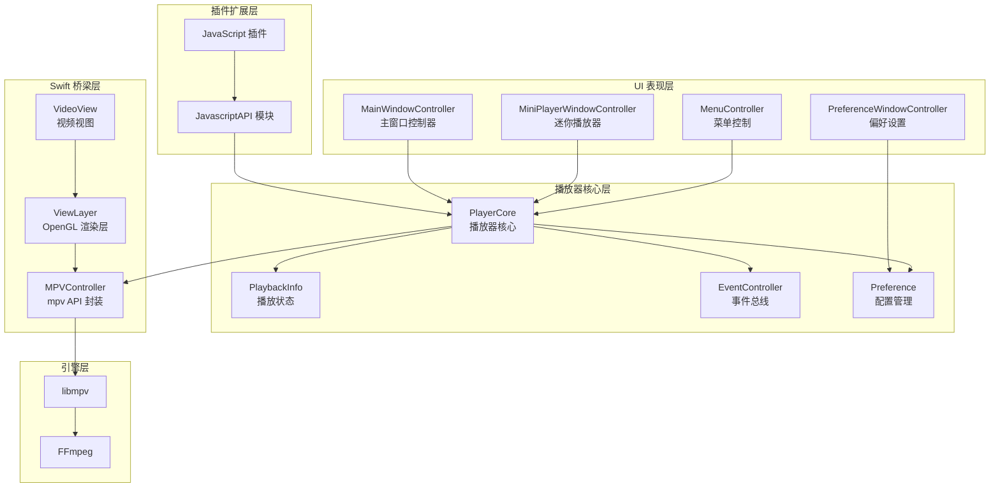
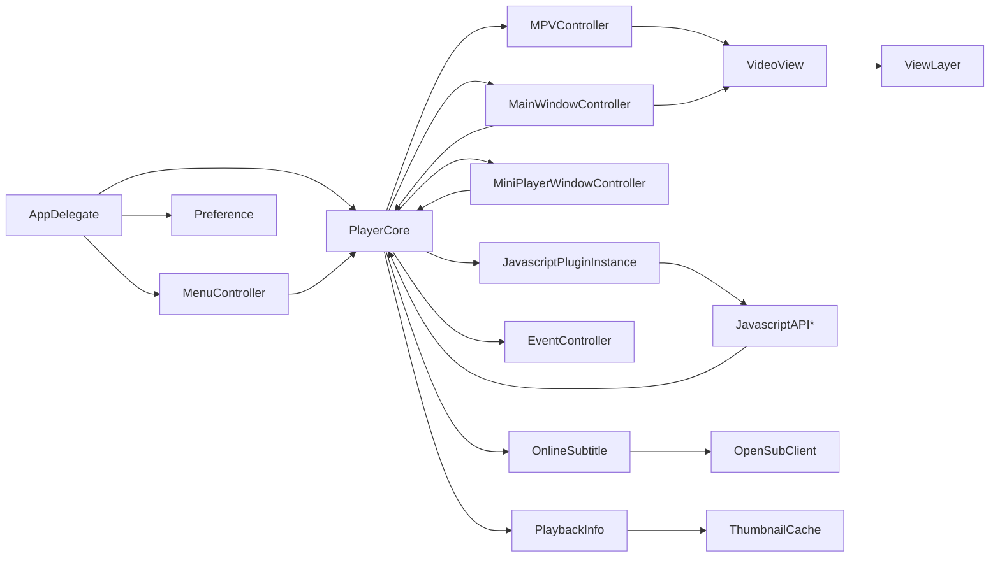
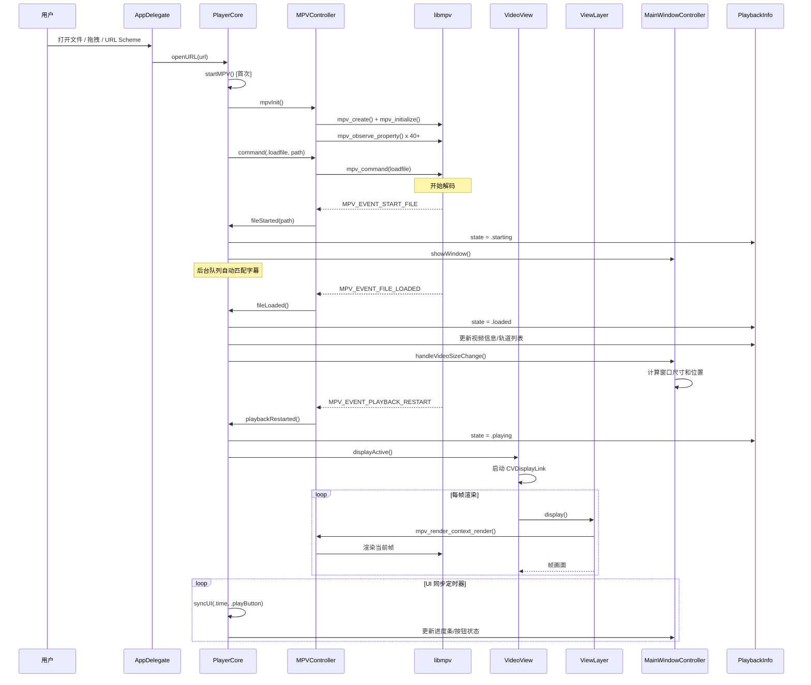
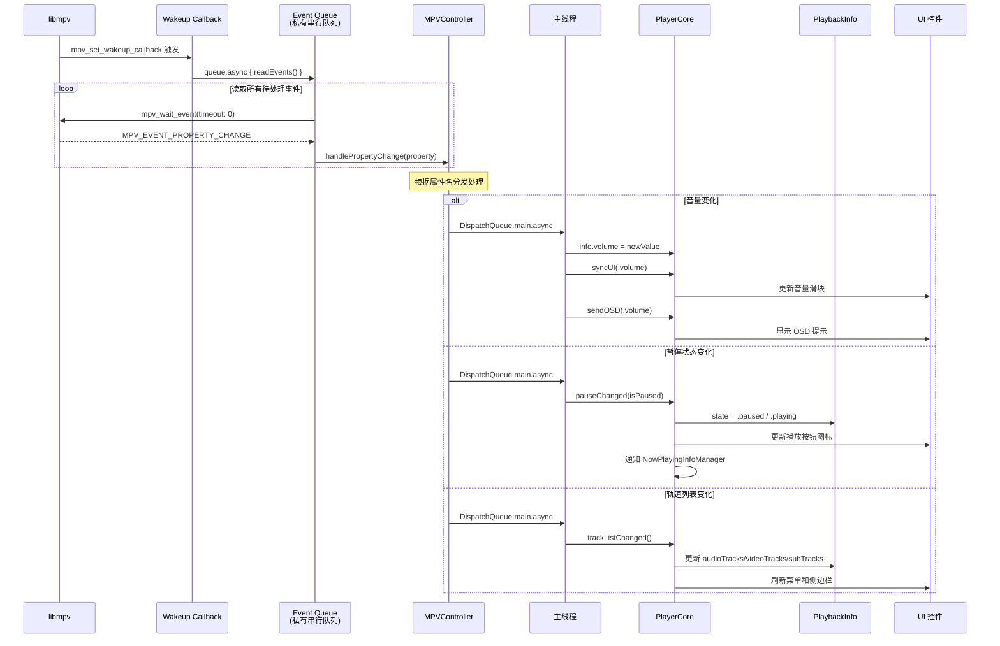

# iina 源码学习笔记

> 仓库地址：[iina](https://github.com/iina/iina)
> 学习日期：2026-04-05

---

> **以下为 AI 源码分析**
>
> ### 一句话概括
>
> IINA 是一个基于 mpv 的现代 macOS 视频播放器，通过 Swift 封装 libmpv C API，结合原生 Cocoa UI 和 JavaScript 插件系统，提供高性能、可扩展的多媒体播放体验。
>
> ### 要点速览
>
> | 核心模块 | 职责 | 关键文件 |
> |---------|------|---------|
> | PlayerCore | 播放器核心，封装播放控制、状态管理、多实例协调 | `PlayerCore.swift` |
> | MPVController | libmpv C API 的 Swift 桥梁，管理事件循环和属性监听 | `MPVController.swift` |
> | MainWindowController | 主窗口 UI 管理，全屏、PIP、OSC 控制栏 | `MainWindowController.swift` |
> | VideoView / ViewLayer | OpenGL 视频渲染层，HDR/EDR 支持 | `VideoView.swift`, `ViewLayer.swift` |
> | JavaScript Plugin | 基于 JavaScriptCore 的插件系统，15+ API 模块 | `JavascriptPlugin.swift`, `JavascriptAPI*.swift` |
> | AppDelegate | 应用生命周期、URL Scheme、命令行模式 | `AppDelegate.swift` |

---

## 项目简介

IINA 是专为 macOS 设计的现代视频播放器。它基于 mpv 播放引擎提供强大的解码能力，同时采用原生 Cocoa/AppKit UI 框架，完美融入 macOS 生态。项目解决的核心问题是在 macOS 上提供一个兼具强大解码能力（继承自 mpv/FFmpeg）和现代 UI 体验（Force Touch、Touch Bar、画中画、暗色模式）的开源播放器。其核心价值在于：高性能 mpv 内核 + 原生 macOS 交互体验 + JavaScript 插件生态扩展。

## 技术栈

| 类别 | 技术 |
|------|------|
| 语言 | Swift |
| 框架 | AppKit (Cocoa), JavaScriptCore, AVFoundation |
| 播放引擎 | mpv (libmpv) / FFmpeg |
| 渲染 | OpenGL (CAOpenGLLayer), CVDisplayLink |
| 构建工具 | Xcode / xcodeproj |
| 依赖管理 | 预编译 dylib（通过 `download_libs.sh` 下载）或 Homebrew/MacPorts |
| 更新框架 | Sparkle |
| 国际化 | Crowdin（30+ 种语言） |

## 目录结构

```
iina/
├── iina/                          # 主应用源码（180+ Swift 文件）
│   ├── AppDelegate.swift          # 应用入口和生命周期管理
│   ├── PlayerCore.swift           # 播放器核心逻辑
│   ├── MPVController.swift        # mpv C API 桥梁
│   ├── MainWindowController.swift # 主窗口控制器
│   ├── MiniPlayerWindowController.swift  # 迷你播放器（音乐模式）
│   ├── VideoView.swift            # 视频渲染视图
│   ├── ViewLayer.swift            # OpenGL 渲染层
│   ├── PlaybackInfo.swift         # 播放状态数据模型
│   ├── Preference.swift           # 偏好设置定义（60+ 枚举）
│   ├── MenuController.swift       # 菜单管理
│   ├── EventController.swift      # 事件发布-订阅系统
│   ├── Javascript*.swift          # JavaScript 插件系统（15+ 文件）
│   ├── MPVOption.swift            # mpv 选项定义（自动生成）
│   ├── MPVProperty.swift          # mpv 属性定义（自动生成）
│   ├── MPVCommand.swift           # mpv 命令定义（自动生成）
│   └── *.lproj/                   # 国际化资源
├── iina-cli/                      # 命令行工具（iina CLI）
│   └── main.swift
├── iina-plugin/                   # 插件 host 辅助模块
│   └── main.swift
├── OpenInIINA/                    # Safari 扩展（Open in IINA）
│   ├── SafariExtensionHandler.swift
│   └── open-in-iina.js
├── browser/                       # Chrome/Firefox 浏览器扩展
├── Configs/                       # Xcode 构建配置
├── deps/                          # 预编译依赖头文件
│   └── include/
├── other/                         # 构建辅助脚本
│   ├── download_libs.sh           # 下载预编译 dylib
│   ├── parse_doc.rb               # 生成 MPV 选项/属性/命令 Swift 文件
│   └── change_lib_dependencies.rb # 部署依赖库
└── iina.xcodeproj                 # Xcode 项目文件
```

## 架构设计

### 整体架构

IINA 采用**分层架构**，从底到顶为：mpv/FFmpeg 引擎层 → Swift 桥梁层 → 播放器核心层 → UI 表现层 → 插件扩展层。核心设计原则是"只有 `VideoView` 和 `MPVController` 可以直接调用 mpv API"，其余模块通过 `PlayerCore` 间接交互。



### 核心模块

#### 1. PlayerCore — 播放器核心

**职责：** 作为应用层与 mpv 引擎之间的中心控制器，封装所有播放控制逻辑，管理多播放器实例。

**核心文件：** `PlayerCore.swift`（3095 行）

**关键接口：**
- 多实例管理：`static var playerCores`, `static var active`, `static var newPlayerCore`
- 播放控制：`pause()`, `resume()`, `stop()`, `seek()`, `togglePause()`
- 文件加载：`openURL()`, `openURLs()`, `fileStarted()`, `fileLoaded()`
- 播放列表：`appendToPlaylist()`, `playlistMove()`, `playlistRemove()`
- 字幕管理：`loadExternalSubFile()`, `autoSearchOnlineSub()`
- 窗口切换：`switchToMiniPlayer()`, `switchBackFromMiniPlayer()`
- UI 同步：`syncUI()`, `refreshSyncUITimer()`

**关系：** 持有 `MPVController`、`MainWindowController`、`MiniPlayerWindowController`、`PlaybackInfo`、`EventController` 实例，是所有模块的交汇点。

#### 2. MPVController — mpv 引擎封装

**职责：** 将 libmpv 的 C API 封装为类型安全的 Swift 接口，管理事件循环、属性观察和渲染上下文。

**核心文件：** `MPVController.swift`（1843 行）

**关键接口：**
- 初始化：`mpvInit()`, `mpvInitRendering()`
- 属性操作：`getInt()`, `getDouble()`, `getFlag()`, `getString()`, `setFlag()`, `setInt()`, `setDouble()`
- 命令执行：`command()`, `asyncCommand()`, `command(rawString:)`
- 事件处理：`readEvents()`, `handleEvent()`, `handlePropertyChange()`
- 播放列表：`playlistAppend()`, `playlistMove()`, `playlistRemove()`

**关系：** 通过 `unowned let player: PlayerCore` 反向引用播放器核心（避免循环引用），在事件回调中通过 `DispatchQueue.main.async` 通知 PlayerCore。

#### 3. MainWindowController — 主窗口管理

**职责：** 管理主播放窗口的完整生命周期、UI 布局（三种 OSC 模式）、全屏切换、画中画、鼠标/键盘交互。

**核心文件：** `MainWindowController.swift`（3442 行）

**关键接口：**
- 生命周期：`windowDidLoad()`, `showWindow()`, `windowWillClose()`
- 全屏：`FullScreenState` 枚举，支持原生全屏和传统全屏
- PIP：`enterPIP()`, `exitPIP()`, `PIPStatus` 枚举
- OSC：`setupOnScreenController()` 支持 floating/top/bottom 三种布局
- 输入：`keyDown()`, `mouseDown()`, `scrollWheel()`, `pressureChange()`

**关系：** 继承自 `PlayerWindowController`，通过 `player` 属性访问 `PlayerCore`。

#### 4. VideoView / ViewLayer — 视频渲染

**职责：** `VideoView` 管理 CVDisplayLink 同步刷新和 HDR/EDR 模式检测；`ViewLayer` 实现底层 OpenGL 渲染、像素格式协商和多线程渲染同步。

**核心文件：** `VideoView.swift`（552 行）, `ViewLayer.swift`（500 行）

**关键接口：**
- `VideoView.displayActive()` / `displayIdle()` — 控制显示链路
- `ViewLayer.draw(in:)` — OpenGL 渲染入口
- `MainThreadPriorityLock` — 防止主线程饥饿的条件锁
- HDR 相关：`hdrAvailable`, `hdrEnabled`, `refreshEdrMode()`

#### 5. JavaScript 插件系统

**职责：** 基于 Apple JavaScriptCore 框架，为第三方插件提供 15+ 个 API 模块，支持播放控制、网络请求、文件操作、UI 扩展等功能。

**核心文件：** `JavascriptPlugin.swift`, `JavascriptPluginInstance.swift`, `JavascriptAPI.swift`, `JavascriptAPI*.swift`（15+ 文件）

**架构特点：**
- 每个插件、每个播放器实例独立 JSContext，互不影响
- 支持全局实例（globalEntry）和播放器实例（entry）两种模式
- 权限系统：5 种权限（`network-request`, `file-system`, `show-osd`, `show-alert`, `video-overlay`）
- 域名白名单控制网络访问
- 路径沙箱限制文件系统访问
- 通过 `@objc protocol + JSExport` 暴露 Swift API 给 JavaScript

**API 模块分类：**

| 模块 | 功能 | 权限要求 |
|------|------|---------|
| `iina.core` | 播放控制、窗口管理、状态查询 | 无 |
| `iina.mpv` | 直接访问 mpv 属性和命令 | 无 |
| `iina.event` | 事件监听和发布 | 无 |
| `iina.http` | HTTP 请求（GET/POST/PUT/DELETE） | `network-request` |
| `iina.file` | 文件读写、目录操作 | `file-system` |
| `iina.menu` | 菜单项管理 | 无 |
| `iina.overlay` | 视频叠加层（WebView） | `video-overlay` |
| `iina.sidebar` | 侧边栏自定义视图 | 无 |
| `iina.subtitle` | 字幕搜索和加载 | 无 |
| `iina.playlist` | 播放列表操作 | 无 |
| `iina.preferences` | 插件配置存储 | 无 |
| `iina.standaloneWindow` | 独立窗口 | 无 |
| `iina.ws` | WebSocket 通信 | `network-request` |

#### 6. PlaybackInfo — 播放状态模型

**职责：** 集中管理所有播放状态数据，包括视频信息、轨道列表、播放列表、缩略图缓存等，通过 `@Atomic` 属性包装器保证线程安全。

**核心文件：** `PlaybackInfo.swift`

**关键数据：**
- 状态机：`state: PlayerState`（idle → loading → starting → loaded → playing/paused → stopping → idle）
- 视频信息：`videoPosition`, `videoDuration`, `videoWidth`, `videoHeight`
- 轨道：`audioTracks`, `videoTracks`, `subTracks`（@Atomic）
- 播放列表：`playlist: [MPVPlaylistItem]`（@Atomic）

### 模块依赖关系



## 核心流程

### 流程一：视频文件播放流程

从用户打开文件到视频画面渲染的完整调用链：



**关键步骤说明：**

1. **文件入口多样**：支持 Finder 打开、拖拽、URL Scheme（`iina://open?url=...`）、命令行参数
2. **mpv 初始化**：首次播放时创建 mpv 实例，配置 100+ 选项（硬件解码、网络缓存、字幕渲染等）
3. **事件驱动**：mpv 通过 wakeup callback 通知 MPVController，在专用队列 `readEvents()` 快速读取，业务逻辑分发到主线程
4. **后台字幕**：`fileStarted()` 后在 `backgroundQueue` 中自动匹配同目录字幕文件和在线搜索
5. **渲染循环**：CVDisplayLink 以屏幕刷新率驱动 ViewLayer 调用 mpv 渲染上下文输出帧

### 流程二：mpv 属性变化事件处理流程

展示 mpv 内部状态变化如何传递到 UI 的事件驱动机制：



**关键设计：**

1. **快速事件循环**：事件队列使用 `mpv_wait_event(timeout: 0)` 非阻塞读取，避免队列溢出（mpv 事件队列有大小限制）
2. **线程隔离**：事件读取在私有串行队列，业务处理在主线程，严格分离避免竞态
3. **40+ 属性监听**：涵盖音量、进度、暂停、轨道、章节、视频参数等，每个属性有独立的处理逻辑
4. **级联更新**：状态变化通过 `syncUI()` 统一触发 UI 更新，通过 `sendOSD()` 触发屏幕提示

## 关键设计亮点

### 1. 事件驱动的 mpv 集成架构

**解决的问题：** 如何将 C 语言的 mpv 事件循环安全地集成到 Swift/Cocoa 应用中，同时避免事件队列溢出和线程安全问题。

**实现方式：**
- `MPVController` 使用 `mpv_set_wakeup_callback` 注册唤醒回调，在私有串行队列 `com.colliderli.iina.controller`（QoS: `.userInitiated`）中快速读取事件
- 所有业务处理通过 `DispatchQueue.main.async {}` 分发到主线程
- 日志级别固定为 `warn` 以防止事件队列被大量日志消息填满
- 40+ 个属性通过 `mpv_observe_property()` 注册观察

**设计优势：** 事件读取与业务处理完全解耦，既保证了 mpv 事件队列不会溢出（快速消费），又保证了 UI 操作在主线程执行（Cocoa 要求）。

### 2. 多实例播放器管理

**解决的问题：** 支持同时打开多个播放窗口，每个窗口独立的播放状态和 mpv 实例。

**实现方式（`PlayerCore.swift`）：**
- `static var playerCores: [PlayerCore]` 维护所有播放器实例
- `static var active: PlayerCore` 追踪当前活跃播放器
- 每个 `PlayerCore` 拥有独立的 `MPVController`、`MainWindowController`、`PlaybackInfo`
- 通过 `@Atomic` 属性包装器保护共享状态的线程安全
- 使用 `backgroundQueueTicket` 工作票证机制取消过期的异步任务

**设计优势：** 完全隔离的实例模型避免了状态串扰，工作票证模式优雅地处理了文件切换时的任务取消问题。

### 3. 可组合的 OSC 控制栏系统

**解决的问题：** 用户希望自定义控制栏的位置（浮动/顶部/底部）和按钮组合。

**实现方式（`MainWindowController.swift`）：**
- 将控制栏拆分为可复用的 Fragment View：`fragControlView`、`fragToolbarView`、`fragVolumeView`、`fragSliderView`
- `setupOnScreenController()` 根据用户偏好，将 Fragment View 重新组装到不同的容器中
- 工具栏按钮通过 `setupOSCToolbarButtons()` 动态创建，支持用户自定义按钮集合
- 使用 `fadeableViews` 数组管理自动隐藏动画

**设计优势：** Fragment 化设计让三种布局模式共享相同的 UI 组件代码，避免了大量重复实现。

### 4. 沙箱化的 JavaScript 插件系统

**解决的问题：** 如何在保证安全性的前提下，为第三方插件提供强大的扩展能力。

**实现方式（`JavascriptPlugin*.swift`, `JavascriptAPI*.swift`）：**
- 每个插件在独立的 JSContext 中运行，通过 `@objc protocol + JSExport` 暴露 Swift API
- 5 级权限模型（`network-request`, `file-system`, `show-osd`, `show-alert`, `video-overlay`），危险权限需用户确认
- 域名白名单（`allowedDomains`）限制网络访问范围
- 路径沙箱：`@data/`, `@tmp/`, `@current/` 等特殊前缀限制文件访问范围，并防止 `../` 逃逸
- 全局异常处理器捕获所有 JavaScript 异常，不影响主应用稳定性

**设计优势：** 多层安全机制（权限 + 域名白名单 + 路径沙箱 + 进程隔离）在不牺牲功能性的前提下保障了应用安全。

### 5. 优雅的应用终止序列

**解决的问题：** 应用退出时需要安全地关闭多个播放器实例、保存播放历史、登出在线服务，且不能无限等待。

**实现方式（`AppDelegate.swift`）：**
- `applicationShouldTerminate()` 启动长期关闭序列：
  1. 立即禁用所有菜单和 Dock 菜单
  2. 禁用远程命令控制
  3. 并行等待：在线字幕服务登出（9 秒超时）、所有播放器停止和关闭、播放历史保存完成
  4. 通过 NotificationCenter 监听 `.iinaPlayerStopped`、`.iinaPlayerShutdown`、`.iinaLogoutCompleted`、`.iinaHistoryTaskFinished`
  5. 全局 10 秒超时保底，防止无限等待
- 使用 `NSApplication.TerminateReply.terminateLater` 延迟终止，异步完成后调用 `reply(toApplicationShouldTerminate: true)`

**设计优势：** 并行等待 + 超时保底 + 事件驱动的异步模式，既保证了数据安全保存，又避免了应用"卡死退不出"的问题。
