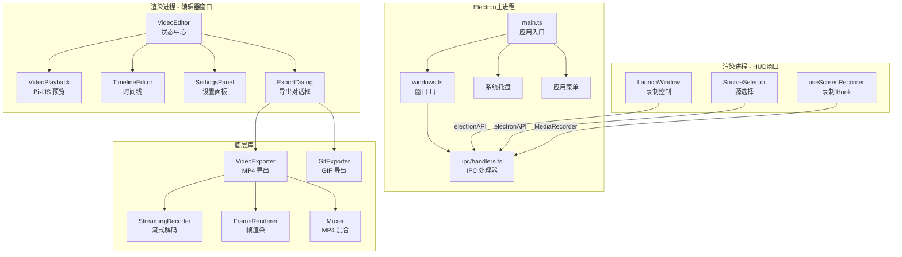
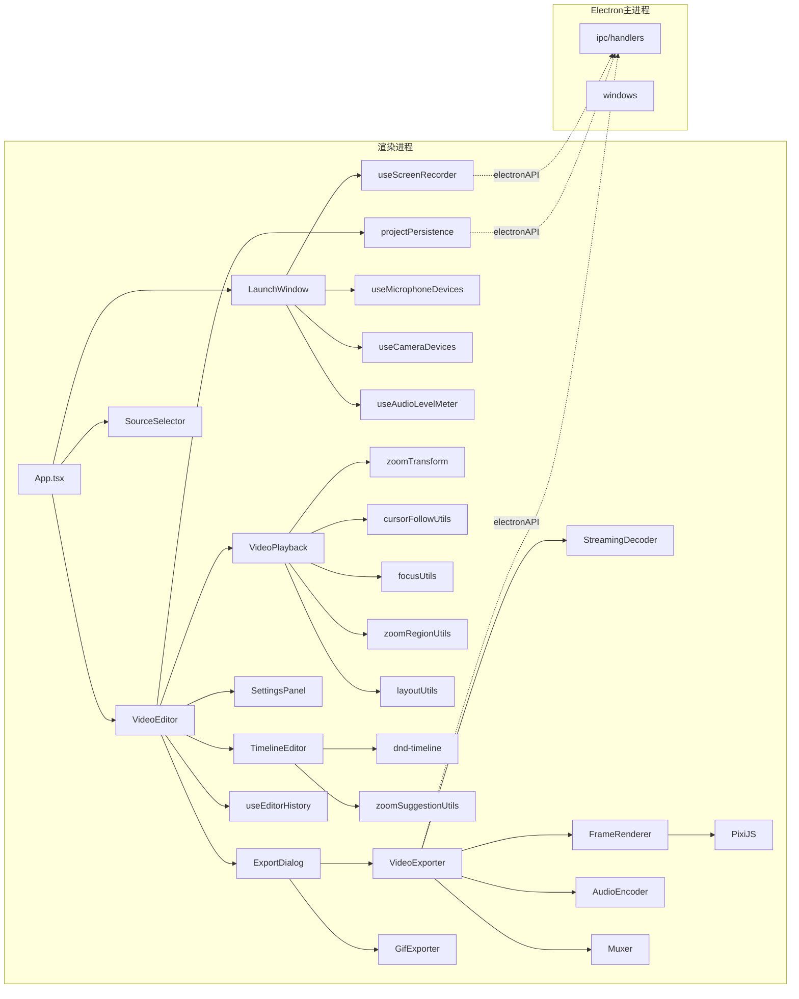
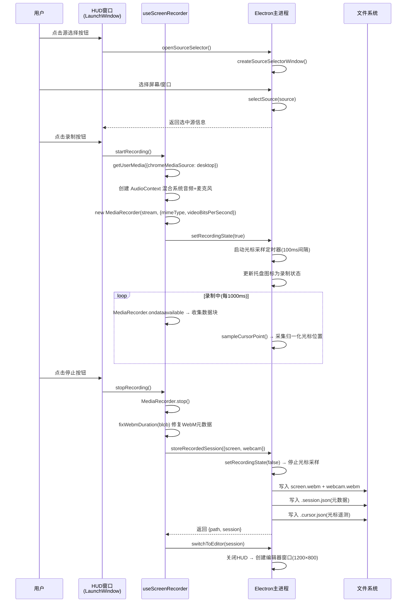
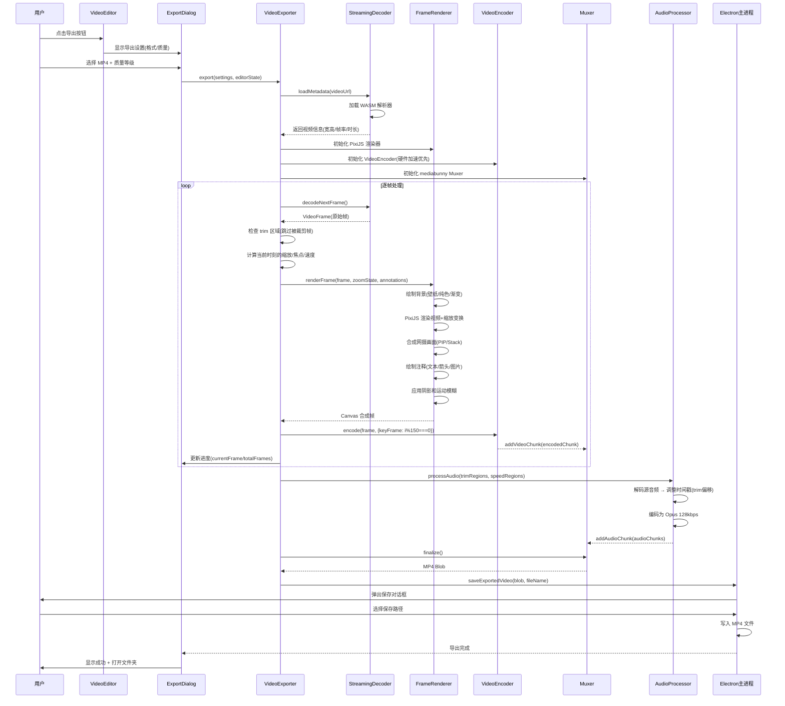

# OpenScreen 源码学习笔记

> 仓库地址：[openscreen](https://github.com/siddharthvaddem/openscreen)
> 学习日期：2026-04-05

---

> **以下为 AI 源码分析**
>
> ### 一句话概括
>
> OpenScreen 是一个基于 Electron + React + PixiJS 的开源屏幕录制与视频编辑桌面应用，提供录屏、缩放聚焦、注释标注、裁剪、变速等后期编辑功能，定位为 Screen Studio 的免费替代品。
>
> ### 要点速览
>
> | 核心模块 | 职责 | 关键文件 |
> |---------|------|---------|
> | Electron 主进程 | 窗口管理、系统权限、IPC 通信、文件 I/O、光标采样 | `electron/main.ts`, `electron/ipc/handlers.ts` |
> | 启动窗口 (LaunchWindow) | 录屏源选择、设备配置、录制控制 | `src/components/launch/LaunchWindow.tsx` |
> | 视频编辑器 (VideoEditor) | 编辑状态管理中心、协调所有子组件 | `src/components/video-editor/VideoEditor.tsx` |
> | 视频回放 (VideoPlayback) | PixiJS WebGL 实时预览、缩放变换、注释渲染 | `src/components/video-editor/VideoPlayback.tsx` |
> | 时间线编辑器 (TimelineEditor) | 拖放式缩放/裁剪/注释/变速区域管理 | `src/components/video-editor/timeline/` |
> | 导出管线 (Exporter) | 流式解码→帧渲染→编码→混合的完整视频导出链 | `src/lib/exporter/` |
> | 录制会话 (useScreenRecorder) | 屏幕/音频/网摄流采集与 MediaRecorder 管理 | `src/hooks/useScreenRecorder.ts` |

---

## 项目简介

OpenScreen 是一款免费开源的屏幕录制与视频编辑桌面应用，旨在为不想支付 Screen Studio 订阅费的用户提供一个功能够用的替代方案。它支持全屏或窗口录制、麦克风和系统音频采集、自动/手动缩放聚焦、注释标注（文本/箭头/图片）、视频裁剪、播放变速、背景定制等后期编辑功能，并可导出为 MP4 或 GIF 格式。项目采用 Electron 跨平台架构，支持 macOS、Windows 和 Linux。

## 技术栈

| 类别 | 技术 |
|------|------|
| 语言 | TypeScript |
| 框架 | React 18 + Electron 39 |
| 构建工具 | Vite 5 + vite-plugin-electron + electron-builder |
| 依赖管理 | npm 10.9.4 (Node.js 22) |
| 测试框架 | Vitest + Playwright (E2E) + Testing Library |
| 渲染引擎 | PixiJS 8 (WebGL) |
| 样式 | Tailwind CSS 3 + Shadcn/ui (Radix UI) |
| 代码规范 | Biome + Husky + lint-staged |
| 视频处理 | WebCodecs API + web-demuxer + mediabunny (MP4 muxer) + gif.js |
| UI 组件 | dnd-timeline (时间线拖放) + react-rnd (注释拖拽) + motion (动画) |

## 目录结构

```
openscreen/
├── electron/                     # Electron 主进程
│   ├── main.ts                   # 主进程入口：窗口管理、菜单、托盘、权限
│   ├── preload.ts                # 预加载脚本：暴露 electronAPI 给渲染进程
│   ├── windows.ts                # 窗口工厂：HUD/编辑器/源选择三种窗口
│   ├── ipc/handlers.ts           # IPC 处理器：录制存储、光标采样、文件操作
│   └── i18n.ts                   # 主进程国际化翻译
├── src/                          # 渲染进程 (React)
│   ├── main.tsx                  # React 入口
│   ├── App.tsx                   # 根组件：按 windowType 路由到不同页面
│   ├── components/
│   │   ├── launch/               # 启动窗口组件
│   │   │   ├── LaunchWindow.tsx  # HUD 悬浮录制控制面板
│   │   │   └── SourceSelector.tsx # 录屏源选择窗口
│   │   ├── video-editor/         # 视频编辑器组件
│   │   │   ├── VideoEditor.tsx   # 编辑器主组件（状态中心）
│   │   │   ├── VideoPlayback.tsx # PixiJS 视频预览与缩放渲染
│   │   │   ├── PlaybackControls.tsx # 播放/暂停/进度控制
│   │   │   ├── SettingsPanel.tsx # 右侧设置面板
│   │   │   ├── ExportDialog.tsx  # 导出进度对话框
│   │   │   ├── AnnotationOverlay.tsx # 注释拖拽覆盖层
│   │   │   ├── CropControl.tsx   # 裁剪控制 Canvas
│   │   │   ├── timeline/         # 时间线子组件
│   │   │   │   ├── TimelineEditor.tsx # 时间线主容器
│   │   │   │   ├── TimelineWrapper.tsx # dnd-timeline 上下文
│   │   │   │   ├── Item.tsx      # 时间线项（可拖放）
│   │   │   │   ├── Row.tsx       # 行容器
│   │   │   │   └── zoomSuggestionUtils.ts # 自动缩放建议算法
│   │   │   ├── videoPlayback/    # 视频播放工具函数
│   │   │   │   ├── zoomTransform.ts # 缩放变换计算
│   │   │   │   ├── cursorFollowUtils.ts # 光标跟随插值
│   │   │   │   ├── focusUtils.ts # 焦点约束与边界
│   │   │   │   ├── zoomRegionUtils.ts # 缩放区域强度与过渡
│   │   │   │   └── layoutUtils.ts # 视频布局计算
│   │   │   └── projectPersistence.ts # 项目文件序列化/反序列化
│   │   └── ui/                   # 通用 UI 组件 (Shadcn/ui)
│   ├── hooks/                    # 自定义 Hooks
│   │   ├── useScreenRecorder.ts  # 屏幕录制核心 Hook
│   │   ├── useEditorHistory.ts   # 撤销/重做历史管理
│   │   ├── useCameraDevices.ts   # 摄像头设备枚举
│   │   ├── useMicrophoneDevices.ts # 麦克风设备枚举
│   │   └── useAudioLevelMeter.ts # 音频电平表
│   ├── lib/                      # 底层库
│   │   ├── exporter/             # 视频导出管线
│   │   │   ├── videoExporter.ts  # MP4 导出器（流式解码→渲染→编码→混合）
│   │   │   ├── gifExporter.ts    # GIF 导出器
│   │   │   ├── frameRenderer.ts  # 帧渲染器（背景+视频+注释合成）
│   │   │   ├── streamingDecoder.ts # 流式视频解码器 (web-demuxer)
│   │   │   ├── audioEncoder.ts   # 音频编码（Opus）
│   │   │   └── muxer.ts          # MP4 容器混合 (mediabunny)
│   │   ├── recordingSession.ts   # 录制会话数据结构
│   │   ├── compositeLayout.ts    # 网摄/屏幕合成布局计算
│   │   └── shortcuts.ts          # 快捷键定义与冲突检测
│   ├── contexts/                 # React Context
│   │   ├── I18nContext.tsx        # 国际化（en/zh-CN/es）
│   │   └── ShortcutsContext.tsx   # 快捷键配置
│   ├── utils/                    # 工具函数
│   │   ├── aspectRatioUtils.ts   # 宽高比计算
│   │   ├── timeUtils.ts          # 时间格式化
│   │   └── platformUtils.ts      # 平台检测
│   └── i18n/                     # 国际化资源
│       └── locales/              # 翻译文件 (JSON)
├── public/                       # 静态资源
│   ├── wasm/                     # WebAssembly 模块（web-demuxer）
│   └── wallpapers/               # 背景壁纸图片
├── tests/                        # 测试目录
├── vite.config.ts                # Vite + Electron 插件配置
├── electron-builder.json5        # Electron 打包配置（Mac/Win/Linux）
└── package.json                  # 项目依赖与脚本
```

## 架构设计

### 整体架构

OpenScreen 采用 Electron 的 **主进程 + 渲染进程** 分离架构。主进程负责系统级操作（窗口管理、权限、文件 I/O、光标采样），渲染进程负责 UI 和视频处理。两者通过 IPC 通信桥接，preload 脚本通过 `contextBridge` 暴露安全 API。

应用有三种窗口形态：HUD 悬浮窗（录制控制）、源选择窗口、编辑器窗口。录制完成后自动切换到编辑器。

渲染进程采用 React 18 + Context API 的轻量级状态管理方案（无 Redux），核心编辑状态通过 `useEditorHistory` Hook 实现撤销/重做。视频预览使用 PixiJS WebGL 渲染以获得高性能实时缩放和效果。



### 核心模块

#### 1. Electron 主进程 (`electron/`)

**职责**：系统级操作中枢，管理应用生命周期、窗口、权限、文件 I/O 和光标遥测采样。

**核心文件**：
- `main.ts` — 应用入口，包含窗口创建、菜单构建、托盘管理、权限配置
- `ipc/handlers.ts` — 注册 45+ IPC 通道，处理录制存储、光标采样、项目文件、导出等
- `windows.ts` — 三种窗口的工厂函数（HUD 600×160 置顶透明、编辑器 1200×800 可调、源选择 620×420）
- `preload.ts` — 通过 `contextBridge.exposeInMainWorld()` 暴露 `electronAPI` 对象

**关键设计**：
- 光标采样：录制期间每 100ms 采集一次 `screen.getCursorScreenPoint()`，归一化为 0-1 坐标，上限 36000 个样本
- 录制存储结构：每次录制生成 `.webm`（视频）+ `.session.json`（元数据）+ `.cursor.json`（光标遥测）
- 安全机制：`contextIsolation: true`、路径信任检查 `isTrustedProjectPath()`

#### 2. 录制系统 (`src/hooks/useScreenRecorder.ts`)

**职责**：管理完整的屏幕录制生命周期，包括媒体流获取、音频混合、编码配置、录制状态管理。

**关键接口**：
- `startRecording()` — 获取屏幕流（最高 4K 60fps）、可选麦克风流和网摄流，创建 MediaRecorder
- `stopRecording()` — 停止录制，调用 `fixWebmDuration()` 修复 WebM 元数据，通过 IPC 存储会话
- `restartRecording()` — 标记当前录制为废弃，无缝启动新录制

**音频混合逻辑**：当同时启用系统音频和麦克风时，使用 `AudioContext` 混合两路音源，麦克风增益 1.4 倍。

**码率策略**：根据分辨率动态计算（4K: 45 Mbps, QHD: 28 Mbps, 1080p: 18 Mbps），高帧率（≥60fps）额外乘以 1.7 倍。

#### 3. 视频编辑器 (`src/components/video-editor/VideoEditor.tsx`)

**职责**：整个编辑器的状态管理中心，协调 VideoPlayback、TimelineEditor、SettingsPanel、ExportDialog 等子组件的数据流。

**核心状态**（通过 `useEditorHistory` Hook 管理，支持撤销/重做）：
```typescript
EditorState {
  zoomRegions: ZoomRegion[]          // 缩放区域（自动/手动焦点）
  trimRegions: TrimRegion[]          // 裁剪区域
  speedRegions: SpeedRegion[]        // 变速区域（0.25x-2x）
  annotationRegions: AnnotationRegion[]  // 注释（文本/图像/箭头）
  cropRegion: CropRegion             // 画面裁剪（归一化 0-1）
  wallpaper: string                  // 背景（壁纸/纯色/渐变）
  shadowIntensity / motionBlurAmount / borderRadius / padding ...
}
```

**状态更新策略**：离散操作用 `pushState()`（创建历史快照），连续操作（拖拽/滑块）用 `updateState()`（延迟快照），最大历史栈 80 个。

#### 4. 视频预览与缩放 (`src/components/video-editor/VideoPlayback.tsx` + `videoPlayback/`)

**职责**：使用 PixiJS WebGL 引擎实时渲染视频预览，应用缩放变换、光标跟随、运动模糊等效果。

**缩放变换核心** (`zoomTransform.ts`)：
- `computeZoomTransform()` — 根据焦点位置和缩放深度（1.25x-5x）计算平移+缩放矩阵，使焦点居中
- 缩放进入/退出过渡窗口分别为 1522ms 和 1015ms，使用 `easeOutScreenStudio` 曲线
- 相邻缩放区域间隔 <1500ms 时自动连接过渡

**光标跟随** (`cursorFollowUtils.ts`)：
- 二分查找 + 线性插值从遥测数据获取任意时刻光标位置
- 自适应指数平滑：距离远时快速跟随，距离近时缓慢减速
- 平移死区 1.25px，缩放死区 0.002 以避免微抖

#### 5. 时间线系统 (`src/components/video-editor/timeline/`)

**职责**：基于 `dnd-timeline` 库的拖放式多行时间线编辑器，管理缩放/裁剪/注释/变速四类区域。

**关键组件**：
- `TimelineWrapper` — 提供 dnd-timeline Context，处理拖拽事件、区域重叠防护、边界约束
- `TimelineEditor` — 主容器，包含四行区域 + 时间刻度 + 关键帧标记
- `Item` — 单个可拖放的时间区域，支持拖拽移动和调整时长
- `zoomSuggestionUtils.ts` — 分析光标遥测数据检测 450ms-2600ms 的驻留点，自动建议缩放区域

#### 6. 导出管线 (`src/lib/exporter/`)

**职责**：完整的视频导出处理链，从解码到渲染到编码到混合。

**MP4 导出链路**：
```
StreamingVideoDecoder (web-demuxer + WebCodecs VideoDecoder)
  → FrameRenderer (PixiJS 渲染：背景+视频+缩放+注释+阴影+网摄合成)
  → VideoEncoder (硬件加速优先：H.264 > VP9 > AV1，失败回退软件)
  → VideoMuxer (mediabunny MP4 容器化)
  + AudioProcessor (Opus 128kbps，支持变速保音调)
```

**帧渲染器** (`frameRenderer.ts`)：双 Canvas 合成——独立背景 Canvas（壁纸/纯色/渐变）+ PixiJS Canvas（视频+缩放+模糊）+ 2D Canvas（阴影+注释叠加）。

**GIF 导出**：使用 gif.js Web Worker 多线程编码，最多 8 核并发，支持 Floyd-Steinberg 抖动。

### 模块依赖关系



## 核心流程

### 流程一：屏幕录制与存储

从用户选择录制源到录制完成并切换到编辑器的完整流程。



**关键逻辑说明**：
1. 屏幕流最高支持 4K 60fps，码率根据分辨率动态计算（18-45 Mbps）
2. 麦克风通过 AudioContext GainNode 增益 1.4 倍后与系统音频混合
3. 网摄流独立录制为 `-webcam.webm` 文件，1280×720 30fps
4. 光标遥测数据归一化为 0-1 坐标，每 100ms 采样一次，上限 36000 个样本
5. `fixWebmDuration()` 解决 Chrome MediaRecorder 生成的 WebM 缺少 duration 元数据的问题

### 流程二：视频导出 (MP4)

从用户点击导出到生成最终 MP4 文件的完整处理管线。



**关键逻辑说明**：
1. **编码器容错**：优先尝试硬件加速（Windows 优先软件、其他平台优先硬件），失败后自动切换。编码超时 15 秒触发降级
2. **帧队列管理**：编码队列限制硬件 120 帧/软件 32 帧，队列满时等待 5ms 实现背压控制
3. **帧渲染器双 Canvas 合成**：独立背景 Canvas + PixiJS Canvas + 2D Canvas（阴影/注释），避免缩放变换影响背景
4. **音频双路径**：无变速时快速路径（直接 trim + 重编码），有变速时通过 `HTMLMediaElement.playbackRate` 保持音调
5. **I 帧策略**：每 150 帧插入一个关键帧，平衡文件大小和 seek 性能

## 关键设计亮点

### 1. 自适应光标跟随与缩放聚焦

**解决的问题**：录制产品演示时，需要自动追踪鼠标位置进行缩放聚焦，但原始光标数据有高频抖动，直接应用会导致画面不稳定。

**实现方式**：
- `cursorFollowUtils.ts` — 二分查找 + 线性插值获取任意时刻光标位置
- `focusUtils.ts` — 自适应指数平滑算法：距离远时使用较大平滑因子（快速跟随，因子 0.25），距离近时使用较小因子（缓慢减速，因子 0.1），通过 `adaptiveSmoothFactor()` 根据距离动态插值
- `zoomRegionUtils.ts` — 相邻缩放区域间隔 <1500ms 时自动连接，使用三次贝塞尔曲线 `(0.1, 0.0, 0.2, 1.0)` 实现 1000ms 平滑焦点过渡
- 死区设计：平移死区 1.25px、缩放死区 0.002，过滤微小运动避免画面抖动

**为什么这样设计**：模仿 Screen Studio 的专业缩放效果，让自动跟随感觉自然——快速移动时及时跟上，停下来时平稳减速而非突然停止。连接过渡避免了相邻缩放区域之间"缩小再放大"的突兀感。

### 2. 流式视频导出管线与编码器容错

**解决的问题**：需要对录屏视频逐帧施加缩放/注释/背景等效果后重新编码导出，同时避免将整个视频加载到内存。

**实现方式**：
- `streamingDecoder.ts` — 基于 `web-demuxer` WASM 库实现流式解码，按需从 Blob URL 拉取视频帧
- `videoExporter.ts` — 多层容错机制：优先硬件编码 → 15 秒超时自动切换软件编码 → 编码队列背压控制（硬件 120/软件 32）
- `frameRenderer.ts` — 双 Canvas 架构：背景 Canvas 独立于 PixiJS Canvas，避免缩放变换影响背景绘制
- `muxer.ts` — mediabunny MP4 muxer，fastStart 模式边编码边计算索引

**为什么这样设计**：WebCodecs API 的硬件加速支持因平台/驱动差异极大（Windows 硬件编码反而更慢），采用"尝试 + 降级"策略比静态检测更可靠。流式处理 + 背压控制保证了大视频文件的内存安全。

### 3. 撤销/重做的双更新模式

**解决的问题**：视频编辑器中既有离散操作（添加/删除区域）又有连续操作（拖拽滑块调整参数），传统的"每次变更创建快照"会导致历史栈被拖拽产生的大量中间状态填满。

**实现方式** (`useEditorHistory.ts`)：
- `pushState(newState)` — 离散操作：立即创建历史快照
- `updateState(newState)` — 连续操作：首次调用时自动保存前一个状态为 checkpoint，后续只更新当前值不创建快照
- `commitState()` — 拖拽结束时提交，将累积的更新固化
- 历史栈上限 80 个快照

**为什么这样设计**：用户拖拽滑块从 0 到 100 只应产生一条撤销记录（从 0 到 100），而非 100 条中间记录。双更新模式在保持实时预览的同时，确保撤销粒度与用户操作意图一致。

### 4. 基于光标驻留的智能缩放建议

**解决的问题**：手动为每个需要缩放的位置添加缩放区域非常繁琐，用户希望系统能自动识别"值得缩放"的位置。

**实现方式** (`zoomSuggestionUtils.ts`)：
- 分析光标遥测数据中的驻留点：计算相邻样本的位移距离，距离 > 0.02（归一化坐标）视为移动边界
- 收集连续的"停留段"，过滤条件：段长 ≥ 2 个样本、时长 450ms-2600ms
- 计算每段的平均焦点位置作为缩放中心，段时长作为优先级权重
- 在时间线上以绿色标记展示建议，用户点击即可一键添加

**为什么这样设计**：屏幕录制中，用户在某处停留一段时间通常意味着正在展示重要内容（点击按钮、阅读文本），这与需要缩放聚焦的区域高度吻合。450ms-2600ms 的阈值排除了无意义的短暂停顿和长时间不动的空闲段。

### 5. 项目持久化与跨平台路径安全

**解决的问题**：编辑项目需要保存和加载，涉及跨平台文件路径、数据校验、版本兼容和安全写入。

**实现方式** (`projectPersistence.ts` + `ipc/handlers.ts`)：
- 路径转换：`toFileUrl()` / `fromFileUrl()` 处理 Windows/Unix/UNC 路径与 `file://` URL 的双向转换
- 数据校验：`normalizeProjectEditor()` 对每个字段做类型检查、范围约束、枚举验证，非法值自动回退到默认值
- 安全机制：主进程维护 `currentProjectPath`，写入操作通过 `isTrustedProjectPath()` 验证，防止渲染进程注入任意路径
- 版本管理：项目文件携带 `version` 字段（当前 v2），支持从旧版本升级

**为什么这样设计**：Electron 应用的渲染进程可被视为半信任环境，通过路径信任检查防止恶意或意外的文件覆盖。归一化校验确保加载损坏项目文件时不会崩溃而是优雅降级。
