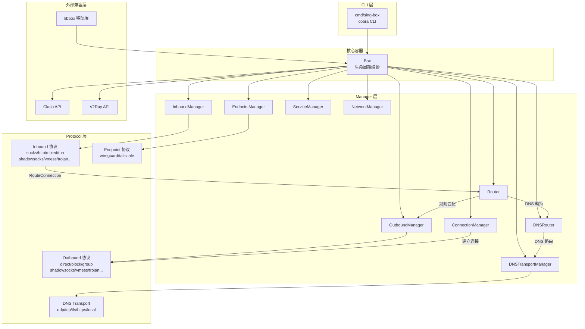
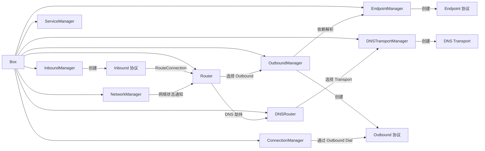
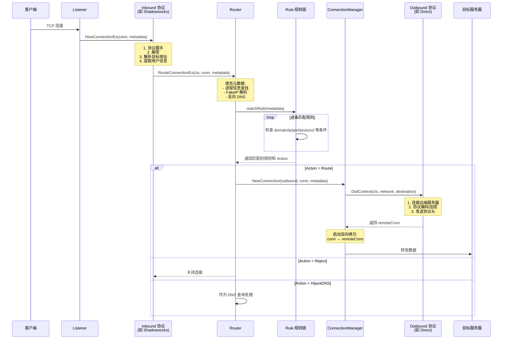
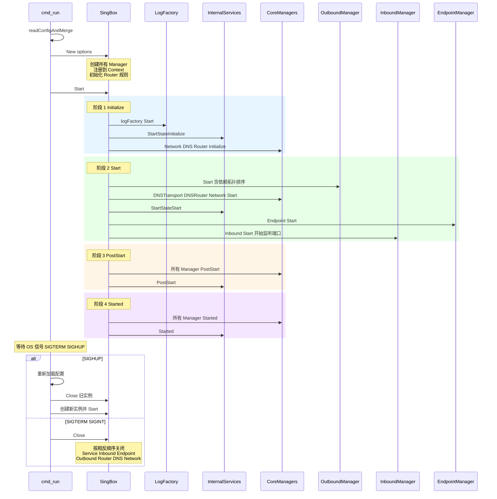

# sing-box 源码学习笔记

> 仓库地址：[sing-box](https://github.com/SagerNet/sing-box)
> 学习日期：2026-04-05

---

> **以下为 AI 源码分析**
>
> ### 一句话概括
>
> sing-box 是一个用 Go 编写的通用代理平台，通过模块化的 Registry + Manager 架构支持 25+ 种代理协议的统一调度与路由。
>
> ### 要点速览
>
> | 核心模块 | 职责 | 关键文件 |
> |---------|------|---------|
> | Box | 应用入口，组装所有管理器并协调生命周期 | `box.go` |
> | Adapter | 定义 Inbound/Outbound/Endpoint/Service 等核心接口 | `adapter/*.go` |
> | Protocol | 25+ 种代理协议的具体实现 | `protocol/*/` |
> | Route | 路由规则匹配与连接分发 | `route/router.go`, `route/route.go` |
> | DNS | DNS 查询路由与多种 DNS Transport | `dns/router.go`, `dns/transport/` |
> | Transport | V2Ray 系列传输层（WebSocket/gRPC/QUIC 等） | `transport/` |
> | Option | JSON 配置解析与 Registry 驱动的多态反序列化 | `option/` |
> | Experimental | Clash API / V2Ray API 兼容层 + 移动端集成 | `experimental/` |

---

## 项目简介

sing-box 是由 nekohasekai 开发的通用代理平台（The universal proxy platform），定位为下一代网络代理工具箱。它解决了代理协议碎片化的问题——不同的代理协议（Shadowsocks、VMess、Trojan、WireGuard 等）各自有独立的实现，用户需要在多个工具间切换。sing-box 将 25+ 种代理协议统一在一个框架下，通过灵活的路由规则引擎实现流量的智能分流，同时提供跨平台支持（Linux/macOS/Windows/Android/iOS），并兼容 Clash API 和 V2Ray API 生态。其核心价值在于：高度模块化的架构使新协议的接入只需实现接口并注册即可，无需修改核心逻辑。

## 技术栈

| 类别 | 技术 |
|------|------|
| 语言 | Go 1.24 |
| 框架 | 无特定 Web 框架，基于 `cobra` 构建 CLI，`go-chi` 提供 Clash API |
| 构建工具 | Go Modules + Build Tags 条件编译 |
| 依赖管理 | Go Modules (`go.mod`) |
| 测试框架 | Go 标准 `testing` + `testify` |

## 目录结构

```
sing-box/
├── cmd/sing-box/           # CLI 入口，cobra 子命令定义
│   ├── main.go             #   程序入口
│   ├── cmd.go              #   根命令 + preRun 初始化
│   └── cmd_run.go          #   run 子命令，配置读取与服务启动
├── box.go                  # 核心 Box 结构体，组装所有 Manager 并管理生命周期
├── adapter/                # 核心接口定义层
│   ├── inbound.go          #   Inbound 接口
│   ├── outbound.go         #   Outbound 接口 (含 N.Dialer)
│   ├── endpoint.go         #   Endpoint 接口 (Inbound + Outbound 混合)
│   ├── router.go           #   Router / ConnectionRouter 接口
│   ├── dns.go              #   DNSTransport / DNSRouter 接口
│   ├── lifecycle.go        #   4 阶段生命周期定义
│   ├── inbound/            #   Inbound Manager + Registry
│   ├── outbound/           #   Outbound Manager + Registry (含依赖拓扑排序)
│   ├── endpoint/           #   Endpoint Manager + Registry
│   └── service/            #   Service Manager + Registry
├── protocol/               # 25+ 种代理协议实现
│   ├── direct/             #   Direct 直连
│   ├── shadowsocks/        #   Shadowsocks (含多用户/中继)
│   ├── vmess/              #   VMess 协议
│   ├── vless/              #   VLESS 协议
│   ├── trojan/             #   Trojan 协议
│   ├── hysteria2/          #   Hysteria2 (QUIC-based)
│   ├── wireguard/          #   WireGuard Endpoint
│   ├── tun/                #   TUN 设备 Inbound
│   ├── group/              #   Selector / URLTest 出站分组
│   └── ...                 #   socks, http, mixed, ssh, tor, tuic, naive 等
├── route/                  # 路由引擎
│   ├── router.go           #   Router 实现
│   ├── route.go            #   路由匹配核心逻辑
│   ├── conn.go             #   ConnectionManager：TCP/UDP 连接建立与双向拷贝
│   ├── network.go          #   NetworkManager：网络接口监控与状态管理
│   ├── dns.go              #   DNS 劫持处理
│   └── rule/               #   50+ 种规则条件项实现
├── dns/                    # DNS 子系统
│   ├── router.go           #   DNS Router 实现
│   └── transport/          #   DNS Transport (UDP/TCP/TLS/HTTPS/Local)
├── transport/              # V2Ray 系列传输层
│   ├── v2raywebsocket/     #   WebSocket 传输
│   ├── v2rayhttp/          #   HTTP/2 传输
│   ├── v2raygrpc/          #   gRPC 传输
│   ├── v2rayquic/          #   QUIC 传输
│   ├── wireguard/          #   WireGuard 传输层
│   └── trojan/             #   Trojan 传输协议
├── option/                 # 配置结构定义 + Registry 驱动的多态 JSON 解析
├── include/                # 协议注册中心 + Build Tags 条件编译
│   ├── registry.go         #   核心注册入口
│   ├── quic.go             #   QUIC 系列协议（条件编译）
│   └── quic_stub.go        #   QUIC 缺失时的 stub
├── experimental/           # 实验性功能
│   ├── clashapi/           #   Clash API 兼容层
│   ├── v2rayapi/           #   V2Ray API 兼容层
│   ├── libbox/             #   移动端集成（Android/iOS FFI）
│   └── cachefile/          #   持久化缓存（FakeIP/RDRC）
├── common/                 # 通用工具（dialer、certificate、taskmonitor 等）
├── log/                    # 日志子系统
└── test/                   # 集成测试
```

## 架构设计

### 整体架构

sing-box 采用 **Registry + Manager + Adapter** 三层架构模式。最外层是 `Box` 容器，负责组装和协调所有子系统的生命周期；中间层是各类 Manager（Inbound/Outbound/Endpoint/DNS/Service），通过 Registry 模式动态创建协议实例；最内层是具体的协议实现，每个协议只需实现对应的 Adapter 接口并注册到 Registry 即可被框架调度。

数据流方向为：外部流量 → Inbound 解码 → Router 规则匹配 → Outbound 编码 → 目标服务器。DNS 查询有独立的路由子系统，支持按规则将 DNS 请求分发到不同的 DNS Transport。



### 核心模块

#### 1. Box 容器 (`box.go`)

**职责**：应用的核心编排器，负责创建所有 Manager 实例、注册到 Context 服务容器、按顺序启动和关闭所有子系统。

**核心文件**：
- `box.go` — Box 结构体定义、`New()` 构造函数、`Start()`/`Close()` 生命周期

**关键设计**：
- 采用 4 阶段启动：Initialize → Start → PostStart → Started，确保跨组件依赖（如 DNS 需在路由前就绪）
- 使用 `service.ContextWith` 将所有 Manager 注册到 context 中，实现 DI（依赖注入）
- 关闭时按相反顺序逐个关闭组件，每步带日志和耗时追踪

#### 2. Adapter 接口层 (`adapter/`)

**职责**：定义整个系统的核心抽象，所有协议实现都必须遵守这些接口契约。

**核心接口**：
- `Inbound`：入站处理器，实现 `Lifecycle` + `Type()`/`Tag()`
- `Outbound`：出站处理器，继承 `N.Dialer`（`DialContext`/`ListenPacket`）
- `Endpoint`：混合型组件（同时具备 Inbound 和 Outbound 能力）
- `Router`：路由决策引擎，实现 `ConnectionRouter`/`ConnectionRouterEx`
- `DNSTransport`：DNS 传输协议，核心方法 `Exchange(ctx, *dns.Msg) (*dns.Msg, error)`
- `InboundContext`：连接元数据载体，贯穿整个处理链

**Manager 模式**（每个子系统一致）：
- `Manager` 持有 `Registry`（协议工厂注册表）和 `items`（实例集合）
- 提供 `Create()`/`Get()`/`Remove()`/`Items()` CRUD 操作
- `OutboundManager` 额外实现了依赖拓扑排序和循环依赖检测

#### 3. Protocol 协议层 (`protocol/`)

**职责**：25+ 种代理协议的具体实现。

**支持的协议**：

| 分类 | 协议 |
|------|------|
| 基础代理 | direct, block, socks, http, mixed |
| 加密隧道 | shadowsocks, shadowtls, trojan, vmess, vless, anytls |
| QUIC 系列 | hysteria, hysteria2, tuic, naive |
| VPN | wireguard, tailscale |
| 特殊 | tun, ssh, tor, dns |
| 分组策略 | group (selector / urltest) |

**统一注册模式**：
```go
// 每个协议在 RegisterInbound/RegisterOutbound 中注册
func RegisterOutbound(registry *outbound.Registry) {
    outbound.Register[option.ShadowsocksOutboundOptions](
        registry, C.TypeShadowsocks, NewOutbound)
}
```

#### 4. Route 路由引擎 (`route/`)

**职责**：根据规则匹配将连接分发到正确的 Outbound。

**核心文件**：
- `route/router.go` — Router 实现，管理规则列表和 RuleSet
- `route/route.go` — `RouteConnection`/`matchRule` 核心匹配逻辑
- `route/conn.go` — ConnectionManager，TCP/UDP 双向拷贝
- `route/network.go` — NetworkManager，网络接口和状态监控
- `route/rule/` — 50+ 种规则条件项

**规则条件**：domain/domain_suffix/domain_keyword/domain_regex、ip_cidr、port/port_range、protocol、network、process_name/process_path、geoip、rule_set、clash_mode、wifi_ssid 等。

#### 5. DNS 子系统 (`dns/`)

**职责**：DNS 查询的独立路由系统，支持按规则将 DNS 请求分发到不同的 Transport。

**核心文件**：
- `dns/router.go` — DNS 路由器，规则匹配后选择 DNS Transport
- `dns/transport/` — UDP/TCP/TLS(DoT)/HTTPS(DoH)/Local 等传输协议
- `route/dns.go` — DNS 劫持处理（TCP stream / UDP packet）

#### 6. Transport 传输层 (`transport/`)

**职责**：为代理协议提供底层传输通道抽象。

**可用传输**：WebSocket、HTTP/2、gRPC、gRPC-Lite、QUIC、HTTP Upgrade、WireGuard、Trojan、SIP003。

### 模块依赖关系



## 核心流程

### 流程一：TCP 连接路由（Inbound → Router → Outbound）

这是 sing-box 最核心的数据流：一个外部连接如何从入站协议解码、经过路由匹配、最终通过出站协议转发到目标服务器。



**关键步骤说明**：

1. **Inbound 解码**（`protocol/*/inbound.go`）：每个协议在 `NewConnectionEx` 中完成握手和解密，将裸连接 + 目标地址交给 Router
2. **元数据填充**（`route/route.go`）：Router 在匹配前补充进程信息、GeoIP、FakeIP 解析等上下文
3. **规则匹配**（`route/rule/`）：按配置顺序逐条评估，支持 AND/OR 逻辑组合，首次匹配即返回
4. **连接建立**（`route/conn.go`）：ConnectionManager 通过 Outbound 的 `DialContext` 建立远端连接，然后启动 goroutine 进行双向数据拷贝

### 流程二：服务启动与 4 阶段生命周期

sing-box 的启动过程精心设计了 4 个阶段，确保各组件间的依赖关系得到满足。



**关键设计说明**：

1. **Initialize 阶段**：所有组件完成内部初始化（验证配置、准备资源），但不绑定端口或建立外部连接
2. **Start 阶段**：Outbound 率先启动（含依赖拓扑排序处理循环依赖），然后 DNS、Network 就绪，最后 Inbound 开始监听
3. **PostStart 阶段**：所有组件均已启动，执行需要跨组件交互的后续初始化
4. **Started 阶段**：最终确认就绪，触发完成钩子
5. **热重载**：收到 `SIGHUP` 信号后先校验新配置，然后关闭旧实例、创建并启动新实例

## 关键设计亮点

### 1. Registry + 泛型的插件式协议注册

**解决的问题**：如何在不修改核心代码的前提下支持 25+ 种代理协议？

**实现方式**：每个 Manager 持有一个 `Registry`，协议通过泛型函数 `Register[Options]()` 注册工厂函数。Registry 内部维护 `optionsType`（配置结构工厂）和 `constructor`（实例工厂）两个 map。配置解析时通过 `CreateOptions(type)` 获取类型对应的空配置结构，再反序列化 JSON；实例创建时通过 `Create(type, options)` 调用工厂函数。

**关键文件**：`adapter/outbound/registry.go`、`include/registry.go`

**为什么这样设计**：Go 语言没有传统的插件系统，通过 Registry 模式 + 泛型实现了编译时安全的协议注册。新增协议只需：(1) 实现 Adapter 接口 (2) 定义 Options 结构 (3) 调用 `Register[Options]()` 注册。核心框架零改动。

### 2. Build Tags 条件编译控制二进制体积

**解决的问题**：QUIC/WireGuard/Tailscale 等协议依赖庞大，全量编译会导致二进制过大。

**实现方式**：`include/` 目录下使用 `//go:build with_quic` 等 Build Tags 控制协议的编译包含。每个可选协议都有对应的 `_stub.go` 文件，在功能未启用时注册返回明确错误信息的 stub 实现（如 `ErrQUICNotIncluded`）。

**关键文件**：`include/quic.go`、`include/quic_stub.go`、`include/wireguard.go`

**为什么这样设计**：用户可根据实际需求定制编译，最小化二进制体积。stub 机制保证配置中引用了未编译协议时给出清晰错误提示而非 panic。

### 3. Outbound 依赖拓扑排序与循环检测

**解决的问题**：Outbound 之间存在依赖关系（如 proxy-chain: A → B → C），启动顺序必须正确。

**实现方式**：`OutboundManager.startOutbounds()` 实现了拓扑排序：维护 `dependByTag` 反向依赖图，逐轮启动无依赖项的 Outbound，已启动的从依赖图中移除。如果某轮没有新的 Outbound 可启动，说明存在循环依赖，会构建完整依赖链路报错（如 "A → B → C → A"）。

**关键文件**：`adapter/outbound/manager.go`

**为什么这样设计**：代理链是 sing-box 的核心功能，错误的启动顺序会导致连接失败。拓扑排序保证正确性，循环检测提供可读的诊断信息。

### 4. InboundContext 元数据贯穿与 Copy-on-Write

**解决的问题**：一个连接从 Inbound 到 Router 到 Outbound 需要携带大量元数据（源地址、目标地址、用户、协议类型、GeoIP、进程信息等），如何高效传递且避免跨请求污染？

**实现方式**：`adapter.InboundContext` 是一个扁平结构体（非指针嵌套），通过 `context.Context` 传递。关键函数 `ExtendContext()` 在需要修改元数据时先拷贝当前 context 再修改，实现 Copy-on-Write 语义。规则匹配结果通过 `ResetRuleCache()` / `ResetRuleMatchCache()` 管理缓存。

**关键文件**：`adapter/handler.go`（InboundContext 定义）、`route/route.go`（元数据填充）

**为什么这样设计**：扁平结构避免了指针追踪的 GC 压力，Copy-on-Write 防止并发请求间的数据污染，缓存机制避免重复的规则匹配计算。

### 5. Context Service 容器实现轻量 DI

**解决的问题**：十多个 Manager 之间存在复杂的相互引用关系，如何避免构造函数参数爆炸和循环依赖？

**实现方式**：利用 `github.com/sagernet/sing/service` 包，将所有 Manager 通过 `service.MustRegister[InterfaceType](ctx, impl)` 注册到 `context.Context` 中。任何组件需要引用其他 Manager 时，通过 `service.FromContext[InterfaceType](ctx)` 获取。这是一个基于 Go context 的轻量级服务定位器。

**关键文件**：`box.go`（`New()` 函数中大量 `service.MustRegister` 调用）

**为什么这样设计**：Go 没有成熟的 DI 框架，直接利用 context 的 value 传递机制实现服务注册与发现，零外部依赖，且天然支持请求级别的隔离。
